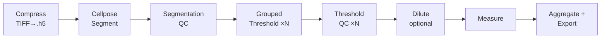

<p align="center">
  
</p>

# PerCell4

[](https://www.python.org/downloads/)
[](#installation)
[](#license)

**Single-cell FLIM microscopy analysis platform** — Cellpose segmentation, per-cell measurements, grouped thresholding, and phasor workflows in one Qt desktop app. Each experiment is one HDF5 file; results land as parquet + CSV ready for downstream analysis.

## Table of Contents

- [Tech Stack](#tech-stack)
- [Workflow Protocol](#workflow-protocol)
  - [Loading TIFF files](#loading-tiff-files)
  - [Channel, mask, and segmentation naming](#channel-mask-and-segmentation-naming)
  - [Step-by-step workflow walkthrough](#step-by-step-workflow-walkthrough)
  - [Batch TIFF export pointer](#batch-tiff-export-pointer)
- [Batch TIFF Export (CLI)](#batch-tiff-export-cli)
- [Features](#features)
- [Installation](#installation)
  - [macOS](#macos)
  - [Linux](#linux)
  - [Windows](#windows)
- [Install from a wheel](#install-from-a-wheel)
- [Optional extras](#optional-extras)
- [Standalone bundle (PyInstaller)](#standalone-bundle-pyinstaller)
- [Troubleshooting](#troubleshooting)
- [License](#license)

---

## Tech Stack

- **GUI:** Qt (PyQt5 + qtpy), napari (`>=0.5,<0.8`), pyqtgraph (`>=0.13,<0.15`)
- **Data:** HDF5 via h5py (`>=3.10,<4`), pandas (`>=2.0,<3`), pyarrow (`>=14`)
- **Imaging:** numpy (`>=1.26`), scikit-image (`>=0.22`), scipy (`>=1.12`), tifffile, sdtfile (Becker & Hickl FLIM)
- **Segmentation:** Cellpose (`>=3.0,<5.0`), scikit-learn
- **CLI:** click (`>=8.1`), rich (`>=13.0`)
- **Python:** 3.12 or newer

Dependency versions are pinned in `pyproject.toml`. Optional extras (`gpu`, `flim`, `imagej`, `all`) are documented under [Optional extras](#optional-extras).

---

## Workflow Protocol

This is the canonical end-to-end protocol. Read it top-to-bottom before opening the app. Input is a directory of microscope `.tif` files (and optionally Becker & Hickl `.sdt` files for FLIM). Output is one `.h5` per experiment plus a `run_<timestamp>/` folder containing `measurements.parquet`, `combined.csv`, `per_dataset/<DS>.csv`, `summary_groups.csv`, and `summary_datasets.csv`.

The workflow runs as eight phases. Phases marked **[unattended]** complete without input; phases marked **[interactive]** queue datasets one at a time and wait for you in a modal.



If the diagram does not render, the same eight phases are: **Compress → Cellpose Segment → Segmentation QC → Grouped Thresholding (1..N) → Threshold QC (1..N) → Dilute (optional) → Measure → Aggregate + Export**.

### Loading TIFF files

1. **Launch the app** from the repo root with the venv active:
   ```bash
   python main.py
   ```
   Or, after `pip install -e .`, from anywhere with the venv active: `percell4-gui`.
2. **Click the `I/O` tab** in the launcher sidebar. This panel owns all dataset-level actions (import, load, append, close, export).
3. Choose one of three entry points:
   - **`Import` → Compress TIFFs** for a fresh dataset from microscope TIFFs. The compress dialog scans the source directory, presents the detected channels, and lets you rename channels before writing the `.h5`. Accept defaults to get `ch00`, `ch01`, … or rename — the importer always preserves the `ch` prefix on the canonical channel name.
   - **`Load`** to open an existing `.h5` dataset.
   - **`Batch TCSPC append`** to add Becker & Hickl `.sdt` files (FLIM) to an existing `.h5`.

Source TIFFs are typically organized as one channel per `.tif` file, with channels distinguished by filename token (e.g., `*_ch00.tif`, `*_ch01.tif`). The compress dialog discovers this layout automatically; verify the detected channel map before clicking **Compress**.

### Channel, mask, and segmentation naming

PerCell4 enforces a small, strict naming contract so the workflow runner, threshold dropdowns, and downstream parquet readers can find resources by name without surprises.

- **Channels** are stored under `/intensity/<channel_name>` and listed in `/metadata.channel_names`. The importer **always writes a `chNN` prefix** (`ch00`, `ch01`, `ch02`, …) — even when you rename channels in the compress dialog. Threshold-compute and the workflow config dropdown look up channels by this exact prefixed name. **Do not strip the `ch` prefix.** Worked example: a 3-channel acquisition you label DAPI / GFP / RFP becomes `ch00_dapi`, `ch01_gfp`, `ch02_rfp` on disk — never `dapi`, `gfp`, `rfp`.
- **Segmentation layers** live at `/labels/<name>`. Cellpose writes `/labels/cellpose`; the segmentation QC pass writes `/labels/cellpose_qc`. Custom segmentations land under `/labels/<your_name>`. The Workflows dialog reads this layer list at run configuration time.
- **Mask layers** live at `/masks/<name>`. Each grouped-thresholding round writes `/masks/<round_name>` (e.g., `/masks/puncta_bright`). The optional dilute-phase pass writes `/masks/<dilute_name>`. **The dilute mask name must not collide with any thresholding round name in the same run** — the workflow validates this at Start and refuses with an inline error.
- **Workflow round names become parquet columns.** Every thresholding round name becomes a `group_<round>` column in `measurements.parquet`, `combined.csv`, and the per-dataset CSVs. Pick names that read well in pandas — `puncta_bright`, `puncta_dim`, `condensates` — not generic `round_1`.

### Step-by-step workflow walkthrough

Open the launcher and follow the phases in order. Most batch runs are driven from the **Workflows** sidebar tab → **Single-cell thresholding analysis workflow**, which orchestrates phases 1–8 through one configuration dialog.

1. **Compress** (`I/O` → Import → Compress TIFFs) — **[unattended]**
   Source TIFFs → one `.h5` per dataset. The compress dialog handles channel detection and naming (see [naming conventions](#channel-mask-and-segmentation-naming) above).

2. **Cellpose segmentation** (`Workflows` → Single-cell thresholding analysis workflow) — **[unattended within phase]**
   Configure the run once: pick the datasets to include, choose Cellpose settings (model, diameter, channel), choose the edge-cell mode (`exclude` / `include_as_normal` / `include_as_size_normalized_cohort`), define the ordered list of thresholding rounds, optionally enable dilute-phase generation, pick the CSV column set, and pick the output parent directory. Click **Start**. Cellpose runs over the queue and writes `/labels/cellpose` for every dataset.

3. **Segmentation QC** — **[interactive queue]**
   The Viewer window opens with each dataset in turn, labels overlaid on the segmentation channel. Use napari shortcuts to add, remove, paint, or fill labels. Press the workflow's **Accept** control to write `/labels/cellpose_qc` for the current dataset and advance to the next.

4. **Grouped thresholding rounds 1..N** — **[unattended within each round]**
   For each configured round, the workflow clusters QC'd cells by intensity in the round's target channel, applies per-group autothresholding, and writes `/masks/<round_name>`.

5. **Threshold QC rounds 1..N** — **[interactive queue]**
   The Threshold QC modal opens per dataset. Review the mask overlay against the source channel; draw a circular ROI to refine autothresholding if needed; **Accept** to advance. The workflow updates `/masks/<round_name>` with your refinements.

6. **Dilute-phase mask (optional)** — **[interactive queue]**
   Only runs if you enabled dilute-phase generation in the config dialog. For each dataset, the dilute panel opens with the locked-in settings. Iterate the round loop — **Compute → Threshold QC → Accept → dilate + NaN-subtract** — for as many rounds as the dataset needs. Click **Done** when satisfied. The accumulated condensed-mask union is dilated and persisted to `/masks/<dilute_name>`. Different datasets in the same run may complete different numbers of dilute rounds.

7. **Per-cell measurement** — **[unattended]**
   Reads every `/labels/<seg>` and `/masks/<mask>` for each dataset, computes the configured per-channel metrics, and writes a per-dataset staging parquet.

8. **Aggregate + export** — **[unattended]**
   Concatenates staging parquets into `measurements.parquet`, writes `combined.csv` and `per_dataset/<DS>.csv`, and adds two summary CSVs: `summary_groups.csv` (one row per `dataset` × `round` × `group`) and `summary_datasets.csv` (one row per dataset, with edge mode, round counts, and failure reasons). Output lands in `run_<timestamp>/` under the chosen output parent.

**Pausing and resuming.** The workflow writes `run_state.json` after each phase. Use the **Workflows** → **Resume run...** entry to pick up an interrupted run.

### Batch TIFF export pointer

If you only need TIFFs out of an existing `.h5` — for ImageJ, custom downstream code, or sharing with a colleague — use the headless CLI documented in the next section. The GUI's `I/O` → **Export Images** dialog drives the same lens (`sum_bin_2d` for intensity, `mode_labels` for labels, `majority_vote_mask` for masks); pick whichever fits your workflow. Use the CLI for batch jobs and unattended pipelines; use the GUI dialog when you want to preview before exporting.

---

## Batch TIFF Export (CLI)

Export dataset layers as TIFFs across one or more `.h5` files without opening the GUI. From the activated environment:

```bash
python -m percell4.interfaces.cli.batch_export INPUTS --output-dir DIR [options]
```

`INPUTS` is one or more `.h5` files, or directories containing `.h5` files (directories are globbed non-recursively for `*.h5`). For each dataset it writes one TIFF per intensity channel, per `/labels/<name>`, and per `/masks/<name>` into `--output-dir` using a flat `<h5_stem>_<layer>.tif` layout. Existing files with matching names are overwritten — point `--output-dir` at a fresh directory to preserve prior runs. Phasor, lifetime, and decay arrays are not exported.

| Option | Purpose |
|---|---|
| `--output-dir DIR`, `-o DIR` | Target directory for the `.tif` outputs. Created if missing. **Required.** |
| `--view-bin N` | Bin factor applied to every layer at read time. Default `1` (native resolution). `N > 1` produces downsampled TIFFs using the same lens the GUI applies for `view_bin=N` (`sum_bin_2d` for intensity, `mode_labels` for `/labels`, `majority_vote_mask` for `/masks`). `N` must be an integer `>= 1`. Output filenames are unchanged regardless of bin — track the value yourself (e.g. `--output-dir out_bin4/`) if you mix runs. |
| `--quiet` | Suppress per-dataset error detail lines. Status headers and final totals still print. |
| `--verbose`, `-v` | Enable DEBUG logging. |

Examples:

```bash
# Native-resolution export of two datasets
python -m percell4.interfaces.cli.batch_export dish_1.h5 dish_2.h5 --output-dir /tmp/exports

# Every .h5 in a directory, downsampled to match the GUI's view-bin 4 lens
python -m percell4.interfaces.cli.batch_export /scratch/dishes/ --output-dir ~/exports/ --view-bin 4
```

The GUI equivalent lives at `I/O` → **Export Images**; the workflow protocol section above explains when to reach for which.

---

## Features

- **HDF5-backed projects.** One `.h5` per experiment holds intensity channels, segmentation labels, masks, phasor maps, and measurement staging — no separate database, no scattered files.
- **Cellpose segmentation with interactive QC.** Run Cellpose batch-style across many datasets, then QC each dataset's labels in the napari viewer with paint/erase/fill shortcuts.
- **Grouped thresholding.** Cluster cells by intensity, apply per-group autothresholding, refine with a circular ROI per dataset, write the result to `/masks/<round>`. Run multiple rounds in one workflow.
- **FLIM phasor analysis.** Compute phasor maps from `.sdt` data, plot with `nipy_spectral` density on a Qt-native histogram, draw multi-ROI selections, save the union as a mask layer.
- **Per-cell measurements.** Configurable per-channel metrics across every segmentation and mask layer, exported as a tidy parquet plus CSV mirrors.
- **Multi-window UI.** Independent top-level windows for the napari viewer, pyqtgraph scatter, cell table, and phasor plot — all synchronized through a single `CellDataModel` with one `state_changed` signal.
- **Batch workflows.** End-to-end single-cell pipeline, batch TIFF compression, dataset-wide spatial binning, batch TCSPC append.
- **Dilute-phase mask generation.** Adaptive per-dataset round loop layered on top of grouped thresholding for phase-separated biology.
- **Image and measurement export.** TIFF (GUI dialog or CLI), CSV/XLSX, parquet. Round-trips pixel-size metadata.
- **Headless CLI.** Batch TIFF export and (where applicable) workflow tooling that runs without a display — see [Batch TIFF Export (CLI)](#batch-tiff-export-cli).
- **Dataset lifecycle.** Import, append, resume, close — with `run_state.json` for crash- and pause-tolerant workflows.

---

## Installation

PerCell4 requires **Python 3.12 or newer**. Each OS has its own subsection below; pick yours and stop reading the others.

### macOS

Use a virtual environment (recommended).

```bash
cd /path/to/percell4
python3.12 -m venv .venv
source .venv/bin/activate
python -m pip install --upgrade pip
pip install -e .
```

Optional development dependencies (tests, lint, all extras):

```bash
pip install -e ".[dev]"
```

Run the app:

```bash
percell4-gui
# or, from a checkout without installing the package:
python main.py
```

### Linux

Tested on **Ubuntu 22.04 LTS** and newer. Other distros (Fedora, Arch, openSUSE) work with the equivalent system packages — names vary by distro.

**System prerequisites** (Ubuntu 22.04+):

```bash
sudo apt update
sudo apt install -y python3.12 python3.12-venv python3.12-dev build-essential
```

**Qt/X11 runtime libraries** required by PyQt5 (install once per machine):

```bash
sudo apt install -y \
  libxcb-xinerama0 libxkbcommon-x11-0 \
  libxcb-icccm4 libxcb-image0 libxcb-keysyms1 \
  libxcb-randr0 libxcb-render-util0 \
  libxcb-shape0 libxcb-sync1 libxcb-xfixes0
```

**Install percell4:**

```bash
cd /path/to/percell4
python3.12 -m venv .venv
source .venv/bin/activate
python -m pip install --upgrade pip
pip install -e .
```

Optional development dependencies:

```bash
pip install -e ".[dev]"
```

**Run the app:**

```bash
percell4-gui
# or:
python main.py
```

**Headless / SSH use.** The batch-export CLI (`python -m percell4.interfaces.cli.batch_export ...`) runs without any display. To launch the GUI over SSH you need X11 forwarding (`ssh -X` or `-Y`) or a virtual framebuffer (`xvfb-run -- percell4-gui`). For other distros, use your package manager's equivalents for `python3.12-venv` and the `libxcb-*` libraries; the rest of the flow is identical.

### Windows

Prerequisites (do these **before** creating the venv):

1. **64-bit Python 3.12+** from [python.org](https://www.python.org/downloads/) (not the Microsoft Store build, if you hit odd `venv` or SSL issues). During setup, enable **"Add python.exe to PATH"** and **"Install launcher for all users"** so the `py` launcher works.
2. **Microsoft Visual C++ 2015–2022 x64 Redistributable, version 14.50 or newer** — required by PyTorch (which Cellpose depends on). Older copies — common on lab/corporate Windows images — cause `OSError: [WinError 1114]` when `import torch` runs. Install from [`aka.ms/vs/17/release/vc_redist.x64.exe`](https://aka.ms/vs/17/release/vc_redist.x64.exe), then reboot. Confirm with:

    ```
    reg query "HKLM\SOFTWARE\Microsoft\VisualStudio\14.0\VC\Runtimes\x64" /v Version
    ```

    The returned `Version` should start with `v14.50` or higher.

#### Command Prompt (`cmd.exe`)

```bat
cd C:\path\to\percell4
py -3 -m venv .venv
.venv\Scripts\activate.bat
python -m pip install --upgrade pip setuptools wheel
python -m pip install -e .
```

`py -3` picks the newest Python 3.x you have installed (3.12 or newer). If you do not have the launcher, use the full path to `python.exe` instead of `py -3`.

#### PowerShell

Activation uses a different script; you may need to allow scripts once:

```powershell
cd C:\path\to\percell4
py -3 -m venv .venv
Set-ExecutionPolicy -ExecutionPolicy RemoteSigned -Scope CurrentUser
.\.venv\Scripts\Activate.ps1
python -m pip install --upgrade pip setuptools wheel
python -m pip install -e .
```

If `Activate.ps1` is blocked, use Command Prompt and `activate.bat` instead, or run:

```powershell
cmd /c ".venv\Scripts\activate.bat && python -m pip install -e ."
```

#### Git Bash

```bash
cd /c/path/to/percell4
py -3 -m venv .venv
source .venv/Scripts/activate
python -m pip install --upgrade pip setuptools wheel
python -m pip install -e .
```

Optional development dependencies (any shell, venv active):

```bash
python -m pip install -e ".[dev]"
```

#### Windows: PyTorch / Cellpose

Cellpose segmentation depends on PyTorch. On Windows you need two things that the default `pip install` does not provide on its own:

1. **Microsoft Visual C++ 2015–2022 x64 Redistributable, version 14.50 or newer.** Download from [`aka.ms/vs/17/release/vc_redist.x64.exe`](https://aka.ms/vs/17/release/vc_redist.x64.exe). PyTorch links against this runtime; missing or stale copies manifest as `OSError: [WinError 1114]` when `import torch` runs.
2. **CPU-only torch unless you have an NVIDIA GPU.** The default PyPI wheel is the ~2.5 GB CUDA build; on a machine without a matching CUDA driver, its satellite DLLs fail to initialize and take `c10.dll` down with them. Install the CPU wheel explicitly:

    ```powershell
    pip install --no-cache-dir torch --index-url https://download.pytorch.org/whl/cpu
    ```

    The `--index-url` form is the only published CPU-only install path — there is no `torch[cpu]` extras syntax.

#### Run the application

After installation, from the activated environment:

```bash
percell4-gui
```

From a checkout without installing the package, you can also run:

```bash
python main.py
```

---

## Install from a wheel

If you have a built wheel (for example `dist/percell4-0.1.0-py3-none-any.whl`):

```bash
pip install path/to/percell4-0.1.0-py3-none-any.whl
percell4-gui
```

Build a wheel from the repository:

```bash
pip install build
python -m build
```

Wheels appear under `dist/`.

---

## Optional extras

| Extra   | Purpose                                      |
|---------|----------------------------------------------|
| `gpu`   | GPU-accelerated Cellpose (`cellpose[gpu]`) — pulls CUDA-tagged torch; requires a matching NVIDIA driver. Unsupported on Windows lab machines without a GPU. On Windows, if `nvidia-smi` reports a driver older than R527 (max CUDA < 12.1), install torch from the CUDA 11.8 index explicitly: `pip install --no-cache-dir --force-reinstall "torch<2.9" "torchvision<0.24" --index-url https://download.pytorch.org/whl/cu118`. Current drivers (R560+) work with default `cu126` wheels. |
| `flim`  | Additional FLIM-related dependency (`dtcwt`) |
| `imagej`| ROI I/O via `roifile`                        |
| `all`   | `gpu`, `flim`, and `imagej`                  |

Example:

```bash
pip install -e ".[gpu]"
```

---

## Standalone bundle (PyInstaller)

For a folder-based app without relying on a separate Python install, build from the repo with PyInstaller using the provided spec:

```bash
pip install pyinstaller
pyinstaller percell4.spec
```

- **macOS:** output includes `dist/PerCell4.app` (and a `PerCell4` folder under `dist/`).
- **Windows:** run `pyinstaller percell4.spec` on Windows; use `dist\PerCell4\PerCell4.exe`.

Bundled apps are large (scientific stack + napari). GPU/CUDA is not included in the bundle; use the pip install path with the `gpu` extra if you need GPU Cellpose. Cellpose downloads model weights on first use; allow network access once or pre-download models according to Cellpose docs.

---

## Troubleshooting

### Windows

- **`py` is not recognized** — Install Python from python.org and enable the launcher, or call `python` using the full path shown by the installer (e.g. `C:\Users\you\AppData\Local\Programs\Python\Python312\python.exe -m venv .venv`).
- **`pip install` tries to compile C/C++ and fails** — Upgrade build tools: `python -m pip install --upgrade pip setuptools wheel`, then retry. If a package still builds from source, install [Microsoft C++ Build Tools](https://visualstudio.microsoft.com/visual-cpp-build-tools/) (workload "Desktop development with C++") so wheels that are missing for your platform can compile.
- **PowerShell won't run `Activate.ps1`** — Use the Command Prompt steps with `activate.bat`, or set execution policy as in the PowerShell section above.
- **`percell4-gui` is not recognized** — Activate the venv first; the script is `.venv\Scripts\percell4-gui.exe`. You can always run `python main.py` from the repo root with the venv active.
- **Qt / napari import errors** — This project pins **PyQt5** and uses **qtpy**. Avoid installing a second Qt binding (e.g. PyQt6) into the same venv unless you know you need it. If both are present and imports break, try: `set QT_API=pyqt5` before launching (`cmd`) or `$env:QT_API="pyqt5"` (`PowerShell`).
- **`OSError: [WinError 1114] ... c10.dll`** — PyTorch failed to initialize. Most common fixes, in order: (1) install the [MSVC 2015–2022 x64 Redistributable 14.50+](https://aka.ms/vs/17/release/vc_redist.x64.exe) and reboot; (2) reinstall CPU-only torch with `pip install --no-cache-dir --force-reinstall torch --index-url https://download.pytorch.org/whl/cpu`; (3) if you have `torch==2.9.0` specifically, downgrade — `pip install "torch<2.9" --index-url https://download.pytorch.org/whl/cpu` (known regression [pytorch#169429](https://github.com/pytorch/pytorch/issues/169429) with Qt import order). Full triage in `docs/plans/2026-04-17-fix-windows-torch-c10-dll-init-failure-plan.md`.
- **Very long clone path** — If installs fail with path-related errors, clone the repo to a short path like `C:\src\percell4` or enable Windows long paths.

### Linux

- **`Qt platform plugin "xcb" not loaded`** — Install the `libxcb-*` packages listed in the Linux install section above. The most common culprit is `libxcb-xinerama0`.
- **GUI launches but is unusable over SSH** — Use `ssh -X` (or `-Y` for trusted forwarding), or run the app under `xvfb-run` for a virtual framebuffer. The batch-export CLI does not need a display.

---

## License

MIT (see `pyproject.toml`).
