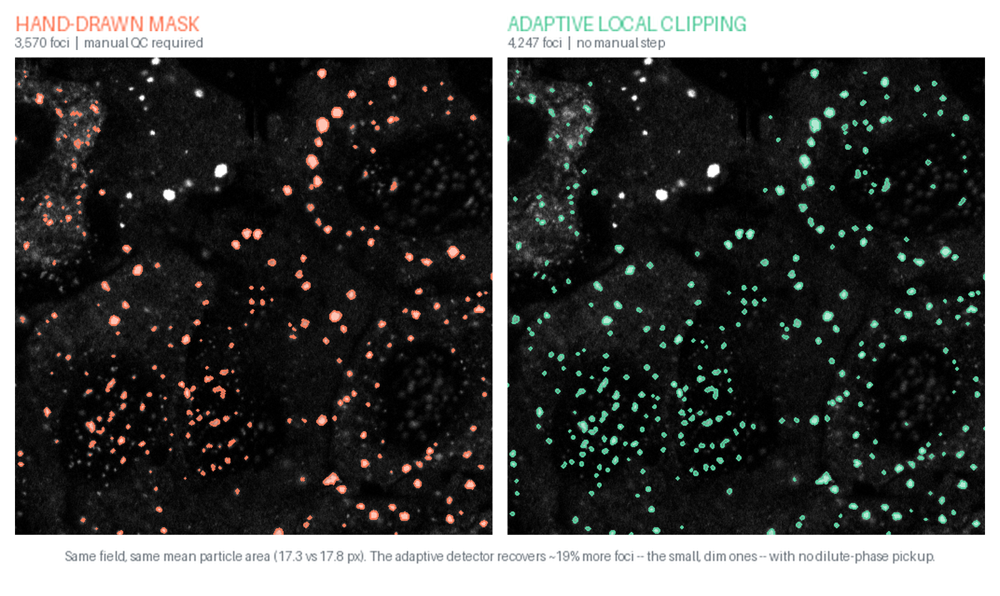
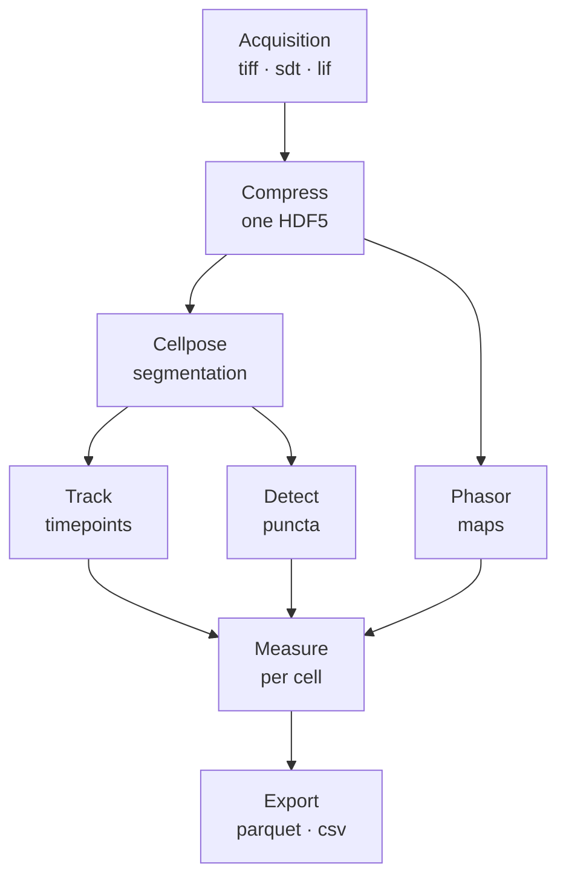
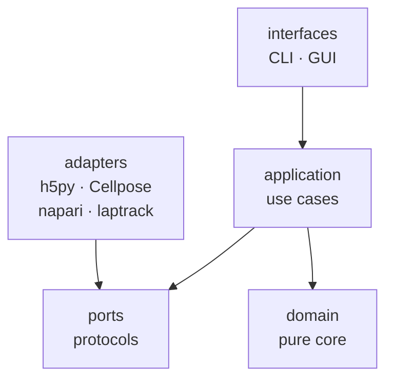

<p align="center">
  
</p>

# PerCell4

[](https://github.com/marcusjoshm/percell4/actions/workflows/ci.yml)
[](https://www.python.org/downloads/)
[](docs/installation.md)
[](#license)

**A desktop platform for measuring biomolecular condensates in single cells** — Cellpose
segmentation, per-cell puncta detection, grouped thresholding, and FLIM phasor analysis, with
every experiment stored as one HDF5 file and every batch operation available headlessly.

<p align="center">
  
</p>

---

## Why this exists

Segmenting stress granules, P-bodies, and other membraneless organelles is **a two-phase
measurement problem disguised as a thresholding problem.** Each punctum is a dense, condensed
phase sitting on a diffuse *dilute phase* of the same protein. The dilute phase is real signal
biologically, but counting it as a particle corrupts the measurement.

A single intensity cutoff cannot work, because the image is heterogeneous on two independent
axes at once:

- **Across cells** — expression varies roughly 3× within one field and up to ~40× across
  datasets in polyclonal lines. A cutoff calibrated on a bright cell erases a dim cell's
  puncta; one calibrated on a dim cell fragments the bright ones.
- **Within a cell** — the dilute-phase background is spatially uneven. This defeats even a
  *per-cell* Otsu threshold, which splits whichever population dominates the histogram: where
  bright foci dominate the cut lands high and dim foci are lost; where haze dominates it lands
  low and haze is admitted.

The historical fix was to hand-draw a small box around a region, because a small box supplies
local scale, local background, and local class balance all at once. It worked, and it made the
analysis unscalable — every round of every dataset needed a human.

PerCell4 reconstructs those three things automatically, per cell.

## Does it work?



On a whole-frame detector bake-off — one arsenite + nocodazole stress-granule field with
~4,664 hand-labeled foci — the adaptive detector found **4,247 foci against the hand-drawn
mask's 3,570 (~19% more)**, at essentially unchanged mean particle area (17.3 → 17.8 px), with
**zero dilute-phase pickup** and no manual QC step. The foci it adds are the small, dim ones a
human misses at the end of a long session.

Scope, so the number means something: this is one field, one condition, expert visual judgment
as ground truth, and the bake-off ran `window=15, k=2.25` — deliberately distinct from the
shipped per-cell workflow defaults of `k=1, window=6·d_min`. The method was separately
eye-validated across four datasets and two condensate types. Full treatment in
[`docs/paper/adaptive-local-clipping-section.md`](docs/paper/adaptive-local-clipping-section.md)
and [`docs/methods/`](docs/methods/).

## What it does

**Imaging and import**
- Import `.tiff` exports, Becker & Hickl `.sdt` FLIM decays, and Leica `.lif` metadata. Discover
  channels by LASX token or by name.
- Stitch tile scans at import with phase-correlation registration on the tile *overlap*, solved
  once on a reference channel and reused verbatim for every other channel and the FLIM decay
  stream, so the layers stay pixel-aligned.
- Import `_tN` series as one multi-timepoint dataset.

**Segmentation and tracking**
- Cellpose 4.x segmentation across many datasets, then QC each one in napari with paint, erase,
  and fill. A reference circle sized to the diameter setting lets you judge it against real cells
  before running.
- Track cells across timepoints so each keeps one ID, with dividing cells linked parent → daughter
  as lineage (via [laptrack](https://github.com/yfukai/laptrack)) and a napari Tracks layer for
  trajectories.
- Pin the compute device explicitly — every path reports which device it resolved and why, rather
  than silently falling back to CPU.

**Detection and measurement**
- Adaptive Local Clipping: a per-cell band-pass plus robust z-score, with auto window sizing and
  two-pass auto-extraction. It is one of twelve registered puncta detectors, backed by eight
  background estimators, all interchangeable — so a method can be swapped without touching the
  pipeline around it. (One detector and one estimator are registered as declared stubs.)
- Iterative Otsu peeling across three scopes with seven stopping criteria.
- Split a feature mask into subpopulations by contrast-to-noise ratio, or interactively by *any*
  per-particle metric — including Laplacian-variance and Tenengrad focus metrics, for separating
  out-of-focus particles.
- Grouped thresholding: cluster cells, autothreshold per group, refine per dataset, run multiple
  rounds in one workflow.
- Nine per-cell metrics plus per-particle analysis, exported as tidy parquet with CSV mirrors.

**FLIM**
- Phasor maps from TCSPC decays with per-channel *and* per-harmonic calibration, read straight out
  of a Leica `.lif` at full stored precision instead of transcribed off a dialog.
- Complex wavelet denoising for photon-starved data, implementing Wang et al. 2021.
- Multi-ROI phasor selection saved as mask layers; FLIM-FRET donor/acceptor pairing.
- Multi-timepoint TCSPC throughout — 4-D decay storage, per-timepoint append and phasor compute.

**Running it**
- Fourteen headless console scripts covering compression, segmentation, thresholding, measurement,
  phasor work, export, and resource management — all runnable without a display.
- An in-app Batch Tools Console that runs those same commands in a dedicated window, resolved
  through the current virtualenv rather than `PATH`.
- A registered-analysis framework that turns a standalone script into a first-class analysis with
  a generated dialog and batch runner ([author guide](docs/writing_an_analysis.md)).



*From acquisition to a tidy table: everything between the two ends lives in a single HDF5 file per experiment.*

## Quickstart

```bash
python3.12 -m venv .venv && source .venv/bin/activate
pip install -e .
percell4-gui
```

Then drive a headless batch over existing datasets:

```bash
percell4-inspect data/*.h5                      # what's in these files?
percell4-batch-threshold data/*.h5 \
    --round-name SG_mask --channel mNG \
    --strategy adaptive-clip --d-min-um 1.0
percell4-batch-measure data/*.h5 --mask SG_mask --output results/
```

Per-OS setup, GPU and FLIM extras, PyInstaller bundling, and troubleshooting are in
**[docs/installation.md](docs/installation.md)**. Every command and flag is in
**[docs/cli.md](docs/cli.md)**.

> **Running experiments in the lab?** The end-to-end click-by-click protocol is
> **[docs/workflow-protocol.md](docs/workflow-protocol.md)**.

## How it's built

PerCell4 is ports-and-adapters. The scientific core is a pure-Python island: `domain/` (66
modules) imports no Qt, no napari, and no h5py. Use cases name only protocol interfaces in
`ports/`; the concrete `Hdf5DatasetRepository`, `CellposeSegmenter`, `LaptrackTracker`, and
napari viewer all live in `adapters/` and are never named upstream.



*Dependencies point inward. Adapters implement the ports; nothing inside names an adapter.*

That seam is what makes the whole pipeline runnable without a display: `NullViewerAdapter`
implements the viewer port as silent no-ops, so batch commands drive the same use cases the GUI
does. State lives in one Qt-free `Session` hub with a 12-event observer protocol, bridged to Qt
through a single `state_changed` signal.

Storage is one HDF5 file per experiment — intensity channels, decays, label sets, masks, phasor
maps, tracks, and metadata in one place, with per-path binning rules (sum for intensity, mode for
labels, majority vote for masks) so a downsampled view never distorts a measurement.

**[docs/architecture.md](docs/architecture.md)** covers this properly, including the parts that
are unfinished.

## Engineering practice

| | |
|---|---|
| Source | 254 modules, ~80,500 lines under `src/` |
| Tests | ~4,100 test functions across ~300 files, plus 98 GUI tests in a separate suite |
| CLI | 14 console entry points |
| CI | Three jobs — Ruff lint, headless tests on Python 3.12, and a real-OpenGL GUI suite under Xvfb |
| Decision record | 65 documented learnings, 100+ implementation plans |

The test suite is split by *directory*, not by marker: GL-dependent napari tests live in
`tests_gui/` outside the default `testpaths`, because a marker relies on `addopts` and any explicit
`-m` on the command line silently overrides it — which is how CI once ran a different suite than a
local run for months. A monkeypatched `napari.Viewer.__init__` guard enforces that boundary
dynamically, since grep cannot.

No coverage percentage is quoted here because none is measured, and the four declared
`import-linter` contracts are documented as declared rather than enforced — nothing runs them yet.
Both are stated plainly in [the architecture notes](docs/architecture.md).

## Documentation

| | |
|---|---|
| [Installation](docs/installation.md) | Per-OS setup, extras, bundling, troubleshooting |
| [CLI reference](docs/cli.md) | All 14 console scripts, every flag |
| [Workflow protocol](docs/workflow-protocol.md) | The click-by-click lab procedure |
| [Architecture](docs/architecture.md) | Layering, storage model, testing strategy |
| [CONCEPTS.md](CONCEPTS.md) | Domain vocabulary — Dataset, Channel, Label Set, Segmentation, Mask |
| [Writing an analysis](docs/writing_an_analysis.md) | Turning a script into a registered analysis |
| [Methods](docs/methods/) | How puncta detection works, and its validation record |
| [Paper section](docs/paper/) | Publication-form treatment of Adaptive Local Clipping |
| [Learnings](docs/solutions/) | 65 documented problems, root causes, and resolutions |
| [Plans](docs/plans/) | Dated implementation plans |
| [CHANGELOG.md](CHANGELOG.md) | Dated feature history |

## Scientific background

PerCell4 measures RNP biomolecular condensates — stress granules and P-bodies — in mammalian
cells, imaged by time-domain TCSPC FLIM and analyzed through phasor plots including FLIM-FRET, to
read mRNA decapping-complex interactions under oxidative stress. The measurement difficulty is the
two-phase problem described at the top: condensate proteins also populate the dilute phase, so
intensity alone cannot separate the two.

<!-- CITATION GAP: the lab's prior J. Cell Biol. Tools article (doi:10.1083/jcb.202311105) belongs
     here with its full author list. Not written in yet -- the only copy available to the author of
     this file was a machine transcription, and a wrong authorship order on a real paper is worse
     than a missing citation. Paste the verbatim citation to fill this in. -->

The complex wavelet filter used for photon-starved phasor data implements Wang, P., Hecht, F.,
Ossato, G., Tille, S., Fraser, S.E., & Junge, J.A., *"Complex wavelet filter improves FLIM phasors
for photon starved imaging experiments,"* Biomed. Opt. Express **12**(6): 3463 (2021),
[doi:10.1364/BOE.420953](https://doi.org/10.1364/BOE.420953) — see
[`src/percell4/domain/flim/wavelet_filter.py`](src/percell4/domain/flim/wavelet_filter.py).

## Citing PerCell4

Citation metadata is in [`CITATION.cff`](CITATION.cff); GitHub renders it through the
**Cite this repository** button.

## License

MIT — see [`LICENSE`](LICENSE).
