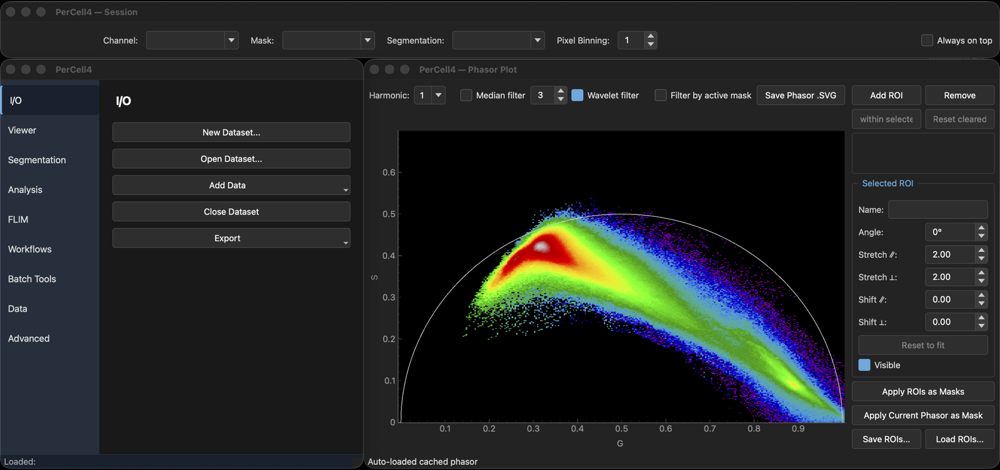

<p align="center">
  
</p>

# PerCell4

[](https://www.python.org/downloads/)
[](docs/installation.md)
[](LICENSE)

PerCell4 is a desktop application for single-cell analysis of fluorescence microscopy
images, including fluorescence lifetime (FLIM) data. It combines Cellpose segmentation,
per-cell thresholding and puncta detection, per-cell measurement, and phasor analysis in
one workflow, and stores each experiment as a single HDF5 file. It is written in Python
and built on Qt, napari, scikit-image and h5py.

Every batch operation is also available as a headless command-line tool.

> PerCell4 is under active development and currently pre-release (0.1.0). Interfaces and
> file layouts may still change between versions.

<p align="center">
  
</p>

## Documentation

| | |
|---|---|
| [Installation](docs/installation.md) | Per-OS setup, optional extras, standalone bundles, troubleshooting |
| [Workflow protocol](docs/workflow-protocol.md) | Step-by-step guide to the single-cell analysis workflow |
| [Command-line tools](docs/cli.md) | All command-line tools and their options |
| [Architecture](docs/architecture.md) | Code layout, storage model, and testing approach |
| [Concepts](docs/CONCEPTS.md) | Vocabulary — Dataset, Channel, Label Set, Segmentation, Mask |
| [Writing an analysis](docs/writing_an_analysis.md) | Adding a new analysis module |
| [Adaptive Local Clipping](docs/adaptive-local-clipping.md) | The puncta detection method in full |
| [Methods](docs/methods/) | How puncta detection works, and its validation record |
| [Changelog](docs/CHANGELOG.md) | Dated feature history |

## Installation

PerCell4 requires Python 3.12 or newer. **Only Python 3.12 is tested** — newer versions
install and run, but are not verified, so use 3.12 unless you have a reason not to. Install
into a virtual environment:

```bash
python3.12 -m venv .venv
source .venv/bin/activate
pip install -e .
```

See the [installation guide](docs/installation.md) for optional extras, per-OS instructions, PyTorch and
Cellpose notes, standalone bundles, and troubleshooting.

## Usage

Launch the application:

```bash
percell4-gui
```

or

```bash
python main.py
```

The [workflow protocol](docs/workflow-protocol.md) walks through the single-cell
analysis workflow step by step, from importing `.tiff` exports through segmentation,
thresholding, and measurement.

Batch operations can also be run without a display:

```bash
percell4-inspect data/*.h5
percell4-batch-threshold data/*.h5 --round-name SG_mask --channel mNG \
    --strategy adaptive-clip --d-min-um 1.0
percell4-batch-measure data/*.h5 --mask SG_mask --output results/
```

See the [command-line reference](docs/cli.md) for all tools and options.

## Key features

- **Cell segmentation and tracking** — automated single-cell segmentation via Cellpose and cell tracking via LapTrack.
- **Thresholding** — autothresholding (Otsu, Triangle, Li), optionally applied per group
  after clustering cells by their individual intensities (k-means or Gaussian mixture
  models), and a universal feature extraction method called [Adaptive Local Clipping](docs/adaptive-local-clipping.md).
- **FLIM and phasor analysis** — phasor analysis of TCSPC data with median and wavelet
  filtering, and segmentation by ROI: manual placement, derived from fluorescence lifetime
  values, or automated with a Gaussian mixture model.
- **Measurement and export** — configurable per-cell and per-particle measurements across
  every segmentation and mask, exported as CSV and TIFF files.
- **Batch workflows and analysis** — end-to-end analysis workflows and particle analysis features configured in the GUI or dedicated CLI tools

## Reporting issues

PerCell4 is a developing project and reporting is greatly appreciated! Questions and bug reports are welcome in
[GitHub issues](https://github.com/marcusjoshm/percell4/issues). Please include your
operating system, Python version, and the output of `percell4-inspect` for the dataset
involved where relevant.

## Contributing

Contributions are welcome. [Writing an analysis](docs/writing_an_analysis.md) describes
how to add a new analysis module, and [the architecture notes](docs/architecture.md)
describe the code layout and how the test suite is organised.

Implementation plans, requirements documents, and the project's institutional
learnings live on the long-lived `development` branch rather than on `main`, so that
a clone of `main` stays about the software rather than about how it was built. See
[Development documentation](docs/architecture.md#development-documentation).

## License

PerCell4 is distributed under the MIT License. See [`LICENSE`](LICENSE).
