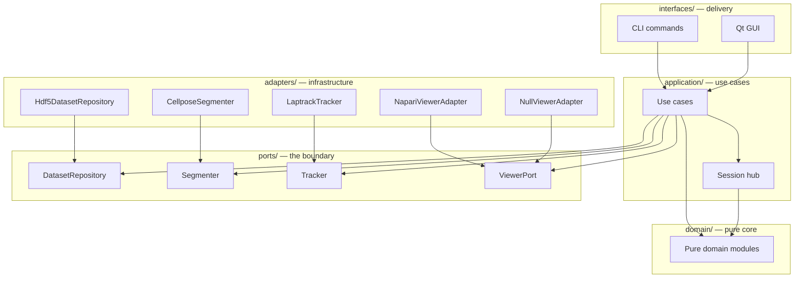
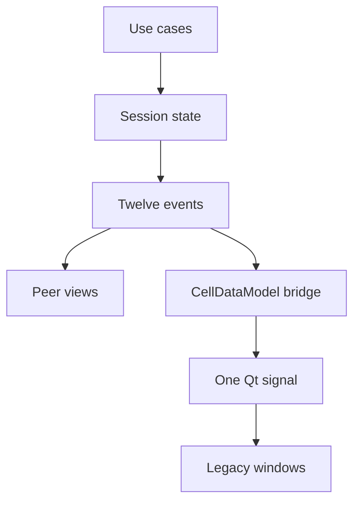

# Architecture

How PerCell4 is built and why. Written for someone judging the codebase who has not opened the source: every structural claim cites the file that backs it, and where the design is unfinished or a stated guarantee is not actually enforced, that is said plainly rather than left for you to find. Vocabulary follows [`CONCEPTS.md`](../CONCEPTS.md) — Dataset, Channel, Label Set, Segmentation, Mask, Phasor ROI, Layer are used in their project-specific senses.

---

## 1. Shape

PerCell4 is ports-and-adapters. The scientific core is a pure-Python island; Qt, napari, h5py, Cellpose and LapTrack sit outside it and reach in through protocol interfaces.



Every dependency arrow points inward toward `domain/`: delivery code calls use cases, use cases name only the port protocols, and each concrete adapter implements the port above it rather than being named by anything upstream.

| Layer | Path | Modules | Contents |
|---|---|---:|---|
| Domain | `src/percell4/domain/` | 66 | Pure image, measurement, FLIM, segmentation, tracking algorithms |
| Application | `src/percell4/application/` | 46 | Use cases plus the `Session` state hub |
| Ports | `src/percell4/ports/` | 5 | Protocol definitions only |
| Adapters | `src/percell4/adapters/` | 12 | HDF5, Cellpose, LapTrack, napari, importers |
| Interfaces | `src/percell4/interfaces/` | 42 | CLI commands and the Qt launcher |

**Ports are interfaces and nothing else.** All four files under `src/percell4/ports/` are `typing.Protocol` declarations plus the small frozen dataclasses those protocols return — 400 lines, no implementation. `DatasetRepository` (`src/percell4/ports/dataset_repository.py`) is the large one at **25 methods** spanning lifecycle, Channel reads, Label Set and Mask read/write, measurements, tracks, raw arrays, TCSPC decay and metadata. (It is sometimes described as a 30-method protocol; counted directly it declares 25 — 30 is the total across all four port files.) The others are deliberately tiny: `Segmenter` has one method, `Tracker` one, `ViewerPort` three — `show_dataset` / `clear` / `close`.

**The domain layer is verifiably pure.** Grepping every module under `src/percell4/domain/` for top-level imports of `h5py`, `napari`, `PyQt5`, `qtpy`, `PySide2` or `PySide6` returns **zero matches**; this was checked against the working tree while writing this page, not taken on trust. Those dependencies live in adapters instead — `h5py`/`hdf5plugin` in `src/percell4/store.py`, napari in `src/percell4/adapters/napari_viewer.py`, Cellpose in `src/percell4/adapters/cellpose.py`.

Use cases consume ports by construction. `LoadDataset` (`src/percell4/application/use_cases/load_dataset.py`) takes a `DatasetRepository`, a `ViewerPort` and a `Session`; `SegmentCells` (`.../segment_cells.py`) takes a `DatasetRepository` and a `Segmenter`. Composition happens in one place — `src/percell4/interfaces/gui/app.py` is the only module that names an adapter and a use case in the same breath.

### The contracts are declared, not enforced

`pyproject.toml:153-207` declares four `[tool.importlinter]` `forbidden` contracts: `domain/` must not import Qt, napari, h5py, laptrack, adapters, interfaces or application; `domain/analysis` must not import `domain/measure`; `application/` must not import Qt, napari, h5py, adapters, interfaces or `gui`; `ports/` must not import adapters, interfaces or infrastructure.

**Nothing runs them.** `import-linter` is absent from the `dev` extra, and `.github/workflows/ci.yml` has no `lint-imports` step — the only occurrences of the tool name in the repository are the config block and its own `# Run: lint-imports` comment. A repo plan document (`docs/plans/2026-07-28-001-refactor-headless-test-suite-plan.md:86`) calls this "a real gap." Static reading confirms the `application/` contract is currently **violated**: nine `import h5py` sites under `src/percell4/application/use_cases/`, three of them module-level (`flim_fret_discovery.py`, `batch_create_whole_field_segmentation.py`, `batch_fit_phasor_masks.py`). The `domain/` contract does hold. Read the contracts as intent the domain layer honours and the application layer does not.

### The null adapter is the proof

`src/percell4/adapters/null_viewer.py` implements `ViewerPort` as three silent no-ops, and says why: *"This is the proof that the ViewerPort abstraction works: use cases accept any ViewerPort, and the CLI provides one that does nothing."* Every batch command runs the same use cases the GUI does, handed a `NullViewerAdapter` instead of a napari window. If the seam leaked, the headless commands would stop working.

### What is still in motion

Two GUI trees are live at once — transitional state, not settled design. `src/percell4/app.py` is the legacy entry point that ships, building a `CellDataModel` and a `LauncherWindow`. `src/percell4/interfaces/gui/app.py` is the hex composition root, whose docstring calls itself "a SEPARATE entry point from the existing app.py — the old launcher continues to work alongside this one during migration." `src/percell4/gui/` (53 modules) still holds the panels, dialogs and napari viewer window; `src/percell4/interfaces/gui/` holds the migrated main window, peer views and task panels; `src/percell4/adapters/napari_viewer.py` reuses `gui/viewer.py` rather than owning a second napari instance. `src/percell4/model.py` documents its own deletion at the end of the migration. The boundary is real; the migration is not finished.

---

## 2. State

One state hub, one Qt signal.

`src/percell4/application/session.py` holds a `Session` dataclass — current Dataset, selection, filter, active Segmentation / Mask / Channel / view bin / timepoint, and the measurements table. It uses a plain observer pattern: `subscribe(event, callback)` returns an unsubscribe function, and `_emit` iterates a copy of the list so a callback may unsubscribe itself mid-notification. A 12-member `Event` enum (`session.py:19-33`) names every transition: `DATASET_CHANGED`, `SELECTION_CHANGED`, `FILTER_CHANGED`, four `ACTIVE_*_CHANGED` events, `ACTIVE_BIN_CHANGED`, `MEASUREMENTS_UPDATED` and three `*_LIST_CHANGED` events. No Qt, no napari — the module imports `dataclasses`, `enum`, `pandas` and domain types.



Use cases mutate the Session, the Session emits typed events, migrated peer views subscribe directly, and everything not yet migrated hears about it through a single Qt signal.

`src/percell4/model.py` is that bridge. `CellDataModel` is a `QObject` owning a `Session`; it subscribes to all twelve events and re-emits them as **one** signal, `state_changed = Signal(object)`, carrying an 11-field `StateChange` dataclass of booleans (`data`, `selection`, `filter`, `segmentation`, `mask`, `channel`, `bin`, `timepoint`, `channel_list`, `segmentation_list`, `mask_list`). One signal rather than eleven lets each window process a batch of related changes in a defined order inside a single handler call; a `_wiring_session` guard stops a mutation made inside a handler from looping. Its docstring states the class exists for legacy consumers and that "once all consumers are migrated to Session (Stage 5), this file is deleted."

**Selection is global by label, on purpose.** Cross-window selection keys on the label value alone, with no timepoint dimension (`session.py:57-66`). For a **tracked** Segmentation that is exactly right — the label value *is* the track id and is stable across frames, so selecting a cell highlights the same physical cell wherever it appears. For an **untracked** per-frame Label Set, label numbers are independent per frame, so a global selection would cross-link unrelated cells; that is contained by keeping peer views frame-scoped rather than by changing the key. A `(label, timepoint)` key was considered and **deliberately rejected**, the comment recording the reason as a large blast radius on the selection contract with no concrete feature needing it. The invariant is documented at the field it constrains, which is why the trade-off is still legible.

---

## 3. Storage

One HDF5 file per Dataset. `src/percell4/store.py` (1,881 lines) writes and reads it; `src/percell4/adapters/hdf5_store.py` wraps it behind `DatasetRepository`.

```
dataset.h5
├── /intensity                      (H,W) | (C,H,W) | (T,H,W) | (T,C,H,W)
├── /decay/<channel>                (T_acq,H,W,T_bins)  TCSPC histograms
├── /labels/<name>                  Label Sets (int32)
├── /masks/<name>                   Masks (uint8)
├── /phasor/<channel>/
│   ├── g, s                        required, float32
│   └── g_filtered, s_filtered, lifetime_filtered
├── /tracks/<name>                  lineage tables
├── /groups/<name>                  per-cell grouping columns
├── /measurements                   the measurement table
└── /metadata                       attrs: channel_names, native_shape,
                                    creation_bin, n_timepoints, pixel size,
                                    FLIM calibration keys, stitch provenance
```

**T versus C is read, never inferred.** A leading time axis `(T, ...)` and a leading channel axis `(C, H, W)` are indistinguishable from shape alone, so the split is driven by `/metadata.n_timepoints` (`src/percell4/domain/io/layout.py:1-10`, `intensity_channel_count` at line 61). Guessing wrong makes a time-lapse Dataset read back as single-timepoint and silently collapses every time-aware feature to frame 0.

**View binning is per-path, and each rule matches the quantity.** `_apply_view_bin` (`src/percell4/store.py:52-77`) dispatches on the HDF5 path prefix; the contract lives in `src/percell4/domain/io/view_bin.py`.

| Path prefix | Rule | Why |
|---|---|---|
| `/intensity` | `sum_bin_2d` | Photon counts are extensive; they add |
| `/decay/<ch>` | `sum_bin_decay` | Same, per histogram bin |
| `/labels/<name>` | `mode_labels` | A label id is categorical; averaging it is meaningless |
| `/masks/<name>` | `majority_vote_mask` | Binary membership decided per output pixel |
| `/phasor/<ch>/*` | `mean_bin_2d` | g, s and lifetime are **intensive** — mean-binned so magnitudes do not scale with the bin factor |
| anything else | pass-through | No defined rule is safer than a guessed one |

The on-disk array is never touched; this is a read-time view only.

**Compression was chosen by measurement, and the measurement is recorded next to the choice** (`src/percell4/store.py:263-283`). Images, Label Sets and Masks use Blosc (zstd, clevel 5, bitshuffle): on real intensity data it matched gzip-4+shuffle's ratio (~3.4×, no size penalty on large files) while decoding roughly 3× faster — a gain that compounds with the parallel decode below. TCSPC decay keeps `lzf`, the lighter choice for those very large per-pixel stacks. Because Blosc is a registered filter rather than universal gzip, `hdf5plugin` is imported wherever the project reads HDF5 (`src/percell4/__init__.py:3-4`, `store.py:21`, `adapters/parallel_decode.py:33`), spawned workers included. Pre-existing gzip files keep reading unchanged.

**Six named exceptions guard file consistency**, each with a docstring naming the corruption it catches (`src/percell4/store.py:144-197`):

- `LayerAlreadyExistsError` — a write would silently shadow an existing Layer.
- `MetadataConsistencyError` — stored `/metadata.native_shape` disagrees with the shape inferable from `/intensity` (or `/decay/<first_ch>`); the store refuses to overwrite, since "a real schema bug or a corrupted file is more likely than a benign transient."
- `LayerSizeMismatchError` — an Add-Layer source does not match `native_shape`; the `.h5` does not tolerate mixed-resolution storage.
- `SourceShapeMismatchError` — source Channels disagree on `(H, W)` at compress time; the run aborts *before* writing, because a silent partial import would corrupt the `native_shape` invariant.
- `CrossFormatRuleConflictError` — an append would persist a rule different from the stored one.
- `DimsConsistencyError` — `/intensity`'s `dims` attr disagrees with its shape and channel count, catching the canonical corruption of a `(T,H,W)` array mis-stamped `['C','H','W']`. Checked at Dataset open (`src/percell4/adapters/hdf5_store.py:65`) from attributes and shape only, with no array decode.

---

## 4. Extension

Registered analyses are the project's extension mechanism: a pure core, a declarative module, a dialog, and two import lines.

- **`@register_analysis("<name>")`** (`src/percell4/application/analysis/registry.py:54`) validates then registers an `Analysis` subclass.
- **The schema is declarative and class-level** (`src/percell4/domain/analysis/base.py`): `required_inputs` / `optional_inputs` / `input_groups` as `{role: ImageRole(kind=...)}` where `kind` is `intensity`, `mask` or `label`; `parameters` as typed Int/Float/Choice/Bool params; `presets` as named parameter dicts; `outputs` as `TableOutput` / `ImageOutput`. `dialog_class` is typed `type | None` rather than `type[QDialog] | None` specifically to keep the domain layer Qt-free — the GUI assigns it from outside.
- **`validate_schema` runs at import time** (`registry.py:92`), checking preset keys against declared parameters, role collisions, `group_requirement` validity, output-name uniqueness and that `BoolParam.requires` resolves to known roles. Because the decorator calls it before inserting into the registry, **a malformed schema fails at module import**, with the offending role, param or group named — not at run time in front of a user mid-batch.
- **The loader is generic and role-dispatching** (`src/percell4/application/analysis/loader.py`). Given a `{role → Layer name}` map it dispatches on `ImageRole.kind`: `intensity` resolves against `metadata["channel_names"]` or falls back to a `/decay/<ch>` sum projection; `mask` reads `/masks/<name>` as boolean; `label` reads the Label Set as `int32`. Errors carry the role, the requested Layer name and the `.h5` path.
- **Launcher buttons are generated, not written** (`src/percell4/interfaces/gui/main_window.py:345-372`): the Analyses group iterates `list_analyses()` and builds one button per registered entry with the declared description as its tooltip.
- **Batch running is Qt-free.** `batch_run_analysis` (`src/percell4/application/use_cases/run_analysis_batch.py`) iterates Datasets, isolates per-Dataset failures into structured `BatchAnalysisItemResult` records, writes image outputs back into each `.h5`, accumulates combined and per-Dataset CSVs, and finalises a `run_config.json`. Cancel semantics are stated in the docstring: fail-fast, no resume.

Three analyses ship — `per_particle_donut`, `per_particle_multichannel`, `whole_field_intensity` (`src/percell4/application/analysis/modules/`). The author guide is [`docs/writing_an_analysis.md`](writing_an_analysis.md), which works all three as examples and documents the rule that the repo-root CLI and the framework module call the same pure core so they cannot diverge numerically.

**Where the boundary actually is.** Discovery is by in-package import, not entry points: `src/percell4/application/analysis/__init__.py:11-17` imports each module explicitly to fire its decorator side effect, and the guide's Step 4 instructs you to "add the module to the import block." A third party cannot add an analysis without editing `src/percell4/application/analysis/modules/` and that `__init__.py` inside the installed package. This is an **internal extension framework** — a well-factored one that keeps analysis authors out of I/O, batching and dialog wiring, but not a plugin system. There is also no CLI for registered analyses yet: `run_analysis.py:145` refers to "a future CLI," and today the batch runner is reached from the GUI dialogs or called directly from a script.

---

## 5. How it stays correct

**The `ViewerPort` seam makes the pipeline runnable without a display.** Because every display-touching use case takes a `ViewerPort`, swapping in `NullViewerAdapter` turns the GUI pipeline headless with no branching inside the use case — `src/percell4/interfaces/cli/run_pipeline.py` and `src/percell4/application/use_cases/batch_process_datasets.py` do exactly that. The rest of the 14 console commands stay headless by construction, never reaching for a viewer at all.

**Tests are split by directory, not by marker.** `tests/` holds roughly 300 test files and ~4,100 test functions and runs headless under `QT_QPA_PLATFORM=offscreen`; `tests_gui/` holds 16 files and 98 test functions that build real napari viewers and need a real GL context.

The split is by directory because of a specific incident, recorded at `pyproject.toml:118-123`: a marker only takes effect through `addopts`, and **any explicit `-m` on the command line silently overrides `addopts`**. CI used to pass `-m 'not slow and not gui'` while the `gui` marker was declared but applied to zero tests — so the expression excluded nothing and CI quietly ran a *larger* suite than any local run, including ~100 napari-viewer tests deselected locally, for months. The fix made selection unforgeable: `testpaths` and `addopts` in `pyproject.toml` are the single source of test selection, and CI runs a bare `pytest`, so a local green and a CI green mean the same thing.

**A monkeypatched constructor enforces the boundary dynamically.** `tests/conftest.py:68-118` replaces `napari.Viewer.__init__` for the whole `tests/` session: it records the attempt with a stack trace, then raises with a message telling the author to move the test to `tests_gui/`. The docstring explains why a static check would not do — *"Grep cannot police that boundary."* One test mentioned neither napari nor `ViewerWindow` yet built a `LauncherWindow` that owns a `ViewerWindow`, whose queued handler constructed the canvas, sometimes during a *later* test's setup; it passed alone and segfaulted when run after another module. The guard records *before* raising, because production code wraps the same access in `except Exception: return` and would otherwise swallow a raise-only guard at exactly the site worth catching. A session-end hook summarises every offender so one run yields the whole relocation list.

**Three CI jobs** (`.github/workflows/ci.yml`): `ruff check src tests tests_gui`; the test suite on Python 3.12 with CPU-only torch wheels and no xvfb (offscreen needs no display); and a real-OpenGL `tests_gui` job under `xvfb-run`, which exits via `os._exit` on pytest's return code because napari/vispy can abort during interpreter teardown after the result is already known. The comments are candid about status: `main` has no branch protection, so a failure surfaces as a red check rather than blocking a merge.

**No coverage figure appears here** because none is measured. `pytest-cov` is installed in the `dev` extra and in both test jobs, but there is no `[tool.coverage]` section in `pyproject.toml` and no `--cov` anywhere in the repository.

---

## 6. Decisions worth knowing

- **Atomic writes with a stated contract.** `write_atomic` (`src/percell4/workflows/artifacts.py:50-100`): `.tmp` sibling → fsync contents → `os.replace` → fsync parent directory on POSIX. The target is **never** unlinked first, because a crash between unlink and replace would leave the user with nothing; the temp handle opens `"r+b"` because Windows maps `os.fsync` to `FlushFileBuffers`, which needs write access. Same pattern in `src/percell4/project.py`, `src/percell4/adapters/tiff_writer.py` and `src/percell4/application/use_cases/export_phasor_npz.py`.
- **Parallel decode where only indices cross the process boundary.** `src/percell4/adapters/parallel_decode.py`: HDF5 decompression does not parallelise across threads (the library serialises calls) but does across processes. Each worker owns its own `h5py.File` and writes decoded frames straight into one shared-memory block, so frame indices — never pixels — are pickled. Constraints are baked in for macOS `spawn`: module-level worker functions, a per-process handle cache, parent-only `unlink()` of the block. Measured during development at ~5.3× (60 s → 11 s, 10 workers), output byte-identical to `DatasetStore.read_array`.
- **Measurement-driven compression.** See §3 — the Blosc-vs-gzip comparison lives in the docstring of the function that makes the choice (`src/percell4/store.py:263`), so the rationale cannot drift from the code.
- **Metadata-only inspection.** `src/percell4/interfaces/cli/inspect_dataset.py:1-10` reads shapes and dtypes from HDF5 metadata and never decodes an array, so a multi-gigabyte stack inspects instantly. The docstring links the incident that motivated it (`docs/solutions/logic-errors/large-file-load-metadata-read-full-decode-2026-06-07.md`).
- **A generator-driven workflow state machine, with the alternative's footgun named.** `src/percell4/gui/workflows/base_runner.py:1-27`: phases are a generator yielding `PhaseRequest` objects, resumed via `gen.send(result)` at a natural Qt event boundary. The docstring says why not nested `QEventLoop.exec_()` — signals arrive while paused and re-enter slots, and `processEvents()` inside a nested loop corrupts Qt state. Side benefit: the request/result dataclasses are pure Python and testable with no running `QApplication`.
- **Fail-at-import schema validation.** See §4.
- **Single-source-of-truth name tuples with import-time drift assertions.** The registries for puncta detectors, background estimators, window finders and iterative-Otsu stop criteria each assert that their keys equal the canonical name tuple, at module import: `domain/measure/puncta_detectors.py:536`, `bg_estimators.py:303`, `window_finders.py:167`, `iterative_otsu.py:194`. A registry that drifts from the names the UI offers fails on import, not at the click.
- **An explicit domain exception hierarchy.** `src/percell4/domain/errors.py` roots everything at `PercellError`, with named cases including `NoDatasetError`, `NoSegmentationError`, `NoMaskError`, `NoChannelError`, `NoCachedPhasorError`, `CalibrationCSVError`, `LifHeaderError`, `LifCalibrationError` — callers catch a category, not a string.
- **A per-Dataset failure taxonomy that records rather than aborts.** `DatasetError` + `BatchResult` (`src/percell4/domain/io/models.py:330-343`) give batch operations `completed` / `failed` / `cancelled` collections, so one bad Dataset in a run of forty is reported, not fatal. The analysis batch runner carries the same shape; the shared CLI reporter is `src/percell4/interfaces/cli/_batch_report.py`.
- **macOS AppleDouble sidecar defence.** `src/percell4/io/paths.py` routes directory scans through `scan_files` / `drop_sidecars`, dropping `._*` companions plus `.DS_Store` / `Thumbs.db` / `desktop.ini`. On exFAT/SMB volumes macOS writes extended attributes into a companion carrying the *same extension*, so a naïve `glob("*.h5")` picks up a 4 KB metadata blob and the reader dies on `file signature not found`.
- **`pa.unify_schemas` across staging fragments.** `src/percell4/workflows/phases.py:2635` unifies the Parquet schemas of all staging fragments before assembly, so per-Dataset column differences merge instead of colliding at concat time.

> **On the performance numbers.** The ~5.3× parallel decode, ~3× Blosc decode and ~3.4× compression ratio quoted above are **source-comment claims, measured during development**. There is no benchmark script or CI performance gate in the repository, so they are not reproducible from a clean checkout. Read them as the author's recorded measurements, not as published benchmarks.

---

## Where to read next

- [`CONCEPTS.md`](../CONCEPTS.md) — the vocabulary authority. Dataset, Channel, Label Set, Segmentation, Mask, Phasor ROI, Layer and Layer type tag are defined there, with the flagged ambiguities (notably that a Label Set shadowed by a same-named Mask is not a Segmentation). Code and docs use those terms in that sense.
- [`docs/solutions/`](solutions/) — the decision record: 65 documents across ten categories, **22 of them architecture** (4 in `architecture-decisions/`, 18 in `architecture-patterns/`). Several choices above trace to a specific incident write-up there, linked by path from the source comments.
- [`docs/writing_an_analysis.md`](writing_an_analysis.md) — the extension guide, if you want the framework from an author's side.
