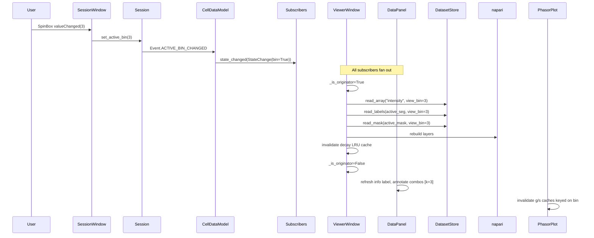

# feat: Dataset-wide spatial binning

## Overview

Make spatial binning a first-class, dataset-wide property of PerCell4.

Today, the only place a user can bin spatially is at TCSPC `.bin` import
(commits `4367a10`, `a3a1d0a`). The factor is irrevocable and per-layer, so
working with both binned and unbinned versions of the same acquisition
requires two `.h5` files and a full re-import — disk-doubling, labor-doubling,
and forever-out-of-sync.

This plan introduces a clean two-tier model that respects PerCell4's
"every-array-is-canonical" storage principle:

1. **`creation_bin`** — a one-time bin applied at compress, baking the
   dataset's `native_shape` into `/metadata`. All stored arrays are at
   native (k=1) resolution.
2. **`session.active_bin`** — a runtime view bin (1..16) living on
   `Session`, surfaced as a SpinBox in `SessionWindow`. Reads downsample on
   the fly; writes nearest-neighbor-upsample to native and annotate with
   `created_at_bin`. Auto-names get a `_bin<k>` suffix when k>1, so
   `cellpose` (k=1) and `cellpose_bin3` (k=3) coexist in one file.

The existing TCSPC import-time spinner is removed; its k=1..16 control
moves to SessionWindow as the view-bin.

---

## Problem Frame

Users want to compare binned and unbinned analyses of the same acquisition
inside one `.h5`. Today's model forces two files, two imports, and divergent
downstream state. The user explicitly chose, during brainstorming:

- Storage is sacred — every array on disk is at native (k=1) resolution
  (see origin: `docs/brainstorms/2026-05-18-dataset-wide-spatial-binning-requirements.md`).
- Binning is a session lens — toggleable from `SessionWindow`.
- Derived results record the bin they were produced at; `_bin<k>` naming
  preserves both k=1 and k=N artifacts in one file.
- One bin at a time is active; multiple binned variants can be persisted as
  distinct named results.

---

## Requirements Trace

Success criteria carried verbatim from origin (origin §"Success criteria"):

- R1. One acquisition into one `.h5`, analyzed at any k ∈ {1..16} from the
  SessionWindow toggle, without re-import.
- R2. All four layer types — channels, decay, masks, labels — respect the
  toggle (sum-bin for intensity/decay; majority-vote for masks; mode for
  labels).
- R3. Cell measurements at k=1 and k=3 coexist in one DataFrame, tagged
  with `bin_at_measure`, comparable in physical units.
- R4. Data tab shows active bin and native shape; every result layer is
  annotated with the bin it was produced at.
- R5. Round-trip identity at view bin = 1 with no derived data: byte-identical
  arrays in/out (no behavior change from import_dataset's perspective).
- R6. No layer name collisions: k=1 Cellpose produces `cellpose`; k=3
  produces `cellpose_bin3`; they coexist.
- R7. `/metadata.native_shape` and `/metadata.creation_bin` are written
  once at compress and never mutated (origin §"`/metadata` schema").
- R8. Old `.h5` files without `native_shape`/`creation_bin` open cleanly
  with sensible defaults (origin §"Open questions / decisions to revisit").

---

## Scope Boundaries

- Per-layer independent bin factors — explicitly out (origin §"Non-goals").
- Mixed-resolution storage (`/labels_bin3/`, etc.) — explicitly out.
- Anisotropic binning (`kx ≠ ky`) — explicitly out.
- Z-axis or T-axis binning — explicitly out.
- "Promote a binned view to a new .h5" export — explicitly out; the toggle
  is the promotion.
- Cross-dataset comparison at different `native_shape` values — out;
  remains the user's responsibility.

### Deferred to Follow-Up Work

- **Soft "match-to-native" Add-Layer fallback**. The plan removes the
  import-time `spatial_bin` spinner. If post-creation imports of higher-res
  ancillary TIFFs turn out to be friction-heavy, a "Match source to native
  (bin k×)" control gets added back in a later PR. Tracked as a watch-item
  in Open Questions.

---

## Context & Research

### Relevant Code and Patterns

- **`src/percell4/store.py`** — `DatasetStore` read methods (`read_array`
  at `:166`, `read_channel` at `:179`, `read_labels` at `:254`, `read_mask`
  at `:279`). No read-options dataclass; each method takes plain kwargs.
  `_spatial_bin_tile` already exists at `adapters/importer.py:684-699`
  (sum-bin reshape) — reuse for intensity.
- **`src/percell4/adapters/importer.py`** — `import_dataset` is the single
  chokepoint at `:36`. `write_decay_streaming` (`:594-682`) already has the
  `spatial_bin` kwarg from commit `4367a10`; rename its semantic to
  `creation_bin` and call from `import_dataset` with the CompressConfig
  value. TIFFs are sized in `_load_and_stitch` (`:138-177`) — bin them
  immediately after stitching, before `project_z`, in the same control flow.
- **`src/percell4/application/session.py`** — `Session._active_*` slots
  (`:50-54`) and `set_active_*` mutators (`:204-217`) emit `Event` enum
  values. The cascade in `set_dataset` (`:162-175`) is the model for
  resetting bin to 1 on dataset switch.
- **`src/percell4/model.py`** — `CellDataModel` at `:41`; `StateChange`
  dataclass at `:22-39`. Adding `bin: bool = False` mirrors existing
  `selection`/`filter`/`segmentation`/`mask` flags. Bridge handler pattern
  at `:51-72`.
- **`src/percell4/interfaces/gui/peer_views/session_window.py`** — three
  combo Selectors at `:94-113` use the canonical Selector idiom (loading
  guard `:165`, `_populate_combo` `:161-177`, `currentTextChanged →
  set_active_*`, `subscribe(Event.ACTIVE_*_CHANGED, ...)`). New SpinBox
  mirrors this exactly.
- **`src/percell4/gui/_stitching_flim_form.py`** — canonical shared widget
  for the two TCSPC dialogs (see `docs/solutions/architecture-patterns/sibling-dialog-extract-shared-widget-2026-05-12.md`).
  All spinner removals land here as one edit.
- **`src/percell4/gui/_resource_name_prompt.py:26-63`** —
  `prompt_for_resource_name(default, ...)` is the single modal-loop owner
  for resource naming. Wrap the `default` argument with a `bin_suffix(name, k)`
  helper at every Creator site.
- **`src/percell4/interfaces/gui/main_window.py:853-907`** —
  `LauncherWindow._populate_viewer_from_store` is the highest-traffic
  storage→napari read path. Threads `view_bin` into every `s.read_*` call.
- **`src/percell4/application/use_cases/segment_cells.py:73-118`**,
  **`measure_cells.py:29-100`** — Creator use cases. Read at active_bin,
  upsample on write, set `created_at_bin` attr / `bin_at_measure` column.

### Institutional Learnings

- **`docs/solutions/architecture-decisions/session-bridge-event-forwarding.md`**
  — 5-step bridge: `Event` enum, `StateChange` field, `CellDataModel`
  subscribe, `_on_*_changed` handler, panel `_on_state_changed` updates.
  Apply verbatim for `active_bin`.
- **`docs/solutions/architecture-patterns/consolidate-canonical-state-over-per-module-overrides-2026-05-14.md`**
  — Selector lives in SessionWindow; DataPanel *displays* only; viewer/measure/
  segment/FLIM read `session.active_bin` directly. No per-panel bin
  overrides. Hard rule.
- **`docs/solutions/architecture-patterns/session-to-napari-one-way-push.md`**
  — Wholesale layer rebuild on `change.bin` MUST run inside
  `_is_originator=True`. Use strict `_find_layer_by_name_and_type` for
  re-select after rebuild.
- **`docs/solutions/ui-bugs/add-mask-name-collision-image-layer-crash-2026-05-15.md`**
  — napari layer names are flat across types. `_bin<k>` suffix must be
  applied uniformly across all Creator sites; validate at the prompt level.
- **`docs/solutions/architecture-patterns/decay-write-path.md`** — all
  `/decay/<ch>` writes flow through `write_decay_streaming` or
  `append_decay_layers`. Keep this single-chokepoint invariant when
  repurposing the `spatial_bin` kwarg as `creation_bin`.
- **`docs/audits/io-principles-matrix.yaml` Principle 4** (Single Write
  Boundary) — view_bin reads must remain inside `DatasetStore`; no
  `h5py.File(...)` outside the store. Adds a `read_decay(channel, view_bin)`
  helper to bring the currently-direct decay reads
  (`add_decay_to_dataset.py:360, 396`, `compute_phasor`) onto a single seam.
- **`docs/audits/io-principles-matrix.yaml` Principle 5** (Plans in,
  use-cases consume) — `creation_bin` lives in `CompressConfig`. Use cases
  never re-derive from `session.active_bin` at execution time.
- **`docs/solutions/logic-errors/in-session-hdf5-staleness-multi-vector-2026-04-30.md`**
  — The 5-vector compound. `active_bin` change is structurally identical
  to "primary input changes" and must invalidate every cache (peer-view
  `_g_map`, `_active_mask_flat`, `_cleared_mask`, ROI `cached_mask`, derived
  `/phasor/<ch>/g_filtered|s_filtered|lifetime_filtered`). Bin is part of
  every cache key.
- **`docs/solutions/logic-errors/flim-phasor-cross-layer-alignment-2026-04-29.md`**
  — Intensity for FLIM derives from `/decay/<ch>.sum(axis=-1)`, not sibling
  `/intensity[ch_idx]`. The view-bin downsampler must be a single helper so
  intensity-from-decay and intensity-from-channel stay aligned at any k.
- **`docs/solutions/architecture-patterns/sibling-dialog-extract-shared-widget-2026-05-12.md`**
  — Spinner removal lands in `_stitching_flim_form.py` once. Both dialog
  consumers update simultaneously.
- **`docs/solutions/conventions/qt-wire-user-edit-signals-2026-05-12.md`** —
  SpinBox `valueChanged` wired at construction; tests drive via signal
  emission, not just `set_active_bin`.
- **`docs/solutions/architecture-patterns/channel-deletion-permanence.md`**
  — Patterns for cleanup of derived data; reuse if a bin-tagged result
  becomes inconsistent.

### External References

None. This is internal architecture; existing patterns and numpy primitives
(`reshape`, `add.reduceat`, `np.bincount` for mode) cover all of it.

---

## Key Technical Decisions

- **Two-tier bin model.** `creation_bin` (compile-time, persistent in
  `/metadata`) defines native; `session.active_bin` (run-time, ephemeral)
  is a lens applied on read. They compose: a 1024×1024 source with
  `creation_bin=2` and `active_bin=3` analyzes at ~170×170.
- **Single downsampler module.** A new `src/percell4/domain/io/view_bin.py`
  hosts `sum_bin_2d`, `sum_bin_decay`, `majority_vote_mask`, `mode_labels`,
  and `nn_upsample`. Every consumer (store, viewer, measure, segment, FLIM)
  imports from this module. Mirrors the `_compute_visible_valid_2d()`
  centralization pattern.
- **`view_bin` param on store reads, not a global side-channel.** Each
  read method gets `view_bin: int = 1` and dispatches to the right rule
  based on the leaf path or method name. No thread-locals, no Session
  injection into the store.
- **Decay reads chokepoint.** Add `DatasetStore.read_decay(channel, view_bin=1)`.
  Migrate the direct `h5py.File` decay reads in
  `application/use_cases/add_decay_to_dataset.py:360, 396` and in
  `compute_phasor` onto this seam. Closes a Principle 4 gap that exists
  today.
- **Auto-naming via `bin_suffix()` helper.** A small pure function:
  `bin_suffix(name, k) -> name if k == 1 else f"{name}_bin{k}"`. Apply at
  every default-name site (Cellpose default, phasor mask default, manual-label
  default, importer channel names if user adds a binned ancillary later).
  Validation: the prompt rejects names that would collide with any existing
  layer of any type — using `_find_layer_by_name_and_type` plus a store-level
  list check.
- **LRU-1 decay cache in viewer.** Single-entry cache keyed by
  `(dataset_path, channel, view_bin)` lives in `ViewerWindow`. Dropped on
  dataset close and on `change.bin`. No on-disk caching; storage stays
  canonical.
- **Backward compatibility in the store, not callers.** When `/metadata`
  lacks `native_shape` (old `.h5`), `DatasetStore.metadata` infers from
  `/intensity.shape` and writes the value through on next `set_metadata`
  call. `creation_bin` defaults to 1. Callers always see populated values.
- **Measurement units: k=1-equivalent.** Area at k=3 stored as
  `pixel_count_at_k * k²`; sum-binning already preserves total intensity
  (Poisson photons). Each row carries `bin_at_measure` so downstream plots
  can group or filter. Origin user direction: "measurements at k=3 should
  be very close to measurements at k=1, just lower resolution."
- **TCSPC import spinner removed, not relocated.** Both the
  `add_layer_dialog.py` spinner and the `batch_tcspc_dialog.py` spinner go
  away. Post-creation Add-Layer rejects size mismatches with a clear error
  telling the user to use Compress with `creation_bin`. The new SpinBox in
  SessionWindow is the view bin only.

---

## Open Questions

### Resolved During Planning

- **Where does the view-bin SpinBox live?** `SessionWindow` (origin direction).
- **Mask binarization rule on read?** Majority vote (≥⌈k²/2⌉) (origin).
- **Label downsample on read?** Mode (most-frequent label in block);
  ties → 0 (a pixel with no clear majority drops out, which is the
  conservative biological default).
- **Decay caching?** LRU-1 in `ViewerWindow`, not in the store.
- **Backward compat for old `.h5`?** `DatasetStore.metadata` infers
  `native_shape` from `/intensity.shape` and defaults `creation_bin=1`.

### Deferred to Implementation

- **Export at native vs. at active_bin.** Adversarial review surfaced
  this as a real product decision. R3 framing ("artifacts at k=3 are
  real") suggests exporting at active_bin so the file matches what the
  user sees. The plan currently says U11 exports at native. **Defer to
  the user before U11 ships** — flagging as a product-level question
  that the implementer must resolve, not silently choose. If undecided
  at U11 time, add a SpinBox to the Export dialog so the user picks per
  export.
- **Exact LRU eviction threshold.** Whether to enlarge from LRU-1 to
  LRU-N becomes obvious only after seeing real-user toggle cadence. Start
  at 1, instrument, revisit.
- **Auto-name collision algorithm at high k.** If
  `cellpose_bin3`, `cellpose_bin3_0`, `cellpose_bin3_1` is the right
  collision-resolution shape, or whether to disallow same-(name, k) pairs
  altogether at the prompt. Decide once `prompt_for_resource_name` is
  edited for `bin_suffix`.
- **Whether mode-downsampling labels needs a fast path.** `np.unique` per
  block is slow at large k; if profiling shows a hot path, swap to
  `bincount`-on-reshape. Pure perf, not behavior.
- **Toggle-while-segmentation-worker-runs race.** A segmentation worker
  started at k=3 must finish at k=3 regardless of a mid-flight toggle.
  Mechanism (capture-by-value of `active_bin` at worker start) is obvious;
  test for it lives in U10.

---

## High-Level Technical Design

> *This illustrates the intended approach and is directional guidance for review, not implementation specification. The implementing agent should treat it as context, not code to reproduce.*

### Two-tier bin composition

```
source TIFF (1024×1024)
       │
       ▼  (creation_bin = 2, applied once at import_dataset)
HDF5 native_shape = (512, 512)   ← stored canonical
       │
       ▼  (session.active_bin = 3, applied on read via view_bin.py)
in-memory view = (170, 170)      ← consumed by viewer / measure / segment / FLIM
       │
       ▼  (results produced here)
write path NN-upsamples → (512, 512) → stored canonical with created_at_bin=3
```

### StateChange flow on view-bin toggle



### Read-rule dispatch (per array kind)

The dispatch chokepoint is `DatasetStore.read_array(path, view_bin=1)`. It
matches on path prefix and applies the appropriate rule. All other read
methods (`read_channel`, `read_labels`, `read_mask`, `read_decay`) are thin
wrappers that pass through to `read_array` with the right path.

| Stored at | Path prefix / leaf | Rule at view_bin=k |
| --- | --- | --- |
| native | `/intensity` (2D or 3D, any rank) | sum_bin_2d on the trailing two axes |
| native | `/decay/<ch>` (H,W,T) | sum_bin_decay on H,W; T untouched |
| native | `/labels/<name>` (int32) | mode_labels (block mode; ties → 0) |
| native | `/masks/<name>` (uint8) | majority_vote_mask (≥⌈k²/2⌉) |
| native | `/phasor/<ch>/g`, `s`, `g_filtered`, `s_filtered` (float, range [0,1]) | mean_bin_2d (NOT sum — g/s are normalized) |
| native | `/phasor/<ch>/lifetime`, `lifetime_filtered` (float, ns) | mean_bin_2d (NOT sum — lifetime is intensive) |
| native | DataFrames (any path on `/measurements`, `/groups/*`) | passthrough (no spatial axis) |

Note the explicit phasor row: `g`, `s`, and `lifetime` arrays are
*intensive* quantities (not photon counts), so sum-binning would scale
them incorrectly. Adds a `mean_bin_2d(arr, k)` to U2.

### Write rule (Creators only)

```
result produced at active_bin = k
   │
   ▼  nn_upsample(result, k) to native_shape
   │
   ▼  store.write_*(name=bin_suffix(default, k), array, attrs={"created_at_bin": k})
```

---

## Implementation Units

- U0. **Full Creator-site audit (mandatory prerequisite to Phase 6)**

**Goal:** Before any Creator-bearing unit (U12, U13, U14) lands, produce
an exhaustive, file:line-anchored audit of every site that calls
`write_array`, `write_labels`, `write_mask`, `write_measurements`, or
`write_dataframe`. Each site is annotated "honors active_bin / writes at
native / batch-only k=1 / metadata-only." Surfaced as a separate file
that PR review consults.

**Requirements:** Underpins R2, R5 (storage-at-native invariant).

**Dependencies:** None — this is a research artifact, not code.

**Files:**
- Create: `docs/audits/bin-write-sites-2026-05-18.yaml`
- (No source code changes)

**Approach:**
- `grep -rn "write_array\|write_labels\|write_mask\|write_measurements\|write_dataframe" src/percell4`.
- Classify each hit. Known sites surfaced by the adversarial review (must
  all appear in the audit):
  `application/use_cases/accept_threshold.py:63-67`,
  `application/use_cases/apply_wavelet.py:106-120`,
  `application/use_cases/compute_lifetime.py:73-76`,
  `application/use_cases/compute_phasor.py:67, 70`,
  `application/use_cases/run_phasor_gmm.py:137, 138, 146, 147, 160`,
  `application/use_cases/analyze_particles.py:79`,
  `gui/threshold_qc.py:734, 741` (plus new `/groups/<mask_name>` artifact),
  `gui/segmentation_panel.py:740` (Create Empty Labels),
  `gui/add_layer_dialog.py:635, 701, 730-757, 1620`,
  `gui/workflows/single_cell/seg_qc.py:548` (hardcoded `cellpose_qc`,
  runs inside batch — always k=1, no Session),
  `interfaces/gui/main_window.py:1108, 1160` (Apply Current Phasor).
- Phase 6 units (U12, U13, U14) reference back to this audit by file:line.

**Patterns to follow:**
- The `docs/audits/canonical-sources-matrix.yaml` schema.

**Test scenarios:**
- Test expectation: none — this is a research artifact. Validation: a
  reviewer running the same grep finds every hit in the audit file.

**Verification:**
- Phase 6 unit verification cites specific audit entries for each
  touched site.

---

- U1. **`/metadata.native_shape` and `/metadata.creation_bin` contract**

**Goal:** Add `native_shape` and `creation_bin` to the canonical
`/metadata` schema; backfill on read for old `.h5`; expose through
`DatasetStore.metadata` and the `Hdf5DatasetRepository.read_metadata` port.

**Requirements:** R7, R8

**Dependencies:** None.

**Files:**
- Modify: `src/percell4/store.py`
- Modify: `src/percell4/adapters/hdf5_store.py`
- Modify: `src/percell4/ports/dataset_repository.py` (if `read_metadata`
  needs no signature change, leave alone)
- Test: `tests/test_store.py`

**Approach:**
- `DatasetStore.metadata` property at `store.py:319` returns
  `dict(f["metadata"].attrs)`. After read, if `native_shape` absent:
  - If `/intensity` exists → infer from `f["/intensity"].shape[-2:]`.
  - Else if any `/decay/<ch>` exists → infer from
    `f["/decay/<first_ch>"].shape[:2]` (decay-only files from bin-only
    import).
  - Else → leave `native_shape = None` and emit a `LayerSizeMismatch`-style
    warning. Callers that need `native_shape` (NN-upsample target) must
    handle `None` defensively or raise a clear error.
  - `creation_bin = 1` if absent.
  - Inference is in-memory; file is not rewritten yet. On the *next*
    `set_metadata` call, persist the inferred values — **but** only if a
    consistency check passes: `inferred_native_shape == /intensity.shape[-2:]`
    (or matching decay shape). If the inferred shape disagrees with a
    previously-written `native_shape` attr, raise `MetadataConsistencyError`
    rather than silently overwriting.
- New keys: `native_shape: tuple[int, int] | None`, `creation_bin: int`.
- Document in module docstring that these are written once at compress and
  never mutated post-import.

**Patterns to follow:**
- Existing dict-attr handling in `DatasetStore.metadata` and `set_metadata`
  (`store.py:319-336`).
- `Hdf5DatasetRepository.read_metadata` port pattern at
  `adapters/hdf5_store.py:149-151`.

**Test scenarios:**
- Happy path: new `.h5` written with `native_shape=(512, 512)` and
  `creation_bin=2` exposes those values via `store.metadata`.
- Backward compat: old `.h5` with no `native_shape` attr exposes
  `native_shape` inferred from `/intensity.shape` and `creation_bin == 1`.
- Backward compat persistence: after `store.set_metadata({"unrelated": 1})`,
  the inferred `native_shape` and `creation_bin=1` are now persisted to
  `/metadata.attrs` (not just inferred at read time).
- Edge case: empty `.h5` with no `/intensity` and no `/decay` exposes
  `native_shape=None`, `creation_bin=1`, and does not raise.
- Edge case: decay-only `.h5` (no `/intensity`) infers `native_shape` from
  the first `/decay/<ch>` H,W.
- Edge case: `native_shape` already present overrides inference (writer's
  intent wins).
- Error path: a stored `native_shape=(513, 513)` against an
  `/intensity.shape=(2, 512, 512)` raises `MetadataConsistencyError` on the
  next `set_metadata` call rather than silently overwriting.

**Verification:**
- All existing `test_store.py` tests pass.
- `store.metadata["native_shape"]` and `store.metadata["creation_bin"]` are
  always populated when an intensity array exists.

---

- U2. **`domain/io/view_bin.py` — single downsampler module**

**Goal:** One pure, Qt-free module hosting every bin transform used in the
codebase: `sum_bin_2d`, `sum_bin_decay`, `majority_vote_mask`,
`mode_labels`, `nn_upsample_2d`. All consumers import from here.

**Requirements:** R1, R2 (rules), R5 (round-trip at k=1)

**Dependencies:** None.

**Files:**
- Create: `src/percell4/domain/io/view_bin.py`
- Test: `tests/test_domain/test_view_bin.py`

**Approach:**
- `sum_bin_2d(arr: NDArray, k: int) -> NDArray` — reshape-and-sum on the
  **trailing two axes** (rank-polymorphic: handles 2D `(H,W)`, 3D
  `(C,H,W)` or `(H,W,T)`, etc.). Residual rows/cols truncated.
  k=1 returns `arr` unchanged (no copy).
- `sum_bin_decay(arr: NDArray, k: int) -> NDArray` — same shape rule on
  `(H, W)`; preserves T axis. Reuses the math from
  `adapters/importer.py:_spatial_bin_tile` (lift the helper here).
- `mean_bin_2d(arr: NDArray, k: int) -> NDArray` — same as `sum_bin_2d`
  but divides by `k²`. For intensive quantities (g/s/lifetime).
- `majority_vote_mask(arr: NDArray, k: int) -> NDArray[uint8]` — sum-bin
  then threshold at `(k * k + 1) // 2`.
- `mode_labels(arr: NDArray, k: int) -> NDArray[int32]` — block-wise mode;
  ties resolve to 0.
- `nn_upsample_2d(arr: NDArray, k: int, target_hw: tuple[int, int]) -> NDArray`
  — `np.repeat(np.repeat(arr, k, axis=0), k, axis=1)`, then pad-with-zeros
  to `target_hw` (handles k×bin_h != native_h residual case).
- All functions: raise `ValueError` on `k < 1`; treat `k == 1` as identity
  fast path.

**Patterns to follow:**
- The existing `_spatial_bin_tile` at `adapters/importer.py:684-699`
  (lift, generalize, remove the inline copy).
- Pure numpy; no Qt, no h5py, no Session imports.

**Test scenarios:**
- Happy path: `sum_bin_2d` of 6×6 ones at k=2 produces 3×3 of fours.
- Happy path: `sum_bin_2d` of `(C=2, 6, 6)` ones at k=2 produces `(2, 3, 3)`
  of fours (rank-polymorphic).
- Happy path: `mean_bin_2d` of 6×6 ones at k=2 produces 3×3 of ones (NOT
  fours).
- Happy path: `sum_bin_decay` of (6, 6, 4) preserves T axis as (3, 3, 4).
- Happy path: `majority_vote_mask` at k=2: (0,1,1,1) → 1; (0,0,1,1) → 0.
- Happy path: `mode_labels` at k=2 on a 2×2 block of [1,1,2,2] → 0 (tie).
- Happy path: `mode_labels` at k=2 on [1,1,1,2] → 1 (majority).
- Round-trip: `nn_upsample_2d(sum_bin_2d(x, 1), 1, x.shape) == x`.
- Edge case: 7×7 input at k=3 → 2×2 output, last row/col truncated.
- Edge case: `nn_upsample_2d(x, 3, target_hw=(7, 7))` zero-pads the 6th and
  7th row/col since 2*3=6 < 7.
- Error path: `k < 1` raises ValueError.
- Performance smoke: `sum_bin_decay` on (512, 512, 256) float32 returns in
  under 200 ms (no asymptotic bug; not a strict SLA).

**Verification:**
- `test_view_bin.py` passes.
- `_spatial_bin_tile` no longer exists as a duplicate; `importer.py` imports
  from `view_bin`.

---

- U3. **Store reads accept `view_bin`; add `read_decay`**

**Goal:** Every store read method gains `view_bin: int = 1` and dispatches
to the correct rule from U2. A new `read_decay(channel, view_bin=1)`
method closes the Principle-4 gap where decay reads currently open
`h5py.File` directly.

**Requirements:** R1, R2, R5

**Dependencies:** U2.

**Files:**
- Modify: `src/percell4/store.py`
- Modify: `src/percell4/adapters/hdf5_store.py`
- Modify: `src/percell4/ports/dataset_repository.py`
- Modify: `src/percell4/application/use_cases/add_decay_to_dataset.py` (use
  new `read_decay` instead of direct `h5py.File`)
- Modify: `src/percell4/domain/flim/phasor.py` (`compute_phasor` reads
  decay; switch to `read_decay`)
- Modify: `src/percell4/application/use_cases/compute_phasor.py` (cache key
  includes bin)
- Test: `tests/test_store.py`, `tests/test_io/test_store_append.py`

**Approach:**
- The dispatch chokepoint is `DatasetStore.read_array(path, view_bin=1)`.
  Match on path prefix and route to the right downsampler:
  - `/intensity` (any rank) → `sum_bin_2d` on trailing two axes
  - `/decay/*` → `sum_bin_decay`
  - `/labels/*` → `mode_labels`
  - `/masks/*` → `majority_vote_mask`
  - `/phasor/*/g`, `/s`, `/g_filtered`, `/s_filtered`,
    `/lifetime`, `/lifetime_filtered` → `mean_bin_2d` (intensive)
- `read_channel`, `read_labels`, `read_mask` thin wrappers pass through
  to `read_array` with the appropriate prefix.
- Add `DatasetStore.read_decay(channel: str, view_bin: int = 1) -> NDArray`
  as sugar for `read_array(f"decay/{channel}", view_bin)`.
- Add matching method(s) on `Hdf5DatasetRepository` and the
  `DatasetRepository` port — `read_array(handle, path, view_bin=1)`
  becomes the single repo-side seam.
- Migrate every use case that reads decay or phasor arrays to pass
  `view_bin=<source>`:
  - `application/use_cases/compute_phasor.py:67, 70` (decay)
  - `application/use_cases/apply_wavelet.py:58, 59, 75` (g, s, decay)
  - `application/use_cases/run_phasor_gmm.py:137, 138, 146, 147, 160`
    (g/s filtered + unfiltered + decay)
  - `application/use_cases/compute_lifetime.py:58, 59, 63, 64` (g/s)
  - `application/use_cases/add_decay_to_dataset.py:360, 396` (direct
    h5py — migrate to `read_decay`; this closes the Principle 4 gap)
- For these use cases, `view_bin` comes from a kwarg passed in by the
  caller (typically the worker construction in the GUI), NOT from
  `session.active_bin` directly inside the use case (Principle 5: plans
  in, use-cases consume).
- Validation: `view_bin >= 1` else `ValueError`. Validate at the store
  boundary, once.

**Patterns to follow:**
- The existing `read_channel(hdf5_path, channel_idx)` (`store.py:179`)
  shows that read methods can carry non-path kwargs.
- `Hdf5DatasetRepository` port mapping at `adapters/hdf5_store.py:100-167`.

**Test scenarios:**
- Happy path: `read_array("intensity", view_bin=1)` is byte-identical to
  the array written (R5 round-trip).
- Happy path: `read_array("intensity", view_bin=2)` on a 6×6 ones array
  returns 3×3 of fours.
- Happy path: `read_labels(name, view_bin=2)` returns mode-downsampled
  int32.
- Happy path: `read_mask(name, view_bin=2)` returns majority-voted uint8.
- Happy path: `read_decay("ch0", view_bin=1)` matches direct `h5py.File`
  read.
- Happy path: `read_decay("ch0", view_bin=2)` matches
  `sum_bin_decay(direct_read, 2)`.
- Edge case: 3D `/intensity` (C, H, W) at view_bin=2 bins each channel's
  H, W independently.
- Error path: `view_bin=0` raises ValueError.
- Integration: a phasor compute against `read_decay` at k=2 produces
  G, S arrays of the binned size.

**Verification:**
- `grep -rn "read_array.*decay\|read_array.*phasor" src/percell4/application/`
  shows every callsite passes a `view_bin` argument.
- No `h5py.File(` calls for decay reads remain outside `DatasetStore`
  (audit the diff before commit).
- All existing store and importer tests pass unchanged at `view_bin=1`.

---

- U4. **Session `active_bin` field; `Event.ACTIVE_BIN_CHANGED`;
  `StateChange.bin`; CellDataModel bridge**

**Goal:** Wire `active_bin` into the canonical Session→CellDataModel→
panels bridge using the documented 5-step pattern.

**Requirements:** R1, R4

**Dependencies:** None.

**Files:**
- Modify: `src/percell4/application/session.py`
- Modify: `src/percell4/model.py`
- Test: `tests/test_session.py`, `tests/test_model.py`

**Approach:**
- `Event` enum (`session.py:19-31`): add `ACTIVE_BIN_CHANGED`.
- `Session._active_bin: int = 1` field; `active_bin` property;
  `set_active_bin(k: int)` mutator that validates `1 <= k <= 16`, emits
  `ACTIVE_BIN_CHANGED` only on change.
- `Session.set_dataset` cascade (`:162-175`): reset `_active_bin = 1` and
  emit on dataset switch (origin §"Closing and reopening a dataset resets
  the view bin to 1").
- `Session.clear`: reset `_active_bin = 1` and emit.
- `StateChange` dataclass at `model.py:22-39`: add `bin: bool = False`.
- `CellDataModel.__init__` (`model.py:51-72`): subscribe to
  `ACTIVE_BIN_CHANGED`, set `change.bin = True` and emit `state_changed`.

**Execution note:** Test-first. Write `tests/test_session.py` cases for
`set_active_bin` idempotency, range validation, and reset-on-dataset-switch
before touching `Session`.

**Patterns to follow:**
- `docs/solutions/architecture-decisions/session-bridge-event-forwarding.md`
  — apply verbatim.
- Existing `set_active_channel` / `set_active_segmentation` / `set_active_mask`
  idempotency early-returns (`session.py:204-217`).

**Test scenarios:**
- Happy path: `session.set_active_bin(3)` updates `active_bin` to 3 and
  fires one `ACTIVE_BIN_CHANGED` event.
- Happy path: `CellDataModel` emits `state_changed` with `StateChange(bin=True)`
  in response.
- Edge case: `set_active_bin(3)` twice in a row fires the event once.
- Edge case: `set_dataset(new_handle)` resets `active_bin` to 1 and fires
  `ACTIVE_BIN_CHANGED` (in addition to other dataset events).
- Edge case: `clear()` resets to 1 and fires `ACTIVE_BIN_CHANGED`.
- Error path: `set_active_bin(0)` raises ValueError.
- Error path: `set_active_bin(17)` raises ValueError.
- Integration: subscribing a fake panel to `state_changed`, calling
  `set_active_bin(2)`, and asserting the panel's `_on_state_changed` saw
  `change.bin == True` and `change.dataset == False`.

**Verification:**
- New tests pass.
- Existing Session/CellDataModel tests unchanged.

---

- U5. **`bin_suffix()` helper and adoption at every Creator name site**

**Goal:** One pure helper that suffixes names with `_bin<k>` when k>1, and
adoption at every place a default resource name is computed. No collisions
across layer types (Image / Labels / Mask / Shapes share napari's flat
namespace).

**Requirements:** R6

**Dependencies:** Helper itself has no dependency (pure function). Adoption
at Creator sites depends on U4 so callers can read `session.active_bin`.
The helper can land in Phase 1 alongside U2; the call-site adoption rides
in Phase 2.

**Files:**
- Create: `src/percell4/gui/_bin_suffix.py` (one function plus a strict
  collision check for the prompt)
- Modify: `src/percell4/gui/_resource_name_prompt.py` — accept `bin: int = 1`
  kwarg; apply to `default` and validate against existing layers of all
  types.
- Modify: `src/percell4/gui/segmentation_panel.py` — pass
  `bin=session.active_bin` to `prompt_for_resource_name` at `:410`.
- Modify: `src/percell4/gui/threshold_qc.py`, phasor mask save sites
  (`peer_views/phasor_plot.py:758, 1280, 1836, 1875-1876`), manual-labels
  / ROI / GMM mask sites — same.
- Test: `tests/test_gui/test_resource_name_prompt.py`,
  `tests/test_gui/test_bin_suffix.py`

**Approach:**
- `bin_suffix(name: str, k: int) -> str`: returns `name` if `k == 1`, else
  `f"{name}_bin{k}"`. Validates `k >= 1`. **Idempotent on bin suffixes**:
  if `name` already matches the regex `.*_bin\d+$`, strip the existing
  suffix before applying. This prevents `cellpose_bin3_bin3` when callers
  pass the last-used name as the base (e.g.
  `segmentation_panel.py:410`, which seeds `prompt_for_resource_name` from
  the previous selection).
- `prompt_for_resource_name` accepts `bin` and applies `bin_suffix` to the
  `default`. Collision check uses `_find_layer_by_name_and_type` for the
  exact expected type AND a store-level "any layer of any kind" check
  against `viewer.layers` for the cross-type guard.
- Document the rule at the helper module: same logical resource at
  different bins gets a distinct name; cross-type collision at any bin is
  rejected (per `add-mask-name-collision-image-layer-crash-2026-05-15.md`).

**Patterns to follow:**
- `_find_layer_by_name_and_type` (from the add-mask-collision learning).
- Existing `prompt_for_resource_name` modal-loop shape at `:26-63`.

**Test scenarios:**
- Happy path: `bin_suffix("cellpose", 1) == "cellpose"`.
- Happy path: `bin_suffix("cellpose", 3) == "cellpose_bin3"`.
- Happy path: `prompt_for_resource_name(default="cellpose", bin=3)` opens
  with `cellpose_bin3` pre-filled.
- Idempotency: `bin_suffix("cellpose_bin3", 3) == "cellpose_bin3"` (suffix
  stripped before re-applying).
- Idempotency: `bin_suffix("cellpose_bin3", 5) == "cellpose_bin5"` (strip
  then re-apply with new k).
- Edge case: `bin_suffix("my_bin_name", 3) == "my_bin_name_bin3"` (the
  word "bin" in the middle is not the suffix; only trailing `_bin<digits>`
  matches the regex).
- Error path: `bin_suffix("x", 0)` raises.
- Integration: prompt rejects `cellpose_bin3` when a mask of the same name
  exists (cross-type collision).
- Covers AE-style: a user runs Cellpose at k=1 → creates `cellpose`; toggles
  to k=3, runs Cellpose → creates `cellpose_bin3`; both coexist.

**Verification:**
- All existing prompt-loop tests pass.
- The new `bin_suffix` module is the only place the `_bin<k>` literal
  appears in the codebase.

---

- U6. **Remove `spatial_bin` from TCSPC use cases and dialogs**

**Goal:** Strip the existing TCSPC-only `spatial_bin` plumbing. Post-creation
Add-Layer now requires a size match against `native_shape` and fails with a
clear error on mismatch. Keep `write_decay_streaming`'s `spatial_bin` arg as
the (now-internal) creation_bin path.

**Requirements:** Implicit in origin §"Add-Layer dialog: post-creation
imports" and the spinner removal directive.

**Dependencies:** U1 (so `native_shape` is available to validate against).

**Files:**
- Modify: `src/percell4/application/use_cases/add_decay_to_dataset.py`
  (remove `spatial_bin` param at `:74`, `:114-115`, `:221-227`, `:257`)
- Modify: `src/percell4/application/use_cases/batch_add_decay.py` (remove
  at `:253`, `:332`)
- Modify: `src/percell4/gui/_stitching_flim_form.py` (remove
  `spatial_bin_spin` at `:121-131`, `:190`, `:227-229`) — sibling-form rule
- Modify: `src/percell4/gui/batch_tcspc_dialog.py` (remove read at
  `:867, :900`)
- Modify: `src/percell4/gui/add_layer_dialog.py` (remove
  `_tcspc_spatial_bin_spin` at `:920-934`, `:1489`, `:1511`); add
  native-shape match check that surfaces a `QMessageBox` on mismatch
- Delete or repurpose: `tests/test_add_decay_to_dataset.py:707-908`
  (six tests), `tests/test_application/test_batch_add_decay.py:364-400`
  (two tests), `tests/test_gui/test_batch_tcspc_dialog.py:569-607`
- Test: `tests/test_application/test_add_decay_to_dataset.py` (new
  native-shape-mismatch test)

**Approach:**
- Remove `spatial_bin` everywhere outside `write_decay_streaming`. The
  kwarg on `write_decay_streaming` stays (it's the chokepoint for
  creation_bin), but it's only ever called from `import_dataset` going
  forward.
- Add validation in `add_decay_to_dataset.run`: read
  `store.metadata["native_shape"]`; compute source shape from the .bin
  headers; if mismatch, raise `LayerSizeMismatch` exception with a
  user-facing message: `"Layer source is HxW; dataset native is N_HxN_W.
  Re-import via Compress dialog with creation_bin, or pre-bin externally."`
- Add the same validation in any TIFF Add-Layer path.

**Patterns to follow:**
- The single-edit-to-shared-form rule
  (`sibling-dialog-extract-shared-widget-2026-05-12.md`).
- `LayerAlreadyExists` exception pattern in `store.py` for the new
  `LayerSizeMismatch`.

**Test scenarios:**
- Happy path: `add_decay_to_dataset` with `.bin` source matching
  `native_shape` succeeds.
- Error path: `add_decay_to_dataset` with `.bin` source 2× larger than
  `native_shape` raises `LayerSizeMismatch` with a clear message.
- Regression: `write_decay_streaming(spatial_bin=2)` (called only from
  `import_dataset` now) still produces a 2× sum-binned decay array.
- GUI: `BatchTCSPCDialog` no longer has a `spatial_bin_spin` widget;
  the form snapshot test in
  `tests/test_gui/test_batch_tcspc_dialog.py` covers this.
- GUI: `AddLayerDialog` no longer has `_tcspc_spatial_bin_spin`.

**Verification:**
- `grep -r "spatial_bin"` shows hits only inside
  `src/percell4/adapters/importer.py` (the internal creation_bin call) and
  `src/percell4/domain/io/view_bin.py` (if the helper is named
  `sum_bin_*` per U2, then zero remaining `spatial_bin` references outside
  importer).

---

- U7. **`CompressConfig.creation_bin`; thread through `import_dataset`**

**Goal:** `creation_bin` is a top-level field on `CompressConfig`. At
compress, all source TIFFs and `.bin` files are sum-binned by `creation_bin`
before being written. `native_shape` and `creation_bin` are stamped into
`/metadata` once.

**Requirements:** R1, R7

**Dependencies:** U1, U2, U6.

**Files:**
- Modify: `src/percell4/domain/io/models.py` (add `creation_bin: int = 1`
  to `CompressConfig` at `:248-260`)
- Modify: `src/percell4/adapters/importer.py` (`import_dataset` accepts
  `creation_bin: int = 1`; bin TIFFs after `_load_and_stitch` returns
  (`:138-177`); call `write_decay_streaming(spatial_bin=creation_bin, ...)`;
  write `native_shape` and `creation_bin` to the metadata dict at
  `:385-413`)
- Modify: `src/percell4/interfaces/gui/main_window.py:691, :745` —
  `_run_batch_compress` and the `import_dataset` callsite thread
  `creation_bin` through.
- Modify: `src/percell4/workflows/phases.py:71-104` (`compress_one`) —
  thread `creation_bin` through.
- Test: `tests/test_io/test_importer.py`, `tests/test_application/test_compress_config.py`

**Approach:**
- **Validation point:** consistency is checked on the *post-z-project,
  post-stitch, pre-bin per-channel shape*. Two channels with different
  tile grids are fine as long as their stitched-and-projected sizes
  match. The error message lists the offending channels with their
  computed shapes, not the offending tiles. Note: per-channel z-counts
  may legitimately differ; z-project flattens that axis before the check.
- After validation, sum-bin each stitched TIFF channel by `creation_bin`
  using `view_bin.sum_bin_2d`. This happens after `_load_and_stitch` and
  `project_z` return, before `store.write_array("intensity", ...)`.
- Decay path: pass `spatial_bin=creation_bin` into
  `write_decay_streaming`. Additionally, the synthesized
  intensity-from-decay path at `importer.py:311-363` (bin-only imports)
  must also bin the resulting stitched intensity by `creation_bin` before
  write, since it goes to `/intensity` like a regular TIFF channel. This
  is the bin-tile equivalent of the TIFF stitch-then-bin step.
- `native_shape` written to `/metadata` is the post-bin shape (the
  on-disk shape).
- `creation_bin == 1` is the default. With `creation_bin == 1` and
  ignoring the new `native_shape` / `creation_bin` keys in `/metadata`,
  existing tests pass byte-identically on array contents (R5). Tests that
  hash full `/metadata` attribute dicts MUST be updated to expect the new
  keys; this is a one-time, documented break, not a stealth change.

**Patterns to follow:**
- The "Plans in, use-cases consume" principle: `creation_bin` is on
  `CompressConfig`; `import_dataset` never reads `session.active_bin`.
- Existing metadata-write at `importer.py:385-413`.

**Test scenarios:**
- Happy path: `import_dataset(..., creation_bin=1)` is byte-identical to
  the current behavior (R5).
- Happy path: `import_dataset(..., creation_bin=2)` on a 1024×1024 source
  produces `/intensity.shape[-2:] == (512, 512)` and
  `/metadata.native_shape == (512, 512)`, `/metadata.creation_bin == 2`.
- Happy path: TCSPC `.bin` at 1024×1024 with `creation_bin=2` produces
  `/decay/<ch>.shape[:2] == (512, 512)` (and T axis intact).
- Edge case: residual rows/cols at 1023×1023 with `creation_bin=2` truncate
  to 511×511 (origin §"residual pixels truncated").
- Error path: a compress run with one 1024×1024 TIFF and one 512×512 TIFF
  raises `SourceShapeMismatch` and writes nothing.
- Error path: `creation_bin=0` raises ValueError.
- Integration: round-trip through `CompressConfig.creation_bin` from
  dialog → `_run_batch_compress` → `import_dataset` → on-disk
  `/metadata.creation_bin`.

**Verification:**
- All existing importer tests pass (R5 round-trip).
- A new test exercises a 2-channel compress at `creation_bin=2` and
  checks both per-channel `/intensity` slice shape and `/metadata`.

---

- U8. **`CompressDialog` creation-bin SpinBox**

**Goal:** UI surface for `creation_bin`. SpinBox in the existing "Settings"
group of `CompressDialog`, k=1..16, default 1, tooltip explains what it
does.

**Requirements:** R7

**Dependencies:** U7.

**Files:**
- Modify: `src/percell4/gui/compress_dialog.py` (add SpinBox in the
  Settings `QGroupBox` at `:213-259`; read in `compress_config` at `:370`)
- Test: `tests/test_gui/test_compress_dialog.py`

**Approach:**
- SpinBox range 1..16, default 1. Label: "Creation spatial bin (k)".
  Tooltip explains: "Every source channel and .bin tile is sum-binned k×k
  at import. Sets the dataset's native resolution. Cannot be changed
  after compress."
- `compress_config.creation_bin = int(self._creation_bin_spin.value())` at
  `:370`.
- Wire `valueChanged` → no-op signal at construction (per
  `qt-wire-user-edit-signals-2026-05-12.md`).

**Patterns to follow:**
- Existing Settings-group widgets in `compress_dialog.py:213-259`.
- The removed `_tcspc_spatial_bin_spin` (a precedent for k=1..16 with the
  same tooltip text — adapt the tooltip).

**Test scenarios:**
- Happy path: dialog default → `compress_config.creation_bin == 1`.
- Happy path: setting SpinBox to 3 → `compress_config.creation_bin == 3`.
- Edge case: SpinBox cannot go below 1 or above 16 (Qt range enforces this).
- Integration: dialog → `CompressConfig` → `import_dataset` writes
  `/metadata.creation_bin = 3`.

**Verification:**
- Existing compress-dialog tests pass.

---

- U9. **`SessionWindow` view-bin SpinBox (the Selector)**

**Goal:** The user-facing toggle. SpinBox k=1..16 in `SessionWindow`,
default 1, wired bidirectionally to `Session.active_bin`. Subscribes to
`Event.ACTIVE_BIN_CHANGED` so external mutations (dataset switch reset)
push back into the widget.

**Requirements:** R1, R4

**Dependencies:** U4.

**Files:**
- Modify: `src/percell4/interfaces/gui/peer_views/session_window.py`
- Test: `tests/test_gui/test_session_window_bin.py`

**Approach:**
- Add SpinBox after the segmentation combo (`:115` `addStretch()` is the
  insertion point). Label: "View bin (k)". Tooltip names the behavior.
- Subscribe to `Event.ACTIVE_BIN_CHANGED` in the existing subscription
  list pattern (`:52-73`).
- Loading guard (`_loading` re-entrancy flag, same as the combos at
  `:165, :235`) to prevent feedback when the session pushes a value.
- `valueChanged.connect(lambda k: session.set_active_bin(k))` wired at
  construction.

**Patterns to follow:**
- The three combo Selectors at `session_window.py:94-113` —
  same shape (subscribe + populate + currentSignal → setter, with loading
  guard).
- `qt-wire-user-edit-signals-2026-05-12.md` — `valueChanged` connection at
  construction.
- `consolidate-canonical-state-over-per-module-overrides-2026-05-14.md` —
  this is the ONLY Selector for view bin.

**Test scenarios:**
- Happy path: user `setValue(3)` → `session.active_bin == 3` and
  `state_changed(bin=True)` fired exactly once.
- Happy path: `session.set_active_bin(2)` → SpinBox displays 2.
- Edge case: `setValue(3)` twice consecutively → exactly one
  `state_changed`.
- Edge case: dataset switch resets bin → SpinBox displays 1 without
  firing a redundant Session event.
- Integration (qt-wire-...): test drives via `valueChanged` signal
  emission, not just `set_active_bin`.

**Verification:**
- No other panel adds a bin Selector (audit).

---

- U10. **`DataPanel` displays active bin and annotates layer lists**

**Goal:** DataPanel `_info_label` shows `Native: HxW | Bin: k`. The
management combos for segmentations and masks suffix each item with
`[k=N]` based on its stored `created_at_bin` attr. DataPanel does NOT own
the value (consolidate-canonical-state rule).

**Requirements:** R4

**Dependencies:** U4, U1.

**Files:**
- Modify: `src/percell4/interfaces/gui/task_panels/data_panel.py`
  (`refresh_dataset_info` `:204-223`; `refresh_management_combos` `:165-202`;
  `_on_state_changed` `:128`)
- Test: `tests/test_gui/test_data_panel.py`

**Approach:**
- In `refresh_dataset_info`, read `store.metadata["native_shape"]` and
  `session.active_bin`. Render: `"Native: HxW  |  Bin: k  |  Labels: N  |
  Masks: M"`. Effective shape (HxW divided by k) shown in parens when k>1:
  `"Bin: 3 (~ HxW)"`.
- In `refresh_management_combos`, for each label/mask name, open the store
  attr and read `created_at_bin`. Display: `"cellpose_bin3  [k=3]"`. The
  underlying stored name (the combo's `data(Qt.UserRole)`) stays clean.
- Subscribe `change.bin` in `_on_state_changed` → call both refreshes.
- Subscribe `change.segmentation` and `change.mask` → call
  `refresh_management_combos` (preserves existing behavior).

**Patterns to follow:**
- Existing `refresh_dataset_info` shape at `:204-223`.
- Display/underlying-data split via `Qt.UserRole` (standard Qt pattern).

**Test scenarios:**
- Happy path: with `native_shape=(512, 512)`, `active_bin=3`, two labels
  (`cellpose` at bin=1, `cellpose_bin3` at bin=3), the info label and combo
  items render as specified.
- Happy path: toggling bin from 1 → 3 refreshes the info label.
- Edge case: a label without `created_at_bin` attr (old `.h5`) renders
  without `[k=N]` annotation.
- Integration: removing the layer that the underlying combo data points to
  still works (the display string doesn't break the rename/delete path).

**Verification:**
- DataPanel cannot mutate `session.active_bin` (audit: no setter
  references).

---

- U11. **`ViewerWindow` / `_populate_viewer_from_store` honor `active_bin`**

**Goal:** All napari layers shown in the viewer come from store reads at
`session.active_bin`. The wholesale rebuild on `change.bin` runs inside
`_is_originator=True`. Decay reads pass through an LRU-1 cache. Strict
layer-type matcher on re-select after rebuild.

**Requirements:** R1, R2

**Dependencies:** U3, U4.

**Files:**
- Modify: `src/percell4/gui/viewer.py` (extend `_on_state_changed` at
  `:413-427` with a `change.bin` branch; add the LRU-1 decay cache;
  rebuild dispatch)
- Modify: `src/percell4/interfaces/gui/main_window.py` (`_populate_viewer_from_store`
  at `:853-907` accepts `view_bin: int`; pass to every `s.read_*` call)
- Modify: `src/percell4/gui/export_images_dialog.py:70`,
  `workflows/single_cell/seg_qc.py:137`,
  `workflows/single_cell/threshold_qc_queue.py:102` — pass
  `view_bin=session.active_bin` to their store reads (or document why they
  bypass the view, e.g., export always operates on native)
- Test: `tests/test_gui/test_viewer_bin.py`,
  `tests/test_gui/test_main_window_repopulate.py`

**Approach:**
- `_on_state_changed` adds `if change.bin: self._rebuild_for_bin(...)`.
- `_rebuild_for_bin` sets `self._is_originator = True`, tears down all
  layers, drops the decay LRU cache, calls `_populate_viewer_from_store(
  store, view_bin=session.active_bin)`, restores
  `(active_segmentation, active_mask, active_channel)` via strict
  `_find_layer_by_name_and_type`, then `self._is_originator = False`.
- **Reentry guard.** Restoring the active selectors via
  `session.set_active_*` re-fires `ACTIVE_*_CHANGED` → bridge → another
  `state_changed`. `_is_originator` only suppresses napari→session
  writes, not Session→subscriber reentry. To prevent N+1 cascade fires
  per toggle, the rebuild routine sets the active fields *directly via
  the napari layer-list selection* (not via `session.set_active_*`) while
  `_is_originator=True`. Session sees its active_* unchanged, no event
  re-emits. If the prior active_* layer no longer exists at the new bin
  (it wasn't produced at that k), `set_active_*` is called explicitly
  with `None` once, after the rebuild completes.
- LRU-1 cache keyed by `(dataset_path, channel, view_bin)` lives as a
  ViewerWindow private attr. Cache is consulted before
  `store.read_decay`; entry replaced on miss.
- Export, seg_qc, threshold_qc explicitly note their bin posture: export
  always reads at native (k=1) so the exported PNG/TIFF is unambiguous;
  the QC tools follow the active bin since the user is QC'ing the bin
  they're working at.

**Patterns to follow:**
- `session-to-napari-one-way-push.md` — `_is_originator` discipline.
- `add-mask-name-collision-image-layer-crash-2026-05-15.md` —
  `_find_layer_by_name_and_type` for re-select.
- `in-session-hdf5-staleness-multi-vector-2026-04-30.md` — invalidate
  every cache layer.

**Test scenarios:**
- Happy path: toggling `active_bin` from 1 → 3 with one channel and one
  segmentation visible rebuilds both at the new shape (170×170).
- Happy path: toggling back to k=1 rebuilds at native (512×512).
- Edge case: toggle while `active_mask` is set — the mask is reselected
  after rebuild and is still the active mask.
- Edge case: toggle with no dataset loaded — no-op, no crash.
- Edge case: toggle with mismatched layer names (a label and a mask that
  happen to share a base name `_bin3` but different types) — strict
  matcher picks the right one.
- Cache: two reads at the same `(channel, k)` hit the LRU; one read at a
  new `k` evicts the previous entry; `_rebuild_for_bin` drops the cache.
- Race (per Open Questions): toggling bin mid-segmentation — the
  segmentation worker captures `active_bin` at worker-start, so its
  result respects the original k even if the user has since toggled. Test:
  start a fake worker at k=3, toggle to k=1, complete the worker, assert
  the result is named `*_bin3` and stored with `created_at_bin=3`.
- Integration: viewer push does not write back to session for
  layer-selection events during rebuild (the `_is_originator` guard
  holds).

**Verification:**
- Manual: open a dataset, toggle bin, see all layers update. (origin's
  primary success criterion R1.)
- No `events.active`-driven session writes occur during a rebuild
  (instrument via spy in test).

---

- U12. **Segmentation honors `active_bin` and writes at native**

**Goal:** Cellpose runs against the active layer's data (which is already
binned by U11). The labels output is NN-upsampled to `native_shape`,
stored at native, attr `created_at_bin = k`, named via `bin_suffix`.

**Requirements:** R2, R6

**Dependencies:** U3, U4, U5, U11.

**Files:**
- Modify: `src/percell4/application/use_cases/segment_cells.py` (extend
  `finalize` at `:73-118`: NN-upsample if `created_at_bin > 1`, pass
  `attrs={"created_at_bin": k}` to `write_labels`)
- Modify: `src/percell4/gui/segmentation_panel.py` (`_on_run_cellpose`
  at `:368-432`: capture `session.active_bin` at worker start; pass to
  `prompt_for_resource_name(default="cellpose", bin=k)`; thread `k`
  through to `SegmentCells.finalize`)
- Modify: `src/percell4/store.py` (extend `write_labels` to accept
  `attrs: dict | None = None` and apply to the dataset)
- Test: `tests/test_application/test_segment_cells_bin.py`

**Approach:**
- The worker captures `bin_at_start = session.active_bin` by passing it
  as a kwarg into the generic `Worker(fn, *args, **kwargs)` at
  `src/percell4/gui/workers.py:19-58`. Worker `run()` calls
  `self._fn(*self._args, **self._kwargs)` so by-value capture is the
  natural pattern; no special discipline required. The output
  labels are at the binned shape (because the input was the binned view).
  In `finalize`: if `bin_at_start > 1`, `nn_upsample_2d` to native_shape
  (read from store metadata); write with attr; name with
  `bin_suffix("cellpose", bin_at_start)`.
- Backward compat: existing labels (no attr) still load fine; absence of
  `created_at_bin` is treated as 1.

**Patterns to follow:**
- The race-handling pattern: capture `active_bin` at worker start, pass
  by value. (Sequencing matches Open Question Q4.)

**Test scenarios:**
- Happy path: segment at k=3 → labels stored at `native_shape` with
  `created_at_bin=3` and name `cellpose_bin3`.
- Happy path: segment at k=1 → labels stored at native with no special
  attr (or `created_at_bin=1`) and name `cellpose`.
- Edge case: segment at k=3 produces no cells → still records the attr
  and name, but the array is all zeros.
- Edge case: NN-upsample with residual (native_h not divisible by k) →
  trailing rows/cols are zero-padded (rule from U2).
- Integration: after segmenting at k=3, toggling view bin to k=1
  displays the labels as blocky (NN-upsampled). Toggling back to k=3
  shows the labels at their original resolution (mode-downsampled).
- Race: worker started at k=3, user toggles to k=1, worker finishes →
  result is `cellpose_bin3`, not `cellpose`.

**Verification:**
- `created_at_bin` attribute appears on every new label after this unit
  ships.

---

- U13. **Measurement honors `active_bin` and tags rows**

**Goal:** `MeasureCells.execute` reads via `view_bin=session.active_bin`;
each output row carries `bin_at_measure`. Existing measurement plots
keep working (the new column is opt-in for filtering/grouping).

**Requirements:** R3

**Dependencies:** U3, U4.

**Files:**
- Modify: `src/percell4/application/use_cases/measure_cells.py:29-100`
  (pass `view_bin` into `repo.read_channel_images` and `repo.read_labels`;
  add `bin_at_measure` column before `repo.write_measurements`)
- Modify: `src/percell4/domain/measure/measurer.py` (`measure_multichannel`
  at `:287`, `measure_multichannel_multi_roi` at `:317`,
  `measure_multichannel_with_masks` at `:457` — no behavioral change;
  callers already pass already-binned arrays)
- Note: `src/percell4/workflows/phases.py:490` calls
  `measure_multichannel_with_masks` from a batch workflow runner; document
  in U13 that batch workflows always measure at k=1 (the workflow runner
  has no Session and no `active_bin`)
- Modify: `src/percell4/adapters/hdf5_store.py` (extend `read_channel_images`
  and `read_labels` with `view_bin`)
- Test: `tests/test_application/test_measure_cells_bin.py`

**Approach:**
- Measurer remains unit-blind: it computes pixel counts and sums on
  whatever array it's given. The use case is responsible for converting
  to k=1-equivalent units (area_pix * k²) before writing — but the user's
  guidance is "very close to k=1, same units," and since sum-binning
  preserves intensity sums and `pixel_count_at_k * k² == area_at_k1`, the
  multiplication is the only conversion needed.
- Add `bin_at_measure: int` column to the DataFrame at write time.

**Test scenarios:**
- Happy path: measure at k=1 → rows have `bin_at_measure=1`; existing
  measurement values unchanged.
- Happy path: measure at k=3 → rows have `bin_at_measure=3`; pixel area
  values are k²-multiplied vs. the raw pixel count at k=3.
- Comparison: measure same cells at k=1 and at k=3 → areas in
  `bin_at_measure=3` rows are within k² rounding of `bin_at_measure=1`
  areas (origin R3: "very close").
- Integration: measurement DataFrame survives an append at a different
  bin (no schema break, both rows coexist).

**Verification:**
- Existing measurement tests unchanged (k=1 rows look identical).

---

- U14. **Phasor / FLIM bin-keyed cache; derived layer naming;
  comprehensive cache invalidation**

**Goal:** Every phasor/FLIM cache key includes `bin`. On `change.bin`,
every cache layer enumerated in the 5-vector compound is invalidated.
Derived phasor result names use `bin_suffix`. Intensity for phasor still
derives from decay (cross-layer-alignment rule).

**Requirements:** R2, R6

**Dependencies:** U3, U4, U5.

**Files:**
- Modify: `src/percell4/domain/flim/phasor.py` (`compute_phasor` reads
  decay via `store.read_decay(channel, view_bin)`)
- Modify: `src/percell4/application/use_cases/compute_phasor.py` (cache
  signatures include bin)
- Modify: `src/percell4/interfaces/gui/peer_views/phasor_plot.py`
  — extend the full ndarray cache list (verified at `:226-307`):
  `_g_map`, `_g_map_unfiltered`, `_s_map`, `_s_map_unfiltered`,
  `_intensity` (`:278`), `_labels` and `_labels_flat` (`:281-282`),
  `_active_mask_flat` (`:289`), `_active_mask_array` (`:288`),
  `_cleared_mask` (`:307`), and per-ROI `cached_mask` (`:226`);
  plus on-disk derived
  `/phasor/<ch>/g_filtered|s_filtered|lifetime|lifetime_filtered` paths.
  Invalidate every entry on `change.bin`; default phasor mask names via
  `bin_suffix`. Add a single `_invalidate_for_bin_change()` method as
  the chokepoint so future cache additions only need one update.
- Modify: `src/percell4/domain/flim/wavelet_filter.py` and/or
  `src/percell4/application/use_cases/apply_wavelet.py` — if filtering
  operates on g/s, key derived datasets by bin in the on-disk group too
  (verify during implementation)
- Test: `tests/test_flim/test_phasor_bin.py`,
  `tests/test_gui/test_phasor_plot_bin.py`

**Approach:**
- Phasor compute reads decay via `store.read_decay(channel, view_bin)`.
  Cache key: `(dataset_path, channel, bin)`. The QThread-based phasor
  worker (`gui/workers.py:19` generic `Worker`) captures `view_bin` at
  worker construction time via kwargs — see U12 for the same pattern.
- On-disk derived datasets: store `g_filtered`, `s_filtered`,
  `lifetime_filtered` at native (NN-upsample on write, just like labels).
  Name suffix: `g_filtered_bin3`, etc.
- Cache invalidation on `change.bin` enumerated from the 5-vector
  compound. Add a single `_invalidate_for_bin_change` method that wipes
  all of them.
- The user-facing structural-equality guarantee (from
  `phasor-apply-visible-as-mask-ignored-filters-2026-05-03.md`): the
  binned-view histogram, preview, and apply paths all consume the same
  downsampler. Add a test that asserts this for k in {1, 2, 4}.

**Patterns to follow:**
- `in-session-hdf5-staleness-multi-vector-2026-04-30.md` — enumerate
  every cache funnel; bin-toggle is the same shape of "primary input
  changes."
- `flim-phasor-cross-layer-alignment-2026-04-29.md` — phasor intensity
  derives from decay; bin both via `sum_bin_decay` then `.sum(axis=-1)`,
  never compare with a separate `sum_bin_2d` of `/intensity`.

**Test scenarios:**
- Happy path: phasor at k=1 produces the same g/s arrays as before the
  feature lands (R5 round-trip).
- Happy path: phasor at k=3 produces g/s of the binned shape; results are
  consistent with `compute_phasor(sum_bin_decay(decay, 3))`.
- Cache: two phasor computes at the same (channel, k) hit the cache; a
  change to either key evicts.
- Cache: `change.bin` invalidates `_g_map`, `_active_mask_flat`,
  `_cleared_mask`, every ROI's `cached_mask`, and any on-disk
  `g_filtered`/`s_filtered`/`lifetime_filtered` for the prior bin.
- Naming: saving a phasor GMM mask at k=3 yields `GMM_<label>_bin3`.
- Structural equality: at k in {1, 2, 4}, `histogram(visible)`,
  `preview_mask(visible)`, and `apply_mask(visible)` produce identical
  pixel sets.
- Integration: a derived `/phasor/<ch>/g_filtered_bin3` survives across
  bin toggles to other k values (it's just a stored result; it shows up
  in the layer list as a binned variant).

**Verification:**
- No phasor cache key in the codebase omits `bin` (grep + visual
  inspection).
- All existing phasor tests pass at k=1.

---

## System-Wide Impact

- **Interaction graph:** Session → CellDataModel → ViewerWindow,
  DataPanel, SegmentationPanel, AnalysisPanel, PhasorPlot, FLIM panels
  all gain a new branch on `change.bin`. The 5-step bridge ensures every
  subscriber sees the event in one pass.
- **Error propagation:** `LayerSizeMismatch` (new) flows from
  `add_decay_to_dataset` / Add-Layer up to the dialog as a user-facing
  message. `SourceShapeMismatch` (new) flows from `import_dataset` up to
  the compress dialog as a list-of-files error. `ValueError` on k out of
  range flows from Session and view_bin module up to the SpinBox callers.
- **State lifecycle risks:** Toggling bin while a segmentation worker
  runs (handled by capture-at-worker-start in U12); toggling bin while
  phasor compute is in progress (same pattern). The LRU-1 decay cache
  must drop on dataset close (U11).
- **API surface parity:** `read_channel_images`, `read_labels`,
  `read_mask`, `read_array`, and new `read_decay` all gain `view_bin`
  with consistent semantics. The port (`DatasetRepository`) is updated
  alongside the adapter so swap-in test doubles can't drift.
- **Integration coverage:** End-to-end "import → toggle bin → segment →
  toggle back → measure → compare" lives in
  `tests/test_integration/test_binning_end_to_end.py` (added in U12).
- **Unchanged invariants:** napari layer-list events still forbidden from
  writing session. `DatasetStore` is still the only h5py boundary
  (this plan strengthens the rule by adding `read_decay`). Atomic-write
  semantics for `create_atomic` unchanged. The five existing session
  selection fields are untouched; `active_bin` is the sixth.

---

## Risks & Dependencies

| Risk | Likelihood | Impact | Mitigation |
|------|-----------|--------|------------|
| Performance regression on bin toggle for large decay stacks | Medium | Medium | LRU-1 cache in ViewerWindow; performance smoke test in U2 (200ms target for 512²×256 sum_bin); profile before shipping. |
| Cache invalidation incomplete (phasor 5-vector compound recurs) | Medium | High | Enumerate every cache layer per the prior learning; single `_invalidate_for_bin_change` chokepoint in U14; structural-equality test for k in {1,2,4}. |
| napari layer rebuild on bin toggle triggers session writes (the pre-fix Bug B class) | Medium | High | `_is_originator=True` around the entire rebuild in U11; spy-in-test asserts no session writes during rebuild. |
| Old `.h5` files crash because `native_shape` missing | Medium | High | Backward compat handled in `DatasetStore.metadata` (U1); test for "old `.h5` with no native_shape" is mandatory. |
| Removing Add-Layer spatial_bin spinner creates friction for users with mismatched ancillary TIFFs | Medium | Low | Watch-item in Open Questions; clear `LayerSizeMismatch` error message tells the user the workaround. Re-add control if telemetry/usage warrants. |
| Layer name collisions across types when `_bin<k>` suffix lands on the wrong type | Low | High | `prompt_for_resource_name` validates with cross-type collision check (U5); test cases for cross-type at k>1. |
| Storage invariant breaks at un-enumerated Creator sites | Medium | High | U0 (Full Creator-site audit) is a hard prerequisite for Phase 6. Phase 6 cannot start until the audit ships. |
| `_bin<k>_bin<k>` recursive naming when callers pass last-used name | Medium | Medium | `bin_suffix` is idempotent on `_bin<digits>` suffixes (U5). |
| Reentry cascade on bin toggle (N+1 state_changed events) | Medium | Medium | Rebuild routine sets napari layer selection directly while `_is_originator=True`, skipping `session.set_active_*` (U11 reentry guard). |
| Worker race (segmentation / phasor) on toggle mid-flight | Low | Medium | Capture `active_bin` at worker start; test cases in U11 (race) and U12. |
| Toggle while exporting images writes inconsistent files | Low | Medium | Export always reads at native (k=1) regardless of `active_bin` — documented in U11. |

---

## Phased Delivery

### Phase 1: Foundation (storage + helpers)

- U0: Full Creator-site audit (research artifact, must land before Phase 6)
- U1: `/metadata.native_shape` and `creation_bin`
- U2: `domain/io/view_bin.py` single downsampler module
- U3: Store reads accept `view_bin`; add `read_decay`; migrate
  use-case decay/phasor reads to pass `view_bin`

Lands without touching any UI. Every existing test passes at `view_bin=1`
(round-trip R5).

### Phase 2: Session state and naming

- U4: `Session.active_bin`, Event, StateChange, bridge
- U5: `bin_suffix()` helper and adoption at every Creator name site

Lands the canonical state field and naming convention. Still no UI change
beyond what U5 touches at name prompts.

### Phase 3: Compress / Import rewiring

- U6: Remove `spatial_bin` from TCSPC use cases and dialogs
- U7: `CompressConfig.creation_bin`; thread through `import_dataset`
- U8: `CompressDialog` SpinBox

The compress path is internally consistent: `creation_bin` defines native;
post-creation imports validate against it. Existing GUI for view-bin doesn't
exist yet.

### Phase 4: View-bin UI

- U9: `SessionWindow` SpinBox
- U10: `DataPanel` displays and annotates

The toggle exists and is discoverable, but the viewer doesn't yet honor it
visually. (Intentional: lets us merge in small chunks with reviewable
diffs.)

### Phase 5: Viewer + cache

- U11: `ViewerWindow` rebuild on `change.bin`; decay LRU; strict matcher

After this lands, toggling bin actually changes what the user sees. End of
visual-only behavior.

### Phase 6: Analysis paths

- U12: Segmentation reads at bin, writes at native, `_bin<k>` naming
- U13: Measurement reads at bin, tags rows with `bin_at_measure`
- U14: Phasor / FLIM bin-keyed caching, cache invalidation, derived naming

After this, all analysis paths produce binned variants properly. R3 (k=1
and k=3 measurements coexist in one DataFrame) is met.

---

## Alternative Approaches Considered

(See origin doc for the brainstorming alternatives — "bake binned variants
into the .h5", "bin-on-write only", "bin display-only with analysis on
raw." All were rejected during brainstorm in favor of the
session-lens-with-canonical-storage shape. Listed here only because origin
discussed them; do not re-litigate at plan time.)

- **One big PR vs. phased delivery.** Phased delivery chosen (6 phases
  above) so each phase can be reviewed independently and reverted in
  isolation if necessary. The plan-consumption discipline and the
  Single Write Boundary make the phases truly independent.
- **In-memory LRU vs. on-disk binned cache.** In-memory chosen. On-disk
  binned cache would violate the "all storage at native" invariant and
  bloat files. The LRU-1 default trades cold-start latency for storage
  purity — fits the use case (user toggles a few times, doesn't sweep
  through k=1..16 in a single session).
- **`view_bin` on every read call vs. a context-manager session.** Per-call
  kwarg chosen. A context manager would couple `DatasetStore` to Session
  and make non-UI callers (CLI, tests) have to know about the lens. Per-call
  kwarg keeps the store Qt-free and stateless.

---

## Documentation / Operational Notes

- Update `src/percell4/CLAUDE.md` "Top-level files" section to note that
  `/metadata` now carries `native_shape` and `creation_bin`.
- Update `docs/audits/canonical-sources-matrix.yaml` to mark
  `src/percell4/domain/io/view_bin.py` as the canonical downsampler
  source and add it to the registry.
- Add a brief note to the per-module CLAUDE.md of the touched packages
  (`src/percell4/store.py` adjacent doc, `src/percell4/adapters/`,
  `src/percell4/application/`) describing the view-bin contract — current
  state only, no historical narration (per the repo's documentation rules).
- No user-facing release notes file in this repo, but mention in the
  commit message of U9 that the SessionWindow now hosts a view-bin SpinBox.
- Update `docs/audits/session-mutation-graph.md` to add `active_bin` as
  the sixth Session selection field, with its single Selector
  (SessionWindow SpinBox).

---

## Sources & References

- **Origin document:** `docs/brainstorms/2026-05-18-dataset-wide-spatial-binning-requirements.md`
- **Prior commits:** `4367a10`, `a3a1d0a` (TCSPC spatial_bin — the prototype
  being generalized)
- **Canonical sources matrix:** `docs/audits/canonical-sources-matrix.yaml`
- **I/O principles audit:** `docs/audits/io-principles-matrix.yaml`
  (Principles 4 and 5 most relevant)
- **Session mutation graph:** `docs/audits/session-mutation-graph.md`
- **Key learnings cited above** (paths listed in §"Institutional Learnings")
