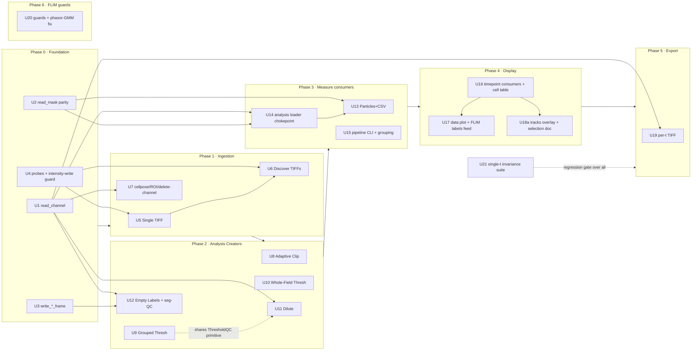

# feat: Multi-timepoint feature parity across the app

## Overview

PerCell4 added a leading time axis to the **storage layer** and a handful of core
features in the prior, now-completed plan
[`2026-05-21-003-feat-time-lapse-tracking-lineage-plan.md`](2026-05-21-003-feat-time-lapse-tracking-lineage-plan.md)
(import → store → session → viewer → segmentation → tracking → measurement). That
foundation is solid and well-tested. But **most other features were written for the
single-timepoint world and silently mis-handle, collapse, or crash on the time axis.**

A full feature-by-feature audit (9 domains, 94 features — embedded as the
[Appendix](#appendix-timepoint-readiness-audit)) classified each feature as
supported / partial / broken / missing. This plan **propagates the existing
per-timepoint contract** (the "canonical contract" below) to every intensity-based
feature that still drops the T axis: ingestion (Add Layer), the interactive analysis
Creators (the three reported bugs — Add Layer, Grouped Thresholding, Adaptive Local
Clipping — plus dilute, whole-field, puncta), measurement & particle consumers,
peer-view display & cross-window time coupling, and image export. It also adds the
missing foundation helpers those features need, and installs **discoverability guards**
on the FLIM/phasor surfaces (whose full time-lapse support is a separate, deferred
storage effort).

The unifying principle: **pure domain functions stay 2D; callers slice to one frame.**
Almost every fix is "wire the canonical per-timepoint loop into a caller," not "rewrite
an algorithm."

---

## Problem Frame

A user loads a multi-timepoint dataset (e.g. the senescence time-lapse at
`/Volumes/KGW/Senescense_Experiments/tiffs/New Folder With Items`, imported via Compress
into a `(T,C,H,W)` `.h5`). The viewer shows a working time slider. Then:

- **Add Layer to Dataset** loads a single plane to *all* timepoints — it ignores the
  `_t` token and, for a Channel layer, concatenates a 2D plane onto the `(T,…)`
  intensity along the T axis while stamping `dims=['C','H','W']`, **silently corrupting**
  the array and the `n_timepoints` invariant.
- **Grouped Thresholding** errors: `IndexError: boolean index did not match indexed
  array along dimension 0; dimension is 6 but corresponding boolean dimension is 485`
  — it hands a whole `(T,H,W)` channel and 2D labels to a 2D measurer.
- **Adaptive Local Clipping** runs detection on only the displayed frame and broadcasts
  that one result to every timepoint.

These are three instances of one systemic gap: features that predate the time axis treat
a `(T,…)` array as 2D/`(C,…)`. The audit found ~40 broken/partial features sharing this
root. The foundation already proves the fix shape (`MeasureCells._measure_timelapse`,
`run_cellpose_stack`, `TimelapseThresholdQCQueueEntry`); this plan applies it everywhere.

---

## Requirements Trace

- R1. **Add Layer never corrupts a multi-timepoint dataset.** Every ingestion path writes
  a correctly-shaped `(T,…)` resource (or an explicit time-invariant 2D one), with the
  `dims` attr and `n_timepoints` invariant preserved.
- R2. **Grouped Thresholding runs per-frame** on a time-lapse dataset without the
  boolean-index crash, producing a `(T,H,W)` mask.
- R3. **Adaptive Local Clipping detects every frame** and writes a `(T,H,W)` mask.
- R4. **All single-dataset analysis Creators** (whole-field threshold, dilute-phase,
  puncta accept, create-empty-labels, in-QC re-run) emit per-frame `(T,H,W)` results on
  multi-t datasets.
- R5. **Measurement & particle consumers** (analyze particles + CSV, per-particle
  multichannel/donut, whole-field intensity, cell grouping, headless pipeline) loop per
  timepoint and tag output rows with a `timepoint` column.
- R6. **Peer views and selection follow the active timepoint** — cell table, data plot,
  phasor plot, and the napari Tracks overlay react to `ACTIVE_TIMEPOINT_CHANGED`.
- R7. **Export Images writes one TIFF per timepoint** with a `_t{NN}` suffix.
- R8. **Foundation read/write helpers are time-aware and symmetric** — `read_channel`,
  repo `read_mask`/`read_channel`, `write_labels_frame`/`write_mask_frame`,
  `is_time_stacked`/`masks_shape`.
- R9. **FLIM/phasor features guard or skip discoverably** on multi-t datasets (no silent
  single-frame collapse); full FLIM time-lapse is deferred.
- R10. **Single-timepoint behavior is byte-identical** everywhere — no `timepoint`
  column, no `_t` suffix, no shape/behavioral change when `n_timepoints == 1`.
- R11. **2D labels/masks remain time-invariant broadcasts**; per-frame Creators always
  emit `(T,H,W)` on multi-t; an intentional 2D gate is surfaced in the UI, not silent.

**Origin:** No upstream `ce-brainstorm` requirements doc. The origin context is the
completed foundation plan
[`2026-05-21-003`](2026-05-21-003-feat-time-lapse-tracking-lineage-plan.md) (its
"Deferred to Follow-Up Work" and the broader feature surface it did not touch) plus the
embedded audit. Key product decisions were resolved with the user during planning (see
[Key Technical Decisions](#key-technical-decisions)).

---

## Scope Boundaries

- **Non-goal: FLIM/phasor time-lapse storage rewrite.** `/decay` has no acquisition-T
  axis (only the photon-decay histogram). Representing multi-timepoint FLIM requires a
  new decay schema — out of scope. This plan only adds **guards/skip-reasons** so the
  silent single-frame collapse becomes discoverable, plus one cheap crash fix (phasor-GMM
  reads at the active timepoint).
- **Non-goal: 3D (z-stack) time-lapse.** Z-projection runs before the time axis as today.
- **Non-goal: manual track editing / per-particle trackers.** Tracking is computed,
  reviewed, re-run — not hand-edited.
- **Non-goal: changing the selection identity model.** `CellId` stays a scalar int;
  cross-window selection stays global-by-label (correct for tracked ids). No
  `(label, timepoint)` selection key.
- **Non-goal: new analysis algorithms.** Pure 2D domain functions (`measure_multichannel`,
  particle metrics, `THRESHOLD_METHODS`, grouper, DTCWT, `compute_phasor`) are unchanged;
  only their callers gain a per-frame loop.

### Deferred to Follow-Up Work

- **Full FLIM/phasor time-lapse** (`/decay` acquisition-T schema + `read_decay_frame` +
  per-t phasor/lifetime/wavelet/FRET/npz): a separate plan. Audit rows 14, 21–23, 54–64,
  73. Prerequisite for ~16 phasor features.
- **Lineage integration of analysis masks** (threshold/grouped/particle membership keyed
  on `track_id` so a cell's classification follows its track): audit rows 94–95. Depends
  on this plan's per-frame masks existing first.
- **U18b — interactive "complete tracks only" filter** (wire
  `lineage.select_complete_tracks`, currently batch-only at `phases.py:1957`, into the
  data-plot/export): audit row 95. A new filter-UX path with no R1–R11 requirement (R6 is
  satisfied by U18a's slider-follows-frame); deferred so U18a stays implementable without
  the new UI decision.
- **Per-frame ROI / phasor-`.npz` ingestion** (multiple `_t` ROI zips; per-t `.npz`):
  audit rows 19, 23. Low priority; time-invariant default is acceptable today.
- **Tracking UX polish** — QThread worker for `Track Cells`, "tracked layer is stale"
  indicator after manual edits (audit row 93).

---

## Context & Research

### The Canonical Time-Handling Contract (north star)

Every implementation unit must conform to this contract, synthesized from the audit and
the existing exemplars. It is the single reference for "what correct looks like."

**A. Storage shape & disambiguation (`store.py`)**
- `/intensity` may be `(H,W)`, `(C,H,W)`, `(T,H,W)`, or `(T,C,H,W)`. The **only**
  authoritative discriminator is the dataset's `.attrs["dims"]`: a leading `'T'` means
  time-stacked. **Never** infer the time axis from `ndim` or a "leading dim ≤ 20"
  heuristic (`layout.split_channels_2d`'s footgun, safe only because callers pre-slice).
- `/metadata.attrs["n_timepoints"]` (≥1) is the count, inferred from `/intensity`. A
  feature reads `session.n_timepoints` — **not** `array.ndim` — to decide single-vs-multi.
- `/labels/<name>` and `/masks/<name>` may be 2D `(H,W)` = **time-invariant** (broadcast
  to every frame) or `(T,H,W)` = per-frame. `_validate_layer_shape` accepts 2D always,
  and `(T,H,W)` only on a time-lapse dataset with matching `native_shape` + `n_timepoints`.
- `/tracks/<name>` is a per-track CSV table. `/labels/<seg>_tracked` has label value ==
  track id across all frames.
- `/decay/<ch>` is `(H,W,T_bins)` where T is the **TCSPC histogram** axis, **not**
  acquisition time. There is currently **no** acquisition-T axis for decay/phasor.
- **Precondition — the `dims` attr must be trustworthy.** `n_timepoints` is inferred
  *solely* from `/intensity.attrs["dims"][0] == 'T'` (`store.py:89-90`) — the exact attr the
  Add-Layer Channel bug corrupts (it stamps `['C','H','W']` onto a `(T,H,W)` array). A
  dataset corrupted that way reads back as `n_timepoints == 1`, so **every** fixed feature
  silently takes the single-t path and the contract never engages. U4 therefore adds a
  dims-consistency probe at dataset-open that fails loud when the leading-axis count
  disagrees with both `n_channels` and `n_timepoints`. The whole contract assumes this
  probe passes.

**B. Per-frame read (the only correct way to touch one timepoint)**
- Intensity: `store.read_array_frame(path, t)`; repo `read_channel_images(handle, timepoint=t)`.
- Labels: `store.read_labels(name, timepoint=t)` (broadcasts 2D, slices `(T,H,W)`).
- Masks: `store.read_mask(name, timepoint=t)` — **gap: missing the 2D-broadcast guard
  `read_labels` has, and repo/adapter `read_mask` omits the `timepoint` param** (U2 fixes).
- **Never** use `store.read_channel(path, idx)` on a possibly-time-stacked array — it
  reads the leading axis as channels (frame 0 on `(T,H,W)`) and raises "got 4D" on
  `(T,C,H,W)` (U1 fixes).
- **On-disk per-frame reader rule (load-bearing for U8–U15).** Inside a `for t in
  range(n_timepoints)` loop, read each frame via the on-disk slicing readers
  (`read_array_frame` / `read_labels(timepoint=t)` / `read_mask(timepoint=t)`) — **never**
  read the whole `(T,…)` array once and index `arr[t]` in Python. Read-whole-then-index is
  `O(T²)` I/O and `T`-peak memory on a long movie. Any unit approach below that says
  "slice `layer.data[t]`" or copies `MeasureCells`'s legacy `mask_full[t]` slice
  (`measure_cells.py:144-148`, predates U2) must use the readers instead. The one exception
  is an interactive panel that already holds the active napari frame for *preview* of the
  displayed timepoint only.

**C. The canonical per-timepoint loop (copy this shape)**
`MeasureCells._measure_timelapse` (`application/use_cases/measure_cells.py:110`):
> `if session.n_timepoints <= 1:` run the historical 2D path **byte-identical** (no
> `timepoint` column). `else: for t in range(n_timepoints):` read frame/labels/mask at
> `timepoint=t`, run the **pure 2D** domain function, tag `df['timepoint']=t`, concat;
> then `_join_lineage` attaches `track_id`/`tree_id`/`parent_track_id` for tracked segs.

Other in-repo exemplars to reuse rather than reinvent:
`adapters/cellpose.run_cellpose_stack` + `segment_cells.finalize` (per-frame inference);
`gui/workflows/single_cell/threshold_qc_queue.py` `TimelapseThresholdQCQueueEntry`
(drives the single-frame `ThresholdQCController` once per timepoint with
`persist_round_outputs=False`, `np.stack` → `(T,H,W)`); `workflows/phases.py`
(headless seg/threshold/measure loops); `use_cases/track_cells.py`.

**D. Pure domain functions stay 2D.** Callers slice to a 2D frame before calling. Never
hand a whole `(T,H,W)` stack to a 2D measurer against 2D labels — that is the
boolean-index-mismatch / 3D-bbox-unpack crash class.

**E. Write-back.** Whole-stack: build the `(T,H,W)` array per-frame, then `write_labels`/
`write_mask` once (already validated). Per-frame edits use `write_labels_frame`/
`write_mask_frame` (U3 adds these — currently missing).

**F. Selection / display.** `session.active_timepoint` is the Selector; the napari dims
slider is its UI. Peer views subscribe to `ACTIVE_TIMEPOINT_CHANGED` and slice the
measurements df by its `timepoint` column (or re-read via the per-frame readers).
Cross-window selection is global-by-label — correct **only** for tracked ids.

**G. Single-timepoint invariance.** Every fix leaves the single-t path byte-identical.

### Relevant Code and Patterns

- **Exemplars (do not modify; copy their shape):** `application/use_cases/measure_cells.py`,
  `adapters/cellpose.py` (`run_cellpose_stack`), `application/use_cases/segment_cells.py`
  (`finalize`/`run_inference_stack`), `gui/workflows/single_cell/threshold_qc_queue.py`
  (`TimelapseThresholdQCQueueEntry`), `workflows/phases.py`,
  `application/use_cases/track_cells.py`, `application/use_cases/batch_process_datasets.py`,
  `adapters/importer.py` (`_group_by_timepoint` → `stack_timepoints`).
- **Token plumbing:** `domain/io/timepoints.py` (`count_timepoints`,
  `ordered_timepoint_tokens`, `timepoint_label`), `domain/io/scanner.py` (parses `_t`).
- **Disambiguation helper:** `domain/io/layout.py` `split_intensity_layers` (T-vs-C via
  `n_timepoints`).

### Institutional Learnings

- `docs/solutions/logic-errors/single-channel-bin-token-fallback-2026-05-25.md` —
  **Add Layer and the importer are parallel file-format parsing paths that drift.** The
  importer handles timepoints; Add Layer's hand-rolled scan does not. The fix is to make
  Add Layer **delegate to the importer's assembly helpers**, not re-implement them. Its
  "Prevention" also flags: vendor exports omit decorations in degenerate cases (single
  channel/timepoint/tile) — test those explicitly.
- Audit cross-cutting risk: a shared chokepoint (`store.read_channel`, `loader.load_layers`)
  silently backs many features; fix the chokepoint once rather than per-feature.

### External References

None required — every fix follows an existing in-repo pattern; no new library or
external contract is introduced.

---

## Key Technical Decisions

- **D1 — Reuse the canonical per-timepoint loop; keep domain functions 2D.** The fix for
  nearly every broken feature is to wire the `_measure_timelapse` / `TimelapseThresholdQCQueueEntry`
  shape into its caller. Rationale: minimizes blast radius, reuses tested primitives, and
  preserves the single-t path. (Contract §C/§D.)
- **D2 — Foundation chokepoints first.** Fix `store.read_channel`, repo `read_mask`/
  `read_channel` parity, `write_*_frame`, and `is_time_stacked`/`masks_shape` **before**
  feature work (Phase 0). Rationale: `read_channel` alone backs the analysis loader,
  dilute queue, and seg-QC re-run; fixing it centrally turns ~10 downstream fixes into
  loop-wiring instead of helper rewrites. (Audit cross-cutting risk #1.)
- **D3 — Per-frame auto thresholds & auto-window.** *(User-confirmed.)* Auto thresholds
  (Otsu/Li/Triangle) and the adaptive-clip auto-window are recomputed independently per
  timepoint. Rationale: biologically correct under photobleaching/intensity drift. A
  manual scalar threshold broadcasts identically either way. **Known cost:** independent
  per-frame thresholds can jitter mask area frame-to-frame on near-bimodal histograms,
  which feeds noise into per-cell time-series and any future track-linked classification.
  Acceptance for U8/U10 must validate against a real bleaching time-lapse (mask-area jitter
  within tolerance / not pathologically discontinuous), not merely assert thresholds differ.
- **D4 — Export: one TIFF per timepoint, `_t{NN}` suffix.** *(User-confirmed.)* Mirrors
  the import token convention; scriptable; round-trips back through Add Layer/Compress.
- **D5 — FLIM time-lapse deferred; guards only.** *(User-confirmed.)* No decay-schema
  rewrite this plan. Add guards that raise/skip-with-reason when FLIM params are present
  and `n_timepoints > 1`, plus the cheap phasor-GMM active-timepoint read fix.
- **D6 — `2D = time-invariant` retained; per-frame Creators always emit `(T,H,W)`.** The
  broadcast stays the contract for genuine gates (whole-field, ROI sets). Fix `read_mask`'s
  missing broadcast guard so it stops crashing; add `/intensity` write-path validation so
  Add Layer can't corrupt; surface an intentional 2D mask in the UI. (Contract §A; audit
  risk #3.)
- **D7 — Cross-window selection stays global-by-label.** Document and enforce that
  cross-frame selection is meaningful only on **tracked** segmentations; untracked peer
  views are frame-scoped (slice by `active_timepoint`). No `(label, timepoint)` key —
  large blast radius for no concrete need. (Audit risk #5.)
- **D8 — Peer views: slider-follows-frame.** When a measurements df has a `timepoint`
  column, peer views slice to `session.active_timepoint` and re-slice on
  `ACTIVE_TIMEPOINT_CHANGED`. Rationale: simplest correct model; tracked datasets still
  highlight the same track across frames (label == track id).

---

## Open Questions

### Resolved During Planning

- Intensity-feature scope → **full propagation, Phases 0–5** (user).
- FLIM/phasor time-lapse → **deferred; guards only** (user, D5).
- Auto-threshold / auto-window across frames → **per-frame** (user, D3).
- Export format → **one TIFF per timepoint, `_t{NN}`** (user, D4).
- 2D-mask broadcast default → **keep time-invariant; Creators emit `(T,H,W)` on multi-t;
  surface intentional 2D** (D6).
- Cross-window selection model → **global-by-label, tracked-only cross-frame semantics**
  (D7); peer views slider-follows-frame (D8).

### Deferred to Implementation

- **Cell-grouping key on multi-t** (U9): per-frame clustering (each frame's cells clustered
  independently on that frame's values, matching per-frame thresholds) vs
  per-track-trajectory aggregation. Default to per-frame; confirm against a real movie.
- **`write_*_frame` promotion semantics** (U3): when an existing 2D time-invariant
  resource receives its first per-frame write, promote-by-broadcast to `(T,H,W)` then
  splice. Default: **promote-with-surfacing** (log / UI note — never silent, since it
  irreversibly converts a gate into a per-frame stack); resolve promote-vs-refuse before
  U3 lands.
- **In-QC seg re-run frame scope** (U12): re-segment all frames (`run_cellpose_stack`) vs
  only the displayed frame and splice. Default: match `segmentation_panel._on_run_cellpose`
  rank dispatch (all frames); decide against runtime on a long movie.
- Exact helper/method names, final per-file edit anchors (line numbers will have drifted),
  and napari overlay refresh timing — resolved against real code during execution.

---

## High-Level Technical Design

> *This illustrates the intended approach and is directional guidance for review, not
> implementation specification. The implementing agent should treat it as context.*

**The one shape every feature adopts** (pseudocode, per the contract §C):

```
def feature(session, repo, ...):
    if session.n_timepoints <= 1:
        return historical_2d_path(...)          # BYTE-IDENTICAL, no `timepoint` column
    frames = []
    for t in range(session.n_timepoints):
        img_t    = repo.read_channel_images(handle, timepoint=t)   # per-frame, on-disk slice
        labels_t = repo.read_labels(handle, seg, timepoint=t)      # 2D broadcast or (T,H,W) slice
        mask_t   = repo.read_mask(handle, mask, timepoint=t)       # (after U2 parity)
        out_t    = pure_2d_domain_fn(img_t, labels_t, mask_t, ...) # UNCHANGED 2D primitive
        frames.append(tag(out_t, timepoint=t))   # df-row → column; mask-frame → np.stack
    return assemble(frames)                       # pd.concat  OR  np.stack(axis=0) → (T,H,W)
```

**Phase dependency graph** (U-IDs; arrows = "must land first"):



---

## Implementation Units

### Phase 0 — Storage & repository foundation (per-frame helpers)

- U1. **Make `store.read_channel` (and repo `read_channel`) timepoint-aware**

**Goal:** The single-channel-plane reader stops misreading a leading T axis as channels.

**Requirements:** R8 (foundation), R10.

**Dependencies:** None.

**Files:**
- Modify: `src/percell4/store.py` (`read_channel`, ~`store.py:328`)
- Modify: `src/percell4/ports/dataset_repository.py`, `src/percell4/adapters/hdf5_store.py`
  (add `read_channel` parity / `timepoint` param where consumed)
- Test: `tests/test_store.py`, `tests/test_adapters/test_hdf5_store_view.py`

**Approach:**
- Add a `timepoint: int | None = None` param. When the `dims` attr marks a leading `'T'`,
  slice the requested timepoint first, then index `channel_idx` on the resulting
  `(H,W)`/`(C,H,W)` — mirror `read_array_frame`'s dims check (`store.py:391-394`).
- For a 2D / `(C,H,W)` non-time array, behavior is **byte-identical** to today.
- Reject `(T,C,H,W)` only when no `timepoint` is given (today's "got 4D" path becomes
  reachable-with-`timepoint` instead of a hard wall).

**Patterns to follow:** `store.read_array_frame` (`store.py:371`).

**Test scenarios:**
- Happy path: `read_channel('intensity', 0, timepoint=2)` on `(T,C,H,W)` returns frame 2,
  channel 0 as `(H,W)`.
- Edge case: `read_channel('intensity', 0)` on `(T,H,W)` with `timepoint` given returns
  that frame's plane; with `timepoint=None` raises a clear "specify timepoint on a
  time-stacked array" error (not a silent frame-0).
- Edge case (backward compat): on a plain `(C,H,W)` array, `read_channel('intensity', 1)`
  returns the byte-identical channel-1 plane as today; `timepoint` defaults to None and is
  ignored.
- Error path: `channel_idx` out of range still raises `IndexError` with the existing message.

**Verification:** No caller of `read_channel` on a time-stacked dataset returns frame 0 by
accident; existing single-t `read_channel` tests pass unchanged.

---

- U2. **`read_mask` 2D-broadcast guard + repo/adapter `read_mask(timepoint=)` parity**

**Goal:** Fix a **live production crash** and bring masks to label parity. `store.read_mask`
*already accepts* a `timepoint` param (`store.py:611`), but its `timepoint`-given branch
calls `read_array_frame` directly **without** the `_is_2d_array` broadcast guard
`read_labels` has — so `read_mask(name, timepoint=t)` raises `IndexError` for any `t != 0`
on a 2D time-invariant mask. The shipped time-lapse measure path (`phases.py`) already calls
`read_mask(..., timepoint=t)`, so a 2D gate on a multi-t dataset crashes **today**. The port
and adapter genuinely still lack the param.

**Requirements:** R8, R11, R10.

**Dependencies:** None.

**Files:**
- Modify: `src/percell4/store.py` (`read_mask`, ~`store.py:611-625` — add the
  `_is_2d_array` branch to the **existing** `timepoint`-given branch, mirroring
  `read_labels` at `store.py:572-575`)
- Modify: `src/percell4/ports/dataset_repository.py` (`read_mask`, ~`:87`),
  `src/percell4/adapters/hdf5_store.py` (`read_mask`, ~`:152` — add `timepoint` param,
  delegate to `store.read_mask(name, view_bin, timepoint)`)
- Test: `tests/test_store.py`, `tests/test_adapters/test_hdf5_store_view.py`

**Approach:**
- In `store.read_mask`, when `timepoint` is given and the mask is 2D
  (`_is_2d_array(path)`), return the whole 2D array (time-invariant broadcast) — exactly
  mirroring `read_labels`. Only slice via `read_array_frame` when the mask is `(T,H,W)`.
- Thread `timepoint` through the port + adapter so downstream loops stop reading the whole
  mask and slicing by hand.
- **Mandatory (one broadcast policy):** replace `MeasureCells`'s manual `mask_full[t]` slice
  (`measure_cells.py:144-148`) with `repo.read_mask(handle, name, timepoint=t)` so there is a
  single broadcast policy. Add a regression test reproducing a time-lapse measure against a
  2D time-invariant mask (the case that crashes today).

**Patterns to follow:** `store.read_labels` 2D-broadcast branch (`store.py:553-576`).

**Test scenarios:**
- Happy path: `read_mask(name, timepoint=3)` on a 2D time-invariant mask returns the same
  `(H,W)` for every `t` (no `IndexError`).
- Happy path: `read_mask(name, timepoint=3)` on a `(T,H,W)` mask returns frame 3.
- Regression: the previously-crashing `timepoint != 0` on a 2D mask now succeeds (this is
  the bug `read_labels` already fixed for labels).
- Edge case (backward compat): `read_mask(name)` (no `timepoint`) returns the whole array
  unchanged.

**Verification:** A time-lapse measure against a 2D time-invariant mask no longer raises;
repo `read_mask` accepts `timepoint`; `MeasureCells` routes its per-frame mask through the
param (no remaining manual `mask_full[t]` slice).

---

- U3. **Per-frame write helpers `write_labels_frame` / `write_mask_frame` (+ repo port)**

**Goal:** Provide the missing symmetric per-frame *write* so interactive editors and
per-frame Creators can persist one timepoint without re-implementing read-splice-write.

**Requirements:** R8, R4.

**Dependencies:** None (used by U12; usable by U8–U11).

**Files:**
- Modify: `src/percell4/store.py` (add `write_labels_frame`, `write_mask_frame`)
- Modify: `src/percell4/ports/dataset_repository.py`, `src/percell4/adapters/hdf5_store.py`
- Test: `tests/test_store.py`

**Approach (three cases, per audit fix_shape):**
1. Resource **absent** and `n_timepoints > 1`: allocate a `(T, *native_shape)` zero stack
   with the correct `dims` attr, then assign the frame.
2. Resource present and **2D** on a time-lapse dataset: promote to `(T,H,W)` by
   broadcasting the existing plane, then splice the new frame. This **irreversibly converts a
   time-invariant gate into a per-frame stack**, so it must be **surfaced** (logged / a UI
   note), not done silently — mirror U5/U7's intentional-2D surfacing. Resolve the
   promote-vs-refuse choice before U3 lands (default: promote-with-surfacing).
3. Resource present and **`(T,H,W)`**: open in `'a'` mode and assign `ds[t] = frame`
   **without** delete+recreate (per-frame chunking at `store.py:189-192` makes this a
   single-chunk write).
- Reuse `_validate_layer_shape`'s `native_shape`/`n_timepoints` consistency checks; enforce
  dtype (int32 labels / uint8 masks).

**Patterns to follow:** `write_labels`/`write_mask` validation (`store.py:497-528`);
`read_array_frame` dims handling.

**Test scenarios:**
- Happy path: `write_mask_frame(name, frame, t=2)` on a fresh time-lapse dataset allocates
  `(T,H,W)`, sets frame 2, leaves others zero; a subsequent `read_mask(name, timepoint=2)`
  round-trips.
- Edge case: writing frame `t` to an existing 2D time-invariant mask promotes it to
  `(T,H,W)` with the old plane broadcast to all frames except `t`.
- Edge case: writing to an existing `(T,H,W)` resource does **not** delete/recreate the
  dataset (assert the other frames' bytes are untouched).
- Error path: `t` out of `[0, n_timepoints)` raises; a frame whose shape ≠ `native_shape`
  raises `LayerSizeMismatchError`.
- Edge case (single-t): on `n_timepoints == 1`, `write_*_frame(..., t=0)` writes the 2D
  resource exactly as `write_labels`/`write_mask` would.

**Verification:** A manual edit to one frame persists to that frame only and survives a
reload at the correct timepoint.

---

- U4. **`is_time_stacked()` / `masks_shape()` probes + dims-corruption detection (open + write) + fail-loud 2D measurer assert**

**Goal:** Give callers a public time-stacked predicate, **detect already-corrupted datasets
at open** (not just guard future writes), and fail loud when a 2D measurer is handed a 3D
image.

**Requirements:** R8, R1, R11.

**Dependencies:** None.

**Files:**
- Modify: `src/percell4/store.py` (add `is_time_stacked(hdf5_path) -> bool`,
  `masks_shape(name)`; add a dims-consistency probe — see Approach)
- Modify: `src/percell4/adapters/hdf5_store.py` (call the consistency probe when a dataset
  is opened/loaded so a corrupted `.h5` is detected, not silently single-t'd),
  `src/percell4/ports/dataset_repository.py`
- Modify: `src/percell4/domain/measure/measurer.py` (`assert image.shape == labels.shape`
  in `measure_cells`/`_iter_cell_crops`, ~`measurer.py:166`)
- Test: `tests/test_store.py`, `tests/test_measure/test_measurer.py`,
  `tests/test_adapters/test_hdf5_store_view.py`

**Approach:**
- `is_time_stacked` returns `True` iff `dims[0] == 'T'` — promote the inline check from
  `read_array_frame` (`store.py:391-394`) to a public method; `masks_shape` mirrors
  `labels_shape` (`store.py:431`). *(`masks_shape` is added for symmetry; U7's
  delete-channel disambiguation is the first concrete consumer of `is_time_stacked`.)*
- **Dims-corruption probe (the key addition):** a function that cross-checks `/intensity`'s
  `dims` leading-axis against `intensity.ndim` and `len(channel_names)`/`n_timepoints`. The
  Add-Layer Channel bug stamps `dims=['C','H','W']` onto a `(T,H,W)` array; that dataset
  reads back as `n_timepoints == 1`, so every fixed feature silently takes the single-t path
  (the exact silent-collapse this plan exists to eliminate). The probe **fails loud (or
  flags for repair)** when the leading axis agrees with neither `n_channels` nor
  `n_timepoints`. Surface it at **dataset-open** (latent on-disk corruption) **and** as the
  pre-write check at the Add-Layer write sites (future corruption).
- **Write-guard location (committed):** do **not** add a guard inside the shared
  `store.write_array` (`store.py:251`) — it has ~23 legitimate callers, including
  `compute_lifetime` (appends a derived channel, legitimately changing the C axis),
  `apply_wavelet`, and `data_panel` delete-channel, which a leading-axis guard would wrongly
  reject. Instead validate **caller-side at the Add-Layer write sites only** (U5/U6),
  reusing the probe. Enumerate the non-Add-Layer intensity writers (the ~23) so the
  implementer keeps them on the unguarded path.
- The measurer assert is defensive: a 3D image against 2D labels raises a clear "image and
  labels must share 2D shape; caller must slice per timepoint" message instead of the
  cryptic boolean-index error.

**Patterns to follow:** `labels_shape` (`store.py:431`); `_validate_layer_shape`;
`layout.split_intensity_layers` (the `n_timepoints`-vs-`n_channels` disambiguation).

**Test scenarios:**
- Happy path: `is_time_stacked('intensity')` is `True` for `(T,C,H,W)`/`(T,H,W)`, `False`
  for `(C,H,W)`/`(H,W)`; `masks_shape(name)` returns the on-disk shape without loading data.
- Error path (latent corruption): opening a deliberately mis-stamped `.h5` (a `(T,H,W)`
  intensity carrying `dims=['C','H','W']` on a `T`-timepoint dataset) is **detected** — it
  is not silently treated as single-t. *(This fixture is also used by U21.)*
- Error path (future corruption): a regressed Add-Layer write that stamps the wrong leading
  axis is rejected caller-side.
- Error path: `measure_cells(image_3d, labels_2d)` raises the clear shape-mismatch assert,
  not `IndexError: boolean index ...`.
- Edge case (backward compat): single-t `/intensity` writes unchanged; `is_time_stacked`
  is `False`; the probe passes silently on a correctly-stamped `(C,H,W)` dataset; the ~23
  non-Add-Layer intensity writers (incl. `compute_lifetime`'s channel append) are unaffected.

**Verification:** An already-corrupted dataset is flagged at open rather than silently
single-t'd; downstream Selectors/Actions branch on `is_time_stacked` without re-deriving the
dims test; legitimate non-Add-Layer intensity writes still pass.

---

### Phase 1 — Ingestion (stop corrupting multi-t datasets on Add Layer)

- U5. **Add Layer → Single TIFF (Channel / Segmentation / Mask) becomes time-aware**

**Goal:** A single-TIFF add either builds a correct `(T,…)` resource or an explicit
time-invariant 2D one — never a corrupting concat.

**Requirements:** R1, R11, R10.

**Dependencies:** U4 (intensity-write guard).

**Files:**
- Modify: `src/percell4/gui/add_layer_dialog.py` (`_on_import_single_tiff` ~`:139`,
  `_write_layer` ~`:717`)
- Test: `tests/test_gui/test_add_layer_timepoint.py` (new)

**Approach:**
- `_on_import_single_tiff` holds a **single raw numpy array** from `tifffile.imread` with no
  `FileScanner`/`.tokens` and a single filename carries no varying `_t` token — so the
  importer's token-driven helpers (`_group_by_timepoint`/`_assemble_plane`, which consume
  token-bearing `FileMatch` lists) are **not** usable here. **Branch on the loaded array's
  rank instead**, not on a token.
- Stop the unconditional `array[0]` flatten (`:151-152`). A `>2D` TIFF on a
  `n_timepoints > 1` dataset is treated as a `(T,H,W)` stack — validate the leading dim
  equals `session.n_timepoints`, raise `LayerSizeMismatchError` otherwise. A 2D TIFF is the
  explicit time-invariant case.
- **Channel:** in `_write_layer`, when the dataset is time-lapse, the new channel plane must
  itself be `(T,H,W)`; the concat must be on the **C axis** — promote existing `(T,H,W)` →
  `(T,1,H,W)` and the new channel → `(T,1,H,W)`, concat on `axis=1`, stamp
  `dims=['T','C','H','W']` (validated by U4's caller-side guard).
- **Segmentation / Mask:** pass the full `(T,H,W)` stack to `write_labels`/`write_mask`
  (already validated). A 2D source stays the intentional time-invariant case — surface it
  with a UI note ("added as a time-invariant layer — same plane for every timepoint").

**Patterns to follow:** `segmentation_panel._on_run_cellpose` rank dispatch; contract §A/§E.
*(Importer assembly-helper delegation applies to U6, where `scan.files` genuinely carries
tokens — not here.)*

**Test scenarios:**
- Happy path (Channel): adding a `(T,H,W)` TIFF to a `(T,C,H,W)` dataset yields
  `(T,C+1,H,W)` with `dims=['T','C','H','W']` and an updated `channel_names`.
- Happy path (Segmentation): adding a `(T,H,W)` labels TIFF writes a `(T,H,W)` labels
  resource selectable across the slider.
- Edge case (2D into multi-t): adding a 2D plane writes a time-invariant resource and the
  UI shows the "time-invariant" note; reading any `t` returns that plane.
- Error path: adding a TIFF whose frame count ≠ `n_timepoints` raises a clear
  `LayerSizeMismatchError`-style message (caught by U4's guard), not silent corruption.
- Edge case (backward compat / single-t): adding a 2D TIFF to a single-t dataset behaves
  byte-identically to today.

**Verification:** The reported bug is gone — adding a `tXX/chXX` layer to the senescence
dataset produces a per-timepoint layer, not one plane broadcast to all frames.

---

- U6. **Add Layer → Discover TIFFs (batch tab) groups by timepoint**

**Goal:** The batch discovery tab assembles per-timepoint stacks like the importer, instead
of collapsing each channel to one plane.

**Requirements:** R1, R10.

**Dependencies:** U4, U5 (shared `_write_layer`).

**Files:**
- Modify: `src/percell4/gui/add_layer_dialog.py` (`_on_import_batch` ~`:480`, the
  `by_channel`/`tile_groups` loop ~`:536-569`)
- Test: `tests/test_gui/test_add_layer_timepoint.py`

**Approach:**
- After grouping by channel, group each channel's files **by timepoint**
  (`ordered_timepoint_tokens`), assemble one stitched plane per timepoint, then
  `stack_timepoints` → `(T,H,W)`, and write via the T-aware `_write_layer` (U5). The
  cleanest implementation **delegates to `importer`'s assembly helpers** rather than
  duplicating the stitch/stack logic (per the institutional learning on parser drift).
- The discovery summary already reports timepoints (`add_layer_dialog.py:457-458`) — the
  consuming code (`:537`) just discards them; wire them through.

**Patterns to follow:** `importer.import_dataset` channel/timepoint assembly
(`importer.py:229-247`).

**Test scenarios:**
- Happy path: a folder of `a_t00_ch00 … a_t02_ch01` files imports two channels each as
  `(3,H,W)`, stacked to `(3,2,H,W)`.
- Edge case: a channel missing a timepoint that others have raises the importer's
  per-channel completeness error, not a mis-stack.
- Edge case (tiles × timepoints): stitching composes per timepoint (each `t` stitched
  independently before stacking).
- Edge case (backward compat): a flat single-timepoint folder imports byte-identically to
  today.

**Verification:** Batch-adding the senescence folder reproduces the same `(T,C,H,W)` shape
Compress would have produced.

---

- U7. **Add Layer → Cellpose `.npy` / ROI `.zip` rank policy + Delete-channel-layer `(T,C,H,W)` fix**

**Goal:** Segmentation imports declare a clear rank policy, and deleting a channel layer
on a time-lapse dataset slices the C axis, not the T axis.

**Requirements:** R1, R11.

**Dependencies:** U1, U4.

**Files:**
- Modify: `src/percell4/adapters/roi_import.py` (`import_cellpose_seg`, ~`:88` — rank
  policy), `src/percell4/gui/add_layer_dialog.py` (`_on_import_cellpose` ~`:692`,
  `_on_import_roi` ~`:620` UI note)
- Modify: `src/percell4/interfaces/gui/task_panels/data_panel.py` (`_on_delete_layer`
  ~`:543-547`)
- Test: `tests/test_adapters/test_roi_import.py`, `tests/test_gui/test_data_panel_delete_layer.py` (new)

**Approach:**
- Cellpose `.npy`: `if masks.ndim == 2` keep the time-invariant broadcast; `if ndim == 3`
  validate the leading dim equals `n_timepoints` and write `(T,H,W)`; else raise a clear
  error. ROI `.zip`: keep 2D time-invariant default, add a UI note (per-frame ROI is
  deferred).
- Delete-channel: disambiguate via `n_timepoints`/`is_time_stacked` (U4) before treating
  axis 0 as channels — for `(T,C,H,W)` slice `axis=1`; for `(T,H,W)` treat as the single
  channel (refuse to slice the time axis). Reuse the `layout.split_intensity_layers`
  contract instead of inferring from shape.

**Patterns to follow:** `domain/io/layout.py` `split_intensity_layers`.

**Test scenarios:**
- Happy path: a 3D Cellpose `.npy` matching `n_timepoints` imports as `(T,H,W)` labels.
- Error path: a 3D `.npy` whose leading dim ≠ `n_timepoints` raises a clear message.
- Happy path (delete): deleting channel 1 of a `(T,C,H,W)` dataset yields `(T,C-1,H,W)`
  with `dims` intact and `channel_names` updated; a `(T,H,W)` single-channel delete does
  **not** drop a timepoint.
- Edge case (backward compat): 2D `.npy`/ROI import and `(C,H,W)` channel delete unchanged.

**Verification:** No Add-Layer path can delete or mis-assign along the time axis.

---

### Phase 2 — Core single-dataset analysis Creators (the reported crashes)

- U8. **Adaptive Local Clipping → per-frame `(T,H,W)` mask**

**Goal:** Detect every timepoint (not just the displayed frame) and persist a `(T,H,W)`
puncta mask.

**Requirements:** R3, R4, R11, D3.

**Dependencies:** None — operates on the in-memory napari channel layer (preview of the
displayed frame is fine) and writes via the existing `write_mask` (which validates
`(T,H,W)`); no existing-mask read, so U2 is not required.

**Files:**
- Modify: `src/percell4/gui/adaptive_clip_panel.py` (`_on_run` ~`:123`, the single-frame
  slice ~`:146-148`)
- Modify (defensive only): `src/percell4/application/use_cases/accept_puncta_mask.py`
  (optional `(T,H,W)`-on-multi-t assertion; the use case is shape-transparent and already
  persists a `(T,H,W)` mask fine)
- Test: `tests/test_gui/test_adaptive_clip_timelapse.py` (new),
  `tests/test_application/test_accept_puncta_mask.py`

**Approach:**
- Dispatch on layer rank exactly like `segmentation_panel.run_cellpose_stack`: when the
  active channel is `(T,H,W)` (`session.n_timepoints > 1`), loop `for t in
  range(n_timepoints)`, run `run_adaptive_detection` on `image[t]`, `np.stack(axis=0)` →
  `(T,H,W)`, write via `AcceptPunctaMask`. Keep detection inside the existing `Worker`
  (QThread) to avoid UI freeze.
- **Auto-window per frame** (D3): the auto-window estimator runs on each `image[t]`. The
  `AdaptiveClipSettingsWidget` config is reused verbatim per frame.

**Patterns to follow:** `segmentation_panel._on_run_cellpose` rank dispatch;
`run_cellpose_stack`; contract §C.

**Test scenarios:**
- Happy path: on a `(T,H,W)` channel, the accepted mask is `(T,H,W)` and frame `t`'s mask
  equals detection run on frame `t` alone (not frame 0 broadcast).
- Edge case: a frame with no puncta contributes an all-zero `(H,W)` mask plane (not a
  skipped frame that mis-stacks the T axis).
- Edge case (auto-window per-frame): two frames with different intensity stats get
  different auto windows (assert the window differs, proving per-frame computation).
- Edge case (backward compat / single-t): a 2D channel produces a 2D mask byte-identically
  to today.

**Verification:** The reported "runs only on a single time-point" symptom is gone; the
mask slider shows a distinct detection per frame.

---

- U9. **Grouped Thresholding (GroupedSegPanel) runs per-frame**

**Goal:** Fix the `IndexError: ... dimension is 6 but corresponding boolean dimension is
485` by slicing per timepoint before the 2D measurer.

**Requirements:** R2, R4, R10.

**Dependencies:** U1 (`read_array_frame` for per-frame channel reads). *(No U2: the run
reads channel + labels, not an existing mask.)*

**Files:**
- Modify: `src/percell4/gui/grouped_seg_panel.py` (`_on_run` ~`:94`,
  `_auto_measure_then_group` ~`:177`, `_run_grouping` ~`:225` — stop capturing whole
  `layer.data` at `:120/:139`; move the whole-array `measure_cells` at `:192` **inside** the
  per-t loop)
- Reference only (do **not** modify): `src/percell4/gui/threshold_qc.py`
  (`ThresholdQCController` stays single-frame — the reusable primitive);
  `src/percell4/domain/measure/grouper.py` (`group_cells_*` stays a **pure 2D/per-frame**
  function — the label-only `pd.Series` index at `:57-61` is correct *because* it is now
  called once per frame on that frame's cells, so labels can't collide across timepoints)
- Test: `tests/test_gui/test_grouped_seg_timelapse.py` (new)

**Approach:**
- Reuse the **`ThresholdQCController` single-frame primitive** (verified to support
  `persist_round_outputs=False` and an arity-3 `on_complete`). **Do not** reuse
  `TimelapseThresholdQCQueueEntry` directly — it is coupled to the batch runner (takes a
  `WorkflowDatasetEntry`, a precomputed `grouping_by_timepoint` dict, `queue_index`/`total`,
  and a `PhaseResult` `on_complete`), none of which exist in the interactive path. Build a
  **new interactive per-timepoint driver** in `GroupedSegPanel` modeled on the QueueEntry's
  *shape*.
- When `session.n_timepoints > 1`: `for t in range(n_timepoints)` read the channel frame via
  `read_array_frame('intensity', t)` and labels via `read_labels(timepoint=t)` (per the
  on-disk reader rule, §B), **measure and group that frame** (the measure at `:192` moves
  inside the loop — global grouping over all frames would contradict per-frame thresholds,
  D3), run the single-frame `ThresholdQCController` to collect each accepted 2D mask, then
  `np.stack` → `(T,H,W)`.
- Simplest correct interactive UX: QC the **active** frame interactively, then apply the
  accepted per-group thresholds frame-by-frame on accept.

**Patterns to follow:** `gui/workflows/single_cell/threshold_qc_queue.py`
`TimelapseThresholdQCQueueEntry` (as a *shape* reference); `measure_cells._measure_timelapse`;
contract §C/§D.

**Test scenarios:**
- Regression (the reported bug): running grouped thresholding on the `(T,H,W)` /
  2D-time-invariant-labels combination no longer raises `IndexError`; it produces a
  `(T,H,W)` mask.
- Happy path: per-frame group membership is computed from that frame's measurements (a
  cell crossing the threshold only in later frames is grouped accordingly).
- Edge case: `(T,H,W)` labels (tracked) — `seg_labels[t]` slices the frame; bbox unpack
  no longer hits the 3D-bbox `ValueError` at `measurer.py:85`.
- Edge case (backward compat / single-t): the existing 2D grouped-threshold flow is
  byte-identical (no `timepoint` column on the mask, same QC UX).

**Verification:** Grouped Thresholding completes on the senescence dataset and writes a
per-frame mask; the status bar no longer shows the measure error.

---

- U10. **Whole-Field Thresholding (Preview + Accept) per-frame, per-frame auto threshold**

**Goal:** Preview operates on the active frame; Accept writes a `(T,H,W)` mask with a
**per-frame** auto threshold.

**Requirements:** R4, D2, D3, R10.

**Dependencies:** U1.

**Files:**
- Modify: `src/percell4/interfaces/gui/task_panels/analysis_panel.py`
  (`_on_threshold_preview` ~`:327`/`:355`, `_on_threshold_accept` ~`:483` — owns the
  per-frame auto-threshold loop)
- Reference only (do **not** change in this unit): `src/percell4/application/use_cases/accept_threshold.py`
  — `AcceptThreshold.execute(image, threshold_value, method, channel_name)`
  (`accept_threshold.py:44-82`) receives **one already-smoothed image and one scalar** and
  does `mask = (image > threshold_value)`; it cannot recompute per-frame auto thresholds.
- Test: `tests/test_application/test_accept_threshold_timelapse.py` (new),
  `tests/test_gui/test_whole_field_threshold_timelapse.py` (new)

**Approach (caller-loop contract — option a):**
- Preview: when the active channel is `(T,H,W)`, slice the active frame
  (`t = viewer.dims.current_step[0]`) before smoothing/threshold/ROI math (mirror
  `adaptive_clip_panel`'s slice). ROI rect indexing operates on the 2D frame.
- Accept: the **caller** (`analysis_panel._on_threshold_accept`, and U15's `run_pipeline`)
  owns the loop. For **auto** methods (otsu/li/triangle/adaptive), `for t in
  range(n_timepoints)` read frame `t` via `read_array_frame`, compute `value_t =
  THRESHOLD_METHODS[method](frame_t)`, build `mask_t`, `np.stack` → `(T,H,W)`, and write via
  `repo.write_mask` directly (D3). `AcceptThreshold.execute` stays **unchanged and
  shape-transparent**. For a **manual scalar** threshold, applying frame-wise broadcasts
  correctly — unchanged. *(U15 must follow the same caller-loop choice.)*

**Patterns to follow:** `workflows/phases._apply_threshold_frame` (already computes the
threshold per 2D frame in the caller); `domain/measure/thresholding.THRESHOLD_METHODS`
(unchanged 2D primitives).

**Test scenarios:**
- Happy path (manual): a scalar threshold on `(T,H,W)` writes a `(T,H,W)` mask equal to
  the per-frame broadcast of that scalar.
- Happy path (auto, per-frame): Otsu on a 2-frame dataset where frame 1 is dimmer yields
  **different** thresholds per frame (assert mask areas differ as expected).
- Edge case: ROI-restricted preview crops the active frame correctly (no T-as-rows
  indexing).
- Edge case (backward compat / single-t): 2D preview + accept unchanged.

**Verification:** Whole-field thresholding produces a per-frame mask responsive to
intensity drift.

---

- U11. **Dilute-phase mask (interactive panel/controller + batch Phase-5 queue) per-frame**

**Goal:** The dilute-phase round loop runs per timepoint and writes a `(T,H,W)` dilute
mask; `write_dilute_mask` stops hard-rejecting `(T,H,W)`.

**Requirements:** R4, R10.

**Dependencies:** U1 (per-frame `read_array_frame`/`read_labels`). *(No U2: the dilute round
reads intensity + labels, not an existing mask.)*

**Files:**
- Reference only (do **not** make `(T,H,W)`-aware): `src/percell4/gui/workflows/dilute_phase/controller.py`
  — `DilutePhaseMaskController` is **2D-stateful** (`__init__` sizes `_cumulative_condensed`
  once from `channel_image.shape` ~`:134`; `finish()` computes `in_cell & ~_cumulative_condensed`
  against 2D `_seg_labels` ~`:237`). It must stay single-frame.
- Modify: `src/percell4/gui/workflows/dilute_phase/panel.py` (whole-layer capture
  ~`:405-409` — drive per-timepoint instead)
- Modify: `src/percell4/application/use_cases/accept_dilute_mask.py` (`write_dilute_mask`
  ~`:53-56` — relax `ndim` to `(2, 3)`, defer rank/frame checks to `_validate_layer_shape`)
- Add: `src/percell4/gui/workflows/single_cell/dilute_queue.py` —
  `TimelapseDilutePhaseQueueEntry` sibling (mirror `TimelapseThresholdQCQueueEntry`),
  selected by the runner's `_is_timelapse` gate
- Test: `tests/test_application/test_accept_dilute_mask.py`,
  `tests/test_gui_workflows/test_dilute_timelapse.py` (new)

**Approach:**
- **Instantiate a fresh `DilutePhaseMaskController` per timepoint** — do **not** loop inside
  one controller (handing it `(T,H,W)` would build a 3D cumulative buffer and break the 2D
  label math). `TimelapseDilutePhaseQueueEntry` (and the interactive panel path) reads each
  frame via `read_array_frame('intensity', t)` + `read_labels(seg, timepoint=t)`, creates a
  new controller with that frame's 2D `channel_image`/`seg_labels`, runs the round loop
  (metric → group → QC → dilate → NaN-subtract) to produce that frame's 2D dilute mask, then
  `np.stack` → `(T,H,W)`. This mirrors `TimelapseThresholdQCQueueEntry`'s per-frame
  controller instantiation (consistent with the plan's "keep the controller single-frame").
- Relax `write_dilute_mask` to accept `ndim in (2, 3)`.

**Patterns to follow:** `TimelapseThresholdQCQueueEntry` (per-frame controller instantiation);
contract §C.

**Test scenarios:**
- Happy path (batch): a `(T,H,W)` dataset produces a `(T,H,W)` dilute mask; frame `t`'s
  condensed region matches the per-frame round result.
- Regression: `write_dilute_mask` accepts a valid `(T,H,W)` array (previously raised);
  still rejects a 4D or mis-shaped array.
- Edge case: the batch runner selects `TimelapseDilutePhaseQueueEntry` only when
  `n_timepoints > 1`; single-t selects the existing 2D entry.
- Edge case (backward compat / single-t): interactive + batch dilute byte-identical to today.

**Verification:** Dilute-phase masking completes on a time-lapse dataset without the
`read_channel` 4D crash or the `write_dilute_mask` rejection.

---

- U12. **Create Empty Labels `(T,H,W)` + Segmentation-QC in-QC re-run rank dispatch**

**Goal:** Manual segmentation starts as a `(T,H,W)` canvas on multi-t (so per-frame edit
handlers engage), and the batch seg-QC re-run segments per frame.

**Requirements:** R4, R10.

**Dependencies:** U1, U3.

**Files:**
- Modify: `src/percell4/gui/segmentation_panel.py` (`_on_create_empty_labels` ~`:606`,
  `_get_image_shape` ~`:585`/`:597`/`:601`)
- Modify: `src/percell4/gui/workflows/single_cell/seg_qc.py` (`_cellpose_input_image`
  ~`:535`, `read_channel` whole-stack ~`:582`, re-run worker ~`:614`)
- Test: `tests/test_gui/test_create_empty_labels_timelapse.py` (new),
  `tests/test_gui_workflows/test_seg_qc_rerun_timelapse.py` (new)

**Approach:**
- Create Empty Labels: when `session.n_timepoints > 1`, allocate
  `np.zeros((n_timepoints, H, W), int32)` (T from `session.n_timepoints`, the canonical
  source — not a layer guess), so the already-time-aware delete/relabel/cleanup handlers
  become reachable. 2D path stays for single-t.
- Seg-QC re-run: dispatch on image rank like `segmentation_panel._on_run_cellpose` — use
  `run_cellpose_stack` on `(T,H,W)` and replace the `(T,H,W)` labels layer, **or**
  frame-scope the re-run to `_current_timepoint` and splice via `write_labels_frame` (U3).
  The "Modify histogram" summarizes across the stack or off the displayed frame.

**Patterns to follow:** `segmentation_panel._on_run_cellpose`; `run_cellpose_stack`; U3
`write_labels_frame`.

**Test scenarios:**
- Happy path: Create Empty Labels on a 4-timepoint dataset yields a `(4,H,W)` labels layer;
  painting on frame 2 persists to frame 2 only (via U3).
- Happy path (seg-QC re-run): re-running Cellpose in QC on a `(T,H,W)` input produces a
  `(T,H,W)` labels layer (not a multichannel mis-segmentation).
- Edge case (backward compat / single-t): Create Empty Labels and seg-QC re-run produce 2D
  output byte-identically.

**Verification:** Manual per-frame segmentation and QC re-run work across the time slider.

---

### Phase 3 — Measurement & particle consumers

- U13. **Analyze Particles + particle-detail CSV per-frame**

**Goal:** Particle counts loop per timepoint and the detail export carries a `timepoint`
column.

**Requirements:** R5, R10.

**Dependencies:** U2 (repo `read_mask(timepoint=)`), U1.

**Files:**
- Modify: `src/percell4/application/use_cases/analyze_particles.py` (`execute` ~`:37`,
  the frame-0-images / whole-stack-labels mismatch ~`:51-60`)
- Modify: `src/percell4/domain/measure/particle.py` (detail row dict ~`:285-291`,
  empty-frame column list ~`:299` — add `timepoint`)
- Modify: `src/percell4/interfaces/gui/task_panels/analysis_panel.py`
  (`_on_analyze_particles` ~`:621`, `_on_export_particle_csv` ~`:651`)
- Test: `tests/test_application/test_analyze_particles_timelapse.py` (new),
  `tests/test_measure/test_particle.py`

**Approach:**
- Mirror `MeasureCells._measure_timelapse`: branch on `session.n_timepoints`; for multi-t
  loop `for t in range(n_timepoints)` reading `read_channel_images(handle, timepoint=t)`,
  `read_labels(timepoint=t)`, `read_mask(timepoint=t)` (on-disk readers, §B), run the
  **unchanged** 2D `analyze_particles`/`analyze_particles_detail`, tag `timepoint=t`, concat.
- **Make the merge key conditional** (critical): `analyze_particles.py:74` currently does
  `current_df.merge(particle_df, on='label', how='left')`. After a time-lapse measure,
  `current_df` carries a `timepoint` column, so a label-only merge matches every label
  across **all** timepoints → a `T`-fold cartesian explosion. When `n_timepoints > 1`, merge
  on `['label', 'timepoint']` (guaranteeing **both** frames carry `timepoint` at that point);
  else merge on `['label']` (byte-identical single-t).
- Thread `t` into the detail rows (`particle.py:285-291`) and the empty-frame column list
  (`:299`) so the CSV is consistent with the measurements table.

**Patterns to follow:** `measure_cells._measure_timelapse`; contract §C.

**Test scenarios:**
- Happy path: per-cell puncta counts differ across timepoints; output has one row per
  `(cell, timepoint)` with a `timepoint` column.
- Edge case (merge correctness): a multi-t merge of `N` cells over `T` frames yields exactly
  `N × T` rows — assert **no** cartesian product (the label-only-merge regression).
- Edge case: a frame with no cells contributes no rows (counts may legitimately differ).
- Happy path (CSV): exported particle-detail rows each carry `timepoint`.
- Edge case (backward compat / single-t): no `timepoint` column; byte-identical to today.

**Verification:** Particle analysis runs on a time-lapse dataset; the 3D `find_objects`
mismatch is gone.

---

- U14. **Analysis-framework chokepoint: time-aware `loader.load_layers` + `run_analysis`/`run_analysis_batch`**

**Goal:** One framework-level fix makes Per-Particle Multichannel, Per-Particle Donut,
Whole-Field Intensity, and the generic/batch analysis runners time-aware — none of them
need per-module changes.

**Requirements:** R5, R10.

**Dependencies:** U1, U2.

**Files:**
- Modify: `src/percell4/application/analysis/loader.py` (`load_layers` ~`:57`,
  `_read_intensity` ~`:138`/`:153`, the `role.ndim` gate ~`:104`)
- Modify: `src/percell4/application/use_cases/run_analysis.py` (add the per-timepoint loop
  ~`:53`/`:161`), `src/percell4/application/use_cases/run_analysis_batch.py`
  (`_persist_outputs` per-t stacking ~`:197`)
- Test: `tests/test_application/test_run_analysis_timelapse.py` (new),
  `tests/test_application/test_analysis_loader_timelapse.py` (new)

**Approach (explicit loop boundary + new aggregation — this is new code, not "wrapping"):**
Today `load_layers` loads all roles once and `run_analysis` (`run_analysis.py:161/173/214`)
calls the module's `run_callable` **once**, returning a single `outputs` dict;
`_persist_outputs` writes one `ImageOutput`. The fix has four concrete parts:
1. **`load_layers` gains a `timepoint` param** that loads the **2D frame** for that `t`
   (`read_array_frame('intensity', t)` then channel-split via `layout`,
   `read_labels(timepoint=t)`, `read_mask(timepoint=t)` per §B). It does **not** loop.
2. **The per-`t` loop lives in `run_analysis`** (so the batch runner inherits it for free):
   when `n_timepoints > 1`, `for t in range(n_timepoints)` call `load_layers(..., timepoint=t)`
   and the **unchanged** 2D module once per frame.
3. **A new aggregation step** (genuinely new code): `np.stack` the per-`t` `ImageOutput`
   arrays on a new leading T axis → `(T,H,W)`, and `pd.concat` the per-`t` `TableOutput`s
   with a `timepoint` column.
4. **`_persist_outputs`** stamps `dims=['T','H','W']` on persisted image outputs and retains
   the `timepoint` column on tables.
- **Contract note:** `run_analysis`'s multi-t return shape (stacked image / concatenated
  table) is a **contract change** that the batch runner and any output-consuming tests
  depend on — call it out so tests are updated, not surprised.

**Patterns to follow:** `measure_cells._measure_timelapse`; `run_analysis`'s existing
single-frame flow (wrapped, not rewritten).

**Test scenarios:**
- Happy path: Per-Particle Multichannel on a `(T,C,H,W)` dataset produces a table with a
  `timepoint` column and per-frame rows (previously raised "got 4D" at `loader.py:153`).
- Happy path: Whole-Field Intensity yields one whole-field row per timepoint.
- Happy path (image output): a module emitting an `ImageOutput` writes a `(T,H,W)` result.
- Edge case: the `role.ndim` gate passes because each module receives a 2D frame.
- Edge case (backward compat / single-t): all three dialogs + generic/batch runners produce
  byte-identical output (no `timepoint` column, 2D image outputs).

**Verification:** All three batch analysis dialogs run on a time-lapse dataset through the
single chokepoint fix.

---

- U15. **Headless pipeline CLI per-frame (seg + threshold)**

**Goal:** `run_pipeline` segments and thresholds every frame (measurement already loops).

**Requirements:** R5, R10.

**Dependencies:** U1; U10 (reuse the per-frame threshold caller-loop pattern). *(No U9:
`run_pipeline` does seg → threshold → measure and never calls the grouper — the grouper
multi-t key fix lives in U9, where `group_cells_*` is actually invoked.)*

**Files:**
- Modify: `src/percell4/interfaces/cli/run_pipeline.py` (`run_pipeline` ~`:51`, frame-0
  seg ~`:105`, frame-0 threshold ~`:136`)
- Test: `tests/test_application/test_run_pipeline_timelapse.py` (new)

**Approach:**
- Detect `session.n_timepoints`; build a `(T,H,W)` channel stack via
  `read_channel_images(handle, timepoint=t)` and call `SegmentCells.run_inference_stack`
  (`segment_cells.py:73`) → `finalize` writes `(T,H,W)`; add an optional `TrackCells` step
  for time-lapse; threshold **per frame** using the same caller-loop contract as U10
  (compute `value_t` per frame, `np.stack` → `(T,H,W)`). Measurement is already correct
  (`MeasureCells` loops).

**Patterns to follow:** `batch_process_datasets` (segment-all-t + track);
`measure_cells._measure_timelapse`; U10's threshold caller-loop.

**Test scenarios:**
- Happy path: `run_pipeline` on a multi-t input writes `(T,H,W)` labels and a measurements
  CSV with a `timepoint` column.
- Happy path (grouping): two timepoints where the same label has different intensity get
  independent group assignments (no cross-frame collision).
- Edge case (optional tracking): with tracking enabled, labels are `_tracked` (label ==
  track id) and measurements carry lineage columns.
- Edge case (backward compat / single-t): pipeline output byte-identical to today.

**Verification:** The headless pipeline produces per-frame segmentation + measurements on a
time-lapse dataset.

---

### Phase 4 — Display, peer views & cross-window time coupling

- U16. **Wire `ACTIVE_TIMEPOINT_CHANGED` consumers + cell table slider-follows-frame**

**Goal:** Moving the time slider updates peer views; the cell table shows the active
timepoint's rows.

**Requirements:** R6, D8, R10.

**Dependencies:** Phase 3 (measurements carry a `timepoint` column).

**Files:**
- Modify: `src/percell4/interfaces/gui/main_window.py` (`_on_state_changed` ~`:1322` —
  add a `change.timepoint` branch alongside `change.bin`)
- Modify: `src/percell4/interfaces/gui/peer_views/cell_table.py` (`_reload_table_data`
  ~`:233`, `_label_to_row` ~`:45`)
- Test: `tests/test_gui/test_cell_table_timepoint.py` (new),
  `tests/test_gui_workflows/test_timepoint_slider_sync.py` (extend)

**Approach:**
- In `_on_state_changed`, branch on `change.timepoint` (today only `change.bin` is handled)
  and notify the relevant peer views.
- Cell table: when the df has a `timepoint` column, slice to `session.active_timepoint`
  before `set_dataframe`, re-slice on `ACTIVE_TIMEPOINT_CHANGED` (slider-follows-frame,
  D8). `_label_to_row` resolves within the active frame's slice (so selection maps to one
  row, not the last-frame collapse).

**Patterns to follow:** the existing `change.bin` handling in `_on_state_changed`;
`Event.ACTIVE_BIN_CHANGED` subscription pattern.

**Test scenarios:**
- Happy path: moving the slider to `t=2` shows only `t=2` rows in the cell table.
- Happy path (selection): selecting a cell in the table highlights the correct label in the
  viewer's active frame.
- Edge case (tracked): a tracked label's row at each `t` is reachable by moving the slider.
- Edge case (backward compat / single-t): the cell table shows all rows exactly as today
  (no `timepoint` column → no slicing).

**Verification:** Slider, viewer, and cell table stay coupled across timepoints.

---

- U17. **Data plot slice-by-active-frame + FLIM seg-labels feed slice**

**Goal:** The data plot scatters the active frame's rows; the FLIM panel's seg-labels feed
slices to the active frame.

**Requirements:** R6, R10.

**Dependencies:** U16.

**Files:**
- Modify: `src/percell4/interfaces/gui/peer_views/data_plot.py` (`_refresh_plot` ~`:254`,
  `_update_selection_highlights` ~`:223`, `_connect_signals` ~`:1xx`)
- Modify: `src/percell4/interfaces/gui/main_window.py` (`_get_active_seg_labels` ~`:1273`,
  the whole-stack return ~`:1290`)
- Test: `tests/test_gui/test_data_plot_timepoint.py` (new)

**Approach:**
- Data plot: when the df has a `timepoint` column, slice to `session.active_timepoint` in
  `_refresh_plot` and subscribe to `ACTIVE_TIMEPOINT_CHANGED` (D8). (Color-by-time / per-track
  trajectory is a deferred enhancement.)
- `_get_active_seg_labels`: when the layer rank is 3 and `n_timepoints > 1`, return
  `layer.data[session.active_timepoint]` (or `store.read_labels(name, timepoint=t)`) so the
  phasor/labels raveling doesn't mix frames.

**Patterns to follow:** U16's slice-by-active-timepoint; contract §F.

**Test scenarios:**
- Happy path: the scatter shows only the active frame's points; moving the slider re-renders.
- Happy path: `_get_active_seg_labels` returns a 2D `(H,W)` slice on a time-lapse dataset.
- Edge case (selection highlight): selecting in the plot highlights the right label in the
  active frame.
- Edge case (backward compat / single-t): the plot shows all rows as today.

**Verification:** The data plot and FLIM labels feed are frame-scoped.

---

- U18a. **napari Tracks overlay refresh + cross-window selection doc/enforcement**

**Goal:** The lineage Tracks overlay draws after a time-lapse measurement; selection
semantics are documented/enforced as tracked-only.

**Requirements:** R6, D7.

**Dependencies:** U16. Plus an **existing** prerequisite — `track_id` is attached by
`MeasureCells._join_lineage` (`measure_cells.py:161`, a completed feature), not by U13/U14
(which add a `timepoint` column but no `track_id`). So this unit needs a tracked-segmentation
measure to have run, not U13/U14.

**Files:**
- Modify: `src/percell4/interfaces/gui/task_panels/analysis_panel.py` (after
  `_on_measure_cells` succeeds ~`:557` — call `viewer_win.show_tracks_from_measurements`)
- Modify: `src/percell4/gui/segmentation_panel.py` (the premature `track_id`-gated
  `show_tracks` ~`:569`/`:614` — it is gated out today because measurements lack `track_id`
  at track time; relocate the call to after a successful measure)
- Modify: `src/percell4/application/session.py` (document the global-by-label invariant
  near `_selection` ~`:57`); enforce tracked-only cross-frame highlighting (warn/keep
  frame-scoped for untracked)
- Test: `tests/test_gui_workflows/test_tracks_layer.py` (extend)

**Approach:**
- The actual code move: relocate `show_tracks_from_measurements` from the track step
  (`segmentation_panel.py:614`, gated out because measurements lack `track_id` at track time)
  to **after a successful measure** in `analysis_panel`. When `session.n_timepoints > 1` and
  the returned df has `track_id`, call `show_tracks_from_measurements(df,
  lineage_df=repo.read_tracks(handle, active_seg), name=f'{seg}_tracks')`.
- Document the selection invariant (D7): cross-frame selection is meaningful only for
  tracked segs (label == track id). For untracked per-frame stacks, keep peer views
  frame-scoped (no cross-link) or warn.

**Patterns to follow:** `viewer.add_tracks`/`show_tracks_from_measurements`.

**Test scenarios:**
- Happy path: after measuring a tracked time-lapse dataset, the napari Tracks overlay
  renders the parent→daughter graph.
- Edge case: measuring an untracked time-lapse dataset draws no Tracks overlay and does not
  cross-link labels across frames.
- Edge case (backward compat / single-t): no Tracks overlay; selection unchanged.

**Verification:** Lineage is visible after measurement; selection behaves correctly for
tracked vs untracked stacks.

---

### Phase 5 — Export

- U19. **Export Images → one TIFF per timepoint (`_t{NN}`); Batch Export + CLI parity**

**Goal:** Exporting a multi-timepoint layer writes one TIFF per frame with a `_t{NN}`
suffix instead of frame-0-only or a mislabeled 4D blob.

**Requirements:** R7, D4, R10.

**Dependencies:** U1 (per-frame reads).

**Files:**
- Modify: `src/percell4/application/use_cases/export_images.py` (`execute` ~`:55`/`:68`,
  rank dispatch ~`:72-75`)
- Modify: `src/percell4/application/use_cases/batch_export_images.py` (`_enumerate_channels`
  ~`:95-125`, `_process_one_dataset` ~`:191`),
  `src/percell4/interfaces/cli/batch_export.py` (~`:94`)
- Modify: `src/percell4/gui/export_images_dialog.py` (surface the per-t naming) — minimal
- Test: `tests/test_application/test_export_images_timelapse.py` (new),
  `tests/test_application/test_batch_export_images.py` (extend)

**Approach:**
- Detect time-lapse from `handle.metadata['n_timepoints']` (or the `dims` attr). When
  `> 1`, loop `for t in range(n_timepoints)` reading `read_array_frame('intensity', t)` /
  `read_labels(name, timepoint=t)` / `read_mask(name, timepoint=t)`, writing one TIFF per
  timepoint with a `_t{NN}` suffix (`timepoint_label(t)` from `domain/io/timepoints.py`,
  D4).
- `_enumerate_channels` becomes rank-aware: strip the leading T axis (from
  `f['intensity'].attrs['dims']` / `n_timepoints`) before computing the channel axis.

**Patterns to follow:** `domain/io/timepoints.timepoint_label`; `read_array_frame`;
contract §B/§G.

**Test scenarios:**
- Happy path: exporting a `(T,C,H,W)` dataset writes `name_ch00_t00.tif … name_chNN_tTT.tif`
  (one file per channel × timepoint), each a 2D plane.
- Happy path (labels/masks): a `(T,H,W)` labels resource exports one `_t{NN}` TIFF per frame.
- Edge case (batch + CLI): `percell4-batch-export` produces the same per-t naming across
  datasets.
- Edge case (backward compat / single-t): a single-t dataset exports byte-identically (no
  `_t` suffix, same filenames as today).

**Verification:** Exported per-t TIFFs round-trip back through Add Layer/Compress to the
same `(T,…)` shape.

---

### Phase 6 — FLIM / phasor guards (scope-gated; no decay-schema rewrite)

- U20. **FLIM/phasor discoverability guards + phasor-GMM active-timepoint crash fix**

**Goal:** On a multi-timepoint dataset, FLIM/phasor features fail or skip **discoverably**
instead of silently collapsing to one frame; fix the one cheap crash (phasor-GMM).

**Requirements:** R9, R10.

**Dependencies:** None (independent of the decay schema).

**Files:**
- Modify: `src/percell4/adapters/importer.py` / `src/percell4/application/use_cases/add_decay_to_dataset.py`
  (raise a clear error when FLIM `.bin` params are present **and** `n_timepoints > 1`)
- Modify: `src/percell4/gui/phasor_masks_dialog.py` (`_add_h5_paths` — add a discovery
  "skipped: time-lapse FLIM not supported" reason for `n_timepoints > 1`)
- Modify: `src/percell4/application/use_cases/run_phasor_gmm.py` (the whole-stack
  label/mask read ~`:198` — thread `session.active_timepoint` into the label + mask reads
  so a `(T,H,W)` labels stack no longer ravels to `T*H*W` and boolean-index-mismatches)
- Keep: `compute_lifetime` hard-raise and `flim_fret_discovery` rejection (already
  self-consistent) — extend their guards to key off `n_timepoints` metadata explicitly
- Test: `tests/test_application/test_flim_timelapse_guards.py` (new),
  `tests/test_application/test_run_phasor_gmm.py` (extend)

**Approach:**
- Add guards that surface a clear, user-facing reason ("Time-lapse FLIM is not yet
  supported — `/decay` has no acquisition-time axis") at the ingestion and phasor-masks
  surfaces, so the silent single-frame collapse becomes discoverable.
- Phasor-GMM cheap fix: read labels/mask at `session.active_timepoint` so the
  raveled g/s/labels/intensity all come from the same frame (fixes the latent `IndexError`
  on a `(T,H,W)` segmentation without needing per-t phasor).

**Patterns to follow:** `flim_fret_discovery`'s explicit rejection;
`compute_lifetime`'s `n_timepoints` guard; contract §F.

**Test scenarios:**
- Happy path (guard): importing FLIM `.bin` into a `n_timepoints > 1` dataset raises a
  clear error (not a silent single-volume stitch).
- Happy path (discovery): `phasor_masks_dialog` lists a time-lapse dataset with a
  "skipped — time-lapse FLIM unsupported" reason rather than silently producing a
  time-invariant mask.
- Regression (phasor-GMM): running phasor GMM with a `(T,H,W)` active segmentation no longer
  raises the boolean-index `IndexError`; it operates on the active frame.
- Edge case (backward compat / single-t FLIM): all phasor/FLIM features behave exactly as
  today on single-timepoint datasets.

**Verification:** No FLIM/phasor feature silently collapses time data; the phasor-GMM crash
on a tracked time-lapse dataset is gone.

---

### Cross-cutting

- U21. **Single-timepoint invariance regression suite (golden files)**

**Goal:** Guarantee R10 — every fixed feature leaves the single-timepoint path
byte-identical (no `timepoint` column, no `_t` suffix, same shapes/filenames).

**Requirements:** R10.

**Dependencies:** Lands incrementally alongside each phase; finalized after Phase 5.

**Files:**
- Add: `tests/test_regression/test_single_timepoint_invariance.py` (new)
- Add: golden fixtures under `tests/fixtures/single_t_golden/` (a small single-t `.h5` and
  expected outputs for each fixed feature)

**Approach:**
- Round-trip an existing single-timepoint dataset through each fixed feature (Add Layer,
  grouped/whole-field/adaptive/dilute thresholding, particles, per-particle dialogs,
  export, measurement) and assert byte-identical output: same DataFrame columns (no
  `timepoint`), same array shapes (no singleton T), same export filenames (no `_t`).
- Run as a dedicated regression module so a future change that leaks a `timepoint` column
  into single-t output fails loudly.

**Execution note:** Characterization-first — capture the golden outputs from the current
(pre-change) single-t behavior **before** the feature edits land, so the suite proves
invariance rather than codifying a regression.

**Test scenarios:**
- For each fixed feature: single-t input → output has no `timepoint` column / no `_t`
  suffix / identical shape to the captured golden.
- Measurements: a single-t measure produces the exact column set it does today.
- Export: single-t export filenames match the pre-change names exactly.
- Corruption detection (shared with U4): a deliberately mis-stamped multi-t `.h5`
  (`dims=['C','H','W']` on a `(T,H,W)` array) is **flagged** by U4's dims-consistency probe,
  not silently treated as single-t — guarding against the exact silent-collapse this plan
  exists to eliminate.

**Verification:** The suite is green on `main`'s single-t behavior and stays green through
every phase.

---

## System-Wide Impact

- **Interaction graph:** `session.active_timepoint` / `ACTIVE_TIMEPOINT_CHANGED` gains
  real consumers (U16–U18a) — previously only the viewer reacted. `CellDataModel.state_changed`
  must carry `change.timepoint` to the launcher's `_on_state_changed` (U16). The analysis
  loader (`loader.load_layers`) is a chokepoint behind 3 dialogs + 2 runners (U14).
- **Error propagation:** mis-shaped writes now fail loudly at the `/intensity` guard (U4)
  and the measurer assert (U4) instead of surfacing as a cryptic boolean-index error deep
  in a worker. FLIM time-lapse becomes an explicit guarded error (U20).
- **State lifecycle risks:** `write_*_frame` promotion (2D→`(T,H,W)`) mutates a resource's
  rank on first per-frame edit — must preserve `dims`/`n_timepoints` consistency (U3). The
  bin-change viewer rebuild does not restore the slider position (audit row 71) — out of
  scope but noted.
- **API surface parity:** the per-timepoint loop must be applied at **every** measure/
  analysis caller, not just the ones reported — the audit matrix is the parity checklist.
  Repo `read_mask`/`read_channel` gain `timepoint` for symmetry with `read_labels`/
  `read_channel_images` (U1/U2).
- **Integration coverage:** unit tests with mocked stores won't prove the
  read-frame→compute→write-stack round trip; each phase needs at least one test against a
  real small `(T,…)` `.h5` (the existing `tests/test_*_timelapse.py` pattern).
- **Unchanged invariants:** storage shape contract, session selection-field ownership, the
  `2D = time-invariant` broadcast, `CellId` scalar identity, and **all single-timepoint
  behavior** (R10/U21) are explicitly unchanged. Pure 2D domain functions are untouched.

---

## Risks & Dependencies

| Risk | Mitigation |
|------|------------|
| **Shared chokepoint `store.read_channel`** silently backs the analysis loader, dilute queue, and seg-QC; per-feature workarounds would waste effort and drift | Fix it centrally **first** (U1, Phase 0) so downstream fixes are loop-wiring; U14 fixes `load_layers` once for all 3 dialogs + 2 runners |
| **Adding a `timepoint` column** breaks single-t consumers / exports that assume one row per label (`cell_table._label_to_row`, `grouper`, particle merge) | Hard single-t short-circuit everywhere (R10); standardize on the `(label, timepoint)` key for multi-t; U21 golden-file suite asserts single-t byte-identity |
| **`2D` broadcast ambiguity is silent** — `_validate_layer_shape` accepts a 2D mask on multi-t as time-invariant, which is also how broken Creators mis-broadcast one frame | Keep `2D=time-invariant`; make per-frame Creators **always** emit `(T,H,W)` on multi-t (U8–U12); fix `read_mask`'s missing broadcast guard (U2); surface intentional 2D in the UI (U5/U7) |
| **Per-frame loops multiply runtime/memory** on long movies (Cellpose, adaptive-clip, GMM, threshold) | Always use the on-disk per-frame readers (`read_array_frame`/`read_labels(t)`/`read_mask(t)`) inside loops — never read-whole-then-index; keep heavy detection in QThread workers (U8, U12) |
| **`/intensity` write path has no shape validation** (`write_array` at `store.py:251`) — Add-Layer can corrupt freely | Add the `/intensity` write guard (U4); route Add-Layer channel writes through importer assembly helpers (U5/U6) |
| **Cross-window selection is global-by-label** — correct for tracked ids, silently cross-links untracked per-frame stacks | Document/enforce tracked-only cross-frame semantics (D7/U18a); keep untracked peer views frame-scoped; **no** `(label,timepoint)` key (large blast radius) |
| **FLIM is a structural storage gap**, not per-feature bugs; a hypothetical 4D decay would mis-stack silently (no crash) | Deferred (D5); add guards/skip-reasons (U20) so the collapse is discoverable; full decay-schema rewrite is a separate plan |
| **Backward compatibility with existing single-t `.h5` files** — fixes touch shared readers, the measurements schema, and export filenames | R10 is a hard requirement; U21 golden-file regression suite round-trips a real single-t dataset through every fixed feature and asserts identical columns/filenames/shapes |

---

## Phased Delivery

- **Phase 0 (U1–U4) — Foundation.** Per-frame read/write helpers + probes + `/intensity`
  guard. Unblocks everything; no user-visible change yet. *Land first.*
- **Phase 1 (U5–U7) — Ingestion.** Stops Add-Layer corruption (the highest-severity
  silent-data-loss risk). Depends on U4.
- **Phase 2 (U8–U12) — Analysis Creators.** The three reported crashes + dilute +
  whole-field + empty-labels/seg-QC. Depends on Phase 0; U9/U11 share the per-frame
  `ThresholdQCController` driver.
- **Phase 3 (U13–U15) — Measure consumers.** Particles, the analysis-loader chokepoint
  (3 dialogs + runners), pipeline CLI + grouping. Depends on Phase 0.
- **Phase 4 (U16–U18a) — Display.** Peer views + Tracks overlay + selection semantics.
  Depends on Phase 3 (measurements carry `timepoint`). *(U18b — complete-track filter — is
  deferred.)*
- **Phase 5 (U19) — Export.** Per-t TIFF. Depends on Phase 0; sequenced last so exported
  tables already carry `timepoint`.
- **Phase 6 (U20) — FLIM guards.** Independent; can land any time after Phase 0. Cheap
  phasor-GMM crash fix + discoverability guards.
- **Cross-cutting (U21).** Golden-file invariance suite — capture goldens before edits,
  run as a gate through every phase.

---

## Documentation / Operational Notes

- Add a short "Multi-timepoint behavior" note to the relevant module CLAUDE.md files
  (`gui/`, `application/`) once the contract is propagated — state only what IS (current
  per-timepoint behavior), per the repo's documentation rules.
- The embedded [canonical contract](#the-canonical-time-handling-contract-north-star) is
  the durable reference; consider promoting it to a `docs/solutions/architecture-patterns/`
  entry after Phase 0 lands so future features inherit it.
- No data migration: existing single-t `.h5` files are untouched (R10); existing multi-t
  `.h5` files gain correct per-frame behavior on read without rewrite.
- Operational: per-frame loops increase runtime on long movies — keep heavy ops in workers
  (already the pattern) and surface progress where a phase loops many frames.

---

## Appendix: Timepoint Readiness Audit

Full feature-by-feature classification (9 domains, 94 features) from the parallel audit.
Status legend: **supported** (follows the contract) · **partial** (gaps) · **broken**
(crashes/corrupts on multi-t) · **missing** (no time concept). This is the parity
checklist — every `broken`/`partial`/`missing` intensity-feature maps to a unit above;
FLIM-storage rows map to Deferred Follow-Up Work.

<!-- The matrix below is the verbatim audit output; line numbers reflect the audit snapshot
     and will have drifted by execution time — treat them as anchors, not literals. -->

| Feature | Domain | Status | Today behavior | Break point | Fix shape | Severity | Effort |
|---|---|---|---|---|---|---|---|
| Time-stacked intensity storage + n_timepoints inference | Data model | supported | dims-attr leading 'T' sets n_timepoints; importer writes canonical dims; round-trips | — | None (canonical mechanism). n_timepoints inferred only from /intensity; decay-only=1 | low | small |
| store.read_array_frame (per-frame intensity read) | Data model | supported | Slices arr[t] on disk via dims attr; whole array for non-T | — | None — canonical per-frame reader | low | small |
| Per-frame labels/masks read + 2D-broadcast | Data model | supported | read_labels(t) broadcasts 2D / slices (T,H,W); read_mask(t) lacks broadcast guard | store.py:623 (read_mask no _is_2d_array guard, raises on 2D mask t!=0) | Mirror read_labels' _is_2d_array branch in read_mask | medium | small |
| Whole-stack labels/masks write validation | Data model | supported | _validate_layer_shape accepts 2D always, (T,H,W) on time-lapse with matching dims | — | None. No per-frame write path (next item) | low | small |
| MISSING: per-frame WRITE helper (write_labels_frame/write_mask_frame) | Data model | missing | Only read_array_frame exists; every write replaces the whole dataset | store.py:262-264 (write_array deletes+recreates) | Add write_labels_frame/write_mask_frame (alloc/promote/in-place assign) + repo port | high | medium |
| MISSING: public is_time_stacked() / masks_shape() probe | Data model | partial | dims[0]=='T' test trapped inside read_array_frame; _is_2d_array private; labels_shape labels-only | store.py:391-394 (inline, non-reusable) | Promote to store.is_time_stacked(path)->bool + masks_shape(); surface on repo | medium | small |
| store.read_channel ignores the time axis | Data model | broken | (T,H,W): returns frame 0 (T read as C); (T,C,H,W): raises "got 4D" | store.py:356, :363 | Add timepoint param; slice T first then channel, like read_array_frame | high | medium |
| DatasetRepository read_mask/read_channel timepoint parity | Data model | partial | read_labels/read_channel_images take timepoint; read_mask does not on port+adapter | hdf5_store.py:152 (read_mask omits timepoint) | Add timepoint param to port+adapter read_mask (and read_channel once time-aware) | medium | small |
| Session active_timepoint / n_timepoints / set_active_timepoint | Data model | supported | Real selection field, reset/validated/idempotent, emits ACTIVE_TIMEPOINT_CHANGED | — | None — complete | low | small |
| Display layer split (split_intensity_layers) | Data model | supported | Uses n_timepoints (not shape) to disambiguate T vs C; builds one dims slider | — | None | low | small |
| Timepoint token mapping (timepoints.py) | Data model | supported | Single source of truth for _t token; numeric sort; count distinct | — | None (interior-gap edge case, low) | low | small |
| Time-lapse FLIM/decay storage | Data model / FLIM | missing | /decay is (H,W,Thist) only; n_timepoints ignores /decay; multi-t FLIM collides at one path | store.py:92; importer.py:642 | Add leading acquisition-T to decay schema + read_decay_frame; out of scope to fully build | medium | large |
| Compress/Import TIFF dir -> HDF5 (importer.import_dataset) | Ingestion | supported | Canonical path: count_timepoints -> group -> stack_timepoints -> (T,C,H,W) | — | None — the ingestion exemplar | low | small |
| Add Layer -> Single TIFF -> Channel import | Ingestion | broken | array[0] drops T; _write_layer concatenates 2D onto (T,H,W) along axis 0 as C; dims=['C','H','W']; corrupts | add_layer_dialog.py:723 (concat) + :151 (array[0]) | T-aware _write_layer: parse _t, concat on C axis (axis=1), promote to (T,1,H,W); reuse importer helpers | high | medium |
| Add Layer -> Single TIFF -> Segmentation/Mask | Ingestion | partial | array[0] flattens multi-frame to frame 0; 2D stored as time-invariant (silent) | add_layer_dialog.py:151 | Pass full (T,H,W) to write_labels/write_mask (already accepts it); surface 2D=time-invariant | medium | medium |
| Add Layer -> Discover TIFFs (batch) | Ingestion | broken | Groups only by_channel; collapses each tile to one plane; _t token discarded; hits corrupting concat | add_layer_dialog.py:537 | Mirror importer: group by timepoint, stack_timepoints, T-aware write; delegate to importer helpers | high | large |
| Add Layer -> ImageJ ROIs (.zip) -> Segmentation | Ingestion | partial | 2D ROI rasterized, written 2D time-invariant; no per-frame import; user not told | — | Acceptable default; optionally accept per-_t ROI zips; add UI note | low | medium |
| Add Layer -> Cellpose _seg.npy -> Segmentation | Ingestion | partial | 2D passes through as time-invariant; 3D accepted by luck on time-lapse, raises on single-t | roi_import.py:88 (no rank policy) | Add explicit rank policy: 2D=time-invariant, 3D validate leading dim==n_timepoints | low | small |
| Add Layer -> TCSPC (.bin) decay append (single) | Ingestion | missing | Stitches one (H,W,Tlife) volume; _t never parsed; no acquisition-T axis | add_decay_to_dataset.py:115 | Needs decay acquisition-T schema; until then reject/warn on n_timepoints>1 | medium | large |
| Batch TCSPC (.bin) append | Ingestion | missing | Per-item wrapper over single append; same root limitation | add_decay_to_dataset.py:115 | Inherits fix once single append gains acquisition-T | low | large |
| Add Layer -> Phasor (.npz) import | Ingestion | missing | 2D (g,s) map per channel; no _t; no time concept | add_layer_dialog.py:1864 | Belongs to FLIM time-lapse effort; gate/warn on n_timepoints>1 | low | medium |
| TIFF discovery + token scanning (scanner/discovery) | Ingestion | supported | Parses _t into tokens['timepoint']; aggregates distinct; strips token for grouping | — | None — consumers must read it | low | small |
| Cellpose run (dispatch on layer rank) | Segmentation | supported | (T,H,W)->run_cellpose_stack (per-frame); finalize post-processes each frame; writes (T,H,W) | — | None — canonical exemplar | low | small |
| Grouped thresholding run (GroupedSegPanel) | Segmentation | broken | Captures whole (T,H,W) layer.data + labels, no slice; calls 2D measure_cells -> IndexError '6 vs 485' | grouped_seg_panel.py:120, :139 -> measurer.py:85 / metrics.py:27 | Per-timepoint loop (slice channel[t]/labels[t]); reuse TimelapseThresholdQCQueueEntry | high | large |
| Threshold QC interactive controller | Segmentation | broken | 2D-only end-to-end; LUT index + ROI rect indexing + combined mask assume 2D; cross-frame leakage | threshold_qc.py:197, :658-665, :812 | Keep controller single-frame; drive per-frame from caller (TimelapseThresholdQCQueueEntry pattern) | high | large |
| Create Empty Labels | Segmentation | broken | _get_image_shape returns shape[-2:]; creates 2D zeros -> time-invariant; per-frame edit handlers can't engage | segmentation_panel.py:597/601 -> :615 | When n_timepoints>1, alloc np.zeros((T,H,W)); get T from session.n_timepoints | medium | small |
| Manual label editing (delete/add/relabel/cleanup) | Segmentation | supported | All handlers branch on ndim==3, frame-scope via _current_timepoint; autosave whole stack | — | None (only gap: Create Empty Labels never gives them a (T,H,W) layer) | low | small |
| Track Cells Across Timepoints | Segmentation | supported | Guards n_timepoints<=1; runs laptrack on (T,H,W); writes _tracked + /tracks | — | None — canonical tracking step | low | small |
| Segmentation QC controller (batch per-dataset editor) | Segmentation | partial | Load + edits time-aware; but in-QC Re-run feeds (T,H,W) to single run_cellpose (mis-segments); histogram only [0] | seg_qc.py:535, :582 -> :614 | Dispatch re-run on rank to run_cellpose_stack; summarize histogram across/at displayed frame | medium | medium |
| Phasor GMM segmentation | Segmentation | supported | FLIM is single-t; reads whole 2D g/s/labels and ravels; lengths match | — | None today; thread timepoint if FLIM time-lapse added | low | small |
| Whole-field segmentation (batch) | Segmentation | partial | Writes 2D all-ones whole_field; broadcast time-invariant per-frame by design | — | None — intended contract | low | small |
| Save Labels to HDF5 | Segmentation | supported | Saves full layer .data; (T,H,W) persists whole stack, validated | — | None | low | small |
| Adaptive Local Clipping (interactive Creator) | Thresholding | broken | (T,H,W): slices ONE displayed frame, detects, writes 2D mask broadcast to all frames | adaptive_clip_panel.py:146-148 | Dispatch on rank: loop frames, np.stack -> (T,H,W); keep detection in Worker; decide per-frame vs frame-0 auto-window | high | medium |
| AcceptPunctaMask Creator | Thresholding | broken | Coerces flat 2D mask, no n_timepoints check; persists single 2D as time-invariant | accept_puncta_mask.py:54 | Primary fix is the caller (hand a (T,H,W) mask); use case stays shape-transparent | high | small |
| Whole Field Thresholding — Preview | Thresholding | broken | Reads full (T,H,W) layer; one global threshold over whole stack; ROI slices T axis as rows | analysis_panel.py:355 | Slice active frame t before smoothing/threshold; ROI math on 2D frame | high | small |
| Whole Field Thresholding — Accept & Save | Thresholding | broken | Writes (T,H,W) mask but with ONE global threshold over all frames (no per-frame Otsu) | accept_threshold.py:63 | For auto methods recompute threshold per frame, np.stack; manual scalar already broadcasts fine | medium | medium |
| Grouped Thresholding — interactive run (dup of seg domain) | Thresholding | broken | Same as Segmentation grouped run: whole 3D arrays to 2D measurer -> '6 vs 485' IndexError | grouped_seg_panel.py:118-120, :139 | Per-timepoint loop; reuse TimelapseThresholdQCQueueEntry | high | large |
| Grouped Threshold QC controller (interactive caller) | Thresholding | broken | Single-frame LUT/mask math; 2D combined written (time-invariant) or never reaches finalize on 3D | threshold_qc.py:197, :812/:820 | Keep controller single-frame; caller drives per-timepoint and stacks | high | medium |
| Dilute-phase mask — interactive panel/controller | Thresholding | broken | Whole 3D layer captured; 2D measure_cells IndexErrors; write_dilute_mask hard-rejects non-2D | panel.py:405-409; accept_dilute_mask.py:53-56 | Per-frame round loop -> (T,H,W); relax write_dilute_mask to ndim in (2,3) | high | large |
| Dilute-phase mask — batch Phase 5 queue | Thresholding | broken | read_channel(no t): (T,C,H,W) raises 4D; (T,H,W) grabs frame 0 as channel; controller 2D-collapses | dilute_queue.py:191-192 | Build TimelapseDilutePhaseQueueEntry (read_array_frame + read_labels(t)); runner picks via _is_timelapse | high | large |
| Particle Analysis (uses active mask) | Thresholding / Measure | broken | read_channel_images(no t)=frame0; read_labels/read_mask whole-stack -> 3D find_objects mismatch; no t column | analyze_particles.py:51-60 -> particle.py:106 | Mirror _measure_timelapse: loop t, read per-frame, tag df['timepoint']=t; merge on ['label','timepoint'] | high | medium |
| AdaptiveClipSettingsWidget | Thresholding | supported | Pure per-run knob snapshot; time-invariant by nature | — | None — reused verbatim per frame | low | small |
| domain/measure/thresholding.py primitives | Thresholding | partial | otsu/li/triangle flatten any array (global over T); adaptive block_size=min(shape) mixes T | thresholding.py:56 | Correct as 2D primitives; fix is in callers slicing per-frame; optional 2D-input assert | low | small |
| Measure Cells (MeasureCells use case) | Measure | supported | Branches on n_timepoints; _measure_timelapse loops per frame, tags timepoint, joins lineage | — | None — canonical exemplar (cosmetic: result label counts rows not cells) | low | small |
| Analyze Particles (AnalyzeParticles use case) | Measure | broken | Frame-0 images vs whole-stack labels/mask; 3D find_objects mismatch or frame-0-only; no t column | analyze_particles.py:51-60 | Loop timepoints like _measure_timelapse; per-frame reads; merge on ['label','timepoint'] | high | medium |
| Particle detail CSV export | Measure | broken | Inherits AnalyzeParticles defect; detail rows have no timepoint column; centroid 2D only | particle.py:285-291 | After AnalyzeParticles fix, thread t into detail rows + empty-frame column list | high | small |
| Old domain measurer (measure_cells/multichannel) | Measure | partial | Correct 2D functions; crash only when caller hands 3D image vs 2D labels | measurer.py:166 (no shape guard) | Leave 2D contract; fix at call sites; optionally assert image.shape==labels.shape | medium | small |
| Per-Particle Multichannel (batch dialog) | Measure | broken | loader read_channel(no t): (T,C,H,W) raises 4D; (T,H,W)=frame0; masks/labels whole-stack fail ndim gate | loader.py:153 + :104 | One framework fix: per-t loop in run_analysis + timepoint-aware load_layers, concat with timepoint | high | large |
| Per-Particle Donut (batch dialog) | Measure | broken | Same shared loader defect; cannot run on multi-channel time-lapse | loader.py:153 + :104 | Same framework fix (wraps existing 2D run) | high | large |
| Whole-Field Intensity (batch dialog) | Measure | broken | Same shared loader defect; one whole-field row, no timepoint | loader.py:153 + :104 | Same framework fix | high | large |
| Cell grouping (k-means/GMM) | Measure | partial | Pure 1-D clustering keyed by label only; multi-t labels collide across frames | grouper.py:57-61 | Decide semantic: per-(label,timepoint) or per-track; caller passes one frame's values or MultiIndex | medium | medium |
| TCSPC decay storage schema (acquisition-T) | FLIM | missing | /decay always (H,W,Tbins); importer groups decay only by channel; every t collapses to one volume | importer.py:270 | Add leading acquisition-T (T,H,W,Tbins) + _group_by_timepoint + read_decay_frame; or guard import when flim+multi-t | high | large |
| Compute Phasor (single channel) | FLIM | broken | Reads decay whole, no t; ignores slider; 4D decay would write (T,H,W) under dims=['H','W'] | compute_phasor.py:76 | After decay schema fix, thread active_timepoint or compute (T,H,W) phasor; plot slices by t | high | medium |
| Apply Wavelet Filter | FLIM | broken | Reads g/s/decay whole, no t; DTCWT on single 2D maps; time-invariant output | apply_wavelet.py:67 | After decay schema, loop per t, denoise 2D frame, stack -> (T,H,W) | medium | medium |
| Compute Lifetime (derived channel) | FLIM | broken | Hard-raises ValueError on n_timepoints>1 (explicit refusal); append logic has no (T,C,H,W) branch | compute_lifetime.py:116 | Needs decay acquisition-T; extend channel-append to (T,C,H,W); drop guard | medium | medium |
| Load Cached Phasor | FLIM | broken | Reads cached g/s/decay whole, no t; plot ignores slider; faithful 2D round-trip | load_cached_phasor.py:87 | After phasor stored per-t, add timepoint arg slicing at active_timepoint | medium | small |
| Run Phasor GMM | FLIM | broken | g/s/labels/mask read whole, no t; (T,H,W) labels ravel to T*H*W -> boolean-index mismatch | run_phasor_gmm.py:198 | Thread active_timepoint into label+mask reads (fixes crash now); full fix needs per-t phasor | high | medium |
| Export cached phasor to .npz | FLIM | partial | Exports 2D maps faithfully; no time axis in schema | export_phasor_npz.py:90 | Low priority until phasor per-t; then per-(ch,t) npz or schema bump | low | small |
| Import phasor from .npz | FLIM | partial | Validates strict 2D schema; writes dims=['H','W']; no native_shape/n_timepoints check | import_phasor_npz.py:130 | Mirror export schema; warn/refuse on n_timepoints>1 | low | small |
| Batch Compute Phasor + Wavelet | FLIM | broken | Per-dataset, per-channel; inherits single-frame compute; no t loop, no 4D guard | batch_compute_phasor.py:268 | Follows automatically once ComputePhasor/ApplyWavelet loop per t | medium | small |
| Automated Phasor-Masks Workflow | FLIM | broken | Fits ellipse on single 2D phasor; writes 2D mask = time-invariant; dialog doesn't filter time-lapse | batch_fit_phasor_masks.py:452 | After per-t phasor, loop t and write (T,H,W); short-term add skip reason for n_timepoints>1 | medium | medium |
| FLIM-FRET analysis workflow | FLIM | broken | EXPLICITLY rejects time-lapse (intensity.ndim>=4) with clear reason; self-consistent | flim_fret_discovery.py:104 | Keep rejection until full FLIM stack supports acquisition-T; key off n_timepoints metadata | medium | large |
| Timepoint slider round-trip (napari dims <-> session) | Viewer | supported | dims slider is active_timepoint Selector; two-way guarded; idempotent | — | None for round trip (no downstream consumer — next item) | low | small |
| ACTIVE_TIMEPOINT_CHANGED has no consumers outside viewer | Viewer | broken | Only viewer.py reads change.timepoint; main_window handles only change.bin; no peer view subscribes | main_window.py:1322 | Per-view: subscribe to ACTIVE_TIMEPOINT_CHANGED, re-read via read_array_frame / slice df | high | medium |
| Cell table — per-timepoint rows | Viewer | broken | Renders all (cell,t) rows; _label_to_row keyed on label collapses to last frame; selection resolves one row | cell_table.py:45 | Slice df to active_timepoint (or key on (label,timepoint)); subscribe to ACTIVE_TIMEPOINT_CHANGED | high | medium |
| Data plot — scatter over per-t rows | Viewer | broken | All timepoints overlaid in one cloud; np.isin lights every frame of a label; click discards t | data_plot.py:259 | Slice to active_timepoint or color-by-time; subscribe to ACTIVE_TIMEPOINT_CHANGED | high | medium |
| Cross-window selection model (global vs per-frame) | Viewer | partial | frozenset[CellId] keyed on label only; correct for tracked ids, cross-links untracked per-frame stacks | session.py:57 | Document tracked-only invariant; or gate selection to active frame for untracked | medium | large |
| Viewer selection/filter colormap on (T,H,W) layer | Viewer | supported | GPU DirectLabelColormap by label value; rank-agnostic; recolors all frames | — | None (semantic caveat: ambiguous for untracked ids) | low | small |
| Launcher viewer populate (keep leading T axis) | Viewer | supported | split_intensity_layers keeps T; builds one dims slider; labels/masks align | — | None (minor: bin-change rebuild doesn't restore slider position) | low | small |
| Multi-select tool — staged overlay on (T,H,W) | Viewer | supported | get_value resolves current frame's label; overlay by-reference, colormap by value; rank-agnostic | — | None (same untracked caveat) | low | small |
| Phasor plot — single-frame g/s maps | Viewer / FLIM | broken | Phasor computed over whole array; labels handed as whole (T,H,W) stack; window doesn't subscribe to slider | compute_phasor.py:76 + flim_panel.py:401 | Read decay frame at active_timepoint; pass single-frame g/s + sliced labels; subscribe to slider | high | large |
| FLIM seg-labels feed to phasor | Viewer | broken | _get_active_seg_labels returns whole (T,H,W); ravel mixes frames | main_window.py:1290 | Slice layer.data[active_timepoint] when rank 3 + n_timepoints>1 | medium | small |
| Manual label edit persistence to correct frame | Viewer | supported | napari edits active frame in place; whole stack written back; round-trips | — | None | low | small |
| Delete-channel-layer slicing assumes (C,H,W) | Viewer | broken | ndim==3 treated as (C,H,W); on (T,H,W) deletes a TIMEPOINT and stamps wrong dims | data_panel.py:547 | Disambiguate via n_timepoints; for (T,C,H,W) slice axis 1; refuse on (T,H,W) | medium | medium |
| Export Images (TIFF) GUI + ExportImages use case | Export | broken | (T,H,W): exports frame 0 only; (T,C,H,W): writes whole 4D blob to every channel TIFF; labels/masks no T meta | export_images.py:68, :72-75 | Detect n_timepoints; loop t writing per-t TIFF (_t suffix) or pass axes metadata; per-frame reads | high | medium |
| Batch Export Images (use case + CLI) | Export | broken | Thin wrapper; _enumerate_channels mis-handles leading T; inherits frame-0/4D-blob bug | batch_export_images.py:95-125 + export_images.py:68 | Make _enumerate_channels strip T axis; fixed once ExportImages is time-aware | high | medium |
| Single-cell workflow runner (seg->track->threshold->measure) | Workflows | supported | Fully time-aware; segment writes (T,H,W); inserts tracking; threshold/measure loop per frame | — | None — reference implementation | low | small |
| Workflow run export/aggregation (export_run) | Workflows | supported | Concatenates time-aware parquets; rows already carry timepoint; groups on (track_id,timepoint) | — | None | low | small |
| Generic analysis runner (run_analysis + load_layers) | Workflows | broken | load_layers read_channel(no t): (T,C,H,W) raises 4D; (T,H,W)=frame0; mask/label whole-stack fail ndim gate | loader.py:153 + :104 | Time-aware load_layers: per-t reads, run per frame, concat tables (timepoint) / stack images | high | large |
| Batch analysis runner (batch_run_analysis) | Workflows | broken | Per-dataset run_analysis; inherits loader defect; persists 2D frame-0 output to time-lapse dataset | run_analysis_batch.py:116 + :197 | Fix loader/run_analysis; persist per-t stacked (T,H,W); retain timepoint column | high | large |
| Headless pipeline CLI (run_pipeline) | Workflows | partial | Seg+threshold use frame 0 only; MeasureCells DOES loop t (broadcasting frame-0 labels); no tracking | run_pipeline.py:105, :136 | Build (T,H,W) stack via read_channel_images(t); run_inference_stack; add TrackCells; per-frame threshold | medium | medium |
| Batch process datasets (compress->segment-all-t->track) + CLI | Workflows | supported | Reads n_timepoints; assembles (T,H,W); run_inference_stack; TrackCells | — | None — canonical-correct | low | small |
| Batch whole-field segmentation CLI | Workflows | supported | Writes 2D all-ones; broadcast time-invariant per-frame | — | None | low | small |
| Batch rename/delete resource (use cases + CLIs) | Workflows | supported | Name-only HDF5 ops; no array reads; shape-agnostic | — | None | low | small |
| Track Cells (overlap/IoU + division) core use case | Tracking | supported | Gates n_timepoints<=1; iterates every frame; relabels label==track id; writes _tracked + /tracks | — | None — best-implemented time-aware subsystem | low | small |
| Relabel stack by track id | Tracking | supported | Per-frame loop, old-label->track_id LUT; (T,H,W) int32 stack | — | None | low | small |
| Lineage table + division graph builders | Tracking | supported | Records begin_t/end_t; emits [track_id,t,y,x]; degrades empty inputs gracefully | — | None | low | small |
| Persist + read lineage table (/tracks) | Tracking | supported | Per-track CSV table; no T axis to drop; round-trips | — | None | low | small |
| Measurements consume tracking (lineage join) | Tracking | supported | _measure_timelapse loops t, joins track_id/tree_id/parent_track_id from /tracks | — | None — canonical measure exemplar | low | small |
| napari Tracks overlay (lineage visualization) | Tracking | broken | Only caller gated on track_id already in df, but track_id is produced LATER by measure; overlay never drawn | segmentation_panel.py:569 + analysis_panel.py:557 | After successful time-lapse measure, call show_tracks_from_measurements(df, lineage_df, name) | high | small |
| Track Cells GUI discoverability / re-track | Tracking | partial | One buried button; correct but synchronous (UI freeze on large T); no staleness signal after edits | — | Polish: QThread worker; stale-tracked indicator | medium | medium |
| Threshold/Grouped-seg masks join lineage | Tracking | missing | No track_id/tree_id/read_tracks anywhere; thresholded membership unlinkable across frames | threshold_qc.py / grouped_seg_panel.py (whole files) | When seg is tracked, join lineage and key membership on track_id; reuse select_complete_tracks | medium | large |
| Particle (puncta) counting joins lineage | Tracking | missing | Particles carry parent cell's track_id only incidentally; no per-particle trajectory | phases.py _measure_frame particle path | Aggregate per-cell particle metrics along track_id, or add a particle tracker | low | large |
| Complete-track selection for cohort export | Tracking | partial | select_complete_tracks correct + time-aware but wired only into batch export | phases.py:1957 (only consumer) | Expose 'complete tracks only' filter in interactive data plot / export (pure wiring) | medium | medium |

---

## Sources & References

- **Foundation plan (origin context):** [`docs/plans/2026-05-21-003-feat-time-lapse-tracking-lineage-plan.md`](2026-05-21-003-feat-time-lapse-tracking-lineage-plan.md) (status: completed) — established the storage/session/viewer/segmentation/tracking/measurement time axis and the decisions this plan builds on.
- **Audit:** parallel 9-domain timepoint-readiness audit (94 features) — embedded as the Appendix above.
- **Canonical exemplars:** `src/percell4/application/use_cases/measure_cells.py`, `src/percell4/adapters/cellpose.py`, `src/percell4/gui/workflows/single_cell/threshold_qc_queue.py`, `src/percell4/workflows/phases.py`, `src/percell4/adapters/importer.py`.
- **Institutional learning:** `docs/solutions/logic-errors/single-channel-bin-token-fallback-2026-05-25.md` (Add Layer ↔ importer parser drift; degenerate-case testing).
- **Reported symptoms:** Add Layer multi-t corruption; Grouped Thresholding `IndexError` (`6 vs 485`); Adaptive Local Clipping single-frame — all root-caused in the Appendix and addressed by U5/U6, U9, U8.
