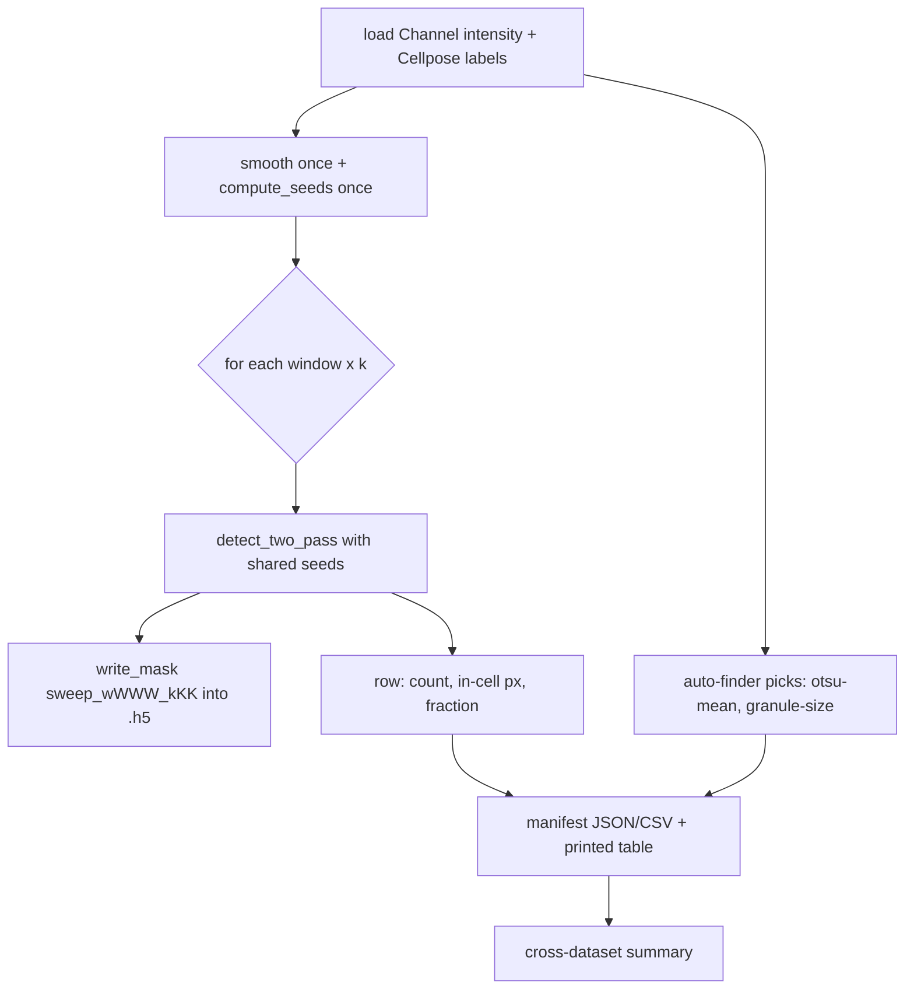

# feat: Adaptive-clip window×k sweep harness

## Overview

To automate the Adaptive Local Clipping threshold, the user first needs to *see* how the two free knobs — **local window size** (px) and **k** (contrast margin in noise units) — change the detected mask across the kinds of data they actually analyze. Particle count and area alone can't tell false positives from missed granules, so the deliverable is **the masks themselves**, produced for every `(window, k)` combination on each of four representative datasets and written back into each `.h5` so the user can flip through them in the napari viewer and judge by eye.

This plan builds a headless **sweep harness** (Qt-free workflow + CLI). For each of `Test1.h5 … Test4.h5` it loads the `Channel` intensity and the `Cellpose` segmentation, runs the production `adaptive` detector **restricted to inside the cell** at every grid point, and writes each result as a descriptively-named `/masks/<name>` resource plus a manifest mapping every mask name → `(window, k)` and its cheap navigation stats. It also records, per dataset, what the existing auto window-finders (`otsu-mean`, `granule-size`) *would* pick — so the manual sweep connects directly to the automation goal.

This is **not** the bake-off in `docs/plans/2026-06-11-001-feat-auto-adaptive-window-bakeoff-plan.md`: that plan scores window-finders against an `SG_mask` oracle. This plan has **no ground truth and no automatic scoring** — it produces masks for human inspection. The two are complementary: this study tells the user which `(window, k)` region is visually right on these datasets, which later informs/validates the automatic finder.

---

## Problem Frame

The `adaptive` detector (`puncta_detectors.py:_adaptive`) marks a pixel foreground iff `residual > threshold_local(window) + k·σ`. The mask is jointly determined by `(window, k, σ)`; σ is fixed (MAD default, per the 2026-06-11 σ-estimate fix), leaving `window` and `k` as the two knobs the user tunes by hand today in the Adaptive Local Clipping panel. The user wants to build intuition for how those two knobs trade off **across datasets that differ in pixel dimensions, pixel size, and dynamic range** — the cases where a single hand-tuned `(window, k)` is least likely to transfer. Because "correct" is a visual judgment ("captures the granules I'd circle, without dilute-phase pickup"), the harness's job is to make that visual comparison cheap and exhaustive, not to pick a winner.

The four datasets are user-supplied with a fixed, known shape: a single channel named `Channel` and a single-cell `Cellpose` segmentation of that channel. The harness can therefore hard-assume those resource names (overridable by flag) and does not need discovery logic.

**Why one grid works across all four datasets despite different dynamic range:** the detector operates on the *background-subtracted residual* and gates in *noise units* (`k·σ`), so it is largely intensity-scale invariant — the same `k` grid is meaningful on a 12-bit and a 16-bit image. `window` is in pixels, so its physical meaning shifts with pixel size; the manifest records each dataset's `pixel_size_um` so the user can interpret window in µm when comparing datasets.

---

## Requirements Trace

- R1. For each dataset, load the `Channel` intensity plane and the `Cellpose` segmentation, and run the production `adaptive` detector at every point of a configurable `(window, k)` grid, **restricted to inside the Cellpose cell** (detection group = `labels > 0`), reusing `detect_two_pass` unchanged.
- R2. Write each grid point's mask back into the same `.h5` as a descriptive, sortable `/masks/<name>` (encoding window and k). Re-running is idempotent (same name → overwrite) and offers a clear/prefix option so sweeps don't accumulate uncontrollably.
- R3. Emit a **manifest** (sidecar JSON/CSV + printed table) mapping each mask name → `(window, k, particle_count, in_cell_positive_px, in_cell_fraction)` and the dataset's `pixel_size_um` / shape. These stats are an explicit **navigation aid only** — the plan states plainly they are not the accept/reject criterion (the user inspects the masks visually).
- R4. Record, per dataset, the window each existing auto window-finder (`otsu-mean`, `granule-size`) would return, mapped to the nearest grid window, so the user can see whether the auto-pick lands in the visually-good region of the sweep.
- R5. Hold every other detection setting fixed and **recorded** in the manifest (noise/background estimator, seed detector, `gaussian_sigma`, `min_spot_px`, `spot_scale_prior`); compute pass-1 seeds **once per dataset** and reuse across all grid points (seeds are window- and k-independent).
- R6. Ship a CLI entry point that takes the dataset paths, channel/segmentation names, and the two grid axes; tolerates a per-dataset failure without aborting the whole run; supports `--dry-run` (print the plan and mask names without writing); and works on all four datasets with no code change despite differing size/pixel-size/dynamic-range.
- R7. Produce a **cross-dataset summary** so the four datasets can be compared side by side (per dataset: shape, pixel size, auto-finder picks, grid extent, mask count).

---

## Scope Boundaries

- **No oracle, no automatic scoring, no winner selection.** That is the separate bake-off plan (`2026-06-11-001`). This harness only produces masks + cheap stats for human inspection.
- **No ground-truth labeling** (`SG_mask`) is required or produced.
- **No detector / σ-estimate changes.** The `adaptive` detector, the MAD σ default, and `detect_two_pass` are reused byte-for-byte; only the *group* (cell-restricted) and the swept `(window, k)` vary.
- **No GUI change.** The Adaptive Local Clipping panel and its config are untouched; this is a headless dev/analysis tool.
- **No live preview / interactive picker.**

### Deferred to Follow-Up Work

- **Per-cell-instance masks.** v1 unions all Cellpose labels into one detection group (`labels > 0`). If a dataset carries several cells and the user wants a separate sweep per cell instance, that is a follow-up (multiplies output).
- **Overlay PNG export.** The user chose masks-into-`.h5` for v1; a PNG tiling exporter (channel + contour, tiled by window/k) is an easy later add if the napari toggle workflow proves slow.
- **Feeding the visually-chosen `(window, k)` region back into the bake-off** as a soft validation target for the automatic finder.

---

## Context & Research

### Relevant Code and Patterns

- **Detection entry to reuse unchanged:** `detect_two_pass(smoothed, group, settings, seeds=...)` (`src/percell4/domain/measure/puncta_pipeline.py:191`). The `window` lives in `settings.detector_params["window_px"]`, `k` in `settings.detector_params["k"]` (both consumed by `_adaptive`, `src/percell4/domain/measure/puncta_detectors.py:345`). `compute_seeds(...)` (`puncta_pipeline.py:90`) is pass-1 and is **window- and k-independent**, so it is computed once per dataset and passed via `seeds=`.
- **Cell-restricted detection helper to mirror:** `detect_adaptive_whole_frame(image, gaussian_sigma, settings)` (`src/percell4/domain/measure/adaptive_clip.py:60`) does smoothing + an all-`True` group + `detect_two_pass`. The harness needs the same but with `group = labels > 0`; add a sibling `detect_adaptive_in_group(...)` rather than changing the whole-frame function. The seeds-cache + `_with_window` pattern already exists in `auto_window` (`adaptive_clip.py:90-136`) and is the template for the per-dataset seeds reuse.
- **Settings construction:** `PunctaDetectorSettings` built exactly as the GUI does (`src/percell4/gui/adaptive_clip_panel.py:203-210`): `detector_name="adaptive"`, `seed_detector_name="otsu"`, `background_estimator_name=<noise estimator>`, `detector_params={"window_px":…, "k":…}`, `spot_scale_prior=(1.0,4.0)`. `_with_window` / a `_with_window_k` copy mirrors `adaptive_clip._with_window` (`adaptive_clip.py:78`).
- **Harness template (Qt-free workflow + CLI + scripts entry):** `src/percell4/workflows/puncta_validation.py` (store-touching loaders, `@dataclass` report, reuses production detection; `_channel_index` import at line 384, `read_channel("intensity", idx)` at 393) and `src/percell4/interfaces/cli/batch_validate_puncta.py` (argparse, `main(argv)->int`, deferred heavy imports, ranked table, `--out` JSON). Register the new CLI in `pyproject.toml [project.scripts]` (line 83) next to `percell4-batch-validate-puncta`.
- **Channel-name → index:** `_channel_index(store, channel_name)` (`src/percell4/workflows/phases.py:832`).
- **Store API:** `read_channel("intensity", idx)` (`store.py:360`), `read_labels(name)` (int32 instance — binarize `>0`, `store.py:899`), `write_mask(name, uint8, attrs=…)` (enforces uint8, overwrites, accepts provenance attrs, `store.py:930`), `list_masks()` (`store.py:996`), `metadata` (`pixel_size_um`, `channel_names`, `n_timepoints`, native shape; `store.py:1051`). Wrap repeated reads in `with store.open_read():`.
- **Auto-finder picks (R4):** `WINDOW_FINDERS` (`src/percell4/domain/measure/window_finders.py`) + `adaptive_clip.auto_window(image, gaussian_sigma, settings, method=…)` already return an odd, clamped window; call once per dataset per finder.
- **Test conventions:** workflow tests under `tests/test_workflows/` (real temp `DatasetStore`); CLI tests flat as `tests/test_cli_window_k_sweep.py` (mirror `tests/test_cli_batch_threshold.py`); domain tests in `tests/test_measure/test_adaptive_clip.py` (pure, synthetic blob helpers, `default_rng(seed)`).

### Institutional Learnings

- `docs/solutions/architecture-patterns/registered-analysis-framework.md` — pure core, HDF5 reads only at the workflow/CLI boundary; keep the detection logic in `domain/measure` and pass plain arrays into it.
- `docs/solutions/logic-errors/batch-compress-development-lessons.md` + `.../in-session-hdf5-staleness-multi-vector-2026-04-30.md` — masks are strict `{0,1}` uint8; binarize external label/mask resources `(>0).astype(uint8)` at the read boundary; read resources fresh through the store; `read_labels` for the Cellpose instance map.
- `docs/solutions/logic-errors/grouped-thresholding-development-lessons.md` — navigation stats use means/fractions, not raw sums alone, to stay size-invariant across the four differently-sized frames; keep "mask" vs "segmentation" naming distinct.

### External References

- None — all logic reuses existing skimage/scipy/numpy primitives already in the detection path. No new dependency.

---

## Key Technical Decisions

- **Reuse `detect_two_pass`; vary only group + `(window, k)`.** No new detector. A thin pure helper `detect_adaptive_in_group` does smoothing + `group = labels>0` + `detect_two_pass(seeds=…)`, mirroring `detect_adaptive_whole_frame`. This guarantees the swept masks are exactly what the production detector would produce at those settings inside the cell.
- **Cells unioned into one detection group.** `group = (cp_labels > 0)`; per-group NaN isolation normalizes the local background within the cell and excludes out-of-cell pixels. Multiple cell instances are unioned (documented); per-instance is a follow-up.
- **Seeds computed once per dataset.** `compute_seeds` (pass-1) is independent of `window` and `k`; computing it once and threading it through every grid point via `seeds=` is the main cost lever (an N-point grid then re-runs only the background estimate + gate + pass-2 `threshold_local` + size filter per point). Mirrors `auto_window`'s seeds cache.
- **Masks written into the `.h5`, descriptively named.** Name scheme encodes the two knobs sortably and avoids `.` in HDF5 names — e.g. `sweep_w051_k25` for `window=51, k=2.5` (k encoded ×10, zero-padded window). Exact tokenization is a small implementation detail (deferred), but it must be (a) sortable, (b) round-trippable back to `(window, k)`, (c) prefixed (`sweep_` default, `--prefix` override) so `--clear` can delete a prior sweep without touching the user's other masks. Each mask is stamped with `attrs={"window_px":…, "k":…, "sweep_prefix":…}` via `write_mask`'s `attrs` so provenance survives even if names are renamed.
- **Manifest is the index; stats are navigation only.** A per-dataset JSON/CSV sidecar (and a printed table) maps name → `(window, k)` + `particle_count`, `in_cell_positive_px`, `in_cell_fraction` (positive px ÷ cell px). The plan and the manifest header both state these are for *navigating to interesting masks*, not for deciding correctness — directly honoring the user's "can't go straight off count and area".
- **Default grid, both axes CLI-overridable.** Default `window ∈ {15, 31, 51, 71, 101, 151}` (odd, spanning the `[11,151]` clamp) × `k ∈ {1.5, 2.0, 2.5, 3.0, 3.5}` = 30 masks/dataset (120 total). `--windows` / `--ks` override. Windows are forced odd at use (`| 1`) to match the detector.
- **Fixed settings recorded.** Noise estimator (MAD default), seed detector (`otsu`), `gaussian_sigma`, `min_spot_px`, `spot_scale_prior=(1.0,4.0)` are held constant across the whole sweep and written into the manifest, so a later reader knows exactly what was held fixed.
- **`min_spot_px` fixed in pixels (not µm²).** The study is about window/k in px; converting the size floor per dataset would confound the comparison. Keep it a fixed px value (default mirrors the GUI), and record each dataset's `pixel_size_um` so physical sizes can be recovered.
- **Per-dataset failure isolation.** A dataset that fails to load or detect is recorded as a failure row and skipped; the run continues (mirrors the workflow failure-taxonomy discipline).

---

## Open Questions

### Resolved During Planning

- *Inspection delivery?* Masks written into each `.h5` (user choice) — inspected via the napari viewer's mask toggle.
- *Detection scope?* Inside the Cellpose cell, `group = labels>0` (user choice).
- *Grid size?* Broad default (`6 windows × 5 k = 30`/dataset), CLI-overridable (user choice).
- *Why one grid across differing dynamic range?* The detector gates on `k·σ` over the background-subtracted residual — scale-invariant; window in px is interpreted via recorded `pixel_size_um`.

### Deferred to Implementation

- **Exact mask-name tokenization** (`sweep_w051_k25` vs alternatives) — pick during implementation; must be sortable + round-trippable + prefixed.
- **Sweep wall-clock on the largest dataset** — measure one real grid point on the biggest frame before committing the full 30; if too slow, the user coarsens the grid via flags (the seeds-once cache is already the main mitigation).
- **Whether a dataset has multiple Cellpose instances** (affects the union note in R1) — observed at run time; v1 unions regardless.

---

## High-Level Technical Design

> *This illustrates the intended approach and is directional guidance for review, not implementation specification. The implementing agent should treat it as context, not code to reproduce.*

```
# domain/measure/adaptive_clip.py  (pure; sibling of detect_adaptive_whole_frame)
def detect_adaptive_in_group(image, gaussian_sigma, settings, group_mask, *, seeds=None) -> uint8 mask:
    smoothed = apply_gaussian_smoothing(image, gaussian_sigma)
    group    = np.asarray(group_mask) > 0
    return detect_two_pass(smoothed, group, settings, seeds=seeds)   # seeds reused across the sweep

# workflows/window_k_sweep.py  (Qt-free; store at the boundary)
def run_sweep(store, channel, seg, windows, ks, fixed, *, prefix="sweep", clear=False, dry_run=False):
    image  = store.read_channel("intensity", _channel_index(store, channel))   # float32
    group  = store.read_labels(seg) > 0
    smoothed = apply_gaussian_smoothing(image, fixed.gaussian_sigma)
    seeds  = compute_seeds(smoothed, group, base_settings(fixed), scale_range) # ONCE per dataset
    rows = []
    for w in windows:               # odd
        for k in ks:
            s = settings_with(fixed, window_px=w, k=k)
            mask = detect_two_pass(smoothed, group, s, seeds=seeds)             # reuse seeds
            name = f"{prefix}_w{w:03d}_k{int(round(k*10)):02d}"
            if not dry_run: store.write_mask(name, mask, attrs={"window_px": w, "k": k, "sweep_prefix": prefix})
            rows.append(stats(name, w, k, mask, group))                        # count, in-cell px, fraction
    auto = {m: auto_window(image, fixed.gaussian_sigma, base_settings(fixed), method=m)   # R4
            for m in ("otsu-mean", "granule-size")}
    return SweepReport(dataset, shape, pixel_size_um, fixed, rows, auto)
```

Per-dataset flow (one grid; seeds shared):



---

## Implementation Units

- U1. **Cell-restricted adaptive detection helper (pure domain)**

**Goal:** A pure-domain function that runs the production `adaptive` detector inside a given cell mask at a specific `(window, k)`, reusing precomputed seeds — the single computational primitive the sweep loops over.

**Requirements:** R1, R5

**Dependencies:** None

**Files:**
- Modify: `src/percell4/domain/measure/adaptive_clip.py` (add `detect_adaptive_in_group`)
- Modify: `src/percell4/domain/measure/CLAUDE.md` (document the new helper alongside `detect_adaptive_whole_frame`)
- Test: `tests/test_measure/test_adaptive_clip.py` (extend)

**Approach:**
- `detect_adaptive_in_group(image, gaussian_sigma, settings, group_mask, *, seeds=None)`: smooth, binarize `group_mask>0`, call `detect_two_pass(smoothed, group, settings, seeds=seeds)`; return the `{0,1}` uint8 mask. Mirror `detect_adaptive_whole_frame` exactly except for the group source and the optional `seeds` pass-through.
- Do **not** change `detect_adaptive_whole_frame` or any existing caller.

**Execution note:** Test-first; assert equivalence to `detect_two_pass` directly so the helper is a thin, faithful wrapper.

**Patterns to follow:** `adaptive_clip.py:60` (`detect_adaptive_whole_frame`), `adaptive_clip.py:121-126` (`detect_at_window` seeds reuse).

**Test scenarios:**
- Happy path: synthetic blob image + a cell mask covering part of the frame → returns a `{0,1}` uint8 mask whose positives are all inside the cell mask; blobs outside the cell are excluded.
- Equivalence: result equals `detect_two_pass(apply_gaussian_smoothing(img,σ), mask>0, settings)` for the same inputs (faithful wrapper).
- Seeds reuse: passing `seeds=compute_seeds(...)` yields the same mask as letting `detect_two_pass` compute seeds internally (seeds are window/k-independent).
- Edge case: empty cell mask (all-False) → all-zero mask, no raise.
- Edge case: constant/empty image → all-zero mask, no raise.

**Verification:** The helper produces masks identical to a direct `detect_two_pass` call with `group=labels>0`, with and without a shared `seeds`, and never raises on degenerate input.

---

- U2. **Sweep workflow: per-dataset grid, mask writing, manifest, auto-finder picks**

**Goal:** The Qt-free engine that, for one open dataset, computes seeds once, runs the `(window, k)` grid via U1, writes named masks into the `.h5`, records navigation stats, and captures the auto-finder picks — returning a structured per-dataset report.

**Requirements:** R1, R2, R3, R4, R5, R7

**Dependencies:** U1

**Files:**
- Create: `src/percell4/workflows/window_k_sweep.py`
- Modify: `src/percell4/workflows/CLAUDE.md` (document the new module)
- Test: `tests/test_workflows/test_window_k_sweep.py`

**Approach:**
- `@dataclass FixedSettings` (noise/background estimator name, seed detector, `gaussian_sigma`, `min_spot_px`, `spot_scale_prior`) and `@dataclass SweepRow` (name, window, k, particle_count, in_cell_positive_px, in_cell_fraction) and `@dataclass SweepReport` (dataset name, shape, pixel_size_um, fixed-settings echo, rows, auto-finder picks, failures).
- `base_settings(fixed)` builds the `PunctaDetectorSettings` exactly as the GUI panel does (`adaptive_clip_panel.py:203-210`); `settings_with(fixed, window_px, k)` returns a copy with those two `detector_params` set (mirror `adaptive_clip._with_window`).
- `run_sweep(store, channel, seg, windows, ks, fixed, *, prefix, clear, dry_run)`: resolve channel via `_channel_index`; `read_channel("intensity", idx)` (float32); `read_labels(seg) > 0` for the group; if `clear`, delete prior `/masks/<prefix>_*` first; smooth once + `compute_seeds` once; loop the grid calling U1 with shared seeds; name `f"{prefix}_w{w:03d}_k{int(round(k*10)):02d}"`; `write_mask(name, mask, attrs={"window_px":w,"k":k,"sweep_prefix":prefix})` unless `dry_run`; collect a `SweepRow` per point. `particle_count` via `skimage.measure.label` count; `in_cell_fraction = positive_px / cell_px`.
- Auto-finder picks (R4): call `adaptive_clip.auto_window(image, fixed.gaussian_sigma, base_settings(fixed), method=m)` for `m in ("otsu-mean","granule-size")`; store both the raw odd/clamped window and its nearest grid window.
- Windows forced odd (`int(w) | 1`); k floats as given. Per-dataset try/except records a failure into the report instead of raising.

**Execution note:** Test-first against a real temp `DatasetStore` (write a synthetic channel + a Cellpose label resource, then sweep).

**Patterns to follow:** `workflows/puncta_validation.py` (loaders, dataclass report, `_channel_index`), `adaptive_clip_panel.py:203-210` (settings construction), `adaptive_clip.auto_window` (auto picks + seeds cache).

**Test scenarios:**
- Happy path: temp dataset with a synthetic `Channel` + single-cell `Cellpose` labels → `run_sweep` writes `len(windows)*len(ks)` masks named `sweep_wWWW_kKK`; each is `{0,1}` uint8; the manifest has one row per mask with `(window,k)` round-tripping from the name and `attrs` stamped.
- Cell restriction: a bright blob placed **outside** the Cellpose cell never appears in any swept mask (group = `labels>0`).
- Stats: `in_cell_positive_px` and `particle_count` match a direct recount of the written mask; `in_cell_fraction` ≤ 1.
- Seeds-once: monkeypatch/spy that `compute_seeds` is called once per dataset, not once per grid point.
- Auto picks (R4): the report's `otsu-mean` / `granule-size` windows equal `auto_window(...)` on the same image, and each maps to the nearest grid window.
- Idempotency / clear: re-running overwrites same-named masks (mask count unchanged); `clear=True` removes prior `<prefix>_*` masks before writing and leaves non-sweep masks untouched.
- `dry_run=True`: no masks written (`list_masks` unchanged) but the report still lists the intended names and `(window,k)`.
- Edge case: empty Cellpose mask → all swept masks all-zero, run does not raise; failure isolation — a read error on the labels resource is recorded as a failure row.

**Verification:** On a synthetic temp dataset the sweep writes the full grid of correctly-named, cell-restricted `{0,1}` masks with a faithful manifest and correct auto-finder picks; seeds are computed once; `clear`/`dry_run`/failure-isolation behave as specified.

---

- U3. **CLI entry point + cross-dataset summary**

**Goal:** A headless command that runs the sweep over all four datasets, writes per-dataset manifests, prints per-dataset and cross-dataset summary tables, and tolerates per-dataset failure — the surface the user actually invokes after producing `Test1.h5 … Test4.h5`.

**Requirements:** R2, R3, R6, R7

**Dependencies:** U2

**Files:**
- Create: `src/percell4/interfaces/cli/window_k_sweep.py`
- Modify: `pyproject.toml` (`[project.scripts]` → add `percell4-window-k-sweep`)
- Test: `tests/test_cli_window_k_sweep.py`

**Approach:**
- argparse: positional dataset paths (`Test1.h5 …`); `--channel Channel`, `--segmentation Cellpose`; `--windows 15 31 51 71 101 151` and `--ks 1.5 2.0 2.5 3.0 3.5` (defaults = the broad grid); `--prefix sweep`, `--clear`, `--dry-run`; fixed-setting flags (`--gaussian-sigma`, `--min-spot-px`, `--noise-estimator`); `--out DIR` for the manifest sidecars. `main(argv=None) -> int`, deferred heavy imports after `--help`.
- For each dataset: open the store, `run_sweep(...)`, write the manifest (`<dataset>.sweep.json` + optional `.csv`) into `--out`, print the per-dataset table (mask name | window | k | count | in-cell px | fraction) plus the auto-finder picks line.
- After all datasets: print a **cross-dataset summary** — one row per dataset with shape, `pixel_size_um`, grid extent, mask count, and each finder's picked window — so the four are comparable at a glance (R7).
- Exit codes: `0` all datasets swept; `1` if every dataset failed; per-dataset failures are reported but don't flip a successful run to non-zero.

**Execution note:** Test-first; mirror `tests/test_cli_batch_threshold.py` structure (temp store fixtures, capture stdout, assert exit code + written sidecar).

**Patterns to follow:** `interfaces/cli/batch_validate_puncta.py` (argparse, `main(argv)->int`, deferred imports, ranked table, `--out`), `pyproject.toml:83-94` scripts block.

**Test scenarios:**
- Happy path: two temp datasets → `main([...])` returns 0, writes a manifest sidecar per dataset, and prints both per-dataset tables and the cross-dataset summary; masks exist in each `.h5`.
- Defaults: invoking with only dataset paths uses the documented broad grid (30 masks/dataset); `--windows`/`--ks` override the axes.
- `--dry-run`: prints intended mask names and the summary; no masks written, no sidecar mutation beyond what dry-run documents.
- `--clear`: removes prior `<prefix>_*` masks on re-run; non-sweep masks survive.
- Failure isolation (R6): one unreadable/missing dataset is reported as failed, the others still sweep, exit code 0; all-failed → exit 1.
- `main(["--help"])` returns 0 without importing heavy libs; unknown `--noise-estimator` errors cleanly.
- Differing datasets (R6/R7): two temp datasets with different shapes and `pixel_size_um` both sweep with the same grid; the cross-dataset summary shows their differing shape/pixel size.

**Verification:** `percell4-window-k-sweep Test1.h5 Test2.h5 Test3.h5 Test4.h5` writes the full mask grid into each file, drops a manifest per dataset, prints per-dataset + cross-dataset tables with the auto-finder picks, and survives a single bad dataset — runnable as soon as the four datasets exist.

---

## System-Wide Impact

- **Interaction graph:** New `workflows/window_k_sweep.py` consumed only by the new CLI; it calls the pure U1 helper and reuses `detect_two_pass` / `compute_seeds` / `auto_window` unchanged. No GUI, model, or session code is touched.
- **Error propagation:** U1 never raises on degenerate input (all-zero mask); U2 isolates per-dataset failures into report rows; U3 maps that to exit codes without aborting sibling datasets.
- **State lifecycle risks:** The harness **mutates the user's `.h5` files** by writing `/masks/<prefix>_*` (intended). Mitigations: a clear `--prefix` namespace, `--clear` to reclaim space, `--dry-run` to preview, and provenance `attrs` on each mask. It never writes session selection fields or touches `/intensity` or `/labels`.
- **API surface parity:** `pyproject.toml [project.scripts]` gains one entry; no dataclass or config schema changes; the GUI path is untouched.
- **Integration coverage:** The U2 real-temp-store test proves the store read/binarize/write boundary and the seeds-once reuse that pure unit tests of U1 cannot.
- **Unchanged invariants:** `_adaptive` detector, MAD σ default, `detect_two_pass`, the mask `{0,1}` uint8 contract, `detect_adaptive_whole_frame`, and the Adaptive Local Clipping panel all remain exactly as today.

---

## Risks & Dependencies

| Risk | Mitigation |
|------|------------|
| Writing 30 masks/dataset bloats the user's `.h5` | Namespaced `--prefix`, `--clear` to reclaim, `--dry-run` to preview before committing; masks are `lzf`/`gzip`-compressed `{0,1}` uint8 (small) |
| Sweep too slow on the largest frame | `compute_seeds` once per dataset (the main cost lever); per-point cost is only bg-estimate + gate + `threshold_local` + size filter; user can coarsen the grid via flags; measure one real point first (deferred) |
| User reads count/area as the criterion despite intent | Manifest header + plan state explicitly these are navigation only; the masks are the deliverable |
| Multiple Cellpose instances unioned silently | Documented union behavior; per-instance deferred; manifest records cell-px so a multi-cell case is visible |
| `min_spot_px` in px confounds cross-dataset comparison (different pixel sizes) | Fixed px floor held constant + `pixel_size_um` recorded per dataset so physical size is recoverable |
| Mask-name collision with the user's existing masks | `sweep_` prefix namespace + `--prefix` override; `--clear` only deletes within the prefix |

---

## Documentation / Operational Notes

- Update `src/percell4/domain/measure/CLAUDE.md` (new `detect_adaptive_in_group` helper) in U1 and `src/percell4/workflows/CLAUDE.md` (new `window_k_sweep` module) in U2.
- The manifest sidecar's header records every fixed setting and the pinned grid so a sweep is reproducible and self-describing.
- After the user inspects the masks and identifies the visually-good `(window, k)` region per dataset, that finding can feed the bake-off plan (`2026-06-11-001`) as a soft validation target — and is a good `/ce-compound` learning candidate (no current `docs/solutions/` entry covers a manual sweep-and-inspect harness).

---

## Sources & References

- Related plan (complementary, oracle-based): `docs/plans/2026-06-11-001-feat-auto-adaptive-window-bakeoff-plan.md`
- Related brainstorm: `docs/brainstorms/2026-06-11-auto-adaptive-window-size-requirements.md`
- Detection path: `src/percell4/domain/measure/puncta_pipeline.py`, `src/percell4/domain/measure/puncta_detectors.py` (`_adaptive`), `src/percell4/domain/measure/adaptive_clip.py`
- Settings + GUI reference: `src/percell4/workflows/models.py` (`PunctaDetectorSettings`), `src/percell4/gui/adaptive_clip_panel.py`
- Harness template: `src/percell4/workflows/puncta_validation.py`, `src/percell4/interfaces/cli/batch_validate_puncta.py`
- Store API: `src/percell4/store.py`; channel index: `src/percell4/workflows/phases.py:832`
- Auto-finders: `src/percell4/domain/measure/window_finders.py`, `adaptive_clip.auto_window`
- Learnings: `docs/solutions/architecture-patterns/registered-analysis-framework.md`, `docs/solutions/logic-errors/batch-compress-development-lessons.md`, `docs/solutions/logic-errors/grouped-thresholding-development-lessons.md`
