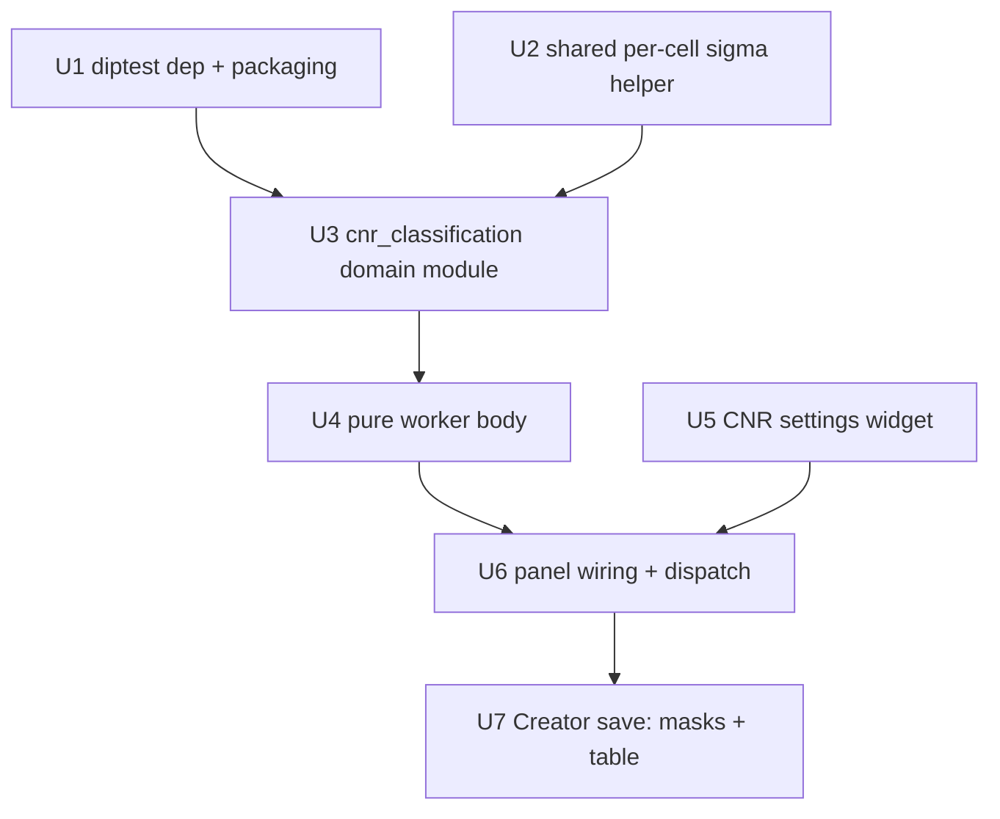

# feat: CNR-based subpopulation classification for Adaptive Local Clipping

## Overview

Add a second analysis step to the Adaptive Local Clipping panel: after a complete
feature mask of all foci/puncta has been extracted, **classify** those foci into
1 or 2 populations by their **contrast-to-noise ratio (CNR)**, and write each
population as its own binary mask plus a per-focus CNR measurements table.

The work is a faithful port of two user-provided, eye-validated reference modules
(`cnr_classification.py` and its docs) into PerCell4's domain/GUI conventions.
The **extraction half** the references describe (`feature_extraction.py` →
multi-scale DoG band-pass union) is **already implemented** in the codebase
(`detect_adaptive_multiscale` + `assess_particle_sizes_per_cell`), so this plan
covers the classification half only and consumes an **already-saved** feature
mask rather than re-extracting.

CNR is the right axis because it is exactly the quantity the detector's threshold
`k` lives on: `CNR = (interior − local background) / σ_cell`, where
`σ_cell = 1.4826·MAD` is the **same per-cell robust noise estimate the detector
already uses** (see `docs/solutions/conventions/adaptive-clip-window-and-k-rules-2026-06-23.md`).
It is dimensionless and comparable across cells and images, so population
structure (if any) is best read there.

---

## Problem Frame

The per-cell adaptive-clip detector extracts *all* foci into one binary mask but
says nothing about whether those foci are one biological population or several.
Researchers in the lab routinely need to separate, e.g., P-bodies from larger
assemblies, or to confirm that stress granules are a single size–CNR continuum.
Doing this by raw intensity is unreliable (cell-to-cell brightness varies many-
fold); doing it by naive clustering manufactures false populations from
distributional skew.

The reference module solves this with a principled three-mode design:

- **discover** — split *only* on a statistically significant gap in `log(CNR)`
  (Hartigan's dip test). Conservative: returns one population for a continuum and
  never invents structure.
- **guided** — split at a user-supplied CNR threshold. The right mode for *real
  but overlapping* populations that have no gap (the lab's DCP2 P-body-vs-
  assembly case: ~99% agreement with hand labels at a threshold, yet dip *p* ≈
  0.74 — undiscoverable by the gap test alone).
- **forced** — always split in two at the data-driven boundary, flagged
  low-confidence when there is no gap.

This is the "interpret" step that complements the already-shipped "extract" step.

---

## Requirements Trace

- R1. Measure per-focus CNR using each focus's **host-cell** σ = 1.4826·MAD of
  the presmoothed image — reusing the detector's per-cell σ, not a re-derivation.
- R2. **Discover** mode: classify into 1 or 2 populations via a gap test on
  `log(CNR)`; conservative (never invents structure).
- R3. **Guided** mode: split at a user-supplied CNR threshold (for known
  overlapping populations with no gap).
- R4. **Forced** mode: always split into 2 at the data boundary, flagged
  low-confidence when no gap is present.
- R5. Operate on an **already-saved** feature mask + the active segmentation
  (decoupled from extraction; re-classifiable without re-extracting).
- R6. Output **per-population binary masks** (Creator) + a **per-focus CNR
  measurements table** persisted to the dataset.
- R7. Print a **decision-trail debug report** each run (dip method/p-value/
  reliable flag, CNR percentiles, candidate threshold, group sizes, mode,
  warnings) in the existing panel debug style.
- R8. Add **`diptest`** as a required dependency for a rigorous gap test and wire
  it into the PyInstaller packaging (Windows/WSL install path).
- R9. Prerequisites: requires an active segmentation and a single-frame channel;
  abort cleanly with a status message otherwise (mirrors the per-cell modes).

**Origin flows:** the origin requirements doc (`2026-06-22-multiscale-adaptive-clip-routine-requirements.md`)
specifies the **extraction** routine, which is already implemented. This plan
carries forward its conventions (per-cell σ, terminal debug style, Creator save
path, px/µm resolution) and extends the same panel with the classification step.
The classification behavior itself is sourced from the user-provided reference
modules in `cnr_classification.py` / `cnr_classification.md`.

---

## Scope Boundaries

- **Not** re-implementing or changing feature extraction — the multi-scale
  routine and all existing panel modes are untouched. Classification consumes a
  saved mask.
- **No multi-value labels image** and **no new napari layer type** — populations
  are surfaced as ordinary binary masks via the existing `add_mask` path
  (explicit decision, keeps the viewer untouched).
- **No** automatic split on the size–CNR residual — reported in debug for
  inspection only (a straight-line fit to a curved relationship fires
  spuriously; the reference module disabled this deliberately).
- **No** >2-way splitting (the reference implements 2-way only; >2 warns and
  uses 2).

### Deferred to Follow-Up Work

- Surfacing the per-focus CNR table in the cell-table / data-plot windows or a
  dedicated viewer: persisted to the store now; interactive display later.
- A headless / batch-workflow version of CNR classification (panel first; port
  the shared domain core later, mirroring the extraction routine's plan).
- Cross-condition discovery (contrasting stressed vs unstressed) — the reference
  notes single-image gaps are suggestive, not definitive; out of scope here.

---

## Context & Research

### Relevant Code and Patterns

- `src/percell4/domain/measure/adaptive_clip.py` — `detect_adaptive_per_cell`
  (`:206-253`) computes `σ_cell = 1.4826·MAD(work)` per cell inline; this is the
  exact quantity CNR needs. **Factor a shared helper** rather than duplicating
  (the reference's vendored `_per_cell_sigma` is a known duplication smell).
- `src/percell4/gui/adaptive_clip_panel.py` — panel pattern: pure worker bodies
  (`run_adaptive_detection_*`), `Worker` QThread dispatch, `_print_*` terminal
  debug, `prompt_for_resource_name`, Creator save via `AcceptPunctaMask` +
  `viewer.add_mask`, `_pixel_size_um` / `_find_layer_data` helpers.
- `src/percell4/gui/_adaptive_clip_settings.py` — frozen-config settings widget
  pattern (`current_config()` snapshot + aggregated `config_changed`, mode
  gating). The new CNR controls follow this idiom in a sibling widget.
- `src/percell4/application/use_cases/accept_puncta_mask.py` — `AcceptPunctaMask`
  Creator (owns store-write → refresh-list → set-active; caller owns
  `viewer.add_mask`). Reusable per population mask.
- `src/percell4/store.py` — `write_dataframe(hdf5_path, df)` (`:703`) writes a
  DataFrame to an arbitrary HDF5 group; used for `/groups/<name>`, `/tracks/...`.
  The per-focus CNR table goes to its own `/classification/<name>` group (not
  `/measurements`, which is cell-level).
- `src/percell4/gui/workers.py` — generic `Worker(fn, *args)` QThread;
  `finished(object)` / `error(WorkerError)`; **numpy-only in the worker, all
  store/napari on the main thread**; caller holds `self._worker`.
- `src/percell4/interfaces/gui/task_panels/analysis_panel.py:194-205` — where
  `AdaptiveClipPanel` is constructed (dependency-injection accessors).

### Institutional Learnings

- `docs/solutions/architecture-patterns/creator-contract-four-step-sequence-2026-05-18.md`
  — every Creator runs write → add-layer → refresh-list → set-active, store
  before list; the use-case-split variant takes `repo`+`session`, no viewer port,
  and the panel owns the `add_*` call. Test must assert all four steps fired.
- `docs/solutions/conventions/adaptive-clip-window-and-k-rules-2026-06-23.md` —
  defines CNR formally and the per-cell σ; **caveat: 1.4826·MAD ≈ noise only when
  the cell is noise-dominated; fine texture inflates MAD**, lowering CNR in
  textured cells — the gap test could split on a texture artifact. Validate on
  noisy/textured fixtures, not clean synthetic signal.
- `docs/solutions/architecture-patterns/adding-thresholding-method-to-single-cell-workflow-2026-06-15.md`
  — give every new knob its **own** field with its **own** validated default;
  never borrow a shared GUI column whose default differs (silent-empty-mask trap).
- `docs/solutions/tech-debt/threshold-qc-measurements-write-owned-by-controller.md`
  — prefer returning the DataFrame to the caller and persisting on the main
  thread; write a per-focus table to its own group, not `/measurements`.
- `docs/solutions/build-errors/cross-platform-packaging-review-fixes.md` /
  `numpy-prod-int32-overflow-windows-2026-06-07.md` — add deps to
  `pyproject.toml` (no requirements.txt); wire compiled deps into `percell4.spec`
  (`collect_submodules` + `collect_data_files`, keep `upx=False`); on Windows
  `np.prod`/`np.sum` default to 32-bit (LLP64) — use `math.prod` / `np.int64`
  for any element/area math.

### External References

- User-provided reference spec + implementation (authoritative source for
  behavior): `cnr_classification.py`, `cnr_classification.md` (and the extraction
  companions `feature_extraction.py/.md`, already realized in-repo).
- `diptest` (PyPI) — Hartigan's dip test (compiled extension). `scikit-learn`
  (present, `1.8.0`) for boundary placement; `pandas` (present) for the table.

---

## Key Technical Decisions

- **Classify a saved mask, decoupled from extraction** (user decision): the step
  takes an existing `/masks/<name>` + the active segmentation + the active
  channel. Re-classifiable without re-extracting; also works on hand-built masks.
- **Per-population output as binary masks, not a multi-value labels image** (user
  decision): no new napari layer type, no `viewer.py` changes. 2 populations →
  two `{0,1}` masks; 1 population → one mask. Reuses `AcceptPunctaMask`.
- **Per-focus CNR table → `/classification/<name>` group** via
  `store.write_dataframe`, persisted on the main thread (not in the worker).
- **All three modes exposed** (discover / guided / forced) — guided is required
  for the lab's known-overlapping DCP2 case.
- **`diptest` is a required dependency** (best gap-test quality). Keep the
  reference's bimodality-coefficient fallback as a defensive path that flags
  `reliable=False`, so a missing/broken wheel degrades instead of crashing.
- **CNR algorithm knobs are fixed module-level constants, not GUI fields**
  (`alpha`, `min_components`, `min_fraction`, `ring_inner`, `ring_outer`,
  `interior_pct`). The user has no calibrated intuition for them and didn't ask
  to tune them; the debug report already prints the actionable p-value. The GUI
  exposes only source-mask + mode + (guided) threshold.
- **`presmooth_sigma_px` is fixed at 1.0** (the detector's value), never a GUI
  field: CNR must be computed from the *same* smoothed image the detector
  thresholded, or CNR is inconsistent with the `k` it is meant to mirror. The
  shared σ helper takes the already-smoothed `work` buffer (not raw image).
- **Reuse a shared per-cell σ helper** factored out of `detect_adaptive_per_cell`
  — avoids the duplication the knowledge base repeatedly flags and keeps CNR and
  the detector definitionally identical.
- **Worker computes on numpy only; Creator save on the main thread** (worker
  rule + four-step Creator contract).
- **Size/area math uses `math.prod` / explicit `int`** to avoid the Windows
  LLP64 32-bit overflow.

---

## Open Questions

### Resolved During Planning

- *Where does classification attach?* → A new step on an existing mask (not an
  integrated extract+classify mode).
- *How is the output represented?* → Per-population binary masks + a per-focus
  CNR table (no labels image).
- *Which modes?* → discover, guided, forced.
- *diptest?* → Required dependency.
- *How is a multi-value result avoided in the viewer?* → Split `labels_image`
  into per-population binary masks at the boundary, save each as a `{0,1}` mask.
- *Which CNR knobs are user-facing?* → Only source-mask, mode, and (guided)
  threshold. The 6 algorithm constants stay in the domain module;
  `presmooth_sigma_px` is fixed at 1.0 (correctness, not configurability).
- *How does the panel read the saved source mask?* → From the store
  (`store.read_mask`), not `_find_layer_data` — a saved `/masks/<name>` renders
  as a napari Labels layer and the existing helper has no "mask" kind.
- *How is the table persisted?* → `get_store().write_dataframe("/classification/
  <name>", df)` — `write_dataframe` is on `DatasetStore`, **not** the repo port.

### Deferred to Implementation

- Exact `diptest` minimum version pin — choose the latest release with macOS +
  manylinux + Windows wheels at implementation time.
- Final mask-naming scheme for 2 populations (`<base>_low` / `<base>_high`
  proposed) — confirm against any existing naming convention when wiring the save.
- Whether the shared σ helper lives in `adaptive_clip.py` or a new
  `_per_cell_sigma.py` — decide when factoring (keep import edges acyclic).
- Default ring/interior/`alpha`/`min_components`/`min_fraction` values are taken
  from the reference; revisit only if eye-validation on lab data disagrees.

---

## High-Level Technical Design

> *This illustrates the intended approach and is directional guidance for review,
> not implementation specification. The implementing agent should treat it as
> context, not code to reproduce.*

Unit dependency graph:



Runtime flow of one classification run:

```
[active channel image] + [saved feature mask] + [active segmentation labels]
        |
        v  (Worker thread, numpy only — U4's run_cnr_classification calls U3)
  measure_cnr  ── per focus: cell, area, diameter, interior, background,  (U3)
        |                    contrast, sigma, cnr
        v
  classify_by_cnr(mode, threshold|n_populations)   ── U3
        |          ├─ gap test on log(CNR)  (diptest)        [discover]
        |          ├─ boundary at user CNR threshold          [guided]
        |          └─ boundary at data crossover, low-conf    [forced]
        v
  ClassificationResult { n_subpopulations, labels_image(0/1/2),
                         components[], report{} }
        |
        v  (main thread — U6/U7)
  split labels_image -> per-pop {0,1} masks
  AcceptPunctaMask(each) + viewer.add_mask(each)        ── Creator
  store.write_dataframe("/classification/<name>", df)    ── per-focus table
  print decision-trail report                            ── debug
```

Mode → behavior decision matrix:

| Mode | GUI inputs | Split rule | Confidence flag |
|------|-----------|------------|-----------------|
| discover | (none) | only if dip(`log CNR`) `p < alpha` **and** smaller group ≥ `min_fraction` | reliable iff `diptest` present |
| guided | CNR threshold | always at the given threshold | reports group sizes to sanity-check |
| forced | (none) | always at data boundary | low-confidence warning when no gap |

---

## Implementation Units

- U1. **Add `diptest` dependency and wire packaging**

**Goal:** Make a rigorous Hartigan dip test available at runtime and in frozen
builds.

**Requirements:** R8

**Dependencies:** None

**Files:**
- Modify: `pyproject.toml` (add `diptest>=…` to `[project.dependencies]`)
- Modify: `percell4.spec` (append `"diptest"` to the explicit `_hidden` list,
  `:18-48`; keep `upx=False`)
- Test: `tests/test_measure/test_cnr_classification.py` (a smoke assertion that
  `diptest` imports and the gap-test helper reports `reliable=True`)

**Approach:**
- Add the dependency, then reinstall via `pip install -e ".[dev]"` (no
  requirements.txt in this project).
- `diptest` is a compiled C-extension; `collect_submodules("percell4")` will
  **not** pull it in — it **must** be an explicit entry in the spec's `_hidden`
  list (PyInstaller then auto-collects the binary). This is mandatory, not
  optional.
- Pin a version with prebuilt wheels for macOS (arm64 + x86_64), manylinux, and
  Windows so the WSL/Windows install path needs no compiler (e.g. `diptest`
  0.11.0 ships cp312 wheels for all four).
- Confirm it imports in `.venv` and note the Windows/WSL verification step.

**Patterns to follow:**
- `docs/solutions/build-errors/cross-platform-packaging-review-fixes.md` (spec
  wiring, `upx=False`).

**Test scenarios:**
- Happy path: `import diptest` succeeds in the project venv.
- Integration: the U3 gap-test helper returns `method == 'hartigan_dip'` and
  `reliable == True` on a clearly bimodal sample.

**Verification:**
- `pip install -e ".[dev]"` succeeds; `python -c "import diptest"` exits 0; the
  smoke test passes.

---

- U2. **Factor a shared per-cell σ helper**

**Goal:** Expose `σ_cell = 1.4826·MAD(work)` per cell as a single reusable
function so the CNR step and the detector are definitionally identical.

**Requirements:** R1

**Dependencies:** None

**Files:**
- Modify: `src/percell4/domain/measure/adaptive_clip.py` (extract
  `per_cell_sigma(work, labels) -> dict[int, float]`; point
  `detect_adaptive_per_cell` at it)
- Modify: `tests/test_measure/test_adaptive_clip.py` (characterization +
  direct-helper tests)

**Approach:**
- Lift the inline median/MAD loop in `detect_adaptive_per_cell` (`:240-251`) into
  a module-level `per_cell_sigma(work, labels) -> dict[int, float]`; the detector
  calls it. Behavior must be byte-for-byte identical (cells with non-finite/≤0 σ
  omitted).
- **The helper takes `work` — the already-presmoothed buffer
  (`apply_gaussian_smoothing(img, presmooth_sigma_px)`, `:233`), not the raw
  image.** σ is defined on the smoothed image; both callers (detector and CNR)
  must smooth first then call the helper, or CNR silently diverges from the
  detector's σ.
- Keep it pure-domain (numpy/scipy only); no new import edges out of
  `domain/measure`. (`diptest`/`sklearn` are not in the import-linter forbidden
  list, so U3 importing them is allowed.)

**Execution note:** Characterization-first — add/keep a test pinning current
`detect_adaptive_per_cell` output **before** refactoring, so the extraction is
provably behavior-preserving.

**Patterns to follow:**
- Existing `_filter_by_area` module-helper style in the same file; the reference
  `_per_cell_sigma` for the contract (omit zero/non-finite σ).

**Test scenarios:**
- Happy path: `per_cell_sigma` returns one entry per labelled cell with
  `1.4826·MAD` of the in-cell values.
- Edge: a flat/constant cell (MAD = 0) is omitted from the dict.
- Edge: a label id with no pixels (gap in labels) is skipped, not crashed.
- Integration (characterization): `detect_adaptive_per_cell` output on a fixed
  fixture is unchanged after the refactor (same mask).

**Verification:**
- Existing adaptive-clip tests pass unchanged; the new helper tests pass.

---

- U3. **New domain module: `cnr_classification.py`**

**Goal:** Port the reference measurement + classification logic into a pure-domain
module adapted to PerCell4 conventions.

**Requirements:** R1, R2, R3, R4

**Dependencies:** U1 (diptest), U2 (σ helper)

**Files:**
- Create: `src/percell4/domain/measure/cnr_classification.py`
- Create: `tests/test_measure/test_cnr_classification.py`
- Modify: `src/percell4/domain/measure/CLAUDE.md` (document the new module)

**Approach:**
- Port `measure_features` → `measure_cnr(image, feature_mask, cell_labels, *,
  presmooth_sigma_px=1.0)`: per-focus `cell, area, diameter, y, x, interior,
  background, contrast, sigma, cnr`. It **presmooths internally then calls
  `per_cell_sigma(work, …)`** (U2) so σ matches the detector. `ring_inner`,
  `ring_outer`, `interior_pct` are **module-level constants** (reference values
  3 / 9 / 90), not parameters. **Rename** away from `measure_features` to avoid
  confusion with `domain/measure/measurer.py`.
- Port `classify_by_cnr(...)` with the three modes, `ClassificationResult`
  dataclass, the dip-test helper (diptest primary; bimodality fallback flagged
  `reliable=False`), the GaussianMixture boundary placement (sklearn present,
  quantile fallback), and `to_dataframe`. `alpha` (0.05), `min_components` (40),
  `min_fraction` (0.02) are **module-level constants** (not exposed); only
  `mode` and the guided `threshold` come from the caller.
- Keep the size–CNR residual **informational only** (reported, never split on).
- Use `math.prod` / explicit `int` for any pixel-area math (Windows LLP64).
- Pure-domain: numpy/scipy/skimage + optional diptest/sklearn/pandas (lazy
  imports), no Qt/h5py/store.

**Technical design:** *(directional)*
```
classify_by_cnr -> ClassificationResult(
    n_subpopulations: 1|2,
    labels_image: int array 0=bg / 1=low-CNR / 2=high-CNR,
    components: [{... , 'subpopulation': 0|1|2}],
    split_axis: 'cnr'|None, threshold: float|None,
    report: { decision, dip_cnr{method,pvalue,bimodal,reliable},
              candidate_cnr_threshold, cnr_percentiles, group_sizes,
              smaller_group_fraction, mode, warnings[] })
```

**Patterns to follow:**
- The reference `cnr_classification.py` for algorithm fidelity; existing
  `dataclasses.dataclass(frozen=True)` report objects in `adaptive_clip.py`
  (`OtsuSmallestReport`, `ParticleSizeReport`) for the result/report style.

**Test scenarios:**
- Happy path (discover, one population): a single size–CNR continuum (synthetic
  foci, monotone CNR) → `n_subpopulations == 1`, `report.decision` says single,
  `candidate_cnr_threshold` still provided.
- Happy path (discover, two populations): two well-separated CNR clusters with a
  real gap → `n_subpopulations == 2`, `report.dip_cnr.bimodal == True`,
  `labels_image` has values {0,1,2}.
- Guided: overlapping clusters with no gap + a supplied `threshold` → 2
  populations split at ~that threshold; `report.group_sizes` present.
- Forced: a continuum + `n_populations=2` → 2 populations **and** a
  "no significant gap — low confidence" warning.
- Edge: fewer than `min_components` foci in discover → single population with the
  "too few foci" reason.
- Edge: smaller candidate group below `min_fraction` → split rejected, returns
  single population (outlier not called a population).
- Edge: foci outside any cell (no host σ) → `cnr = nan`, excluded from the test,
  labelled 0 in `labels_image`.
- Edge (texture caveat): a fixture with a textured (high-MAD) cell does **not**
  produce a spurious split in discover mode (guards the MAD-inflation artifact).
- `measure_cnr`: CNR matches `(interior − background)/σ_cell` for a hand-checked
  focus; background is the annulus median excluding other foci.
- `to_dataframe`: returns one row per focus with a `subpopulation` column.

**Verification:**
- Module tests pass; behavior matches the reference's documented validation
  qualitatively (continuum → 1, gap → 2, overlap → 1 unless guided).

---

- U4. **Pure worker body for classification**

**Goal:** A Qt-free, worker-safe function the panel can run off the UI thread.

**Requirements:** R5, R6 (compute half), R7 (assemble report payload)

**Dependencies:** U3

**Files:**
- Modify: `src/percell4/gui/adaptive_clip_panel.py` (add
  `run_cnr_classification(...)` alongside the existing `run_adaptive_*` bodies)
- Modify: `tests/test_gui/test_adaptive_clip_panel.py`

**Approach:**
- Signature roughly `run_cnr_classification(image, feature_mask, labels, *, mode,
  threshold) -> payload` (no knob args — those are U3 constants), where `payload`
  carries: the per-population `{0,1}` masks (split from `labels_image`), the
  `components` list (for the DataFrame), and the `report` dict.
- Returns plain numpy/Python objects only (no Qt, no store) so it runs in
  `Worker` and is unit-testable.
- Map GUI mode → `classify_by_cnr` args: discover → defaults; guided →
  `threshold=…`; forced → `n_populations=2`.

**Patterns to follow:**
- `run_adaptive_detection_multiscale` (`adaptive_clip_panel.py:134-159`) — pure
  worker body returning a tuple; no Qt.

**Test scenarios:**
- Happy path: given a small synthetic image+mask+labels with two CNR clusters and
  `mode='discover'`, returns 2 population masks whose union equals the input
  foci (minus nan/out-of-cell foci) and a non-empty `report`.
- Happy path: `mode='guided', threshold=X` returns 2 masks split at X.
- Edge: single-population result returns exactly one population mask.
- Edge: empty feature mask → returns no population masks and a single-population
  / "too few foci" report, without raising.

**Verification:**
- Function is importable and runs with no Qt/store present; returns the expected
  payload shapes.

---

- U5. **CNR classification settings widget**

**Goal:** A reusable form for the classification controls, snapshotting to a
frozen config.

**Requirements:** R2, R3, R4, R5

**Dependencies:** None

**Files:**
- Create: `src/percell4/gui/_cnr_classify_settings.py`
  (`CnrClassifySettingsWidget` + frozen `CnrClassifyConfig`)
- Create: `tests/test_gui/test_cnr_classify_settings_widget.py`

**Approach:**
- **Exactly three controls** (the Advanced cluster was cut in deepening — see Key
  Technical Decisions; those values are module constants in U3): a **source mask**
  selector (combo populated by the host from `store.list_masks()`), a **mode**
  dropdown (Discover / Guided / Forced), and a **CNR threshold** spinbox (enabled
  only in Guided). `CnrClassifyConfig` is therefore a small frozen dataclass.
- Mirror `_adaptive_clip_settings.py`: `current_config()` returns the frozen
  dataclass; aggregated `config_changed`; mode-driven gating
  (`_apply_mode_gating`) enables the threshold field only for Guided.
- Provide `set_mask_choices(names)` so the host refreshes the source list, and
  `set_enabled(bool)` to lock during a run.
- File boundary: a separate `_cnr_classify_settings.py` keeps the frozen-config
  pattern testable in isolation; at three fields it is small enough that inlining
  into the panel is also defensible — implementer's call, no behavior difference.

**Patterns to follow:**
- `_adaptive_clip_settings.py` (frozen config + `config_changed` + gating);
  the "own field, own default" rule from the thresholding-method learning.

**Test scenarios:**
- Happy path: `current_config()` reflects widget state (source mask, mode,
  threshold) with the documented defaults.
- Edge: switching mode to Guided enables the threshold field; Discover/Forced
  disable it.
- Edge: `set_mask_choices([...])` populates the source combo; empty list leaves
  it empty without raising.
- Integration: editing any control emits `config_changed` exactly once per edit.

**Verification:**
- Widget tests pass under the project's offscreen-Qt test harness.

---

- U6. **Panel wiring: mount widget, button, dispatch, debug**

**Goal:** Add a "Classify Mask by CNR" action to `AdaptiveClipPanel` that runs
U4 in a worker after pre-flight checks, and prints the decision-trail debug.

**Requirements:** R5, R7, R9

**Dependencies:** U4, U5

**Files:**
- Modify: `src/percell4/gui/adaptive_clip_panel.py`
- Modify: `tests/test_gui/test_adaptive_clip_panel.py`

**Approach:**
- Mount `CnrClassifySettingsWidget` below the existing detection controls; add a
  second button "Classify Mask by CNR" with its own `_on_classify` handler
  (distinct from `_on_run`). Refresh the source-mask combo from
  `store.list_masks()` when the panel/store changes.
- Pre-flight (mirror `_run_multiscale_mode`): require a loaded dataset + viewer,
  an active channel image, an active segmentation (per-cell σ), a single-frame
  channel, and a selected source mask; abort with a status message otherwise (R9).
- **Read the source mask from the store (`store.read_mask(name)`), not
  `_find_layer_data`** — a saved `/masks/<name>` renders as a napari **Labels**
  layer and the existing helper has no "mask" kind (it matches `"Image"` /
  `"Labels"` only). Reading from the store is unambiguous.
- Hold `self._worker`; on dispatch disable the button + settings. **Use a fresh
  finished handler `_on_classify_done` with its own pending state (e.g.
  `self._pending_classify_name`), separate from the detection path's shared
  `_pending_*` flags** — do not reuse `_on_detect_done` (its `mask, window_used =
  result` 2-tuple unpack does not fit the multi-part classify payload).
- Print the settings on dispatch + (after compute, in the finished handler) the
  decision-trail report via a new `_print_cnr_report`.

**Patterns to follow:**
- `_run_multiscale_mode` (pre-flight + worker dispatch + debug print);
  `_print_settings_debug` / `_print_otsu_report` for the debug style.

**Test scenarios:**
- Happy path: with channel + segmentation + a selected mask, clicking classify
  starts a `Worker` and disables the controls.
- Error path: no active segmentation → status message, no worker started.
- Error path: time-lapse channel → status message, no worker started.
- Error path: no source mask selected / not found in the store → status message.
- Integration: the selected source mask is read via `store.read_mask(name)` (not
  `_find_layer_data`) and handed to the worker.
- Integration: the debug report is printed with `dip_cnr`, percentiles, mode, and
  group sizes after a successful compute.

**Verification:**
- Panel tests pass; pre-flight rejects each missing prerequisite cleanly.

---

- U7. **Creator save: per-population masks + per-focus CNR table**

**Goal:** Persist and surface the results: one binary mask per population
(Creator) plus the per-focus CNR DataFrame.

**Requirements:** R6

**Dependencies:** U6

**Files:**
- Modify: `src/percell4/gui/adaptive_clip_panel.py` (the classify `finished`
  handler)
- Modify: `tests/test_gui/test_adaptive_clip_panel.py`

**Approach:**
- In `_on_classify_done` (main thread): for each population mask, run
  `AcceptPunctaMask(repo, session).execute(mask, name)` then
  `viewer.add_mask(mask, name=name)` (Creator four-step + caller-owned add).
  `repo` comes from `self._get_repo()` (same as the detection path).
- Naming: prompt once for a base name (`prompt_for_resource_name` with
  `existing_names=store.list_masks()`); 2 populations → `<base>_low` /
  `<base>_high`; 1 population → `<base>`. Hard-block collisions (don't coerce).
- Persist the per-focus table via **`self._get_store().write_dataframe(
  "/classification/<base>", to_dataframe(...))`** on the main thread (not in the
  worker). `write_dataframe` lives on `DatasetStore`, **not** the repo port — go
  through `get_store()`, not `repo`. It deletes-then-recreates the group, so
  re-classification overwrites idempotently.
- Status note summarizes populations, px counts, and the table group; clear the
  classify pending state on error so a failed run can't mislabel the next.

**Patterns to follow:**
- `_on_detect_done` (`adaptive_clip_panel.py:705-748`) for the
  AcceptPunctaMask + add_mask + status sequence (but a **separate** handler —
  see U6); `creator-contract-four-step-sequence` doc; `threshold_qc.py:826,847`
  / `workflows/phases.py:933` for the `self._store.write_dataframe("/group/…")`
  usage and leading-slash group-path convention.

**Test scenarios:**
- Happy path (2 pops): two masks written + auto-selected (last one active),
  `add_mask` called twice, and a DataFrame written to `/classification/<base>`.
- Happy path (1 pop): one mask written + selected; one `add_mask`; table still
  written.
- Integration (Creator contract): for each mask, store-write precedes
  list-refresh which precedes set-active (assert via a list-changed counter).
- Error path: a store-write failure surfaces a status message and re-enables the
  controls; pending flags cleared.
- Edge: empty result (no foci) writes no masks and reports it without raising.

**Verification:**
- After a run, `store.list_masks()` includes the population mask(s),
  `read_dataframe("/classification/<base>")` returns the per-focus table, and the
  populations render in napari.

---

## System-Wide Impact

- **Interaction graph:** A new button + worker on `AdaptiveClipPanel`; a new
  settings widget. No changes to `viewer.py`, the session selection fields, or
  the existing detection modes. `Session.set_active_mask` fires per population
  mask (via `AcceptPunctaMask`), same as existing Creator runs.
- **Error propagation:** Worker errors surface via `WorkerError` to the panel's
  error handler (re-enable controls, status message); pre-flight failures short-
  circuit before any worker starts; save failures are caught and surfaced.
- **State lifecycle risks:** Writing two masks is two Creator sequences — the
  second `set_active_mask` wins (active = `<base>_high`). The per-focus table
  write is a separate, idempotent group write; a partial failure (masks written,
  table failed) must surface clearly rather than appear successful.
- **API surface parity:** No CLI/headless surface added (deferred). The shared
  `per_cell_sigma` helper is now a public domain function reused by the detector.
- **Integration coverage:** The Creator four-step per mask and the table group
  write are integration behaviors mocks alone won't prove — test against a real
  `DatasetStore`.
- **Unchanged invariants:** Feature extraction, all existing panel modes, the
  binary `{0,1}` mask contract, and the viewer layer types are unchanged. CNR is
  defined identically to the detector's `k` axis (shared σ).

---

## Risks & Dependencies

| Risk | Mitigation |
|------|------------|
| `diptest` compiled wheel unavailable on the Windows/WSL install path | Pin a version with prebuilt wheels for all three platforms; keep the bimodality-coefficient fallback (flagged `reliable=False`) so the app degrades, not crashes; verify the frozen build via `percell4.spec`. |
| Gap test splits on a **texture artifact** (high-MAD cell deflates CNR) | Carry the MAD-inflation caveat into the report; validate on noisy/textured fixtures; discover mode is conservative and the report exposes reliability; guided mode lets the user override. |
| Forced/guided split on a continuum reads as "real" populations | Surface the low-confidence warning and `group_sizes` in the debug report and status; discover remains the trustworthy default. |
| Mask-name collisions for the two-population output | `prompt_for_resource_name` with `existing_names`; hard-block collisions (no silent coercion). |
| Windows LLP64 overflow in area/size math | Use `math.prod` / explicit `int`; covered by the packaging learning. |
| Per-focus table conflated with cell-level `/measurements` | Write to a dedicated `/classification/<name>` group via `write_dataframe`. |

---

## Documentation / Operational Notes

- Update `src/percell4/domain/measure/CLAUDE.md` (U3) to describe
  `cnr_classification.py` and the shared `per_cell_sigma` helper.
- Update `src/percell4/gui/CLAUDE.md` if the new settings widget warrants a line.
- After landing, consider `/ce-compound` to capture the "per-population binary
  masks + per-focus measurements DataFrame as a Creator, CNR-from-per-cell-MAD"
  pattern — the learnings researcher noted no existing doc covers it.

---

## Sources & References

- **Origin document:** [docs/brainstorms/2026-06-22-multiscale-adaptive-clip-routine-requirements.md](docs/brainstorms/2026-06-22-multiscale-adaptive-clip-routine-requirements.md)
  (extraction half — already implemented; conventions carried forward)
- Reference spec/impl (user-provided, authoritative for behavior):
  `cnr_classification.py`, `cnr_classification.md`, `feature_extraction.py/.md`
- Canonical convention: `docs/solutions/conventions/adaptive-clip-window-and-k-rules-2026-06-23.md`
- Creator contract: `docs/solutions/architecture-patterns/creator-contract-four-step-sequence-2026-05-18.md`
- New-knob defaults rule: `docs/solutions/architecture-patterns/adding-thresholding-method-to-single-cell-workflow-2026-06-15.md`
- Packaging: `docs/solutions/build-errors/cross-platform-packaging-review-fixes.md`,
  `docs/solutions/runtime-errors/numpy-prod-int32-overflow-windows-2026-06-07.md`
- Key code: `src/percell4/domain/measure/adaptive_clip.py`,
  `src/percell4/gui/adaptive_clip_panel.py`,
  `src/percell4/gui/_adaptive_clip_settings.py`,
  `src/percell4/application/use_cases/accept_puncta_mask.py`,
  `src/percell4/store.py:703`
