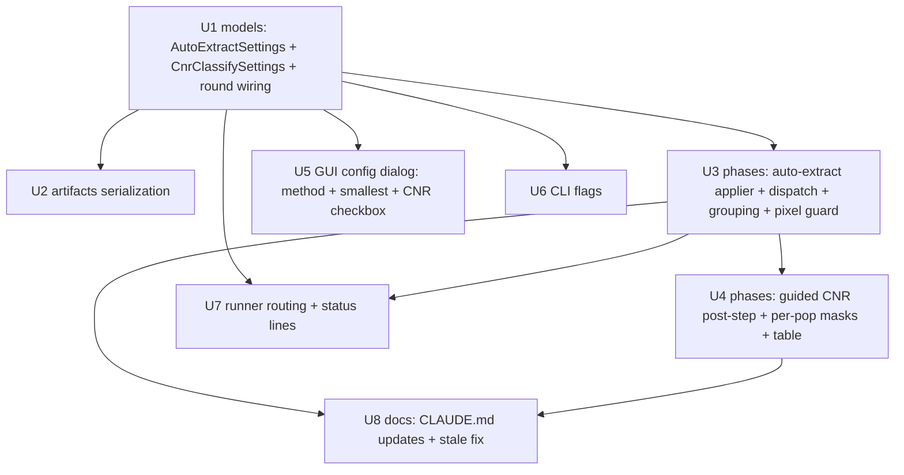

# feat: Auto-extraction (two-pass) ALC method + guided CNR classification in the single-cell thresholding workflow (GUI + CLI)

## Overview

Two already-built, eye-validated Adaptive Local Clipping (ALC) features live only in
the interactive `AdaptiveClipPanel`. This plan ports them into the **headless
single-cell thresholding workflow** — its apply phase, its GUI config dialog, and
its CLI (`batch_threshold`) — which is the explicit "port the shared core later"
follow-up deferred by both panel plans
(`docs/plans/2026-06-23-002-feat-alc-auto-extraction-mode-plan.md`,
`docs/plans/2026-06-23-001-feat-cnr-subpopulation-classification-plan.md`).

1. **Auto-extraction (two-pass)** — a new ALC thresholding *method*, alongside the
   existing single-window `adaptive-clip` method. The user supplies a **smallest-particle
   diameter** (µm) that *overrides* auto-detection of the smallest particle (leave it
   blank to auto-detect); the largest particle is measured by LoG internally; the
   output is **one combined binary mask**, written exactly like today's adaptive mask.
   Domain logic already exists: `src/percell4/domain/measure/auto_extraction.py`
   (`auto_extract`).

2. **Guided CNR subpopulation classification** — an **opt-in post-step** (GUI
   checkbox, CLI flag) that runs *after* an ALC round's feature mask is produced. The
   user supplies a **CNR threshold** (guided mode only — no discover/auto-gap, no
   forced, no interactive segmenter), and the mask is split into per-population binary
   masks (`<round>_low` / `<round>_high`) plus a per-focus CNR table at
   `/classification/<round>`. Domain logic already exists:
   `src/percell4/domain/measure/cnr_classification.py` (`classify_by_cnr`).

The two domain modules and their `diptest`/`scikit-learn` dependencies are already in
the codebase, so **no new dependency and no packaging work** is required. This plan is
purely the workflow/GUI/CLI wiring around them, mirroring how the existing
`adaptive_clip` method was added (`docs/solutions/architecture-patterns/adding-thresholding-method-to-single-cell-workflow-2026-06-15.md`).

**Confirmed scope decisions (via planning Q&A):**
- Auto-extraction is modeled as a **new method sentinel** `AutoExtractSettings` on
  `ThresholdingRound` (not a flag on `AdaptiveClipSettings`).
- Guided CNR classification is allowed **only on ALC rounds** (adaptive-clip or
  auto-extraction); rejected on grouped-Otsu rounds in validation.
- Guided CNR classification is **single-timepoint only in v1**; a time-lapse round
  that opts into CNR aborts cleanly. Auto-extraction itself works per-frame.

---

## Problem Frame

The headless single-cell thresholding workflow runs an ordered list of
`ThresholdingRound`s, each selecting a strategy via a mutually-exclusive sentinel
(`puncta` / `iterative_otsu` / `adaptive_clip`; all-`None` ⇒ legacy per-group Otsu).
Researchers have validated two newer ALC capabilities **only in the interactive
panel** and now need them in batch so the same detection runs across many datasets
unattended and reproducibly from a saved `run_config.json` / a CLI invocation:

- The single-window `adaptive-clip` method hollows out large particles when one
  window can't span a wide size range. **Auto-extraction's two-pass** (fine window =
  `3×smallest`, coarse window = `3×LoG-measured-largest`, OR-unioned) fills both ends.
  The only knob the researcher must supply is the smallest particle (their optical
  resolution limit); everything else is measured.
- A complete feature mask says nothing about whether the foci are one population or
  two. **Guided CNR classification** splits them at a researcher-supplied
  contrast-to-noise threshold — the right tool for *real but overlapping* populations
  that have no statistical gap (the lab's DCP2 P-body-vs-assembly case).

The origin requirements doc
(`docs/brainstorms/2026-06-22-multiscale-adaptive-clip-routine-requirements.md`)
specified the multi-scale extraction *concept*; the panel realized it (and the newer
two-pass auto-extraction); this plan carries that lineage's conventions (per-cell σ,
µm↔px via dataset pixel size, additive serialization, headless-no-QC routing) into the
batch workflow.

---

## Requirements Trace

- R1. New **"Auto extraction (two-pass)"** ALC method selectable in the single-cell
  thresholding workflow, in **both** the GUI config dialog and the CLI, alongside the
  unchanged existing `adaptive-clip` method.
- R2. A **smallest-particle override** field (µm; optional — blank/0 ⇒ auto-detect)
  that overrides auto-detection of the smallest particle; converted µm→px in the apply
  phase via the dataset's `pixel_size_um`.
- R3. **Guided CNR subpopulation classification** as an **opt-in**: a checkbox in the
  GUI, a flag in the CLI. Guided mode only — no discover (auto-gap), no forced, no
  interactive segmenter.
- R4. A **CNR threshold** field (GUI) / flag (CLI) supplying the guided split value.
- R5. CNR classification is available **only on ALC rounds** (adaptive-clip or
  auto-extraction); rejected on grouped-Otsu rounds.
- R6. Auto-extraction output = **one combined `{0,1}` mask** written to
  `/masks/<round>`, identical persistence path to today's adaptive mask.
- R7. CNR output = **per-population binary masks** (`<round>_low` / `<round>_high`) +
  a **per-focus CNR table** at `/classification/<round>`, written headlessly via the
  store directly (no Creator / session / napari).
- R8. Guided CNR classification is **single-timepoint only in v1**; a time-lapse round
  opting into CNR aborts cleanly with a clear status, recorded as a dataset failure.
- R9. **Per-cell routing parity** with adaptive-clip: auto-extraction rounds
  short-circuit the per-group grouping gate, route to headless apply (no per-group QC)
  even in interactive runs, require pixel size only when a µm override is supplied, and
  round-trip additively in `run_config.json`.
- R10. Preserve the **validated-default / shared-default-trap guard**:
  `AutoExtractSettings.presmooth_sigma_px` owns its `1.0` default and is never bound to
  the round's grouped-Otsu `gaussian_sigma` (which defaults to `0`). No new dependency.

**Origin flows:** the origin requirements doc
(`docs/brainstorms/2026-06-22-multiscale-adaptive-clip-routine-requirements.md`)
specified the multi-scale **extraction** routine; this plan carries forward its
conventions (per-cell σ, terminal/run-log debug style, µm↔px resolution, single combined
mask) and extends the batch workflow. The two features' behavior is sourced from the
already-implemented domain modules `auto_extraction.py` / `cnr_classification.py`.

---

## Scope Boundaries

- **Not** changing the existing methods (grouped-Otsu, puncta, iterative-otsu,
  single-window adaptive-clip). Auto-extraction is added *alongside* adaptive-clip.
- **Not** re-implementing detection/classification — both domain modules exist and are
  reused as-is. No edits to `auto_extraction.py` / `cnr_classification.py` algorithms.
- **No** discover/forced CNR modes, **no** interactive CNR segmenter, **no** interactive
  CNR threshold picker in the workflow — guided threshold only (R3).
- **No** new dependency and **no** PyInstaller spec change (`diptest`, `scikit-learn`,
  `pandas` already present; guided mode exercises none of them in its decision path).
- **No** auto-extraction-specific knobs beyond the smallest-particle override surfaced
  to the user (`fill_factor`, `fdr`, `min_spot_px`, `min_sigma_small`, coarse-`k`
  noise-floor remain eye-validated module constants).
- **No** GUI/CLI surface for the auto-extraction `k` (fine pass is fixed `k=1`; coarse
  pass `k` is auto-derived by the noise-symmetry floor).

### Deferred to Follow-Up Work

- ~~**Downstream measurement/export of the CNR population masks.**~~ **RESOLVED
  2026-07-27** by `docs/plans/2026-07-27-001-fix-single-cell-workflow-tiff-qc-cnr-plan.md`
  (U5/U6). The workflow now measures `<round>_low` / `<round>_high` when they exist on
  disk, via measure-only specs appended in `runner._cnr_population_specs_for`, and the
  config dialog predicts their CSV column names. `summary_groups.csv` still excludes them
  — it selects by a `group_<name>` column that needs a `/groups/<name>` table the CNR
  post-step never writes. The text below describes the superseded v1 behavior.
  **Cross-CLI interaction (not a regression, surfaced as a conscious choice):** the
  standalone `percell4-batch-measure` / `percell4-batch-export` CLIs default to *all*
  `/masks` when no `--masks`/`--mask` is given (`batch_measure.py:200-203`,
  `batch_export.py:102`), so they **will** pick up `<round>_low`/`<round>_high` by default.
  Those masks have no `/groups/<name>_low` table (handled gracefully — rows with no group
  column). Acceptable for v1.
- **Per-frame (time-lapse) guided CNR classification** (R8 defers this): per-frame
  classification, `(T,H,W)` population-mask stacks, and a `timepoint` column on the CNR
  table.
- **Surfacing the per-focus CNR table** in the cell-table / data-plot windows
  (persisted now; interactive display later — carried from the panel CNR plan).
- **Auto-detect-smallest as the *only* mode** / removing the override: out of scope; the
  override is the headline feature.

---

## Context & Research

> Full surface-by-surface code map (8 parallel readers, every file:line below
> cross-validated) is in this session's research workflow output. Key anchors:

### Relevant Code and Patterns

**Domain (already built — reuse verbatim, do not edit):**
- `src/percell4/domain/measure/auto_extraction.py:250` —
  `auto_extract(image, cell_labels, *, smallest_particle_px: float | None = None, fill_factor=3.0, fdr=0.1, min_sigma_small=0.5, log_presmooth=1.0, presmooth_sigma_px=1.0, min_spot_px=2, size_percentile=99.0, max_sigma=20.0, fill_holes=True) -> (uint8 mask, AutoExtractReport)`.
  **Takes pixels**, returns one combined `{0,1}` mask. `smallest_particle_px=None` ⇒
  auto-detect (raises `ValueError` if no blobs). `AutoExtractReport` (`:85`):
  `passes`, `fine_window`, `largest_particle_px`, `second_pass_used`, `n_cells`,
  `n_components`, `area_px`, …
- `src/percell4/domain/measure/cnr_classification.py:301` —
  `classify_by_cnr(image, feature_mask, cell_labels, *, threshold: float | None = None, n_populations="auto", presmooth_sigma_px=1.0) -> ClassificationResult`.
  **Guided = pass `threshold=<CNR>`.** `ClassificationResult` (`:91`):
  `n_subpopulations` (1|2), `labels_image` (int32 0=bg/1=low/2=high), `components`,
  `report`. Per-population masks: `segment_masks_from_label_image(labels_image, n_subpopulations)`
  (`:525`). Per-focus table: `to_dataframe(result)` (`:474`).
- Panel persistence template to mirror **without** the Qt/Creator parts:
  `src/percell4/gui/adaptive_clip_panel.py:1155-1204` (pop-mask split + `_low`/`_high`
  naming `:208-219`; `/classification/<base>` write `:1195-1197`, try/except so a table
  failure does not fail the masks).

**Workflow integration points (mirror the `adaptive_clip` lineage):**
- `src/percell4/workflows/models.py` — `AdaptiveClipSettings` (`:285-316`, the template);
  `ThresholdingRound` sentinels (`:343-345`) + mutual-exclusion `sum(...) > 1` (`:362-365`);
  `_ROUND_NAME_RE = ^[A-Za-z_][A-Za-z0-9_\-]{0,39}$` (`:36`).
- `src/percell4/workflows/artifacts.py` — `_adaptive_clip_to_dict`/`_from_dict`
  (`:229-235`), `_round_to_dict`/`_round_from_dict` additive "emit key only when present"
  (`:255-285`).
- `src/percell4/workflows/phases.py` — `_apply_adaptive_clip_cells` (`:694-766`, the
  applier template); `_apply_threshold_frame` dispatch (`:795-846`) + `/groups`-honesty OR
  (`:851-856`); `_group_image_labels` adaptive short-circuit (`:481-484`, **the
  single most important edit — without the auto-extract twin the round is silently
  dropped**); `apply_threshold_headless` mask write (`:949`) + `/groups` write (`:954`) +
  pixel-size guard (`:887-893`).
- `src/percell4/store.py` — `write_mask(name, array)` (`:930`, name only, no slash;
  uint8; 2D or `(T,H,W)`); `write_dataframe(hdf5_path, df)` (`:703`, caller passes a
  leading-slash path); `array_exists` (`:507`, the overwrite guard).
- `src/percell4/gui/workflows/single_cell/config_dialog.py` — Method combo
  `_METHOD_GROUPED`/`_METHOD_ADAPTIVE` (`:170-171`, built `:1327-1338`); per-method cell
  widgets (`d_min` `:1372-1377`, `k` `:1380-1384`); `_read_round_row` (`:1434-1465`) /
  `_write_round_row` (`:1467-1498`) — **both must carry any new field or it is lost on
  row reorder**; enablement `_update_method_columns_enabled` (`:1521-1534`);
  `_rounds_from_table` assembly (`:2155-2201`); pixel-size pre-flight (`:1966-1975`,
  `_datasets_without_pixel_size` `:2203`).
- `src/percell4/gui/workflows/single_cell/runner.py` — interactive-vs-headless fork
  (`:465`, the `round_spec.adaptive_clip is None` guard that forces ALC rounds headless);
  "applied headlessly (no QC step)" status line (`:1031-1040`); the headless apply
  handler `_make_threshold_apply_headless_handler` (`:981-1042`). **The runner never
  writes the store** — `phases.py` owns all persistence.
- `src/percell4/interfaces/cli/batch_threshold.py` — `--strategy` choices (`:124-136`);
  adaptive group `--d-min-um`/`--k` (`:140-151`); required-together validation idiom
  (`:232-238`); round construction (`:255-270`); summary line (`:322-328`);
  `__post_init__` `ValueError` → `except` → exit 1 (`:271-273`).

### Institutional Learnings

- `docs/solutions/architecture-patterns/adding-thresholding-method-to-single-cell-workflow-2026-06-15.md`
  — the canonical how-to for this exact task. **Lead lesson (the highest-risk pitfall
  here): the shared-default trap** — a new method's parameter gets its OWN field with the
  method's validated default; never borrow a shared GUI column (`gaussian_sigma`, default
  `0`) whose default differs from the method's (presmooth `1.0`), or detection silently
  collapses to empty masks reported as success, invisible on clean synthetic fixtures and
  shipped headlessly with no QC. Also: per-cell methods short-circuit the per-group
  grouping gate; physical-µm params need the thread + pre-flight + backstop +
  plausibility-guard chain; additive serialization; route headless + emit a status line.
- `docs/solutions/conventions/adaptive-clip-window-and-k-rules-2026-06-23.md` — the
  band-pass/z-score model; `CNR = (interior − bg)/σ_cell` with `σ_cell = 1.4826·MAD`;
  **texture caveat**: MAD inflates in textured cells, lowering CNR — validate on
  noisy/textured fixtures, not clean signal.
- `docs/solutions/architecture-patterns/creator-contract-four-step-sequence-2026-05-18.md`
  — the four-step Creator sequence is an **interactive-GUI** contract; it does **not**
  apply to the headless apply phase. The batch port writes `store.write_mask` /
  `store.write_dataframe` directly; it must **not** call `AcceptPunctaMask` /
  `session.set_active_*` / `viewer.add_mask`.
- `docs/solutions/tech-debt/threshold-qc-measurements-write-owned-by-controller.md` —
  per-focus tables go to their **own** group (`/classification/<round>`), never
  `/measurements` (cell-level).

### External References

- User-provided reference modules (authoritative for behavior, already realized in-repo):
  `auto_extraction.py`/`.md`, `cnr_classification.py`/`.md`.

---

## Key Technical Decisions

- **Auto-extraction = new sentinel `AutoExtractSettings` + `auto_extract` field**
  (confirmed). Cleanest fit with the existing puncta/iterative/adaptive sentinel pattern
  and the "own field, own validated default" rule. The alternative (a `mode` flag on
  `AdaptiveClipSettings`) was rejected: it forces `AdaptiveClipSettings.d_min_um`
  (required, `>0`) to become conditionally-meaningful and conflates two distinct domain
  engines (`detect_adaptive_by_particle_size` `×6` single-window vs `auto_extract` `×3`
  two-pass LoG). The two engines stay separate.
- **Smallest-particle override is in µm, optional.** Stored as
  `AutoExtractSettings.smallest_particle_um: float | None` (consistent with
  `d_min_um`; `None`/blank ⇒ auto-detect, honoring "override auto-detection"). The
  applier converts µm→px (`px = um / pixel_size_um`) only when a value is supplied;
  auto-detect needs no pixel size. Pixel size is required (pre-flight + backstop) only
  for auto-extract rounds that carry a µm override.
- **`AutoExtractSettings.presmooth_sigma_px = 1.0` is its own validated default**
  (shared-default-trap guard, R10); the applier feeds the **raw** image and this field —
  never `round.gaussian_sigma`. `k` is not surfaced; all other knobs use
  `auto_extraction` module constants. **The GUI keeps presmooth fixed at `1.0` and does
  not expose it** — the dialog's σ column *is* `round.gaussian_sigma` (default `0.0`,
  `config_dialog.py:1367`), so wiring it to presmooth would be the exact R10 trap; the
  2026-06-15 learning also states presmooth "is the fixed validated 1 px and is not
  user-facing in the workflow GUI." The **CLI** may override presmooth via
  `--gaussian-sigma` (default `1.0`), matching the existing adaptive-clip CLI behavior
  (`batch_threshold.py:257`) — an expert override that is value-compatible with the default.
- **Guided CNR = a per-round opt-in field `cnr_classify: CnrClassifySettings | None`,
  outside the mutual-exclusion set** (it post-processes a produced mask; it is
  mutually-*inclusive* with the method sentinels). `CnrClassifySettings(threshold: float)`
  (guided ⇒ `threshold` required, `>0`). `ThresholdingRound.__post_init__` rejects
  `cnr_classify` unless `adaptive_clip` or `auto_extract` is set (R5).
- **CNR presmooth is derived, not configured**: `_classify_and_write_cnr` passes the
  producing ALC round's `presmooth_sigma_px` (both default `1.0`) so CNR's σ matches the
  detector's σ exactly. Not user-facing.
- **CNR writes happen in `apply_threshold_headless` after the base mask write** (new
  `phases.py` helper), single-timepoint only; a time-lapse round with `cnr_classify` set
  returns a clean `DatasetFailure` (R8). This avoids changing `_apply_threshold_frame`'s
  single-mask return contract.
- **CNR population masks named `<round>_low` / `<round>_high`** (panel convention,
  cross-surface consistency). Single-population result ⇒ no extra masks; the base
  `/masks/<round>` stands and the status notes "single population, no split."
- **CNR table at `/classification/<round>` via `store.write_dataframe`**, wrapped in
  try/except so a table failure does not fail the masks (panel idiom).
- **No new dependency, no spec change.** `diptest`/`sklearn`/`pandas` already present;
  guided mode's split uses only `np.log10` (the dip test runs only to populate the
  informational report and degrades gracefully if `diptest` ever fails).

---

## Open Questions

### Resolved During Planning

- *Auto-extraction model?* → New sentinel `AutoExtractSettings` (confirmed).
- *Which rounds may opt into CNR?* → ALC rounds only; reject on grouped-Otsu (confirmed).
- *Time-lapse CNR?* → Single-timepoint only in v1; abort cleanly otherwise (confirmed).
- *Smallest-particle unit/optionality?* → µm, optional (blank ⇒ auto-detect), µm→px in
  the applier (consistent with `d_min_um`; `auto_extract` takes px).
- *New dependency for guided CNR?* → No; `diptest`/`sklearn`/`pandas` already declared;
  guided split uses none of them. No packaging change.
- *Creator contract in batch?* → No; headless writes `store.write_mask` /
  `write_dataframe` directly (no session/viewer).
- *CNR table location?* → `/classification/<round>` (own group, never `/measurements`).

### Deferred to Implementation

- Exact GUI column layout for the three new cells (dedicated "Smallest Ø (µm)" column +
  "CNR split" checkbox + "CNR thr" spinbox) vs. minor variations — settle when wiring,
  keeping `_read_round_row`/`_write_round_row` symmetric.
- Exact run-log/status string format for the auto-extract two-pass decision (`passes`,
  `fine_window`, measured largest Ø) and the CNR population summary.
- Default CNR-threshold spinbox value/range (CNR is dimensionless and dataset-dependent;
  pick a sane wide range — the natural starting point `report['candidate_cnr_threshold']`
  is not available pre-run).
- Whether to add `store.write_classification`/`read_classification` helpers (mirroring
  `write_tracks`) to de-duplicate the `/classification/<name>` path string across panel +
  headless — optional cleanup; `store.py` is a T1 audit module, consult learnings before
  editing. Default: reuse `write_dataframe` directly (current panel idiom).

---

## High-Level Technical Design

> *This illustrates the intended approach and is directional guidance for review, not
> implementation specification. The implementing agent should treat it as context, not
> code to reproduce.*

**Unit dependency graph:**



**Round-config → behavior decision matrix:**

| `adaptive_clip` | `auto_extract` | `cnr_classify` | Behavior |
|---|---|---|---|
| set | — | — | Existing single-window adaptive (unchanged) |
| — | set | — | New two-pass auto-extraction → one combined `/masks/<round>` |
| — | set | set | Auto-extraction, then guided CNR split → `<round>_low/_high` + `/classification/<round>` |
| set | — | set | Single-window adaptive, then guided CNR split |
| — | — | set | **Rejected** in `__post_init__` (CNR needs an ALC round) |
| set | set | * | **Rejected** in `__post_init__` (mutual-exclusion) |

**Runtime flow of one auto-extract + CNR round (single-timepoint, headless):**

```
apply_threshold_headless(store, round_spec, grouping)        [phases.py:860]
  pixel_size_um = store.metadata["pixel_size_um"]            [:887; guard :889 extended to auto_extract+µm]
  image = read_channel; labels = read_labels                [:941-942]
  mask, group_df, err = _apply_threshold_frame(...)         [:945]
      └─ dispatch: auto_extract branch -> _apply_auto_extract_cells   (U3)
             smallest_px = smallest_particle_um / pixel_size_um  (or None=autodetect)
             mask, report = auto_extract(image, labels, smallest_particle_px=smallest_px,
                                         presmooth_sigma_px=settings.presmooth_sigma_px)
  # R8 guard fires HERE, before the timepoint dispatch (n_timepoints read at :895),
  # because the time-lapse branch at :897 returns at :937 and never reaches :949:
  if round_spec.cnr_classify is not None and n_timepoints > 1:
      return DatasetFailure(...)                             ── R8 clean abort
  store.write_mask(round_spec.name, mask)                    [:949]   ── R6
  store.write_dataframe("/groups/<round>", group_df)         [:954]
  if round_spec.cnr_classify is not None:                    (U4, single-tp path, after :957)
      _classify_and_write_cnr(store, round_spec, image, labels, mask, cnr_settings)
          res = classify_by_cnr(image, mask, labels, threshold=settings.threshold,
                                presmooth_sigma_px=<round's ALC presmooth>)   ── guided
          pops = segment_masks_from_label_image(res.labels_image, res.n_subpopulations) # plain list
          store.delete_item("masks/<round>_low" / "_high") if present   # clear stale 2-pop output
          for suffix, pm in zip(("_low","_high"), pops):  # drop empty masks
              store.write_mask(f"{round}{suffix}", pm)        ── R7
          store.write_dataframe(f"/classification/{round}", to_dataframe(res))  # try/except
```

---

## Implementation Units

- U1. **Models: `AutoExtractSettings`, `CnrClassifySettings`, and `ThresholdingRound` wiring**

**Goal:** Add the two settings dataclasses and wire them onto `ThresholdingRound` with
the correct validation (4-way mutual exclusion for methods; CNR inclusive-but-ALC-only).

**Requirements:** R1, R2, R3, R4, R5, R10

**Dependencies:** None

**Files:**
- Modify: `src/percell4/workflows/models.py`
- Test: `tests/test_workflows/test_models.py`

**Approach:**
- `AutoExtractSettings` (frozen): `smallest_particle_um: float | None = None`,
  `presmooth_sigma_px: float = 1.0`. `__post_init__`: `smallest_particle_um is None or
  > 0`; `presmooth_sigma_px >= 0`. Mirror `AdaptiveClipSettings` (`:285-316`). No
  `k`/`fill_factor`/`fdr` fields (module constants). Docstring states `presmooth_sigma_px`
  owns `1.0` and is never the round's `gaussian_sigma` (the trap).
- `CnrClassifySettings` (frozen): `threshold: float` (guided ⇒ required). `__post_init__`:
  `threshold > 0`.
- `ThresholdingRound`: add `auto_extract: AutoExtractSettings | None = None` (after
  `adaptive_clip`, `:345`) and `cnr_classify: CnrClassifySettings | None = None`.
- Extend the mutual-exclusion `sum(...)` (`:362`) to the 4 method sentinels
  (`puncta, iterative_otsu, adaptive_clip, auto_extract`). **Do NOT** add `cnr_classify`.
- Add a new `__post_init__` check: if `cnr_classify is not None` and **neither**
  `adaptive_clip` nor `auto_extract` is set → raise (R5). Add a brief inline comment that
  `cnr_classify` is mutually-*inclusive* (a post-step), distinguishing it from the method
  sentinels.
- **Cross-round name-collision guard (`WorkflowConfig` level):** `WorkflowConfig.__post_init__`
  (`models.py:567`) already enforces unique base round names but is blind to the
  `<round>_low`/`<round>_high` masks a `cnr_classify` round mints. Add a check: for any round
  with `cnr_classify` set, its reserved `<name>_low`/`<name>_high` must not equal another
  round's `name` → raise a clear `ValueError` (cheaper to reject at config time than to
  clobber a sibling round's mask at the store). `_ROUND_NAME_RE`'s 40-char cap plus the
  suffix is fine — `write_mask` has no length limit — so length is a non-issue; the
  collision is the real risk.

**Patterns to follow:** `AdaptiveClipSettings` (`models.py:285-316`); the existing
mutual-exclusion guard and `_ROUND_NAME_RE` validation in `ThresholdingRound.__post_init__`.

**Test scenarios:**
- Happy path: construct an `auto_extract` round (with and without `smallest_particle_um`);
  construct an `adaptive_clip`/`auto_extract` round that also sets `cnr_classify`.
- Edge: `AutoExtractSettings(smallest_particle_um=0)` and `=-1` → `ValueError`;
  `=None` is accepted.
- Edge: `CnrClassifySettings(threshold=0)`/`<0` → `ValueError`.
- Error path: a round with two method sentinels (e.g. `adaptive_clip` + `auto_extract`)
  → `ValueError` (4-way exclusion).
- Error path: `cnr_classify` set on a grouped-Otsu round (no method sentinel) and on a
  puncta/iterative round → `ValueError` (R5).
- Edge: `cnr_classify` set together with a valid ALC sentinel → constructs OK.
- Error path (`WorkflowConfig`): two rounds named `foo` (with `cnr_classify`) and `foo_low`
  → `ValueError` (reserved population-mask name collides with a sibling round).

**Verification:** `tests/test_workflows/test_models.py` passes, including the new exclusion
and ALC-only rules; existing round-construction tests unchanged.

---

- U2. **Serialization: additive `run_config.json` round-trip**

**Goal:** Round-trip the two new settings additively so legacy configs reconstruct
unchanged and new configs persist/reload exactly.

**Requirements:** R9

**Dependencies:** U1

**Files:**
- Modify: `src/percell4/workflows/artifacts.py`
- Test: `tests/test_workflows/test_artifacts.py`

**Approach:**
- Add `_auto_extract_to_dict`/`_from_dict` and `_cnr_classify_to_dict`/`_from_dict`,
  mirroring `_adaptive_clip_to_dict`/`_from_dict` (`:229-235`): emit each field; decode
  required fields via `d[...]`, defaulted/optional via `d.get(key, default)` (so
  `smallest_particle_um` decodes to `None` when absent).
- Wire into `_round_to_dict` (emit `"auto_extract"` / `"cnr_classify"` keys **only when
  present**, `:255-261`) and `_round_from_dict` (`xxx_raw = d.get("xxx")`; pass the
  decoded settings or `None`, `:264-285`). No change to `config_to_dict`/`config_from_dict`
  (they iterate rounds).

**Patterns to follow:** the `adaptive_clip` codec + the "emit key only when present" /
"`.get` with default" additive convention (`artifacts.py:229-285`).

**Test scenarios:**
- Happy path: an `auto_extract` round (with µm value; and with `None`) survives
  `to_dict`→`from_dict` equality.
- Happy path: a `cnr_classify` round survives round-trip; a round with both
  `auto_extract` + `cnr_classify` round-trips.
- Integration (back-compat): a legacy round dict with neither key reconstructs to a round
  whose `auto_extract`/`cnr_classify` are `None` (no exception).
- Edge: an `adaptive_clip` round still serializes exactly as before (no new keys emitted).

**Verification:** `tests/test_workflows/test_artifacts.py` passes; a full `WorkflowConfig`
with the new rounds round-trips byte-stably.

---

- U3. **Apply phase: auto-extraction applier + dispatch + grouping short-circuit + pixel-size guard**

**Goal:** Run auto-extraction headlessly, producing one combined mask written exactly
like today's adaptive mask, with full per-cell routing parity.

**Requirements:** R1, R2, R6, R9, R10

**Dependencies:** U1

**Files:**
- Modify: `src/percell4/workflows/phases.py`
- Test: `tests/test_workflows/test_phases.py`

**Approach:**
- New `_apply_auto_extract_cells(image, labels, settings, combined, pixel_size_um, round_name) -> str`
  modeled on `_apply_adaptive_clip_cells` (`:694-766`): resolve
  `smallest_particle_px = settings.smallest_particle_um / pixel_size_um` when the µm value
  is set, else `None` (auto-detect); call
  `auto_extract(image, labels, smallest_particle_px=..., presmooth_sigma_px=settings.presmooth_sigma_px)`
  on the **raw** `image`; catch `ValueError` (auto-detect found no blobs) → return an
  error string (the caller records a clean dataset failure, never raises); OR-union the
  returned mask into `combined` via `np.maximum`; `logger.warning` + return-message note
  when 0 px detected (headless = no visual QC).
- **Pixel-size guard inside the applier**: require `pixel_size_um > 0` only when
  `smallest_particle_um is not None`; fail-clean with a clear message otherwise (never
  default to 1 µm/px). Add a window-plausibility note if the µm-derived fine window is
  implausibly large vs the frame (mirror the adaptive guard `:723-730`).
- **Dispatch**: add an `auto_extract` branch in `_apply_threshold_frame` (`:795-846`),
  parallel to the `adaptive` branch. **Do NOT put the `AutoExtractReport` into the returned
  3rd slot** — `_apply_threshold_frame` returns `(mask, group_df, err)` with `err == ""` on
  success (`phases.py:857`) and callers treat a truthy 3rd slot as **failure** (`:946`,
  `:809-810`); a report there would mark every successful auto-extract round failed.
  Instead, `_apply_auto_extract_cells` **logs** the report (`passes`, `fine_window`,
  `largest_particle_px`, `second_pass_used`) via `logger.info` so it lands in the run-log,
  and keeps the err slot `""` on success. (Threading the two-pass summary into the
  user-facing success message that `apply_threshold_headless` returns at `:958` is an
  optional refinement needing a dedicated success-note channel — out of v1 scope; the
  logger line suffices.)
- **`/groups` honesty**: add `round_spec.auto_extract is not None` to the OR at `:851` so
  the degenerate single-group column is set to `1`.
- **Grouping short-circuit (critical)**: extend `_group_image_labels` (`:481-484`) so
  `round_spec.auto_extract is not None` **also** returns `_trivial_grouping(ids)` — without
  this the round never reaches the apply fork and is silently dropped.
- **Headless pixel-size pre-condition (compound predicate, not a naive OR)**: the guard at
  `apply_threshold_headless` (`:889`) currently fires on `adaptive_clip is not None` with an
  adaptive-specific message (`:892`). Replace the **condition** with
  `(round_spec.adaptive_clip is not None) or (round_spec.auto_extract is not None and
  round_spec.auto_extract.smallest_particle_um is not None)` and a method-appropriate
  message — an **auto-detect** auto-extract round (no µm override) needs **no** pixel size
  and must not be failed here. Same compound predicate applies to the config-dialog
  pre-flight (U5).

**Execution note:** Characterization/regression-first for the shared-default trap — write
the noisy-fixture test (below) and confirm it fails against a naive `presmooth=0` wiring
before finalizing the applier.

**Patterns to follow:** `_apply_adaptive_clip_cells` (`phases.py:694-766`); the adaptive
grouping short-circuit (`:481-484`); the shared-default-trap regression template in
`docs/solutions/architecture-patterns/adding-thresholding-method-to-single-cell-workflow-2026-06-15.md:172`.

**Test scenarios:**
- Happy path: an auto-extract round on a **noisy** fixture (per-cell MAD > 0) with a small
  + large particle produces a non-empty `{0,1}` mask filling both sizes.
- Covers R10 (shared-default trap): the applier presmooths at the settings' `1.0` **even
  when `round.gaussian_sigma == 0`**, and the mask `.sum() > 0`; a deliberate
  `presmooth=0` run differs (both assertions load-bearing).
- Happy path (override): a supplied `smallest_particle_um` yields
  `smallest_particle_px == um / pixel_size_um` reaching `auto_extract` (assert via the
  resolved fine window / a spy).
- Happy path (auto-detect): `smallest_particle_um=None` runs without a pixel size and
  produces a mask; a no-blob fixture returns a clean error string (no raise), recorded as
  a failure.
- Error path: µm override present but pixel size missing/≤0 → clean error, no mask write,
  no default to 1.
- Edge (compound guard): an **auto-detect** auto-extract round (no µm override) on a
  dataset with **no** pixel size runs successfully (not failed by the pixel-size guard);
  an override round on the same dataset fails cleanly.
- Integration: `_group_image_labels` returns the trivial single group for an auto-extract
  round (so the apply fork is reached); `/groups/<round>` column is `1`.
- Edge: the combined mask is `{0,1}` uint8 and written to `/masks/<round>` (single-tp);
  a `(T,H,W)` dataset stacks per-frame masks (auto-extraction works per-frame).

**Verification:** `tests/test_workflows/test_phases.py` (and the existing timelapse phase
test) pass; an auto-extract round writes `/masks/<round>` with non-zero pixels on the
noisy fixture.

---

- U4. **Apply phase: guided CNR post-step (per-population masks + per-focus table)**

**Goal:** After an ALC round's feature mask is written, optionally split it by guided CNR
into per-population masks + a per-focus table — single-timepoint only.

**Requirements:** R3, R4, R5, R7, R8

**Dependencies:** U1, U3

**Files:**
- Modify: `src/percell4/workflows/phases.py`
- Test: `tests/test_workflows/test_phases.py`, `tests/test_workflows/test_phases_threshold_timelapse.py`

**Approach:**
- New `_classify_and_write_cnr(store, round_spec, image, labels, mask, settings) -> str`:
  `res = classify_by_cnr(image, mask, labels, threshold=settings.threshold, presmooth_sigma_px=<producing ALC round's presmooth>)`
  (guided). `segment_masks_from_label_image(res.labels_image, res.n_subpopulations)` returns
  a **plain ordered list** `[mask(seg==1), mask(seg==2)]` (`cnr_classification.py:525-530`),
  **not** `(suffix, mask)` pairs — `zip(("_low", "_high"), pops)` and drop empty masks (the
  panel builds the pairs itself at `adaptive_clip_panel.py:208-219`). **Before** writing the
  split, clear any stale population masks from a prior 2-pop run via
  `store.delete_item(f"masks/{round_spec.name}_low")` / `_high` when present
  (`store.delete_item` at `store.py:1149`) — otherwise a re-run that now yields 1 population
  leaves the old `_low`/`_high` on disk (and they get auto-measured by `batch_measure`). For
  each remaining `(suffix, pop_mask)`, `store.write_mask(f"{round_spec.name}{suffix}", pop_mask)`.
  Write the table `store.write_dataframe(f"/classification/{round_spec.name}", to_dataframe(res))`
  wrapped in try/except (table secondary; a failure does not lose the masks but is surfaced in
  the message). Return a message summarizing `n_subpopulations`, per-population px counts, and
  the foci count (for the run-log).
- **Time-lapse guard placement (R8) — must precede the timepoint dispatch.**
  `apply_threshold_headless` reads `n_timepoints` at `:895`, and the time-lapse branch
  `if n_timepoints > 1:` (`:897`) **returns at `:937`, never reaching `:949`**. So the R8
  abort must be checked **right after `:895`, before the `:897` branch**:
  `if round_spec.cnr_classify is not None and n_timepoints > 1: return (DatasetFailure(
  "guided CNR classification is single-timepoint only in this version"), msg)`. Placing it
  after the single-tp write (`:949`) would silently skip CNR on time-lapse and report success.
- **Single-timepoint call site**: in the single-tp path, after the base `/masks/<round>` +
  `/groups/<round>` writes (`:949-957`), guarded by `if round_spec.cnr_classify is not None:`,
  call `_classify_and_write_cnr(...)`.
- The producing presmooth is read from `round_spec.adaptive_clip.presmooth_sigma_px` or
  `round_spec.auto_extract.presmooth_sigma_px` (both `1.0` by default) so CNR's σ matches
  the detector's σ. Not user-facing.

**Patterns to follow:** the panel persistence sequence
`gui/adaptive_clip_panel.py:1155-1204` (pop-mask split + `_low`/`_high` naming `:208-219`,
`/classification/<base>` write `:1195-1197`) — **drop** `AcceptPunctaMask`/session/viewer
(headless writes `store.write_mask`/`write_dataframe` directly); the existing
`apply_threshold_headless` write idiom (`phases.py:949-954`).

**Test scenarios:**
- Happy path (2 pops): a fixture with two well-separated CNR clusters + a guided
  `threshold` → `/masks/<round>_low` and `/masks/<round>_high` written, plus a
  `/classification/<round>` DataFrame with one row per focus and a `subpopulation` column.
- Happy path (1 pop): a continuum (or smaller group < `MIN_FRACTION`) → no extra masks
  written, base `/masks/<round>` stands, table still written, message notes "single
  population, no split".
- Covers R8 (time-lapse abort): an ALC round with `cnr_classify` on a `(T,H,W)` dataset →
  a clean `DatasetFailure` returned **before** any mask write (assert the guard fires at the
  `:895`/`:897` boundary, not after `:949`; no per-frame run, no partial masks).
- Edge (`<4` foci): a feature mask with fewer than 4 valid foci → guided `classify_by_cnr`
  collapses to a single population (`cnr_classification.py:377-378`, a path distinct from
  `MIN_FRACTION`); U4 writes no split masks, base stands, table still written.
- Integration (stale re-run): a round that produced `_low`/`_high` on a prior run, re-run
  with a threshold now yielding 1 population, leaves **no** stale `_low`/`_high` masks (the
  `delete_item`-before-write step fired).
- Error path: a `store.write_dataframe` failure surfaces in the message but the population
  masks remain written (try/except isolation).
- Edge: an empty feature mask (no foci) → no population masks, no raise, message notes it.
- Edge (naming): `<round>_low`/`<round>_high` are valid `store.write_mask` names and do
  not collide with `/masks/<round>`; the round name length leaves room for the suffix.
- Edge (texture caveat): a textured (high-MAD) cell does not spuriously over-split at a
  reasonable guided threshold.

**Verification:** `tests/test_workflows/test_phases.py` + the timelapse test pass;
`store.read_dataframe("/classification/<round>")` returns the per-focus table and
`list_masks()` includes the population masks for a 2-pop run.

---

- U5. **GUI config dialog: auto-extraction method + smallest-particle field + CNR checkbox + threshold**

**Goal:** Let a user pick "Auto extraction (two-pass)" as a round's method, enter the
smallest-particle override, and opt a round into guided CNR with a threshold — all
dialog-local (no session writes).

**Requirements:** R1, R2, R3, R4, R5

**Dependencies:** U1

**Files:**
- Modify: `src/percell4/gui/workflows/single_cell/config_dialog.py`
- Test: `tests/test_gui_workflows/test_config_dialog.py`

**Approach:**
- Add `_METHOD_AUTO_EXTRACT = "Auto extraction (two-pass)"` and include it in the Method
  combo `addItems` (`:1327-1338`); add an `_is_auto_extract_row(row)` helper paralleling
  `_is_adaptive_row` (`:1500`).
- Add three new table columns after `k` (bump `_ROUND_COL_COUNT` `:154`, append index
  constants, headers `:155-166`, and width entries `:771-780`): **"Smallest Ø (µm)"**
  (`QDoubleSpinBox`, range `(0.0, 50.0)`, `0` ⇒ auto-detect — tooltip says so), **"CNR
  split"** (a `QCheckBox`), **"CNR thr"** (`QDoubleSpinBox`, sensible wide CNR range,
  enabled only when the checkbox is checked). (A dedicated smallest column is chosen over
  reusing the `d_min` column because the auto-extract smallest is optional `0`=auto while
  adaptive `d_min` is required `>0` — the `(0.02, 50)` vs `(0.0, 50)` ranges conflict.)
- Build the widgets in `_on_add_round` (`:1298-1388`); connect the method combo and the
  CNR checkbox to new enablement helpers. Enablement rules
  (`_update_method_columns_enabled` `:1521-1534` + a new `_update_cnr_columns_enabled`):
  the auto-extract row enables **Smallest only** and disables **both `k` and `σ`** —
  presmooth is the fixed validated `1.0` and is **not user-facing in the GUI** (the σ
  column is `round.gaussian_sigma`, default `0.0` at `config_dialog.py:1367`; wiring it to
  presmooth would be the R10 trap, and the 2026-06-15 learning states presmooth is not
  user-facing in the workflow GUI). The adaptive row is unchanged (`d_min`+`k`; σ as today,
  unused by the detector). The **CNR checkbox + threshold are enabled only on ALC rows**
  (adaptive or auto-extract) and disabled/cleared on grouped-Otsu rows (R5); the threshold
  spinbox is enabled only when the checkbox is checked.
- Add the new fields **symmetrically** to `_read_round_row` (`:1434-1465`) and
  `_write_round_row` (`:1467-1498`) — required so row reorder (`_swap_rounds`) preserves
  them.
- In `_rounds_from_table` (`:2155-2201`): when method is auto-extract, build
  `AutoExtractSettings(smallest_particle_um=<value or None if 0>)` and pass
  `auto_extract=...`; when the CNR checkbox is on (ALC row), build
  `CnrClassifySettings(threshold=<value>)` and pass `cnr_classify=...`.
- Extend the pixel-size pre-flight (`:1966-1975`) so it also fires for auto-extract rounds
  **that carry a µm override** (`smallest_particle_um not in (None, 0)`) — same compound
  predicate as the headless guard in U3; auto-detect rounds must **not** trip it.

**Approach note (state ownership):** these are all **dialog-local** value-capture widgets
feeding a frozen `WorkflowConfig`; they never touch `session.active_*`. Per the dialog's
own convention (`config_dialog.py:636-637`) the Selector/Creator/Action rule does not
apply — the only constraint is "no session read/write here." Mirror the existing combos/spinboxes.

**Patterns to follow:** how `_METHOD_ADAPTIVE` + the `d_min`/`k` columns were added
(combo `:1327`, columns `:1372-1384`, enablement `:1521-1534`, read/write symmetry,
assembly `:2181-2196`); the existing-masks group's dialog-local-state comment (`:636-637`).

**Test scenarios:**
- Happy path: selecting "Auto extraction (two-pass)" + a smallest value builds a round
  with `auto_extract=AutoExtractSettings(smallest_particle_um=...)` (and `0` ⇒ `None`).
- Happy path: checking "CNR split" + a threshold on an ALC row builds
  `cnr_classify=CnrClassifySettings(threshold=...)`.
- Edge: the CNR checkbox/threshold are disabled (and not emitted) on a Grouped-Otsu row;
  switching a row to grouped-Otsu clears/ignores any CNR state (R5).
- Edge: the threshold spinbox is disabled until the checkbox is checked.
- Integration (swap survival): adding rows, setting the new fields, reordering rows, then
  reading back preserves smallest/CNR values (`_read`↔`_write` symmetry).
- Edge: an auto-extract round with a µm override on a pixel-size-less dataset trips the
  pre-flight warning; with `0`/auto-detect it does not.
- Edge: on an auto-extract row, the `σ` and `k` columns are disabled (presmooth fixed at
  `1.0`, not user-facing); the assembled `AutoExtractSettings` has `presmooth_sigma_px == 1.0`.

**Verification:** `tests/test_gui_workflows/test_config_dialog.py` passes under the
offscreen-Qt harness; the assembled `WorkflowConfig` carries the new settings correctly.

---

- U6. **CLI: `batch_threshold` flags for auto-extraction + guided CNR**

**Goal:** Expose both features on the command line with house-style validation and
summary output.

**Requirements:** R1, R2, R3, R4, R5

**Dependencies:** U1

**Files:**
- Modify: `src/percell4/interfaces/cli/batch_threshold.py`
- Test: `tests/test_cli_batch_threshold.py`

**Approach:**
- Add `"auto-extract"` to `--strategy` choices (`:124-136`). New argument group "Auto
  extraction (two-pass)": `--smallest-particle-um` (`type=float`, default `None`; help:
  "smallest particle diameter (µm) to override auto-detection; omit to auto-detect").
  `k` is not exposed for auto-extract; `--gaussian-sigma` maps to
  `AutoExtractSettings.presmooth_sigma_px` (consistent with adaptive's reuse at `:257`).
  **Update the `--gaussian-sigma` help text** (`:117-123`, currently "For --strategy
  adaptive-clip this is the detector's per-cell presmooth sigma") to also name
  `auto-extract`, so the help string is not inaccurate once auto-extract ships.
- New flags (orthogonal to `--strategy`): `--cnr-classify` (`action="store_true"`) and
  `--cnr-threshold` (`type=float`, default `None`).
- Validation (mirror the `:232-238` required-together idiom; let dataclass
  `__post_init__` `ValueError`s flow to the existing `except` at `:271-273`):
  - `--cnr-classify` requires `--cnr-threshold` (manual check → exit 1).
  - `--cnr-classify` requires `--strategy adaptive-clip` or `auto-extract` (R5; manual
    check → exit 1) — also enforced by `ThresholdingRound.__post_init__`, but a friendly
    CLI message is preferred.
  - `--strategy auto-extract` does **not** require `--smallest-particle-um` (auto-detect
    is the documented default).
- Round construction (`:255-270`): add an `elif args.strategy == "auto-extract":` branch
  building `AutoExtractSettings(smallest_particle_um=args.smallest_particle_um, presmooth_sigma_px=args.gaussian_sigma)`;
  set `cnr_classify=CnrClassifySettings(threshold=args.cnr_threshold)` when
  `args.cnr_classify`. Pass both to `ThresholdingRound(...)`. The CNR post-step itself
  (per-population masks + table + stale-mask cleanup + R8 time-lapse abort) lives in
  `apply_threshold_headless` (U4), which the CLI already calls at `batch_threshold.py:313` —
  **no separate CLI write/cleanup logic is needed**.
- Summary line (`:322-328`): add an auto-extract fragment
  (`f" (auto-extract; smallest={...} µm)"` or `"smallest=auto"`) and a CNR fragment when
  active (`f" + CNR-guided split @ {args.cnr_threshold:g}"`).

**Patterns to follow:** the existing `adaptive-clip` strategy plumbing (choices `:126`,
required-together check `:232`, construction `:256`, summary `:325`); the
"`except ValueError` → exit 1" delegation (`:271-273`).

**Test scenarios:**
- Happy path: `--strategy auto-extract --smallest-particle-um 0.4` builds a round with
  `auto_extract=AutoExtractSettings(smallest_particle_um=0.4)`.
- Happy path: `--strategy auto-extract` alone builds a round with
  `smallest_particle_um=None` (auto-detect).
- Happy path (presmooth): `--strategy auto-extract --gaussian-sigma 0.5` builds
  `auto_extract=AutoExtractSettings(presmooth_sigma_px=0.5)` (default `smallest_particle_um=None`).
- Happy path: `--strategy adaptive-clip --d-min-um 0.4 --cnr-classify --cnr-threshold 5`
  builds a round with both `adaptive_clip` and `cnr_classify`.
- Error path: `--cnr-classify` without `--cnr-threshold` → exit 1 with a clear message.
- Error path: `--cnr-classify` with `--strategy grouped-otsu` → exit 1 (R5).
- Edge: an invalid value (e.g. `--cnr-threshold -1`) surfaces the dataclass `ValueError`
  via the existing `except` (exit 1).
- Edge: the summary line reflects the auto-extract + CNR fragments.

**Verification:** `tests/test_cli_batch_threshold.py` passes; `--help` stays Qt-free/fast
(heavy imports remain inside `main`).

---

- U7. **Runner: route auto-extraction headless + status lines**

**Goal:** Auto-extraction rounds (per-cell, non-previewable) route to the headless apply
handler even in interactive runs, and the user sees an honest "applied headlessly (no QC
step)" status that surfaces the two-pass / CNR outcome.

**Requirements:** R9

**Dependencies:** U1, U3

**Files:**
- Modify: `src/percell4/gui/workflows/single_cell/runner.py`
- Test: `tests/test_gui_workflows/test_single_cell_runner.py`

**Approach:**
- Extend the interactive-vs-headless fork guard (`:465`) to also exclude auto-extraction:
  `if self._interactive_qc and round_spec.adaptive_clip is None and round_spec.auto_extract is None:`
  — routing auto-extract rounds to the same `_make_threshold_apply_headless_handler` (no
  new handler needed).
- Pin the status-line condition (`:1031`) to
  `(round_spec.adaptive_clip is not None or round_spec.auto_extract is not None) and
  self._interactive_qc` — **one predicate, not a separate branch** — with a tailored message
  ("auto-extraction (two-pass) — applied headlessly (no QC step): …"), keeping
  `event="done_no_qc"`. The unattended two-pass / CNR detail reaches the run-log via the
  **applier's `logger.info`** (U3) and the `apply_threshold_headless` success message —
  **not** via the `_apply_threshold_frame` error slot (see U3's contract note).
- No change to measure/export routing — the base round name flows through unchanged; the
  CNR population masks were intentionally not measured in v1 (see Deferred). Superseded
  2026-07-27: they are measured now.

**Patterns to follow:** the existing adaptive-clip routing/status blocks
(`runner.py:465`, `:1031-1040`); the "headless even when interactive + status line"
learning from the thresholding-method doc (secondary pattern 2).

**Test scenarios:**
- Happy path: with `interactive_qc=True`, an auto-extract round yields an `UNATTENDED`
  `threshold_apply` phase (not an `INTERACTIVE threshold_qc` phase).
- Happy path: the run-log emits `event="done_no_qc"` with the auto-extraction message for
  an auto-extract round under interactive QC.
- Edge: an adaptive-clip round still routes/labels exactly as before (no regression).
- Edge: a grouped-Otsu round under interactive QC still gets the interactive QC phase.

**Verification:** `tests/test_gui_workflows/test_single_cell_runner.py` passes; auto-extract
rounds never reach the per-group QC controller.

---

- U8. **Docs: module CLAUDE.md updates + stale-constant fix**

**Goal:** Keep the living docs accurate for the new method + CNR post-step and fix a
discovered stale constant.

**Requirements:** R1, R3 (documentation of current state)

**Dependencies:** U3, U4

**Files:**
- Modify: `src/percell4/workflows/CLAUDE.md`
- Modify: `src/percell4/domain/measure/CLAUDE.md`

**Approach:**
- `workflows/CLAUDE.md`: add the `auto_extract` method sentinel
  (`domain/measure/auto_extraction.auto_extract`, one combined mask) and the
  `cnr_classify` opt-in post-step (guided only, ALC-rounds-only, single-timepoint,
  per-population masks + `/classification/<round>` table) to the round/strategy
  description (near the existing `adaptive_clip` line `:25-27`).
- `domain/measure/CLAUDE.md`: fix the stale `MIN_SIGMA_SMALL=1` note — the code value is
  `0.5` (`auto_extraction.py:71`, commit `40b0b671`).
- Per the project's documentation rules, describe **current state only** (no plans/history).

**Patterns to follow:** the existing concise per-module CLAUDE.md style; "active docs
contain only what IS".

**Test scenarios:** Test expectation: none — documentation only (no behavioral change).

**Verification:** the CLAUDE.md files describe the two new capabilities accurately and the
`MIN_SIGMA_SMALL` value matches the code.

---

## System-Wide Impact

- **Interaction graph:** one new method sentinel + one new opt-in field on
  `ThresholdingRound`; one new applier branch + one new CNR post-step in `phases.py`; two
  serialization codecs; three GUI columns; three CLI flags; two extended runner
  conditions. No changes to `viewer.py`, session selection fields, the existing methods,
  or the measure/export phases.
- **Error propagation:** auto-detect-no-blobs (`ValueError`) and missing-pixel-size are
  caught in the applier and become clean `DatasetFailure`s (never raises); a time-lapse
  CNR round aborts as a clean failure (R8); a CNR table-write failure is isolated by
  try/except and does not lose the population masks.
- **State lifecycle risks:** the CNR post-step writes additional `/masks/<round>_low|_high`
  and `/classification/<round>` resources beyond the base `/masks/<round>` + `/groups/<round>`.
  The overwrite/`--overwrite` guard keys on the **base** round name only. `write_mask`/
  `write_dataframe` overwrite their own paths, but a **2→1 population re-run** writes no
  `_low`/`_high` and would otherwise leave the prior run's stale population masks — U4
  therefore **deletes pre-existing `<round>_low`/`<round>_high` via `store.delete_item`
  before the split writes** (a real step, not a hope), and a failed CNR step must clear/flag
  rather than leave partial masks. **Name collisions:** `WorkflowConfig` uniqueness is
  base-name-only, so the reserved `<round>_low`/`<round>_high` are validated against sibling
  round names in U1.
- **API surface parity:** GUI and CLI both gain the method + the CNR opt-in; the saved
  `run_config.json` round-trips both (the GUI and CLI produce equivalent `ThresholdingRound`s).
- **Integration coverage:** the grouping short-circuit + headless routing + per-population
  store writes are integration behaviors that unit mocks won't fully prove — test against a
  real `DatasetStore` (phases tests already do).
- **Unchanged invariants:** the existing four methods, the `{0,1}` mask contract,
  `/masks/<round>` + `/groups/<round>` as the base per-round outputs, the
  `detect_adaptive_by_particle_size` `×6` window rule, and the `auto_extraction` /
  `cnr_classification` domain algorithms. CNR is defined identically to the detector's `k`
  axis (shared per-cell σ).

---

## Risks & Dependencies

| Risk | Mitigation |
|------|------------|
| **Shared-default trap** (silent empty masks): wiring `presmooth` to `round.gaussian_sigma` (default 0) instead of the method's `1.0` | `AutoExtractSettings.presmooth_sigma_px` owns `1.0`; applier feeds the raw image + that field; **noisy-fixture regression test** asserts `mask.sum() > 0` and presmooth-independence from `gaussian_sigma` (U3). Highest-risk item — it ships invisibly under headless no-QC. |
| Missing grouping short-circuit ⇒ auto-extract round silently dropped | U3 extends `_group_image_labels` (`:481`) for `auto_extract`; an explicit integration test asserts the trivial grouping is produced and the apply fork is reached. |
| Missing pixel size in batch (µm override needs µm→px) | Reuse the adaptive chain: pre-flight (config dialog `:1966`), headless guard (`:889`), applier fail-clean (never default to 1 µm/px). Required only when a µm override is supplied (auto-detect needs none). |
| Guided CNR run on time-lapse produces nonsensical/partial output | R8: explicit single-timepoint guard → clean `DatasetFailure`; tested on `(T,H,W)`. |
| CNR splits on a texture artifact (high-MAD cell deflates CNR) | Carry the texture caveat from the convention doc; guided mode is user-driven (the user sets the threshold) and `MIN_FRACTION` rejects tiny outlier groups; validate on textured fixtures. |
| Row reorder drops new GUI fields | `_read_round_row`/`_write_round_row` symmetry enforced + a swap-survival test (U5). |
| Reserved `<round>_low/_high` collides with another round's base name | `WorkflowConfig.__post_init__` validates reserved population-mask names against sibling round names (U1); suffixed store names aren't regex-validated and `write_mask` has no length cap, so length is a non-issue. |
| Stale `_low/_high` masks after a 2→1 population re-run | U4 deletes pre-existing population masks (`store.delete_item`) before the split writes; covered by a 2→1 re-run integration test. |
| Population masks auto-measured by the standalone `batch_measure`/`batch_export` CLIs | Documented as expected v1 behavior (those CLIs default to *all* `/masks`); the single-cell workflow's own measure/export phases are unaffected (round-name-keyed). The Deferred section states this rather than the false "not auto-measured" claim. |

---

## Documentation / Operational Notes

- U8 updates `src/percell4/workflows/CLAUDE.md` and fixes the stale `MIN_SIGMA_SMALL` note
  in `src/percell4/domain/measure/CLAUDE.md`.
- No new dependency, no `pyproject.toml` or `percell4.spec` change — verify `diptest`
  remains importable in `.venv` only as a sanity check (it already ships).
- After landing, consider `/ce-compound` to capture the "porting a panel ALC feature
  (engine + post-classification) into the headless thresholding workflow" pattern — the
  per-population-masks + `/classification` table written headlessly (no Creator) is the
  reusable bit beyond the 2026-06-15 method-addition learning.

---

## Sources & References

- **Origin document:** [docs/brainstorms/2026-06-22-multiscale-adaptive-clip-routine-requirements.md](docs/brainstorms/2026-06-22-multiscale-adaptive-clip-routine-requirements.md)
  (extraction concept; conventions carried forward)
- Sibling panel plans (the features being ported; their "headless later" deferrals are
  this plan): [docs/plans/2026-06-23-002-feat-alc-auto-extraction-mode-plan.md](docs/plans/2026-06-23-002-feat-alc-auto-extraction-mode-plan.md),
  [docs/plans/2026-06-23-001-feat-cnr-subpopulation-classification-plan.md](docs/plans/2026-06-23-001-feat-cnr-subpopulation-classification-plan.md)
- Canonical how-to: `docs/solutions/architecture-patterns/adding-thresholding-method-to-single-cell-workflow-2026-06-15.md`
- Convention: `docs/solutions/conventions/adaptive-clip-window-and-k-rules-2026-06-23.md`
- Creator contract (does NOT apply headlessly): `docs/solutions/architecture-patterns/creator-contract-four-step-sequence-2026-05-18.md`
- Measurements-write ownership: `docs/solutions/tech-debt/threshold-qc-measurements-write-owned-by-controller.md`
- Key code: `src/percell4/domain/measure/auto_extraction.py:250`,
  `src/percell4/domain/measure/cnr_classification.py:301`,
  `src/percell4/workflows/models.py:285,319`, `src/percell4/workflows/phases.py:481,694,795,860`,
  `src/percell4/workflows/artifacts.py:229`, `src/percell4/store.py:703,930`,
  `src/percell4/gui/workflows/single_cell/config_dialog.py:1327,2155`,
  `src/percell4/gui/workflows/single_cell/runner.py:465,1031`,
  `src/percell4/interfaces/cli/batch_threshold.py:124,232,255,322`
