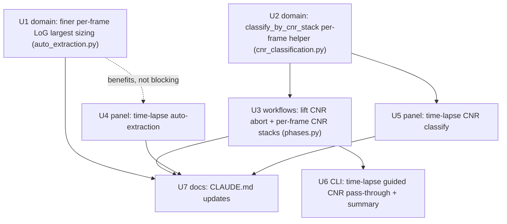

# feat: Per-timepoint multi-time-point support for ALC two-pass auto-extraction + guided CNR classification (GUI + CLI)

## Overview

Treat each timepoint of a time-lapse dataset as its own image for Adaptive Local
Clipping (ALC) — running the **two-pass auto-extraction** routine and **guided CNR
subpopulation classification** independently per frame. Three threads of work:

1. **Auto-extraction largest-particle sizing tracks each frame (batch/CLI + panel).**
   The headless workflow already loops per frame and each frame's `auto_extract`
   measures its own largest particle — proven by the per-frame `k` adapting across a
   washout series. What does *not* vary is the LoG **sizer**: with only 12 scale bins
   over σ∈[1,20], the measured largest snaps to the same diameter bin (17.5 px → coarse
   window 52) in every frame even as granules dissolve. Raise the LoG sizing resolution
   so the per-frame largest takes intermediate values and the coarse window follows the
   shrinking granules per frame. Eye-validated (the eye is ground truth).

2. **Interactive `AdaptiveClipPanel` gains time-lapse for auto-extraction and CNR.**
   The panel currently refuses time-lapse for two-pass auto-extraction
   (`adaptive_clip_panel.py:743-745`) and for both CNR tools
   (`_resolve_cnr_inputs:1068-1072`). Add per-frame stack workers mirroring the existing
   `run_adaptive_detection_stack`, producing `(T,H,W)` masks via the panel's already-
   working stacked Creator save.

3. **Headless guided CNR runs per frame with one shared threshold (batch/CLI + dialog).**
   Lift the single-timepoint abort (`phases.py:1114-1122`, the prior plan's R8) and run
   guided CNR per frame at the one configured threshold, producing `(T,H,W)` population
   mask stacks (`<round>_low`/`<round>_high`) and a per-focus CNR table with a
   `timepoint` column at `/classification/<round>`. This realizes the item the prior
   plan explicitly deferred (see
   `docs/plans/2026-06-24-001-feat-alc-auto-extract-cnr-workflow-plan.md` →
   "Deferred to Follow-Up Work" → "Per-frame (time-lapse) guided CNR classification").

**Lineage:** the auto-extraction + guided-CNR features (and their single-timepoint
restriction) were built by
`docs/plans/2026-06-24-001-feat-alc-auto-extract-cnr-workflow-plan.md` (now on `main`).
This plan extends them to time-lapse; it carries forward that plan's conventions
(per-cell σ, µm↔px, additive serialization, headless-no-QC routing, `<round>_low/_high`
naming, `/classification/<round>` table).

**Confirmed scope decisions (via planning Q&A):**
- Batch/CLI auto-extraction is already per-frame; point 1 is a **finer per-frame LoG
  sizer** (so the window tracks per frame) + a regression test locking per-frame
  independence — *not* a shared-state bug hunt.
- The coarse window should **track per frame** (follow the largest particle down as it
  shrinks); a frame with no large particle left simply runs the fine pass only.
- The interactive panel gains time-lapse for **both** auto-extraction **and** CNR
  classification.
- Guided CNR applies **one shared threshold** to every frame independently.

**Target base branch:** start the work on a new branch off `main` (e.g.
`feat/alc-multitimepoint-autoextract-cnr`). `main` already has all the auto-extract +
CNR code; the current checkout `feat/mosaic-merge-overlap-stitching` carries unrelated
stitching work and must not be the base.

---

## Problem Frame

A researcher runs a stress-granule washout time-course (CLIMP63 / G3BP1) where granules
disassemble over ~60 min. They want every timepoint analyzed as an independent image:
the detection window should adapt to that frame's particle sizes, and CNR
classification should split that frame's foci at a fixed, comparable threshold.

Today:
- **Batch/CLI auto-extraction** loops per frame and re-measures the largest particle per
  frame — but the LoG sizer is so coarse (12 scale bins) that the measured largest is
  identical across frames (`largest=17.5px`, `window=52` for all 6 timepoints in the
  user's run), masking the per-frame intent. The per-frame `k` (6.5 → 4.75) confirms the
  frames *are* processed independently; only the sizer is quantized.
- **Interactive panel** refuses time-lapse outright for auto-extraction and CNR.
- **Guided CNR** is single-timepoint only everywhere; a time-lapse round aborts cleanly.

The fix is per-timepoint independence with comparable, frame-tracking outputs, while
preserving the eye-validated single-timepoint behavior and adding no user-facing knobs.

---

## Requirements Trace

- R1. Batch/CLI + panel two-pass auto-extraction sizes the largest particle per
  timepoint with enough LoG resolution that the coarse window **tracks each frame**
  (no longer pinned to one quantized diameter across a time-lapse). *(point 1)*
- R2. A regression test locks **per-frame independence** of the auto-extraction routine:
  on a `(T,H,W)` fixture whose frames carry different particle sizes, the per-frame
  measured largest / coarse window differ. *(point 1)*
- R3. The interactive `AdaptiveClipPanel` runs two-pass auto-extraction on a `(T,H,W)`
  channel, per frame, writing one `(T,H,W)` mask via the existing stacked Creator save.
  *(point 2a)*
- R4. The interactive `AdaptiveClipPanel` runs CNR classification on a `(T,H,W)` feature
  mask, per frame, producing `(T,H,W)` population masks + a per-focus CNR table with a
  `timepoint` column; guided mode uses one shared threshold for every frame. *(point 2b, 3)*
- R5. The headless workflow (batch/CLI + config dialog) runs guided CNR on `(T,H,W)`
  data per frame (single-timepoint abort lifted), writing `(T,H,W)` `<round>_low`/
  `<round>_high` mask stacks + a `timepoint`-columned `/classification/<round>` table.
  *(point 3)*
- R6. One shared CNR threshold is applied **identically to every timepoint** — no
  per-frame threshold discovery in guided mode. *(point 3)*
- R7. Per-frame CNR uses the producing ALC round's presmooth (so the CNR σ matches the
  detector's σ), exactly as the single-timepoint path does, on the **headless** path. The
  interactive panel has no round, so it keeps the existing CNR presmooth default (`1.0`),
  matching the panel detector default — σ-parity still holds. *(parity)*
- R8. **No regression** to single-timepoint behavior (auto-extract, guided CNR, and all
  other thresholding methods) and **no new user-facing knobs**; the finer LoG sizing is
  an internal eye-validated constant.
- R9. **Graceful per-frame degradation.** A timepoint with no detectable particles (the
  auto-detect-smallest `auto_extract` `ValueError`, or zero foci / zero cells) yields an
  **empty frame** in the `(T,H,W)` output and is skipped for CNR — it must **never abort
  the whole time-lapse dataset**. This is the dissolving-granule end of a washout series,
  the feature's own target case. *(surfaced in review)*

---

## Scope Boundaries

- **Not** changing the other detection methods (single-window adaptive-clip, puncta,
  iterative-otsu, grouped-Otsu). Auto-extraction and guided CNR are the only routines
  gaining time-lapse here.
- **Not** adding any user-facing knob. The finer LoG sizing is an internal constant /
  grid in `auto_extraction.py`, tuned by eye, not exposed in the GUI or CLI.
- **No** new dependency, **no** PyInstaller / packaging change.
- **Guided is the spec'd CNR path** (one shared threshold). The panel's discover/forced
  CNR modes will also work per frame for free (they are inherently per-frame), but the
  headline behavior and tests target guided.
- The threshold/sizer math itself (`classify_by_cnr`, the band-pass z-score detector,
  the `×3` no-hole window rule, per-cell σ) is reused as-is — only the LoG **sizing
  resolution** changes (U1) and only the **orchestration** becomes per-frame.

### Deferred to Follow-Up Work

- **Interactive CNR segmenter (`cnr_segmenter.py`, "Segment by CNR (interactive)") stays
  single-frame.** Its draggable-divider histogram + live napari preview would need
  per-frame histograms and a frame-aware preview — a separate, larger effort. The shared
  `_resolve_cnr_inputs` guard is lifted only for the classify Action (U5), not the
  segmenter, which keeps its single-frame refusal.
- **Downstream measure/export of the `(T,H,W)` population masks.** Same posture as the
  prior plan: the single-cell workflow's own measure/export phases are round-name-keyed
  and won't auto-measure `<round>_low`/`<round>_high`; the standalone
  `percell4-batch-measure`/`-export` default to *all* `/masks` and will pick them up
  (now as `(T,H,W)`). The per-focus CNR table (with `timepoint`) is the quantitative v1
  output. Acceptable for v1.
- **A canonical `docs/solutions/` entry for the `(T,H,W)` per-frame axis-order / mask-
  stack / timepoint-column convention** — this feature establishes it; capture via
  `/ce-compound` after it lands (the learnings sweep found no existing doc for it).

---

## Context & Research

### Relevant Code and Patterns

**Domain (reuse; one targeted edit + one new helper):**
- `src/percell4/domain/measure/auto_extraction.py` — `auto_extract` (`:250`) already
  measures the largest per call via `measure_largest_particle_diameter` (`:145`), which
  calls `_log_diameters` (`:102`) with `num_sigma=12` (`:152`) over `min_sigma=1.0`,
  `max_sigma=MAX_SIGMA=20`. **The single lever for R1**: this 12-bin grid quantizes the
  diameter to `2√2·σ` bins (…12.6, 17.5, 22.4 px…). `_win(FILL_FACTOR×largest)` (`:76`,
  `FILL_FACTOR=3`) then maps to the coarse window.
- `src/percell4/domain/measure/cnr_classification.py` — `classify_by_cnr` (`:301`):
  guided = `threshold=<CNR>` → always a 2-way split for ≥4 foci (`labels_image` 0/1/2);
  `<4` foci → single population (`:377`). `segment_masks_from_label_image(labels_image,
  n)` (`:525`) → `[mask(==1), mask(==2)]`. `to_dataframe(result)` (`:474`) → per-focus
  table. **New shared per-frame helper goes here (U2).**

**Workflow apply phase (`src/percell4/workflows/phases.py`):**
- `apply_threshold_headless` (`:1059`): pixel-size guard (`:1088-1110`); the
  **single-timepoint CNR abort to lift** (`:1114-1122`); the time-lapse branch
  (`:1124-1164`, loops per frame, stacks `(T,H,W)`, writes `/masks/<round>` +
  `/groups/<round>` with a `timepoint` column); the single-tp path (`:1166-1197`) that
  already calls `_classify_and_write_cnr` (`:1188-1194`).
- `_classify_and_write_cnr` (`:986`): the single-frame CNR writer — clears stale
  `_low`/`_high` (`store.delete_item`), writes population masks (drop empties), writes
  the `/classification/<round>` table in try/except. **Refactor to reuse the U2 helper;
  add a `(T,H,W)` sibling.**
- `_apply_auto_extract_cells` (`:789`) + `_apply_threshold_frame` dispatch (`:872`,
  auto-extract branch `:905`): per-frame applier — **unchanged**; it already runs
  per-frame inside the time-lapse loop.
- `_alc_presmooth_for_round` (`:975`): the presmooth CNR must reuse (R7).

**Interactive panel (`src/percell4/gui/adaptive_clip_panel.py`):**
- Worker bodies (module-level, pure): `run_adaptive_detection_stack` (`:63`, **the
  template** — loops `run_adaptive_detection` per frame, per-frame auto window, stacks
  `(T,H,W)`), `run_adaptive_auto_extract` (`:163`, single-frame), `run_cnr_classification`
  (`:188`, single-frame; returns `[(suffix, mask)]` + components + report).
- `_run_auto_extract_mode` (`:733`): the **time-lapse refusal to remove** (`:743-745`);
  dispatches `run_adaptive_auto_extract` via a `Worker`; `_on_auto_extract_done` (`:846`)
  prints the report and routes to the shared Creator save.
- `_on_detect_done` (`:964`): the **already-stacked Creator save** — handles
  `is_stack` window lists (`:972`), saves the `(T,H,W)` mask via
  `AcceptPunctaMask.execute` + `viewer_win.add_mask`. Reuse for auto-extract stacks.
- `_resolve_cnr_inputs` (`:1042`): shared CNR pre-flight with the **time-lapse refusal to
  conditionally lift** (`:1068-1072`); reads `(T,H,W)` image/labels/mask fine once the
  guard allows it. `_on_classify` (`:1102`) / `_on_classify_done` (`:1155`): the Creator
  save for population masks + `/classification/<base>` table.
- `_run_*_mode` dispatch (`:447-463`) computes `is_timelapse` (`:438-439`).

**CLI (`src/percell4/interfaces/cli/batch_threshold.py`):** `--cnr-classify` /
`--cnr-threshold` already exist; lifting the phases abort makes them work on time-lapse
with no new flags. Only the summary line / help text may need a touch.

### Institutional Learnings

- `docs/solutions/architecture-patterns/adding-thresholding-method-to-single-cell-workflow-2026-06-15.md`
  — **the template for the whole feature** (the single-tp CNR abort being lifted is the
  time-lapse analog of its per-cell short-circuit). Lead pitfall: the **shared-GUI-default
  trap** (presmooth must stay the method's validated value, never the round's
  `gaussian_sigma=0`); validate on **real noisy data**, not clean synthetic fixtures —
  exactly what hid the prior ship-blocker.
- `docs/solutions/conventions/adaptive-clip-window-and-k-rules-2026-06-23.md`
  (`canonical_source: src/percell4/domain/measure/adaptive_clip.py`) — keep window
  derivation **physical-unit-driven** so per-frame results stay comparable across a
  time-lapse; **texture caveat**: a single shared `k` (or CNR threshold) reads as
  drifting stringency across frames because per-cell `1.4826·MAD` tracks per-frame
  brightness/texture. Expected, not a bug — note it in the run-log/docs.
- `docs/solutions/architecture-patterns/creator-contract-four-step-sequence-2026-05-18.md`
  (`canonical_source: src/percell4/gui/threshold_qc.py`) — the panel's stacked-mask save
  must run the full Creator sequence (store → viewer add → refresh lists → set_active);
  confirm the viewer-add + resource-list refresh handle a `(T,H,W)` layer. The existing
  detection-stack path already exercises this, so the auto-extract stack inherits it.
- `docs/solutions/logic-errors/grouped-thresholding-development-lessons.md` — keep CNR
  outputs named/typed as `{0,1}` **masks** (not "segmentation"); contrast metrics use
  means/medians (CNR already does).
- `docs/solutions/tech-debt/threshold-qc-measurements-write-owned-by-controller.md` —
  the per-focus CNR table is **classification**, written to `/classification/<round>`,
  never `/measurements`; respect the run-folder provenance boundary.

### External References

- User-supplied evidence (CLIMP63 washout, 6 timepoints): `largest=17.5px`,
  `window=52` constant while `k` varies 6.5→4.75 — the root-cause datum for U1.

---

## Key Technical Decisions

- **U1 is a sizer-resolution change, not a per-frame-loop change.** The batch/CLI already
  loops per frame; the constant largest is LoG quantization. Increase the LoG sizing
  resolution in `measure_largest_particle_diameter` (more `num_sigma`, and/or a scale
  grid focused on the relevant size range, and/or sub-bin parabolic refinement of each
  blob's scale peak) so the per-frame largest varies smoothly and the coarse window
  tracks. **The exact grid/value is settled by eye-validation** on the user's washout
  data, not in this plan (the eye is ground truth). The automated test asserts per-frame
  *variation*, not absolute correctness.
- **Window tracks per frame; a frame with no large particle runs fine-pass only.** This
  is already the structure (`auto_extract` adds the coarse pass only when
  `coarse_window > fine_window`, `auto_extraction.py:333`); the finer sizer just lets
  the per-frame decision differ across the series.
- **A new pure domain helper `classify_by_cnr_stack` (U2) is the shared per-frame CNR
  core** for both the headless phase (U3) and the panel worker (U5). It takes `(T,H,W)`
  image/feature-mask/labels + a `mode` + (for guided) one shared threshold + presmooth —
  mirroring `classify_by_cnr`'s own `mode`/`threshold` signature so guided/discover/forced
  all flow through it — classifies each frame independently, and returns the per-frame
  results, the assembled `(T,H,W)`
  low/high label stacks (or `{0,1}` mask stacks), and one per-focus DataFrame with a
  `timepoint` column. Pure (numpy/pandas, no store/Qt) — avoids duplicating the loop +
  assembly in two callers and is unit-testable in isolation. Persistence (store writes,
  Creator save) stays in the callers.
- **`(T,H,W)` is the population-mask shape** (matches the base mask, the labels, and the
  `/groups` table's `timepoint` column). Per frame: `low = labels_image==1`,
  `high = labels_image==2`; a `<4`-foci frame (single population) contributes its foci to
  `low` and zeros to `high`. A stack with all-zero `_low` (or `_high`) across every frame
  is not written (mirrors the single-tp "single population → no split" rule applied to
  the whole stack).
- **One shared guided threshold (R6).** The threshold is a config/UI scalar applied
  identically to every frame — no per-frame `candidate_cnr_threshold`. The shared σ-vs-CNR
  caveat is documented, not corrected.
- **Cross-timepoint comparability is a conscious, eye-validated tradeoff (surfaced in
  review).** Both confirmed choices — a per-frame-*tracking* coarse window (R1) and a
  fixed raw-CNR threshold across frames (R6) — optimize *per-frame* detection at some cost
  to *cross-timepoint comparability*, which is the lab's core use case (comparing
  populations across timepoints/conditions): the band-pass length-scale (`σ_bg`) shifts
  when the window changes frame-to-frame, and a fixed raw-CNR cut is a fixed *number* but
  not a fixed *statistical stringency* because `σ_cell = 1.4826·MAD` drifts with per-frame
  texture/brightness (convention doc). The user confirmed both (track per frame; one
  shared threshold), so this plan keeps them — but adds an **eye-validation step**
  (U1/U7): confirm on the CLIMP63 washout that a fixed threshold lands foci of equivalent
  contrast in the same population across frames, and that the per-frame window still
  measures the same physical structure consistently. If that validation fails, a
  series-fixed window / texture-normalized threshold is the fallback to revisit. The
  alternative (fix the window once for the series) was considered and deferred to the
  researcher's eye, not silently rejected.
- **Stale-mask cleanup is per stack.** Before writing `(T,H,W)` `_low`/`_high`, delete
  any pre-existing `<round>_low`/`_high` (a prior single-tp or 2-pop run could have left a
  2D or stale stack), reusing the existing `store.delete_item` step.
- **Panel CNR time-lapse is for the classify Action only.** `_resolve_cnr_inputs` gains a
  parameter (e.g. `allow_timelapse: bool`) so the classify path permits `(T,H,W)` while
  the interactive segmenter keeps refusing it (Deferred).
- **No CLI/dialog functional change for CNR.** The threshold is already one scalar; the
  abort lived only in `phases.py`. The CLI/dialog work is limited to a summary/help touch
  and a time-lapse CNR test.

---

## Open Questions

### Resolved During Planning

- *Is the batch/CLI auto-extraction actually reusing one largest size?* → No; it's
  per-frame (proven by per-frame `k`). The constant largest is LoG quantization → fix is
  a finer sizer (R1) + a per-frame-independence test (R2).
- *Should the coarse window track per frame or stay fixed?* → Track per frame
  (confirmed); a frame with no large particle runs the fine pass only. **Reasoning
  recorded (review):** a series-fixed window was considered; per-frame tracking was
  chosen for per-frame detection quality, accepting the cross-timepoint comparability cost
  (see Key Technical Decisions), which is checked by the U1/U7 eye-validation step.
- *Which GUI surface(s)?* → The interactive `AdaptiveClipPanel` for both auto-extraction
  and CNR classification (confirmed). The workflow config dialog needs no functional
  change (its headless path is fixed in U3).
- *Per-frame or pooled CNR threshold?* → One shared threshold applied per frame (R6).
- *Population-mask shape / table shape?* → `(T,H,W)` stacks + a `timepoint` column on
  `/classification/<round>` (matches the base mask + `/groups`).
- *Interactive CNR segmenter in scope?* → No (Deferred); only the classify Action.

### Deferred to Implementation

- The exact finer LoG grid for U1 (more `num_sigma` vs a refocused/log-spaced scale grid
  vs sub-bin parabolic refinement) and its value — chosen during eye-validation against
  the CLIMP63 washout data, balancing resolution against blob_log cost (∝ `num_sigma`).
- Whether `classify_by_cnr_stack` returns label-image stacks (0/1/2) or pre-split
  `{0,1}` mask stacks — settle when wiring U3/U5 (both callers want `{0,1}` masks; a
  label stack is more general but needs `segment_masks_from_label_image` per frame).
- Exact run-log / status-string wording for the per-frame two-pass + per-frame CNR
  summaries (how many frames split, per-frame windows).
- Whether to factor the panel auto-extract `_on_*_done` report handling into a small
  shared helper vs. inline list handling.

---

## High-Level Technical Design

> *This illustrates the intended approach and is directional guidance for review, not
> implementation specification. The implementing agent should treat it as context, not
> code to reproduce.*

**Unit dependency graph:**



**Per-frame CNR runtime flow (headless time-lapse, U3 using U2):**

```
apply_threshold_headless(store, round_spec, grouping)            [phases.py:1059]
  n_timepoints = store.metadata["n_timepoints"]                  [:1112]
  # (R8 single-tp abort at :1114-1122 REMOVED)
  if n_timepoints > 1:                                           [:1124]
      for t in range(n_timepoints):                              [:1128]
          labels_t, image_t = read frame t
          mask_t = _apply_threshold_frame(...)   # auto-extract per frame (already)
          collect mask_t  ->  base (T,H,W) stack + /groups timepoint rows
      store.write_mask(round, base_stack)                        [:1148]   # base mask
      store.write_dataframe("/groups/"+round, groups_all)        [:1160]
      if round_spec.cnr_classify is not None:                    # NEW (U3)
          low_stack, high_stack, table = classify_by_cnr_stack(  # U2 (pure)
              image_THW, base_stack, labels_THW,
              threshold=cnr.threshold, presmooth=_alc_presmooth_for_round(round))
          store.delete_item("masks/"+round+"_low" / "_high")     # stale cleanup
          write low_stack / high_stack if non-empty               # R5
          store.write_dataframe("/classification/"+round, table) # timepoint column
```

**Round-config → time-lapse behavior matrix:**

| Method | `cnr_classify` | n_timepoints | Behavior |
|---|---|---|---|
| auto-extract | — | >1 | Per-frame two-pass; per-frame window (finer sizer, U1) → `(T,H,W)` `/masks/<round>` |
| auto-extract / adaptive | set | >1 | Above, then per-frame guided CNR at one threshold → `(T,H,W)` `_low`/`_high` + timepoint table (U3) |
| auto-extract / adaptive | set | 1 | Existing single-tp path (unchanged) |
| any | set | >1 (before this plan) | ~~clean abort~~ → now runs per frame |

---

## Implementation Units

- U1. **Domain: finer per-frame LoG largest-particle sizing (auto-extraction)**

**Goal:** Make `measure_largest_particle_diameter` resolve intermediate diameters so the
per-frame coarse window tracks each frame's largest particle instead of snapping to one
12-bin diameter across a time-lapse.

**Requirements:** R1, R2, R8

**Dependencies:** None

**Files:**
- Modify: `src/percell4/domain/measure/auto_extraction.py`
- Test: `tests/test_domain_measure/test_auto_extraction.py` (or the existing
  auto-extraction test module)

**Approach:**
- Raise the LoG sizing resolution used by `measure_largest_particle_diameter` (`:145`) /
  `_log_diameters` (`:102`): increase `num_sigma` and/or focus the scale grid on the
  relevant size band, and/or add sub-bin parabolic refinement of each blob's LoG
  scale-space peak so the returned diameter is continuous rather than bin-snapped. Keep
  it an **internal constant/grid** — no new parameter, no GUI/CLI surface (R8).
- Preserve the `_win(FILL_FACTOR × largest)` mapping and the physical-unit derivation
  (convention doc): the change is *resolution*, not the size→window rule.
- Consider whether `measure_smallest_particle_diameter` (`num_sigma=14`, `:177`) should
  match for symmetry; default is to scope the change to the **largest** sizer (the
  smallest is usually user-supplied) and leave the smallest unless eye-validation shows
  drift.
- Note the blob_log cost (∝ `num_sigma`); the sizer runs once per frame, small relative
  to detection, but record the chosen value's runtime in the eye-validation note.

**Execution note:** Eye-validation-gated. Validate on the user's CLIMP63 washout
`.h5` that the per-frame coarse window now follows the dissolving granules **and** that a
fixed CNR threshold lands foci of equivalent contrast in the same population across frames
(the comparability check, Key Technical Decisions), and that single-frame results on the
lab's stress-granule / P-body datasets remain eye-correct, **before** finalizing the
constant. Record the chosen constant and the per-fixture coarse windows in the PR.
Synthetic fixtures prove independence/variation, not correctness — the eye does.

**Patterns to follow:** `measure_largest_particle_diameter` / `_log_diameters`
(`auto_extraction.py:102-166`); the eye-validation discipline in
`docs/solutions/conventions/adaptive-clip-window-and-k-rules-2026-06-23.md` and the
`project_adaptive_clip_per_cell_params` memory.

**Test scenarios:**
- Happy path (R2, per-frame variation): a synthetic `(T,H,W)` stack whose frames contain
  largest particles of deliberately different sizes (e.g. 8, 14, 22 px) → the per-frame
  `measure_largest_particle_diameter` (or the per-frame coarse window from `auto_extract`)
  **differs across frames** (proving the sizer is no longer pinned to one bin and the
  routine is per-frame independent).
- Happy path (tracking): a frame whose largest particle is smaller than another's yields
  a smaller coarse window (monotone with true size, within the new resolution).
- Edge: a frame with only sub-fine-window particles → `auto_extract` runs the fine pass
  only (`second_pass_used=False`), no coarse window.
- Edge: an empty / all-background cell selection → `measure_largest_particle_diameter`
  returns `0.0` (no raise), unchanged.
- Regression (R8): single-frame `auto_extract` on an existing fixture still returns a
  valid `{0,1}` mask with a plausible coarse window (no crash, no empty mask); the
  golden behavior for an unchanged-size image is within the new resolution's tolerance.
- Regression (pinned tolerance, R8): on the lab's validated **stress-granule** and
  **P-body** fixtures, `measure_largest_particle_diameter` (or the derived coarse window)
  stays within a stated tolerance of the known-good value at the chosen constant, so a
  future grid change cannot silently drift the eye-validated single-frame windows.
- Edge (R9, no blobs): an auto-detect-smallest selection with no LoG blobs still raises
  `ValueError` (unchanged contract); the **caller** (U3/U4) turns that into an empty
  frame, not a crash — assert the raise here, assert the graceful handling in U3/U4.

**Verification:** the auto-extraction tests pass; on a `(T,H,W)` fixture with varied
sizes the per-frame coarse windows differ; the SG/P-body windows stay within tolerance;
eye-validation on CLIMP63 confirms the window tracks the washout and the fixed-threshold
populations stay comparable across frames (recorded in the PR/run-log).

---

- U2. **Domain: `classify_by_cnr_stack` per-frame CNR helper (pure)**

**Goal:** One pure, testable per-frame CNR core that both the headless phase (U3) and the
panel worker (U5) reuse — classify each frame at one shared guided threshold and assemble
`(T,H,W)` population outputs + a `timepoint`-columned table.

**Requirements:** R4, R5, R6, R7

**Dependencies:** None (reuses `classify_by_cnr`, `segment_masks_from_label_image`,
`to_dataframe`)

**Files:**
- Modify: `src/percell4/domain/measure/cnr_classification.py`
- Test: `tests/test_domain_measure/test_cnr_classification.py`

**Approach:**
- Add `classify_by_cnr_stack(image_thw, feature_mask_thw, labels_thw, *, mode="guided",
  threshold=None, presmooth_sigma_px=1.0) -> StackResult` (pure; numpy + pandas).
  **Mirror `classify_by_cnr`'s own `mode`/`threshold` signature** so guided / discover /
  forced all work per frame (resolves the U2-vs-U5 mode mismatch); guided is the spec'd
  path (one shared `threshold` per R6). For each frame `t`, call `classify_by_cnr(image[t],
  feature_mask[t], labels[t], mode-args…, presmooth_sigma_px=presmooth_sigma_px)`. Assemble:
  - `low_stack`, `high_stack`: **always exactly `(T,H,W)` `{0,1}` uint8** —
    `low[t] = labels_image[t]==1`, `high[t] = labels_image[t]==2` (via
    `segment_masks_from_label_image` per frame). **A frame with no foci or a
    single-population result contributes an all-zero plane — never a dropped/compacted
    frame** — because `store.write_mask` validates `shape[0] == n_timepoints` exactly
    (F1; `_validate_layer_shape`).
  - **Single-population semantics (ADV2):** a frame collapses to one population from
    *either* the `<4`-foci rule *or* `MIN_FRACTION < 0.02` (the smaller group below 2%);
    in both, `classify_by_cnr` labels every focus `1`, so its foci land in `low` and
    `high` is empty for that frame. This means `_low` on a single-population frame is
    **"unclassified", not "dim"** — across a washout, late frames whose bright sub-pop
    falls below 2% silently flip to dumping all survivors into `_low`. Therefore the helper
    must surface, per frame, `n_subpopulations` **and** the single-population `reason`, so
    downstream can flag/exclude non-splitting frames rather than mis-reading a
    contaminated `_low` time-course.
  - `table`: `pd.concat` of per-frame `to_dataframe(result_t)` with a `timepoint` column
    **and a per-frame `n_subpopulations` (or `single_population` flag) column** added.
  - per-frame summary (n_subpopulations, single-population reason, per-population px) for
    the run-log.
- Return a small dataclass carrying `low_stack`, `high_stack`, `table`, and the per-frame
  results/summaries. Empty-everywhere stacks are reported (the caller decides not to write
  them) — the helper itself does no I/O.
- Validate shape agreement (`image`, `feature_mask`, `labels` all `(T,H,W)` with matching
  `T`); raise `ValueError` on mismatch (callers convert to a clean failure/status).

**Patterns to follow:** `classify_by_cnr` guided path (`cnr_classification.py:301-463`);
`segment_masks_from_label_image` (`:525`); `to_dataframe` (`:474`); the per-frame loop
shape of `phases.py:1124-1164` (timepoint column) and `run_adaptive_detection_stack`.

**Test scenarios:**
- Happy path (R6): a `(T,H,W)` fixture with two CNR clusters per frame + one shared
  threshold → `low_stack`/`high_stack` are `(T,H,W)` with the expected per-frame split;
  the same threshold classifies every frame (assert a focus at a given CNR lands in the
  same population in every frame).
- Happy path (table): the returned table has one row per (frame, focus) and a `timepoint`
  column spanning `0..T-1`; row counts match per-frame foci totals.
- Edge (shape, F1): `low_stack`/`high_stack` always have leading dim exactly `T` (== input
  `T`), even when only one frame splits — empty/single-pop frames are all-zero planes, not
  dropped. (Guards the `store.write_mask` `shape[0]==n_timepoints` validator.)
- Edge (mixed frames): a stack where some frames split and one frame has `<4` foci → the
  few-foci frame contributes `low`-only (no `high`), no raise; the table still includes
  its rows with its `timepoint` and `n_subpopulations==1`.
- Edge (MIN_FRACTION flip, ADV2): a `(T,H,W)` fixture where early frames split 2-way but a
  late frame's smaller (bright) group drops below `MIN_FRACTION` (2%) → that frame returns
  a single population, its foci land in `low`, and the table marks it `n_subpopulations==1`
  with the single-population reason (so a `_low` time-course is not silently contaminated
  by an unclassified frame).
- Edge (all single-population): every frame `<4` foci → `high_stack` all-zero (caller
  writes no `_high`), `low_stack` carries the foci, table still produced.
- Edge (empty frame): a frame with an all-zero feature mask → zero rows for that
  timepoint, zero in both stacks, no raise.
- Edge (mode): `mode="discover"` / `"forced"` loop per frame too (no shared threshold);
  guided requires a `threshold`.
- Error path: shape mismatch (`labels` `T` ≠ `image` `T`) → `ValueError`.

**Verification:** `tests/test_domain_measure/test_cnr_classification.py` passes; the helper
is import-clean (no Qt/store) and the stacks/table round-trip the per-frame split.

---

- U3. **Workflows: lift the single-timepoint CNR abort + per-frame CNR stacks in `phases.py`**

**Goal:** Run guided CNR per frame in the headless time-lapse path at one shared
threshold, writing `(T,H,W)` population masks + a `timepoint`-columned table, with no
change to the single-timepoint path; and degrade gracefully on no-particle frames.

**Requirements:** R5, R6, R7, R8, R9

**Dependencies:** U2

**Files:**
- Modify: `src/percell4/workflows/phases.py`
- Test: `tests/test_workflows/test_phases.py`,
  `tests/test_workflows/test_phases_threshold_timelapse.py`

**Approach:**
- **Remove** the single-timepoint CNR abort (`:1114-1122`). The time-lapse branch now
  handles CNR instead of refusing it.
- **Graceful per-frame degradation in the base auto-extract loop (R9, ADV1).** The
  existing loop fails the whole dataset on any per-frame applier error (`if err: return
  DatasetFailure`, `:1140-1141`). In the **auto-detect-smallest** path, `auto_extract`
  *raises* when a frame has no LoG blobs (`auto_extraction.py:299-303`) — the dissolving
  end of a washout. Distinguish this **recoverable "no particles"** case from genuine
  errors (bad pixel size, read failure): on no-particles, append an **empty frame**
  (`np.zeros(labels.shape, uint8)`, no `/groups` rows — mirror the existing `g is None`
  handling at `:1135-1138`) and continue; reserve the dataset abort for genuine errors.
  `_apply_auto_extract_cells` should return a typed/sentinel "no particles" signal (not a
  bare error string) so the loop can branch.
- **Collect frames in the loop, don't double-read (SG2).** During the base loop, collect
  `image_t` / `labels_t` (alongside `mask_frames`) into `image_frames` / `labels_frames`;
  after the loop, `image_thw = np.stack(image_frames)`, `labels_thw = np.stack(labels_frames)`
  feed `classify_by_cnr_stack` — avoiding a second full-dataset read. (Note the peak-RAM
  cost of holding `(T,H,W)` image+labels; acceptable given the workflow already writes
  whole-stack masks.)
- After the base `(T,H,W)` mask + `/groups` writes, when `round_spec.cnr_classify is not
  None`: call `classify_by_cnr_stack(image_thw, base_stack, labels_thw, mode="guided",
  threshold=cnr.threshold, presmooth_sigma_px=_alc_presmooth_for_round(round_spec))` (U2).
  Then:
  - `store.delete_item(f"masks/{round}_low")` / `_high` (stale cleanup, before writes) —
    this also clears a **stale 2D** `_low`/`_high` from a prior single-tp run before the
    new `(T,H,W)` write (rank change).
  - Write `low_stack` / `high_stack` via `store.write_mask` only when the stack has any
    positive pixel in **any** frame (the whole-stack analog of the single-tp drop-empty
    rule — state "non-empty == any frame non-empty" explicitly so it can't drift).
  - Write `/classification/<round>` via `store.write_dataframe` in try/except (table is
    secondary; a failure is surfaced in the message, masks stand).
  - On a `classify_by_cnr_stack` raise → return a clean `DatasetFailure.THRESHOLD_ERROR`
    (never raise).
- **Leave `_classify_and_write_cnr` (`:986`, single-tp) unchanged (SG1/F2).** The
  single-tp path keeps calling it as-is — its single-population → no-`_low`/`_high`
  behavior is byte-stable (R8); the time-lapse path calls `classify_by_cnr_stack` directly.
  Both share R7 σ-parity through `_alc_presmooth_for_round`, which each already calls — no
  risky 2D↔`(1,H,W)` reshape refactor (no requirement traces to one).
- Extend the run-log / success message to summarize per-frame CNR (how many frames split,
  per-population px, and how many collapsed to a single population and why). The shared-σ
  caveat (per-frame texture shifts apparent stringency) is noted in docs (U7), not corrected.

**Execution note:** Regression-first on the time-lapse path — add the `(T,H,W)` CNR test
and confirm the prior `n_timepoints>1` abort test is updated (it should now *run* CNR,
not fail). Keep the noisy-fixture discipline (clean synthetic data hid the prior
ship-blocker).

**Patterns to follow:** the existing single-tp `_classify_and_write_cnr` (`:986-1058`);
the time-lapse base-mask stacking + `timepoint` column (`:1124-1164`);
`_alc_presmooth_for_round` (`:975`); the prior plan's CNR write idioms.

**Test scenarios:**
- Happy path (R5/R6): an auto-extract (or adaptive) round with `cnr_classify` on a
  `(T,H,W)` dataset → `/masks/<round>_low` and `/masks/<round>_high` are `(T,H,W)`;
  `/classification/<round>` has a `timepoint` column; the same threshold split every
  frame.
- Covers the lifted abort: the test that previously asserted a clean `DatasetFailure` for
  time-lapse CNR is updated to assert the round now **runs** per-frame CNR (no failure,
  population masks + table written).
- Covers R9 (no-particles frame, ADV1): a `(T,H,W)` auto-extract round in
  **auto-detect-smallest** mode where a late frame has no LoG blobs → that frame is an
  all-zero plane in the base `(T,H,W)` mask, the dataset **completes** (no abort), and the
  earlier frames' masks/foci are intact.
- Error path (genuine vs recoverable): a frame with a genuine error (e.g. a µm
  smallest-particle override with no pixel size) still fails the dataset cleanly — only the
  "no particles" case degrades to an empty frame.
- Edge ("non-empty" definition): a stack where exactly one frame has a high population →
  `_high` is written as `(T,H,W)` (non-empty in that one frame), with all-zero planes
  elsewhere.
- Edge (stale cleanup): a round that previously wrote 2D `_low`/`_high` (single-tp run),
  re-run on `(T,H,W)`, leaves no stale 2D masks — only the new `(T,H,W)` stacks.
- Edge (single population everywhere): a continuum stack at a threshold that never splits
  → no `_low`/`_high` written, base `(T,H,W)` mask stands, table still written, message
  notes single-population.
- Error path: `classify_by_cnr_stack` raises (bad shapes) → clean `DatasetFailure`, no
  partial population masks; table-write failure surfaces in the message but masks stand.
- Integration: `store.read_mask("<round>_low")` returns `(T,H,W)`;
  `store.read_dataframe("/classification/<round>")["timepoint"].nunique()` == n_timepoints
  with foci.
- Regression (R8): a single-timepoint CNR round writes exactly as before (2D masks, no
  `timepoint` column) — `_classify_and_write_cnr` behavior unchanged.

**Verification:** both phases test modules pass; a `(T,H,W)` CNR round writes `(T,H,W)`
population masks + a `timepoint`-columned table; single-tp behavior byte-stable.

---

- U4. **Panel: time-lapse two-pass auto-extraction**

**Goal:** Let the interactive `AdaptiveClipPanel` run two-pass auto-extraction on a
`(T,H,W)` channel, per frame, saving one `(T,H,W)` mask via the existing stacked Creator
save.

**Requirements:** R3, R8, R9

**Dependencies:** U1 (benefits from the finer per-frame sizer; not blocking)

**Files:**
- Modify: `src/percell4/gui/adaptive_clip_panel.py`
- Test: `tests/test_gui/test_adaptive_clip_panel.py` (the panel test module)

**Approach:**
- Add `run_adaptive_auto_extract_stack(image, labels, smallest_particle_px,
  presmooth_sigma_px, min_spot_px)` (module-level, pure) mirroring
  `run_adaptive_detection_stack` (`:63`): loop the leading time axis, call
  `auto_extract(image[t], labels[t], smallest_particle_px=…, presmooth_sigma_px=…,
  min_spot_px=…)` per frame, stack masks → `(T,H,W)`, return `(mask_thw, reports_list)`.
- **Per-frame graceful degradation (R9, ADV1).** In **auto-detect-smallest** mode
  (`smallest_particle_px=None`) `auto_extract` *raises* on a blob-less frame
  (`auto_extraction.py:299-303`); a bare `for`-loop would let one dissolving-end frame
  abort the whole stack run via the `Worker.error` path. Catch that per frame inside the
  stack worker → contribute an all-zero plane for that frame (record it in the per-frame
  report), and continue; only genuinely unexpected errors propagate.
- In `_run_auto_extract_mode` (`:733`): **remove** the `is_timelapse` refusal
  (`:743-745`); when `is_timelapse`, dispatch `run_adaptive_auto_extract_stack` (else the
  single-frame `run_adaptive_auto_extract`). Labels for time-lapse come from the
  `(T,H,W)` Labels layer (`_find_layer_data(..., "Labels", seg)`); the existing
  `labels.shape != image.shape` guard already covers `(T,H,W)`.
- In `_on_auto_extract_done` (`:846`): handle a **list** of reports (print per frame;
  back-fill the smallest-Ø readout from frame 0 when auto-detected) and route to
  `_on_detect_done` with the `(T,H,W)` mask + a per-frame window list (so the existing
  `is_stack` handling at `:972` and the "(auto window …, per frame)" note apply). The
  `(T,H,W)` Creator save is already correct (`:976-1009`) — no save-path change.

**Approach note (state ownership):** the panel is a Creator; the stacked save reuses the
already-validated `AcceptPunctaMask.execute` + `viewer_win.add_mask` + `_refresh_cnr_masks`
sequence (`:976-1009`) that the detection-stack path uses, so the four-step Creator
contract is inherited, not re-implemented.

**Patterns to follow:** `run_adaptive_detection_stack` (`:63-83`) and its dispatch
(`:519`, `:603`); `_on_detect_done` `is_stack` handling (`:964-1009`).

**Test scenarios:**
- Happy path (R3): on a `(T,H,W)` channel + `(T,H,W)` segmentation, running auto
  extraction produces a `(T,H,W)` mask saved under the chosen name (assert the saved
  mask rank == 3 and `T` matches).
- Happy path (per-frame): the per-frame reports differ where frames differ (e.g. window
  list not all-equal on a varied fixture) — ties U4 to U1's per-frame sizer.
- Edge: a single-frame channel still runs the single-frame path (`run_adaptive_auto_extract`)
  and saves a 2D mask (no regression).
- Edge: no active segmentation → the existing "needs an active segmentation" status
  (auto-extraction is per-cell), unchanged.
- Edge: the smallest-Ø readout back-fill works for a stack (frame-0 value) when
  auto-detect is on.
- Edge (R9, no-blobs frame): a `(T,H,W)` stack in auto-detect-smallest mode with a
  blob-less frame still completes and saves a `(T,H,W)` mask (that frame an all-zero
  plane), rather than erroring out the whole run.

**Verification:** the panel test passes under the offscreen-Qt harness; a `(T,H,W)`
channel yields a `(T,H,W)` saved mask; a blob-less frame degrades to an empty plane; the
single-frame path is unchanged.

---

- U5. **Panel: time-lapse CNR classification (classify Action)**

**Goal:** Let the panel's "Classify Mask by CNR" Action run on a `(T,H,W)` feature mask,
per frame, with one shared guided threshold — saving `(T,H,W)` population masks + a
`timepoint`-columned `/classification/<base>` table — while the interactive segmenter
stays single-frame.

**Requirements:** R4, R6, R7, R8

**Dependencies:** U2

**Files:**
- Modify: `src/percell4/gui/adaptive_clip_panel.py`
- Test: `tests/test_gui/test_adaptive_clip_panel.py`

**Approach:**
- Add an `allow_timelapse: bool = False` parameter (or split the guard) to
  `_resolve_cnr_inputs` (`:1042`): the classify path (`_on_classify`) passes
  `allow_timelapse=True`; the interactive segmenter (`_on_segment_cnr`) keeps the default
  so its `(T,H,W)` refusal (`:1068-1072`) stands (Deferred). The `(T,H,W)` reads
  (image/labels/mask) and shape checks already work once the guard allows it.
- Add `run_cnr_classification_stack(image, feature_mask, labels, *, mode, threshold)`
  (module-level, pure) that, for `(T,H,W)` inputs, calls `classify_by_cnr_stack(...,
  mode=mode, threshold=threshold)` (U2 now accepts `mode`, so guided/discover/forced all
  flow through it) and returns the `(T,H,W)` `_low`/`_high` masks + components-with-
  `timepoint` + a combined report. Guided (one shared threshold) is the spec'd path.
- **Presmooth in the panel (F3):** the panel has no `round_spec`, so — exactly like the
  existing single-frame `run_cnr_classification` (which calls `classify_by_cnr` without a
  presmooth, defaulting to `1.0`) — the stack worker uses `presmooth_sigma_px=1.0`. R7's
  "producing round's presmooth" applies to the **headless** path (U3) only; in the panel
  the detector's panel default and CNR both sit at `1.0`, so σ-parity still holds. State
  this so the implementer doesn't try to thread a non-existent round presmooth.
- In `_on_classify` (`:1102`): when the resolved inputs are `(T,H,W)`, dispatch
  `run_cnr_classification_stack` (else the single-frame `run_cnr_classification`).
- In `_on_classify_done` (`:1155`): Creator-save the `(T,H,W)` population masks (same
  `AcceptPunctaMask` + `add_mask` sequence, which already handles `(T,H,W)`) and write the
  `timepoint`-columned table to `/classification/<base>` (the existing write at
  `:1192-1200`, now from the stacked components).

**Approach note:** guided CNR with one shared threshold satisfies R6 directly — the
threshold scalar from `_cnr_settings` is passed to every frame. Document the per-frame
texture/σ caveat (U7); do not auto-correct it.

**Patterns to follow:** `_resolve_cnr_inputs` (`:1042-1100`); `run_cnr_classification`
(`:188-220`); `_on_classify` / `_on_classify_done` Creator save (`:1102-1204`); the
`(T,H,W)` save path validated in U4.

**Test scenarios:**
- Happy path (R4/R6): a `(T,H,W)` feature mask + guided threshold → `(T,H,W)`
  `<base>_low`/`<base>_high` saved + a `/classification/<base>` table with a `timepoint`
  column; the same threshold split every frame.
- Edge (segmenter unchanged): the interactive segmenter still refuses `(T,H,W)`
  ("CNR tools support single-frame channels only") — `allow_timelapse` defaults False for
  it.
- Edge (single-frame classify): a 2D feature mask still uses `run_cnr_classification` and
  saves 2D population masks (no regression).
- Edge (single population per frame): a continuum stack at a threshold that never splits →
  no population masks saved, status notes single-population, table still written.
- Integration (Creator): saved `(T,H,W)` population masks appear in the CNR source-mask
  list refresh and as napari layers (the four-step Creator sequence fires for a stack).

**Verification:** the panel test passes; a `(T,H,W)` classify produces `(T,H,W)` masks +
a `timepoint`-columned table; the segmenter and single-frame classify are unchanged.

---

- U6. **CLI: time-lapse guided CNR pass-through + summary/help**

**Goal:** Confirm `percell4-batch-threshold --cnr-classify --cnr-threshold` works on
time-lapse data (via U3) and the summary/help reflect it; no new flags.

**Requirements:** R5, R6, R8

**Dependencies:** U3

**Files:**
- Modify: `src/percell4/interfaces/cli/batch_threshold.py` (summary/help only)
- Test: `tests/test_cli_batch_threshold.py`

**Approach:**
- No new flags: `--cnr-classify` / `--cnr-threshold` already build
  `CnrClassifySettings(threshold=…)`; the round runs through `apply_threshold_headless`,
  which (after U3) handles time-lapse CNR. Remove any stale "single-timepoint only" note
  from `--cnr-classify` help / the summary line if present; optionally mention that CNR
  now runs per frame at one shared threshold.
- Keep `--help` Qt-free / fast (heavy imports inside `main`).

**Test scenarios:**
- Happy path: `--strategy auto-extract --smallest-particle-um 7 --smallest-particle-unit
  px --cnr-classify --cnr-threshold <v>` on a `(T,H,W)` fixture dataset writes `(T,H,W)`
  base + `_low`/`_high` masks + a `timepoint`-columned `/classification/<round>` table
  (end-to-end through the CLI).
- Edge: `--cnr-classify` without `--cnr-threshold` still errors (exit 1) — unchanged.
- Edge: the summary line reflects the CNR-guided fragment for a time-lapse run.

**Verification:** `tests/test_cli_batch_threshold.py` passes, including a time-lapse CNR
end-to-end case; `--help` stays fast.

---

- U7. **Docs: CLAUDE.md updates + `(T,H,W)` convention note**

**Goal:** Keep the living docs accurate for the new time-lapse behavior and record the
per-frame `(T,H,W)` / `timepoint`-table convention this feature establishes.

**Requirements:** R1, R4, R5, R9 (documentation of current state)

**Dependencies:** U3, U4, U5

**Files:**
- Modify: `src/percell4/workflows/CLAUDE.md`
- Modify: `src/percell4/domain/measure/CLAUDE.md`
- Modify: `src/percell4/gui/CLAUDE.md`

**Approach:**
- `workflows/CLAUDE.md`: state that guided CNR (`cnr_classify`) now supports time-lapse —
  per frame, one shared threshold, `(T,H,W)` `<round>_low`/`_high` masks +
  a `timepoint`-columned `/classification/<round>` table (replace the "single-timepoint"
  clause).
- `domain/measure/CLAUDE.md`: note the finer per-frame LoG largest-particle sizing in
  `auto_extraction.py` (the largest now resolves intermediate diameters so the coarse
  window tracks per frame) and the new `classify_by_cnr_stack` helper in
  `cnr_classification.py`.
- `gui/CLAUDE.md`: note the panel's time-lapse support for two-pass auto-extraction and
  CNR classification (classify Action), and that the interactive CNR segmenter remains
  single-frame.
- Record the per-frame-σ texture caveat (one shared `k`/threshold reads as drifting
  stringency across frames — expected) where the ALC/CNR behavior is described, and the
  **cross-timepoint comparability** note (per-frame window tracking + fixed raw-CNR
  threshold trade comparability for per-frame fit; eye-validated).
- Document the **per-frame single-population semantics (ADV2)**: a frame that does not
  split (`<4` foci or smaller group `< MIN_FRACTION`) puts all its foci in `<round>_low`,
  which therefore means "unclassified for that frame", not "dim" — the per-frame
  `n_subpopulations` column flags these so a `_low` time-course is read correctly.
- Document the **no-particle-frame degradation (R9)**: an auto-detect-smallest frame with
  no detectable particles yields an empty plane, not a failed dataset.
- Current-state only (no plan/history), per the documentation rules.

**Test scenarios:** Test expectation: none — documentation only (no behavioral change).

**Verification:** the three CLAUDE.md files describe the time-lapse behavior accurately
and the "single-timepoint only" CNR clause is gone.

---

## System-Wide Impact

- **Interaction graph:** one domain sizer change (U1), one new pure domain helper (U2),
  one headless apply-phase extension (U3), two panel surfaces (U4 auto-extract, U5 CNR),
  a CLI summary touch (U6), docs (U7). No change to `viewer.py`, session selection
  fields, the other thresholding methods, the config dialog's functional behavior, or the
  measure/export phases.
- **Error propagation:** a per-frame *no-particle* `auto_extract` raise is **recoverable** —
  the frame becomes an empty plane and the dataset completes (R9, U3/U4); only genuine
  errors (bad pixel size, read failure) abort. Per-frame CNR raises are caught in U3 (→
  clean `DatasetFailure`) and in the panel workers (→ status message); table-write
  failures are isolated by try/except and never lose the population masks; shape mismatches
  are caught in U2.
- **State lifecycle risks:** `(T,H,W)` `_low`/`_high` stacks are written beyond the base
  mask; the per-stack `store.delete_item` cleanup prevents stale 2D or 2→1-population
  masks from surviving a re-run. `WorkflowConfig`'s reserved-name guard for
  `<round>_low/_high` (added by the prior plan) still applies.
- **API surface parity:** GUI (panel) and CLI/dialog (headless) both run per-frame
  auto-extraction and per-frame guided CNR; the `(T,H,W)` mask shape + `timepoint`-table
  schema are identical across surfaces (U2 is the shared core).
- **Integration coverage:** the per-frame stacking + store writes + Creator save are
  integration behaviors that mocks won't fully prove — test against a real `DatasetStore`
  (phases tests) and the offscreen-Qt harness (panel tests).
- **Unchanged invariants:** single-timepoint auto-extract / CNR / all other methods; the
  `{0,1}` mask contract; `/masks/<round>` + `/groups/<round>` as base outputs; the
  `×3` no-hole window rule and per-cell σ definition; the `auto_extract` /
  `classify_by_cnr` algorithms (only LoG **sizing resolution** and **orchestration**
  change). No new dependency, no packaging change, no new user-facing knob.

---

## Risks & Dependencies

| Risk | Mitigation |
|------|------------|
| **U1 changes single-frame results too** (finer sizer alters every dataset's largest/window) | Eye-validate on the lab's stress-granule / P-body single-frame data *and* the CLIMP63 washout before finalizing the constant (the eye is ground truth); a single-frame regression test asserts a valid non-empty mask + plausible window. Resolution-only change keeps the size→window rule intact. |
| Finer LoG grid slows `blob_log` (cost ∝ `num_sigma`) | Sizer runs once per frame (small vs detection); record the chosen value's runtime; prefer a focused/refined grid over a brute-force huge `num_sigma` if cost matters. |
| Per-frame `(T,H,W)` axis-order / stacking bug (silent) | U2 is pure + unit-tested for shape and per-frame split; phases + panel integration tests assert `(T,H,W)` shape and `timepoint` coverage on a real store. |
| Lifting `_resolve_cnr_inputs` guard accidentally enables the **interactive segmenter** for time-lapse (out of scope, would need per-frame preview) | `allow_timelapse` defaults False; only the classify Action opts in; a test asserts the segmenter still refuses `(T,H,W)`. |
| One shared `k`/CNR threshold reads as drifting stringency across frames (per-cell MAD tracks per-frame texture) | Expected per the convention doc; documented (U7), not corrected; guided threshold is user-driven. |
| Stale `_low/_high` after a single-tp→time-lapse (or 2→1-pop) re-run | Per-stack `store.delete_item` before writes (U3); covered by a re-run integration test. |
| Shared-GUI-default trap regression (presmooth) | Unchanged from the prior plan — `AutoExtractSettings.presmooth_sigma_px` owns its default; CNR reuses `_alc_presmooth_for_round`; no new wiring to `gaussian_sigma`. |
| **No-particle (dissolved) frame aborts the whole time-lapse** (auto-detect `auto_extract` raises; loop does `if err: return DatasetFailure`) — the feature's own washout endpoint | R9: per-frame "no particles" is recoverable → empty plane, not abort (U3 headless loop + U4 panel stack worker); genuine errors still abort; tested on a `(T,H,W)` stack with a blob-less late frame. |
| **`_low` silently contaminated by single-population frames** (`<4` foci OR smaller group `< MIN_FRACTION` → all foci labeled `low`) corrupting the per-population time-course | U2 records per-frame `n_subpopulations` + reason on the table; U7 documents `_low`-on-single-pop = "unclassified, not dim"; tested with a washout fixture whose bright sub-pop drops below `MIN_FRACTION` in late frames. |
| **Cross-timepoint comparability cost** of per-frame window tracking + fixed raw-CNR threshold (σ_cell drifts per frame) | Surfaced as a conscious, user-confirmed tradeoff (Key Technical Decisions); U1/U7 add an eye-validation that fixed-threshold populations stay equivalent-contrast across frames; series-fixed window / texture-normalized threshold is the documented fallback if validation fails. |
| `_low`/`_high` stack with fewer than `n_timepoints` frames trips `store.write_mask` validation | U2 assembles stacks at exactly `(T,H,W)` (all-zero planes for empty/single-pop frames), never compacted; F1 test asserts leading dim == `T`. |

---

## Documentation / Operational Notes

- U7 updates `src/percell4/workflows/CLAUDE.md`, `src/percell4/domain/measure/CLAUDE.md`,
  and `src/percell4/gui/CLAUDE.md`.
- No new dependency, no `pyproject.toml` / `percell4.spec` change.
- After landing, run `/ce-compound` to capture (a) the `(T,H,W)` per-frame axis-order /
  mask-stack / `timepoint`-column convention (the learnings sweep found no existing doc),
  and (b) the "constant-looking per-frame output was LoG-sizer quantization, not
  size-reuse" diagnosis, so the next per-frame feature inherits both.
- **Branch:** create `feat/alc-multitimepoint-autoextract-cnr` off `main` (not off the
  current `feat/mosaic-merge-overlap-stitching`).

---

## Sources & References

- **Lineage plan (features being extended; this realizes its deferred time-lapse CNR
  item):** [docs/plans/2026-06-24-001-feat-alc-auto-extract-cnr-workflow-plan.md](docs/plans/2026-06-24-001-feat-alc-auto-extract-cnr-workflow-plan.md)
- Origin concept doc: [docs/brainstorms/2026-06-22-multiscale-adaptive-clip-routine-requirements.md](docs/brainstorms/2026-06-22-multiscale-adaptive-clip-routine-requirements.md)
- Canonical how-to: `docs/solutions/architecture-patterns/adding-thresholding-method-to-single-cell-workflow-2026-06-15.md`
- Convention: `docs/solutions/conventions/adaptive-clip-window-and-k-rules-2026-06-23.md`
- Creator contract: `docs/solutions/architecture-patterns/creator-contract-four-step-sequence-2026-05-18.md`
- Classification table ownership: `docs/solutions/tech-debt/threshold-qc-measurements-write-owned-by-controller.md`
- Key code: `src/percell4/domain/measure/auto_extraction.py:102,145,250`,
  `src/percell4/domain/measure/cnr_classification.py:301,474,525`,
  `src/percell4/workflows/phases.py:975,986,1059,1114,1124`,
  `src/percell4/gui/adaptive_clip_panel.py:63,163,188,733,964,1042,1102`,
  `src/percell4/interfaces/cli/batch_threshold.py`
