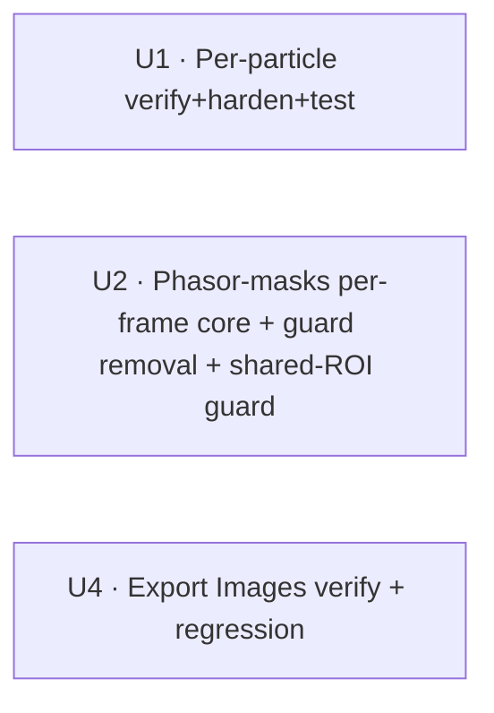

# feat: Multi-timepoint support for per-particle multichannel, phasor-masks, and Export Images

## Overview

Three more intensity/FLIM surfaces are brought onto PerCell4's established time-lapse
`(T,H,W)` contract:

1. **Per-particle multi-channel intensity** — the in-app analysis already loops per
   timepoint through the analysis framework (`run_analysis._aggregate_timepoints`), but
   that path is **untested** on time-lapse and has one latent exact-`T` hazard (a
   no-particle frame could drop a donut plane). This is a *verify + harden + test* unit.
2. **Automated phasor-masks workflow** — currently **refuses** time-lapse FLIM (the U20
   discoverability guard) because `/decay` had no acquisition-time axis. That axis now
   exists (the 2026-06-26 multi-timepoint TCSPC FLIM work: 4-D `/decay`, per-frame
   `compute_phasor`, `read_decay(timepoint=)`). This unit removes the guard and adds a
   **per-frame fit → `(T,H,W)` mask** loop. This is the main build.
3. **Export Images…** — already writes one TIFF per `(channel, timepoint)` with a
   `_t{NN}` suffix + channel name and handles `(T,C,H,W)` (U19). This is a *verify +
   regression-coverage* unit confirming the multi-channel × per-timepoint contract.

The unifying principle (the project's north star): **pure domain functions stay 2D;
callers slice to one frame, run the unchanged 2D function, then assemble** (`pd.concat`
with a `timepoint` column for tables, `np.stack(axis=0)` → `(T,H,W)` for masks). Almost
every change here is "wire the canonical per-timepoint loop into a caller," not "rewrite
an algorithm."

---

## Problem Frame

A user loads a multi-timepoint dataset (e.g. the FLIM washout time-lapse in the
screenshots — a `(T,C,H,W)` `.h5` with a 4-D `/decay`). They want the same three
operations they run on single-timepoint data to work per frame:

- **Per-particle multichannel** should produce per-particle (or per-cell) rows for every
  timepoint, tagged with a `timepoint` column, and — when donut export is on — a
  `(T,H,W)` donut mask. Today the GUI path *probably* does this via the framework, but
  nobody has proven it, and a no-particle frame is a latent shape-contract landmine.
- **Automated phasor-masks** should fit the phasor ellipse per timepoint and write a
  `(T,H,W)` population mask. Today it pops *"Time-lapse FLIM not supported"* and skips the
  dataset entirely (`phasor_masks_dialog.py:459-470`).
- **Export Images** should write one `.tif` per timepoint per channel with a timepoint
  indicator. Investigation shows this already works (U19); the user wants it confirmed and
  regression-locked.

These are three more instances of the same systemic theme the
[2026-06-05 feature-parity plan](2026-06-05-002-feat-multi-timepoint-feature-parity-plan.md)
addressed across the app. The phasor-masks piece was explicitly **deferred** there (it
depended on the FLIM 4-D `/decay` axis, which has since landed), which is why it is the
real work now.

---

## Requirements Trace

- R1. **Per-particle multichannel runs per frame.** On a multi-t dataset the in-app
  analysis emits per-particle (or per-cell) rows for every timepoint with a `timepoint`
  column, and a `(T,H,W)` donut mask with **exactly `n_timepoints` planes** when
  `export_donuts` is on (a no-particle frame contributes an all-zero plane, never a
  dropped frame).
- R2. **Automated phasor-masks runs per frame on time-lapse FLIM.** The U20 skip-guard is
  removed; each channel's ellipse is fit **independently per timepoint** and the two
  population masks are written as `(T,H,W)`.
- R3. **Per-frame phasor intensity is decay-derived and degrades gracefully.** The
  intensity weight for frame `t` comes from `read_decay(channel, timepoint=t).sum(-1)` —
  never `/intensity`. A frame whose fit fails (empty/degenerate phasor) yields an all-zero
  mask plane for that frame (recoverable); the channel errors only when **every** frame
  fails.
- R4. **Shared-ROI mode is discoverably guarded on time-lapse (not silently wrong).** The
  cross-dataset shared-ROI sub-mode (apply one source dataset's fit to targets) is **not**
  extended to time-lapse in this plan; a shared-ROI run touching a time-lapse dataset is
  **skipped with a clear "shared-ROI time-lapse not yet supported" reason** (mirroring the
  FLIM-FRET guard), and the scalar `roi_cache` type is left unchanged. Full shared-ROI ×
  time-lapse is deferred follow-up.
- R5. **Export Images writes one TIFF per (channel, timepoint)** with a `_t{NN}` suffix +
  channel name on multi-channel `(T,C,H,W)` datasets; the contract is regression-locked.
- R6. **Single-timepoint behavior is byte-identical** everywhere — no `timepoint` column,
  no `_t` suffix, no shape/behavioral change when `n_timepoints == 1`.
- R7. **Per-frame phasor derivation respects derived-layer staleness.** `ensure_phasor`
  computes a `(T_acq,H,W)` phasor and invalidates filtered/lifetime derivatives in the
  same write (already true of `ComputePhasor`); the masks workflow reads only the
  unfiltered per-frame `g/s`.

**Origin:** No upstream `ce-brainstorm` requirements doc. The governing context is the
canonical time-handling contract from
[2026-06-05-002](2026-06-05-002-feat-multi-timepoint-feature-parity-plan.md) (its §C/§D/§E
contract and its deferred "Full FLIM/phasor time-lapse" follow-up item) and the completed
4-D `/decay` foundation from the 2026-06-26 TCSPC FLIM work. Three scope decisions were
resolved with the user during planning (see [Key Technical Decisions](#key-technical-decisions)).

---

## Scope Boundaries

- **Non-goal: standalone CLI `scripts/per_particle_multichannel.py` time-lapse.** The user
  scoped per-particle work to the **in-app analysis** only; the standalone TIFF-folder
  script stays 2D-image-set-only.
- **Non-goal: FLIM-FRET time-lapse.** The FLIM-FRET workflow (`flim_fret_dialog.py`,
  `run_flim_fret.py`) keeps its own discoverability guard; only the **phasor-masks**
  guard is lifted here.
- **Non-goal: new Export Images behavior.** Export is verify-only; no new output mode
  (e.g. a single multi-channel TIFF per timepoint) — the user confirmed the existing
  per-channel-per-timepoint output is what's wanted.
- **Non-goal: new analysis algorithms.** The pure 2D domain functions
  (`run_one_image_set`, `compute_phasor`, `fit_phasor_ellipse`, `apply_ellipse_masks`)
  are unchanged; only their callers gain a per-frame loop.
- **Non-goal: interactive phasor-plot "apply visible as mask".** This plan covers the
  **automated** batch phasor-masks workflow, not the interactive `phasor_plot.py` ROI
  tool.

### Deferred to Follow-Up Work

- **Shared-ROI × time-lapse (the former U3).** Extending the cross-dataset shared-ROI
  sub-mode to time-lapse — caching per-frame fits and applying frame-matched ellipses to
  targets — is deferred (user decision: guard + defer). It requires normalizing the
  `roi_cache` to an always-length-`T` sequence and handling source/target `T` parity in
  both directions; out of scope here. Until then U2 guards it with a clear skip reason.
- **Atomic-write adoption for Export Images.** `canonical-sources-matrix.yaml` flags
  `export_images.py` as bypassing the `tmp + os.replace` atomic-write contract. Real, but
  orthogonal to multi-timepoint and out of the user's "verify-only" scope — a separate
  hardening PR (see `docs/solutions/architecture-patterns/atomic-write-contract.md`).
- **Capturing the new conventions in `docs/solutions/`.** Two contracts this plan relies
  on are undocumented: (a) `_aggregate_timepoints` per-particle identity + exact-`T`
  ImageOutput behavior, and (b) the per-frame phasor-mask fit/degradation policy. Capture
  with `/ce-compound` after the units land.

---

## Context & Research

### The canonical per-timepoint contract (north star)

From the 2026-06-05 plan §C/§D/§E and
`docs/solutions/architecture-patterns/extending-per-cell-detection-to-time-lapse-2026-06-25.md`:

- **Discriminator:** `session.n_timepoints` (from `/intensity.attrs["dims"][0]=='T'`),
  **never** `array.ndim`.
- **Domain stays 2D; callers loop.** A thin `for t in range(n_timepoints)` wrapper calls
  the unchanged 2D function on the `t`-th frame; the 2D and `(T,H,W)` paths cannot drift
  because they call the same function.
- **Exact-`T` store contract.** `store._validate_layer_shape` accepts a `(T,H,W)`
  mask/label stack **only** when the leading axis `== n_timepoints` and trailing dims `==
  native_shape`. Emit **exactly `T` planes** — an empty/failed frame is an **all-zero
  plane**, never a dropped frame (else `LayerSizeMismatchError`).
- **Recoverable vs fatal per-frame degradation** is signalled by a typed exception, never
  a `"...substring..." in str(e)` match.
- **Single-t path is byte-identical** (no `timepoint` column, no `_t` suffix).

### Relevant code and patterns

- **Per-particle (feature 1):** `application/use_cases/run_analysis.py` —
  `_aggregate_timepoints` (lines ~236-268) already concats `TableOutput` with a
  `timepoint` column **and** `np.stack`s `ImageOutput` to `(T,…)`; the per-frame loop is
  `run_analysis.py:184-189` (`load_layers(..., timepoint=t)`).
  `application/analysis/modules/per_particle_multichannel.py:294-322` packs
  `particle_table` XOR `cell_table` + `multichannel_donut_mask` (donut only when
  `export_donuts`). Pure core: `domain/analysis/_impl/per_particle_multichannel.py`.
- **Phasor-masks (feature 2):** `application/use_cases/batch_fit_phasor_masks.py`
  `_process_one_dataset` (the per-channel block `:406-522`: read `phasor/<ch>/g|s` +
  `read_decay`, `fit_phasor_ellipse`, `apply_ellipse_masks`, `write_mask`); the GUI guard
  `gui/phasor_masks_dialog.py:459-470` (+ message `:481-487`); pure domain
  `domain/segmentation/phasor_masks.py` (frame-agnostic, unchanged); CLI
  `interfaces/cli/batch_phasor_masks.py` (thin wrapper).
- **FLIM 4-D foundation (exemplars to mirror):** `store.read_decay(channel, view_bin,
  timepoint=)` (`store.py:395-449`, 4-D `(T_acq,H,W,T_bins)` on-disk slice),
  `store.write_decay_frame` (`:1112-1173`), per-frame `compute_phasor`
  (`application/use_cases/compute_phasor.py:129-142`, writes `(T_acq,H,W)` g/s with
  `dims=["Tacq","H","W"]`), and `application/use_cases/load_cached_phasor.py:133-187`
  (the per-active-timepoint slice exemplar).
- **Invariant U2 relies on:** the `/decay` leading axis (`T_acq`), the computed phasor
  `g/s` leading axis, and `session.n_timepoints` (from `/intensity`) are **all equal** —
  `write_decay_frame` enforces `decay == n_timepoints` at write time and `compute_phasor`
  loops `range(n_timepoints)`, so production datasets converge. U2 **asserts**
  `g_all.shape[0] == n_timepoints` before the per-frame loop (a clear error, never a bare
  `IndexError`), and U2's synthetic test fixtures must allocate `/decay` and `/phasor` with
  **exactly `n_timepoints`** acquisition frames.
- **Export (feature 3):** `application/use_cases/export_images.py` `_export_timelapse`
  (`:108-144`, filename `{ds}_{name}_{timepoint_label(t)}.tif`),
  `gui/export_images_dialog.py:90-96` (strips leading T to enumerate channels),
  `domain/io/timepoints.py` `timepoint_label`.

### Institutional learnings (gates, not suggestions)

- **`.../extending-per-cell-detection-to-time-lapse-2026-06-25.md`** — the per-timepoint
  playbook (exact-`T` contract, all-zero plane for empty frames, typed recoverable
  exception). Anchors U1 and U2.
- **`.../architecture-patterns/registered-analysis-framework.md`** (canonical_source
  `per_particle_donut.py`) — multi-output analyses must return exactly the `produced_when`
  key set; namespace generic names; the `_aggregate_timepoints` **per-particle identity
  across frames** contract is *not yet documented* — verify and capture. Anchors U1.
- **`.../logic-errors/flim-phasor-cross-layer-alignment-2026-04-29.md` (CRITICAL)** —
  every FLIM consumer must derive intensity from the **same decay tensor**
  (`decay[t].sum(-1)`), never `/intensity[ch]`. Hard gate for U2/R3.
- **`.../logic-errors/in-session-hdf5-staleness-multi-vector-2026-04-30.md`** — rewriting a
  primary array must invalidate its derived layers in the same commit; decide whether the
  phasor cache key includes `timepoint`. Relevant to U2's `ensure_phasor` path (already
  handled by `ComputePhasor`).
- **`.../integration-issues/phasor-view-bin-not-forwarded-from-gui-callers-2026-05-18.md`**
  — a receiver-side kwarg with no sender wiring is dead code that lies about being live.
  Thread `timepoint=` end-to-end and add an end-to-end toggle→reload→display test for U2;
  unit tests for kwarg acceptance alone will pass while the chain is broken.
- **`.../logic-errors/batch-compress-development-lessons.md`** — binarize masks at the
  write boundary `(array > 0).astype(uint8)` (already done at
  `batch_fit_phasor_masks.py:509-510`; preserve per-frame).
- **`.../logic-errors/phasor-roi-to-mask-api-mismatch.md`** — `apply_ellipse_masks` /
  `phasor_roi_to_mask` take unpacked kwargs, not a dataclass; copy an existing call site
  verbatim when adding the per-frame call.

---

## Key Technical Decisions

- **D1 — Reuse the canonical per-timepoint loop; keep domain 2D.** Every change wires the
  `for t in range(n_timepoints)` shape into a caller; the 2D primitives are untouched.
  (Contract §C/§D; minimizes blast radius, reuses tested code, preserves the single-t
  path.)
- **D2 — Phasor ellipse is fit per frame (*user-confirmed*).** Each timepoint is fit
  independently; population masks are `(T,H,W)`. Rationale: the ellipse *geometry* tracks
  per-frame phasor-position (lifetime/FRET) drift, matching the per-frame auto-threshold
  precedent (2026-06-05 D3). **Caveat (not a free lunch):** the intensity gates
  `t_fit`/`t_mask_a`/`t_mask_b` are passed once and stay frame-invariant, so under
  photobleaching the dim late frames can fall below the fixed gate and yield empty fits.
  Per-frame fitting does **not** by itself disambiguate "biologically dissolved" from
  "bled below threshold" — see Risks. (Scoping the rationale to phasor-position drift, not
  intensity dynamic range.)
- **D3 — Per-frame degradation taxonomy (preserve the single-t per-operation isolation).**
  The single-t path isolates read / apply / each write to `errors[channel]`; the per-frame
  loop must keep that, classified by failure kind:
  - **Fit OR apply `ValueError`** (empty/degenerate phasor — e.g. the dissolved end of a
    washout — or a per-frame shape mismatch) → that frame contributes an **all-zero mask
    plane** (recoverable); the channel errors only when **every** frame fails. Mirrors the
    auto-extract washout-empty-frame precedent.
  - **`read_decay` failure** (IO/IndexError) or **`write_mask` failure** → **channel-fatal**:
    record `errors[channel]` and abandon the channel (no partial mask written), exactly as
    the single-t path does.
  - Every kept channel still emits **exactly `T`** planes (Contract: never drop a frame).
- **D4 — Per-frame intensity is decay-derived (CRITICAL gate).** Frame `t`'s intensity
  weight is `read_decay(channel, timepoint=t).sum(-1)`; never `/intensity`. (Cross-layer
  alignment learning — a silent, scientifically-wrong failure mode otherwise.)
- **D5 — Shared-ROI × time-lapse is guarded + deferred; scalar `roi_cache` unchanged
  (*user decision*).** Extending the cross-dataset shared-ROI sub-mode to time-lapse (a
  per-frame cache + source/target `T` parity) carries scope the user did not request and a
  scalar-vs-list cache hazard, so U2 instead **guards** it: a shared-ROI run touching a
  time-lapse dataset is skipped with a clear reason, the time-lapse self-fit path does
  **not** write `roi_cache`, and the `dict[(path,channel) → PhasorEllipseFit]` scalar type
  is preserved. Single-t shared-ROI is byte-identical. (Contract: no silent collapse;
  lowest-risk v1.)
- **D6 — Export is verify-only (*user-confirmed*).** The existing per-channel-per-timepoint
  `_t{NN}` output (U19) is the desired behavior; scope is confirmation + regression
  coverage, not new behavior. Atomic-write adoption is deferred.
- **D7 — Per-particle leans on the existing framework auto-loop.** The only candidate code
  change is defending the exact-`T` ImageOutput contract for a no-particle frame's donut
  plane; if verification shows the producer already emits an all-zero plane, U1 is
  test-only. (Test-driven — see U1 Open Question.)

---

## Open Questions

### Resolved during planning

- Per-particle scope → **in-app analysis only** (verify + harden + test); standalone CLI
  script left as-is. (User.)
- Phasor-mask fit policy → **per-frame auto-fit**; masks `(T,H,W)`. (User, D2.)
- Export Images treatment → **verify-only + regression coverage**. (User, D6.)
- Shared-ROI × time-lapse → **guarded + deferred**; scalar `roi_cache` unchanged. (User, D5.)
- **U1 producer behavior (verified during review):** `run_one_image_set` already emits an
  **all-zero** `(H,W)` donut plane (not `None`) for a no-particle frame when donut capture
  is on — the buffer is initialized unconditionally (`_impl/per_particle_multichannel.py:84-86`).
  So `_aggregate_timepoints` stacks exactly `T` planes and U1 is **test-only** (no producer
  fix needed); the "Modify (only if…)" entry in U1 is a safety net, not an expected change.

### Deferred to implementation

- **U2 shared-ROI guard placement:** the cleanest guard is in `_process_one_dataset`'s
  target branch (`roi_source is not None and n_timepoints > 1` → skip with reason), keeping
  the time-lapse self-fit path from writing `roi_cache`. Confirm a single-t target naming a
  time-lapse source falls to a safe cache-miss error (not a crash) at execution.
- **U2 phasor cache key:** `ComputePhasor` already writes `(T_acq,H,W)` and invalidates
  derivatives; confirm no additional per-frame cache key is needed in the masks workflow
  (it reads fresh `g/s` each run).
- Exact line anchors (numbers will have drifted) and napari/overlay refresh timing —
  resolved against real code at execution.

---

## High-Level Technical Design

> *This illustrates the intended approach and is directional guidance for review, not
> implementation specification. The implementing agent should treat it as context.*

**The per-frame loop the phasor-masks workflow adopts** (U2; the per-particle and export
features already have their equivalent loop):

```
# inside _process_one_dataset, per channel, after ensure_phasor:
g_all = store.read_array(f"phasor/{ch}/g")   # (H,W) single-t  OR  (T_acq,H,W) time-lapse
s_all = store.read_array(f"phasor/{ch}/s")
T = session.n_timepoints
if T <= 1:
    # BYTE-IDENTICAL historical path: one fit, one apply, write 2D masks
    ...existing single-frame block...
else:
    assert g_all.shape[0] == T == decay_T_acq                # invariant; else clear error (not IndexError)
    mask_a_planes, mask_b_planes, fits = [], [], []
    for t in range(T):
        try:
            decay_t = store.read_decay(ch, timepoint=t)      # READ failure → channel-fatal
        except Exception:
            errors[ch] = f"read failed @t={t}: ..."; channel_failed = True; break
        intens_t  = decay_t.sum(-1)                          # D4: decay-derived, never /intensity
        g_t, s_t  = g_all[t], s_all[t]
        try:                                                 # FIT or APPLY failure → recoverable (D3)
            fit_t   = fit_phasor_ellipse(g_t, s_t, intens_t, t_fit=...)   # D2: per-frame fit
            applied = apply_ellipse_masks(g_t, s_t, intens_t, fit_t, ...)
        except ValueError:                                   # empty/degenerate phasor OR shape mismatch
            mask_a_planes.append(zeros); mask_b_planes.append(zeros); fits.append(None)
            continue
        mask_a_planes.append((applied.mask_a > 0).u8); mask_b_planes.append(...)
        fits.append(fit_t)
    if channel_failed:  continue                             # read error already recorded
    if all(f is None for f in fits):  errors[ch] = "fit failed on every timepoint"; continue
    # NB: time-lapse self-fit does NOT write roi_cache — scalar cache stays scalar (D5).
    # A shared-ROI run (roi_source set) on a time-lapse dataset is GUARDED earlier: skipped
    # with "shared-ROI time-lapse not yet supported" (deferred).
    try:                                                     # WRITE failure → channel-fatal (matches single-t)
        store.write_mask(mask_a_name, np.stack(mask_a_planes))   # (T,H,W), exact-T
        store.write_mask(mask_b_name, np.stack(mask_b_planes))
    except Exception:
        errors[ch] = "write failed: ..."; continue
```

**Unit dependency graph** (arrows = "must land first"):



---

## Implementation Units

- U1. **Per-particle multichannel: verify + harden the framework per-frame path**

**Goal:** Prove (and, if needed, fix) that the in-app per-particle multichannel analysis
produces correct per-frame output on a multi-t dataset — per-particle/cell rows with a
`timepoint` column and a `(T,H,W)` donut mask with **exactly `n_timepoints` planes** —
while staying byte-identical on single-t.

**Requirements:** R1, R6.

**Dependencies:** None.

**Files:**
- Test: `tests/test_application/test_per_particle_multichannel_module.py` (add a
  `(T,C,H,W)` synthetic-h5 multi-t suite)
- Test: `tests/test_application/test_run_analysis_timelapse.py` (add an exact-`T`
  ImageOutput case: a frame omitting an output must not silently shorten the stack)
- Modify (only if the no-particle-frame test fails): the donut producer —
  `src/percell4/domain/analysis/_impl/per_particle_multichannel.py` and/or
  `src/percell4/application/analysis/modules/per_particle_multichannel.py:320-321` — to
  emit an all-zero donut plane (not `None`) for a no-particle frame when `export_donuts`.
- Modify (only if a gap is found): `src/percell4/application/use_cases/run_analysis.py`
  (`_aggregate_timepoints` ImageOutput branch, `:265-267`).

**Approach:**
- The framework already loops per frame (`run_analysis.py:184-189`) and aggregates
  (`_aggregate_timepoints`: tables → concat + `timepoint`; images → `np.stack(axis=0)`).
  This unit's primary deliverable is **test coverage that proves it end-to-end** for this
  analysis specifically (all three of its outputs).
- The one real hazard: `_aggregate_timepoints` builds an ImageOutput by stacking only the
  frames that returned that key (`arrs = [out[name] for ... if name in out]`). If a
  no-particle frame returns `multichannel_donut_mask = None`, that frame is **dropped**,
  the stack has `< T` planes, and `write_mask` raises `LayerSizeMismatchError`. Confirm
  the producer returns an all-zero plane on an empty frame when `export_donuts`; fix the
  producer if not (per D7).
- Confirm `load_layers(timepoint=t)` slices the per-particle **mask**, each **channel**,
  and the **cp_mask** per frame (so the recent particle-identity fix, commit 78c21057,
  holds per frame).

**Patterns to follow:** `application/use_cases/measure_cells.py::_measure_timelapse`
(per-frame loop + `timepoint` column); the exact-`T` store contract.

**Test scenarios:**
- Happy path (tables): a `(3,2,H,W)` dataset with particles in every frame → `particle_table`
  has rows for `timepoint ∈ {0,1,2}` and the `timepoint` column; column order otherwise
  unchanged. Single-cell mode → `cell_table` with `timepoint`.
- Happy path (image): with `export_donuts=True`, the aggregated `multichannel_donut_mask`
  is `(3,H,W)` and `write_mask` accepts it (leading axis == `n_timepoints`).
- Edge case (no-particle frame): a dataset whose middle frame has zero particles still
  yields a `(3,H,W)` donut (that frame an **all-zero plane**, not dropped) and a
  `particle_table` with no rows for that `timepoint`. *This is the exact-`T` regression.*
- Edge case (backward compat / single-t): a `(C,H,W)` dataset produces the historical
  output with **no** `timepoint` column and a 2D donut mask — byte-identical to today.
- Integration: the GUI dialog path (`per_particle_multichannel_dialog` →
  `batch_run_analysis` → `run_analysis`) on a multi-t fixture writes a `(T,H,W)` donut and
  a `timepoint`-columned CSV.

**Verification:** Running per-particle multichannel on a multi-t dataset yields a CSV
spanning all timepoints and (with donuts on) a `(T,H,W)` donut mask selectable across the
slider; single-t output is unchanged.

---

- U2. **Phasor-masks: per-frame fit → `(T,H,W)` masks + remove the time-lapse guard + guard shared-ROI**

**Goal:** The automated phasor-masks workflow runs on time-lapse FLIM — fitting each
channel's ellipse independently per timepoint and writing `(T,H,W)` population masks —
instead of skipping the dataset. The cross-dataset shared-ROI sub-mode is **guarded** on
time-lapse (skipped with a clear reason), and the scalar `roi_cache` type is preserved.

**Requirements:** R2, R3, R4, R6, R7.

**Dependencies:** None (the 4-D `/decay`, per-frame `compute_phasor`, and
`read_decay(timepoint=)` foundation already exist).

**Files:**
- Modify: `src/percell4/application/use_cases/batch_fit_phasor_masks.py`
  (`_process_one_dataset` per-channel block, `:406-522`): add the per-frame loop for the
  **self-fitting** path; read `g/s` as `(T_acq,H,W)` and slice per frame; read decay per
  frame via `read_decay(channel, timepoint=t)`; per-frame `fit_phasor_ellipse` +
  `apply_ellipse_masks`; `np.stack` → `(T,H,W)`; write via `write_mask`. **Keep the
  `roi_cache` scalar** (`dict[(path,channel) → PhasorEllipseFit]`): the time-lapse self-fit
  path does **not** write it. In the **target branch**, add a guard — `roi_source is not
  None and n_timepoints > 1` → route the channel to `skipped`/`errors` with "shared-ROI
  time-lapse not yet supported" (the deferred sub-mode).
- Modify: `src/percell4/gui/phasor_masks_dialog.py` (`:459-470` guard + `:481-487`
  message): stop skipping `n_timepoints > 1` for the **self-fit** path; surface a neutral
  "processing N timepoints" note instead of the "not supported" dialog. (A shared-ROI
  assignment onto a time-lapse dataset is still surfaced as skipped, per the use-case guard.)
- Verify (likely no change): `src/percell4/interfaces/cli/batch_phasor_masks.py` (thin
  wrapper — confirm it carries no independent time-lapse guard).
- Test: `tests/test_application/test_batch_fit_phasor_masks.py` (time-lapse self-fit
  suite), `tests/test_gui/test_phasor_masks_dialog.py` (guard removed; create if absent).

**Approach:**
- Branch on `session.n_timepoints`: `<= 1` keeps the existing block byte-identical
  (`:450-520`); `> 1` runs the per-frame loop in the [Technical design](#high-level-technical-design)
  sketch. Read `g/s` once as `(T_acq,H,W)` and slice `g[t]/s[t]`; read decay **per frame**
  (`read_decay(channel, timepoint=t)`) and derive intensity from `decay_t.sum(-1)` (D4 —
  never `/intensity`).
- **Preserve the single-t per-operation error isolation** (D3 taxonomy): assert
  `g_all.shape[0] == n_timepoints` before the loop (clear error, not a mid-loop
  `IndexError`); a per-frame **fit or apply** `ValueError` → all-zero plane (recoverable),
  channel errors only when **all** frames fail; a per-frame **`read_decay`/`write_mask`**
  failure → `errors[channel]`, channel abandoned (no partial mask). Preserve the existing
  binarize-at-write `(applied.mask_* > 0).astype(uint8)`.
- `ensure_phasor`: `ComputePhasor.execute` already detects 4-D decay and writes
  `(T_acq,H,W)` g/s with derivative invalidation — call it unchanged (R7); just ensure the
  subsequent read expects `(T_acq,H,W)`.
- Write both masks as pre-stacked `(T,H,W)` via the already-`(T,H,W)`-validating
  `write_mask` (contract §E), not per-frame `write_mask_frame`.
- Remove the GUI skip-guard so time-lapse datasets enter the batch; keep the FLIM-FRET
  guard untouched (scope boundary).
- **Shared-ROI × time-lapse is guarded, not built (D5, user decision):** in the target
  branch (`roi_source is not None`), if the dataset is time-lapse, skip the channel with a
  clear "shared-ROI time-lapse not yet supported" reason; the time-lapse self-fit path does
  not populate `roi_cache`, so its scalar type is preserved (no scalar-vs-list hazard).
  Single-t shared-ROI is byte-identical.

**Execution note:** Add the end-to-end test first — a time-lapse dataset → run masks →
reload → assert `(T,H,W)` masks differ per frame. (Per the view-bin-not-forwarded
learning: kwarg-acceptance unit tests pass while the end-to-end chain is silently broken.)

**Patterns to follow:** `compute_phasor.py:129-142` (per-frame phasor loop);
`load_cached_phasor.py:133-187` (per-timepoint slice); the exact-`T` store contract;
`apply_ellipse_masks` existing call site (kwarg unpacking, not a dataclass).

**Test scenarios:**
- Happy path: a `(T,C,H,W)` dataset with a 4-D `/decay` → each requested channel writes
  `<ch>{suffix_a}` and `<ch>{suffix_b}` as `(T,H,W)`; frames differ where the phasor
  differs.
- Edge case (per-frame fit failure): a dataset whose last frame is empty/degenerate →
  that frame's two mask planes are all-zero, earlier frames are populated, the channel
  still lands in `processed`. *Exact-`T` + recoverable-degradation regression.*
- Edge case (per-frame apply failure): a frame whose fit succeeds but `apply_ellipse_masks`
  raises `ValueError` → that frame is an all-zero plane (same recoverable class as a fit
  failure, D3), channel still `processed` — **not** a whole-dataset failure.
- Error path (per-frame read/write failure → channel-fatal): a `read_decay` failure at one
  frame, or a `write_mask` failure on the stacked output → the channel joins `errors` with
  no partial mask; other channels in the dataset are unaffected (per-operation isolation).
- Error path (decay/`n_timepoints` mismatch): a dataset whose `/decay` frame count ≠
  `n_timepoints` → the pre-loop assert raises a clear shape-mismatch error, not a
  mid-loop `IndexError`.
- Error path (all frames fail): a dataset whose every frame is degenerate → the channel
  joins `errors` with a clear "fit failed on every timepoint" message; no mask written.
- Error path (decay derivation): assert the per-frame intensity comes from the decay
  frame, not `/intensity` (e.g. with a deliberately misaligned `/intensity` the masks are
  unaffected). *Cross-layer-alignment gate.*
- Edge case (ensure_phasor on 4-D): a time-lapse dataset lacking `/phasor` with
  `ensure_phasor=True` computes a `(T_acq,H,W)` phasor then proceeds.
- Edge case (backward compat / single-t): a single-t FLIM dataset writes 2D masks exactly
  as today (no `(T,H,W)`); single-t shared-ROI (source → target) is byte-identical.
- Edge case (shared-ROI guard): a shared-ROI batch whose target is a time-lapse dataset →
  that channel is skipped with "shared-ROI time-lapse not yet supported"; no crash, and the
  `roi_cache` for any time-lapse self-fit source is never written (scalar type preserved).
- Integration (GUI): `phasor_masks_dialog` no longer skips a multi-t **self-fit** dataset;
  the "not supported" dialog is gone and the dataset is queued.

**Verification:** Running automated phasor-masks on the washout time-lapse writes
`(T,H,W)` population masks viewable across the slider; the *"Time-lapse FLIM not
supported"* dialog no longer appears; single-t datasets are unchanged.

---

- U3. **(Deferred — shared-ROI × time-lapse.)** *Intentional U-ID gap (U-IDs are stable;
  deletion leaves a gap).* The cross-dataset shared-ROI sub-mode on time-lapse is deferred
  to follow-up per the user decision; U2 instead **guards** it (a shared-ROI run on a
  time-lapse dataset is skipped with a clear reason) and keeps the scalar `roi_cache`. See
  [Scope Boundaries → Deferred to Follow-Up Work](#scope-boundaries). When revived, it
  normalizes `roi_cache` to an always-length-`T` sequence and validates source/target `T`
  parity in both directions.

---

- U4. **Export Images: confirm + regression-lock multi-channel × per-timepoint**

**Goal:** Lock in that Export Images writes one TIFF per `(channel, timepoint)` with a
`_t{NN}` suffix + channel name on multi-channel `(T,C,H,W)` datasets, and that single-t /
non-time multi-channel cases are unchanged.

**Requirements:** R5, R6.

**Dependencies:** None.

**Files:**
- Test: `tests/test_application/test_export_images_timelapse.py` (extend with the cases
  below).
- Modify (only if a test exposes a gap): `src/percell4/application/use_cases/export_images.py`.

**Approach:**
- Treat as verification (D6): the per-timepoint `_t{NN}` + channel-name output already
  exists (`export_images.py:108-144`) and is partially covered. Add the regression cases
  that pin the **exact** multi-channel × per-timepoint contract the user asked to "make
  sure" of, plus the non-time multi-channel and time-invariant-broadcast cases not yet
  covered.

**Test scenarios:**
- Happy path (already covered — keep as regression): `(T,C,H,W)` with named channels →
  one file per `(channel, timepoint)`: `{ds}_{chan}_t{NN}.tif`, correct data per pair.
- Edge case (non-time multi-channel): a `(C,H,W)` single-t dataset exports one file per
  channel with **no** `_t` suffix — byte-identical to today.
- Edge case (single-channel time-lapse): `(T,H,W)` → one file per timepoint with the
  single channel's name + `_t{NN}`.
- Edge case (time-invariant 2D mask over a multi-t dataset): a `(H,W)` mask exports the
  **same** plane to every timepoint's file (broadcast), `(T,H,W)` labels/masks slice per
  frame.
- Edge case (backward compat / single-t): a single-channel single-t dataset keeps its
  historical filename (no `_t`, no channel duplication).

**Verification:** The existing export test suite plus the new cases pass; manually
exporting the washout dataset yields one `_t{NN}` TIFF per channel per timepoint with the
channel name in each filename.

---

## System-Wide Impact

- **Interaction graph:** U2 touches the FLIM read path (`read_decay`, `compute_phasor`,
  `phasor/<ch>/g|s`) and the mask write path (`write_mask` → `_validate_layer_shape`); U1
  touches the analysis framework's aggregation; U4 touches only export + tests. No
  cross-window signal changes.
- **Error propagation:** per-channel and per-frame failures stay isolated — a bad frame
  becomes an all-zero plane (D3), a bad channel joins `errors`, a bad dataset fails the
  item; the orchestrator never raises (existing contract preserved).
- **State lifecycle risks:** the exact-`T` store contract is the main risk surface — every
  written stack must have exactly `n_timepoints` planes (U1 donut, U2 masks). Tests
  target this directly. `ensure_phasor` must keep invalidating derived layers per frame
  (R7; already handled by `ComputePhasor`). The scalar `roi_cache` type is preserved (no
  scalar-vs-list hazard, since shared-ROI × time-lapse is guarded out).
- **API surface parity:** the masks workflow reads/writes via the same store primitives
  the FLIM viewer already uses per frame — no new store API. Per-particle uses the
  framework's existing per-frame loop — no new analysis API.
- **Integration coverage:** U2 mandates an end-to-end run→reload→display test (kwarg-only
  unit tests are insufficient — view-bin learning). U1 mandates a GUI-dialog-path
  integration test.
- **Unchanged invariants:** the 2D pure domain functions (`run_one_image_set`,
  `compute_phasor`, `fit_phasor_ellipse`, `apply_ellipse_masks`), the single-t code paths,
  the FLIM-FRET guard, and Export's existing behavior are explicitly unchanged.

---

## Risks & Dependencies

| Risk | Mitigation |
|------|------------|
| A no-particle/failed frame drops a plane → `LayerSizeMismatchError` on write (exact-`T` contract). | Explicit all-zero-plane scenarios in U1 (donut) and U2 (mask); producer fix in U1 if needed. |
| Per-frame phasor intensity silently read from `/intensity` instead of decay (scientifically-wrong, plausible-looking). | D4 hard gate + a U2 test with deliberately misaligned `/intensity`. |
| `timepoint=`/`(T_acq,H,W)` wired into the receiver but not end-to-end (dead-kwarg trap). | U2 end-to-end run→reload→display test; grep all phasor readers incl. `load_cached_phasor`. |
| Shared-ROI on time-lapse silently mis-applies a fit, or a scalar-vs-list `roi_cache` crashes a mixed batch. | Deferred (D5): U2 guards shared-ROI × time-lapse with a clear skip; scalar `roi_cache` unchanged; guard test in U2. |
| Single-t regressions from threading the loop everywhere. | R6 byte-identical scenarios in every unit; `n_timepoints <= 1` branch keeps the historical path. |
| `ensure_phasor` leaves stale filtered/lifetime derivatives per frame. | R7; rely on `ComputePhasor`'s existing same-write invalidation; assert in a U2 test. |
| Photobleaching: dim late frames fall below the frame-invariant `t_fit`/`t_mask` gates → empty fits that look like biological dissolution (D2 caveat). | Out of scope to auto-adapt the gates this plan; document the limitation in the run log when a channel produces trailing all-zero planes, and surface it to the user. A per-frame adaptive-gate is deferred follow-up. |
| `/decay` leading axis diverges from `n_timepoints` (hand-built fixture or partial append) → `IndexError` masquerading as a code bug. | U2's pre-loop `g_all.shape[0] == n_timepoints` assert fails loud; fixtures allocate exactly `n_timepoints` decay frames (Context invariant). |

---

## Documentation / Operational Notes

- After landing, capture two currently-undocumented contracts with `/ce-compound`: (a)
  `_aggregate_timepoints` per-particle identity + exact-`T` ImageOutput behavior, and (b)
  the per-frame phasor-mask fit/degradation policy (D2/D3) + the shared-ROI time-lapse
  guard (D5).
- No migration: existing single-t `.h5` files are unaffected; multi-t FLIM datasets gain
  `(T,H,W)` mask outputs and `(T_acq,H,W)` phasors on demand.

---

## Sources & References

- **Governing contract:** [2026-06-05-002 multi-timepoint feature parity](2026-06-05-002-feat-multi-timepoint-feature-parity-plan.md)
  (§C/§D/§E; its deferred "Full FLIM/phasor time-lapse" item) and the 2026-06-26
  multi-timepoint TCSPC FLIM work (4-D `/decay`, per-frame `compute_phasor`).
- Per-particle: `src/percell4/application/use_cases/run_analysis.py`,
  `src/percell4/application/analysis/modules/per_particle_multichannel.py`.
- Phasor-masks: `src/percell4/application/use_cases/batch_fit_phasor_masks.py`,
  `src/percell4/gui/phasor_masks_dialog.py`, `src/percell4/domain/segmentation/phasor_masks.py`.
- FLIM foundation: `src/percell4/store.py` (`read_decay`, `write_decay_frame`),
  `src/percell4/application/use_cases/compute_phasor.py`,
  `src/percell4/application/use_cases/load_cached_phasor.py`.
- Export: `src/percell4/application/use_cases/export_images.py`,
  `src/percell4/domain/io/timepoints.py`.
- Learnings: `docs/solutions/architecture-patterns/extending-per-cell-detection-to-time-lapse-2026-06-25.md`,
  `docs/solutions/architecture-patterns/registered-analysis-framework.md`,
  `docs/solutions/logic-errors/flim-phasor-cross-layer-alignment-2026-04-29.md`,
  `docs/solutions/integration-issues/phasor-view-bin-not-forwarded-from-gui-callers-2026-05-18.md`,
  `docs/solutions/logic-errors/in-session-hdf5-staleness-multi-vector-2026-04-30.md`.
