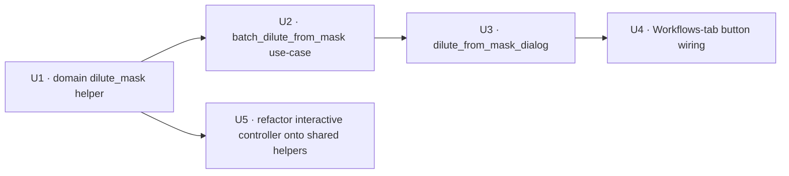

# feat: Dilute phase mask from mask (batch dilate + invert-within-cells)

## Overview

Add a new **batch** workflow tool, **"Dilute phase mask from mask"**, on the Workflows
sidebar tab — a button placed directly below the existing **"Dilute phase mask
generation"**. It opens a dialog that lets the user select multiple `.h5` files, pick a
**common existing mask name**, an **expansion radius (px)**, a **common cell
segmentation**, and an **output mask name**. For each file it computes a dilute-phase mask
by **dilating the existing mask by the radius and inverting it within the cell
boundaries**:

```
dilute_mask = (seg_labels > 0) AND NOT dilation(condensed_mask, disk(radius_px))
```

and writes it to `/masks/<output_name>`.

This is structurally the **phasor-masks batch triad** (the dialog + use-case I just
shipped) wrapped around the **dilution+invert math that already exists** in the
interactive dilute-phase workflow. There is no thresholding, no GT/QC loop, no iteration —
it operates on a mask that already exists on disk. Per-frame `(T,H,W)` time-lapse is
supported (this is the first true per-frame dilute — the existing interactive tool only
handles frame 0).

---

## Problem Frame

The existing **"Dilute phase mask generation"** is an *interactive single-dataset*
iterative workflow (recompute per-cell metric → Grouped-Threshold QC → dilate → NaN-
subtract → repeat) that builds a condensed mask from scratch and inverts it at the end.
That is the right tool when you don't yet have a condensed-phase mask.

But users frequently **already have** a condensed-phase mask (e.g. an adaptive-clip puncta
mask, a phasor-population mask, a thresholded mask) across **many** datasets and just want
the **dilute phase** = "in-cell pixels that aren't (near) the condensed phase," in batch,
with no interaction. Today they would have to run the interactive workflow per dataset and
re-derive a mask they already have. The new tool is the missing batch primitive: take an
existing mask + a segmentation, grow the mask by a margin (so the dilute phase excludes the
condensed-phase halo), invert within cells, write one new mask per file.

---

## Requirements Trace

- R1. **New "Dilute phase mask from mask" button** on the Workflows sidebar tab, placed
  **directly below** the "Dilute phase mask generation" button.
- R2. **A batch dialog** lets the user: add/select multiple `.h5` files; pick **one common
  mask name** present across the selected files; set an **expansion radius in px**; pick
  **one common cell segmentation** present across the files; and enter an **output mask
  name**.
- R3. **The dilute computation** per file is `(seg_labels > 0) AND NOT
  dilation(mask, disk(radius_px))`, written to `/masks/<output_name>` as `{0,1}` `uint8`.
  `radius_px == 0` means no dilation.
- R4. **Time-lapse `(T,H,W)` is supported per frame** (exact-`T`): when the mask or
  segmentation is time-stacked on a multi-timepoint dataset, dilate+invert each frame and
  write a `(T,H,W)` mask; a 2D input broadcasts across frames; single-timepoint (and
  all-2D-inputs) datasets write a 2D mask — byte-identical to a pure 2D op.
- R5. **Per-dataset error isolation + clear results.** A missing mask/segmentation, an
  output-name collision, or a bad file classifies *that dataset* (skipped/failed) without
  aborting the batch; a per-dataset summary is surfaced.
- R6. **The dialog is an Action.** It operates on off-session files and never mutates the
  five session selection fields per file; the only session touch is one end-of-run
  resource-list refresh **if** the currently-loaded dataset was in the batch.
- R7. **The dilation + invert-within-cells math is one pure-domain helper, not a third
  copy.** The new tool's morphology lives solely in `domain/segmentation/dilute_mask.py`
  (lifted from the interactive controller's expressions). Unifying the interactive
  controller *onto* that helper so the two cannot drift is an **optional follow-up (U5)**,
  not a v1 requirement of the new tool.

**Origin:** No upstream `ce-brainstorm` requirements doc for this batch variant. The
governing context is the existing interactive dilute-phase feature
([`docs/brainstorms/2026-05-18-dilute-phase-mask-requirements.md`](../brainstorms/2026-05-18-dilute-phase-mask-requirements.md),
[`docs/plans/2026-05-18-004-feat-dilute-phase-mask-generation-plan.md`](2026-05-18-004-feat-dilute-phase-mask-generation-plan.md))
and the phasor-masks batch triad
([`docs/plans/2026-06-28-001-...`](2026-06-28-001-feat-multitimepoint-perparticle-phasormasks-export-plan.md)).
Two scope decisions were resolved with the user during planning (D4, and CLI scope — see
[Key Technical Decisions](#key-technical-decisions)).

---

## Scope Boundaries

- **Non-goal: a headless CLI.** *(User-confirmed.)* GUI dialog only — no
  `percell4-batch-dilute-from-mask` console script. The batch use-case stays a pure,
  CLI-able function so a CLI can be added later, but no `interfaces/cli/` module or
  `pyproject.toml` `[project.scripts]` entry is created now.
- **Non-goal: building/deriving the condensed mask.** The tool consumes an *existing*
  `/masks/<name>`; it does no thresholding, Grouped-Threshold, QC, or iteration. That is
  the existing interactive "Dilute phase mask generation" workflow's job.
- **Non-goal: per-file output naming / templating.** One output name is applied to every
  selected file (collision-checked per file), mirroring the phasor batch's single suffix.
- **Non-goal: interactive preview / napari overlay during config.** This is a batch run
  over off-session files, like the phasor-masks dialog — no live preview layer.
- **Non-goal: editing `store.py`.** All needed store ops (`read_mask`/`read_labels`/
  `write_mask`/`list_groups`, the exact-`T` `_validate_layer_shape`) already exist.

### Deferred to Follow-Up Work

- **A headless CLI** (`percell4-batch-dilute-from-mask`) over the same use-case — deferred
  per the user's GUI-only decision; the use-case is written to make this a thin add later.
- **2D-time-invariant output optimization nuance:** when both inputs are 2D on a multi-t
  dataset, the tool writes a single 2D (broadcast) mask; if a future caller wants an
  explicit `(T,H,W)` even from all-2D inputs, that is a follow-up flag (not needed now).

---

## Context & Research

### The architecture: the phasor-masks triad as the template

| Layer | Phasor-masks exemplar (template) | New "dilute from mask" file |
|---|---|---|
| Pure domain op | `src/percell4/domain/segmentation/phasor_masks.py` | `src/percell4/domain/segmentation/dilute_mask.py` (new) |
| Batch use-case | `src/percell4/application/use_cases/batch_fit_phasor_masks.py` | `src/percell4/application/use_cases/batch_dilute_from_mask.py` (new) |
| Qt dialog | `src/percell4/gui/phasor_masks_dialog.py` | `src/percell4/gui/dilute_from_mask_dialog.py` (new) |
| Sidebar wiring | `src/percell4/interfaces/gui/main_window.py` `_create_workflows_panel` + `_on_open_*` | same two places (modify) |
| (CLI) | `src/percell4/interfaces/cli/batch_phasor_masks.py` | **deferred** (GUI-only) |

### Relevant code and patterns

- **The dilution + invert math (lift into the shared helper):**
  `src/percell4/gui/workflows/dilute_phase/controller.py` — invert-within-cells at
  `controller.py:238-239` (`in_cell = seg_labels > 0; dilute = in_cell & ~cumulative`),
  dilation at `controller.py:362-372`
  (`from skimage.morphology import dilation, disk; dilation(accepted, footprint=disk(radius))`,
  `radius <= 0` → no dilation). **`disk(radius)` ⇒ expansion px is the disk *radius*.**
- **The reusable writer:** `src/percell4/application/use_cases/accept_dilute_mask.py`
  `write_dilute_mask(repo, handle, name, mask)` (`:35-65`) — **requires a `bool` ndarray
  (ndim 2 or 3); it raises `ValueError` on a non-bool dtype, then casts to `uint8` and
  writes store-first.** It does NOT accept an arbitrary `uint8` / pre-binarized array — so
  the domain op must hand it a **bool** array (preserved through `np.stack`).
  `AcceptDiluteMask(..., batch_mode=True)` (`:68-118`) is the session-free Creator pattern.
- **The batch use-case shape:** `batch_fit_phasor_masks.py` `_process_one_dataset` —
  per-dataset open, per-resource presence + collision checks, per-dataset error isolation
  (never raises; returns a classified result), the time-lapse per-frame loop
  (`:571-691`), `np.stack` → `(T,H,W)` → exact-`T` `write_mask`.
- **The batch dialog shape:** `phasor_masks_dialog.py` — `_add_h5_paths` (file add/dedup
  by `.resolve()`, per-file resource discovery), cross-dataset name intersection
  (`_refresh_channel_picker` + `percell4.workflows.channels.intersect_channels`),
  output-name collision pre-filter, `_on_start_clicked` (run behind a modal
  `QProgressDialog`, summary `QMessageBox`), end-of-run `session.refresh_resource_lists`
  only when the loaded dataset was processed, the `orchestrator=` injection seam for tests,
  `QSettings("LeeLabPerCell4","PerCell4")` defaults, `gui/_dialog_utils.py`
  (`cap_to_screen`/`wrap_in_scroll`).
- **Store ops:** `store.list_groups("masks")` / `list_groups("labels")` (enumerate names),
  `read_mask(name, timepoint=)` / `read_labels(name, timepoint=)` (2D broadcast or
  `(T,H,W)` slice), `write_mask(name, array)` → `_validate_layer_shape` (exact-`T`:
  leading axis == `n_timepoints`, trailing dims == `native_shape`), `store.metadata`
  (`n_timepoints`, `channel_names`).
- **Sidebar host:** `main_window.py` `_create_workflows_panel` (~`:392-455`); the "Dilute
  phase mask generation" button at `:414-425` (insert the new button after `:425`, before
  the FLIM-FRET button); handler `_on_open_dilute_phase_workflow` (`:632-707`) to mirror;
  `is_workflow_locked` (`:1919`) / `set_workflow_locked` (`:1923`) re-entrance guard.

### Institutional learnings (gates)

- **`.../architecture-patterns/extending-per-cell-detection-to-time-lapse-2026-06-25.md`**
  — the per-timepoint contract for R4: keep the 2D op rank-agnostic, loop per frame, emit
  **exactly `T`** planes (empty frame → all-zero plane, never dropped), single-t
  byte-identical, `write_mask` validates leading axis == `n_timepoints`.
- **`.../architecture-patterns/creator-contract-four-step-sequence-2026-05-18.md`** +
  **`.../gui-action-contract-exhaustiveness.md`** — the on-disk write is the Creator act;
  the batch dialog is an **Action** over off-session files (no per-file session mutation).
- **`.../logic-errors/batch-compress-development-lessons.md`** +
  **`.../logic-errors/add-layer-flat-discovery-duplicate-import.md`** — the
  *discovery-scopes / processing-consumes* pitfall: resolve the common mask/seg name
  against **each dataset's own** `/masks` and `/labels` listing, never one shared set; and
  the write boundary owns binarization — here `write_dilute_mask` casts the **bool** result
  to `{0,1} uint8` (the tool passes bool, not a pre-binarized array).
- **`.../ui-bugs/add-mask-name-collision-image-layer-crash-2026-05-15.md`** +
  **`.../ui-bugs/napari-mask-layer-misclassified-as-segmentation.md`** — validate the
  **output-name collision** (against channels + masks + labels) up front; keep `/masks`
  (condensed/output) and `/labels` (segmentation) listings **distinct** in the pickers.
- **`.../architecture-patterns/sibling-dialog-extract-shared-widget-2026-05-12.md`** —
  when mirroring the phasor dialog, **reuse its widget construction** (don't rebuild from
  field values and drift).
- **`.../architecture-patterns/atomic-write-contract.md`** — `DatasetStore.write_mask` is
  already atomic/crash-safe; do not hand-roll a write path.
- **`.../tech-debt/threshold-qc-measurements-write-owned-by-controller.md`** — provenance
  invariant: write only `/masks` here; never `/measurements`.

### External references

None — every layer follows a strong, recently-touched in-repo pattern (the phasor-masks
triad and the interactive dilute workflow). No new library or external contract.

---

## Key Technical Decisions

- **D1 — Mirror the phasor-masks batch triad; reuse the dilute math.** New pure-domain op
  + batch use-case + dialog, structured exactly like the phasor-masks tool, wrapping the
  dilation+invert expressions already in the interactive dilute controller. Minimal new
  surface; everything follows a tested local pattern.
- **D2 — "Expansion px" is the disk *radius*** (matches `disk(radius_px)` at
  `controller.py:362-372`); `radius_px == 0` ⇒ no dilation. The dialog label says
  **"Expansion radius (px)"** to avoid a radius-vs-diameter 2× error.
- **D3 — Single source of truth for the morphology (R7).** Extract two pure helpers —
  `dilate_mask(mask, radius_px)` and `invert_within_cells(condensed, seg_labels)` — plus
  the composed `dilute_from_mask(...)`. The new tool uses them; the interactive controller
  is refactored onto the same helpers (U5), so batch and interactive stay byte-identical
  (a regression test pins the equality). *(Lifted from `controller.py`; existing dilute
  tests are the safety net.)*
- **D4 — Time-lapse: full per-frame `(T,H,W)` (*user-confirmed*).** Branch on
  `n_timepoints`: single-t (or both inputs 2D time-invariant) → one 2D op, write 2D;
  multi-t with a `(T,H,W)` mask or segmentation → loop `for t in range(n_timepoints)`,
  read each frame via `read_mask(timepoint=t)` / `read_labels(timepoint=t)` (a 2D input
  broadcasts), run the pure 2D op, `np.stack` → `(T,H,W)`, write via the exact-`T`
  `write_mask`. The per-frame loop lives in the **use-case** (the domain op stays 2D);
  empty frames yield all-zero planes, never dropped.
- **D5 — Action dialog, no CLI (*user-confirmed*).** GUI-only; the dialog never mutates the
  session per file. The only session touch is one end-of-run `refresh_resource_lists`
  when the loaded dataset was in the batch (the phasor pattern). The write reuses
  `write_dilute_mask`, which requires a **bool** array and casts to `uint8` itself (D2's
  `{0,1} uint8` is the on-disk result, not the type passed to the writer).
- **D6 — Per-dataset result taxonomy, with an empty-output signal.** Define a small
  dilute-specific result type (`DiluteItemResult{h5_path, status, message}` +
  `DiluteReport{items}`, status ∈ `processed | skipped | failed`) rather than reuse the
  phasor *per-channel* result (the dilute tool produces one output per dataset, not per
  channel). **An all-zero output (radius large enough to cover every in-cell pixel, a
  condensed mask that already fills its cells, or a segmentation with no cells) is still
  `processed` but its `message` is annotated** — e.g. "output empty: 0 in-cell dilute
  pixels (radius too large or condensed fills cells)" — so a degenerate batch is visible in
  the summary rather than silently reported as success. This mirrors the phasor batch's
  empty-plane warning. The dialog surfaces the annotation. *(A future generic batch-result
  consolidation across all batch tools is out of scope.)*
- **D7 — Common-name discovery is per-dataset.** The mask/seg pickers offer the
  **intersection** of names present in **every** selected file (each file inspected via its
  own `store.list_groups`); a file missing the chosen mask/seg is skipped per-dataset at
  run time (not silently mis-stacked).
- **D8 — Dilation is global, then clipped within cells (the existing-tool semantic).** The
  mask is dilated over the whole frame (`dilation(mask, disk(radius))`) and *then* `AND`-ed
  within `labels>0` — identical to the interactive controller (`controller.py:362-372` →
  `238-239`), so the two stay byte-identical (D3/R7). **Consequence to be aware of:**
  because the dilation is not per-cell-contained, a condensed blob in cell A near the A/B
  border grows across the border and removes dilute-phase pixels inside neighbor cell B.
  This matches the user's wording ("expand the mask … then invert within cell boundaries")
  and the existing tool. A per-cell-*contained* dilation is **out of scope** here (it would
  diverge from the interactive tool and break R7); if biologically required it is a
  separate decision for both tools. A U1 test pins the cross-cell behavior so it is
  deliberate, not accidental.

---

## Open Questions

### Resolved during planning

- Time-lapse handling → **full per-frame `(T,H,W)`** (User, D4).
- CLI → **GUI dialog only**, no console script (User, D5).
- Expansion semantics → **disk radius**, `0` = no dilation (D2, matches existing tool).
- Result/ summary shape → **per-dataset** status taxonomy (D6).
- Dilation containment → **global, then clipped within cells** (D8, matches the existing
  tool + the user's wording); the cross-cell halo consequence is documented + U1-tested. A
  per-cell-contained variant is out of scope (would diverge from the interactive tool).

### Deferred to implementation

- **Exact "is this input time-stacked?" query.** Whether to read the on-disk shape via a
  store shape helper (`masks_shape`/`labels_shape`/`is_time_stacked`) vs. infer from
  `n_timepoints` + a cheap shape read — resolve against the real store API at execution
  (the canonical discriminator is `n_timepoints`, never `array.ndim`).
- **Name-intersection helper reuse.** Whether `percell4.workflows.channels.intersect_channels`
  is directly reusable for mask/seg names or a tiny local set-intersection is cleaner —
  decide when wiring the dialog pickers.
- Exact widget layout / which phasor-dialog widgets are extracted vs. inlined (per the
  sibling-dialog learning) — resolved against the real `phasor_masks_dialog.py` at
  execution.

---

## High-Level Technical Design

> *This illustrates the intended approach and is directional guidance for review, not
> implementation specification. The implementing agent should treat it as context.*

**The pure 2D op (domain) and the per-frame loop (use-case):**

```
# domain/segmentation/dilute_mask.py  — pure, rank-2, numpy/skimage only
def dilate_mask(mask, radius_px):
    return dilation(mask.astype(bool), footprint=disk(radius_px)) if radius_px > 0 else mask.astype(bool)
def invert_within_cells(condensed, seg_labels):
    return (seg_labels > 0) & ~condensed.astype(bool)
def dilute_from_mask(condensed, seg_labels, radius_px):           # the composed op
    return invert_within_cells(dilate_mask(condensed, radius_px), seg_labels)

# application/use_cases/batch_dilute_from_mask.py  — per dataset
for h5 in files:
    # presence + collision checks → skip/fail this dataset, never raise
    if n_timepoints <= 1 or (mask and seg both stored 2D):
        out = dilute_from_mask(read_mask(mask_name), read_labels(seg_name), radius)   # 2D
    else:
        planes = [dilute_from_mask(read_mask(mask_name, timepoint=t),                  # per-frame
                                   read_labels(seg_name, timepoint=t), radius)
                  for t in range(n_timepoints)]
        out = np.stack(planes, axis=0)                                                 # (T,H,W), exact-T
    write_dilute_mask(repo, handle, out_name, out)     # out is bool; writer casts bool→uint8, store-first
```

**Unit dependency graph** (arrows = "must land first"):



---

## Implementation Units

- U1. **Pure-domain dilute-mask helper (`domain/segmentation/dilute_mask.py`)**

**Goal:** A pure, rank-2 helper that dilates a binary mask by a disk radius and inverts it
within cell labels — the single source of truth for the morphology (R7), reused by the new
tool and (U5) the interactive controller.

**Requirements:** R3, R4 (2D core), R7.

**Dependencies:** None.

**Files:**
- Create: `src/percell4/domain/segmentation/dilute_mask.py`
- Test: `tests/test_domain/test_dilute_mask.py`

**Approach:**
- `dilate_mask(mask, radius_px)` → `skimage.morphology.dilation(mask.astype(bool),
  footprint=disk(radius_px))` for `radius_px > 0`, else the bool mask unchanged — **lift
  the exact call from `controller.py:362-372`** (disk radius semantics, D2).
- `invert_within_cells(condensed, seg_labels)` → `(seg_labels > 0) & ~condensed.astype(bool)`
  (lift from `controller.py:238-239`).
- `dilute_from_mask(condensed, seg_labels, radius_px)` composes the two. **Returns a
  `bool` array** — this is the invariant the use-case must preserve through `np.stack`
  (the writer `write_dilute_mask` requires bool and casts to `uint8` itself; never hand it
  a pre-binarized `uint8`). `domain/` may import numpy/scipy/skimage (the import-linter
  forbids only qtpy/PyQt5/napari/h5py — skimage is allowed).
- **Raise a clear `ValueError` when `condensed.shape != seg_labels.shape`** (mirroring
  `phasor_masks.py`) so a mask/seg shape mismatch surfaces as a clear per-dataset reason in
  U2, not a raw numpy broadcast traceback.
- `dilute_from_mask` is the module's primary public function; `dilate_mask` /
  `invert_within_cells` are public so U5 (and the interactive controller) can reuse the
  exact expressions — if U5 is deferred they may instead stay module-internal.
- Keep it **rank-2 only** — the per-frame loop lives in the use-case (D4). Optionally
  provide a thin `dilute_from_mask_stack(condensed_thw, seg_thw, radius_px)` convenience
  that loops + `np.stack` for unit-testing the stacking contract directly (the use-case may
  use it or read per-frame and loop itself).

**Patterns to follow:** `domain/segmentation/phasor_masks.py` (module docstring, public
functions, `raise ValueError` on shape mismatch); the `dilation(disk(...))` /
`(labels>0) & ~x` expressions in `gui/workflows/dilute_phase/controller.py`.

**Test scenarios:**
- Happy path: a small filled square condensed mask + a 2-cell label image + radius 2 →
  result is `1` for in-cell pixels outside the dilated square, `0` on the dilated square,
  `0` outside all cells; assert specific coordinates.
- Edge case (`radius_px == 0`): `dilute_from_mask == (labels>0) & ~condensed` exactly (no
  growth).
- Edge case (empty condensed): result equals `labels > 0` (whole cell interiors).
- Edge case (condensed fills a cell): after dilation that cell is fully covered → that
  cell contributes zero pixels.
- Edge case (condensed spills outside cells): out-of-cell dilated pixels never appear in
  the output (output is `AND`-ed within `labels>0`).
- Edge case (cross-cell halo, D8): two adjacent cells A and B with a condensed blob in A
  near the A/B border and a radius spanning the gap → the dilation crosses into B and
  removes dilute pixels **inside B**; assert this explicitly so the global-dilation
  semantic is deliberate.
- Error path (shape mismatch): `dilute_from_mask` with `condensed.shape != seg_labels.shape`
  raises a clear `ValueError` (not a numpy broadcast error).
- Edge case (dtype): a `0/255` `uint8` condensed mask is treated as boolean (`>0`); output
  is `bool`; shape == input shape.
- Stack (if `_stack` provided): `(T,H,W)` inputs → `(T,H,W)` output, per-frame correct; a
  frame with an empty label plane → all-zero plane (exact-`T`, never dropped).

**Verification:** The composed expression matches the interactive controller's result on
the same inputs; `radius=0` is a pure invert-within-cells.

---

- U2. **Batch use-case (`application/use_cases/batch_dilute_from_mask.py`)**

**Goal:** Run the dilute-from-mask op over a list of `.h5` files with per-dataset isolation
and full per-frame time-lapse support, writing `/masks/<output_name>` per file and
returning a classified per-dataset report.

**Requirements:** R3, R4, R5, R7.

**Dependencies:** U1.

**Files:**
- Create: `src/percell4/application/use_cases/batch_dilute_from_mask.py`
- Test: `tests/test_application/test_batch_dilute_from_mask.py`

**Approach:**
- Signature (CLI-able, GUI drives it): `batch_dilute_from_mask(h5_paths, *, mask_name,
  segmentation_name, radius_px, output_name, progress_callback=None, cancel_check=None)
  -> DiluteReport`. Up-front validation (non-empty `output_name`, `radius_px >= 0`) before
  any I/O, mirroring `batch_fit_phasor_masks`'s validation block.
- Define `DiluteItemResult{h5_path, status, message}` and `DiluteReport{items}` (D6);
  `status ∈ {"processed","skipped","failed"}`. The loop **never raises** — a bad file
  becomes a `failed` item.
- Per dataset: open `DatasetStore`; presence-check `mask_name in list_groups("masks")` and
  `segmentation_name in list_groups("labels")` (skip with a clear reason if absent — D7);
  **collision-check** `output_name` against the dataset's channels + masks + labels (skip
  with "name collides …" — never overwrite an existing resource silently).
- Read `n_timepoints` from `store.metadata["n_timepoints"]` (the use-case is **session-free** —
  no `Session` needed; the canonical discriminator, never `array.ndim`). Detect whether the
  mask / segmentation are time-stacked via the store's shape helpers
  (`is_time_stacked` / `masks_shape` / `labels_shape` — no array load).
- Branch on `n_timepoints` (D4): single-t (or both inputs 2D) → one 2D `dilute_from_mask`,
  write 2D; multi-t with a time-stacked mask/seg → per-frame loop reading via
  `read_mask(timepoint=t)` / `read_labels(timepoint=t)`, `np.stack` → `(T,H,W)`. A
  mask/seg shape mismatch (U1's `ValueError`) routes to a clear `failed` reason; carry the
  phasor exemplar's defensive mis-stack pre-check (a resource whose leading axis ≠
  `n_timepoints`) so a corrupted file fails with a clear message, not a mid-loop
  `IndexError` (normally unreachable — `write_mask` enforces leading axis == `n_timepoints`).
- After computing `out`, **annotate an all-zero result** (`out.sum() == 0`) in the item
  `message` (D6) so a degenerate batch (radius too large / condensed fills cells / no cells)
  is visible; the item is still `processed`.
- Write via `write_dilute_mask(repo, handle, output_name, out)` — pass the **bool** `out`
  (the writer casts to `uint8` and writes store-first; do not pre-binarize). Reuse it; do
  not hand-roll a write path. Honor `cancel_check()` between datasets and
  `progress_callback(item)` after each.

**Execution note:** Add a failing end-to-end test first — synthetic `.h5` with
`/masks/condensed` + `/labels/cells` → run → assert `/masks/<out>` equals the expected
`(labels>0) & ~dilate(condensed)` — before wiring the loop.

**Patterns to follow:** `batch_fit_phasor_masks.py` (`_process_one_dataset`, per-dataset
isolation, time-lapse `:571-691` per-frame loop, presence/collision checks);
`accept_dilute_mask.py` `write_dilute_mask`.

**Test scenarios:**
- Happy path (single file, 2D): `/masks/condensed` + `/labels/cells`, radius 3 → writes
  `/masks/<out>` equal to the domain op's result; item `processed`.
- Happy path (multi-file): 3 files → 3 `processed` items, each with `/masks/<out>`.
- Time-lapse: `(T,H,W)` mask + `(T,H,W)` seg → `(T,H,W)` output, exact-`T`, per-frame
  correct; `(T,H,W)` mask + 2D seg → `(T,H,W)` output (seg broadcast); 2D mask + 2D seg on
  a multi-t dataset → 2D output (time-invariant); single-t → 2D output.
- Edge case (binarize): a `0/255` condensed mask → output is `{0,1}` `uint8`.
- Skip path (missing inputs): a file lacking `mask_name` → `skipped` "mask not present";
  lacking `segmentation_name` → `skipped` "segmentation not present"; other files still
  `processed`.
- Skip path (collision): `output_name` already exists as a channel/mask/label → `skipped`
  "name collides …"; the existing resource is untouched.
- Empty-output annotation (D6): a radius large enough to cover every in-cell pixel (or a
  zero-cell segmentation) → item is `processed` but its `message` flags the empty result
  (`out.sum() == 0`); other files unaffected.
- Error path (shape mismatch): a 2D mask and 2D segmentation stored at different `(H,W)` in
  the same dataset → `failed` with a clear "mask/segmentation shapes disagree" reason (U1's
  `ValueError` surfaced), not a numpy broadcast traceback.
- Error path (isolation): a missing/corrupt file → `failed` for that item; the batch
  continues and other files are processed.
- Edge case (`cancel_check` true) → the loop stops early; already-written files persist.
- Edge case (`radius_px == 0`) → pure invert-within-cells output.

**Verification:** Running over a folder of `.h5` files writes one dilute mask per file;
missing/colliding/bad files are classified, never crash the run; `(T,H,W)` masks load
correctly across the napari slider.

---

- U3. **Batch dialog (`gui/dilute_from_mask_dialog.py`)**

**Goal:** A modal Action dialog to select `.h5` files, pick the common mask + segmentation
names and expansion radius, enter the output name, run the use-case off the UI thread, and
summarize per-dataset results.

**Requirements:** R2, R5, R6.

**Dependencies:** U2.

**Files:**
- Create: `src/percell4/gui/dilute_from_mask_dialog.py`
- Test: `tests/test_gui/test_dilute_from_mask_dialog.py`

**Approach:**
- Mirror `PhasorMasksDialog`: file add/dedup by `.resolve()`; per-file resource discovery
  via `store.list_groups("masks")` and `store.list_groups("labels")`; a **mask-name combo**
  and a **segmentation combo** populated from the **intersection** across all selected
  files (D7); an **"Expansion radius (px)"** `QSpinBox` (range e.g. `0..50`, default `5`);
  an **output-name** `QLineEdit` with up-front collision validation (against channels +
  masks + labels across the queued files — surface a clear inline error, disable Start).
- **Reuse** the phasor dialog's widget construction / list-row / progress-and-summary
  scaffolding (per the sibling-dialog learning), not a from-scratch rebuild. Run the
  use-case behind a `Qt.WindowModal QProgressDialog` with `processEvents` for cancel; show
  a per-dataset summary `QMessageBox`. Expose an `orchestrator=batch_dilute_from_mask`
  kwarg so tests inject a stub.
- **Action discipline (R6):** dialog pickers are dialog-local config — **no** session
  mutation during configuration. After the run, call `session.refresh_resource_lists(...)`
  **only** if the currently-loaded dataset was one of the processed files (mirror the
  phasor dialog). `QSettings("LeeLabPerCell4","PerCell4")` persists field defaults;
  `gui/_dialog_utils.py` `cap_to_screen`/`wrap_in_scroll` for sizing.
- Start is disabled until: ≥1 file queued, a common mask name and segmentation exist, and
  the output name is non-empty and collision-free.

**Patterns to follow:** `gui/phasor_masks_dialog.py` (whole structure); `gui/_dialog_utils.py`;
the `orchestrator=` test seam; `docs/solutions/conventions/qt-wire-user-edit-signals-2026-05-12.md`
(drive real edit signals in tests).

**Test scenarios:**
- Happy path: add 3 files all sharing mask `condensed` + seg `cells` → both combos show
  the common names; set radius + output name → Start enabled → run (stubbed orchestrator)
  → summary lists 3 processed.
- Edge case (file dedup): adding the same path twice queues it once.
- Edge case (intersection): a mask name present in only some files is **not** offered;
  with no common mask name, Start is disabled with an explanatory message.
- Error path (collision): output name equals an existing channel/mask/label in a queued
  file → inline validation error, Start disabled.
- Edge case (radius label): the spinbox is labelled as a **radius** in px (D2), range
  enforced, default present.
- Integration (Action): configuring the dialog mutates **no** session field; after a run
  that includes the loaded dataset, exactly one `refresh_resource_lists` fires (assert via
  a spy/stub) — and none fires when the loaded dataset wasn't in the batch.

**Verification:** The dialog opens, lets the user configure a batch, runs it, and reports
results without touching session selection mid-config.

---

- U4. **Workflows-tab button + launch handler (`main_window.py`)**

**Goal:** Add the "Dilute phase mask from mask" button directly below "Dilute phase mask
generation" and wire it to open the dialog under the workflow-lock guard.

**Requirements:** R1.

**Dependencies:** U3.

**Files:**
- Modify: `src/percell4/interfaces/gui/main_window.py` (`_create_workflows_panel` — add the
  button after the existing dilute button at `~:425`; add `_on_open_dilute_from_mask_workflow`
  mirroring `_on_open_dilute_phase_workflow`)
- Test: `tests/test_gui/test_main_window_workflows.py` (or the existing main-window GUI test
  module — match where the existing Workflows-tab buttons are asserted)

**Approach:**
- Insert a `QPushButton("Dilute phase mask from mask")` immediately after the "Dilute phase
  mask generation" button's `layout.addWidget(...)` (R1 placement), with a tooltip.
- Handler `_on_open_dilute_from_mask_workflow`: the `if self.is_workflow_locked: return`
  re-entrance guard (mirror `_on_open_dilute_phase_workflow`), construct
  `DiluteFromMaskDialog`, show it modally; since this is a self-contained modal batch
  dialog (like the phasor-masks one), it does not need the long-lived
  `set_workflow_locked(True)` panel lifecycle — match whichever pattern the **phasor-masks**
  launch handler uses (modal dialog), not the interactive dilute panel's locked-panel
  lifecycle.

**Patterns to follow:** `main_window.py` `_on_open_dilute_phase_workflow` (the guard + the
construction) and the phasor-masks launch handler (modal-dialog lifecycle, not a locked
long-lived panel).

**Test scenarios:**
- Happy path: the Workflows panel contains a button labelled exactly "Dilute phase mask
  from mask", positioned immediately after "Dilute phase mask generation".
- Integration: clicking it (with no other workflow running) constructs/open the dialog;
  with a workflow locked, it no-ops with the standard status message.
- Edge case (backward compat): the existing Workflows buttons and their order are otherwise
  unchanged.

**Verification:** The new button appears in the right place and opens the dialog; existing
Workflows entries are unaffected.

---

- U5. **Refactor the interactive dilute controller onto the shared helpers (single source of truth)**

**Goal:** Replace the inline dilation + invert-within-cells expressions in the interactive
dilute-phase controller with calls to the U1 helpers, so batch and interactive share one
implementation (R7) and cannot drift.

**Requirements:** R7.

**Dependencies:** U1.

**Files:**
- Modify: `src/percell4/gui/workflows/dilute_phase/controller.py` (the dilation at
  `:362-372` → `dilate_mask(...)`; the final composition at `:238-239` →
  `invert_within_cells(...)`)
- Test: the existing dilute-phase controller tests are the regression net (find them under
  `tests/test_gui/` / `tests/test_application/test_accept_dilute_mask.py`); add an
  equality assertion if one isn't already pinning the composition.

**Approach:**
- Mechanically substitute the two inline expressions for the U1 helper calls — the helpers
  were lifted to be **byte-identical**, so behavior is unchanged. This is a low-risk DRY
  refactor; the existing interactive dilute tests (and AE-1..AE-5 from the origin
  requirements) are the safety net.
- Independently shippable: if scope must be trimmed, the new tool (U1–U4) works without
  this; U5 only removes the duplicate copy of the math.

**Execution note:** Characterization-first — confirm the existing dilute tests pass green
before and after; the diff must not change any test's expected mask.

**Test scenarios:**
- Regression: the full existing interactive dilute-phase test suite passes unchanged after
  the substitution.
- Equality: a test asserting the controller's per-round dilation and final composition
  equal `dilate_mask` / `invert_within_cells` on the same inputs (pins single-source-of-truth).

**Verification:** `controller.py` no longer contains its own `dilation(disk(...))` /
`(labels>0) & ~x` expressions; both paths route through `domain/segmentation/dilute_mask.py`;
interactive dilute behavior is unchanged.

---

## System-Wide Impact

- **Interaction graph:** U1 is leaf pure-domain. U2 touches the store read/write path
  (`read_mask`/`read_labels`/`write_mask` + `write_dilute_mask`). U3 adds a dialog; U4 adds
  one button + handler to `main_window.py`. U5 touches the existing interactive controller
  (regression-guarded). No cross-window signal changes; no new store API.
- **Error propagation:** per-dataset isolation in U2 (a bad file → `failed` item, batch
  continues); the dialog surfaces a summary. Nothing raises out of the batch loop.
- **State lifecycle risks:** the exact-`T` store contract on `(T,H,W)` writes (U2) — every
  stack must have exactly `n_timepoints` planes; tests target it. Output-name collision is
  pre-checked (U2 + U3) so a write never clobbers an existing channel/mask/label.
- **API surface parity:** the dialog is an Action like the phasor-masks dialog (no per-file
  session mutation; one conditional end-of-run refresh). The write reuses the existing
  `write_dilute_mask` Creator helper.
- **Integration coverage:** U2 mandates an end-to-end real-`.h5` test (write → re-read →
  assert mask); U3 mandates an Action-discipline test (no mid-config session mutation +
  conditional end-of-run refresh).
- **Unchanged invariants:** `store.py`, the interactive dilute *behavior* (U5 is
  byte-identical), the phasor-masks triad, and all five session fields' ownership rules are
  unchanged. No `/measurements` writes (provenance invariant).

---

## Risks & Dependencies

| Risk | Mitigation |
|------|------------|
| Radius-vs-diameter 2× error (user expects "expand by X" as a margin). | D2: expansion px == disk **radius**, matching the existing tool; dialog label says "radius"; U1 test pins the growth. |
| A `(T,H,W)` write with ≠ `n_timepoints` planes → `LayerSizeMismatchError`. | D4 + exact-`T` per-frame loop; U2 time-lapse scenarios assert exactly `T` planes incl. an empty/edge frame. |
| Output name collides with an existing channel/mask/label → napari load crash / silent clobber. | Up-front collision pre-check in U3 (disable Start) **and** U2 (skip with reason); never overwrite. |
| Common-name discovery drift (a shared listing instead of per-dataset). | D7: intersect each dataset's own `list_groups`; per-dataset presence check at run time. |
| Duplicate copies of the dilation/invert math drift over time. | D3 + U5: single source of truth in `domain/segmentation/dilute_mask.py`; equality regression test. |
| Mirroring the phasor dialog by rebuilding widgets introduces drift bugs. | Sibling-dialog learning: reuse the phasor dialog's widget construction, not field-derived rebuilds. |
| Global dilation bleeds across a cell border → removes dilute pixels in the neighbor cell, biasing its per-cell dilute measurement. | D8: documented as the intended global-halo semantic (matches the existing tool + the user's wording); a U1 test pins the cross-cell behavior so it is deliberate. A per-cell-contained variant is a separate decision (would diverge from the interactive tool). |
| A degenerate radius / cell-filling condensed mask / zero-cell segmentation yields an all-zero output reported as plain success. | D6: annotate `out.sum() == 0` in the per-dataset `message`; the dialog summary surfaces the empty count (mirrors the phasor empty-plane warning). |

---

## Documentation / Operational Notes

- Update the relevant per-module `CLAUDE.md` (current-state only): `src/percell4/gui/CLAUDE.md`
  (new `dilute_from_mask_dialog.py`), `src/percell4/domain/` (or
  `domain/segmentation`) for the new `dilute_mask.py`, and note the new use-case under
  `application/use_cases/`.
- After landing, capture the batch dilute + the **first true per-frame `(T,H,W)` dilute**
  with `/ce-compound` — it closes the frame-0-only gap noted in
  `gui/workflows/single_cell/dilute_queue.py`.
- No migration: purely additive; existing `.h5` files gain a new `/masks/<name>` only when
  the tool is run.

---

## Sources & References

- **Existing interactive dilute feature:**
  [`docs/brainstorms/2026-05-18-dilute-phase-mask-requirements.md`](../brainstorms/2026-05-18-dilute-phase-mask-requirements.md),
  [`docs/plans/2026-05-18-004-feat-dilute-phase-mask-generation-plan.md`](2026-05-18-004-feat-dilute-phase-mask-generation-plan.md);
  math in `src/percell4/gui/workflows/dilute_phase/controller.py`; writer
  `src/percell4/application/use_cases/accept_dilute_mask.py`.
- **Batch triad template:** `src/percell4/gui/phasor_masks_dialog.py`,
  `src/percell4/application/use_cases/batch_fit_phasor_masks.py`,
  `src/percell4/interfaces/cli/batch_phasor_masks.py` (CLI deferred).
- **Sidebar host:** `src/percell4/interfaces/gui/main_window.py` `_create_workflows_panel`.
- **Store ops:** `src/percell4/store.py` (`read_mask`, `read_labels`, `write_mask`,
  `list_groups`, `_validate_layer_shape`).
- **Learnings:**
  `docs/solutions/architecture-patterns/extending-per-cell-detection-to-time-lapse-2026-06-25.md`,
  `docs/solutions/architecture-patterns/creator-contract-four-step-sequence-2026-05-18.md`,
  `docs/solutions/architecture-patterns/gui-action-contract-exhaustiveness.md`,
  `docs/solutions/architecture-patterns/sibling-dialog-extract-shared-widget-2026-05-12.md`,
  `docs/solutions/logic-errors/add-layer-flat-discovery-duplicate-import.md`,
  `docs/solutions/ui-bugs/add-mask-name-collision-image-layer-crash-2026-05-15.md`.
