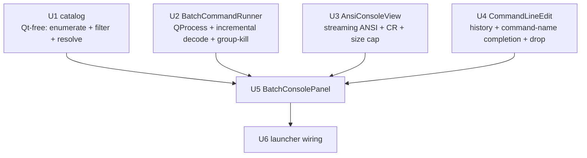

# feat: Batch Tools Console

## Overview

Add an in-app command console to the PerCell4 launcher for running the catalog of
`percell4-*` batch CLI tools without leaving the GUI. The user types a batch-tool
invocation exactly as in a terminal (command name, flags, file paths), runs it inside
the project venv, and watches its output stream live — with ANSI color rendering, `\r`
progress-bar handling, command history, command-name tab-completion, a catalog dropdown,
a `Show --help` action, and a cancel button. It is a scoped command console for the
catalog, **not** a PTY or a general shell.

The work is a new dedicated sidebar tab plus a small set of net-new GUI primitives (a
`QProcess`-backed runner, an ANSI/`\r` console view, a history/completion command input)
and a Qt-free catalog module. Nothing in the existing launcher shell, panels, or CLIs
changes behaviorally.

---

## Problem Frame

The `percell4-*` console commands (declared in `pyproject.toml` `[project.scripts]` —
**12 declared**) are the only way to run a *single* batch task in isolation — e.g. just
segmentation + tracking via `percell4-batch-cellpose-laptrack`, rather than a full
multi-step Workflow. Running one today means leaving the GUI: quit the app, or open a new
terminal, `cd ~/percell4`, and activate the venv. That context switch is pure friction for
a routine task. The launcher already surfaces multi-step *Workflows* as dialogs but has no
home for the raw single-task catalog. See origin:
`docs/brainstorms/2026-07-02-batch-tools-console-requirements.md`.

> Note on catalog count: `importlib.metadata` currently returns **14** `percell4-` console
> scripts, but two (`percell4-per-cell-sweep`, `percell4-window-k-sweep`) are **stale
> installed metadata pointing at deleted modules**. The catalog must filter to importable
> entries (U1), so the console lists 12, not 14.

---

## Requirements Trace

- R1. Command input where the user types a full invocation (command + flags + paths) and runs it with Enter or a Run button. → U4, U5
- R2. Commands execute inside the project venv without manual activation. → U1, U2
- R3. Commands run from a defined working directory (default: repo root); absolute paths supported. → U2, U5
- R4. GUI stays fully responsive during a run. → U2
- R5. One command at a time; Run unavailable while a command runs. → U5
- R6. A running command can be cancelled (process terminated). → U2, U5
- R7. stdout+stderr stream into a scrollable output area live. → U2, U3, U5
- R8. ANSI color escape codes render as color. → U3
- R9. `\r` progress updates overwrite the current line in place (no log flooding). → U3
- R10. Completion clearly shows exit status (success vs non-zero). → U5
- R11. Command history recall/edit with Up/Down. → U4
- R12. Tab-completion for tool names (first token). (Filesystem path completion deferred to follow-up — drag-drop covers path insertion; see Scope Boundaries.) → U4
- R13. Files/folders dragged onto the input insert their path at the cursor. → U4
- R14. Catalog control lists importable `percell4-*` tools, auto-derived from declared console scripts. → U1, U5
- R15. Selecting a catalog tool inserts its command name into the input. → U5
- R16. A "Show --help" action runs the selected tool's `--help` in the output area. → U1, U2, U5
- R17. The console is a persistent launcher panel. → U6
- R18. Output accumulates across runs as a scrollable, size-bounded log; a clear action exists. → U3, U5

**Origin flows:** F1 (run a single batch tool), F2 (look up a tool's options), F3 (cancel or re-run)
**Origin acceptance examples:** AE1 (covers R2, R3 — venv + cwd parity), AE2 (covers R9 — `\r` no flood), AE3 (covers R4, R6 — responsive + cancel)

---

## Scope Boundaries

- Not a full interactive terminal: no interactive prompts (`y/N`), no PTY, no curses/full-screen TUIs. The console closes the child's stdin so a hypothetical prompting tool hits EOF and aborts rather than hanging.
- Not a general shell: no pipes, redirects, globbing, env-var expansion, `cd`, or shell builtins. An unknown/non-`percell4-` `argv[0]` is rejected with a console message, not executed. This bounds executable *identity*, not side effects (see Key Technical Decisions).
- `scripts/*.py` (per_particle_analysis, gen_puncta_masks, …) are out of scope; the catalog is the importable `percell4-*` console entry points only.
- No auto-generated argument forms and no per-tool GUI wrappers — typed commands only.
- No job queue or parallel runs.

### Deferred to Follow-Up Work

- Filesystem path tab-completion (mid-line token extraction + `QFileSystemModel`). v1 is command-name completion + drag-drop.
- A surgical, non-resetting dataset refresh that preserves selection/filter/active resources after an auto-reload (v1 uses a full re-open — see U6).
- Process-group / GPU-verified cancel hardening beyond best-effort group kill (see U2, Risks).
- A console-vs-Workflow mutual-exclusion guard (deferred; corruption-safe only while HDF5 file locking stays enabled — see System-Wide Impact).
- Surfacing each tool's `--dry-run` affordance for destructive catalog tools (`batch-delete`, `batch-rename`).

---

## Context & Research

### Relevant Code and Patterns

- **Sidebar registration** — `src/percell4/interfaces/gui/main_window.py`: the `categories` list (~line 204) of `(display_name, factory_method)` tuples drives sidebar order via an `enumerate` loop (~215); indices are dynamic (only `_on_sidebar_click(0)` is hardcoded), so inserting a tab is safe. Adding a tab = one tuple + one `_create_*_panel()` factory.
- **Task-panel construction (callback injection)** — `src/percell4/interfaces/gui/task_panels/io_panel.py` (`IoPanel`, keyword-only `Callable` params + `show_status=lambda _: None` default + `_build_ui()`). Governing convention: `docs/solutions/architecture-decisions/decouple-task-panels-callback-injection.md` (p1) — no `launcher=self`, no reaching into launcher privates, panel must instantiate headless in tests.
- **`_build_ui()` shape** — `QVBoxLayout(self)`, `setAlignment(Qt.AlignTop)`, margins 20, spacing 10, first widget `theme.section_label("<Title>")`, `QGroupBox` groups, trailing `addStretch()`. **The console panel deliberately deviates** (see U5 layout note): the streaming view needs `stretch=1` and manages its own scroll.
- **Off-UI-thread precedent** — `src/percell4/gui/workers.py` `Worker(QThread)` (cooperative abort only, no kill primitive). Not reused — `QProcess` supersedes it for child processes — but it is the established "keep long work off the UI thread" idiom.
- **Workflow single-run lock idiom** — `main_window.py` `is_workflow_locked` / `set_workflow_locked` / `show_workflow_status` (~1955–1988). The console uses a *lighter* local guard (disable its own Run button) so the rest of the app stays usable during a run.
- **Only existing log widget** — `src/percell4/gui/batch_tcspc_dialog.py` `QPlainTextEdit` (read-only, static). Mirror its read-only styling; streaming/append/ANSI/`\r`/size-cap behavior is net-new.
- **CLI shape** — `src/percell4/interfaces/cli/*.py`: uniform `def main(argv: list[str] | None = None) -> int:`, parser built inline (no `build_parser()`), `prog=` hardcoded, and `if __name__ == "__main__": sys.exit(main())` (verified present on all 12 real modules). `Show --help` runs the tool with `--help` as a subprocess.
- **Load / reload path** — `main_window.py`: `_current_h5_path` (set ~1186), `_load_h5_into_viewer` (~1171), `_populate_viewer_from_store` (~1213), `_update_data_tab_from_store` (~1472, refreshes seg/mask combos). `_load_h5_into_viewer → session.set_dataset()` (`src/percell4/application/session.py` ~196–213) **blanks `_measurements`, resets selection/filter/active_*/bin/timepoint, and re-shows the viewer** — see U6 for the required measurements re-read.
- **Theme** — `src/percell4/gui/theme.py`: `section_label(text)`; `BACKGROUND_DEEP`, `SURFACE`, `BORDER`, `ACCENT`, `TEXT`, `TEXT_MUTED`, and `SUCCESS`/`WARNING`/`ERROR` (ANSI green/yellow/red mapping). Widgets are globally styled by `APP_STYLESHEET`. No monospace font exists — introduce one via `QFontDatabase.systemFont(QFontDatabase.FixedFont)`.

### Institutional Learnings

- **Never touch the GUI from a background thread** (`docs/solutions/architecture-decisions/percell4-code-review-findings-phases-0-6.md`, Issue #3). Drives `QProcess` (async, main-thread `readyRead*`/`finished`) over `subprocess.Popen` in a thread. Do **not** copy the `QApplication.processEvents()` pumping from `main_window._populate_parallel`.
- **Task-panel decoupling** (`docs/solutions/architecture-decisions/decouple-task-panels-callback-injection.md`, p1).
- **In-session HDF5 staleness** (`docs/solutions/logic-errors/in-session-hdf5-staleness-multi-vector-2026-04-30.md`, high). A batch subprocess writing the open `.h5` leaves the GUI stale across 5 cache vectors; a fresh re-open is *necessary but not sufficient* (its vector 3 = the parent process's HDF5 metadata cache), and it mandates a post-reload read-back to prove freshness — see U6 test.
- **Selector/Creator/Action contract** (`docs/solutions/architecture-patterns/gui-action-contract-exhaustiveness.md`; `applies_to: src/percell4/interfaces/gui/**/*.py`). The panel's own controls are **Actions** and never write the five session fields directly. (The injected reload callback *does* reset session state via the launcher's load path — that is the launcher's Selector-equivalent load flow, not the panel writing session; see System-Wide Impact.)
- **Prior batch-tool front-end lessons** (`docs/solutions/logic-errors/batch-compress-development-lessons.md`). Surface the catalog + `--help` rather than a blank prompt; keep the immutable catalog separate from mutable per-invocation input.

### External References

- None. Standard Qt/Python patterns (`QProcess`, `QCompleter`, `importlib.metadata`, ANSI SGR parsing, incremental UTF-8 decode) with clear local idioms to extend; external research skipped.

---

## Key Technical Decisions

- **Execute via `[sys.executable, "-m", <module>] + args`, no shell** (resolves origin Q1). Running through the GUI's own interpreter guarantees the same venv independent of `PATH`, and avoids reintroducing out-of-scope shell features. Each CLI's hardcoded `prog=` keeps `--help`/errors showing the real command name. **Caveat:** `-m` depends on the module's `if __name__ == "__main__"` guard (present on all 12 today); a guard-independent `-c "from <module> import main; sys.exit(main())"` form is a deferred hardening if a future CLI drops the guard.
- **`QProcess` with `MergedChannels`** over subprocess-in-a-thread. Async, main-thread signals (thread-safety learning), responsive UI, and correct stdout/stderr interleaving. Cancel = best-effort **process-group** `terminate()` then `kill()` on a short timeout (so torch/Cellpose worker grandchildren are reaped, not orphaned). Child **stdin is closed** so a non-interactive assumption fails safe.
- **Catalog via `importlib.metadata.entry_points(group="console_scripts")`, filtered to `percell4-` AND validated by `importlib.util.find_spec(module)`** (resolves origin Q4). The importability filter drops stale phantom entries (installed metadata drifted 14→2-phantom while source declares 12); guard the **empty-selection** case (this query returns `[]` on no match — it does *not* raise `PackageNotFoundError`). Reflects installed reality, validated by importability, no hand-maintained registry.
- **Scoped to the catalog, not arbitrary shell.** A typed `argv[0]` that is not a known importable `percell4-` entry point is rejected with a console message. **This bounds executable *identity*, not *effect*:** the catalog ships destructive tools (`batch-delete`, `batch-rename`) that run un-confirmed against typed paths. Surfacing their `--dry-run` is deferred.
- **Open-dataset handling** (per user decision — keep auto-reload, made correct): on a **successful** run whose resolved args reference the currently-open dataset (realpath equality **or** directory-containment), call an injected reload. Because HDF5 file locking makes the child's write **fail** while the GUI holds the file open, this is paired with **mandatory lock-error rendering** (legible message, no reload on failure). The reload is a **full re-open** that must also re-read measurements (the base load path blanks them); a non-resetting surgical refresh is deferred.
- **Dedicated "Batch Tools" sidebar tab** (resolves origin Q5), placed after "Workflows"; the panel is added to the content stack **directly** (not `_wrap_in_scroll`-ed) so the console manages its own scroll.
- **All console components live in `task_panels/`** (catalog module in `interfaces/cli/`). No new `widgets/` package — YAGNI, since neither the ANSI view nor the command input has a second consumer today, and the equally-generic runner already lives in `task_panels/`.

---

## Open Questions

### Resolved During Planning

- Backend execution (origin Q1): `sys.executable -m <module>` argv exec, no shell.
- ANSI + `\r` rendering (origin Q2): custom `QPlainTextEdit` subclass; SGR → theme-color mapping; `\r` line-overwrite; `MergedChannels`; `setMaximumBlockCount` size cap; parse core is a pure function.
- Tab-completion (origin Q3): **command-name completion only for v1** (first token vs injected catalog names); filesystem path completion deferred.
- Catalog enumeration (origin Q4): `entry_points(group="console_scripts")` filtered `percell4-` + `find_spec` importability check; guard empty selection.
- Placement (origin Q5): dedicated "Batch Tools" sidebar tab, added to the stack directly.

### Deferred to Implementation

- Exact SGR subset — basic 8/16-color foreground + reset + bold is sufficient; 256-color/truecolor optional.
- Staleness detection granularity — start with `os.path.realpath()` equality plus directory-containment (does a resolved arg equal, or contain the directory of, the open `.h5`?), resolving relative args against the run cwd.
- Ring-buffer block-count `N` for the console view.
- Whether to force color for piped output (`FORCE_COLOR`) — default off; render color when a tool emits it.

---

## Output Structure

    src/percell4/interfaces/
    ├── cli/
    │   └── catalog.py                      # NEW — Qt-free: enumerate + importability filter + resolve
    └── gui/
        ├── task_panels/
        │   ├── ansi_console_view.py        # NEW — AnsiConsoleView (streaming, ANSI + \r, size-capped) + pure parse helper
        │   ├── command_line_edit.py        # NEW — CommandLineEdit (history, command-name completion, drag-drop)
        │   ├── batch_command_runner.py     # NEW — BatchCommandRunner (QProcess wrapper, incremental decode, group-kill)
        │   └── batch_console_panel.py      # NEW — BatchConsolePanel (assembles the above)
        └── main_window.py                  # MODIFIED — register the "Batch Tools" tab + measurements-aware reload hook

---

## High-Level Technical Design

> *This illustrates the intended approach and is directional guidance for review, not implementation specification. The implementing agent should treat it as context, not code to reproduce.*

Dependency shape (four independent primitives converge into the panel, then the launcher):



Run-a-command flow (F1 / AE1 / AE3), including the lock-error and success-gated-reload paths:

```mermaid
sequenceDiagram
    participant User
    participant Input as CommandLineEdit (U4)
    participant Panel as BatchConsolePanel (U5)
    participant Cat as catalog (U1)
    participant Run as BatchCommandRunner (U2)
    participant View as AnsiConsoleView (U3)
    User->>Input: types command, Enter
    Input->>Panel: command_submitted(str)
    Panel->>Cat: resolve(line)
    alt parse error / unknown percell4- command
        Cat-->>Panel: CommandParseError / UnknownCommand
        Panel->>View: append themed error line (no process spawned)
    else known + importable
        Cat-->>Panel: [sys.executable, -m, module, ...args]
        Panel->>Panel: disable Run, enable Cancel; show_status("Running …")
        Panel->>Run: run(argv, cwd)  (stdin closed)
        loop while running (main-thread signals)
            Run-->>View: output(chunk) → incremental decode → parse ANSI/\r → autoscroll (capped)
        end
        Run-->>Panel: finished(exit_code) or cancelled
        alt cancelled
            Panel->>View: "Cancelled" (WARNING)
        else lock error (errno-35 signature)
            Panel->>View: "<file> is locked — close the open dataset" (ERROR)
        else exit 0
            Panel->>View: "[Done] Exit 0 (mm:ss)" (SUCCESS)
            Panel->>Panel: if args referenced open .h5 → reload_open_dataset()
        else non-zero
            Panel->>View: "[Error] Exit N" (ERROR)
        end
        Panel->>Panel: re-enable Run; show_status(summary)
    end
```

---

## Implementation Units

- U1. **CLI catalog module (Qt-free)**

**Goal:** Enumerate the importable `percell4-*` console-script catalog and resolve a typed command line into an executable argv, with no Qt dependency.

**Requirements:** R2, R14, R16

**Dependencies:** None

**Files:**
- Create: `src/percell4/interfaces/cli/catalog.py`
- Test: `tests/test_cli_catalog.py`

**Approach:**
- `list_batch_tools()` → sorted entries (name + resolved module + optional one-line summary), from `importlib.metadata.entry_points(group="console_scripts")`, filtered `name.startswith("percell4-")` **and** `importlib.util.find_spec(module) is not None` (drops phantom/uninstalled entries). Guard the empty-selection case (no `PackageNotFoundError` from this query).
- `resolve_command(line: str) -> list[str]` → `shlex.split(line, posix=True)` wrapped in `try/except ValueError` (unbalanced quotes) raising a typed `CommandParseError`; look up `argv[0]` in the catalog; return `[sys.executable, "-m", <module>] + argv[1:]`; raise `UnknownCommand(name)` when `argv[0]` is not an importable catalog entry, and for empty/whitespace input.
- Keep the module Qt-free **by convention** (no import-linter contract covers `percell4.interfaces` today; a `forbidden` contract on `percell4.interfaces.cli.catalog` could enforce it if desired).

**Execution note:** Implement the pure `resolve_command`/enumeration logic test-first.

**Patterns to follow:** guarded `importlib.metadata` usage in `src/percell4/application/analysis/run_folder.py`.

**Test scenarios:**
- Happy path: `list_batch_tools()` includes `percell4-batch-cellpose-laptrack → percell4.interfaces.cli.batch_process`; every entry starts with `percell4-` **and** its module resolves via `find_spec`.
- Edge case (phantom exclusion): an entry whose module is not importable (e.g. `percell4-per-cell-sweep`) is **excluded** — assert on importability, not a fixed count (the count flips 14→12 after any reinstall).
- Covers AE1. Happy path: `resolve_command("percell4-batch-cellpose-laptrack ./exp1 --seg-channel 0 --gpu")` → `[sys.executable, "-m", "percell4.interfaces.cli.batch_process", "./exp1", "--seg-channel", "0", "--gpu"]`.
- Edge case: quoted path with spaces (`"/a b/exp.h5"`) resolves to a single argv token.
- Error path: `resolve_command("ls -la")` → `UnknownCommand("ls")`; `""`/whitespace → `UnknownCommand`/empty error; `'percell4-batch-export "unclosed'` → `CommandParseError` (not an uncaught `ValueError`).
- Edge case: `percell4-gui` (a `gui_scripts` entry) is not present.

---

- U2. **QProcess command runner**

**Goal:** Run an argv as a child process, streaming correctly-decoded merged output live on the main thread, cancellable via a process-group kill, without freezing the GUI.

**Requirements:** R2, R3, R4, R6, R7

**Dependencies:** None

**Files:**
- Create: `src/percell4/interfaces/gui/task_panels/batch_command_runner.py`
- Test: `tests/test_gui/test_batch_command_runner.py`

**Approach:**
- `BatchCommandRunner(QObject)` with signals `started()`, `output(str)`, `finished(int)`, `cancelled()` and an `is_running` property.
- `run(argv, cwd)` — construct a `QProcess`, `setProcessChannelMode(MergedChannels)`, set working directory (default repo root / process cwd; absolute paths honored), **close the write channel to the child's stdin** (EOF for any prompt), connect `readyReadStandardOutput` → read bytes → feed a **stateful `codecs.getincrementaldecoder("utf-8")("replace")`** held on the runner (buffers partial multibyte codepoints across chunk boundaries) → emit `output(str)`; connect `finished` → emit `finished(exit_code)`. Launch the child in its **own process group** (e.g. `setsid`) so cancel can reap grandchildren. Do not use `QApplication.processEvents()`.
- `cancel()` — set a cancelling flag, emit `cancelled()`, signal the process group (`terminate()` → `kill()` after a short timeout).
- Refuse to start a second run while one is active.

**Patterns to follow:** signal-based main-thread delivery per `percell4-code-review-findings-phases-0-6.md` Issue #3; hold a strong ref to the `QProcess`.

**Test scenarios:**
- Happy path (qtbot `waitSignal`): `run([sys.executable, "-c", "print('hi')"], cwd)` emits `output` containing `hi` then `finished(0)`.
- Covers AE3. Cancel path: `run([sys.executable, "-c", "import time; time.sleep(30)"])` then `cancel()` → `cancelled` fires and `finished` follows promptly; `is_running` returns to False.
- Edge case (multibyte split): feeding the decoder two byte chunks that split a 3-byte glyph (e.g. `█`) across the boundary yields the correct character, not replacement litter.
- Edge case: non-zero exit (`-c "import sys; sys.exit(3)"`) surfaces `finished(3)`.

---

- U3. **ANSI + carriage-return console view (size-capped)**

**Goal:** A read-only streaming log widget that renders ANSI SGR colors, treats `\r` as an in-place line overwrite, and is bounded in size so long/newline-mode runs can't exhaust memory.

**Requirements:** R7, R8, R9, R18

**Dependencies:** None

**Files:**
- Create: `src/percell4/interfaces/gui/task_panels/ansi_console_view.py`
- Test: `tests/test_gui/test_ansi_console_view.py`

**Approach:**
- A pure parse helper (module-level function) converts an incoming *text* chunk into render ops (text + SGR style, line-overwrite vs append), buffering an incomplete escape sequence or trailing partial line across calls. This is the testable core. (Byte-level partial-codepoint buffering is U2's incremental decoder — the helper receives already-decoded text.)
- `AnsiConsoleView(QPlainTextEdit)` — read-only, monospace (`QFontDatabase.systemFont(FixedFont)`), themed background; `setMaximumBlockCount(N)` for ring-buffer bounding; `append_output(text)` applies ops via a `QTextCursor` (color via char format → `theme.SUCCESS`/`WARNING`/`ERROR`/`TEXT`; `\r` selects to line start and replaces). Autoscroll to bottom unless the user has scrolled up. Text is selectable/copyable. `clear_output()` empties it.
- Support basic 8/16-color foreground SGR + reset + bold; ignore unsupported codes.

**Execution note:** Implement the pure parse helper test-first.

**Patterns to follow:** read-only `QPlainTextEdit` styling from `src/percell4/gui/batch_tcspc_dialog.py`; theme constants from `src/percell4/gui/theme.py`.

**Test scenarios (parse helper / widget):**
- Covers AE2. `"working... 10%\rworking... 50%\rworking... 100%\n"` yields a single visible line ending at `100%`, not three appended lines.
- Happy path: `"\x1b[32mOK\x1b[0m done"` renders `OK` in the success color, `done` default.
- Edge case: an escape split across chunks (`"\x1b[3"` then `"2mOK\x1b[0m"`) buffers and renders correctly.
- Edge case: bare `\n` appends; unsupported SGR (`\x1b[38;5;200m`) is skipped without emitting literal escape text.
- Edge case (bound): appending more than `N` blocks drops the oldest (document stays bounded); `clear_output()` empties.
- Integration: two `append_output` calls accumulate (R18).

---

- U4. **Command input line edit**

**Goal:** A single-line command input with terminal-style history, command-name tab-completion, and drag-drop path insertion.

**Requirements:** R1, R11, R12, R13, R15

**Dependencies:** None (catalog names injected as a list, keeping the widget generic)

**Files:**
- Create: `src/percell4/interfaces/gui/task_panels/command_line_edit.py`
- Test: `tests/test_gui/test_command_line_edit.py`

**Approach:**
- `CommandLineEdit(QLineEdit)` emits `command_submitted(str)` on `returnPressed`, recording non-empty submissions into an in-memory history list.
- Up/Down traverse history (index reset on new submission). An injected `completions: list[str]` backs a `QCompleter` for the **first token** (command names); `set_completions(names)` refreshes it. **No filesystem path completion in v1** (deferred).
- `dragEnterEvent`/`dropEvent` accept file/dir URLs and insert their path at the cursor.
- `insert_command(name)` seeds the command name from the catalog dropdown (R15).

**Patterns to follow:** globally-themed `QLineEdit` from `src/percell4/gui/theme.py`.

**Test scenarios (qtbot):**
- Happy path: text + Enter emits `command_submitted` and appends to history.
- Happy path: after two submissions, Up recalls most-recent then earlier; Down walks back toward the empty prompt.
- Edge case: empty/whitespace on Enter does not emit and is not recorded.
- Happy path: `insert_command("percell4-batch-export")` sets the field text (R15); first-token completion offers catalog names.
- Integration: a drop event carrying a file URL inserts that path at the cursor (R13).

---

- U5. **Batch console panel**

**Goal:** Assemble the catalog dropdown, `Show --help`, command input, console view, and Run/Cancel/Clear into a decoupled Action-class panel that runs one command at a time, renders all terminal states legibly, and reloads the open dataset after a successful run that targeted it.

**Requirements:** R1, R3, R5, R6, R7, R10, R14, R15, R16, R18

**Dependencies:** U1, U2, U3, U4

**Files:**
- Create: `src/percell4/interfaces/gui/task_panels/batch_console_panel.py`
- Test: `tests/test_gui/test_batch_console_panel.py`

**Approach:**
- `BatchConsolePanel(QWidget)` — keyword-only callback injection: `get_open_h5_path: Callable[[], str | None] = lambda: None`, `reload_open_dataset: Callable[[], None] = lambda: None`, `show_status: Callable[[str], None] = lambda _: None`, `runner: BatchCommandRunner | None = None` (default-constructed if None; a test seam), `parent=None`.
- **Layout (deliberate deviation):** `section_label("Batch Tools")`; a top row `QComboBox` (populated from `list_batch_tools()`, each item shown as `<name> — <summary>` when a summary exists, else `<name>`) + `Show --help`; the `AnsiConsoleView` added with **`stretch=1`** (no `setAlignment(Qt.AlignTop)`, no trailing `addStretch()`); a bottom row `CommandLineEdit` + Run + Cancel + Clear. The U6 factory adds this panel to the content stack **directly** (not `_wrap_in_scroll`).
- **Initial state:** the console shows placeholder text ("No output yet — pick a tool or type a `percell4-*` command") in `theme.TEXT_MUTED`; the first catalog entry is selected with its name inserted into the input; keyboard focus is on the input.
- **Run/Enter** → `resolve_command` (U1). On `CommandParseError`/`UnknownCommand`, print a themed `ERROR` line (e.g. `"[Error] 'ls' is not a percell4-* batch tool — pick from the catalog or type a percell4-* command."`) and do **not** spawn. Otherwise disable Run / enable Cancel, `show_status("Running <tool>…")`, `runner.run(argv, cwd)`.
- **Streaming/termination:** `runner.output → view.append_output`. On `runner.cancelled` → append `"Cancelled"` in `theme.WARNING`. On `runner.finished(code)`: exit 0 → `"[Done] Exit 0 (mm:ss)"` in `SUCCESS`; non-zero → `"[Error] Exit N"` in `ERROR`; if the output/exit matches an **HDF5 lock-error signature** (errno 35 / "unable to lock file") → `"[Error] <file> is locked — the GUI has this dataset open. Close it and retry."` in `ERROR`. Always re-enable Run and update `show_status`.
- **Open-dataset reload (success-gated):** before running, if any resolved arg realpath-equals or directory-contains `get_open_h5_path()`, show a non-blocking pre-run note. On `finished(0)` **and** that reference held, call `reload_open_dataset()`. Never reload on failure/lock error.
- **Show --help** resolves the selected tool and runs it with `--help` via the same runner (R16). **Clear** (`view.clear_output()`) is enabled at all times, including during a run.
- Single-run guard at the UI level (R5). **Action-class:** the panel never writes the five session fields; dataset reload is delegated to the injected launcher callback.

**Patterns to follow:** `src/percell4/interfaces/gui/task_panels/io_panel.py`; decoupling rules in `docs/solutions/architecture-decisions/decouple-task-panels-callback-injection.md`.

**Test scenarios (qtbot, headless with mock callbacks / injected fake runner):**
- Happy path: panel instantiates headless with all-default callbacks (no parent window, no launcher import); initial state shows the placeholder + focused input.
- Error path (scope guard): submitting `ls -la` prints an `ERROR` line and the injected runner's `run` is never called; an unbalanced-quote line likewise shows an error and does not spawn.
- Covers AE1. Happy path: submitting a known command calls the runner with argv head `[sys.executable, "-m", "percell4.interfaces.cli.batch_process", ...]`; Run disabled during the run, re-enabled on `finished`; Clear stays enabled throughout.
- State rendering: a simulated `cancelled` shows "Cancelled" (WARNING); a simulated lock-error `finished` shows the locked-file message and does **not** call `reload_open_dataset`.
- Happy path: `Show --help` invokes the runner with a `--help` argv for the selected tool.
- Integration (reload gating): when the command references `get_open_h5_path()` and `finished(0)` fires, `reload_open_dataset()` is called exactly once; when it does not reference that path, or the run exits non-zero, reload is not called.
- Guard: a documented static check that the panel source contains no `session.set_active_*` / `data_model.set_active_*` / `set_filter` / `set_selection` calls.

---

- U6. **Launcher wiring + measurements-aware reload hook**

**Goal:** Register the "Batch Tools" tab and provide the reload hook the panel calls after a successful run that wrote the open dataset — including re-reading measurements, which the base load path drops.

**Requirements:** R17

**Dependencies:** U5

**Files:**
- Modify: `src/percell4/interfaces/gui/main_window.py`
- Test: `tests/test_gui/test_launcher_batch_console_tab.py`

**Approach:**
- Add `_create_batch_console_panel()` factory (lazy import of `BatchConsolePanel`) constructing it with `get_open_h5_path=lambda: getattr(self, "_current_h5_path", None)`, `reload_open_dataset=self._reload_current_dataset`, `show_status=lambda m: self.statusBar().showMessage(m)`; assign to `self._batch_console_panel`; return it. **Add the panel to `_content_stack` directly** (not `_wrap_in_scroll`) per U5's layout note.
- Add `("Batch Tools", self._create_batch_console_panel)` to the `categories` list, after `"Workflows"`.
- Add `_reload_current_dataset()`: when a dataset is open, re-run the load path for `self._current_h5_path` (`_load_h5_into_viewer`) **and additionally re-read the measurements DataFrame from disk** (the base path blanks `_measurements` via `session.set_dataset` and never reloads them) and refresh the seg/mask combos (`_update_data_tab_from_store`); no-op when nothing is open. **Document that this is a full re-open** (resets selection/filter/active_*/bin/timepoint and re-shows the viewer); a non-resetting surgical refresh is deferred to follow-up.

**Patterns to follow:** existing factories `_create_io_panel` / `_create_analysis_panel`; the `categories` list; `_load_h5_into_viewer` (~1171) and `_update_data_tab_from_store` (~1472).

**Test scenarios:**
- Happy path: constructing `LauncherWindow` yields a sidebar containing a "Batch Tools" entry whose panel is a `BatchConsolePanel`.
- Edge case: the new tab does not change the index of tabs before it (I/O … Workflows keep their prior order).
- Integration (staleness read-back): `_reload_current_dataset()` with nothing open is a no-op; with `_current_h5_path` set, after an **out-of-process** write adds a new segmentation/mask/measurement to that `.h5`, calling it makes the new resource visible in the GUI (metadata + seg/mask combos + measurements), proving the reload reflects on-disk changes (staleness learning, Prevention #7 read-back). If it fails, apply the doc's vector-3 remedy (force-close/refresh the parent handle).

---

## System-Wide Impact

- **Interaction graph:** New sidebar tab via the `categories` list + one factory in `main_window.py`; reuses the status bar; adds one `_reload_current_dataset` path calling `_load_h5_into_viewer` + a measurements re-read + `_update_data_tab_from_store`. No other launcher method changes.
- **Error propagation:** Parse error / unknown command → themed console line, no spawn. Non-zero child exit → colored status line, Run re-enabled. **HDF5 lock error** (child can't write a file the GUI holds open) → legible "locked" message, no reload. `QProcess` start failure → surfaced to the console.
- **State lifecycle risks:** HDF5 file locking is **on by default** — a batch write **fails** while the GUI holds the target file open (empirically reproduced: `BlockingIOError [Errno 35]`). Handled by lock-error rendering + a pre-run note. The success-gated auto-reload performs a **full re-open** that resets session selection/active fields and re-reads measurements from disk; a fresh re-open is necessary-but-not-sufficient per the staleness learning, so U6's test asserts an out-of-process write actually becomes visible (read-back).
- **API surface parity:** None to add — the console *exposes* the existing CLI surface.
- **Integration coverage:** runner→view streaming (U2↔U3), finished→gated-reload (U5↔U6), and reload read-back (U6) are covered by the injected-runner and out-of-process-write tests.
- **Unchanged invariants:** No CLI in `interfaces/cli/` changes behavior; the console **panel's own controls** never write the five session fields (the reload resets them only via the launcher's legitimate load path). Existing panels and the `pyproject.toml` catalog are untouched. **Never disable HDF5 file locking in-app** — the deferral of a console-vs-Workflow mutual-exclusion guard is corruption-safe only because concurrent writers fail loudly (errno 35) rather than silently.

---

## Risks & Dependencies

| Risk | Mitigation |
|------|------------|
| Catalog lists phantom tools (stale installed metadata → deleted modules) | `find_spec` importability filter in U1; test asserts exclusion by importability, not a fixed count. |
| Batch tool can't write the `.h5` the GUI holds open (HDF5 lock, errno 35) | Legible lock-error message + pre-run note; reload is success-gated. Refuse-while-open is a deferred hardening if warnings prove insufficient. |
| Staleness heuristic (exact-token match) misses directory/relative in-place writes | Match on `realpath` equality **and** directory-containment, resolving relative args against cwd; and the reload only helps a *successful* write anyway (lock error otherwise renders legibly). |
| Auto-reload wipes measurements / resets selection | Reload explicitly re-reads measurements; full-re-open reset semantics documented; surgical refresh deferred. |
| Multibyte UTF-8 glyph split across `QProcess` read boundaries | Stateful incremental UTF-8 decoder on the runner (U2). |
| Non-tty tools switch from `\r` to newline-per-update → log flood; unbounded growth | `\r`-overwrite handles `\r`-mode; `setMaximumBlockCount` ring-buffer bounds newline-mode and total size (U3). |
| `shlex.split` raises on unbalanced quotes | Caught in `resolve_command` → `CommandParseError` → themed console line (U1/U5). |
| Cancel orphans torch/Cellpose worker grandchildren / GPU memory | Launch child in its own process group; signal the group on cancel. GPU-verified cancel is a deferred hardening. |
| `python -m` depends on the `__main__` guard | Present on all 12 today; guard-independent `-c` form is a deferred fallback. |
| A future stdin-reading CLI would hang | Child stdin is closed (EOF); "catalog tools are non-interactive" is a documented assumption. |

---

## Sources & References

- **Origin document:** [docs/brainstorms/2026-07-02-batch-tools-console-requirements.md](docs/brainstorms/2026-07-02-batch-tools-console-requirements.md)
- Launcher shell + factories + load path: `src/percell4/interfaces/gui/main_window.py`; session reset semantics: `src/percell4/application/session.py`
- Panel template: `src/percell4/interfaces/gui/task_panels/io_panel.py`
- CLI catalog source of truth: `pyproject.toml` `[project.scripts]`; CLI shape: `src/percell4/interfaces/cli/batch_process.py`
- Learnings: `docs/solutions/architecture-decisions/decouple-task-panels-callback-injection.md`, `docs/solutions/logic-errors/in-session-hdf5-staleness-multi-vector-2026-04-30.md`, `docs/solutions/architecture-patterns/gui-action-contract-exhaustiveness.md`, `docs/solutions/architecture-decisions/percell4-code-review-findings-phases-0-6.md`, `docs/solutions/logic-errors/batch-compress-development-lessons.md`
