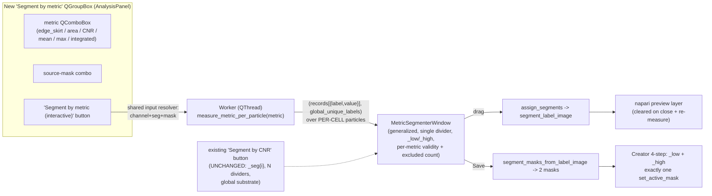

# feat: Interactive Segment-by-Metric module

## Overview

Add a dedicated tool in the analysis tab — its own "Segment by metric" module box — that splits an existing mask's particles into two population masks (`<base>_low` / `<base>_high`) by a **user-selectable per-particle metric** (edge-skirt ratio, size/area, CNR, or intensity), with a live histogram and a single draggable threshold, in the style of the existing "Segment by CNR (interactive)" feature.

The window UX and the split machinery (`assign_segments` → `segment_label_image` → `segment_masks_from_label_image`) are reused from the CNR segmenter (already metric-agnostic in everything but naming). The **new** work is a measurement path that computes the selected metric **per particle over the same per-cell substrate the validated `particles.csv` uses** — so a threshold a researcher reads off the CSV transfers to the in-app histogram — relabeled globally-unique to feed the split pipeline.

This plan was revised after a 6-persona document review that caught a substrate-mismatch flaw and a cluster of UX/scope issues (see Key Technical Decisions and Open Questions → Resolved).

**Prerequisite:** builds on the per-particle sharpness metrics (`edge_skirt_ratio`, `_sharpness_for_particle`) on the unmerged branch `feat/particle-sharpness-metrics`. Base this work on that branch (or merge it first).

---

## Problem Frame

Researchers separate out-of-focus P-bodies from real populations. Real-data validation this session showed `edge_skirt_ratio` cleanly separates in-focus from out-of-focus particles — including the small-particle regime where size fails — measured over the per-cell particle population in `particles.csv`. Today that gating happens only by exporting the CSV and eyeballing distributions externally. This module brings the "size × sharpness, gate by eye" workflow into the app: pick a metric, see its histogram over the source mask's particles (the **same** particle population as the CSV), drag a threshold, preview the two populations live, and save them as masks — mirroring the CNR segmenter's UX.

---

## Requirements Trace

- R1. A dedicated "Segment by metric" module in the analysis tab splits a selected source mask's particles into two masks by a chosen per-particle metric, with a live histogram + single draggable threshold + live two-population preview, mirroring the CNR segmenter's UX.
- R2. The metric is user-selectable from: `edge_skirt_ratio`, `area` (size, in µm²), `CNR`, and intensity (`mean`/`max`/`integrated`). The empirically-weak `boundary_gradient` / `laplacian_variance` are **excluded** from the picker.
- R3. Metric values are computed over the **per-cell particle substrate** used by `analyze_particles_detail` / `_iter_particles` (`cell_mask & mask`, labeled per cell) — **not** the global `scipy.ndimage.label(mask)` substrate — so the in-app population matches the validated CSV. Particles are relabeled to globally-unique ids to produce the `component_labels` image `segment_label_image` consumes.
- R4. Heavy measurement runs off the UI thread; the window performs only fast lookup-table work per drag.
- R5. On Save, two population masks are written `<base>_low` / `<base>_high` (below/above threshold) via the Creator four-step contract, names pre-validated against collisions, with **exactly one** `set_active_mask` call across the two writes.
- R6. Only the Save button mutates session state; the metric picker, source-mask combo, the divider, and axis toggle are Actions and write no session field. New widgets are registered in the GUI-ownership audits.
- R7. Time-lapse `(T,H,W)` masks are supported, preserving rank-agnostic behavior (one histogram pooled across frames; one threshold applied per frame).
- R8. Per-metric **validity/drop rules** are defined: particles whose metric is NaN/uncomputable for the measured channel are excluded from the histogram and from both output masks, and the window shows an excluded-particle count so the exclusion is visible, not silent.
- R9. Metrics that divide by channel signal (edge-skirt, intensity) are computed on the source mask's detection channel; when the active channel differs (peak≈0 → NaN), the tool guards/warns rather than silently producing a meaningless split.
- R10. The existing "Segment by CNR (interactive)" button is unchanged (kept separate; its `<base>_seg{i}` naming and N-divider behavior preserved).

---

## Scope Boundaries

- Single divider → exactly two populations (`_low`/`_high`). The N-divider/N-segment generality of the underlying window is **not** exposed by this tool (the add/remove-divider controls are hidden/disabled here); it remains available to the CNR button.
- `boundary_gradient` / `laplacian_variance` are not offered (validation: AUC~0.5 / brightness-confounded).
- No batch/workflow (headless) equivalent in this plan (GUI-interactive only). Name the emitter so a future batch method can map 1:1 (parity convention).
- No change to metric definitions; this exposes existing per-particle math.
- The standalone "Segment by CNR (interactive)" button is not retired or renamed (user decision: keep separate).

### Deferred to Follow-Up Work

- Optional keep/discard output framing (this v1 uses mechanical `_low`/`_high`; user chose mechanical).
- Optional batch `percell4`-CLI segment-by-metric.

---

## Context & Research

### Relevant Code and Patterns

- **Template window:** `src/percell4/gui/cnr_segmenter.py::CnrSegmenterWindow` — pyqtgraph `PlotWidget` + `BarGraphItem` histogram, draggable `pg.InfiniteLine` divider(s), log/linear toggle, 50 ms-debounced live `add_labels` preview layer, save via `AcceptPunctaMask`. Receives `records` (`[{label, <value>}]`) + `component_labels`. **Note:** its constructor filters `records` to `np.isfinite(cnr) and cnr>0` (`cnr_segmenter.py:112`) — a CNR-specific drop that governs both histogram and saved population; this must be parameterized per metric (R8).
- **Split math (reuse verbatim):** `assign_segments`, `segment_label_image`, `segment_masks_from_label_image` in `src/percell4/domain/measure/cnr_classification.py`.
- **Per-cell particle substrate + metric math (the substrate to match):** `src/percell4/domain/measure/particle.py::_iter_particles` (`particle_mask = cell_mask & mask_crop; ndlabel(...)` per cell), `_sharpness_for_particle` (edge-skirt etc.), `BUILTIN_METRICS` (intensity), `analyze_particles_detail`. This is what produced the validated CSV.
- **CNR per-focus math:** `cnr_classification.py::measure_cnr` (per-component CNR with owning-cell resolution) — reused for the CNR metric, adapted to the per-cell substrate for consistency within the tool.
- **Off-thread worker + panel dispatch:** `src/percell4/gui/adaptive_clip_panel.py::run_cnr_measure`(`_stack`), `_on_segment_cnr` → `Worker` → `_on_measure_done` (note: a second `cnr>0` filter lives here at `:826` — also parameterize). `percell4.gui.workers.Worker` (QThread).
- **Input resolution:** `adaptive_clip_panel.py::_resolve_cnr_inputs` (active channel image + active segmentation labels from viewer layers + store-read source mask, shape-checked) — extract a shared helper since the new module has its own box.
- **Creator save:** `src/percell4/application/use_cases/accept_puncta_mask.py::AcceptPunctaMask` — **always** calls `set_active_mask` (`:64`). Writing two masks with exactly one select requires a write-without-select path (a flag on the use case, or a direct `repo.write_mask` + `refresh_resource_lists` for the non-active mask). Name prompt: `percell4.gui._resource_name_prompt::prompt_for_resource_name`.
- **Analysis-tab seam:** add a new `QGroupBox` in `src/percell4/interfaces/gui/task_panels/analysis_panel.py::_build_ui` (callbacks `get_repo`/`get_store`/`get_viewer_window`/`show_status` are already threaded from `interfaces/gui/main_window.py`).
- **`_PARTICLE_SHARPNESS_METRICS` invariant:** `particle.py` comments state these are kept out of `BUILTIN_METRICS` and "the GUI metric pickers". This tool introduces a **separate, non-`BUILTIN_METRICS`** picker; update that comment to scope the invariant precisely (the metrics still never enter `BUILTIN_METRICS`, per-cell measurement, or threshold-config pickers — only this dedicated segment-by-metric picker).

### Institutional Learnings

- `creator-contract-four-step-sequence-2026-05-18.md` — write → add_mask → refresh → set_active; exactly one `set_active_mask` across N writes.
- `gui-action-contract-exhaustiveness.md` + `session-to-napari-one-way-push.md` — only Save writes session; preview pushes to napari, never reads back.
- `sibling-dialog-extract-shared-widget-2026-05-12.md` + `qt-wire-user-edit-signals-2026-05-12.md` — parameterize the shared window; wire `currentIndexChanged` on the metric combo at construction.
- `phasor-roi-preview-layer-ownership-2026-05-03.md` — clear the preview layer on close and on re-measure; the debounced update must not early-return on empty.
- `add-mask-name-collision-image-layer-crash-2026-05-15.md` — pre-validate generated names; route through `add_mask`; store before layer.
- `extending-per-cell-detection-to-time-lapse-2026-06-25.md` — rank-agnostic metric math; pool a `(T,H,W)` histogram via a global-relabel offset.
- `um2-area-sibling-columns-2026-06-29.md` + gui px/µm convention — surface area in µm² (thread `pixel_size_um`), not raw pixels.

### External References

- None — pyqtgraph, QThread workers, and the split pipeline are all in-repo.

---

## Key Technical Decisions

- **Substrate: per-cell particles, relabeled globally-unique (the review's load-bearing fix).** Compute every metric over `cell_mask & mask` labeled per cell (matching `_iter_particles` / the validated CSV), then assign each particle a globally-unique id and build a `component_labels` image from those ids for `segment_label_image`. This is *not* the CNR global-label substrate — using that would histogram a different population than the CSV, so CSV-learned thresholds wouldn't transfer. All metrics in the tool (including CNR) share this one substrate so populations are consistent across metric switches.
- **Reuse `_iter_particles`' per-particle computation.** The emitter wraps the existing per-cell labeling + `_sharpness_for_particle` / `BUILTIN_METRICS` / area calls (it already computes all offered metrics per particle) and additionally emits the global-unique label image + per-particle values for the selected metric. CNR per particle reuses `measure_cnr`'s per-focus formula on the same per-cell particles.
- **Reuse the split pipeline verbatim** (`assign_segments` / `segment_label_image` / `segment_masks_from_label_image`) — feed it the selected metric's per-particle array + the global-unique label image.
- **Off-thread measure, on-thread interact** (mirror `run_cnr_measure`/`_stack`).
- **Parameterized naming; CNR button untouched.** The generalized window takes a naming scheme + metric name. The new tool passes `_low`/`_high` (single divider, 2 masks); the existing CNR button keeps passing its `_seg{i}` scheme (N dividers) unchanged. This resolves the naming contradiction and keeps CNR regression-safe.
- **Exactly one `set_active_mask`.** Add a write-without-select path (a `select: bool` flag on `AcceptPunctaMask`, or a direct `repo.write_mask` + `refresh_resource_lists` for the non-active mask); auto-select `_high` by documented convention (mechanical low/high — the user tracks which side is "good"; the default is explicit, not a hidden semantic claim).
- **Per-metric validity/drop rule (R8).** The `cnr>0 & finite` filter is metric-specific. Define per metric: CNR drops `≤0`/NaN; edge-skirt/intensity drop NaN (uncomputable channel); area drops nothing (all >0). Apply the same rule in both the panel handler and the window constructor (remove the duplicated hardcoded `cnr>0`). Show an "N of M particles excluded" count in the status line.
- **Channel/mask coupling guard (R9).** Metrics that divide by channel signal are meaningful only on the source mask's detection channel. Guard: if the measured metric is all-NaN / mostly-NaN for the active channel, warn via `show_status` and don't open a degenerate window (or surface the excluded count prominently).
- **Own module box (user decision).** A new `QGroupBox` "Segment by metric" in `AnalysisPanel`, with its own source-mask combo + metric combo, using an extracted shared input-resolution helper (from `_resolve_cnr_inputs`).
- **Metric set (user decision): `edge_skirt_ratio`, `area`, `CNR`, `mean/max/integrated intensity`.** The two weak sharpness metrics are excluded (R2).
- **Metric change = fresh measurement.** Switching the metric re-runs the worker and reopens/resets the window (new histogram, axis label/units, divider reset to the new metric's median); a stale divider is never reinterpreted across unit systems.

---

## Open Questions

### Resolved During Planning (incl. review + user decisions)

- Substrate? **Per-cell (match the CSV)**, relabeled globally-unique — not the CNR global-label substrate.
- Metric set? **edge_skirt, area, CNR, mean/max/integrated intensity** (user: full+intensity; weak metrics dropped).
- Output framing? **Mechanical `_low`/`_high`** (user choice).
- Placement? **Its own module box** in the analysis tab (user choice).
- CNR button? **Kept separate/unchanged** (user choice); the new tool also offers CNR (accepted redundancy).
- N-divider generality? **Not exposed** — single divider, two populations.
- `_PARTICLE_SHARPNESS_METRICS` "out of GUI pickers" invariant? **Reconciled** — scope it to `BUILTIN_METRICS`-driven pickers; this dedicated picker is separate; update the comment.
- Naming contradiction (CNR `_seg{i}` vs new `_low/_high`)? **Parameterize naming**; CNR path unchanged.
- `set_active_mask` once vs `AcceptPunctaMask` always-select? **Add a write-without-select path.**

### Deferred to Implementation

- Exact factoring of the per-cell metric computation into an emitter without perturbing `_iter_particles` (extract the grad/lap/skirt buffer construction vs add a global-unique-label mode to `_iter_particles`).
- Precise per-metric validity predicate values and the "mostly-NaN" guard threshold (R9).
- Whether to hard-assert `active_channel == source mask's detection channel` or just warn (R9).
- Log-axis toggle behavior/relabel per metric (positive-support metrics only).

---

## High-Level Technical Design

> *This illustrates the intended approach and is directional guidance for review, not implementation specification. The implementing agent should treat it as context, not code to reproduce.*

Emitter (domain): `measure_metric_per_particle(image, feature_mask, cell_labels, metric, pixel_size_um) -> (records, global_unique_labels)` where particles are labeled **per cell** (`cell_mask & mask`), assigned globally-unique ids, and the selected metric is computed per particle (reusing `_sharpness_for_particle` / `BUILTIN_METRICS` / area / `measure_cnr`-formula). `records = [{"label": <global-unique id>, "value": v}]`; NaN/invalid per the metric's drop rule.

---

## Implementation Units

- U1. **Domain: per-cell metric emitter (global-unique labeled)**

**Goal:** Compute a selected metric per particle over the per-cell substrate (matching the validated CSV) and return `(records, global_unique_labels)` aligned to `segment_label_image`.

**Requirements:** R2, R3, R7, R8

**Dependencies:** None (builds on the sharpness branch)

**Files:**
- Create: `src/percell4/domain/measure/metric_segmentation.py` (pure numpy/scipy/skimage)
- Modify (factor helpers, no behavior change): `src/percell4/domain/measure/particle.py`
- Modify (comment scope): `src/percell4/domain/measure/particle.py` `_PARTICLE_SHARPNESS_METRICS` invariant note
- Test: `tests/test_measure/test_metric_segmentation.py`

**Approach:**
- Label particles per cell exactly as `_iter_particles` does; assign globally-unique ids; build `global_unique_labels` (or `(T,H,W)`).
- Per particle, compute the selected metric reusing the existing math (`_sharpness_for_particle`, `BUILTIN_METRICS`, area from pixel count × `pixel_size_um²`, CNR via `measure_cnr`'s per-focus formula on the per-cell particle).
- Apply the per-metric drop rule; return excluded count alongside records.
- Rank-agnostic `(T,H,W)` variant with a global-relabel offset.
- Name it so a future batch method maps 1:1.

**Execution note:** Characterization-first — before wiring the GUI, assert `measure_metric_per_particle(..., "edge_skirt_ratio")` reproduces `analyze_particles_detail`'s per-particle `edge_skirt_ratio` values on a fixture (the real parity anchor — **not** CNR).

**Patterns to follow:** `_iter_particles` per-cell labeling; `_sharpness_for_particle`; `run_cnr_measure_stack` offset loop.

**Test scenarios:**
- Parity (edge-skirt) — `Covers R3.` For a fixture, per-particle `edge_skirt_ratio` from the emitter equals `analyze_particles_detail`'s values (same population, same values).
- Parity (area µm²) — area values equal per-cell particle pixel counts × pixel area; a blob straddling two cells counts as two particles (per-cell), matching the CSV, not one global component.
- Alignment — every `record["label"]` indexes a nonzero region of `global_unique_labels`; feeding records + labels to `segment_label_image` yields a valid 0/1/2 image with no orphaned labels.
- Validity/drop — `Covers R8.` For an all-zero channel, edge-skirt/intensity records are dropped (excluded count > 0), area records survive; CNR drops `≤0`/NaN.
- Time-lapse — `Covers R7.` `(T,H,W)` input yields pooled records with globally-unique labels and a `(T,H,W)` label image; per-frame counts sum to the total.
- Edge case — empty mask → empty records, all-zero labels, excluded count 0, no exception.

**Verification:** For each offered metric, the emitter returns records + a global-unique label image that split into correct `_low`/`_high` masks on a known threshold; edge-skirt parity vs the CSV holds.

---

- U2. **GUI: generalized single-divider metric window (`_low`/`_high`)**

**Goal:** Parameterize `CnrSegmenterWindow` by metric name, value key, naming scheme, and validity rule; restrict this tool's instance to a single divider with `_low`/`_high` output; keep the CNR caller unchanged.

**Requirements:** R1, R4, R5, R8, R10

**Dependencies:** U1

**Files:**
- Modify: `src/percell4/gui/cnr_segmenter.py` (parameterize; add a metric-agnostic entry; the class may be renamed `MetricSegmenterWindow` with a thin CNR-preset constructor/factory — specify one)
- Modify: `src/percell4/application/use_cases/accept_puncta_mask.py` (add a `select: bool` write-without-select path) OR add a direct write helper
- Test: `tests/test_gui/test_cnr_segmenter.py` (extend), `tests/test_measure/` for any extracted pure helper

**Approach:**
- Accept `metric_name` (axis label + units), `value_key`, `naming_scheme` (`_low/_high` vs `_seg{i}`), `validity_fn`, `single_divider: bool`. Replace hardcoded `cnr`/`>0`/axis literals with these.
- Show the excluded-particle count in the status line (R8). Reset divider to the metric's median on open; per-metric axis label/units.
- Save: `segment_masks_from_label_image` → two masks; pre-validate base name; write both via the Creator four-step with **exactly one** `set_active_mask` (write-without-select for the non-active one).
- Preview layer cleared on close and on re-measure; debounced update never early-returns on an empty side.

**Patterns to follow:** current `CnrSegmenterWindow`; `AcceptPunctaMask`; phasor preview teardown.

**Test scenarios:**
- Happy path — Constructing with a metric's records renders a histogram; the single divider splits into `_low`/`_high`; preview shows two colors.
- Creator contract — `Covers R5.` On Save, `add_mask.call_count == 2` and `set_active_mask` called **exactly once**; store written before each `add_mask`.
- Excluded count — `Covers R8.` Records with dropped particles show an accurate "N of M excluded" status; dropped particles appear in neither output mask.
- Name collision — a colliding base name re-prompts/blocks without crashing.
- Preview teardown — closing removes the preview layer; a drag that empties one side does not strand a stale overlay.
- CNR regression — `Covers R10.` The CNR caller (its own button) still produces `_seg{i}` masks with N-divider behavior, byte-identical to before (characterization).
- Single-divider restriction — the metric window exposes no add/remove-divider affordance; only `_low`/`_high` are produced.

**Verification:** The window works for a new metric end-to-end (histogram → drag → excluded count → save two masks, one active) and the CNR button path is unchanged.

---

- U3. **GUI: "Segment by metric" module box + worker + launch**

**Goal:** A dedicated analysis-tab module with a source-mask combo and metric picker that measures off-thread and opens the window; channel/mask guard.

**Requirements:** R1, R2, R4, R6, R7, R9

**Dependencies:** U1, U2

**Files:**
- Create: `src/percell4/gui/metric_segmenter_panel.py` (the new `QGroupBox` panel)
- Modify: `src/percell4/interfaces/gui/task_panels/analysis_panel.py` (embed the new box)
- Modify: `src/percell4/gui/adaptive_clip_panel.py` (extract the shared input-resolution helper from `_resolve_cnr_inputs`)
- Test: `tests/test_gui/test_metric_segmenter_panel.py`, `tests/test_gui/test_analysis_panel_metric_module.py`

**Approach:**
- New panel: source-mask combo (`store.list_masks()`), metric `QComboBox` (metric set per R2) with `currentIndexChanged` wired at construction, and a "Segment by metric (interactive)" button.
- Worker bodies `run_metric_measure`/`_stack` (Qt-free) call U1's emitter; dispatch via `Worker`; `finished` → construct+show the window on the main thread.
- Channel/mask guard (R9): resolve channel from active channel; if the measured metric is (mostly) NaN, `show_status` a warning and don't open a degenerate window.
- Metric change re-runs measurement and resets the window.

**Patterns to follow:** `run_cnr_measure`(`_stack`), `_on_segment_cnr`→`Worker`→`_on_measure_done`, `CnrClassifySettingsWidget`, `AdaptiveClipPanel` construction.

**Test scenarios:**
- Happy path — selecting a metric + clicking dispatches the worker and opens the window with that metric's records over the source mask.
- Signal wiring — `Covers R6.` Changing the metric combo triggers a re-measure (assert handler fires), not a silent no-op.
- Worker safety — `run_metric_measure` runs with no Qt/store access and returns `(records, labels)` for each metric (pure-domain assertion, local test).
- Channel guard — `Covers R9.` With a source mask detected on a different channel than the active one (edge-skirt all-NaN), the tool warns and does not open a degenerate window.
- Time-lapse — `Covers R7.` a `(T,H,W)` mask routes to `run_metric_measure_stack`; the window pools all frames.
- Error path — missing channel/segmentation or shape mismatch shows a status message; no crash.
- Module presence — the "Segment by metric" box appears in the analysis panel.

**Verification:** From the analysis tab, the dedicated module lets a user pick a metric and split the selected mask; time-lapse works; mismatched channel is guarded.

---

- U4. **GUI-ownership audits + no-session-write guard**

**Goal:** Keep the state-ownership model intact and documented for the new widgets.

**Requirements:** R6

**Dependencies:** U2, U3

**Files:**
- Modify: `docs/audits/gui-element-classification.yaml`, `docs/audits/session-mutation-graph.md`, `docs/audits/subscriber-rebind-matrix.md`
- Test: `tests/test_gui/` guard

**Approach:** Classify + register: Save = Creator; metric combo, source-mask combo, divider, axis toggle = Actions (no session writes). Add the Save-path mask writes to the mutation graph. Guard test: no non-Save widget calls any `session.set_active_*`/filter/selection setter.

**Test scenarios:**
- Guard — `Covers R6.` Exercising metric combo, source-mask combo, divider, toggle writes none of the five session fields; only Save writes `active_mask` (once).
- Audit completeness — new widgets present in `gui-element-classification.yaml` with correct classes.

**Verification:** Audits list every new widget with the right class; guard passes; `session.set_active_*` traces only to the Save path.

---

## System-Wide Impact

- **Interaction graph:** New module box + worker in `AnalysisPanel`; a shared input-resolution helper extracted from `AdaptiveClipPanel`; the generalized window serves the new tool (single divider) and the unchanged CNR button (N dividers) via parameterization. Preview pushes to napari one-way.
- **Error propagation:** Input/channel failures surface via `show_status` and abort before the window opens; per-metric drops are counted and shown, never silent.
- **State lifecycle risks:** Preview cleared on close + re-measure; store-before-layer; exactly one `set_active_mask`; the `AcceptPunctaMask` change (write-without-select) must not alter the CNR button's existing select-last behavior unless intended.
- **API surface parity:** CNR button preserved (R10). A future batch equivalent reuses U1's emitter under a 1:1-named method.
- **Unchanged invariants:** `_iter_particles`/`analyze_particles_detail` and the `particles.csv` schema are untouched (U1 only *reuses* their math via extracted helpers); the split-pipeline functions are reused unmodified; `_PARTICLE_SHARPNESS_METRICS` still never enters `BUILTIN_METRICS` — only a dedicated, separate picker (comment scoped accordingly).

---

## Risks & Dependencies

| Risk | Mitigation |
|------|------------|
| Emitter histograms a different population than the validated CSV (the original flaw). | U1 uses the per-cell substrate and an **edge-skirt parity test vs `analyze_particles_detail`** (not just CNR). |
| Factoring `_sharpness_for_particle`/buffer construction perturbs the per-cell particle path. | Extract helpers without changing `_iter_particles`; the sharpness-branch tests (`test_particle.py`) stay green. |
| `AcceptPunctaMask` always-selects; two masks → two selects. | Add a write-without-select path; test asserts exactly one `set_active_mask`. |
| Per-metric validity drop wrong (e.g. `>0` floor applied to area) silently changes the saved population. | Explicit per-metric validity_fn used in both panel + window; excluded-count shown; U1 validity test. |
| Metrics computed on the wrong channel produce a meaningless split. | Channel/mask guard (R9) warns and blocks a degenerate window. |
| Generalizing the CNR window breaks the shipping CNR feature. | Parameterize (CNR passes its existing scheme); characterization test pins CNR output (R10). |
| Non-Save widget writes session (canonical action-contract bug). | U4 guard test + audit registration. |
| Mask-name collisions crash napari. | Pre-validate names; route through `add_mask`; store first. |
| GUI tests are CI-only (local Qt segfault). | Emitter + split logic under `tests/test_measure/` (local); window/panel under `tests/test_gui/` (CI-gated). |
| Depends on the unmerged sharpness branch. | Base this work on `feat/particle-sharpness-metrics` (or merge first). |
| CNR appears both in the new picker and on its own button (user-accepted redundancy). | Documented; the two use different substrates (per-cell vs global) — note the divergence so it isn't read as a bug. |

---

## Documentation / Operational Notes

- Update `docs/audits/*` (U4), the `_PARTICLE_SHARPNESS_METRICS` invariant comment (U1), and per-module `CLAUDE.md` (gui / domain measure) when the module lands.
- Post-landing: `/ce-compound` the "per-cell substrate relabeled globally-unique to feed the split pipeline" pattern.

---

## Sources & References

- Template: `src/percell4/gui/cnr_segmenter.py`, `src/percell4/gui/adaptive_clip_panel.py`
- Split pipeline + CNR: `src/percell4/domain/measure/cnr_classification.py`
- Per-cell substrate + metric math: `src/percell4/domain/measure/particle.py`
- Creator save: `src/percell4/application/use_cases/accept_puncta_mask.py`
- Analysis-tab seam: `src/percell4/interfaces/gui/task_panels/analysis_panel.py`, `src/percell4/interfaces/gui/main_window.py`
- Prior CNR plan: `docs/plans/2026-06-23-003-feat-interactive-cnr-segmenter-plan.md`
- Metric validation: this session's edge_skirt_ratio analysis (separates in/out-of-focus incl. small-particle regime)
