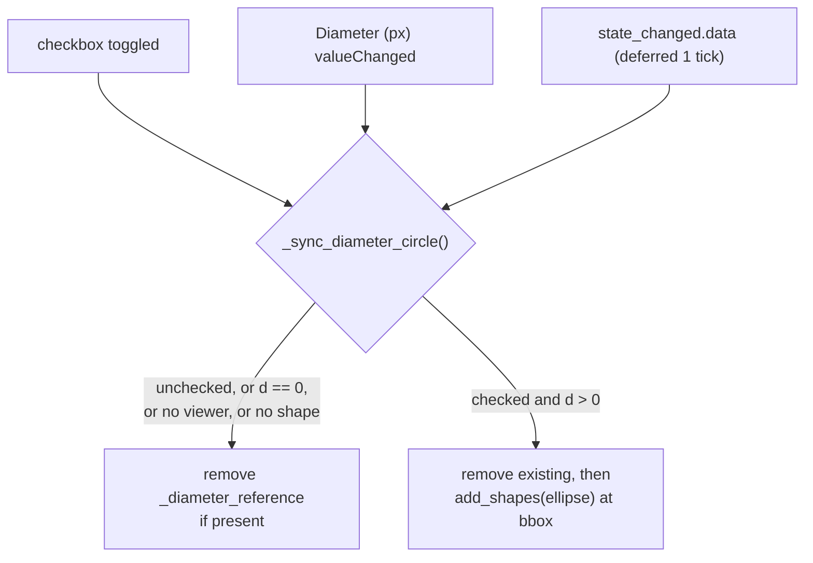

# feat: Cellpose diameter reference circle in napari

## Overview

Add a toggleable magenta reference circle to the napari viewer whose diameter
tracks the **Diameter (px)** field in the Segment tab's Cellpose group. The
circle is drawn at the bottom-left of the image at true data scale, so the user
can eyeball whether the entered diameter matches the actual cell size in the
current dataset. This emulates the Cellpose GUI's diameter disc.

---

## Problem Frame

`SegmentationPanel` seeds Cellpose's diameter at 300 px
(`src/percell4/gui/segmentation_panel.py:124`). That default is only correct for
the pixel size the value was tuned against. Datasets acquired at a different
objective or camera binning have very different px-per-cell, and there is
currently no way to judge "is 300 px about one cell?" without running Cellpose
and inspecting the result — an expensive, slow feedback loop.

A live, correctly-scaled reference circle collapses that loop to zero: the user
types a diameter, sees a disc of exactly that size sitting next to real cells,
and adjusts until it matches.

---

## Requirements Trace

- R1. A checkbox in the Segment tab's **Cellpose** group toggles a reference
  circle in the napari viewer on and off.
- R2. The circle's diameter in image pixels equals the current **Diameter (px)**
  value, at data scale (it zooms with the image).
- R3. The circle updates live whenever **Diameter (px)** changes while the
  checkbox is ticked — no re-toggle required.
- R4. The circle is rendered opaque magenta, matching the Cellpose GUI's disc.
- R5. The circle is pinned to the bottom-left of the image, like the Cellpose
  GUI. It is not draggable and not editable.
- R6. `Diameter (px) == 0` (auto-detect) shows no circle; the checkbox may stay
  ticked and the circle reappears when a nonzero value is entered.
- R7. Unticking the checkbox removes the circle layer from napari, leaving no
  residue.
- R8. Toggling with no viewer or no loaded dataset must not raise; the panel
  reports the condition through the existing status-bar path.

---

## Scope Boundaries

- The Segment tab only. The single-cell workflow setup dialog
  (`src/percell4/gui/workflows/single_cell/config_dialog.py`) hosts the same
  shared `CellposeSettingsForm` but has no live viewer alongside it, so it does
  not get the checkbox.
- No µm readout on the circle. The px value is the field being calibrated;
  px↔µm conversion (as in `_adaptive_clip_settings.py`) is out of scope.
- The circle is a transient viewer overlay. It is never persisted to the `.h5`
  dataset and is not a segmentation, mask, or measurement resource.
- No change to how `diameter` reaches Cellpose at run time. `_on_run_cellpose`
  keeps reading the form pull-style.

---

## Context & Research

### Relevant Code and Patterns

- `src/percell4/gui/_cellpose_settings_form.py:66-71` — the `Diameter (px)`
  `QDoubleSpinBox` (`self._diameter`, range 0–1000, tooltip "0 = auto-detect").
  Its class docstring currently states *"No `changed` signal: both consumers read
  the widgets pull-style"* — this plan changes that and the docstring must move
  with it.
- `src/percell4/gui/segmentation_panel.py:113-155` — the Cellpose `QGroupBox`
  where the checkbox belongs, directly beneath the existing
  `_cp_remove_edges` / `_cp_edge_margin` Action operands.
- `src/percell4/gui/segmentation_panel.py:40-49` — `empty_labels_array`, the
  precedent for a module-level **pure** geometry/array helper living beside the
  panel class and unit-tested without Qt. The circle geometry helper mirrors it.
- `src/percell4/gui/segmentation_panel.py:86-101` — the `_on_state_changed`
  handler and its `QTimer.singleShot(0, ...)` deferral for `change.data`, which
  exists precisely because the viewer's layers are rebuilt *after*
  `state_changed.data` fires. The circle re-sync needs the same deferral.
- `src/percell4/gui/segmentation_panel.py:623-640` — `_get_image_shape()`,
  which already resolves `(H, W)` from the active channel's viewer layer with a
  first-Image-layer fallback. Reuse verbatim; do not add a second shape
  resolver.
- `src/percell4/gui/threshold_qc.py:489-500` and
  `src/percell4/interfaces/gui/task_panels/analysis_panel.py:370-378` — the two
  existing `add_shapes` call sites. Both follow the same shape: remove any
  same-named layer first, then add with preset-sourced colors and
  `**vp._optional_kwargs(...)`.
- `src/percell4/gui/cnr_segmenter.py:365-394` — `_push_preview` /
  `_remove_preview_layer`, the canonical "one in-place overlay layer, removed on
  teardown" pair. The circle's add/update/remove trio should read the same way.
- `src/percell4/config/viewer_presets.py:175-183` — the `YELLOW_ROI_*` block:
  the exact template for a new `DIAMETER_CIRCLE_*` constant group, including the
  `None`-sentinel opacity discipline documented in that module's header.
- `src/percell4/gui/viewer.py:559,677,713,718` — every `ViewerWindow` layer
  sweep guards on `isinstance(layer, napari.layers.Labels)`, so a new `Shapes`
  layer is invisible to the session→napari push machinery. Confirmed: no
  existing iteration needs a new guard.

### Institutional Learnings

- `docs/solutions/conventions/qt-wire-user-edit-signals-2026-05-12.md` — two
  bugs in eight days from interactive Qt widgets whose user-edit signal was
  never connected; both passed tests because tests set values programmatically.
  R3 (live update) is exactly this failure shape. Wire `valueChanged` at widget
  construction, and note that `QDoubleSpinBox.valueChanged` fires on
  `setValue()` too, so the tests do exercise the real path.
- `docs/solutions/ui-bugs/phasor-roi-preview-layer-ownership-2026-05-03.md` — a
  preview layer that survives its owner's teardown leaves stale pixels on the
  canvas, and the regression test missed it because the fixture had no real
  napari viewer. Applies directly to R7: assert on the mock viewer's
  `layers.remove` call, not merely on internal panel state.
- `docs/solutions/architecture-patterns/gui-action-contract-exhaustiveness.md` —
  the three-class rule. The checkbox reads session (via `active_channel` for
  shape resolution) but writes no session field and creates no dataset
  resource: it is an **Action**. `docs/audits/gui-element-classification.yaml`
  must gain an entry.
- `docs/solutions/architecture-patterns/extending-per-cell-detection-to-time-lapse-2026-06-25.md`
  — the repo's standing expectation that new viewer features behave sanely on
  `(T, H, W)` datasets.

---

## Key Technical Decisions

- **napari `Shapes` layer with `shape_type="ellipse"`, not a `Points` disc.**
  Both scale with the data, but `add_shapes` is the established call in this
  codebase (two existing sites) and gives direct control over an opaque
  `face_color` with no edge. A `Points` layer's `size`/`symbol` semantics would
  be a new pattern for one widget's benefit.
- **A single reserved layer named `_diameter_reference`.** Underscore-prefixed,
  matching `_threshold_preview`, `_threshold_roi`, `_phasor_roi_preview`.
  Add/update/remove always target this name; a resize removes-and-re-adds or
  assigns `layer.data` in place, never accumulates layers.
- **Geometry lives in a pure module-level function, not inside the handler.**
  `diameter_circle_bbox(shape, diameter, margin)` takes `(H, W)` plus scalars
  and returns the ellipse bounding-box vertices. Pure, Qt-free, napari-free,
  and directly unit-testable — the clamping rules (R6, oversize diameters) are
  the part most likely to be wrong, and they should be testable without a
  viewer.
- **Colors and inset live in `viewer_presets.py`, not inline.** The module's
  contract is that every napari display value is retunable from one file. A
  hardcoded `"magenta"` in the panel would be the first violation.
- **The shared form gains a `diameter_changed` signal.** The alternative —
  reaching into `panel._cp_form._diameter` from the panel — would puncture the
  form's encapsulation and leave the private attribute as de-facto API for a
  second consumer. One narrow signal is the smaller commitment. The workflow
  config dialog simply does not connect to it.
- **The circle is not editable.** `layer.editable = False` after add, so a
  stray click cannot reshape the reference into a lie. It stays visible in the
  layer list (the user can hide it there), which is acceptable and consistent
  with the other overlay layers.

---

## Open Questions

### Resolved During Planning

- Pinned vs. draggable circle: **pinned bottom-left**, non-interactive — exact
  Cellpose emulation (user decision).
- Behavior at `Diameter (px) == 0`: **hide the circle**, checkbox may stay
  ticked (user decision, R6).
- Does the workflow config dialog need the checkbox too? No — it hosts the same
  shared form but has no live viewer beside it. Out of scope.
- Will a `Shapes` layer confuse existing layer sweeps? No —
  `ViewerWindow`'s sweeps all guard on `napari.layers.Labels`, and
  `_get_image_shape` guards on `Image`.

### Deferred to Implementation

- The exact vertex-array form napari accepts for `shape_type="ellipse"` (4-corner
  bounding box vs. `[center, radii]`). Verify against the installed napari
  version at implementation time; the pure helper's return shape follows
  whichever is correct.
- Whether a `(T, H, W)` dataset needs the 2D shapes layer explicitly broadcast
  across the time axis, or napari's lower-dimensional-layer handling covers it
  automatically. Verify in the running app; if napari does not broadcast, the
  fallback is to emit one ellipse per timepoint with a leading time coordinate.
- Whether `layer.editable = False` alone is enough to keep the layer from
  stealing interaction focus, or whether the panel should also restore the
  previously active layer after adding.

---

## High-Level Technical Design

> *This illustrates the intended approach and is directional guidance for
> review, not implementation specification. The implementing agent should treat
> it as context, not code to reproduce.*

Geometry, in napari image coordinates (y increases downward, so bottom-left is
large-y / small-x):

```
r = diameter / 2
cy = clamp(H - r - margin, low=r, high=max(r, H - r))
cx = clamp(r + margin,     low=r, high=max(r, W - r))
bbox = [(cy-r, cx-r), (cy-r, cx+r), (cy+r, cx+r), (cy+r, cx-r)]
```

The clamp keeps the disc fully inside the frame for ordinary diameters and, when
`diameter` exceeds an image dimension, pins it flush to the top-left of that
axis so the overflow is visible rather than off-screen — an oversize circle
spilling past the image edge is itself the answer the user is looking for.

Control flow, both entry points converging on one sync method:



Routing every trigger through one idempotent `_sync_diameter_circle()` is what
makes R7 (no residue) and the duplicate-layer edge case fall out for free rather
than needing per-path cleanup.

---

## Implementation Units

- U1. **Add a `diameter_changed` signal to the shared Cellpose form**

**Goal:** Let a consumer react live to Diameter (px) edits without reaching into
the form's private widgets.

**Requirements:** R3

**Dependencies:** None

**Files:**
- Modify: `src/percell4/gui/_cellpose_settings_form.py`
- Test: `tests/test_gui/test_cellpose_settings_form.py`

**Approach:**
- Declare `diameter_changed = Signal(float)` on `CellposeSettingsForm` and
  connect `self._diameter.valueChanged` to it at construction, per the
  `qt-wire-user-edit-signals` convention (wire at construction, not at first
  use).
- Update the class docstring (`_cellpose_settings_form.py:43-47`), which
  currently asserts the form has no `changed` signal. Replace with an accurate
  statement: settings are still read pull-style at run/accept time; the one
  signal exists solely for the Segment tab's live diameter overlay.
- Do not touch `settings()` or add signals for the other seven fields — nothing
  consumes them and the class comment should stay honest about why only this
  one exists.
- `WorkflowConfigDialog` is unaffected; it simply never connects.

**Patterns to follow:**
- `docs/solutions/conventions/qt-wire-user-edit-signals-2026-05-12.md`
- Existing `qtpy` `Signal` declarations in `src/percell4/gui/viewer.py`
  (`multi_select_requested`) and `src/percell4/gui/cnr_segmenter.py`

**Test scenarios:**
- Happy path: connect a spy to `diameter_changed`, call
  `form._diameter.setValue(120.0)`, assert the spy received `120.0`.
- Happy path: setting the same value twice emits only once (Qt's `valueChanged`
  suppresses no-op sets) — documents the de-dup the overlay relies on.
- Edge case: `setValue(0.0)` still emits, carrying `0.0`; the consumer, not the
  form, decides that 0 means "hide".
- Integration: `form.settings().diameter` still reflects the spinbox after an
  emission — the signal is additive, not a replacement for the pull-style read.

**Verification:**
- A consumer can observe every Diameter (px) edit without touching
  `form._diameter`.
- `tests/test_gui/test_cellpose_settings_form.py` and
  `tests/test_gui_workflows/test_config_dialog.py` both still pass unchanged.

---

- U2. **Add circle presets and the pure geometry helper**

**Goal:** Establish the retunable display constants and the clamping geometry as
independently testable pieces before any Qt wiring exists.

**Requirements:** R2, R4, R5, R6

**Dependencies:** None

**Files:**
- Modify: `src/percell4/config/viewer_presets.py`
- Modify: `src/percell4/gui/segmentation_panel.py`
- Test: `tests/test_gui/test_segmentation_panel_diameter_circle.py`

**Approach:**
- Add a `DIAMETER_CIRCLE_*` constant block to `viewer_presets.py` modeled on the
  `YELLOW_ROI_*` block at lines 175-183: an opaque magenta RGBA face color, no
  visible edge, a `Final[float | None]` opacity following the module's
  `None`-sentinel discipline, a blending mode, and the bottom-left inset in
  pixels. "Opaque" (R4) means alpha `1.0` in the face color — note in a comment
  that this is deliberate and differs from `YELLOW_ROI_FACE_COLOR`'s `0.1`
  alpha, so a future reader does not "fix" it into translucency.
- Add `diameter_circle_bbox(shape, diameter, margin)` as a module-level pure
  function in `segmentation_panel.py`, beside `empty_labels_array` (line 40) and
  following its docstring style ("Pure (no Qt)"). `shape` is `(H, W)`.
- The function returns `None` for `diameter <= 0` so the caller has a single
  branch to handle R6 rather than duplicating the zero check at every call site.
- Clamping per the High-Level Technical Design sketch.

**Patterns to follow:**
- `src/percell4/config/viewer_presets.py:175-183` (`YELLOW_ROI_*` block and its
  explanatory comments)
- `src/percell4/gui/segmentation_panel.py:40-49` (`empty_labels_array`)

**Test scenarios:**
- Happy path: `shape=(512, 512)`, `diameter=100`, `margin=10` → returns four
  vertices whose y-extent and x-extent are both exactly 100, positioned in the
  lower-left quadrant (center y > H/2, center x < W/2).
- Happy path: doubling `diameter` doubles both extents and the returned box
  still lies within the image.
- Edge case: `diameter=0` → returns `None`.
- Edge case: `diameter=-5` (not reachable through the spinbox, but the helper is
  public) → returns `None`.
- Edge case: `diameter` equal to `H` → circle spans the full height, clamped
  flush with no negative coordinates.
- Edge case: `diameter=1000` on a `(512, 512)` image → still returns a box; the
  minimum coordinate on each axis is `0.0` (clamped flush to the top-left of
  that axis) rather than negative.
- Edge case: non-square image `(256, 1024)` → the circle is round (equal y and x
  extents), not stretched to the aspect ratio.
- Edge case: `margin` larger than the image → clamp keeps the center at `r`
  rather than producing an inverted or off-image box.

**Verification:**
- The geometry is fully specified and tested without importing napari or
  constructing a widget.
- No color, alpha, or inset literal appears in `segmentation_panel.py`.

---

- U3. **Wire the checkbox and the viewer overlay**

**Goal:** Deliver the feature end to end in the Segment tab.

**Requirements:** R1, R2, R3, R5, R6, R7, R8

**Dependencies:** U1, U2

**Files:**
- Modify: `src/percell4/gui/segmentation_panel.py`
- Test: `tests/test_gui/test_segmentation_panel_diameter_circle.py`

**Approach:**
- Add `self._cp_show_diameter_circle = QCheckBox("Show diameter reference circle")`
  to the Cellpose group, below `_cp_edge_margin` and above the **Run Cellpose**
  button, styled with the same `theme.TEXT` stylesheet as `_cp_remove_edges`
  (line 130). Default unchecked. Tooltip should explain what the circle is for
  — sizing the Diameter (px) value against real cells — and state the
  `0 = auto-detect → no circle` behavior, per the project rule that ambiguity is
  resolved in tooltips rather than in labels.
- Implement one idempotent `_sync_diameter_circle()` as the single convergence
  point for all three triggers (see the design sketch). It resolves the viewer,
  resolves `(H, W)` via the existing `_get_image_shape()`, calls
  `diameter_circle_bbox`, and either removes or re-adds the
  `_diameter_reference` layer.
- Always remove any existing `_diameter_reference` layer before adding, mirroring
  `cnr_segmenter._push_preview` (lines 365-384) — this is what prevents
  duplicate layers across repeated toggles.
- Connect three triggers: the checkbox's `stateChanged` (or `toggled`), the
  form's new `diameter_changed` (U1), and the existing `_on_state_changed`
  `change.data` branch. The `change.data` path must go through the same
  `QTimer.singleShot(0, ...)` deferral already used for `_wire_paint_autosave`
  (line 101) and for the same documented reason: the viewer's layers do not
  exist yet when `state_changed.data` fires.
- On the `change.data` path, sync unconditionally rather than early-returning
  when unchecked — a stale circle from the previous dataset must not survive a
  dataset switch.
- After adding, set `layer.editable = False`.
- R8: every failure to resolve a viewer, a shape, or a nonzero diameter is a
  quiet no-op plus (for the explicit user-toggle path only) a `_show_status`
  message. A dataset-change-triggered sync must not spam the status bar.

**Execution note:** The geometry from U2 is already covered; drive this unit
from the lifecycle tests instead — write the toggle-on / toggle-off /
dataset-switch cases first, since layer-residue bugs are the documented failure
mode here (`phasor-roi-preview-layer-ownership-2026-05-03.md`).

**Patterns to follow:**
- `src/percell4/gui/cnr_segmenter.py:365-394` (`_push_preview` /
  `_remove_preview_layer`)
- `src/percell4/gui/threshold_qc.py:489-500` (`add_shapes` call shape with
  preset colors and `_optional_kwargs`)
- `src/percell4/gui/segmentation_panel.py:86-101` (the `change.data` deferral)
- `src/percell4/gui/segmentation_panel.py:128-135` (checkbox construction and
  styling in this group)

**Test scenarios:**
Build on `_build_panel` from
`tests/test_gui/test_segmentation_panel_cellpose_settings.py:20-51` — a
`MagicMock` launcher/viewer with a named Image layer — extended so
`viewer.layers` supports `remove` and membership checks.
- Happy path: tick the checkbox with diameter 300 on a `(512, 512)` image →
  `add_shapes` called once, `name="_diameter_reference"`,
  `shape_type="ellipse"`, face color sourced from the preset constant.
- Happy path: with the checkbox ticked, `form._diameter.setValue(150)` → the
  layer is refreshed and the new vertex extents are 150 px (R3). This is the
  scenario the `qt-wire-user-edit-signals` learning exists to protect.
- Happy path: untick → the `_diameter_reference` layer is removed from the
  viewer, asserted against the mock viewer's removal call, not panel state (R7).
- Edge case: diameter set to 0 while ticked → no layer present; then set to 80
  → layer reappears at 80 px, checkbox never having been touched (R6).
- Edge case: tick, untick, tick again → exactly one `_diameter_reference` layer
  exists; `add_shapes` was called twice and removal once.
- Edge case: change diameter while unchecked → `add_shapes` never called.
- Edge case: `(3, 512, 512)` time-lapse layer → the circle is built from the
  trailing two dims (`_get_image_shape` already slices `[-2:]`), and the ellipse
  extents are 2D.
- Error path: launcher's `_windows` has no `"viewer"` → ticking the checkbox
  does not raise and posts a status message (R8).
- Error path: viewer present but no Image layer, so `_get_image_shape()` returns
  `None` → no layer added, no exception, status message posted (R8).
- Integration: with the checkbox ticked, emit `state_changed` with `data=True`
  and flush the deferred timer → the circle is rebuilt against the new dataset's
  shape and no layer from the previous dataset remains.
- Integration: `_on_run_cellpose` is unaffected — with the checkbox ticked, the
  diameter forwarded to the worker is unchanged from the existing
  `test_run_cellpose_passes_inference_kwargs` expectation, confirming the
  overlay is display-only.

**Verification:**
- Ticking the box in the running app draws an opaque magenta disc at the
  image's bottom-left that resizes live as Diameter (px) changes and vanishes on
  untick.
- The disc zooms with the image (it is in data coordinates, not screen
  coordinates).
- No `_diameter_reference` layer survives an untick or a dataset switch.

---

- U4. **Update audits, module docs, and changelog**

**Goal:** Keep the living GUI-ownership artifacts and user-facing docs truthful,
per the project's documentation rules.

**Requirements:** R1

**Dependencies:** U3

**Files:**
- Modify: `docs/audits/gui-element-classification.yaml`
- Modify: `src/percell4/gui/CLAUDE.md`
- Modify: `CHANGELOG.md`

**Approach:**
- Add a `segmentation_panel.cellpose_diameter_circle_checkbox` entry to the
  audit YAML in the `gui/segmentation_panel.py` block (near line 985, beside the
  sibling `cellpose_remove_edges_checkbox`), classified **Action**:
  `reads: [active_channel]`, `writes: []`. The notes field should state
  explicitly that it writes no session field and no dataset resource, and that
  the `_diameter_reference` napari layer is a transient display overlay — the
  distinction that keeps it an Action rather than a Creator.
- Bump the file's `last_updated` and the `counts.action` / `total_widgets`
  tallies in the header, and add a dated update comment in the header block
  following the existing convention (see the 2026-05-21 and 2026-05-13 entries).
- Update the `segmentation_panel.py` bullet in `src/percell4/gui/CLAUDE.md` to
  mention the checkbox alongside the existing "Remove edge cells" / "Edge margin
  (px)" description. Current state only — no history, per the documentation
  rules.
- Add a `### Added` entry under `## Unreleased` in `CHANGELOG.md` describing the
  user-visible behavior: what it is, why it matters (pixel size varies by
  dataset, so the 300 default is often wrong), and the `0 = auto-detect → no
  circle` behavior.

**Patterns to follow:**
- `docs/audits/gui-element-classification.yaml:966-1008` (entry format, `notes`
  voice)
- `CHANGELOG.md` `## Unreleased` section (bold lead sentence, then the "read
  this before comparing" style of practical guidance)

**Test scenarios:**
Test expectation: none — documentation and audit metadata only, no behavioral
change. The audit YAML is a living artifact, not a validated schema with a test
harness.

**Verification:**
- The new checkbox appears exactly once in
  `docs/audits/gui-element-classification.yaml`, classified Action, with header
  counts consistent with the added entry.
- `src/percell4/gui/CLAUDE.md` describes the Cellpose group's full control set.
- `CHANGELOG.md` has an Added entry under Unreleased.

---

## System-Wide Impact

- **Interaction graph:** Three inbound triggers converge on
  `_sync_diameter_circle()` — the checkbox, `CellposeSettingsForm.diameter_changed`
  (new in U1), and the existing `state_changed.data` handler. The new signal is
  additive on a widget shared with `WorkflowConfigDialog`, which does not
  connect to it, so that surface is unchanged.
- **Error propagation:** Every path is best-effort display. Missing viewer,
  missing image layer, and zero diameter are all no-ops. Only the explicit
  user-toggle path surfaces a status message; the dataset-change path stays
  quiet to avoid status-bar noise on every load.
- **State lifecycle risks:** A stale `_diameter_reference` layer surviving an
  untick or a dataset switch is the primary risk — the documented failure mode
  from the phasor ROI preview bug. Mitigated by routing all triggers through one
  idempotent sync that removes before it adds, and by asserting removal against
  the viewer mock rather than panel state.
- **API surface parity:** None. The Segment tab is the only surface with a live
  viewer beside a diameter field; the workflow config dialog is deliberately
  excluded.
- **Integration coverage:** The dataset-switch rebuild and the "overlay does not
  perturb `_on_run_cellpose`" case both cross layers and are enumerated in U3's
  integration scenarios.
- **Unchanged invariants:** `CellposeSettings` and `settings()` are untouched —
  no new field, no serialization change, so saved workflow configs are
  unaffected. The five session selection fields are not written by anything in
  this plan. `_on_run_cellpose`'s diameter handling
  (`segmentation_panel.py:456`, `0 → None`) is unchanged. All `ViewerWindow`
  layer sweeps remain `Labels`-guarded and never see the `Shapes` layer.

---

## Risks & Dependencies

| Risk | Mitigation |
|------|------------|
| A stale circle layer survives untick or dataset switch (the documented phasor-preview failure mode) | Single idempotent sync that removes before adding; U3 asserts removal against the viewer mock, not panel state |
| Live update silently never fires — the exact `qt-wire-user-edit-signals` failure shape | Signal wired at construction in U1; U3 tests drive it through `setValue`, which does traverse the real signal path |
| napari's ellipse vertex format differs from what the helper returns | Flagged as a deferred implementation-time verification; the pure helper's return shape is a one-line change once confirmed |
| Time-lapse `(T, H, W)`: a 2D shapes layer may not broadcast across the time slider | Deferred verification with a stated fallback (emit one ellipse per timepoint); `_get_image_shape` already returns the trailing 2 dims either way |
| The overlay layer steals napari interaction focus or is accidentally reshaped | `layer.editable = False` after add; whether active-layer restoration is also needed is a deferred implementation-time check |
| Oversize diameters (e.g. 1000 px on a 512 px image) produce off-image or negative coordinates | Explicit clamp in the pure helper, with two dedicated edge-case tests |

---

## Documentation / Operational Notes

- No migration, rollout, or persistence concerns — the feature is a transient
  viewer overlay with no on-disk footprint.
- GUI/napari tests run on CI only; the local venv's mixed-Qt setup segfaults on
  napari-touching tests. Write U3's tests against the existing `MagicMock`
  viewer fixture pattern (which is why the fixture never constructs a real
  napari viewer) and confirm behavior in the running app manually.

---

## Sources & References

- Origin: direct user request (no upstream requirements document), including a
  Cellpose GUI screenshot showing the magenta 300 px disc at the image's
  bottom-left.
- Related code: `src/percell4/gui/segmentation_panel.py`,
  `src/percell4/gui/_cellpose_settings_form.py`,
  `src/percell4/config/viewer_presets.py`
- Related learnings:
  `docs/solutions/conventions/qt-wire-user-edit-signals-2026-05-12.md`,
  `docs/solutions/ui-bugs/phasor-roi-preview-layer-ownership-2026-05-03.md`,
  `docs/solutions/architecture-patterns/gui-action-contract-exhaustiveness.md`
