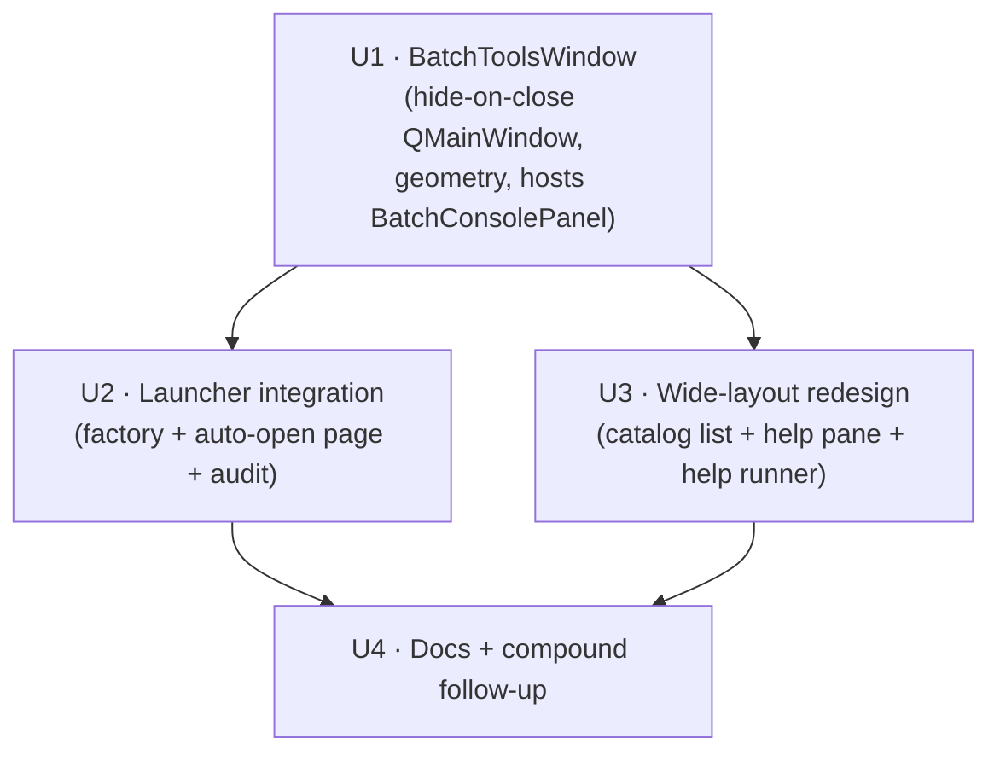

# refactor: Batch Tools opens a dedicated window instead of an inline launcher tab

## Overview

The **Batch Tools** launcher tab currently renders the full batch console
(catalog dropdown, `Show --help`, streaming output, command line, Run/Cancel/
Clear) *inline* in the launcher's stacked content area. The launcher is kept
deliberately narrow (150 px sidebar + a slim content column) so it sits beside
the napari viewer on a single screen — but that width makes the batch console
unusable without resizing the launcher, and then resizing back for viewer work.

This refactor moves the batch console into a **dedicated top-level Batch Tools
window** modeled on how the Viewer tab opens/hides the napari window. Selecting
the Batch Tools sidebar tab **auto-opens/raises** the window; closing it with
the **X hides it** (state, running processes, and geometry preserved), exactly
like the peer-view windows. Inside the window, the console is **redesigned into
a wide side-by-side layout** — a tool catalog and a file navigator on the left,
streaming run output on the right, command line + buttons spanning the bottom —
to exploit the horizontal space a standalone window affords.

---

## Design Evolution (during execution)

The left column changed during execution based on hands-on user testing. The
code is the source of truth; this note supersedes the `--help`-pane details
still described in U3, Key Technical Decisions, and Risks:

- **The dedicated `--help` pane was dropped.** It was too cramped to read, and
  running `<tool> -h` in the command input already prints usage full-width in
  the run console. Removing it also deleted the second `_help_runner` and the
  concurrency edge cases code review flagged (stale-help misattribution, a
  no-cancel stuck-disabled button).
- **A file navigator replaced it** (`task_panels/file_navigator.py`,
  `FileNavigator`): a Spyder-style toolbar — Back / Forward (history), Up, Open
  (native folder dialog), and Go to dataset (☞, jumps to the open `.h5`'s
  folder) — above an editable path field and a `QTreeView`. Double-clicking a
  folder navigates into it; the expand arrow opens the subtree; double-clicking
  a file (or Insert) drops its shell-quoted path into the command input and the
  clipboard. It solves the real pain — composing batch commands without leaving
  PerCell to look up file paths — and is cross-platform (the native dialog and
  editable path field reach drives / UNC shares / `/Volumes`; no hardcoded
  Mac-only buttons).

---

## Problem Frame

The user works on a single screen with the launcher docked narrow next to
napari (screenshot 1). The Batch Tools tab is the one tab whose UI does not fit
that width (screenshot 2): the console output pane, help text, and command line
are all cramped. Today the only remedy is to widen the launcher for batch work
and shrink it again afterward — friction on every context switch between
"drive a batch run" and "inspect cells in napari."

The Viewer tab already solves the analogous problem for napari: the launcher
hosts a compact Open/Hide control, and the heavyweight surface lives in its own
resizable, hide-on-close window (screenshot 3). Batch Tools should follow the
same shape.

This plan was produced via the planning bootstrap (no upstream requirements
document); the two open UX decisions were resolved with the user before writing
(see Open Questions → Resolved During Planning).

---

## Requirements Trace

- R1. The batch console moves out of the narrow launcher content stack into a
  dedicated top-level window, so the launcher can stay narrow beside napari.
- R2. Selecting the **Batch Tools** sidebar tab opens/raises the dedicated
  window (auto-open); the tab's page offers explicit Open and Hide controls, so a
  hidden window is never a dead-end.
- R3. Closing the window with the **X** button hides it (does not destroy it),
  preserving its widgets, any running batch process, and its geometry — mirroring
  the napari viewer and peer-view windows.
- R4. The window remembers its size/position across hide→show and across app
  sessions (QSettings geometry round-trip, per the peer-view convention).
- R5. The window presents the console in a wide side-by-side layout: tool
  catalog + `--help` text on the **left**, streaming run output on the **right**,
  command line + Run/Cancel/Clear spanning the **bottom**.
- R6. All existing batch-console behavior is preserved: catalog listing +
  command resolve, run lifecycle + button toggles, cancel, lock-error rendering,
  success-only reload of the open dataset, and the **Action** contract (the panel
  never writes the five session fields).
- R7. The sidebar toggle is classified and recorded as an **Action** in the GUI
  audit artifacts.

---

## Scope Boundaries

- No change to any `percell4-*` batch CLI tool, to `BatchCommandRunner`'s
  QProcess/process-group mechanics, or to `catalog.py` resolve logic.
- No "Always on top" (or other window-flag) toggle on the new window. (If ever
  added, honor the `setWindowFlag`-hides-visible-widget gotcha — see Context.)
- The window does **not** subscribe to `CellDataModel` / Session events — it
  keeps reading session-derived values (open `.h5` path) on-demand through
  injected getters, exactly as today.
- No change to the Viewer tab, the other sidebar tabs, or the peer-view windows.
- The wide redesign restyles/regroups existing console widgets and adds a
  dedicated help pane; it does not add new batch functionality.

### Deferred to Follow-Up Work

- Record the "hide-while-a-batch-subprocess-is-running" lifecycle decision (see
  Key Technical Decisions) via `/ce-compound` after this lands — the learnings
  search confirmed no existing `docs/solutions/` entry covers QProcess lifecycle
  for a host window that hides rather than closes.

---

## Context & Research

### Relevant Code and Patterns

- **Viewer-tab Open/Hide model to mirror** — `src/percell4/interfaces/gui/task_panels/viewer_panel.py`.
  `ViewerPanel` is injected `show_window: Callable[[str], None]` and
  `get_viewer_window: Callable[[], Any]`; "Open Viewer" → `show_window("viewer")`,
  "Hide Viewer" → `get_viewer_window().hide()`. No launcher reach-through.
- **Window registry + lazy factory** — `src/percell4/interfaces/gui/main_window.py`:
  `self._windows: dict[str, QWidget]` (line 59); `_get_or_create_window(key)`
  builds windows via a `factories` dict (lines 962–998); `_show_window(key)`
  creates-if-needed → unminimize → `show()` → `raise_()` → `activateWindow()`
  (lines 1000–1024). Sidebar/`QStackedWidget` build + `_on_sidebar_click`
  (lines 164–246). `categories` list maps `"Batch Tools"` →
  `_create_batch_console_panel` (line 214). `closeEvent` iterates
  `self._windows.values()` calling `window.close()` (lines 2115–2148).
- **Canonical hide-on-close peer window** — `src/percell4/interfaces/gui/peer_views/data_plot.py`
  and `.../cell_table.py`: `QMainWindow` subclasses whose `closeEvent` does
  `for unsub in self._unsubs: unsub(); self._save_geometry(); self.hide();
  event.ignore()`, each with `_save_geometry`/`_restore_geometry` on a
  per-window `QSettings("LeeLabPerCell4", "PerCell4")` key
  (e.g. `"data_plot/geometry"`), restored in `__init__`.
- **The panel being relocated** — `src/percell4/interfaces/gui/task_panels/batch_console_panel.py`:
  self-contained `QWidget`, injected `get_open_h5_path` / `reload_open_dataset` /
  `show_status` / `runner`; `manages_own_scroll = True`; owns `_combo`, `_view`
  (`AnsiConsoleView`), `_input` (`CommandLineEdit`), `_run_btn`/`_cancel_btn`/
  `_clear_btn`; run lifecycle in `_run_line`/`_on_finished` incl. lock-error and
  success-only reload.
- **The runner (reused as-is, twice)** — `src/percell4/interfaces/gui/task_panels/batch_command_runner.py`:
  `BatchCommandRunner(QObject)` streams one argv via `QProcess`; `is_running`
  guard is per-instance. Instantiating a second one for `--help` is safe (own
  process group, own guard).

### Institutional Learnings

- `docs/solutions/ui-bugs/percell4-phases-0-6-napari-qt-learnings.md` +
  `docs/solutions/architecture-decisions/percell4-code-review-findings-phases-0-6.md`
  — **hide-on-close is the blessed pattern** ("preserves state, signal
  connections, and geometry"). Also records that the team once moved
  *Segmentation from a standalone window to a sidebar tab* to reduce context
  switching — this refactor moves the other way, so the plan justifies why Batch
  Tools is the opposite case (see Key Technical Decisions).
- `docs/solutions/ui-bugs/phasor-plot-deaf-to-session-after-close-reopen-2026-06-18.md`
  — a hide-on-close window that **subscribes** to Session/`CellDataModel` events
  must tear subscriptions down in `closeEvent` **and** idempotently rebuild +
  resync in `showEvent`, or it goes permanently deaf after the first reopen.
  **Mitigation here: the Batch Tools window subscribes to nothing** — it reads
  state on-demand via injected getters — so the trap is avoided by construction.
  Stated explicitly so review can confirm no subscriptions creep in.
- `docs/solutions/ui-bugs/qt-setwindowflag-hides-visible-widget-2026-05-14.md`
  (`applies_to` peer_views/*.py) — only relevant if an "always on top" toggle is
  ever added (out of scope); capture `isVisible()` **before** any `setWindowFlag`.
- `docs/solutions/architecture-decisions/decouple-task-panels-callback-injection.md`
  — inject `Callable` action callbacks + `Callable[[], T | None]` accessors; do
  lambda wiring **only** in the launcher's `_create_*` methods; keep
  `show_status = lambda _: None` defaults so panels stay unit-testable.
- `docs/solutions/architecture-patterns/gui-action-contract-exhaustiveness.md`
  — a show/hide toggle is an **Action** (reads session, writes none of the five
  fields, creates no resource); must have zero off-label side effects; register
  in `docs/audits/gui-element-classification.yaml`.

### External References

None — this is a self-contained Qt refactor over strong, well-exemplified
internal patterns (≥2 direct peer-view precedents). No external research warranted.

---

## Key Technical Decisions

- **Auto-open via the launcher, not the panel's `showEvent`.** The auto-open on
  tab select is wired in `LauncherWindow._on_sidebar_click` (guarded by a stored
  `self._batch_tools_index`), which fires exactly on a genuine tab click and on
  the guarded startup call to index 0 (a no-op for the batch index). Rationale:
  `showEvent` also fires on spontaneous shows (un-minimize, restore) and would
  re-raise unpredictably; the launcher branch is deterministic and directly
  unit-testable. The launcher is the legitimate owner of `_windows` /
  `_show_window`, so this keeps window management in the mediator, not the panel.
- **Auto-open plus explicit Open/Hide controls.** Selecting the Batch Tools tab
  auto-opens the window (the user's fewer-clicks choice), AND the sidebar page
  carries both an "Open Batch Tools" and a "Hide Batch Tools" button — restoring
  parity with the Viewer tab and removing the dead-end where a hidden window would
  otherwise leave the page with only a no-op Hide control. Auto-open stays the
  default fast path; the Open button (calling `show_window("batch_tools")`, which
  create-or-raises) is the manual reopen path. Re-selecting the already-current
  tab also re-fires `clicked` → re-opens. (Resolves the doc-review
  reopen-affordance finding; both buttons stay always-enabled — Open raises an
  already-visible window harmlessly, Hide is a harmless no-op when already hidden
  — so no window-visibility tracking is required.)
- **Wide layout with a dedicated help pane fed by a separate `_help_runner`.**
  `Show --help` streams into the **left** help pane via its own
  `BatchCommandRunner`, independent of the **right** run console. This lets the
  user keep a tool's `--help` on screen while composing and running a command —
  the actual payoff of the wide window. `--help` is instant and non-interactive,
  so a second runner adds no meaningful cost and the per-runner `is_running`
  guard keeps help and runs from interfering.
- **Hide-on-close + QSettings geometry**, copied from `data_plot.py`/`cell_table.py`
  (`closeEvent` → save geometry → `self.hide()` → `event.ignore()`; restore in
  `__init__`; key `"batch_tools/geometry"`).
- **Window hosts `BatchConsolePanel` as its central widget**; the launcher
  factory injects the same callbacks the inline panel receives today
  (`get_open_h5_path`, `reload_open_dataset`, `show_status`). Callback-injection
  pattern preserved.
- **QProcess-on-hide semantics (explicit).** Hiding the window (X or the page's
  Hide button) leaves any in-flight `BatchCommandRunner`/QProcess **running** —
  this is parity with today's behavior, where switching sidebar tabs mid-run does
  not stop the run (the stacked page is never destroyed). App-quit is unchanged:
  `LauncherWindow.closeEvent` already calls `window.close()` on every registry
  window; for the batch window that triggers hide+ignore (same as peer views),
  and the app quits via the launcher's own `event.accept()`. No new termination
  logic is introduced. This decision is the novel bit with no prior learning →
  captured via `/ce-compound` after landing.
- **Why a window here when Segmentation went the other way.** Segmentation was
  moved *into* a tab because it is used continuously in the tight per-cell loop
  alongside the viewer, where a separate window caused constant context
  switching. Batch Tools is **episodic and space-hungry** — kick off / monitor a
  batch run, then return to viewer work — and is *not* part of that inner loop, so
  a dedicated resizable window is the better fit and is what lets the launcher
  stay narrow (the whole point).

---

## Open Questions

### Resolved During Planning

- **Sidebar tab behavior?** → Selecting the Batch Tools tab **auto-opens/raises**
  the window (user's fewer-clicks choice), **and** the page carries both an "Open
  Batch Tools" and a "Hide Batch Tools" button so a hidden window is never a
  dead-end (resolves the doc-review reopen-affordance finding; keeps Viewer-tab
  parity).
- **Window layout?** → **Wide side-by-side redesign**: catalog + `--help` text
  left, streaming output right, command row spanning the bottom (user choice over
  a verbatim relocation of the current stacked layout).

### Deferred to Implementation

- Exact default window size (start ~950×680 and tune so the wide layout is
  comfortable without wasted space) and the left-column width / splitter ratio.
- Final hint copy on the sidebar page (must make "re-select the tab to reopen"
  discoverable). This is implementer-authored guidance text, not a fixed UI label.
- Whether to drop the now-dead `manages_own_scroll` flag and the internal
  `theme.section_label("Batch Tools")` (redundant with the window title) during
  the redesign — cosmetic; leaning "remove the redundant label, keep the flag".
- Help-pane widget: reuse `AnsiConsoleView` (theme parity, `append_output`/
  `clear_output`/placeholder) vs. a read-only `QPlainTextEdit` — leaning
  `AnsiConsoleView`.

---

## High-Level Technical Design

> *This illustrates the intended approach and is directional guidance for
> review, not implementation specification. The implementing agent should treat
> it as context, not code to reproduce.*

Unit dependency graph:



Control flow after the refactor:

```
Launcher sidebar click ("Batch Tools", index N)
        │  _on_sidebar_click(N)
        ├─ setCurrentIndex(N)            → shows the BatchToolsPanel page
        └─ if N == _batch_tools_index    → _show_window("batch_tools")
                                             │
                _get_or_create_window("batch_tools")
                   └─ factory → BatchToolsWindow(get_open_h5_path=…,
                                reload_open_dataset=…, show_status=…)
                        └─ central widget = BatchConsolePanel(<injected>)
                   show() → raise_() → activateWindow()

Window X button → closeEvent → save geometry → hide() → event.ignore()
BatchToolsPanel "Hide Batch Tools" → get_batch_tools_window().hide()
```

Redesigned window layout (R5):

```
PerCell4 — Batch Tools                                   (resizable, geometry saved)
┌────────────────────┬───────────────────────────────────────────────┐
│ Tool catalog       │  $ percell4-batch-cellpose-laptrack …          │
│  • cellpose-…      │  (streaming run output — the RIGHT pane, _view) │
│  • measure         │                                                 │
│  • export          │                                                 │
│ [ Show --help ]    │                                                 │
│ ┌────────────────┐ │                                                 │
│ │ --help text    │ │                                                 │
│ │ (help pane,    │ │                                                 │
│ │  _help_runner) │ │                                                 │
│ └────────────────┘ │                                                 │
├────────────────────┴───────────────────────────────────────────────┤
│ [ command input……………………… ]   [ Run ] [ Cancel ] [ Clear ]           │
└─────────────────────────────────────────────────────────────────────┘
```

---

## Implementation Units

- U1. **`BatchToolsWindow` — hide-on-close host window**

**Goal:** A standalone `QMainWindow` that hosts a `BatchConsolePanel` as its
central widget, hides (not destroys) on close, and persists geometry. No
launcher changes yet — a self-contained, independently testable class.

**Requirements:** R1, R3, R4

**Dependencies:** None

**Files:**
- Create: `src/percell4/interfaces/gui/peer_views/batch_tools_window.py`
- Test: `tests/test_gui/test_batch_tools_window.py`

**Approach:**
- `class BatchToolsWindow(QMainWindow)`, `setWindowTitle("PerCell4 — Batch Tools")`,
  default `resize(~950, 680)`, restore geometry in `__init__`.
- Constructor injects `get_open_h5_path`, `reload_open_dataset`, `show_status`
  (same signatures the inline panel gets today), builds a `BatchConsolePanel`
  with them, and `setCentralWidget(panel)`. Keep a reference (`self._panel`).
- `closeEvent` → `_save_geometry()` → `self.hide()` → `event.ignore()` (copy
  `data_plot.py`/`cell_table.py` verbatim, minus subscription teardown — there
  are none). `_save_geometry`/`_restore_geometry` on QSettings key
  `"batch_tools/geometry"`.
- No Session/`CellDataModel` subscriptions (see Context: deaf-after-reopen trap
  avoided by construction).

**Execution note:** Start with a failing test asserting X→hide (window stays
alive, `isVisible()` False) and geometry round-trip.

**Patterns to follow:**
- `src/percell4/interfaces/gui/peer_views/data_plot.py` (`closeEvent`,
  `_save_geometry`/`_restore_geometry`).

**Test scenarios:**
- Happy path: constructing the window builds a `BatchConsolePanel` central
  widget from the injected callbacks (assert `isinstance(window.centralWidget(),
  BatchConsolePanel)` or `window._panel`).
- Edge case: `closeEvent` hides the window and ignores the event — after
  `window.close()`, the Python object is still alive and `window.isVisible()` is
  False (parity with `test_*` peer-view close behavior).
- Integration: geometry is saved on close and restored on a fresh instance
  (resize, close, re-create, assert restored size) — may stub `QSettings` or use
  the real one under a test org key.
- Happy path: injected `get_open_h5_path`/`reload_open_dataset`/`show_status`
  reach the hosted panel (a run that references the open dataset triggers the
  injected reload) — thin check that wiring passes through.

**Verification:**
- New window opens, resizes, and X-hides without destroying itself; re-showing
  preserves size; the hosted console runs commands.

---

- U2. **Launcher integration — auto-open page, window factory, audit**

**Goal:** Replace the inline batch-console stack page with a compact
`BatchToolsPanel` (hint + "Hide Batch Tools"), register the window in the
launcher factory, and auto-open/raise it when the Batch Tools tab is selected.

**Requirements:** R1, R2, R6, R7

**Dependencies:** U1

**Files:**
- Create: `src/percell4/interfaces/gui/task_panels/batch_tools_panel.py`
- Modify: `src/percell4/interfaces/gui/main_window.py`
- Modify: `docs/audits/gui-element-classification.yaml`
- Test: `tests/test_gui/test_launcher_batch_console_tab.py` (update)
- Test: `tests/test_gui/test_batch_tools_panel.py` (new)

**Approach:**
- `BatchToolsPanel(QWidget)` modeled on `ViewerPanel`: injects `show_window:
  Callable[[str], None]` and `get_batch_tools_window: Callable[[], Any]`; renders
  a section label, a short hint label, an "Open Batch Tools" button →
  `show_window("batch_tools")`, and a "Hide Batch Tools" button →
  `win = get_batch_tools_window(); win and win.hide()`. Both buttons stay
  always-enabled (no visibility tracking needed); optionally refresh their
  enabled-state on `showEvent` as polish. Writes no session fields.
- In `main_window.py`:
  - `_get_or_create_window`: add `"batch_tools": lambda: BatchToolsWindow(
    get_open_h5_path=lambda: getattr(self, "_current_h5_path", None),
    reload_open_dataset=self._reload_current_dataset,
    show_status=lambda msg: self.statusBar().showMessage(msg))` to the `factories`
    dict — moving the exact callback wiring from today's `_create_batch_console_panel`.
  - Replace `_create_batch_console_panel` with `_create_batch_tools_panel`
    returning `BatchToolsPanel(show_window=self._show_window,
    get_batch_tools_window=lambda: self._windows.get("batch_tools"))`; update the
    `categories` entry (line 214).
  - Capture the batch index in the `categories` loop:
    `self._batch_tools_index = i` when `name == "Batch Tools"`.
  - In `_on_sidebar_click(index)`, after `setCurrentIndex`, add:
    `if index == getattr(self, "_batch_tools_index", -1): self._show_window("batch_tools")`.
    (The startup `_on_sidebar_click(0)` won't match → no auto-open at launch.)
- `gui-element-classification.yaml`: add the `BatchToolsPanel` "Hide Batch Tools"
  button and the `_on_sidebar_click` auto-open as **Action** entries, with a
  dated changelog note mirroring the existing comment-block convention.

**Patterns to follow:**
- `src/percell4/interfaces/gui/task_panels/viewer_panel.py` (Open/Hide injection).
- Existing `categories`/`_on_sidebar_click` build in `main_window.py`.

**Test scenarios:**
- Happy path: selecting the Batch Tools tab calls `_show_window("batch_tools")`
  (spy/monkeypatch `_show_window`; call `_on_sidebar_click(batch_index)`; assert
  called once with `"batch_tools"`).
- Edge case: `_on_sidebar_click(0)` (startup/I-O tab) does **not** auto-open the
  batch window.
- Happy path: the Batch Tools page is a `BatchToolsPanel` with a "Hide Batch
  Tools" button whose click calls `hide()` on the resolved window (fake window
  records the call); no-op when the window was never created.
- Happy path: the page's "Open Batch Tools" button calls
  `show_window("batch_tools")` (spy the injected callback) — the manual reopen
  path when the window is hidden.
- Integration: `_get_or_create_window("batch_tools")` returns a `BatchToolsWindow`
  and stores it in `_windows["batch_tools"]`; a second call returns the same
  instance.
- Action guard (source grep, like `test_panel_never_writes_session_fields`):
  `batch_tools_panel.py` contains no `set_active_*` / `set_filter` / `set_selection`.
- Preserved: sidebar still shows "Batch Tools" immediately after "Workflows" and
  the earlier tab order is unchanged (existing assertions keep passing).
- Update `test_batch_console_factory_returns_panel`: the Batch Tools factory now
  returns a `BatchToolsPanel` (not `BatchConsolePanel`), so the
  `manages_own_scroll is True` assertion no longer applies and is replaced with a
  `BatchToolsPanel` type check.

**Verification:**
- Clicking the Batch Tools sidebar entry opens the window; the page's Hide button
  hides it; the launcher content column stays narrow; audit YAML lists the new
  Actions.

---

- U3. **Wide side-by-side redesign of `BatchConsolePanel` + file navigator**

**Goal:** Rebuild the console layout to use horizontal space — a tool catalog
and a file navigator on the left, the run console on the right, the command row
across the bottom. All existing run behavior preserved. (Design pivot: the
originally-planned `--help` pane was replaced by the file navigator — see Design
Evolution.)

**Requirements:** R5, R6

**Dependencies:** U1 (the window that hosts this panel)

**Files:**
- Modify: `src/percell4/interfaces/gui/task_panels/batch_console_panel.py`
- Create: `src/percell4/interfaces/gui/task_panels/file_navigator.py`
- Test: `tests/test_gui/test_batch_console_panel.py` (update)
- Test: `tests/test_gui/test_file_navigator.py` (new)

**Approach:**
- Rework `_build_ui` into a `QSplitter` top region + a full-width bottom command
  row:
  - **Left column:** a `QListWidget` catalog (replacing `_combo`) populated from
    `list_batch_tools()` (item text = tool name, tooltip = summary, name via
    `setData(Qt.UserRole, name)`); `setCurrentRow(0)` seeds the first tool, and
    selecting an item inserts the tool name into the command input. Below it, a
    `FileNavigator` whose `path_chosen` signal inserts the chosen path
    (shell-quoted) into the command input and copies it to the clipboard.
  - **Right pane:** the existing run console `_view` (`AnsiConsoleView`).
  - **Bottom row (full width):** `_input` + Run/Cancel/Clear, unchanged wiring.
- `FileNavigator` (`file_navigator.py`): a Spyder-style navigation toolbar —
  Back / Forward (directory history), Up (parent), Open
  (`QFileDialog.getExistingDirectory`), and Go to dataset (☞ — jumps to the
  folder of the open `.h5` via an injected `get_dataset_dir`, enabled only when
  one is open) — above an editable path field (type/paste any path + Enter) and
  a `QTreeView` (Name column, `setExpandsOnDoubleClick(False)`). Double-clicking
  a folder re-roots into it (recorded in Back/Forward history); the expand arrow
  opens the subtree in place; double-clicking a file — or Insert on a selection
  — emits `path_chosen` with the absolute path. Cross-platform: the native
  dialog and path field reach drives / UNC shares / `/Volumes`.
- To read a tool's usage, run it with `-h` / `--help` in the command input — it
  streams full-width into the run console (no dedicated help pane).
- Keep the **main** run path — `_view`, `_input`, `_run_btn`/`_cancel_btn`/
  `_clear_btn`, `_run_line`, `_on_finished`, lock-error and success-only-reload
  logic — behaviorally unchanged. `_set_running` toggles only Run/Cancel (the
  removed `_combo` is gone; the catalog and navigator stay enabled during runs).
  Drop the redundant internal `theme.section_label("Batch Tools")`.
- Preserve the Action contract: neither the panel nor the navigator writes
  session fields.

**Execution note:** Keep the run-console (`_view`) and main `runner` path
untouched so the existing lifecycle tests keep passing.

**Patterns to follow:**
- Existing `_populate_catalog` / `_on_catalog_selected` / `_run_line` in the
  same file; `AnsiConsoleView` usage.
- Qt standard icons via `self.style().standardIcon(QStyle.StandardPixmap.*)`;
  `QFileSystemModel` + `QTreeView`.

**Test scenarios:**
- Happy path: selecting a catalog list item inserts that tool name into `_input`.
- Happy path: a `FileNavigator.path_chosen` emission inserts the shell-quoted
  path into `_input`.
- Happy path (unchanged): a known command runs on the main runner with the
  module argv and toggles Run/Cancel/Clear; `emit_finished(0)` renders
  `[Done] Exit 0`.
- Error path (unchanged): unknown command / unbalanced quote render `[Error]`
  and never call the runner.
- Error path (unchanged): lock-error output renders "is locked" and does not
  reload.
- Integration (unchanged): success + open-dataset reference fires the injected
  reload exactly once; a different file does not.
- Edge case: `_set_running(True)` leaves the catalog and navigator enabled and
  raises no `AttributeError` (there is no `_combo`).
- Navigator: starts at the given dir; Up goes to the parent; Back/Forward walk
  the history and enable/disable correctly; a new navigation truncates forward
  history.
- Navigator: Open (monkeypatched dialog) navigates to the picked dir; cancel is
  a no-op; Go to dataset jumps to the injected dataset dir and is disabled when
  none is open.
- Navigator: double-clicking a folder re-roots into it; double-clicking a file
  emits its path; Insert emits the current selection; the editable path field
  navigates to a typed dir (file → parent; unknown → restores current).
- Action guard (unchanged): sources contain none of the forbidden session
  mutators.
- Startup (unchanged): panel instantiates headless — run `_view` empty, `_input`
  seeded with the first `percell4-` tool name.

**Verification:**
- The window shows the catalog + file navigator on the left and the run console
  on the right; navigating and inserting paths composes commands without leaving
  PerCell; every prior console behavior holds.

---

- U4. **Docs + compound follow-up**

**Goal:** Update module documentation to the new state and record the novel
QProcess-on-hide decision.

**Requirements:** R6 (documentation of preserved contracts)

**Dependencies:** U2, U3

**Files:**
- Modify: `src/percell4/CLAUDE.md` (interfaces/gui description)
- Follow-up (post-merge): `/ce-compound` capture of the hide-while-running decision

**Approach:**
- In `src/percell4/CLAUDE.md`, update the `interfaces/gui/` bullet: note that the
  Batch Tools tab now auto-opens the standalone `peer_views/batch_tools_window.py`
  (`BatchToolsWindow`, hide-on-close), that `task_panels/batch_tools_panel.py`
  is the compact Open/Hide sidebar page, and that `batch_console_panel.py` now
  lives inside that window with the wide layout + dedicated help runner. Describe
  current state only (no history), per the Documentation Rules.
- After merge, run `/ce-compound` to write a `docs/solutions/` entry recording
  the QProcess/subprocess-continues-while-host-window-hidden decision and the
  app-quit parity reasoning (the search confirmed this is undocumented territory).

**Test expectation:** none — documentation and a post-merge follow-up only.

**Verification:**
- `src/percell4/CLAUDE.md` matches the shipped structure; a `/ce-compound` note
  is filed for the lifecycle decision.

---

## System-Wide Impact

- **Interaction graph:** `_on_sidebar_click` gains one guarded branch;
  `_get_or_create_window` gains one factory entry; `closeEvent` already iterates
  `self._windows` and will now also `close()` the batch window → hide+ignore
  (benign, matches peer views). No other call sites change.
- **Error propagation:** unchanged — the console's lock-error rendering and
  success-only reload are preserved verbatim; the help runner's failures render
  in the help pane only.
- **State lifecycle risks:** the window and its panel persist while hidden, so a
  running batch process continues across hide (X or Hide button) — intended
  parity with today's tab-switch-keeps-running. No partial-write or duplicate
  concerns are introduced (batch writes remain per-operation in the CLI).
- **API surface parity:** none — no CLI/exported contract changes; purely GUI.
- **Integration coverage:** the launcher↔window auto-open wiring and the
  window↔panel callback pass-through are covered by U1/U2 integration tests that
  mocks alone would miss.
- **Unchanged invariants:** the `BatchConsolePanel` **Action** contract (never
  writes the five session fields), the run lifecycle + button toggles, the
  success-only reload of the open dataset, and every other sidebar tab / peer
  window remain exactly as before.

---

## Risks & Dependencies

| Risk | Mitigation |
|------|------------|
| Wide redesign (U3) regresses console run behavior | Land U1 first (window hosts today's console unchanged); U3 keeps `_view`/`_input`/main `runner` and all lifecycle code intact, changing only the help path + catalog widget; existing lock/reload/cancel tests must stay green. |
| Hidden window leaves the user with no obvious way back | The sidebar page carries an explicit "Open Batch Tools" button (plus auto-open on tab-select and re-clicking the current tab re-fires `_on_sidebar_click`) — a hidden window is never a dead-end. |
| Hidden window leaves a batch subprocess running on quit | Pre-existing semantics (tab-switch already keeps runs alive); app-quit path unchanged; decision recorded via `/ce-compound` (U4). |
| Two runners (`runner` + `_help_runner`) confuse output routing | Separate panes (right=run, left=help) and per-runner `is_running` guards; `--help` is instant and non-interactive. |
| Deaf-after-reopen trap for hide-on-close windows | Avoided by construction — the window subscribes to no Session/`CellDataModel` events and reads state on-demand; U1/U2 review confirms no subscriptions added. |

---

## Documentation / Operational Notes

- `docs/audits/gui-element-classification.yaml` gains the new Batch Tools
  Action(s) with a dated changelog note (U2).
- `src/percell4/CLAUDE.md` updated to the new interfaces/gui structure (U4).
- Post-merge `/ce-compound` records the QProcess-on-hide lifecycle decision (U4).
- GUI/napari tests run on CI only (local mixed-Qt venv segfaults) — validate the
  new `test_gui/` tests on CI, per project convention.

---

## Sources & References

- Origin document: none (planning bootstrap; UX decisions resolved with the user).
- Relevant code: `src/percell4/interfaces/gui/main_window.py`,
  `src/percell4/interfaces/gui/task_panels/viewer_panel.py`,
  `src/percell4/interfaces/gui/task_panels/batch_console_panel.py`,
  `src/percell4/interfaces/gui/task_panels/batch_command_runner.py`,
  `src/percell4/interfaces/gui/peer_views/data_plot.py`,
  `src/percell4/interfaces/gui/peer_views/cell_table.py`.
- Institutional learnings: `docs/solutions/ui-bugs/percell4-phases-0-6-napari-qt-learnings.md`,
  `docs/solutions/ui-bugs/phasor-plot-deaf-to-session-after-close-reopen-2026-06-18.md`,
  `docs/solutions/architecture-decisions/decouple-task-panels-callback-injection.md`,
  `docs/solutions/architecture-patterns/gui-action-contract-exhaustiveness.md`,
  `docs/solutions/ui-bugs/qt-setwindowflag-hides-visible-widget-2026-05-14.md`.
- Prior art: `docs/plans/2026-07-02-001-feat-batch-tools-console-plan.md` (created
  the batch console being relocated).
