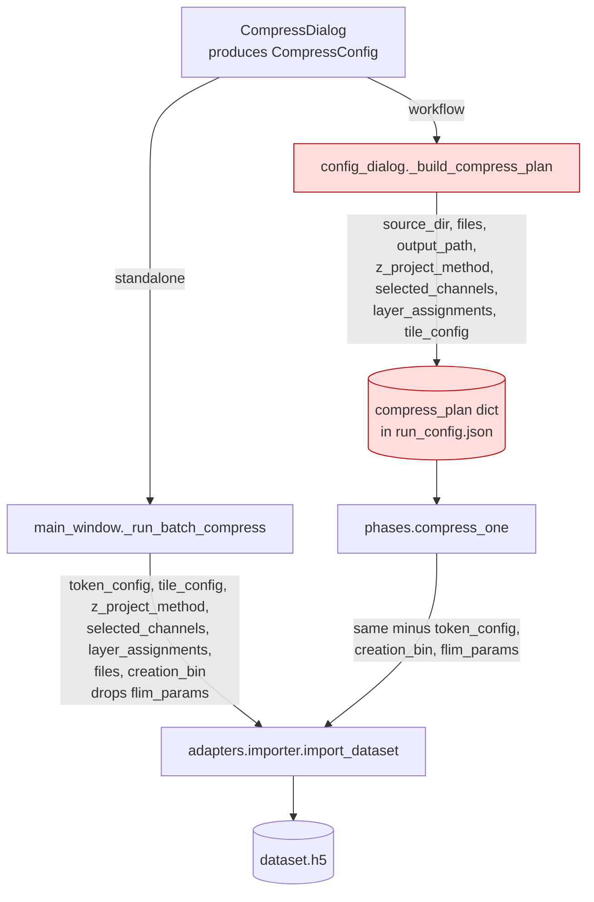

# fix: Single-cell workflow — TIFF-start ingest parity, optional seg-QC, CNR mask measurement

## Overview

Three independent defects in the single-cell thresholding workflow, each traced to a
concrete line of code during planning:

1. **TIFF-start runs silently produce a broken `.h5`.** Phase 0 compression exists and is
   wired correctly, but the compress *plan* the config dialog serializes drops four fields
   that `CompressConfig` carries — most importantly `token_config`. `phases.compress_one`
   therefore calls `import_dataset` with the default `TokenConfig()` (`channel=r"_ch(\d+)"`),
   so any TIFF naming convention other than the built-in `_chNN` — including the tokenless
   named-channel import shipped 2026-07-23 — parses to zero channel groups and writes an
   `.h5` with no `/intensity` and empty `channel_names`. Everything downstream then fails.
   The standalone Import Dataset path threads `token_config` correctly, which would explain why
   the workflow "only works when it starts with `.h5` files." **This diagnosis is inferred from
   code, not from an observed failure** — no traceback or failing run was ever captured. One
   example filename from the researcher's TIFF set confirms or falsifies it, and U1 gates
   implementation on that check.

2. **Segmentation QC cannot be turned off for segmentations the workflow creates.**
   `WorkflowConfig.run_seg_qc_on_existing` gates the *pre-existing* segmentation path only;
   its own docstring states that Cellpose-segmented-this-run datasets always run seg-QC.
   The only escape is the `interactive_qc` constructor kwarg, which tests use and the
   launcher never passes. Note the boundary carefully: a re-run over datasets that already
   carry a segmentation is diverted by `_detect_existing_segmentation` into the pre-existing
   branch, so it is already governed by `run_seg_qc_on_existing`. The gap this fixes is a
   **first** pass over fresh datasets with Cellpose parameters the researcher already trusts.

3. **Analyze-particles never sees CNR-separated masks.** `_measure_round_specs_for` returns
   `config.thresholding_rounds` verbatim, and the CNR post-step mints `<round>_low` /
   `<round>_high` as masks that are deliberately *not* rounds. This is documented deferred
   v1 behavior rather than a regression, and the `percell4-batch-measure` CLI already does
   the right thing — so this is a GUI/CLI parity gap to close.

---

## Problem Frame

The single-cell thresholding workflow is the primary batch analysis surface: a researcher
points it at a set of datasets, configures Cellpose plus an ordered list of thresholding
rounds, and gets per-cell and per-particle measurements out the far end.

Today that promise holds only for a narrow input shape. A researcher who starts from raw
`.tiff` acquisitions must first run Import Dataset manually, then re-enter the workflow
dialog and add the resulting `.h5` files — the "Add .tiff files..." button in the workflow's
own dataset picker appears to work, accepts the configuration, runs Phase 0 without raising,
and then fails obscurely in later phases. Because compression "succeeded," the failure
surfaces as a channel or measurement error minutes into a long run.

Two smaller frictions compound it. Every Cellpose segmentation the workflow produces forces an
interactive QC pause. That is the right default the first time through, but wrong for a batch
of new datasets where the Cellpose parameters are already settled — and there is no way to
decline it, so an otherwise unattended overnight run stops at the first dataset waiting for a
human. And when a round is configured with CNR subpopulation splitting, the resulting low/high
population masks are written to the `.h5` but never measured, so the researcher has to re-run
the whole workflow a second time in existing-mask mode to get particle statistics for them.

---

## Requirements Trace

- R1. A run whose datasets are added via "Add .tiff files..." compresses to `.h5` with the
  same fidelity as the standalone Import Dataset path, then completes the remaining phases.
- R2. The TIFF-start path carries runner-level regression coverage, not just plan-serialization
  unit coverage.
- R3. A TIFF-start dataset that cannot satisfy a configured round (e.g. a µm-unit size knob
  with no pixel size in the source TIFF metadata) fails with a clear, early, per-dataset
  message rather than deep inside threshold apply.
- R4. The researcher can turn off segmentation QC for segmentations the workflow itself
  creates, independently of the existing pre-segmented toggle.
- R5. When seg-QC is skipped, the run log and status line say so explicitly — an unreviewed
  segmentation is never handed downstream silently.
- R6. Particle analysis measures the CNR population masks (`<round>_low`, `<round>_high`)
  produced during the run, in both single-timepoint and time-lapse runs.
- R7. CNR population mask columns reach `combined.csv` and the per-dataset CSVs, not just
  `measurements.parquet` and `particles.parquet`. `summary_groups.csv` is explicitly **not**
  covered: `_build_summary_groups` selects rows by a `group_<round_name>` column that exists
  only when a `/groups/<name>` table was written, and the CNR post-step writes masks plus
  `/classification/<round>` but never a `/groups/<round>_low` table. Group summaries for
  population masks would require a new write path, which this plan does not scope.
- R8. Existing `.h5`-start runs **with no `cnr_classify` round** are byte-identical in behavior.
  Runs that do configure a `cnr_classify` round gain the population-mask measurements and CSV
  columns described in U5/U6 regardless of dataset source — `cnr_classify` is a per-round
  setting orthogonal to `DatasetSource`, so this is by design, not a leak. Legacy
  `run_config.json` files still deserialize in every case.

---

## Scope Boundaries

- Not merging `WorkflowConfigDialog._build_compress_plan` and
  `LauncherWindow._run_batch_compress` into one shared batch-compress executor. See
  *Alternative Approaches Considered* — the field-parity fix is the bounded version of that
  refactor and is what this plan does.
- Not fixing import atomicity. `import_dataset` calls `store.create()` rather than
  `DatasetStore.create_atomic`, so a crash mid-import leaves a visible partial `.h5`. That is
  the open `import-atomicity-converge` thread in `docs/audits/canonical-sources-matrix.yaml`
  and is orthogonal to this bug.
- Not covering CNR masks produced outside a workflow run. There are **three** CNR mask
  families in this codebase, and U5/U6 address only the first:
  1. `<round>_low` / `<round>_high`, minted by the CNR post-step of a `cnr_classify` round
     during a workflow run — **in scope**.
  2. `<base>_low` / `<base>_high` written by the adaptive-clip panel
     (`src/percell4/gui/adaptive_clip_panel.py`), where `<base>` is a panel-chosen name that
     matches no configured round — **out of scope**; U5's per-round probe cannot see them.
  3. `<base>_seg1..N` written by the interactive CNR segmenter
     (`src/percell4/gui/cnr_segmenter.py`) — **out of scope**.
  Families 2 and 3 come from GUI-only paths that never enter a `WorkflowConfig`; measuring them
  is served today by existing-mask mode. **Confirm with the researcher which family they meant
  before implementing U5** — if they meant 2 or 3, the right shape is the opt-in "measure all
  masks present" toggle described under Alternative Approaches, not U5's name prediction.
- Not changing threshold-QC gating, which is method-derived (adaptive-clip and auto-extract
  rounds always apply headlessly) and works as intended.
- Not changing the Segmentation Selection or Mask reuse pickers to show TIFF-pending
  datasets. Those datasets genuinely have no layers until the run starts; the empty-picker
  behavior is correct.
- Not aligning the compressed `.h5` filename with `dataset_name_overrides` on the workflow path.
  The standalone `_run_batch_compress` renames `<source>.h5` to `<display_name>.h5`; the
  workflow does not, so a renamed dataset's CSV rows are keyed to the display name while the
  file on disk keeps the source name. This serves none of R1-R8, changes where files land on
  disk, and carries a state-lifecycle risk if a run is interrupted mid-rename. Tracked as
  follow-up. R1's "same fidelity" therefore means channel/pixel/binning fidelity, not filename
  parity.
- Not adding group summaries (`/groups/<round>_low`) for CNR population masks. See R7.

---

## Context & Research

### Relevant Code and Patterns

**Item 1 — TIFF ingest**

- `src/percell4/gui/workflows/single_cell/config_dialog.py` — `_build_compress_plan` (~line 173)
  is the producer; `_add_tiff_via_compress_dialog` (~line 1583) is its only caller.
- `src/percell4/workflows/phases.py` — `compress_one` (line 84) is the consumer; it reads
  `source_dir`, `files`, `output_path`, `z_project_method`, `selected_channels`,
  `layer_assignments`, `tile_config`, and `creation_bin`.
- `src/percell4/adapters/importer.py` — `import_dataset` (line 95) is the single canonical
  ingest function. Its signature accepts `token_config`, `flim_params`, and `creation_bin`.
- `src/percell4/domain/io/models.py` — `CompressConfig` (line 305) carries `token_config`,
  `flim_params`, `creation_bin`, and `dataset_name_overrides`; `TokenConfig` (line 14) is four
  optional regex strings, trivially JSON-safe.
- `src/percell4/gui/compress_dialog.py` — `_current_token_config` (line 659) returns either the
  user's edited regexes or the cached `_tokenless_token_config` synthesized by
  `discover_tokenless`; it is threaded to the standalone path at line 546.
- `src/percell4/interfaces/gui/main_window.py` — `_run_batch_compress` (~line 1103) is the
  closest reference consumer, and renames `output_path` to `<display_name>.h5` at lines
  1152-1154. It is *not* a complete reference: it passes `token_config`, `tile_config`,
  `z_project_method`, `selected_channels`, `layer_assignments`, `files`, and `creation_bin`,
  but **omits `flim_params`** even though `CompressDialog` populates it. That is a separate
  pre-existing gap in the standalone path — see U1's approach for how this plan handles it.

**Item 2 — seg-QC gating**

- `src/percell4/gui/workflows/single_cell/runner.py` — the pre-existing-segmentation gate is at
  line 339-343; the fresh-Cellpose seg-QC yield is gated only by `self._interactive_qc`
  (~line 385+).
- Mirror pattern for threading a single boolean, established by `run_seg_qc_on_existing`:
  `models.py:683` (field) → `artifacts.py:447` / `:479` (round-trip) →
  `config_dialog.py:606` (checkbox, built in `_build_segmentation_group` ~line 585) →
  `config_dialog.py:2297` (read at Start) → `runner.py:341` (gate).
- "Never silently skip QC" convention: the headless threshold-apply handler
  (`runner.py:1032-1049`) stamps a `"...applied headlessly (no QC step)"` message and an
  `event="done_no_qc"` run-log entry.

**Item 3 — CNR mask measurement**

- `src/percell4/gui/workflows/single_cell/runner.py` — `_measure_round_specs_for` (line 154)
  is the single place round specs are chosen, and already demonstrates synthesizing
  measure-only `ThresholdingRound` specs from mask names for existing-mask mode.
- `src/percell4/workflows/phases.py` — `_classify_and_write_cnr` (line 1048) and
  `_classify_and_write_cnr_stack` (line 1138) write `/masks/<round>_low`, `/masks/<round>_high`,
  and `/classification/<round>`. Consumers: `measure_one` (line 2009) via `_read_round_layers`
  (~line 2046), and `measure_particles_one` (line 2273) / `_measure_particles_timelapse`
  (line 2198).
- `src/percell4/workflows/models.py:726-741` already reserves the `_low` / `_high` suffixes
  against round-name collision, so the naming is a validated contract rather than a convention.
- `src/percell4/interfaces/cli/batch_measure.py:177-216` is the canonical prior art: it
  defaults to `store.list_masks()` and synthesizes specs in a local `_specs_for`.
- Export plumbing: `runner.py:1258-1270` already supports a `round_names` override into
  `export_run`; `config_dialog.py` `_build_selected_csv_columns` (~line 2478) drives which
  columns survive `_ordered_csv_columns` (`phases.py:2444`).

### Institutional Learnings

- `docs/solutions/architecture-patterns/channel-name-contract-and-tokenless-discovery-2026-07-23.md`
  — the directly applicable doc for item 1. Two rules: one canonical function owns the
  cross-layer channel-name string, and when a pipeline is value-agnostic about a token you
  **synthesize a `TokenConfig` and return it** so the importer re-parses the identical regex,
  rather than forking a parallel scan/group/import path. The workflow's compress plan is
  exactly the fork this warns about. Contract is pinned by
  `tests/test_gui_workflows/test_channel_name_derivation.py`, which round-trips through a real
  HDF5 file.
- `docs/solutions/architecture-patterns/adding-thresholding-method-to-single-cell-workflow-2026-06-15.md`
  — the QC-skip shape (route to the headless handler and emit an explicit run-log line, never
  infer a skip from silence) and the physical-unit chain (pre-flight + runtime backstop, never
  default to 1 µm/px). Both feed U3 and U4.
- `docs/solutions/conventions/gui-panel-and-batch-workflow-method-parity-2026-07-13.md` — GUI
  and workflow paths for the same operation must map 1:1 and thread *every* exposed parameter.
  A ~10× mask-density divergence was the cost last time this was violated. This is the same
  class of defect as item 1 and the same class as item 3's GUI/CLI gap.
- `docs/solutions/architecture-patterns/extending-per-cell-detection-to-time-lapse-2026-06-25.md`
  — the CNR reference. Relevant to U6: `_low` means *unclassified*, not *dim*, when a frame
  does not split (`n_subpopulations == 1`); the per-focus table lives at
  `/classification/<round>`, never `/measurements`; a stack must emit exactly `T` planes.
- `docs/solutions/ui-bugs/napari-mask-layer-misclassified-as-segmentation.md` — mask/label
  enumeration must filter (`list_labels() − list_masks()`), not just list. Keep intact while
  touching enumeration in U6.
- `docs/solutions/architecture-patterns/creator-contract-four-step-sequence-2026-05-18.md` —
  registered as applicable to `runner.py` by `scripts/learnings_applicability.py`. No new
  Creator is introduced by this plan; confirm that stays true during implementation.

### Verification performed during planning

- `grep -n "token_config" src/percell4/workflows/phases.py src/percell4/gui/workflows/single_cell/config_dialog.py`
  returns **nothing** — confirming the field is neither serialized nor consumed.
- `compress_one` reads `plan.get("creation_bin", 1)` but `_build_compress_plan` never writes
  the key, so the dialog's binning spinbox is silently ignored on the workflow path.
- `grep -rl "TIFF_PENDING\|tiff_pending" tests/` hits only `test_config_dialog.py`,
  `test_channel_name_derivation.py`, `test_phases_compress_tile_config.py`, `test_artifacts.py`,
  and `test_models.py` — no runner-level test drives Phase 0 into Phase 1. (The uppercase-only
  pattern misses `test_channel_name_derivation.py`; the conclusion is the same either way.)
- Local baselines are green: `tests/test_workflows` 423 passed; `tests/test_io` +
  `tests/test_measure` 615 passed. GUI tests were not run locally (known mixed-Qt segfault;
  they run on CI).

### Why this surfaced now

A search of the last 30 days of session history found no prior report of this failure, and no
prior request for either the seg-QC toggle or CNR mask measurement — all three are newly
raised. That timing fits the root cause: `token_config` only became load-bearing for the
workflow when tokenless named-channel import shipped on 2026-07-23 (commits `075d92b4`,
`13f8a57a`). Before that, a researcher using the default `_chNN` naming got a `TokenConfig()`
that happened to be correct, so dropping the field was invisible. The tokenless path
synthesizes a `TokenConfig` inside `CompressDialog` and depends on it being threaded through —
which the standalone import path does and the workflow path does not.

That same history search also surfaced a mid-run failure mode worth carrying into U3: a
2026-07-17 session hit `BlockingIOError` (errno 35) from `store.write_mask`, because
`h5py.File(path, "a")` requests a non-blocking exclusive lock that fails if *any* other handle
holds the file — including a read-only one in the same process. Any post-compress validation
that opens the freshly written `.h5` needs to close its handle cleanly.

---

## Key Technical Decisions

- **Fix item 1 by achieving field parity in the existing plan dict, not by refactoring the two
  compress paths into one.** The plan dict is already the serialized contract persisted into
  `run_config.json`; widening it is additive, testable, and back-compatible. Unifying the two
  callers is the better long-term shape but is a much larger blast radius for a bug the user
  is hitting now.
- **Make the plan-dict serializer a single tested function with an explicit field list.**
  `_build_compress_plan` gains the missing keys, and a test asserts every `CompressConfig`
  field that `import_dataset` accepts is represented. That converts "someone forgets a key
  again" from a silent data bug into a failing test — this is the third time a dropped
  compress-plan key has caused a defect (`tile_config` previously, per its own docstring).
- **Deserialize `token_config` defensively with `TokenConfig()` as the fallback.** A legacy
  `run_config.json` written before this change has no key and must reconstruct to exactly
  today's behavior.
- **Add a new boolean rather than repurposing `run_seg_qc_on_existing`.** The two paths are
  genuinely different decisions: reviewing someone else's segmentation versus reviewing one you
  just produced. Per the "own field, own validated default" learning, the new flag gets its own
  name and its own default (`True`, preserving current behavior).
- **Derive CNR measure specs from what is on disk, not from config alone.** CNR masks are
  minted mid-run and a non-splitting dataset produces none, so the spec list must be built
  per-dataset at measure time by intersecting the expected suffixed names with
  `store.list_masks()`. This mirrors `_measure_round_specs_for`'s existing per-dataset shape
  and the CLI's `list_masks()` default.
- **Predict CNR CSV column names at config time.** The `_low` / `_high` suffixes are already a
  validated contract in `models.py`, so the config dialog can emit columns for
  `<round>_low` / `<round>_high` whenever `cnr_classify` is set, without knowing whether a
  given dataset will actually split. Be precise about what that buys, because
  `_ordered_csv_columns` drops any selected column not present in the aggregated frame: when
  **at least one** dataset in the run produced a population mask, the non-splitting datasets get
  that column null-filled by `unify_schemas` — empty but present. When **no** dataset in the run
  splits, the column is absent from the CSV entirely. Both outcomes are acceptable; the plan
  must not promise "empty rather than missing" unconditionally, and U6's tests assert each case
  separately.

---

## Open Questions

### Resolved During Planning

- *Is the TIFF path unimplemented, or implemented and broken?* Implemented and broken. Phase 0,
  `DatasetSource.TIFF_PENDING`, `compress_plan`, the entry swap, and the tiff-aware channel
  intersection are all present and correct. Exactly four `CompressConfig` fields are dropped at
  the serialization boundary.
- *Is item 3 a regression?* No. `docs/plans/2026-06-24-001-feat-alc-auto-extract-cnr-workflow-plan.md`
  (lines 137-147 and 828-829) states explicitly that CNR population masks are intentionally not
  measured in v1. This plan closes that deferral.
- *Does `run_seg_qc_on_existing` already cover item 2?* No — its docstring at `models.py:678-684`
  explicitly excludes the fresh-Cellpose path.
- *Where should the CNR fix land — runner or phases?* The runner's `_measure_round_specs_for`.
  It is the single existing choke point for "which masks does measure see," it is already
  per-dataset, and it keeps `phases.py` free of naming-convention knowledge.

- *Is `flim_params` JSON-safe?* Yes — `CompressDialog.compress_config` builds it entirely from
  spinbox ints, floats, and `currentText()` strings, including the `bin_dimensions` sub-dict.
  It serializes without transformation, so U1 needs no fallback scope reduction.
- *Does `summary_groups.csv` cover CNR population masks?* No, and it cannot without a new write
  path. `_build_summary_groups` keys off `group_<round_name>` columns that require a
  `/groups/<name>` table, which the CNR post-step never writes. R7 was narrowed accordingly.
- *Should the U1 output-path rename ship here?* No — moved to Scope Boundaries as follow-up. It
  serves no listed requirement and changes on-disk layout.

### Confirmed by the researcher (2026-07-27)

- **The failing TIFFs use named channels with no token** (the tokenless named-channel import
  shipped 2026-07-23). This **confirms the root-cause diagnosis**: `discover_tokenless`
  synthesizes a `TokenConfig` inside `CompressDialog`, the workflow's compress plan drops it,
  and `import_dataset` falls back to `channel=r"_ch(\d+)"`, which matches none of the files.
  U1's reproduce-first gate is satisfied — no re-diagnosis needed, though the integration test
  should still use a tokenless fixture so the regression is pinned to the real case.
- **"The CRN separated masks" means workflow-round `<round>_low` / `<round>_high`** — family 1
  in Scope Boundaries. U5/U6's per-round derivation is the right shape; the opt-in measure-all
  alternative is not needed, and families 2 and 3 stay out of scope as written.

### Deferred to Implementation

- The exact user-facing checkbox label for U4. A draft is proposed in the unit; the researcher's
  wording is authoritative if they state one, per the project convention that user-specified UI
  labels are fixed requirements.
- Whether to also thread `flim_params` in `_run_batch_compress` so the standalone and workflow
  paths stay identical, or accept the workflow being the stricter path. See U1.

---

## High-Level Technical Design

> *This illustrates the intended approach and is directional guidance for review, not
> implementation specification. The implementing agent should treat it as context, not code to
> reproduce.*

The two ingest chains, and where they diverge:



The dropped `token_config` is the load-bearing one. Its effect:

```
TokenConfig() default          →  channel pattern r"_ch(\d+)"
tokenless / custom-named TIFFs →  no filename matches the pattern
_group_by_channel              →  every file keyed under ""
selected_channels filter       →  {"DNA", "SG_mask"} matches nothing
result                         →  .h5 with no /intensity, channel_names == []
```

The fix restores parity at the serialization boundary; the plan dict becomes a faithful
projection of the `CompressConfig` fields `import_dataset` consumes.

For item 3, the measure-spec derivation gains one branch:

```
_measure_round_specs_for(entry):
    if use_existing_masks:        → synthesize from existing_mask_selections   (unchanged)
    else:
        specs = list(config.thresholding_rounds)                               (unchanged)
        for round with cnr_classify set:                                       (new)
            for suffix in ("_low", "_high"):
                if f"{round.name}{suffix}" in store.list_masks():
                    specs.append(measure-only spec for that name)
        return specs
```

---

## Delivery Sequencing

The three items are independent — U1, U4, and U5 have no dependency on each other — so they do
not need to ship together, and item 1 is the only one that *blocks* the researcher. Items 2 and
3 are conveniences with working (if tedious) workarounds. Ship in two increments so the blocking
fix is not gated on the enhancements:

- **Increment A (unblock): U1 → U2 → U3**, plus the U1/U3 slice of U7. Verify against the
  researcher's actual failing TIFF set before starting, and again after.
- **Increment B (enhancements): U4, and U5 → U6**, plus the rest of U7. U4 is independent of
  U5/U6 and can land on its own.

Within an increment the arrow order is the dependency order. U7 is split rather than held to the
end so no increment ships with stale documentation.

---

## Implementation Units

- U1. **Compress-plan field parity for TIFF-start runs**

**Goal:** Make the workflow's Phase 0 compression produce the same `.h5` as the standalone
Import Dataset path for the same `CompressDialog` settings.

**Requirements:** R1, R8

**Dependencies:** None

**Files:**
- Modify: `src/percell4/gui/workflows/single_cell/config_dialog.py` (`_build_compress_plan`)
- Modify: `src/percell4/workflows/phases.py` (`compress_one`)
- Test: `tests/test_workflows/test_phases_compress_tile_config.py`
- Test: `tests/test_gui_workflows/test_config_dialog.py`

**Approach:**
- Add `token_config` (serialized as the four optional regex strings), `creation_bin`, and
  `flim_params` to the plan dict produced by `_build_compress_plan`.
- In `compress_one`, deserialize `token_config` into a `TokenConfig` and pass it to
  `import_dataset`. Use `.get()` with a `TokenConfig()` fallback so a legacy plan dict with no
  key reconstructs to exactly today's behavior. Same additive treatment for `flim_params`.
- `creation_bin` is already read by `compress_one` — only the write side is missing.
- `flim_params` is JSON-safe (verified: `CompressDialog` builds it entirely from spinbox ints,
  floats, and combobox strings), so serialize it. But note the asymmetry this creates: the
  standalone `_run_batch_compress` does *not* pass `flim_params` to `import_dataset`, so
  threading it here makes the workflow path a strict superset. Resolve deliberately — either
  also thread it in `_run_batch_compress` so the two paths stay identical (preferred, it is a
  one-line fix to a real gap), or leave the workflow ahead and record the standalone omission
  as a tracked follow-up. Do not let the regression guard assert a parity that does not exist.
- No `artifacts.py` change is needed: `_entry_to_dict` / `_entry_from_dict` pass `compress_plan`
  through opaquely, so widening the plan dict round-trips through `run_config.json` already.
- Related latent divergence worth fixing here: `_derive_tiff_pending_channel_names` returns a
  name for **every** selected token regardless of its `LayerAssignment.layer_type`, but
  `import_dataset` routes `segmentation`- and `mask`-typed layers into `/labels` and `/masks`
  and never appends them to `/metadata.channel_names`. A token assigned as a mask therefore
  shows up as a selectable channel in the workflow config and in `intersect_channels`. Filter
  the derivation to `LayerType.CHANNEL`.

**Execution note:** Characterization-first.

The reproduce gate is satisfied: the researcher confirmed on 2026-07-27 that the failing TIFFs
use tokenless named channels, so the dropped synthesized `TokenConfig` is the confirmed cause.
Build the fixtures around that case specifically — a tokenless `CompressConfig` whose
`token_config` came from `discover_tokenless`, not a hand-written custom regex.

*Characterize first:* write a test asserting the current `_build_compress_plan` output is
missing these keys and that `compress_one` therefore calls `import_dataset` with
`token_config=None`, before changing behavior. That pins the defect and makes the fix's effect
legible in review.

**Patterns to follow:**
- `src/percell4/interfaces/gui/main_window.py` `_run_batch_compress` — the closest reference
  consumer (but see the `flim_params` caveat above; it is not a complete reference).
- `src/percell4/gui/compress_dialog.py` `_current_token_config` (line 659) — the source of the
  possibly-synthesized token config, including the tokenless case.
- Additive serialization convention in `src/percell4/workflows/artifacts.py` — emit a key only
  when present, read with `.get(key, <old default>)`.

**Test scenarios:**
- Happy path: a `CompressConfig` with a custom channel regex (e.g. `_C(\d+)`) produces a plan
  dict whose `token_config` round-trips to an equal `TokenConfig`, and `compress_one` passes
  that object to `import_dataset`.
- Happy path: a tokenless `CompressConfig` (channel token synthesized by `discover_tokenless`,
  channel names like `DNA` / `SG_mask`) round-trips through the plan dict and reaches
  `import_dataset` unchanged.
- Happy path: `creation_bin=2` set in the dialog reaches `import_dataset` as `creation_bin=2`
  rather than the silently-defaulted `1`.
- Edge case: a `TokenConfig` with a `None` field (a disabled token) round-trips as `None`, not
  as the string `"None"` and not as the default regex.
- Edge case: a plan dict from a pre-change `run_config.json` (no `token_config`, no
  `creation_bin`, no `flim_params`) deserializes without raising and yields the current
  defaults — `TokenConfig()` and `creation_bin=1`.
- Integration: end-to-end through a real temporary HDF5 file — build a small TIFF fixture with
  non-default channel naming, run `compress_one` on its plan, then assert the resulting `.h5`
  has non-empty `/intensity`. For channel names, assert `store.metadata["channel_names"]` equals
  the subset of `_derive_tiff_pending_channel_names` output whose `LayerAssignment.layer_type`
  is `CHANNEL` — **not** the full derivation. A naive equality assertion fails even on a
  correct implementation, because segmentation- and mask-typed tokens land in `/labels` and
  `/masks` instead. Assert those separately via `store.list_labels()` / `store.list_masks()`.
  This is the assertion that would have caught the bug; mirror the real-HDF5 style of
  `tests/test_gui_workflows/test_channel_name_derivation.py`.
- Integration: a `CompressConfig` mixing a `CHANNEL` token and a `mask` token produces workflow
  channel names containing only the channel, and the mask token appears in `store.list_masks()`.
- Regression guard: a test that enumerates the `CompressConfig` fields `import_dataset` accepts
  and asserts each is represented in the plan dict, so a future dropped key fails loudly. State
  the guard's boundary in the test docstring: it covers only fields `import_dataset` consumes,
  and is structurally blind to output-path derivation (`dataset_name_overrides`, `output_dir`)
  and to value-level divergence.

**Verification:**
- A workflow run configured from the researcher's actual failing TIFFs produces an `.h5` with
  populated `/intensity` and channel names matching the dialog's, and the run reaches export.
- The same TIFF source compressed via Import Dataset and via the workflow yields datasets with
  equal channel names, shapes, and `creation_bin`-derived `native_shape`.

---

- U2. **Runner-level regression coverage for the TIFF-start path**

**Goal:** Close the coverage gap that let U1's defect ship — no test drives Phase 0 into the
phases that follow it.

**Requirements:** R2

**Dependencies:** U1

**Files:**
- Test: `tests/test_gui_workflows/test_single_cell_runner.py`
- Test: `tests/test_workflows/test_phases.py`

**Approach:**
- Add a headless (`interactive_qc=False`) runner test whose config contains one
  `DatasetSource.TIFF_PENDING` entry with a real compress plan pointing at a small TIFF fixture,
  and assert the run reaches export with no `FailureRecord`.
- Assert the entry swap actually happened: after the run, the working entry is `H5_EXISTING`
  and its `h5_path` exists on disk.
- Use the existing `_collect_phases` generator-drain harness for the cheap ordering assertions
  (`compress` precedes `segment` for a TIFF-pending entry) and the full `qtbot` runner for the
  end-to-end assertion.
- Keep the fixture small enough that the test is not marked `slow`; monkeypatch `segment_one`
  the way the existing runner tests do so Cellpose does not run.

**Patterns to follow:**
- `tests/test_gui_workflows/test_runner_autoskip_segmentation.py` — the `_collect_phases`
  generator-drain harness and phase-name sequence assertions.
- `tests/test_gui_workflows/test_single_cell_runner.py` — the end-to-end headless run shape,
  including the `MagicMock(spec=WorkflowHost)` fixture from
  `tests/test_gui_workflows/conftest.py`.

**Test scenarios:**
- Happy path: a run with one TIFF-pending dataset emits phases in the order
  `compress` → `segment` → `threshold_compute` → `threshold_apply` → `measure` → `export`.
- Happy path: after the run, `_working_entries[0].source is DatasetSource.H5_EXISTING` and the
  target `.h5` exists.
- Happy path: a mixed run (one TIFF-pending, one existing `.h5`) compresses only the pending
  entry and segments both.
- Error path: a compress plan pointing at a non-existent source directory records a
  `DatasetFailure.COMPRESS_FAILED` for that dataset, and the run still completes for the
  remaining datasets rather than aborting.
(The "mis-tokenized TIFF fails with a named message rather than sailing through Phase 0"
scenario belongs to U3, which owns the early gate, and is enumerated there.)

**Verification:**
- `tests/test_gui_workflows` passes on CI with the new tests present.
- Reverting U1's serializer change makes at least one of these tests fail.

---

- U3. **Early per-dataset gate for TIFF-compressed datasets**

**Goal:** Turn "compression appeared to succeed, then something failed minutes later" into a
clear per-dataset failure recorded immediately after Phase 0.

**Requirements:** R3

**Dependencies:** U1

**Files:**
- Modify: `src/percell4/gui/workflows/single_cell/runner.py` (compress handler / a post-compress
  check)
- Modify: `src/percell4/gui/workflows/single_cell/config_dialog.py`
  (`_datasets_without_pixel_size` call site messaging)
- Test: `tests/test_gui_workflows/test_single_cell_runner.py`

**Approach:**
- After a successful `compress_one`, validate the freshly written `.h5` against what the run
  actually needs before moving on: `/intensity` is non-empty, `channel_names` contains the
  configured `seg_channel_name` and every round's channel, and — only when a round uses a µm or
  µm² unit — `pixel_size_um` is present and positive.
- Record a `FailureRecord` for that dataset on any check failing, with a message naming the
  specific missing thing. Do not raise; the existing per-dataset failure taxonomy already
  handles skipping the dataset in later phases.
- At config time, `_datasets_without_pixel_size` deliberately skips TIFF-pending datasets
  because no `.h5` exists yet. Keep that, but extend the warning text so the researcher knows
  µm-unit rounds are checked after compression rather than silently unverified.
- Follow the physical-unit convention: fail cleanly, never default to 1 µm/px.
- **Keep the gate no stricter than what later phases actually require.** This validation sits on
  the critical path of every TIFF-start run; a check tighter than the real downstream
  requirement converts working runs into per-dataset failures, and the test scenarios below
  (written against intended semantics) would not catch that. When in doubt, do not add a check.
- **Accepted asymmetry:** this gives TIFF-start datasets an earlier, clearer failure than
  `.h5`-start datasets get for the same missing pixel size, which still surface late inside
  `apply_threshold_headless`. That is a deliberate trade — the TIFF path has a compression step
  to hang the check on and the `.h5` path does not — but it means R1's "parity" does not extend
  to failure timing. Bringing the `.h5` path forward to match is follow-up work, not this plan.
- Open the freshly written `.h5` read-only and close the handle before the next phase. HDF5
  file locking is non-blocking and exclusive, so a leaked handle here would surface later as a
  `BlockingIOError` (errno 35) from an unrelated write — a failure mode this workflow has hit
  before.

**Patterns to follow:**
- `src/percell4/workflows/phases.py` `record_failure` / `datasets_without_failures` — the
  per-dataset failure taxonomy.
- The runtime pixel-size backstop in `apply_threshold_headless` (`phases.py:1288-1300`) — the
  existing late check this unit front-runs.

**Test scenarios:**
- Happy path: a well-formed TIFF source passes every post-compress check and proceeds to
  segment.
- Error path: a compressed `.h5` with empty `channel_names` records a failure naming the
  dataset, and later phases skip it while other datasets continue.
- Error path: a µm-unit round plus a source TIFF carrying no resolution metadata records a
  pixel-size failure right after compress, not inside threshold apply.
- Edge case: a px-unit-only round with no pixel size present proceeds normally — the pixel-size
  check must be conditional on unit selection, not unconditional.
- Edge case: the configured Cellpose segmentation channel missing from the compressed dataset's
  channel names records a failure naming that channel. Compare against the `CHANNEL`-typed
  names only, for the same reason U1's integration assertion does.
- Error path (relocated from U2): a TIFF source whose channel token config matches nothing
  records a failure naming the dataset immediately after Phase 0, rather than sailing through
  and failing obscurely during segmentation or thresholding.
- Integration: a run whose datasets all pass the gate completes its later mask writes without a
  `BlockingIOError` — proving the validation handle was closed.

**Verification:**
- A deliberately mis-tokenized TIFF run surfaces a named failure within seconds of Phase 0
  rather than after segmentation.
- `run_config.json` for such a run contains the `FailureRecord` with an actionable message.

---

- U4. **Optional segmentation QC for workflow-created segmentations**

**Goal:** Let the researcher decline the interactive QC pause for segmentations Cellpose
produces during the run, without affecting the pre-segmented toggle or threshold QC.

**Requirements:** R4, R5, R8

**Dependencies:** None

**Files:**
- Modify: `src/percell4/workflows/models.py` (new `WorkflowConfig` field)
- Modify: `src/percell4/workflows/artifacts.py` (`config_to_dict`, `config_from_dict`)
- Modify: `src/percell4/gui/workflows/single_cell/config_dialog.py`
  (`_build_segmentation_group`, `_try_build_config`)
- Modify: `src/percell4/gui/workflows/single_cell/runner.py` (fresh-segmentation seg-QC gate)
- Modify: `src/percell4/gui/workflows/CLAUDE.md`
- Test: `tests/test_gui_workflows/test_runner_autoskip_segmentation.py`
- Test: `tests/test_workflows/test_artifacts.py`
- Test: `tests/test_gui_workflows/test_config_dialog.py`

**Approach:**
- Add a sibling boolean to `run_seg_qc_on_existing` — suggested name
  `run_seg_qc_on_new_segmentations`, default `True` so current behavior is preserved. Update the
  `run_seg_qc_on_existing` docstring, which currently asserts the fresh path is ungated.
- Thread it through the five layers the existing flag uses: field → JSON round-trip (additive,
  `bool(data.get(..., True))`) → checkbox in the Segmentation group next to the existing one →
  read in `_try_build_config` → gate in the runner alongside `self._interactive_qc`.
- When the flag is off, skip the `seg_qc` `PhaseRequest` and emit an explicit run-log entry and
  status line saying the segmentation was accepted without review — mirroring the
  `event="done_no_qc"` treatment the headless threshold-apply handler uses. Silence is not an
  acceptable signal for a skipped QC step.
- Draft checkbox label: *"Run segmentation QC on segmentations this workflow creates"*, with a
  tooltip distinguishing it from the existing *"...on already-segmented datasets"* checkbox.
  Defer to the researcher's wording if they specify one.
- **Persist the checkbox state across runs via `QSettings`**, alongside the existing
  output-parent key. The `WorkflowConfig` field keeps its `True` default for legacy
  `run_config.json` back-compat, but the *dialog* should restore the researcher's last choice —
  otherwise they must remember to uncheck it every single run, and forgetting once stalls an
  unattended overnight batch at the first dataset. `WorkflowConfigDialog` currently persists
  only the output folder, so this adds one key.
- **Scope note:** this flag fires only when Cellpose actually runs. A re-run over datasets that
  already carry a segmentation is diverted by `_detect_existing_segmentation` into the
  pre-existing branch and stays governed by `run_seg_qc_on_existing`. If the researcher wants
  one affordance that silences seg-QC everywhere, that is a third control (or a change to how
  the two compose) and should be confirmed before building.

**Patterns to follow:**
- The complete `run_seg_qc_on_existing` chain: `models.py:683`, `artifacts.py:447` and `:479`,
  `config_dialog.py:606` and `:2297`, `runner.py:341`.
- `runner.py:1032-1049` — the explicit "applied headlessly (no QC step)" message and
  `done_no_qc` run-log event.

**Test scenarios:**
- Happy path: with the flag `True` and `interactive_qc=True`, a freshly-Cellpose-segmented
  dataset still yields a `seg_qc` phase (current behavior unchanged).
- Happy path: with the flag `False`, the same run yields `segment` with no following `seg_qc`,
  and proceeds directly to `threshold_compute`.
- Happy path: with the flag `False`, a run-log entry recording the skip is written, and the
  status line reflects it.
- Edge case: the two flags are independent — `run_seg_qc_on_existing=True` with the new flag
  `False` still QCs a pre-existing segmentation while skipping the fresh one, and vice versa.
- Edge case: with `interactive_qc=False` (headless), the new flag changes nothing — no seg-QC
  either way.
- Edge case: a dataset whose `segment` phase recorded a failure yields no `seg_qc` regardless of
  the flag (the existing `failed_names` guard still applies).
- Integration: `config_to_dict` → `config_from_dict` round-trips the new flag; a legacy dict
  with the key absent deserializes to `True`.
- Integration: the checkbox's unchecked state is persisted and restored when the dialog is
  closed and reopened.

**Verification:**
- Toggling the checkbox off produces a run with zero interactive segmentation pauses and a run
  log that says why.
- `run_config.json` from an older run still loads and behaves as it did.

---

- U5. **Measure CNR population masks in the workflow's measure phase**

**Goal:** Make per-cell measurement and particle analysis cover the `<round>_low` /
`<round>_high` masks that CNR-classified rounds produce during the run.

**Requirements:** R6

**Dependencies:** None

**Files:**
- Modify: `src/percell4/gui/workflows/single_cell/runner.py` (`_measure_round_specs_for`)
- Test: `tests/test_gui_workflows/test_single_cell_runner.py`
- Test: `tests/test_workflows/test_phases.py`
- Test: `tests/test_workflows/test_phases_measure_timelapse.py`

**Approach:**
- In the non-existing-mask branch, after copying `config.thresholding_rounds`, append one
  measure-only `ThresholdingRound` per CNR population mask that (a) belongs to a round with
  `cnr_classify` set and (b) actually exists in `store.list_masks()` for this dataset.
- Build the synthesized specs the same way the existing-mask branch does — placeholder
  `channel` / `metric` / `algorithm` that satisfy `__post_init__`, since `measure_one` reads only
  `round.name`. Reuse that construction rather than writing a second one.
- Keep it per-dataset. A dataset whose CNR classification found a single population writes no
  `_high` mask, and its spec list must reflect that rather than the config's intent.
- Missing `/groups/<name>_low` is expected and already handled gracefully by `_merge_group_dfs`;
  confirm rather than special-case. It is also why R7 excludes `summary_groups.csv`.
- **Wrap the new `store.list_masks()` read in `try/except Exception`.**
  `_measure_round_specs_for` is called at `runner.py:1157`, *outside* the measure handler's
  `try`, and `BaseWorkflowRunner._run_loop` routes any handler exception to
  `_finish(success=False)`. An unreadable or lock-contended `.h5` would therefore abort the
  entire batch instead of failing one dataset. On failure, fall back to
  `list(config.thresholding_rounds)` and record a `record_failure` / run-log entry — the same
  rule U3 follows.
- Preserve the mask-versus-label filtering rules — this unit reads `list_masks()` only and must
  not start conflating `/masks` with `/labels`.
- Disclose the expanded mask list in the run log, mirroring the CLI's
  `[info] ... measuring all masks present: ...` line, so the added measure cost is visible.

**Patterns to follow:**
- `runner.py:171-199` — the existing-mask spec synthesis, including its `ValueError` →
  `record_failure` handling for names that fail the round-name regex.
- `src/percell4/interfaces/cli/batch_measure.py:177-216` and its `_specs_for` (line 271) — the
  CLI twin that already measures every mask present, and the `[info] ... measuring all masks
  present: ...` disclosure line worth mirroring in the run log.

**Test scenarios:**
- Happy path: a single-timepoint round with `cnr_classify` set, whose dataset has both
  `<round>_low` and `<round>_high` on disk, produces three specs (base, low, high), and
  `particles.parquet` contains rows with `round_name` equal to each.
- Happy path: per-cell particle summary columns prefixed `<round>_low_` and `<round>_high_`
  appear in `measurements.parquet`.
- Happy path: the time-lapse path produces the same coverage per frame via
  `_measure_particles_timelapse`.
- Edge case: a dataset where CNR found a single population (no `_high` mask written) produces
  two specs, not three, and records no failure.
- Edge case: a round without `cnr_classify` produces exactly the base spec — no suffixed names
  are probed.
- Edge case: `use_existing_masks` mode is untouched — the CNR branch must not run there, since
  the user's explicit selections are authoritative.
- Edge case: two datasets in one run where only one split into subpopulations get different spec
  lists; neither inherits the other's.
- Edge case: `_classify_and_write_cnr` skips writing a population mask whose pixel sum is zero,
  so a `_high`-without-`_low` dataset is possible. The disk intersection must handle either
  direction, not just the missing-`_high` case.
- Edge case: a round name long enough that `<round>_high` exceeds the 40-character
  `_ROUND_NAME_RE` limit is skipped with a run-log note, not recorded as a per-dataset
  `MEASUREMENT_ERROR` for a dataset that did nothing wrong.
- Error path: an unreadable `.h5` at measure time records a per-dataset failure and the run
  continues with the remaining datasets — it must not abort the batch.
- Integration: a full headless run with a CNR round writes measurement rows for the population
  masks without any change to the base round's existing values.

**Verification:**
- A CNR run's `particles.parquet` contains `round_name` values for the population masks.
- Base-round measurement values are unchanged from a pre-change run on the same input.

---

- U6. **CSV columns and export summaries for CNR population masks**

**Goal:** Ensure the newly measured CNR columns survive export instead of being filtered out of
the CSVs.

**Requirements:** R7

**Dependencies:** U5

**Files:**
- Modify: `src/percell4/gui/workflows/single_cell/config_dialog.py`
  (`_build_selected_csv_columns`)
- Modify: `src/percell4/gui/workflows/single_cell/runner.py` (`_make_export_handler`)
- Test: `tests/test_workflows/test_csv_columns.py`
- Test: `tests/test_gui_workflows/test_single_cell_runner.py`

**Approach:**
- In `_build_selected_csv_columns`, expand the round-name list passed to
  `build_selected_csv_columns` to include `<round>_low` and `<round>_high` for every round with
  `cnr_classify` set. The suffixes are a validated contract in `models.py:726-741`, so this is
  deterministic at config time.
- **Do not extend the `round_names` override into `export_run` for CNR names.** It would add
  zero `summary_groups.csv` rows — `_build_summary_groups` selects by a `group_<round_name>`
  column that only exists when a `/groups/<name>` table was written, and the CNR post-step
  writes masks and `/classification/<round>` but never `/groups/<round>_low`. The only effect
  would be to silently change `n_rounds_thresholding`'s meaning. Leave `n_rounds_thresholding`
  pinned to `len(config.thresholding_rounds)`, and assert that in a test so a future change is
  deliberate rather than incidental.
- Column presence follows `_ordered_csv_columns`, which drops any selected column absent from
  the aggregated frame. When at least one dataset produced the mask, `unify_schemas` null-fills
  the rest — column present, values empty. When no dataset in the run split, the column is
  absent. Do not try to force-emit selected columns; that would change the CSV shape of every
  non-CNR export.

**Patterns to follow:**
- `runner.py:1258-1270` — the existing `round_names` override and its rationale comment.
- `phases.py:2444` `_ordered_csv_columns` — the identity-plus-selected filter that currently
  drops these columns.

**Test scenarios:**
- Happy path: a config with one CNR round emits selected CSV columns for the base round and both
  population masks, for every selected channel and metric.
- Happy path: `combined.csv` and the per-dataset CSVs from a CNR run contain the population-mask
  columns with values.
- Happy path: `summary_groups.csv` contains **no** rows for the population masks, and that is
  asserted as expected behavior with the reason (no `/groups/<name>` table) in the test name.
- Happy path: `n_rounds_thresholding` equals the configured round count on a CNR run — the
  population masks do not inflate it.
- Edge case: a config with no CNR round emits exactly today's column list — byte-identical.
- Edge case (mixed run): two datasets, one splits and one does not — the `_high` column is
  present in `combined.csv` and null-filled for the non-splitting dataset.
- Edge case (no-split run): a single-dataset run where CNR found one population — the `_high`
  column is absent from `combined.csv` entirely, with no ragged frame and no export failure.
- Edge case: `use_existing_masks` mode keeps its current `round_names` override behavior
  unchanged.

**Verification:**
- Opening `combined.csv` from a CNR run shows the population-mask columns alongside the base
  round's.
- A non-CNR run's CSV header and `n_rounds_thresholding` are unchanged from before this plan.

---

- U7. **Documentation and audit-artifact updates**

**Goal:** Keep the living docs accurate — they currently assert two things this plan makes false.

**Requirements:** R4, R6, R8

**Dependencies:** U1, U3, U4, U5, U6 — but split per increment (see Delivery Sequencing) rather
than held to the end. U3 is included because it changes the `_datasets_without_pixel_size`
warning text and adds a post-compress failure class.

**Files:**
- Modify: `src/percell4/gui/workflows/CLAUDE.md`
- Modify: `src/percell4/workflows/models.py` (`run_seg_qc_on_existing` docstring)
- Modify: `docs/plans/2026-06-24-001-feat-alc-auto-extract-cnr-workflow-plan.md` (mark the CNR
  measurement deferral as resolved, or archive per the documentation rules)

**Approach:**
- `gui/workflows/CLAUDE.md` around line 104 describes seg-QC gating; add the new flag and the
  skip-disclosure behavior.
- The `run_seg_qc_on_existing` docstring states that Cellpose-segmented-this-run datasets always
  run seg-QC. That sentence becomes wrong with U4 and must not be left to contradict the new
  field — the project rule is that contradictory statements never coexist in context.
- The 2026-06-24 CNR plan documents the non-measurement of population masks as intentional in
  three places. Update or archive so the deferral does not read as current design.
- Per the documentation rules, describe current state only — no history, no plans.

**Test expectation:** none — documentation only, no behavioral change.

**Verification:**
- Grepping for "always run seg-QC" and "intentionally not measured" surfaces no stale assertion.
- A reader of `gui/workflows/CLAUDE.md` can determine both QC gates and the CNR measurement
  behavior without reading the source.

---

## System-Wide Impact

- **Interaction graph:** U1 changes a serialized contract (`compress_plan` inside
  `run_config.json`) consumed by `phases.compress_one`; both sides move together and the read
  side is defensive. U4 adds a field to the frozen `WorkflowConfig`, which is round-tripped by
  `artifacts.py` and read by the runner. U5/U6 change what the measure and export phases see but
  add no new write path — no new Creator is introduced, so the four-step Creator contract is not
  engaged.
- **Error propagation:** U3 deliberately moves a failure earlier in the run. It must use
  `record_failure` rather than raising — a handler that raises terminates the whole run under
  `BaseWorkflowRunner`, which would convert a one-dataset problem into a batch-wide abort.
- **State lifecycle risks:** U1's optional output-path rename changes where `.h5` files land;
  a run interrupted between compression and rename would leave a file under the old name. This
  is one reason the rename is separable from the functional fix. Separately, `import_dataset` is
  non-atomic today, so a crash mid-compress already leaves a partial `.h5` — out of scope but
  worth knowing while testing U1 and U3.
- **API surface parity:** item 3 exists because the `percell4-batch-measure` CLI and the GUI
  workflow disagree about which masks to measure. U5 closes that gap in the GUI's direction; the
  CLI needs no change. Item 1 is the same class of divergence between the standalone Import
  Dataset path and the workflow's Phase 0.
- **Integration coverage:** the U1 defect was invisible to unit tests that assert kwargs on a
  patched `import_dataset` — the patched call looked fine because the missing kwarg simply
  defaulted. Only a test that writes and re-reads a real HDF5 file catches it. U1's integration
  scenario and U2's runner-level tests are the load-bearing coverage in this plan.
- **Unchanged invariants:** `.h5`-start runs, threshold-QC gating, the tracked-segmentation
  special cases (`*_tracked` skipped by seg-QC and preferred by `pick_existing_segmentation`),
  the `interactive_qc` constructor kwarg's test-only role, the mask-versus-label enumeration
  rules, and the `WorkflowHost` protocol are all untouched.

---

## Risks & Dependencies

| Risk | Mitigation |
|------|------------|
| The root cause was derived by code reading; no failing run was ever captured. If the researcher's TIFFs match `_chNN`, all of increment A addresses a latent defect while the reported symptom ships unfixed | U1's reproduce-first execution note gates implementation on one example filename from the researcher. This is the highest-leverage risk in the plan and the cheapest to retire. |
| U5 derives specs from `store.list_masks()`, so stale `<round>_low` / `<round>_high` masks left by a prior run would be measured as if produced this run. `_classify_and_write_cnr` deletes them only when it actually executes | Add a U5 scenario covering a re-run over an `.h5` that already carries population masks from an earlier run, and confirm the delete-then-write ordering makes the stale case unreachable in practice. If it does not, gate the spec on the round having run this time. |
| Threading the real `token_config` changes behavior for existing TIFF workflow users who unknowingly relied on the default regex | Only runs whose TIFFs already matched `_chNN` worked at all; for those the threaded config is identical, since `_current_token_config` returns the default when the user edits nothing. |
| U5 makes measure phases slower on CNR runs (up to 3× the mask reads per round) | Measured masks scale with populations found, not configured; disclose the expanded mask list in the run log the way the CLI does so the cost is visible rather than mysterious. |
| U6's `round_names` override changes `n_rounds_thresholding` semantics | Decide explicitly during implementation and assert the chosen semantics in a test rather than letting the override redefine it silently. |
| U3's post-compress validation leaks an HDF5 handle, causing a `BlockingIOError` in a later write phase | Open read-only and close explicitly; assert in a test that a full run following U3's check completes its mask writes. This exact errno-35 failure hit this workflow on 2026-07-17. |
| GUI tests cannot be run locally (mixed-Qt segfault in the venv) | Rely on CI for `tests/test_gui_workflows`; keep as much new coverage as possible in the Qt-free `tests/test_workflows` suite, which runs locally. |
| U4's new checkbox crowds an already-dense config dialog | Place it adjacent to the existing seg-QC checkbox in the same group so the two related toggles read as a pair. |

---

## Alternative Approaches Considered

- **Unify the two compress paths behind one shared executor** instead of widening the plan dict.
  The workflow's `_build_compress_plan` is a fork of `_run_batch_compress`, and the
  tokenless-discovery learning warns specifically against forking the scan/group/import path.
  Rejected for now: it is the right long-term shape but touches the launcher's import flow, the
  batch runner, and the run-config schema at once, for a bug the researcher is hitting today.
  U1's explicit-field-list regression guard is the cheap insurance against the fork drifting
  again, and it leaves the unification available as a follow-up.
- **Have `compress_one` re-derive the token config from filenames** rather than serializing it.
  Rejected: it reintroduces exactly the parallel-inference bug class that
  `_derive_tiff_pending_channel_names` was already burned by. The dialog knows the answer; it
  should say it.
- **Reuse `run_seg_qc_on_existing` for both paths** with a tri-state. Rejected: they are
  different decisions with different sensible defaults, and the "own field, own validated
  default" learning exists because borrowing a shared control with a different default caused a
  silent-empty-mask bug in this exact workflow.
- **Measure every mask on disk, always** (the CLI's default) instead of only CNR population
  masks. Rejected as too broad for the workflow: a dataset may carry unrelated masks from prior
  runs, and measuring them would inflate runtime and CSV width without the researcher asking.
  Deriving from `cnr_classify` keeps the expansion tied to a configured intent.
- **An opt-in "Measure all masks present in each dataset" checkbox, default off.** This answers
  the objection above directly — the researcher asks for it explicitly — and it would cover all
  three CNR mask families with one boolean instead of the name-prediction logic U5 and U6 each
  add and must keep in sync with the `_low`/`_high` contract. It is the better shape **if** the
  researcher's masks come from the adaptive-clip panel or the interactive segmenter. Not chosen
  as the default path because it changes what a run measures based on whatever happens to be on
  disk, which is harder to reproduce from `run_config.json` alone. Revisit once the blocking
  question about which mask family is meant has an answer.

---

## Sources & References

- Related code: `src/percell4/gui/workflows/single_cell/` (`config_dialog.py`, `runner.py`),
  `src/percell4/workflows/` (`phases.py`, `models.py`, `artifacts.py`),
  `src/percell4/adapters/importer.py`, `src/percell4/gui/compress_dialog.py`,
  `src/percell4/interfaces/cli/batch_measure.py`
- Prior plan documenting the CNR deferral:
  `docs/plans/2026-06-24-001-feat-alc-auto-extract-cnr-workflow-plan.md` (lines 137-147, 828-829)
- Prior plan for the mirror seg-QC flag:
  `docs/plans/2026-05-29-002-feat-optional-seg-qc-step-plan.md`
- Learnings: `docs/solutions/architecture-patterns/channel-name-contract-and-tokenless-discovery-2026-07-23.md`,
  `docs/solutions/architecture-patterns/adding-thresholding-method-to-single-cell-workflow-2026-06-15.md`,
  `docs/solutions/conventions/gui-panel-and-batch-workflow-method-parity-2026-07-13.md`,
  `docs/solutions/architecture-patterns/extending-per-cell-detection-to-time-lapse-2026-06-25.md`,
  `docs/solutions/ui-bugs/napari-mask-layer-misclassified-as-segmentation.md`
- Audit: `docs/audits/canonical-sources-matrix.yaml` (open thread `import-atomicity-converge`)
