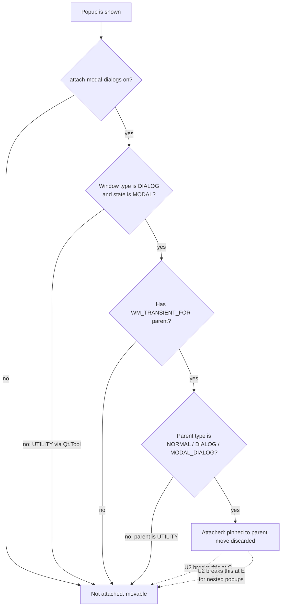
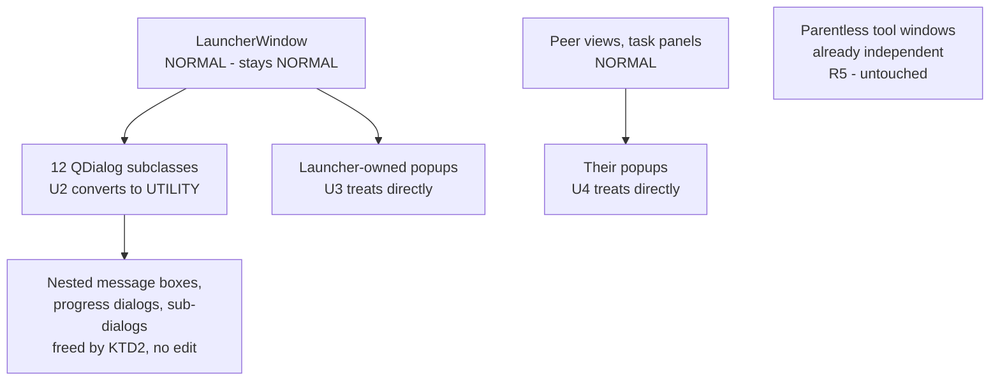

# Popup Window Independence Under GNOME - Plan

## Goal Capsule

**Objective.** Make every parented modal popup a window the researcher can drag independently, and open the modal workflow dialogs centered on the screen. Keep modal blocking, keep the stay-above-the-launcher relationship, and change nothing about the tool windows that are already independent.

**Authority hierarchy.** Requirements (R-IDs) win on behavior. Key Technical Decisions (KTD-IDs) win on mechanism within their cited requirements. Unit bodies override neither. The measured evidence in the Appendix is the ground truth for every claim about Qt and mutter — prefer it over documentation or intuition.

**Execution profile.** Mechanical, wide, low-per-site risk. The leverage is concentrated in U2; the long tail in U3 and U4 is repetitive. Land U1 and U2 first and verify manually before spending effort on the tail.

**Stop conditions.** Stop and surface a blocker if: a popup loses modal blocking; `WM_TRANSIENT_FOR` stops pointing at the intended parent; the `Qt.Tool` type visibly degrades decoration on the target desktop; or the manual GNOME check in U7 shows a converted dialog still glued to the launcher.

**Tail ownership.** Standalone `ce-work` run owns branch, commits, and PR.

---

## Product Contract

### Summary

Give parented modal popups the `Qt.Tool` window type on Linux so GNOME stops gluing them to the launcher, and place the modal ones at the center of the work area before they first appear. Route both behaviors through shared helpers in `src/percell4/gui/_dialog_utils.py`, guarded by an inspection test in the style the repo already uses for scroll wrapping and settings isolation.

### Problem Frame

The researcher docks the launcher against the left or right edge of the screen so the launcher and the napari viewer are usable at the same time. Every PerCell4 popup is a parented, application-modal `QDialog`. GNOME's mutter classifies such a window as an attached modal dialog and pins it to its parent: the popup opens over the edge-docked launcher, hangs partly off-screen, and cannot be dragged back into view. Dragging it moves the launcher instead.

Three conditions must all hold for mutter to attach a window, and this application satisfies all three. The `attach-modal-dialogs` preference is on. The window advertises `_NET_WM_WINDOW_TYPE_DIALOG` together with `_NET_WM_STATE_MODAL`. It has a `WM_TRANSIENT_FOR` parent whose own type is `NORMAL`. While attached, mutter rewrites the window's position on every pass, so the application's own `move()` is discarded.

The behavior is not universal. It reproduces under mutter, metacity, and muffin. KDE's KWin does not attach. Windows has no compositor-side attachment. macOS has a separate but related defect for a different bucket of popups, recorded in Scope Boundaries.

### Requirements

**Window independence and placement**

- R1. Every parented modal popup opens as a window the user can drag independently of the launcher and of every other window.
- R2. Modal workflow dialogs, alerts, and progress dialogs open centered on the available work area of the screen that owns their parent window.
- R3. Popups keep the modal input blocking they have today. No popup becomes non-modal.
- R4. Popups keep pointing `WM_TRANSIENT_FOR` at their intended parent, so they stay above it and do not gain a separate taskbar entry.
- R5. Tool windows that are already independent keep their current open position. They are neither centered nor reflagged.

**Portability**

- R6. The behavior change applies only when `sys.platform` starts with `linux`, and is a no-op elsewhere.
- R7. Popups keep their title bar and close button on the target desktop.

**Maintainability**

- R8. Popup window setup goes through shared helpers in `src/percell4/gui/_dialog_utils.py`.
- R9. An inspection test fails when a popup surface bypasses those helpers, and carries a path-keyed exemption map with a reason per entry.
- R10. The existing dialog conventions keep working: scroll wrapping and the screen-height cap are unaffected.

### Acceptance Examples

- AE1. **Covers R1, R2.** Given the launcher is docked against the right edge of a 1920×1080 screen, when the user opens Compress TIFF Dataset, then the dialog appears centered in the work area, fully on screen, and can be dragged anywhere.
- AE2. **Covers R3.** Given a workflow dialog is open, when the user clicks the launcher, then the launcher does not accept the input, exactly as before this change.
- AE3. **Covers R4.** Given a converted dialog is open, when its X11 properties are inspected, then `WM_TRANSIENT_FOR` names the launcher's window and `_NET_WM_STATE` still contains `_NET_WM_STATE_MODAL`.
- AE4. **Covers R5.** Given the user has dragged the metric segmenter window beside the napari viewer, when the user opens it again for another mask, then it does not jump to the center of the screen.
- AE5. **Covers R1.** Given a converted workflow dialog is open, when it raises its own error message box, then that message box is also draggable, with no edit to the message-box call site.

### Scope Boundaries

- Popups whose owner is one of the converted dialogs are freed by the parent-type gate in KTD2. They are in scope for verification, not for editing.
- Non-modal tool windows are already independent. `CnrSegmenterWindow` (`src/percell4/gui/cnr_segmenter.py:88`), the segmentation QC window, multi-select, and the dilute-phase queue are parentless and stay untouched.

#### Deferred to Follow-Up Work

- Converting modal `exec_()` dialogs to non-modal `show()` plus signals. Unnecessary for R1–R5 per KTD5, and the 17 call sites include five hard cases that read live widget state after close.
- The macOS sheet defect. `QCocoaWindow::setVisible` turns any parented `Qt::WindowModal` window into a native `NSWindow` sheet, glued to the parent's title area and unmovable. This repo has nine parented `WindowModal` progress dialogs, which is exactly that case. Same symptom class, out of this plan's platform scope per KTD4.
- `src/percell4/interfaces/gui/app.py` cannot import. It reads `HexMainWindow` from `src/percell4/interfaces/gui/main_window.py`, which defines only `LauncherWindow`. Unrelated to this plan; fix or delete separately.
- `ImportDialog` (`src/percell4/gui/import_dialog.py:29`) has no production callers; `src/percell4/gui/compress_dialog.py:3` says `CompressDialog` replaced it. It is still matched by the compliance globs, so it needs a decision — delete or exempt — but not in this plan.
- The per-ROI modal warning loop at `src/percell4/interfaces/gui/peer_views/phasor_plot.py:2140` raises one modal box per bad entry. A real UX defect, unrelated to window attachment.

#### Outside this plan's identity

- Remembering and restoring popup geometry between sessions. Placement here is deterministic centering, not persistence.
- Changing which popups are modal, or the launcher's own docking behavior.

---

## Planning Contract

### Key Technical Decisions

- KTD1. **Use `Qt.Tool` as the non-attaching window type.** (session-settled: user-approved — chosen over `Qt.Window`: `Qt.Window` maps to `_NET_WM_WINDOW_TYPE_NORMAL` and deletes `WM_TRANSIENT_FOR`, losing stay-above-parent and gaining a taskbar entry.) `Qt.Tool` maps to `_NET_WM_WINDOW_TYPE_UTILITY`, which fails mutter's type gate, and stays in qtbase's `isTransient()` list, so the transient parent survives. Measured: independent movement, screen-centered placement, `_NET_WM_STATE_MODAL` retained, `_NET_WM_STATE_SKIP_TASKBAR` retained. Governs R1, R4.
- KTD2. **Convert the dialog classes only, and let the parent-type gate free everything nested inside them.** mutter attaches a window only when its transient parent's own type is `NORMAL`, `DIALOG`, or `MODAL_DIALOG`. Once a dialog is `UTILITY`, every popup parented to it is unattached with no edit to that popup. Measured on an unmodified modal child. Roughly half the convenience popups in `src/` are owned by one of the twelve dialogs and need no change. Governs R1.
- KTD3. **Set window flags and position before the first `show()`.** `setWindowFlags` on a visible widget hides it as a side effect, which this repo has already been bitten by and documented at `docs/solutions/ui-bugs/qt-setwindowflag-hides-visible-widget-2026-05-14.md`. `move()` before `show()` also sets `Qt.WA_Moved`, which suppresses `QDialog::adjustPosition` and is what makes deliberate placement stick. Both belong in `__init__`. Governs R2.
- KTD4. **Gate on `sys.platform`, never on the Qt platform name or Wayland environment variables.** (session-settled: user-approved — chosen over covering macOS too: the researcher reports no problem there.) `src/percell4/gui/opengl_platform.py:81-89` establishes a `platformName()` gate for a different problem; copying it here would be wrong, because Qt 6.8 plus mutter 47 reintroduces attachment on native Wayland through `xdg-dialog-v1`, and this codebase is one `QT_API` change away from PyQt6. Governs R6.
- KTD5. **Keep `exec_()` and modality untouched.** (session-settled: user-approved — chosen over converting dialogs to non-modal `show()`: that refactor is unnecessary once KTD1 is in place.) mutter's gate keys on window type and parent type, not on modality. Attempting to relax modality instead would be both more expensive and unreliable, because mutter latches its notion of modality when it first manages the window and Qt never clears `_NET_WM_STATE_MODAL`. Governs R3.
- KTD6. **Put the helpers in `src/percell4/gui/_dialog_utils.py` and enforce them by inspection.** That module already owns `wrap_in_scroll` and `cap_to_screen`, and `docs/solutions/ui-bugs/dialog-scroll-when-tall.md` argues for adding a function there rather than introducing a dialog base class. The enforcement pattern is established three times over in `tests/test_gui/`. Governs R8, R9.
- KTD7. **Do not unparent any popup to solve this.** Dropping the Qt parent would detach the window, but `cap_to_screen` early-returns when `dialog.parent()` is `None` (`src/percell4/gui/_dialog_utils.py:23-25`), which would silently disable the screen-height cap on all twelve dialogs. A flags change leaves the `QObject` parent intact. Governs R4, R10.
- KTD8. **Scope the compliance scan to the whole GUI tree, not the dialog-filename globs.** `tests/test_gui/test_dialog_helper_compliance.py` discovers by `*Dialog.py` / `*_dialog.py`, which sees twelve files and misses the launcher, the peer views, and the workflow panels. Follow `tests/test_gui/test_settings_isolation_compliance.py`, which scans whole trees. Governs R9.
- KTD9. **Centering is X11 and XWayland only, by construction.** `xdg_shell` gives clients no absolute-positioning request, so Qt ignores `move()` for top-level windows on native Wayland regardless of modality. Document this rather than work around it. Qt currently refuses to auto-select the Wayland platform under GNOME, so the gate in KTD4 is sufficient today. Governs R2, R6.

### High-Level Technical Design

The gate this change defeats, and where each unit intervenes:

Window ownership, and which popups U2 frees transitively:

### Assumptions

- The dozen `QDialog` subclasses under `src/percell4/gui/` are uniform: each calls `super().__init__(parent)`, sets a title, sizes itself, and calls `cap_to_screen`. None sets modality or window flags. The two exceptions are `setModal(True)` at `src/percell4/gui/workflows/single_cell/config_dialog.py:424` and `:2001`.
- `QFileDialog.get*` call sites resolve to the desktop portal chooser and are not Qt windows, so they need no change. The repo sets neither `DontUseNativeDialog` nor `AA_DontUseNativeDialogs` nor `QT_QPA_PLATFORMTHEME`, so on a machine with no platform-theme plugin Qt falls back to its own widget dialog, which would attach. U7 records the observed behavior rather than guessing.
- Whether `attach-modal-dialogs` is on for other users on a stock GNOME session is unresolved. mutter's own schema default is `false`; GNOME Shell ships an override setting it `true`. The bug is confirmed on the researcher's machine. This affects release notes, not the fix.

### Sequencing

U1 unblocks everything. U2 delivers most of the user-visible value and should be verified manually before the tail. U3 and U4 are independent of each other. U5 can land at any point after U2 but must land before the branch is considered green. U6 should land after U3 and U4, or its exemption map will be large and churn. U7 is last.

---

## Risks & Dependencies

- **`Qt.Tool` carries `SKIP_TASKBAR` and `SKIP_PAGER`.** Converted popups get no taskbar entry and may not appear in the window switcher. This is acceptable only because they keep `WM_TRANSIENT_FOR` and therefore stay above their parent, so they cannot be buried. If a future change drops the transient parent, a modal popup could become unreachable. The U6 compliance test is the guard: it fails if a popup stops going through the helper.
- **`Qt.Tool` behaves differently off Linux.** On macOS, tool windows hide when the application deactivates; on Windows they get a thin title bar and no taskbar button. The KTD4 platform gate makes this moot, but removing the gate would regress both platforms. Any future attempt to bring macOS into scope must revisit the mechanism, not just widen the gate.
- **Decoration is desktop-dependent.** Utility windows are decorated normally under mutter, but this is a window-manager choice, not a guarantee. R7 and the U7 manual check exist to catch a desktop that decorates utility windows differently.
- **Centering fights saved geometry.** Any popup that restores a saved position will disagree with centering. U5 resolves this per test; the underlying rule is that this plan centers modal popups and does not persist their position. A future geometry-persistence feature must decide which wins.
- **The centered position is computed at construction.** A popup that grows after `__init__` — from a late `sizeHint` or dynamically added content — will sit slightly off-center. Acceptable for R2, which requires the popup to open on-screen and centered, not to re-center on resize.
- **`attach-modal-dialogs` may be off for other users.** The fix is inert for them: `Qt.Tool` still avoids attachment, and centering still applies, but they would not have seen the bug. This affects how the change is described in release notes, not whether it works. The Assumptions record that this is unresolved.
- **No automated coverage for the central behavior.** Recorded in the Verification Contract. The consequence is that a future refactor could reintroduce attachment and every gate would stay green. The U7 learning doc exists so the next contributor knows to check manually.

---

## Implementation Units

### U1. Window-independence helpers

**Goal.** Add the two shared helpers every later unit calls, with the platform gate and the before-first-show contract in one place.

**Requirements.** R6, R8; implements KTD1, KTD3, KTD4.

**Dependencies.** None.

**Files.**
- `src/percell4/gui/_dialog_utils.py` — add the helpers next to `wrap_in_scroll` and `cap_to_screen`.
- `tests/test_gui/test_dialog_utils.py` — extend.

**Approach.**
1. Add a helper that gives a popup the non-attaching window type. It replaces the window-type bits with `Qt.Tool`, preserving the other flag bits. It returns early unless `sys.platform` starts with `linux`.
2. Add a helper that centers a popup on the available geometry of the screen that owns it, preferring the parent's screen and falling back to the popup's own. It returns early off Linux.
3. Both helpers document that they must run before the first `show()`, and why — cite `docs/solutions/ui-bugs/qt-setwindowflag-hides-visible-widget-2026-05-14.md`.
4. Keep the module free of new imports beyond `sys` and what `qtpy` already provides.

**Patterns to follow.** `src/percell4/gui/opengl_platform.py` for the shape of a platform-gated helper split into a pure decision function and a thin side-effecting wrapper — that split is what makes it testable off the target platform. `src/percell4/gui/_dialog_utils.py` for naming and the docstring convention that cites the owning learning doc.

**Test scenarios.**
- On Linux, the window-type helper leaves the popup's window type reporting `Qt.Tool`.
- On Linux, the window-type helper preserves the title-bar, system-menu, and close-button hints, so R7 holds.
- Off Linux, the window-type helper leaves `windowFlags()` byte-identical.
- Calling the window-type helper on a `QDialog` changes the type nibble. Assert this explicitly: `setWindowFlag(Qt.Window, True)` is a measured no-op on a `QDialog` because `Qt.Dialog` already contains the `Window` bit, so a test that only checks "some flag changed" would pass against a broken implementation.
- On Linux, the centering helper puts `frameGeometry().center()` on the screen's `availableGeometry().center()`, within a small tolerance. The offscreen platform synthesizes a 2px frame on each side; allow ±5px.
- The centering helper does not raise when the popup has no parent.
- The centering helper does not raise when the parent has no `screen` attribute. Mirror the existing `test_cap_to_screen_parent_without_screen_attr_does_not_raise`.
- Off Linux, the centering helper leaves `pos()` unchanged.
- A popup that was moved by the centering helper before `show()` keeps that position after `show()`, proving `Qt.WA_Moved` suppressed `adjustPosition`.

**Verification.** `pytest tests/test_gui/test_dialog_utils.py` passes. The helpers are importable and no other module imports them yet.

---

### U2. Convert the dialog classes to the non-attaching window type and center them

**Goal.** Make the thirteen `QDialog` subclasses across twelve files independent and screen-centered. This is the unit that fixes the reported symptom and, through KTD2, frees every popup nested inside them.

**Requirements.** R1, R2, R3, R4, R10; implements KTD1, KTD2, KTD3, KTD7.

**Dependencies.** U1.

**Files.**
- `src/percell4/gui/compress_dialog.py`
- `src/percell4/gui/import_dialog.py`
- `src/percell4/gui/export_images_dialog.py`
- `src/percell4/gui/add_layer_dialog.py`
- `src/percell4/gui/batch_tcspc_dialog.py`
- `src/percell4/gui/flim_fret_dialog.py` — both `FlimFretDialog` and the nested `_ConfigurePairDialog`
- `src/percell4/gui/phasor_masks_dialog.py`
- `src/percell4/gui/dilute_from_mask_dialog.py`
- `src/percell4/gui/per_particle_donut_dialog.py`
- `src/percell4/gui/per_particle_multichannel_dialog.py`
- `src/percell4/gui/whole_field_intensity_dialog.py`
- `src/percell4/gui/workflows/single_cell/config_dialog.py` — `WorkflowConfigDialog` and the inline dialog near `:1999`
- `src/percell4/interfaces/gui/task_panels/analysis_panel.py` — the inline dialog near `:613`
- `tests/test_gui/test_dialog_migrations.py` — extend with the per-dialog assertions.

**Approach.**
1. In each dialog's `__init__`, after the existing `resize` and `cap_to_screen` calls, call both U1 helpers.
2. Place the calls after sizing so centering uses the intended size. Do not move `cap_to_screen`.
3. Leave `setModal(True)` at `config_dialog.py:424` and `:2001` in place. Modality is unchanged per KTD5.
4. Do not change any `exec_()` call site.
5. Do not unparent anything, per KTD7.

**Execution note.** Convert one dialog first, verify it manually on the real GNOME session against AE1, then apply the same edit across the rest. The mechanism is uniform, so a single manual confirmation de-risks the whole batch; batching first and discovering the mechanism was wrong would waste twelve edits.

**Patterns to follow.** The uniform `__init__` shape these twelve already share. `src/percell4/gui/compress_dialog.py:59-63` is the clearest example.

**Test scenarios.**
- Each of the thirteen dialog classes reports window type `Qt.Tool` after construction on Linux.
- Each of the thirteen still reports `isModal()` as before when driven through `exec_()`. Drive it with `QTimer.singleShot(0, dlg.accept); dlg.exec_()`, which returns without hanging under the offscreen platform.
- Each of the thirteen is centered on the screen work area after construction.
- Each of the thirteen still contains exactly one outermost `QScrollArea`, so R10 holds. Extend the existing per-dialog assertions rather than writing new ones.
- Each of the thirteen still has its `maximumHeight` capped by `cap_to_screen`, proving the `QObject` parent survived the flags change.
- Constructing a dialog and then showing it leaves it visible. This is the regression guard for the `setWindowFlags`-hides-a-visible-widget trap; the trap reproduces under the offscreen platform, so the test is meaningful.
- A modal `QMessageBox` parented to a converted dialog reports the unchanged `Qt.Dialog` window type, documenting that KTD2 frees it without editing it.

**Verification.** `pytest tests/test_gui tests/test_gui_workflows` passes. Manually, with the launcher docked to a screen edge, Compress TIFF Dataset opens centered, drags freely, and stays above the launcher.

---

### U3. Launcher-owned popups

**Goal.** Free the convenience popups whose owner is the launcher, which stays `NORMAL` and so cannot be freed by KTD2.

**Requirements.** R1, R2, R3, R4; implements KTD1, KTD2, KTD3.

**Dependencies.** U1.

**Files.**
- `src/percell4/gui/_dialog_utils.py` — add the message-box and progress-dialog constructors.
- `src/percell4/interfaces/gui/main_window.py` — the message boxes and the two progress dialogs near `:1135` and `:1438`. The launcher raises no input dialogs; the only `QInputDialog.getText` sites are `src/percell4/interfaces/gui/task_panels/data_panel.py:367` and `:454` plus `src/percell4/gui/_resource_name_prompt.py:55`, all handled in U4.
- `tests/test_gui/test_dialog_utils.py` — extend.

**Approach.**
1. The static convenience methods give no handle on which to set flags before showing, so add project-level constructors that build the widget, apply the U1 helpers, then show it. One for message boxes, one for progress dialogs.
2. Keep the return contract identical to the static method each replaces, so call sites that branch on the answer keep working.
3. Replace the launcher's static calls with the new constructors.
4. Leave the `Qt.WindowModal` setting on the progress dialogs as is. Modality is unchanged per KTD5.
5. Leave `QFileDialog.get*` calls alone per the Assumptions.

**Patterns to follow.** `src/percell4/gui/torch_error.py` and `src/percell4/gui/_resource_name_prompt.py` are existing examples of wrapping a popup behind a named project function.

**Test scenarios.**
- The message-box constructor returns the same value the corresponding static method returns for accept and for reject.
- The message-box constructor produces a widget whose window type is `Qt.Tool` on Linux, and is centered.
- The progress-dialog constructor preserves `windowModality()` as `Qt.WindowModal`.
- A launcher-raised warning is centered on the work area rather than on the launcher, with the launcher docked to a screen edge in the test fixture.
- The launcher module contains no remaining direct `QMessageBox` static calls. Assert by inspection over the module source, in the style of the existing compliance tests.

**Verification.** `pytest tests/test_gui tests/test_gui_workflows` passes. Manually, a launcher error message opens centered and drags freely.

---

### U4. Remaining popups owned by NORMAL windows

**Goal.** Apply the same treatment to popups owned by the peer views, the task panels, and the parentless tool windows, without changing where those tool windows themselves open.

**Requirements.** R1, R2, R3, R4, R5; implements KTD1, KTD3.

**Dependencies.** U1, U3.

**Files.**
- `src/percell4/interfaces/gui/peer_views/phasor_plot.py`
- `src/percell4/interfaces/gui/peer_views/cell_table.py`
- `src/percell4/interfaces/gui/task_panels/data_panel.py`
- `src/percell4/interfaces/gui/task_panels/analysis_panel.py`
- `src/percell4/interfaces/gui/task_panels/file_navigator.py`
- `src/percell4/gui/workflows/single_cell/seg_qc.py`
- `src/percell4/gui/torch_error.py`
- `src/percell4/gui/_resource_name_prompt.py`
- `src/percell4/gui/analysis_widgets.py`
- `src/percell4/gui/viewer.py`
- `src/percell4/gui/adaptive_clip_panel.py`
- `src/percell4/gui/segmentation_panel.py`
- `src/percell4/gui/grouped_seg_panel.py`
- `src/percell4/gui/cnr_segmenter.py` — the name prompt it raises near `:414` only
- `src/percell4/gui/multi_select.py`
- `src/percell4/gui/threshold_qc.py`

**Approach.**
1. Replace static popup calls with the U3 constructors.
2. A popup parented to a child widget resolves its transient parent to the nearest native ancestor window. For the task panels that is the launcher, so those popups need the treatment even though the panel is not itself a window.
3. Do not touch the tool windows' own construction. `CnrSegmenterWindow`, the segmentation QC window, multi-select, and the dilute-phase queue are parentless and already independent; only the popups they raise are in scope. R5 is a constraint on this unit, not an aspiration.
4. Leave the four existing `setWindowFlag(Qt.Window, ...)` promotions alone. They are already non-attaching.

**Test scenarios.**
- A popup raised by a task panel is centered on the work area and reports window type `Qt.Tool` on Linux.
- A popup raised by a peer view is centered and independent.
- Constructing the metric segmenter window leaves its position unset by this change. Assert it is not centered, which is the direct guard for R5 and AE4.
- The segmentation QC window and multi-select still report the window type they had before this plan.
- The name prompt raised from the metric segmenter is centered and independent, while the segmenter itself is not moved.
- No module in `src/percell4/gui` or `src/percell4/interfaces/gui` calls a `QMessageBox` static directly. Assert by inspection; this becomes the seed for U6.

**Verification.** `pytest tests/test_gui tests/test_gui_workflows` and `pytest tests_gui/` pass. Manually, the metric segmenter opens where it always did.

---

### U5. Repair the tests this change breaks

**Goal.** Fix the existing tests that the window-flag and geometry changes invalidate, without weakening what they were written to protect.

**Requirements.** R10.

**Dependencies.** U2.

**Files.**
- `tests/test_gui/test_dilute_phase_workflow_sidebar.py`
- `tests/test_gui/test_dialog_utils.py`
- `tests/test_gui/test_dilute_phase_panel_geometry.py`
- `tests/test_gui/test_threshold_qc_geometry_persistence.py`
- `tests/test_gui/test_batch_tools_window.py`
- `tests/test_gui/test_compress_dialog_stitching_form.py`
- `tests/test_gui/test_stitching_form.py`
- `tests/test_gui/test_workflows_panel_dilute_from_mask_wiring.py`
- `tests/test_gui/test_workflows_panel_flim_fret_wiring.py`
- `tests/test_gui/test_phasor_masks_dialog.py`
- `tests/test_gui/test_scripts_panel.py`
- `tests/test_gui_workflows/test_session_window.py`

**Approach.**
1. Rewrite `_FakePanel` as a `QWidget`. It is currently a `QObject` that hand-stubs only `show`, `close`, `setWindowFlag`, `setWindowTitle`, `resize`, `raise_`, and `activateWindow`. A `QObject` has none of the geometry or window API, so any new call in the launcher's promotion block raises `AttributeError` and takes out six tests. The test that pins the `setWindowFlag(Qt.Window, True)` protocol needs its assertion re-expressed against the observable outcome rather than the exact call.
2. Leave the modality assertion in `tests/test_gui_workflows/test_config_dialog.py` alone. Modality is preserved by KTD5, so it should still pass. If it fails, that is a real regression, not a test to update.
3. Check the `cap_to_screen` no-parent tests before changing them. They assert `maximumHeight` stays at the Qt default when there is no parent. Every `QWidget` has a working `screen()` even unparented, so if U1 or U3 ever routes capping through the popup's own screen, these tests correctly fail. Do not "fix" them by relaxing the assertion; keep `cap_to_screen` parent-gated per KTD7.
4. Re-express geometry assertions that conflict with centering. Where a test asserts a saved-or-default position, decide per test whether centering or the saved position should win, and record the choice in the test docstring.
5. Any new test that reads `windowHandle()`, real frame margins, or `screen()` must use `qtbot.waitExposed` as a context manager. Every existing call site in this repo invokes it bare, which is a no-op that passes only because the offscreen platform exposes synchronously.

**Execution note.** Run the full suite before editing any test, and capture the failure list. Fix only what the change actually broke. A test that fails for a reason this plan did not introduce is a finding to surface, not a line to edit.

**Test scenarios.**
- The full default suite passes: `pytest`.
- The GL tier passes: `pytest tests_gui/`.
- The rewritten `_FakePanel` still proves the launcher promotes the panel to a top-level window, sets its title, and sizes it.
- The dilute-phase panel geometry tests still prove geometry persistence. Note that their 700 and 760 height assertions exceed the 800×600 offscreen screen, so a centering fallback must not silently clamp them.

**Verification.** `pytest` and `pytest tests_gui/` both green, with no assertion weakened to achieve it.

---

### U6. Compliance test for new popup surfaces

**Goal.** Keep the invariant from decaying. A new popup added later must go through the helpers or carry an explicit exemption.

**Requirements.** R9; implements KTD6, KTD8.

**Dependencies.** U3, U4.

**Files.**
- `tests/test_gui/test_popup_window_compliance.py` — new.

**Approach.**
1. Scan `src/percell4/gui` and `src/percell4/interfaces/gui` as whole trees. Do not reuse the `*_dialog.py` globs; they miss the launcher, the peer views, and the workflow panels per KTD8.
2. Flag two shapes: a `QDialog` subclass whose `__init__` does not call the U1 window-type helper, and a direct call to a `QMessageBox`, `QProgressDialog`, or `QInputDialog` static outside `_dialog_utils.py`.
3. Carry a path-keyed exemption map with a one-line reason per entry, in the shape `EXEMPT_DIALOGS` already uses.
4. Seed the exemptions from the known set: the splash screen's frameless flags in `src/percell4/app.py:33-34`, the always-on-top toggle at `src/percell4/interfaces/gui/peer_views/session_window.py:317`, the four existing `Qt.Window` promotions, and the `QFileDialog` sites left native per the Assumptions.
5. Ship a self-check that the detector fires on a non-compliant snippet and stays silent on a compliant one. Without it, a typo in a pattern makes the whole invariant unenforced while reading green.
6. The failure message enumerates `path:lineno` and states the remedy.

**Patterns to follow.** `tests/test_gui/test_settings_isolation_compliance.py` for the whole-tree scan and the `path:lineno` failure format. `tests/test_gui/test_dialog_helper_compliance.py` for the exemption-map shape and the paired detector self-test.

**Test scenarios.**
- The compliance test passes against the tree as U3 and U4 leave it.
- The detector reports a synthetic `QDialog` subclass that omits the helper call.
- The detector reports a synthetic direct `QMessageBox.warning` call.
- The detector stays silent on a synthetic compliant dialog and on a call routed through the project constructor.
- Every path in the exemption map still exists in the tree, so the map cannot rot into stale entries.
- The scan reaches at least one file under `src/percell4/interfaces/gui/`, which is the specific gap the filename globs have.

**Verification.** `pytest tests/test_gui/test_popup_window_compliance.py` passes, and temporarily reverting one U2 edit makes it fail.

---

### U7. Convention doc and manual verification

**Goal.** Record the rule and its evidence where the next contributor will find it, and confirm on a real GNOME session what no automated tier can observe.

**Requirements.** R1, R2, R4, R7; implements KTD9.

**Dependencies.** U2, U3, U4, U6.

**Files.**
- `docs/solutions/ui-bugs/gnome-attaches-parented-modal-dialogs-2026-07-29.md` — new.
- `docs/solutions/ui-bugs/qt-setwindowflag-hides-visible-widget-2026-05-14.md` — add a cross-reference.
- `docs/solutions/ui-bugs/dialog-scroll-when-tall.md` — add a cross-reference from its "where it lives" argument to the new helpers.

**Approach.**
1. Write the learning doc in the frontmatter shape the neighbouring `docs/solutions/ui-bugs/` files use. Record the three-condition gate, the measured property values, why `Qt.Tool` was chosen over `Qt.Window`, and the platform caveats in KTD4 and KTD9.
2. State plainly that no test tier in this repo can observe window-manager attachment, and give the manual repro: dock the launcher to a screen edge, confirm `attach-modal-dialogs` is on, open a workflow dialog, drag it.
3. Cross-reference rather than restate. The two neighbouring docs own their own rules.
4. Run the manual checks below and record the observed `QFileDialog` behavior, which the Assumptions left open.

**Test scenarios.** `Test expectation: none -- documentation and manual verification only.`

**Verification.** On a GNOME session with `attach-modal-dialogs` on and the launcher docked to a screen edge, all of the following hold:
- A workflow dialog opens centered, fully on screen, and drags independently. (AE1)
- Clicking the launcher while that dialog is open does nothing, as before. (AE2)
- `xprop` on the dialog shows `_NET_WM_WINDOW_TYPE_UTILITY`, `_NET_WM_STATE_MODAL`, and a `WM_TRANSIENT_FOR` whose value equals the launcher's window id. Compare the value, not merely the property's presence: a transient-type window with no transient parent still gets `WM_TRANSIENT_FOR` pointing at the client leader. (AE3)
- The dialog keeps its title bar and close button. (R7)
- A message box raised by that dialog also drags independently, with no edit to its call site. (AE5)
- The metric segmenter window opens where it opened before this change. (AE4)
- A file picker is recorded as either the portal chooser or a Qt dialog, resolving the open Assumption.

---

## Verification Contract

| Gate | Command | Applies to |
|---|---|---|
| Default suite | `pytest` | U1-U6 |
| GL tier | `pytest tests_gui/` | U4, U5 |
| Lint | `ruff check src tests tests_gui` | all |
| Architecture contracts | `lint-imports` | U1, U3 |
| Manual GNOME check | see U7 Verification | U7 |

The default suite is the blocking gate. Test selection lives in `pyproject.toml`; run a bare `pytest` and do not add `-m` on the command line, because an explicit `-m` silently replaces `addopts` and changes which tests run.

`pytest tests_gui/` is not collected by a bare `pytest` and is a non-blocking CI check, so a window-flag change can go green locally and red only there. Run it explicitly before declaring the branch done.

What the automated gates cannot prove: window-manager attachment, real decorations, Z-order, and whether modal blocking actually stops a click. `QTest.mouseClick` bypasses the modal filter, so modality is assertable only through `windowModality()` and `QApplication.activeModalWidget()`. The U7 manual check is the only evidence for the plan's central behavior.

---

## Definition of Done

**Global**

- R1-R10 hold.
- AE1-AE5 are confirmed, all five manually per U7.
- Every gate in the Verification Contract passes.
- No assertion in an existing test was weakened to make the suite pass. Where a test changed meaning, its docstring says why.
- No popup was unparented, and no `exec_()` call site changed shape.
- Abandoned experimental code is removed. If an app-wide event filter or a `Qt.Window` variant was tried and rejected, it is not left in the diff.
- The two unrelated defects in Scope Boundaries are left unfixed and remain recorded there.

**Per unit**

| Unit | Done signal |
|---|---|
| U1 | Helpers exist, are platform-gated, and are covered including the off-Linux no-op path. |
| U2 | Thirteen dialog classes (including `_ConfigurePairDialog`) plus the two inline dialogs report `Qt.Tool` and open centered; scroll and cap conventions intact. |
| U3 | Launcher raises no popup through a `QMessageBox` or `QProgressDialog` static. |
| U4 | Peer views, task panels, and tool-window popups are converted; the tool windows themselves are provably unmoved. |
| U5 | `pytest` and `pytest tests_gui/` green; `_FakePanel` is a `QWidget`. |
| U6 | Compliance test passes, fails when a U2 edit is reverted, and its detector self-check passes. |
| U7 | Learning doc committed; every manual check in U7 confirmed and the `QFileDialog` behavior recorded. |

---

## Appendix

### Measured evidence

Seven probes on the target machine: GNOME Shell under XWayland, `platformName` `xcb`, PyQt5 via qtpy, `attach-modal-dialogs` reported `true`. Each row is a parented modal `QDialog` with the launcher docked to a screen edge.

| Variant | Window type set | `_NET_WM_WINDOW_TYPE` | `_NET_WM_STATE` | `WM_TRANSIENT_FOR` | `move()` honored |
|---|---|---|---|---|---|
| A | default (`Qt.Dialog`) | `DIALOG, NORMAL` | `MODAL, SKIP_TASKBAR` | parent | no |
| H | default, then `move()` | `DIALOG, NORMAL` | `MODAL, SKIP_TASKBAR` | parent | no |
| B, E, F | `Qt.Window` | `NORMAL` | `MODAL` | absent | yes |
| I | `Qt.Window` + `move()` | `NORMAL` | `MODAL` | absent | yes |
| K | `Qt.Window`, non-modal | `NORMAL` | none | absent | yes |
| J | default, non-modal | `DIALOG, NORMAL` | `SKIP_TASKBAR` | parent | yes |
| M | `QWidget` + `Qt.Window` | `NORMAL` | none | absent | yes |
| N, P | `Qt.Tool` | `UTILITY, NORMAL` | `MODAL, SKIP_PAGER, SKIP_TASKBAR` | parent | yes |
| Q | default, parent is `NORMAL` | `DIALOG, NORMAL` | `MODAL, SKIP_TASKBAR` | parent | no |
| R | default, parent is `UTILITY` | `DIALOG, NORMAL` | `MODAL, SKIP_TASKBAR` | parent | yes |

Readings that shaped the plan:

- N is the chosen mechanism. It is the only variant that keeps the transient parent, keeps modality, avoids a taskbar entry, and accepts placement.
- R is KTD2. The child is unmodified; only its parent's type changed.
- H is why detaching must come before placement. The application's `move()` is discarded while attached.
- J shows non-modal windows were never affected, which is why the tool windows already behave correctly.
- E and F show `QWindow.setTransientParent()` cannot restore the hint for a `Qt.Window`-type window, whether called after `create()`, after `winId()`, or after `show()`. The gate is window type, not timing.

### Corrections carried into this plan

Four claims were investigated and found wrong before the plan was written. They are recorded so the same ground is not re-explored.

- Independent movement does not require giving up stay-above-parent. That trade-off applies to `Qt.Window`, not to `Qt.Tool`.
- Detaching is not a prerequisite for positioning in general. Changing the parent's type is sufficient, which is what makes KTD2 work.
- `exec_()` does not force `Qt::ApplicationModal` unconditionally on Qt5. It picks `Qt::WindowModal` when an ancestor carries `Qt::WA_GroupLeader`, and it overrides modality only when modality is currently `NonModal`. Moot here, since KTD5 leaves modality alone.
- The problem is not X11-specific or mutter-specific. metacity and muffin carry the same code. Qt 6.8 with mutter 47 reintroduces it on native Wayland. macOS force-attaches parented `WindowModal` windows as native sheets. KWin does not attach.

### Sources

- `docs/solutions/ui-bugs/qt-setwindowflag-hides-visible-widget-2026-05-14.md` — the flags-hide-a-visible-widget trap that KTD3 works around.
- `docs/solutions/ui-bugs/dialog-scroll-when-tall.md` — the argument for adding functions to `_dialog_utils.py` rather than a dialog base class.
- `docs/solutions/conventions/headless-test-suite-tiers.md` — why `tests/` and `tests_gui/` are split, and why test selection stays in `pyproject.toml`.
- `src/percell4/gui/opengl_platform.py` — the platform-gated-helper pattern U1 follows, and the `platformName()` gate KTD4 deliberately does not copy.
- mutter `src/core/window.c`, `meta_window_should_attach_to_parent()` — the three-condition gate, unchanged from mutter 3.4 through current.
- mutter `src/core/constraints.c`, `constrain_modal_dialog()` — rewrites an attached dialog's position on every pass with no priority guard, which is why `move()` is discarded.
- mutter `src/core/place.c` — centers any dialog-type window over its transient parent at initial placement, independent of the attach preference. This is why turning the preference off would stop the clipping but still not center on the screen.
- qtbase `src/plugins/platforms/xcb/qxcbwindow.cpp`, `isTransient()` — the seven window types that keep `WM_TRANSIENT_FOR`. `Qt.Tool` is in the list; `Qt.Window` is not. `Qt.Popup` and `Qt.ToolTip` are in it but unusable, because `setWindowFlags` force-adds `X11BypassWindowManagerHint`.
