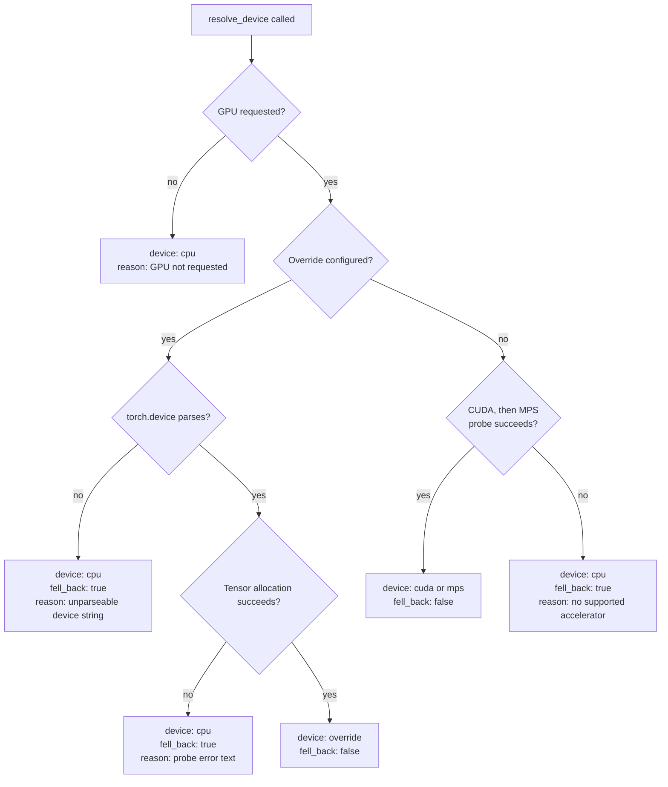
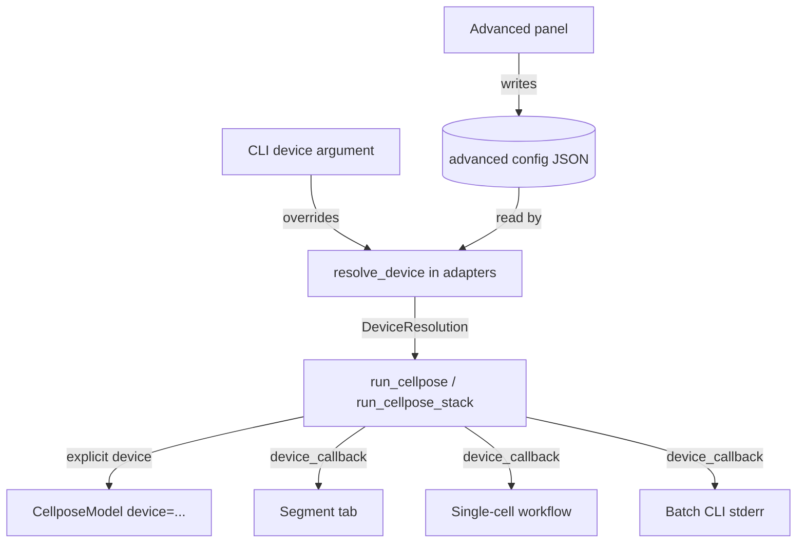

# Advanced GPU Device Configuration for Cellpose - Plan

## Goal Capsule

- **Objective:** Make Cellpose's device selection honest and extensible. The existing "Use GPU" control keeps its meaning but stops failing silently, and a new Advanced panel hosts an opt-in device override for accelerators Cellpose would otherwise never reach.
- **Authority hierarchy:** Requirements (R-IDs) govern behavior. Key Technical Decisions (KTD-IDs) govern mechanism within those constraints. Unit Approach sections override neither.
- **Execution profile:** Bottom-up. The device resolver and its config store land first with unit coverage; the three consuming surfaces follow independently.
- **Stop conditions:** Stop and surface if Cellpose's `CellposeModel(device=...)` path turns out not to accept a non-CUDA/MPS device on the pinned version, or if wiring the resolver through the port would require `application/` to import `percell4.adapters` (a `lint-imports` contract violation, not a style preference).
- **Tail ownership:** Standalone run — this plan owns branch, tests, and commit.

---

## Product Contract

### Summary

The "Use GPU" toggle keeps auto-detecting CUDA or MPS, but reports when it falls back to CPU instead of failing silently. A new Advanced entry in the launcher sidebar hosts expert-only configuration; its first occupant is a Cellpose device override that names an explicit torch device. The override reaches every Cellpose entry point — interactive segmentation, the single-cell workflow, and the batch CLI — and falls back to CPU with a visible warning when the named device is unusable.

### Problem Frame

Cellpose's own device resolution (`cellpose/core.py::_use_gpu_torch`) tries exactly two devices — `cuda`, then `mps` — and returns False for anything else. `assign_device` then assigns `torch.device('cpu')` and logs at INFO. PerCell4 surfaces none of that: `gpu=True` flows from the checkbox through `run_cellpose` into `CellposeModel(gpu=...)`, and on a machine with neither accelerator the run completes on CPU with no indication anything degraded. On a laptop CPU, `cpsam_v2` (a SAM ViT-L backbone) is slow enough that the silent fallback reads as a hang or a broken install rather than a fallback.

The same blind spot excludes hardware Cellpose could use. `CellposeModel` accepts an explicit `device` argument that bypasses `assign_device` entirely (`models.py:129`), so an Intel XPU or a specific CUDA index is reachable today — there is simply no way to ask for one. That capability is expert-only and does not belong on the segmentation surface, where it would be one more knob for the majority who need none.

### Requirements

**Default GPU path — unchanged semantics, new visibility**

- R1. The "Use GPU" control keeps its current meaning: prefer CUDA, then MPS, otherwise CPU. It requires no new input from the user.
- R2. When GPU is requested and no supported accelerator is available, the run proceeds on CPU and reports the fallback with the reason it fell back.
- R3. Every Cellpose run reports which device it actually used, whether or not a fallback occurred.

**Advanced panel**

- R4. The launcher sidebar gains an Advanced entry hosting expert-only configuration, separate from the Segmentation surface.
- R5. The panel requires no input. With nothing configured, application behavior is identical to today.
- R6. The panel reports the detected torch and accelerator state so a user can see what their machine offers before configuring anything.

**Device override**

- R7. An optional device override names an explicit torch device for Cellpose (for example `xpu` or `cuda:1`).
- R8. The override applies to interactive segmentation, the single-cell workflow, and the batch CLI.
- R9. An unusable override falls back to CPU with a visible warning naming the configured device and the failure.
- R10. The batch CLI accepts an explicit device argument that takes precedence over the stored override.

### Acceptance Examples

- AE1. Covers R2, R3. Given a machine with neither CUDA nor MPS, when the user runs Cellpose with "Use GPU" checked, then segmentation completes and the user is told the run used CPU because no supported accelerator was found.
- AE2. Covers R1, R5. Given no device override configured and a machine with CUDA available, when the user runs Cellpose with "Use GPU" checked, then the run uses CUDA and no new prompt, dialog, or configuration step appears.
- AE3. Covers R7, R9. Given an override of `xpu` on a PyTorch build without XPU support, when the user runs Cellpose, then the run completes on CPU and the warning names both `xpu` and the reason the device was rejected.
- AE4. Covers R8, R10. Given a stored override of `cuda:1`, when the user runs the batch CLI with no device argument, then the run uses `cuda:1`; when the user passes an explicit device argument, that argument wins.

### Scope Boundaries

- Device selection, the Advanced panel, and device reporting. Not new Cellpose models and not inference performance tuning.
- **ROCm needs no override.** A ROCm PyTorch build reports `torch.cuda.is_available() == True` and uses `torch.device("cuda")` as its HIP device, so AMD cards already work through the existing checkbox. Do not add ROCm-specific device handling; `torch.version.hip` is read only to label the device in the status report.
- Installing or shipping per-vendor PyTorch builds stays the user's responsibility. The Advanced panel reports what the installed build supports; it does not install anything.
- Device selection for non-Cellpose compute (tracking, measurement) is out of scope.

#### Deferred to Follow-Up Work

- Exposing Cellpose's `use_bfloat16` flag. It defaults to `True` and 16-bit support varies by backend; see Risks.
- Additional Advanced panel occupants. The panel is built so later settings can land without re-deciding its shape, but this plan fills it with the device override only.

---

## Planning Contract

### Key Technical Decisions

- KTD1. **Device resolution lives in `adapters/`.** Torch is infrastructure. `application/` is contractually barred from importing `percell4.adapters` (`pyproject.toml` import-linter contract), and `domain/` is pure logic, so the resolver cannot live in either. `interfaces/` may import adapters, which is what lets the GUI and CLI share one resolver.

- KTD2. **Probe the device by allocating a tensor; do not trust capability flags.** On the reference Linux machine `torch.accelerator.current_accelerator()` returns `cuda` with zero NVIDIA drivers present, and `torch.cuda.is_available()` returns False — the flags disagree. Allocating `torch.zeros(1).to(device)` is the only reliable test, and it is the same technique Cellpose uses internally. The probe must catch both `RuntimeError` (no driver, backend not linked) and `AssertionError` (`Torch not compiled with XPU enabled`).

- KTD3. **Resolve inside the worker thread and report through a callback attached to model construction.** Resolution forces the torch import, which takes seconds; doing it on the UI thread before starting the worker would freeze the launcher. `run_cellpose_stack` already takes a `progress_callback`, so a device callback follows an established shape in the same module. The callback belongs on `build_cellpose_model`, not on `run_cellpose`: the seg-QC re-run (`seg_qc.py:630`) and the workflow runner (`runner.py:754`) both construct the model themselves and pass `model=` into `run_cellpose`, which skips construction entirely. A callback wired only to `run_cellpose` would never fire on either surface.

- KTD4. **The override applies only when GPU is requested.** With "Use GPU" unchecked the run is CPU, override or not. This keeps the checkbox meaning-preserving (R1) and gives the user an unambiguous way to force CPU without editing Advanced settings.

- KTD5. **Store the override in a Qt-free JSON config, not `QSettings`.** `percell4.gui.settings.app_settings()` imports `qtpy`, and the batch CLI must stay headless. One small JSON file under the user config directory is read by both surfaces, which is what makes R8 true for a CLI run started from a terminal rather than only for one launched from the Batch Tools window.

- KTD6. **Resolve once per model construction, not per image.** `run_cellpose_stack` builds one `CellposeModel` and reuses it across frames, so a 100-frame stack emits one device report rather than one hundred. The seg-QC and workflow surfaces cache their model across runs, so on those the report fires once per session rather than once per run — correct, because the device cannot change while a model is held. A user who changes the override in the Advanced panel mid-session must therefore see the new setting take effect only after the cached model is discarded; U5 handles that by invalidating the cache when the stored override changes.

- KTD7. **The device field is an editable combo box, not a fixed dropdown.** The set of valid device strings depends on the user's torch build and hardware (`cuda:0`, `cuda:1`, `xpu`, `xpu:1`). Common values seed the list; the field accepts any string, validated by `torch.device()` construction plus the KTD2 probe.

- KTD8. **The device stays out of `CellposeSettings`.** `CellposeSettings` is the frozen run recipe and is serialized into `run_config.json` (`workflows/artifacts.py:163`). A device is a property of the machine, not the experiment: writing it into the recipe would make a run non-reproducible on any other machine and would silently carry one researcher's `cuda:1` onto a colleague's single-GPU box. The device travels beside the settings, never inside them.

### High-Level Technical Design

Device resolution is one function with one decision tree, consumed by three surfaces.

Every path returns the same `DeviceResolution` shape, so consumers branch on `fell_back` rather than reconstructing the reasoning.

### Assumptions

- The pinned Cellpose range (`>=4.2,<5.0`) keeps `CellposeModel(device=...)` bypassing `assign_device`. Verified against the installed 4.2.1.1 at `models.py:129`; the version pin is the guard.
- A user configuring an explicit device has already installed a matching PyTorch build. The panel reports what is detected but does not diagnose installation problems beyond the probe's own error text.

---

## Implementation Units

### U1. Device resolver in the adapter layer

- **Goal:** One Qt-free function that turns `(gpu_requested, override)` into a resolved torch device plus a human-readable account of how it got there.
- **Requirements:** R1, R2, R3, R7, R9
- **Dependencies:** none
- **Files:**
  - `src/percell4/adapters/torch_device.py` (new)
  - `tests/test_segment/test_torch_device.py` (new)
- **Approach:**
  1. Define a frozen `DeviceResolution` dataclass: the resolved device string, whether a fallback occurred, and a reason string suitable for direct display.
  2. Implement `resolve_device(gpu_requested: bool, override: str | None) -> DeviceResolution` following the KTD2 probe order and the decision tree in High-Level Technical Design.
  3. Import torch lazily inside the function body, matching the existing lazy-import convention in `adapters/cellpose.py`.
  4. Add `describe_torch_environment()` returning the torch version, the CUDA/HIP build tag, and per-backend probe results. U4 renders it; keeping it here means the panel imports no torch symbols directly.
- **Patterns to follow:** Lazy torch import as in `src/percell4/adapters/cellpose.py:40`. Probe technique as in `cellpose/core.py::_use_gpu_torch`, extended to catch `AssertionError`.
- **Test scenarios:**
  - `gpu_requested=False` returns `cpu`, `fell_back=False`, and a reason naming that GPU was not requested — an unchecked box is not a degraded run.
  - `gpu_requested=True` with no override on a machine where every probe fails returns `cpu` with `fell_back=True` and a reason naming that no supported accelerator was found. Covers AE1.
  - An override whose string `torch.device()` cannot parse returns `cpu` with `fell_back=True` and does not raise.
  - An override that parses but fails its probe with `AssertionError` returns `cpu` with `fell_back=True`, and the reason includes the assertion text. Covers AE3.
  - An override that parses but fails its probe with `RuntimeError` behaves identically to the `AssertionError` case — both failure classes are caught.
  - `gpu_requested=False` with an override set still returns `cpu`, confirming KTD4.
  - A successful probe (patched) returns the requested device with `fell_back=False`.
  - `describe_torch_environment()` returns a populated report when torch imports, and a report marking torch unavailable rather than raising when the import fails.
- **Verification:** `pytest tests/test_segment/test_torch_device.py` passes with every probe patched — the tests must not require any real accelerator.

### U2. Advanced settings store

- **Goal:** A Qt-free read/write store for advanced configuration, holding the Cellpose device override as its first key.
- **Requirements:** R5, R8
- **Dependencies:** none
- **Files:**
  - `src/percell4/config/advanced.py` (new)
  - `tests/conftest.py`
  - `tests/test_config/test_advanced_settings.py` (new)
  - `tests/test_config/test_advanced_settings_isolation_compliance.py` (new)
- **Approach:**
  1. Resolve a user config path (honoring `XDG_CONFIG_HOME` on Linux, with platform-appropriate equivalents) and expose it for tests to redirect.
  2. Provide `load_advanced_settings()` and `save_advanced_settings()` over a frozen dataclass whose only field is the device override, defaulting to `None`.
  3. A missing file, unreadable file, or malformed JSON returns defaults rather than raising. An advanced-settings file must never block a run — that would make an opt-in feature able to break the default path, violating R5.
  4. Keep the module importable with no Qt and no torch, so both `interfaces/gui` and `interfaces/cli` can read it.
  5. Add a session-scoped `conftest.py` fixture redirecting the store into `tmp_path`, mirroring `_sandbox_app_settings`. Redirection must be the suite default, not something each test opts into.
  6. Add an inspection test asserting the config path is resolved in exactly one place, matching the shape of the four existing compliance tests. See System-Wide Impact for why a redirect hook alone is insufficient.
- **Patterns to follow:** Frozen dataclass with `__post_init__` validation, as in `src/percell4/workflows/models.py:93`. Redirect hook and its module-global consultation pattern from `src/percell4/gui/settings.py::redirect_to` — the module global exists so both `from x import y` and `import x` call styles are covered, which matters for the same reason here.
- **Test scenarios:**
  - No config file present returns defaults with a `None` override.
  - A round trip through save then load preserves the override string.
  - Malformed JSON returns defaults and does not raise.
  - A file present but unreadable (permissions) returns defaults and does not raise.
  - A JSON object containing unknown keys loads successfully, ignoring them — a newer version's file must not break an older build.
  - Saving creates the parent directory when it does not exist.
  - The redirect hook keeps writes inside `tmp_path`, so the suite never touches the real user config.
  - The redirect holds for a test that imports the save function directly (`from ... import save_advanced_settings`) as well as one that calls it through the module — the failure mode `gui/settings.py` was written to prevent.
  - The compliance test fails when a second call site resolves the config path itself.
- **Verification:** `pytest tests/test_config/` passes, and a full `pytest` run creates no file outside `tmp_path` — check the real user config directory's mtime before and after.

### U3. Wire resolution through the Cellpose adapter and port

- **Goal:** Cellpose runs on the resolved device and reports what it used, without changing any existing call site's behavior when nothing is configured.
- **Requirements:** R1, R2, R3, R7, R8
- **Dependencies:** U1, U2
- **Files:**
  - `src/percell4/adapters/cellpose.py`
  - `src/percell4/ports/segmenter.py`
  - `tests/test_segment/test_cellpose.py`
  - `tests/test_segment/test_cellpose_stack.py`
  - `tests/test_segment/test_segment_inference_params.py`
- **Approach:**
  1. Add `device: str | None = None` and `device_callback: Callable[[DeviceResolution], None] | None = None` to `build_cellpose_model`, `run_cellpose`, and `run_cellpose_stack`. Both default to preserving today's behavior.
  2. In `build_cellpose_model`, call `resolve_device(gpu, device)`. When the resolution is `cpu`, keep passing `gpu=False` to `CellposeModel`; otherwise pass an explicit `device=torch.device(...)`, which bypasses Cellpose's own `assign_device`.
  3. Invoke `device_callback` inside `build_cellpose_model`, per KTD3 and KTD6. `run_cellpose` and `run_cellpose_stack` forward both parameters only on the path where they construct a model; when a caller passes a prebuilt `model=`, neither resolution nor the callback runs, because the device was already decided when that model was built.
  4. When `device` is `None`, read the stored override from U2 so a call site that passes nothing still honors the Advanced setting (R8). A call site passing an explicit device skips the store.
  5. Extend the `Segmenter` port with the same optional `device` parameter. Keep it a plain `str | None` — the port must not import adapters.
- **Execution note:** Before changing these signatures, grep both `tests/` and `tests_gui/` for patches targeting `run_cellpose`, `run_cellpose_stack`, and `build_cellpose_model`. Converting a call site silently invalidates a patch that targeted the old symbol — a capture-style patch keeps passing while asserting nothing. See `docs/solutions/conventions/retarget-test-patches-when-converting-call-sites.md`.
- **Patterns to follow:** The existing `progress_callback` parameter on `run_cellpose_stack` — same optional-callback shape, same default.
- **Test scenarios:**
  - `run_cellpose` with no `device` and no stored override constructs the model exactly as today. Covers AE2.
  - `run_cellpose` with a stored override and no explicit `device` uses the stored value.
  - An explicit `device` argument takes precedence over the stored override. Covers AE4.
  - A resolution to `cpu` passes `gpu=False` to `CellposeModel` and no `device` kwarg.
  - A resolution to a non-CPU device passes an explicit `device` kwarg and does not rely on the `gpu` flag.
  - `device_callback` fires exactly once for `run_cellpose` when it constructs the model.
  - `run_cellpose` with a prebuilt `model=` neither resolves a device nor fires the callback — the two single-cell surfaces depend on this.
  - `device_callback` fires exactly once across a multi-frame `run_cellpose_stack`, not once per frame. Covers KTD6.
  - `run_cellpose_stack` still emits one `progress_callback` per frame with the device callback wired — the new callback does not disturb the existing one.
  - A `CellposeSegmenter.run` call with a `device` forwards it to `run_cellpose`.
- **Verification:** `pytest tests/test_segment/` passes, and `lint-imports` still passes — confirming `ports/` gained no adapter import.

### U4. Advanced panel in the launcher sidebar

- **Goal:** An Advanced entry in the launcher sidebar hosting the device override and a readout of what the installed torch build offers.
- **Requirements:** R4, R5, R6, R7
- **Dependencies:** U1, U2
- **Files:**
  - `src/percell4/interfaces/gui/task_panels/advanced_panel.py` (new)
  - `src/percell4/interfaces/gui/main_window.py`
  - `tests/test_gui/test_advanced_panel.py` (new)
- **Approach:**
  1. Build `AdvancedPanel` taking injected callbacks only — no launcher reference. It needs `show_status` and nothing else; the settings store and environment report are module functions it imports directly.
  2. Group the device override under a Cellpose heading so later advanced settings have an obvious place to land beside it, not inside it.
  3. Render the U1 environment report read-only, with a refresh action. Populate it lazily on first show: building it forces the torch import, and doing that at launcher construction would slow every startup for a panel most users never open.
  4. Wire the editable combo's edit signal at construction, not at first use.
  5. Register `("Advanced", self._create_advanced_panel)` in the `categories` list in `main_window.py`. Append it last so existing sidebar indices are unchanged — `_batch_tools_index` is resolved by name, but tests and muscle memory both key off position.
- **Patterns to follow:** Callback injection per `docs/solutions/architecture-decisions/decouple-task-panels-callback-injection.md` — Tier 1, pure action callbacks. Panel registration as in `main_window.py:215-245`. Signal wiring at construction per `docs/solutions/conventions/qt-wire-user-edit-signals`.
- **Test scenarios:**
  - The panel constructs with a mock `show_status` and no parent window, per the panel-extraction checklist.
  - Editing the device field and triggering save writes the value to a redirected settings store.
  - Clearing the device field stores `None`, not an empty string — an empty string would parse-fail on every subsequent run.
  - The panel loads an existing stored override into the field on construction.
  - The environment report is not built during construction, and is populated after the panel is first shown.
  - A `describe_torch_environment()` that reports torch unavailable renders without raising.
  - The launcher exposes an Advanced sidebar entry, and selecting it switches the content stack to the panel.
  - Existing sidebar entries keep their indices after Advanced is added.
  - Grep confirms the panel references no launcher private attributes.
- **Verification:** `pytest tests/test_gui/test_advanced_panel.py` passes headless, and the four inspection-compliance tests still pass — particularly `test_settings_isolation_compliance`, since this unit adds a settings surface that deliberately does not use `QSettings`.

### U5. Surface the device report in the interactive GUI paths

- **Goal:** The Segment tab and the single-cell workflow tell the user which device ran, and warn when a requested GPU silently became CPU.
- **Requirements:** R2, R3, R9
- **Dependencies:** U3
- **Files:**
  - `src/percell4/gui/segmentation_panel.py`
  - `src/percell4/gui/workflows/single_cell/seg_qc.py`
  - `src/percell4/gui/workflows/single_cell/runner.py`
  - `tests/test_gui/test_segmentation_panel_device_warning.py` (new)
  - `tests/test_gui_workflows/test_single_cell_device_report.py` (new)
- **Approach:**
  1. Pass a `device_callback` that emits a Qt signal rather than touching widgets. The callback runs on the worker thread; only the signal handler may touch the UI.
  2. On a resolution with `fell_back=False`, extend the existing running-Cellpose status message with the device name. No dialog — a successful GPU run should stay quiet.
  3. On `fell_back=True`, show a warning through `percell4.gui._dialog_utils.message_box` naming the requested device and the reason, then continue the run. Falling back is not an error path; the run still completes.
  4. In `segmentation_panel.py`, the callback attaches to the `Worker` invocation, which constructs its own model.
  5. In `seg_qc.py` and `runner.py` the callback attaches to the `build_cellpose_model` call, not the `run_cellpose` call — both cache the model and pass `model=` downstream, so construction is the only point that resolves a device (KTD3).
  6. Both cached-model sites must discard the cached model when the stored override changes, or a mid-session Advanced-panel edit would appear to do nothing until restart (KTD6). Compare the override read at construction against the current stored value before reusing the cache.
- **Execution note:** Start with a failing test proving the callback fires on the seg-QC re-run path. That path passes a prebuilt `model=` into `run_cellpose`, which is exactly the shape that makes a naively-placed callback silently never fire — the failure mode this unit exists to avoid.
- **Patterns to follow:** `Worker` signal wiring in `segmentation_panel.py:580-585`. Popup construction through `_dialog_utils` per `test_popup_window_compliance`.
- **Test scenarios:**
  - A resolution with `fell_back=False` updates status text to include the device name and shows no dialog.
  - A resolution with `fell_back=True` shows a warning whose text contains both the configured device and the reason. Covers AE1, AE3.
  - The warning appears once per run, not once per frame, for a time-lapse stack.
  - The seg-QC re-run path fires the device callback even though it passes a prebuilt `model=` into `run_cellpose` — the callback is attached at model construction.
  - A second seg-QC re-run with an unchanged override reuses the cached model and does not re-warn.
  - Changing the stored override between two re-runs discards the cached model and resolves again.
  - Segmentation still completes and writes its label resource after a fallback warning — a warning must not abort the run.
  - The device callback never touches a widget directly; the UI update happens in the signal handler.
  - The warning goes through the `_dialog_utils` helper, satisfying popup compliance.
- **Verification:** `pytest tests/test_gui/` passes, `test_popup_window_compliance` and `test_signal_lifetime_compliance` stay green.

### U6. Batch CLI device argument and startup report

- **Goal:** Headless runs honor the stored override, accept an explicit device argument, and print what they resolved.
- **Requirements:** R3, R8, R10
- **Dependencies:** U3
- **Files:**
  - `src/percell4/interfaces/cli/batch_process.py`
  - `src/percell4/workflows/phases.py`
  - `tests/test_cli_batch_process.py`
- **Approach:**
  1. Add a `--device` argument to the Cellpose argument group, defaulting to `None` so an unset flag falls through to the stored override (R10).
  2. Thread the device through to the `run_cellpose` call in `phases.py:455` alongside the existing `gpu` flag.
  3. Print the resolution to stderr once at the start of the run, so a fallback is visible in a log without changing stdout's parseable output.
  4. Leave `CellposeSettings` unchanged, per KTD8.
- **Patterns to follow:** Argument-group construction in `batch_process.py:168-205`. Stderr for diagnostics, stdout for results, as elsewhere in the CLI.
- **Test scenarios:**
  - `--device` absent with a stored override present uses the stored value. Covers AE4.
  - `--device` present overrides the stored value. Covers AE4, R10.
  - `--device` absent with no stored override reproduces today's behavior exactly.
  - The resolution line is written to stderr, not stdout.
  - A fallback resolution still exits zero — a device fallback is not a run failure.
  - `run_config.json` written by a run with a device set contains no device key, confirming recipe portability.
- **Verification:** `pytest tests/test_cli_batch_process.py` passes; a manual `percell4-batch-cellpose-laptrack --help` shows the new argument in the Cellpose group.

---

## Verification Contract

| Gate | Command | Applies to |
|---|---|---|
| Blocking suite | `pytest` | All units |
| GL tier | `pytest tests_gui/` | U4, U5 |
| Lint | `ruff check src tests tests_gui` | All units |
| Architecture contracts | `lint-imports` | U1, U2, U3 |
| Compliance inspections | `pytest tests/test_gui/ tests/test_config/ -k compliance` | U2, U4, U5 |

`tests_gui/` is not collected by a bare `pytest` (`testpaths = ["tests"]`), so U4 and U5 need both invocations. Do not pass `-m` on the command line — it silently replaces `addopts` rather than adding to it.

**Manual smoke, on the reference Linux machine (Intel UHD, no CUDA/MPS):** run Cellpose from the Segment tab with "Use GPU" checked and confirm the CPU-fallback warning fires. This machine reproduces the original defect, so it is the one environment where a green suite and a working feature can still disagree.

---

## Definition of Done

**Global**

- All six units land with their test scenarios covered.
- `pytest`, `pytest tests_gui/`, `ruff check src tests tests_gui`, and `lint-imports` all pass.
- With no advanced settings configured, behavior is byte-identical to today on every Cellpose path — verified by the unchanged-behavior scenarios in U3, U4, and U6.
- The manual smoke above confirms the fallback warning on the reference machine.
- No abandoned experimental code remains in the diff. A device-probing feature invites throwaway scripts; none of them ship.

**Per unit**

| Unit | Done signal |
|---|---|
| U1 | `resolve_device` covers every decision-tree branch with no real accelerator required |
| U2 | Settings round-trip works, every corrupt-input path returns defaults, and suite-wide redirection is enforced by an inspection test |
| U3 | Existing call sites unchanged in behavior; test patches retargeted, not left stale |
| U4 | Advanced entry present in the sidebar; panel constructs with no launcher |
| U5 | Fallback warning fires once per run and the run still completes |
| U6 | `--device` precedence correct; `run_config.json` free of machine-level state |

---

## System-Wide Impact

**A second persistence surface, currently unguarded.** `percell4.gui.settings` exists because 35 call sites constructed `QSettings` directly, and three test modules were reading, writing, and clearing the researcher's real saved window layout while believing they were sandboxed — running the suite rearranged the desktop. `tests/test_gui/test_settings_isolation_compliance.py` now fails the build if anything constructs `QSettings` outside `app_settings()`, and `tests/conftest.py:159` redirects the store for the whole suite.

The U2 config store is a new persistence location with none of that protection. Its per-module redirect hook makes isolation *possible*; nothing makes it *mandatory*. A future test that calls `save_advanced_settings()` without the fixture writes to the user's real config directory, and the failure is invisible until someone notices their override changed. U2 therefore adds both a session-scoped conftest fixture redirecting the store, mirroring `_sandbox_app_settings`, and an inspection test asserting the store is constructed in exactly one place — the same shape as the four existing compliance tests.

**Port signature change.** `Segmenter.run` gains an optional parameter. The protocol has one implementation (`CellposeSegmenter`), so the blast radius is small, but `application/use_cases/segment_cells.py` calls through the port and must forward the new argument without importing anything from `adapters/` — the plain `str | None` type in KTD1 is what keeps `lint-imports` green.

**Silent test-patch invalidation.** Three functions in `adapters/cellpose.py` change signature, and both test trees patch them. A capture-style patch keeps reporting green while asserting nothing; a suppression-style patch hangs the suite instead of failing. U3's execution note owns the grep.

---

## Risks & Dependencies

- **Cellpose defaults to bfloat16** (`models.py:155`, `use_bfloat16=True`). 16-bit support varies across XPU and ROCm builds, so a successfully-probed device can still fail or run slowly inside `eval`. The probe allocates a float32 tensor and will not catch this. If it surfaces, exposing `use_bfloat16` is the fix — deferred rather than pre-built, since it is speculative until someone hits it.

- **Intel integrated graphics older than Xe are below PyTorch's XPU floor.** PyTorch's XPU backend supports Arc A/B-series, Core Ultra with Arc graphics, and Data Center GPU Max. The reference machine's Gen9.5 UHD Graphics (`8086:9b41`, i5-10210U) is not supported and never will be by this feature — the override lets it be *requested*, and the probe will reject it. The Advanced panel's environment report (R6) is what keeps this from looking like a bug: it shows the device is unavailable before the user configures it.

- **`CellposeModel.gpu` stays `False` for non-CUDA/MPS devices** (`models.py:130-136` only recognizes those two). Anything downstream keying off that attribute would misreport an XPU run as CPU. Grep for consumers during U3; the attribute is Cellpose-internal and PerCell4 is not expected to read it, but this is cheap to confirm and expensive to discover later.

- **The Cellpose pin is `>=4.2,<5.0`.** The explicit-device bypass at `models.py:129` is behavior this plan depends on, not documented API. The major-version cap is the guard; a 5.x bump needs this path re-verified.

---

## Sources & Research

- `cellpose/core.py::_use_gpu_torch` and `assign_device` — the CUDA-or-MPS-only resolver and its silent CPU assignment. The defect's origin.
- `cellpose/models.py:129` — `self.device = assign_device(gpu=gpu)[0] if device is None else device`. The seam this plan uses.
- `cellpose/dynamics.py:434` — the CUDA-specific memory-probing branch in the mask step, guarded by `device.type == "cuda"`. Confirms an explicit non-CUDA device flows through the full pipeline rather than only the network forward pass.
- `src/percell4/adapters/cellpose.py`, `src/percell4/ports/segmenter.py` — the current `gpu: bool` surface.
- `pyproject.toml` `[tool.importlinter]` — the contracts that place the resolver in `adapters/` (KTD1).
- `docs/solutions/architecture-decisions/decouple-task-panels-callback-injection.md` — the panel construction contract U4 follows.
- `docs/solutions/conventions/retarget-test-patches-when-converting-call-sites.md` — the trap U3's execution note guards against.
- [PyTorch compatibility - ROCm Documentation](https://rocm.docs.amd.com/en/docs-6.3.3/compatibility/pytorch-compatibility.html) — ROCm shares the `torch.cuda` API and `torch.device("cuda")`, which is why ROCm is a scope boundary rather than a requirement.
- [Intel GPU Support in PyTorch 2.5](https://pytorch.org/blog/intel-gpu-support-pytorch-2-5/) and [PyTorch Prerequisites for Intel GPUs](https://www.intel.com/content/www/us/en/developer/articles/tool/pytorch-prerequisites-for-intel-gpu/2-8.html) — the XPU hardware floor behind the second risk.
