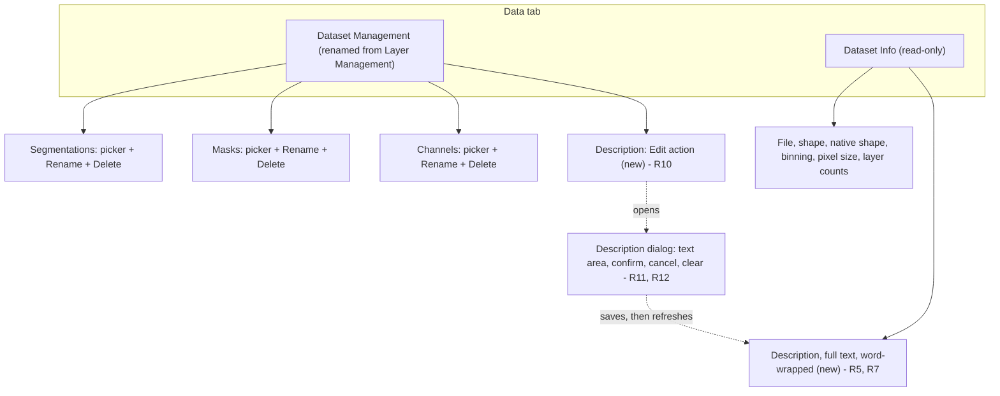
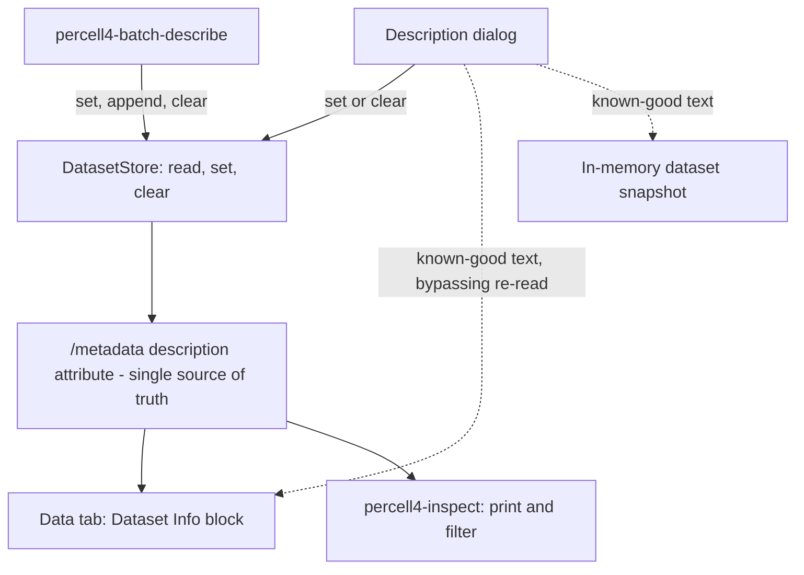
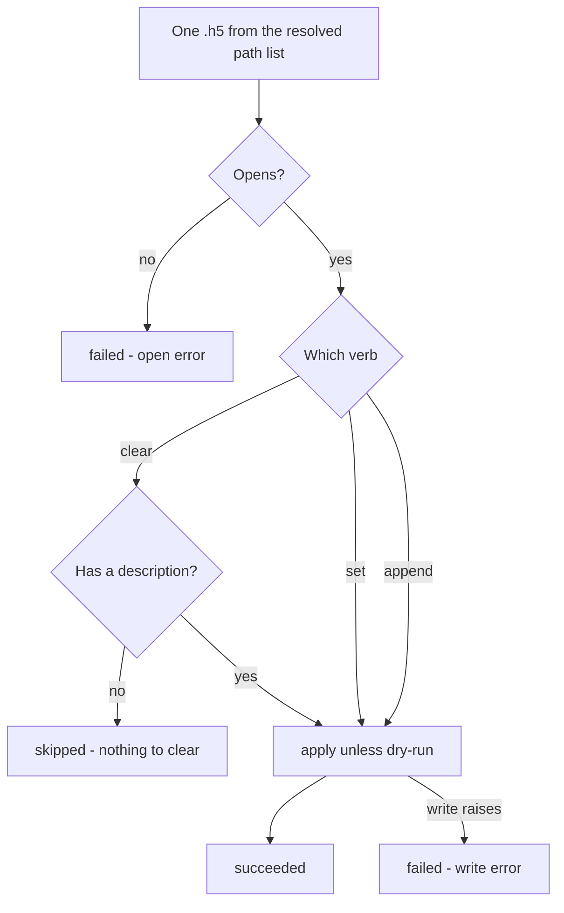

# Dataset Description Metadata - Plan

## Goal Capsule

- **Objective:** Let a researcher attach free-text experimental context to a `.h5` dataset, read it back in the launcher, and set or search it across a folder from the command line.
- **Authority:** Product behavior is owned by the Requirements below (R1–R23). Implementation mechanism is owned by the Key Technical Decisions (KTD1–KTD8) within those requirements. A unit overrides neither.
- **Execution profile:** Eight units, dependency-ordered. U1 unblocks every unit that reads or writes stored data; the editor dialog holds no file access and can be built at any point. The three surfaces (launcher display, launcher editor, command line) are independent of each other after U1 and U2.
- **Stop conditions:** Stop and ask if implementation would change what the description means to a reader — for example, if the free-text field needs internal structure to satisfy search, or if the storage layer cannot express "no description" distinctly from "empty description".
- **Tail ownership:** Standard repo flow — the implementer owns tests, lint, and commit; nothing here presumes a branch or PR shape.

**Product Contract preservation:** restructured, no scope change. Sources / Research moved from the Product Contract to the Planning Contract and expanded with planning research. Outstanding Questions reduced to the single item planning did not resolve; the rest became KTD1–KTD8 and the assumptions below. No R-ID was added, removed, split, or reworded.

---

## Product Contract

### Summary

Store one free-text description inside each `.h5` dataset. Print it read-only in the launcher's Data tab, edit it through a dialog launched from the Data tab's dataset-management controls, and set, append to, clear, or search it across many files from the command line.

### Problem Frame

A `.h5` dataset carries no record of what the experiment was. Cell line, fixation, drug, timing, and the fact that dish 3 had a bubble all live in the researcher's head or, at best, get compressed into a filename. Filenames are a hostile place for that information: they are length-limited, they cannot hold a sentence, and they degrade into token soup as more detail is crammed in.

The cost lands weeks later. Facing a folder of a dozen dishes from one experiment, the researcher cannot tell which is which without opening files one at a time — and opening a dataset in PerCell4 is not free. Context that was obvious on acquisition day is unrecoverable by the time it matters for analysis, and a collaborator or a future self has nothing to go on at all.

### Key Decisions

- One free-text description over a fixed field set (session-settled: user-directed — chosen over named fields and user-defined key-value pairs: nothing to agree on up front, and the field accepts whatever the experiment actually needs). Governs R1, R2.
- Identifying information lives inside the file, not beside it (session-settled: user-approved — chosen over a folder- or experiment-level description that per-dataset text layers onto: an external carrier reintroduces the problem this work exists to remove). Governs R1.
- The Data tab displays; a dialog edits (session-settled: user-directed — chosen over an always-visible editable text box: keeps Dataset Info a read-only orientation surface and makes saving unambiguous). Governs R5, R11.
- The editor sits with the existing dataset CRUD controls (session-settled: user-directed — chosen over a dedicated group box or the I/O tab: the launcher already has one place where a user renames and deletes what a dataset holds). Governs R10.
- Writing is a separate batch command from reading (session-settled: user-approved — chosen over one all-verb tool: every mutating tool in the repo already follows the `percell4-batch-*` shape, which carries dry-run and per-file reporting by convention). Governs R14, R17, R18.
- The write verb is always explicit (session-settled: user-directed — chosen over silent overwrite and over refuse-unless-forced: a folder-wide write is the operation most likely to destroy notes, and appending shared experiment text is a first-class workflow). Governs R15, R16.
- Cross-dataset identification stays headless (session-settled: user-directed — chosen over a launcher folder browser that previews descriptions: the CLI already reads many datasets cheaply without decoding arrays). Governs R21.

### Requirements

**Storage**

- R1. A dataset carries at most one description: free-form plain text, stored inside the `.h5` file so it travels with the file through copies and moves.
- R2. The description accepts multi-line text of arbitrary length within the storage format's limits, preserving the line breaks the user typed.
- R3. Absent and empty are the same state to every reader — a dataset either has a description or has none.
- R4. Clearing a description returns the dataset to the no-description state rather than storing an empty placeholder. Writing text that is empty or whitespace-only is a clear, not a write.

**Launcher display**

- R5. The Data tab's Dataset Info block prints the loaded dataset's description, read-only, alongside the file, shape, and binning lines it already shows.
- R6. A dataset with no description says so explicitly, so "none set" is distinguishable from "this build does not show descriptions".
- R7. The description renders in full and word-wrapped; it is never truncated or elided.
- R8. The displayed description follows the dataset — it updates when a dataset is loaded, updates after an edit is saved, and disappears when the dataset is closed.

**GUI editing**

- R9. The launcher can add, change, and remove the description of the currently loaded dataset without leaving the Data tab.
- R10. The edit action lives in the Data tab's dataset-management controls, next to the rename and delete controls for segmentations, masks, and channels; that group's name widens to cover the dataset rather than only its layers.
- R11. The editor is a dialog with a multi-line text area prefilled with the current description. Confirming writes it; cancelling leaves the dataset untouched.
- R12. The dialog offers a clear action that removes the description outright, so removal does not require selecting and deleting text by hand.
- R13. With no dataset loaded, the edit action is unavailable rather than opening an editor with nothing to write to.

**CLI writing**

- R14. A batch command writes the description across the `.h5` files named on the command line, or across every `.h5` in a directory given as an argument.
- R15. Every run states its verb — set, append, or clear — and the command refuses to run without one.
- R16. Set replaces whatever is there. Append adds the new text below the existing text without removing it. Clear removes the description.
- R17. The command reports each file's outcome individually and continues past a failure, matching the reporting shape of the existing batch tools.
- R18. A dry-run mode classifies every file exactly as a live run would, mutating nothing.
- R19. The command is discoverable in the Batch Tools Console alongside the other batch tools.

**CLI reading and search**

- R20. `percell4-inspect` prints each inspected dataset's description, in both its human-readable and its JSON output.
- R21. `percell4-inspect` accepts a text filter that narrows its output to datasets whose description matches, so a folder can be searched without opening any dataset in the launcher.
- R22. Filter matching is case-insensitive and matches anywhere within the description.
- R23. Reading a description never decodes an array, so inspecting a folder of multi-gigabyte datasets stays fast.

### Data tab composition

Region composition after this work. Existing regions are unchanged except where noted.

### Key Flows

- F1. Label a dataset you have open
  - **Trigger:** A researcher loads a dataset in the launcher and wants to record what it is.
  - **Steps:** Opens the Data tab; uses the Description edit action in the dataset-management controls; types the sample, preparation, and condition detail into the dialog; confirms.
  - **Outcome:** The description is written into the `.h5` and appears in Dataset Info.
  - **Covered by:** R9, R10, R11, R5, R8

- F2. Apply shared experiment context across a folder, then add per-dataset detail
  - **Trigger:** One experiment produced a dozen dishes that share preparation and conditions but differ per dish.
  - **Steps:** Runs the batch command against the experiment folder with the append verb and the shared text; optionally dry-runs first to see which files it will touch; then edits individual datasets — in the launcher or by naming single files on the command line — to append what is unique to each.
  - **Outcome:** Every dataset in the folder carries the shared context; individual datasets additionally carry their own.
  - **Covered by:** R14, R15, R16, R17, R18

- F3. Find the right dataset among many
  - **Trigger:** A researcher returns to a folder of datasets weeks later and does not know which one to open.
  - **Steps:** Runs `percell4-inspect` over the folder, optionally with a text filter, and reads the descriptions.
  - **Outcome:** The right dataset is identified without opening any of them in the launcher.
  - **Covered by:** R20, R21, R22, R23

### Acceptance Examples

- AE1. **Covers R3, R6.** Given a dataset that has never had a description, when it is loaded in the launcher, then Dataset Info states that no description is set rather than showing a blank line.
- AE2. **Covers R16.** Given a dataset whose description reads "HeLa p14, 4% PFA", when the batch command runs with the append verb and the text "2h 10uM drug", then the dataset's description contains both, the original first.
- AE3. **Covers R16.** Given the same dataset, when the batch command runs with the set verb and the text "2h 10uM drug", then the original text is gone and only the new text remains.
- AE4. **Covers R4, R12.** Given a dataset with a description, when the user clears it — from the dialog or with the clear verb — then the dataset reads as having no description, indistinguishable from one that never had one.
- AE5. **Covers R17, R18.** Given a folder containing datasets and at least one unreadable file, when the batch command runs in dry-run mode, then every file is reported with the outcome a live run would produce, no file is modified, and the unreadable file does not stop the run.
- AE6. **Covers R15.** Given a folder of datasets, when the batch command runs with text but no verb, then it refuses to run and nothing is written.
- AE7. **Covers R21, R22.** Given a folder where three of twelve datasets mention "PFA" in mixed case, when `percell4-inspect` runs over the folder with a "pfa" filter, then exactly those three are reported.
- AE8. **Covers R7.** Given a dataset whose description spans several paragraphs, when it is loaded, then Dataset Info shows the whole text wrapped, with no ellipsis and no cut-off.

### Scope Boundaries

- Named or structured fields (sample, preparation, conditions as separate keys) and user-defined key-value pairs. Rejected in favor of one free-text field; revisiting would mean migrating existing descriptions.
- Edit history, authorship, and timestamps on the description.
- Capturing a description at import time, when the dataset is first created from raw data.
- A launcher surface that browses a folder and previews each dataset's description before loading. Identification across datasets is the CLI's job here.
- Folder- or experiment-level descriptions that individual datasets inherit.
- Propagating a description into datasets derived from an existing one.
- Any change to how filenames are chosen or used.

#### Deferred to Follow-Up Work

- Reading the description text from a file or from stdin on the command line, for descriptions too long to type comfortably as a shell argument.
- Consolidating the batch-report dataclasses out of `src/percell4/application/use_cases/batch_rename_resource.py` into a shared module. The existing tools already import them from there; this work follows that precedent rather than changing it.

### Dependencies / Assumptions

- The `.h5` files already carry a metadata block that reads and writes as a set of named values and travels with the file (`src/percell4/store.py`). The description is a new entry in it; no new storage mechanism is required.
- Removing a single metadata entry is not something the store can do today — R4 and R12 need that capability added (KTD2).
- There is no practical size ceiling on the description. Verified against this project's environment: a 500 KB string attribute writes and reads back, and a multi-line Unicode value round-trips as a Python `str` with its line breaks intact. The brainstorm's open question about a storage ceiling is closed.
- Appending the same text to a folder twice duplicates it. This is accepted: the tool does not detect or prevent repeat appends.
- A dataset produced from another does not inherit its description. This is accepted; a derived dataset starts with none.
- The Batch Tools Console discovers batch tools by their registered command names, so following the existing naming convention is what makes R19 true.

### Outstanding Questions

**Deferred to Implementation**

- Whether the Data tab's description block needs its own scroll region. The panel's info block is a plain wrapped label today, so a multi-paragraph description grows the panel. Decide once the display lands and the real growth is visible; see the risk note in the Planning Contract.

---

## Planning Contract

### Key Technical Decisions

- KTD1. **Store the description as a `description` string attribute on the existing `/metadata` group** (session-settled: user-directed — chosen over named fields and user-defined key/value pairs: nothing to agree on up front). Governs R1, R2, R3. The metadata block already travels with the file and is already read by both the Data tab and the inspect CLI; a second metadata location would have to be taught to both.
- KTD2. **Add a single-key metadata delete to the store, and route empty writes through it.** Governs R4. `set_metadata` merges keys and cannot remove one, so clearing needs a direct attribute delete; expose it as a general key delete rather than a description-only special case. The description write method treats empty or whitespace-only text as a clear, so a confirmed edit that emptied the text area and an explicit clear leave identical bytes on disk.
- KTD3. **Reuse the existing batch-tool structure rather than inventing reporting for this tool** (session-settled: user-approved — chosen over one all-verb tool: mutating tools in this repo already share this shape). Governs R14, R17, R18, R19. Reuse the shared per-item report dataclasses, path resolution, per-item printing, `--dry-run`, `--quiet`, `--verbose`, and the exit-code rule.
- KTD4. **`--set`, `--append`, and `--clear` form a required, mutually exclusive argument group; `--clear` takes no text.** Governs R15, R16. Argparse then enforces "no verb, no run" and "not two verbs at once" without hand-written validation, and reports the violation before any file is opened.
- KTD5. **Append joins new text below existing text with one blank line between**, after stripping trailing whitespace from the existing text. Governs R16. Appending onto a dataset with no description writes the new text alone, with no leading blank line.
- KTD6. **After a launcher write, the panel displays the text it just wrote and pushes it into the in-memory dataset snapshot, instead of re-reading the file.** Governs R8. This repo has a documented in-session staleness class where a read handle opened right after a write in the same process serves a stale value; its prevention rule is to push known-good values into the in-memory snapshot rather than rely on a re-open (`docs/solutions/logic-errors/in-session-hdf5-staleness-multi-vector-2026-04-30.md`, rules 6 and 7).
- KTD7. **The inspect filter removes non-matching datasets from the output entirely**, in both human and JSON modes, and a run that reports nothing exits non-zero. Governs R21, R22. This makes the flag a search rather than an annotation, which is what answers "which of these is the one I want".
- KTD8. **The editor is a new dialog module under `src/percell4/gui/`.** Governs R11, R12. That package is where the repo's dialog conventions apply and where the compliance tests look; a dialog defined inline in the panel would sit outside both.
- KTD9. **The dialog's clear action confirms before removing a non-empty description.** Governs R12. Clearing destroys hand-written notes with no undo, and the panel's existing delete handler already routes destructive actions through a confirm prompt worded "this cannot be undone"; the description gets the same treatment. Cancelling the dialog still discards typed text without a prompt, matching the repo's other text prompts.

### High-Level Technical Design

One stored value, two write paths, three read surfaces. The dashed edge is the staleness bypass KTD6 requires.

Verb resolution and per-file classification in the batch command. Every branch ends in one reported outcome and the run continues to the next file.

### Implementation Constraints

- **Architecture contracts.** `percell4.application` must not import Qt, napari, or `h5py` at module scope. The new use case mirrors `batch_rename_resource`: it imports `DatasetStore` from `percell4.store` and keeps any direct `h5py` use inside a function body. Contracts are declared in `pyproject.toml` under `[tool.importlinter]`.
- **Dialog conventions.** A new `*_dialog.py` under `src/percell4/gui/` must call `wrap_in_scroll` from `src/percell4/gui/_dialog_utils.py` or it fails `tests/test_gui/test_dialog_helper_compliance.py`. Parented popups also take the freestanding-window treatment from the same module; both conventions have owning docs under `docs/solutions/ui-bugs/`.
- **No array decoding on read paths.** The inspect CLI answers metadata questions from HDF5 metadata only; adding the description must not change that (R23).
- **Naming.** The console script must start with `percell4-` for `src/percell4/interfaces/cli/catalog.py` to enumerate it (R19).

### Risks

- **A very long description grows the Data tab.** The Dataset Info block is a plain wrapped label inside a top-aligned panel layout, so a multi-paragraph description pushes the panel taller with nothing to scroll. R7 forbids truncating, so the mitigation is a scrollable read-only region rather than an ellipsis. Decide once U5 lands — this is the Outstanding Question above.
- **Batch writes race a live GUI session.** The batch tools write to the same `.h5` files the launcher reads; the existing tools warn about this in their help text and the README states it as a shared convention. Carry the same warning rather than inventing locking.

---

## Implementation Units

### U1. Description storage on DatasetStore

- **Goal:** Give `DatasetStore` a first-class description accessor and the ability to remove a single metadata entry.
- **Requirements:** R1, R2, R3, R4. Implements KTD1 and KTD2.
- **Dependencies:** none.
- **Files:** `src/percell4/store.py`, `tests/test_store.py`
- **Approach:**
  1. Add a `description` read accessor that returns the `/metadata` `description` attribute as `str`, or `None` when the attribute is absent or is whitespace-only. Decode `bytes` defensively, matching how the existing `metadata` property normalizes `channel_names`.
  2. Add a write method that persists the text through the existing `set_metadata` path, so its native-shape and creation-bin side effects stay unchanged. Text that is empty or whitespace-only clears instead of writing, so no empty placeholder ever reaches disk.
  3. Add a general single-key metadata delete that removes the attribute from the `/metadata` group and returns whether anything was removed. Clearing the description calls it.
- **Patterns to follow:** the existing `metadata` property and `set_metadata` in the same file for read/write shape and normalization; `delete_item` for the "returns whether anything happened" convention.
- **Execution note:** Write the same-process write-then-read scenario first. The staleness learning cited in KTD6 exists because a subprocess round-trip cannot detect this class.
- **Test scenarios:**
  - A multi-line description containing Unicode round-trips with its line breaks preserved.
  - A dataset with no description reads as `None`.
  - Covers AE1. A description written as an empty or whitespace-only string reads back as `None`, indistinguishable from never having been set.
  - Covers AE4. Clearing a description removes it; the next read returns `None`.
  - Writing empty or whitespace-only text over an existing description removes the stored value rather than writing a placeholder, leaving the same bytes on disk as an explicit clear.
  - Clearing a dataset that has no description is a no-op and reports that nothing was removed.
  - Writing a description leaves the other metadata entries (channel names, pixel size, creation bin) unchanged.
  - Write then read within the same process returns the value just written.
- **Verification:** The store can set, read back, and clear a description; no existing metadata test changes behavior.

### U2. Batch description use case

- **Goal:** Apply one description operation across a list of datasets, isolating per-file failures.
- **Requirements:** R14, R16, R17, R18. Implements KTD3, KTD5.
- **Dependencies:** U1.
- **Files:** `src/percell4/application/use_cases/batch_set_description.py`, `tests/test_batch_set_description.py`
- **Approach:**
  1. Take the dataset paths, the verb, and the text; return the same report shape the other batch operations use, importing the per-item and report dataclasses from `src/percell4/application/use_cases/batch_rename_resource.py` as `batch_delete_resource` already does.
  2. Classify per file: an unopenable file is a failure; a clear on a dataset with no description is a skip; set and append always apply. A dry run classifies identically and writes nothing.
  3. Append reads the current description, strips its trailing whitespace, and joins the new text with one blank line. Appending onto no description writes the new text alone.
  4. Invoke the progress callback once per dataset, as the sibling use cases do.
- **Patterns to follow:** `src/percell4/application/use_cases/batch_rename_resource.py` end to end — status taxonomy, per-file try/except boundaries, and the report dataclasses.
- **Test scenarios:**
  - Covers AE2. Append onto an existing description keeps the original text first and adds the new text below it.
  - Covers AE3. Set over an existing description leaves only the new text.
  - Append onto a dataset with no description writes the new text with no leading blank line.
  - Covers AE4. Clear removes the description.
  - Clear on a dataset with no description is reported as skipped, not as a failure or a success.
  - Covers AE5. A batch containing one unreadable file reports that file as failed and still processes the rest.
  - Dry run over a mixed folder produces the same per-file classifications as a live run and leaves every file byte-identical.
  - The progress callback fires once per input path, in order.
- **Verification:** A mixed folder produces one report item per file with correct statuses, and dry run mutates nothing.

### U3. `percell4-batch-describe` CLI

- **Goal:** Expose the batch operation as a registered console command with explicit write verbs.
- **Requirements:** R14, R15, R16, R17, R18, R19. Implements KTD3, KTD4.
- **Dependencies:** U2.
- **Files:** `src/percell4/interfaces/cli/batch_describe.py`, `pyproject.toml`, `tests/test_cli_batch_describe.py`
- **Approach:**
  1. Build the parser with a positional `paths` argument, a required mutually exclusive verb group (`--set`, `--append`, `--clear`), plus `--dry-run`, `--quiet`, and `--verbose`, matching the shared CLI conventions documented in the README.
  2. Resolve paths and print per-item status with the shared helpers in `src/percell4/interfaces/cli/_batch_report.py`, choosing a verb word for the count noun.
  3. Print the totals line and return `0` when at least one dataset made progress, `1` otherwise.
  4. Register the console script as `percell4-batch-describe` in `pyproject.toml`.
- **Patterns to follow:** `src/percell4/interfaces/cli/batch_rename_resource.py` for parser shape, help and epilog style, the GUI-files-first warning, and exit-code handling.
- **Test scenarios:**
  - Covers AE6. Invoking with text but no verb exits non-zero without opening any file.
  - Supplying two verbs at once is rejected by the parser.
  - `--clear` accepts no text argument.
  - A directory argument expands to every `.h5` directly inside it; a mix of file and directory arguments resolves in order.
  - Paths that match no `.h5` file exit non-zero with a message on stderr.
  - The CLI forwards paths, verb, text, and dry-run to the use case unchanged (use-case stubbed).
  - Exit code is `0` when at least one dataset progressed and `1` when every dataset was skipped or failed.
  - End-to-end against real `.h5` files: set, then append, then clear, reading back through the store between steps.
- **Verification:** `percell4-batch-describe --help` shows the three verbs; an end-to-end set/append/clear cycle changes the files as expected.

### U4. Description in `percell4-inspect`, with a text filter

- **Goal:** Print each dataset's description and let a folder be searched by it.
- **Requirements:** R20, R21, R22, R23. Implements KTD7.
- **Dependencies:** U1.
- **Files:** `src/percell4/interfaces/cli/inspect_dataset.py`, `tests/test_cli_inspect_dataset.py`
- **Approach:**
  1. Add the description to the per-dataset record the inspector builds, so it appears in JSON output alongside the other metadata entries.
  2. Print it in the human-readable block, with an explicit marker when there is none, matching how the block already renders unknown values.
  3. Add a `--grep` option. When set, a dataset whose description is absent or does not contain the text is dropped from both output modes before printing.
  4. Count only reported datasets toward the success exit code, so a filter that matches nothing exits non-zero.
- **Patterns to follow:** the existing metadata-record builder and the human-readable printer in the same file; the em-dash convention already used for unknown values.
- **Test scenarios:**
  - A dataset with a description prints it in human output and includes it in JSON output.
  - Covers AE1. A dataset with no description prints the no-description marker and reports a null description in JSON.
  - Covers AE7. Filtering a folder reports only the matching datasets, in both output modes.
  - Filter matching is case-insensitive and matches a substring rather than the whole description.
  - A filter matching nothing prints no dataset blocks and exits non-zero.
  - A filter run over a dataset with no description excludes it.
  - Inspecting a dataset does not read any array (assert via the existing metadata-only read path, not by timing).
- **Verification:** `percell4-inspect <dir> --grep <text>` reports only matching datasets and stays metadata-only.

### U5. Data tab shows the description

- **Goal:** Print the loaded dataset's description read-only in the Dataset Info block.
- **Requirements:** R5, R6, R7. Implements part of R8 (load and close).
- **Dependencies:** U1.
- **Files:** `src/percell4/interfaces/gui/task_panels/data_panel.py`, `tests/test_gui/test_data_panel_description.py`
- **Approach:**
  1. Extend the Dataset Info refresh to read the description from the store's metadata and append it below the existing lines, word-wrapped, with an explicit no-description line when there is none.
  2. Give the refresh an optional parameter carrying a known-good description, used by U7 and ignored elsewhere.
  3. Clear the description along with the rest of the info text when the dataset closes.
- **Patterns to follow:** the pixel-size line helper in the same file for "unknown" rendering; the existing refresh and clear methods for where state is read and reset.
- **Test scenarios:**
  - Covers AE8. A multi-paragraph description appears in full in the info text with no ellipsis.
  - Covers AE1. A dataset with no description shows the explicit no-description line.
  - Closing the dataset removes the description from the info text.
  - Passing a known-good description to the refresh displays that text instead of what the store returns.
  - A store read failure leaves the rest of the info text intact rather than blanking the panel.
- **Verification:** Loading a described dataset shows its text in Dataset Info; closing it clears the text.

### U6. Description editor dialog

- **Goal:** A modal editor for one dataset's description, with confirm, cancel, and clear.
- **Requirements:** R11, R12. Implements KTD8, KTD9.
- **Dependencies:** none — the dialog holds no file access.
- **Files:** `src/percell4/gui/description_dialog.py`, `tests/test_gui/test_description_dialog.py`
- **Approach:**
  1. Build a dialog holding a multi-line text area prefilled with the current description, plus confirm, cancel, and clear actions.
  2. Wrap the content with `wrap_in_scroll` and apply the freestanding-window and screen-cap helpers from `src/percell4/gui/_dialog_utils.py`, per the conventions those helpers own.
  3. Expose the result as a value the caller can act on: the edited text, or an explicit clear, or nothing on cancel. The dialog performs no file I/O — the caller owns the write.
  4. Confirm before clearing a non-empty description, using `message_box`, worded like the panel's existing delete confirmation (KTD9).
- **Patterns to follow:** an existing dialog under `src/percell4/gui/` for construction and helper usage; `message_box` in `_dialog_utils` and the panel's `_on_delete_layer` confirmation wording.
- **Test scenarios:**
  - The dialog opens prefilled with the current description; opening it on a dataset with none starts empty.
  - Confirming returns the edited text, including line breaks the user typed.
  - Cancelling returns no result and reports no intent to write.
  - Clear returns an explicit clear result, distinct from returning empty text.
  - Clear on a non-empty description asks for confirmation first; declining leaves the dialog open with the text intact.
  - Clear on an already-empty description does not ask for confirmation.
  - The dialog contains exactly one scroll area wrapping its content, satisfying the dialog compliance convention.
- **Verification:** `tests/test_gui/test_dialog_helper_compliance.py` passes with the new dialog present, and the dialog's own tests cover all three outcomes.

### U7. Wire the editor into the Data tab

- **Goal:** Add the Description edit action to the dataset-management controls and make the display reflect a save immediately.
- **Requirements:** R9, R10, R13. Completes R8. Implements KTD6.
- **Dependencies:** U1, U5, U6.
- **Files:** `src/percell4/interfaces/gui/task_panels/data_panel.py`, `tests/test_gui/test_data_panel_description.py`
- **Approach:**
  1. Rename the management group so it covers the dataset rather than only its layers, and add a Description row with an Edit action beneath the existing segmentation, mask, and channel rows.
  2. On Edit with no dataset loaded, report it through the panel's status callback and do not open the dialog.
  3. On confirm, write through the store; on clear, clear through the store.
  4. After a successful write, pass the known-good text into the info refresh and write it into the in-memory dataset snapshot, rather than re-reading the file (KTD6).
  5. Report the outcome through the status callback, as the rename and delete handlers do.
- **Patterns to follow:** the rename and delete handlers in the same file for the guard/act/refresh/report sequence; the metadata-snapshot update described in the cited staleness learning.
- **Execution note:** Prove the save-then-display path in-process. A test that writes and then re-opens in a fresh process cannot detect the staleness this unit guards against.
- **Test scenarios:**
  - Covers AE1. Saving a description updates the Dataset Info text in the same interaction, without a reload.
  - Saving a description updates the in-memory dataset snapshot so a later reader of the snapshot sees the new text.
  - Covers AE4. Clearing from the dialog removes the description and the info block reverts to the no-description line.
  - Cancelling the dialog leaves the stored description unchanged.
  - With no dataset loaded, the Edit action reports the condition and opens no dialog.
  - A store write failure reports the error and leaves the displayed text as it was.
  - The management group's visible title covers the dataset, and the existing rename and delete controls still function.
- **Verification:** Edit, save, clear, and cancel all behave from the Data tab, and the displayed text matches what was written without reopening the dataset.

### U8. Document both command-line surfaces

- **Goal:** Bring the README's Command-line Tools section up to date with the new command and the new inspect option.
- **Requirements:** R19 (discoverability), R20, R21.
- **Dependencies:** U3, U4.
- **Files:** `README.md`
- **Approach:** Add a `percell4-batch-describe` subsection in the established per-tool shape with usage examples for set, append, and clear; add the filter option to the existing `percell4-inspect` subsection; add the matching table-of-contents entries.
- **Patterns to follow:** the `percell4-batch-rename` and `percell4-inspect` subsections and the shared-conventions preamble above them.
- **Test expectation:** none — documentation only, no behavior to test.
- **Verification:** The new command appears in the table of contents and its section follows the shape of its siblings.

---

## Verification Contract

| Gate | Command | Applies to | Done signal |
|---|---|---|---|
| Unit and integration tests | `pytest` | U1–U7 | Green. The bare invocation is deliberate — selection lives in `pyproject.toml`, and `tests/test_gui` is inside the default run. |
| Lint | `ruff check src tests tests_gui` | U1–U7 | No findings. This is the exact CI invocation. |
| Architecture contracts | `lint-imports` | U2, U3 | All contracts kept. Not run in CI today; run it locally because U2 adds an application-layer module. |
| Console script registration | `percell4-batch-describe --help` after a re-install of the package | U3 | The command resolves and prints the three verbs. |
| Batch Tools Console discovery | Open the Batch Tools Console in the launcher | U3 | `percell4-batch-describe` is listed with the other batch tools. |

Acceptance examples AE1–AE8 are covered by the test scenarios that name them; no acceptance example is left to manual checking alone.

---

## Definition of Done

**Global**

- Every requirement R1–R23 is either implemented by a unit above or explicitly covered by an existing behavior the plan preserves.
- Every gate in the Verification Contract passes.
- No abandoned or experimental code from approaches that did not pan out remains in the diff.
- No absolute paths, machine-specific paths, or debugging output are left in the source.

**Per unit**

- U1: the store sets, reads, and clears a description, and absent and empty read identically.
- U2: a mixed folder yields one correctly classified report item per file, and dry run mutates nothing.
- U3: the command is registered, refuses to run without a verb, and its end-to-end set/append/clear cycle changes files as expected.
- U4: descriptions print in both output modes and the filter narrows a folder to the matching datasets.
- U5: the Data tab shows a description in full, and shows an explicit line when there is none.
- U6: the dialog returns edited text, an explicit clear, or nothing; clearing a non-empty description asks first; and the dialog satisfies the compliance convention.
- U7: saving from the Data tab updates the display in the same interaction, and the in-memory snapshot agrees with what was written.
- U8: both command-line surfaces are documented in the README's established shape.

---

## Sources / Research

- `src/percell4/store.py` — `DatasetStore.metadata` (read, with normalization precedent) and `set_metadata` (write, merge-only, with native-shape side effects). The class has no method for removing a single metadata entry, which is why KTD2 exists.
- `src/percell4/application/use_cases/batch_rename_resource.py` — the status taxonomy, `BatchOperationItemResult` / `BatchOperationReport`, per-file isolation, and dry-run classification that U2 mirrors. `batch_delete_resource.py` imports those dataclasses from here, which is the precedent U2 follows.
- `src/percell4/interfaces/cli/batch_rename_resource.py` and `src/percell4/interfaces/cli/_batch_report.py` — parser shape, `resolve_paths` (file and directory arguments, non-recursive glob), `print_item_status`, and the exit-code rule.
- `src/percell4/interfaces/cli/inspect_dataset.py` — the metadata record builder and human-readable printer U4 extends, already metadata-only by design.
- `src/percell4/interfaces/cli/catalog.py` — enumerates `percell4-*` console entry points for the Batch Tools Console; registration in `pyproject.toml` is what makes R19 true.
- `src/percell4/interfaces/gui/task_panels/data_panel.py` — `_build_ui` builds the management and info group boxes; `refresh_dataset_info` composes the read-only text; the rename and delete handlers model the guard/act/refresh/report sequence.
- `src/percell4/gui/_dialog_utils.py` — `wrap_in_scroll`, `cap_to_screen`, `make_freestanding`, `center_on_screen`, `message_box`. The conventions have owning docs under `docs/solutions/ui-bugs/`.
- `tests/test_gui/test_dialog_helper_compliance.py` and `tests/test_gui/test_dialog_migrations.py` — the compliance shape a new dialog must satisfy.
- `docs/solutions/logic-errors/in-session-hdf5-staleness-multi-vector-2026-04-30.md` — the source of KTD6. Prevention rule 6 (push known-good values into the in-memory snapshot after a write), rule 7 (add a post-write read-back test), and rule 8 (validate in-process, not via subprocess) all apply directly to U1 and U7.
- `docs/solutions/logic-errors/large-file-load-metadata-read-full-decode-2026-06-07.md` — why read paths must not decode arrays to answer metadata questions (R23).
- `pyproject.toml` — `[tool.importlinter]` layer contracts, ruff configuration, and the pytest selection that makes a bare `pytest` the single source of truth.
- Storage-ceiling probe run against this project's environment: a 500 KB string attribute writes and reads back, a multi-line Unicode value round-trips as `str`, and deleting a single attribute works. This closes the brainstorm's open question about a size limit.
