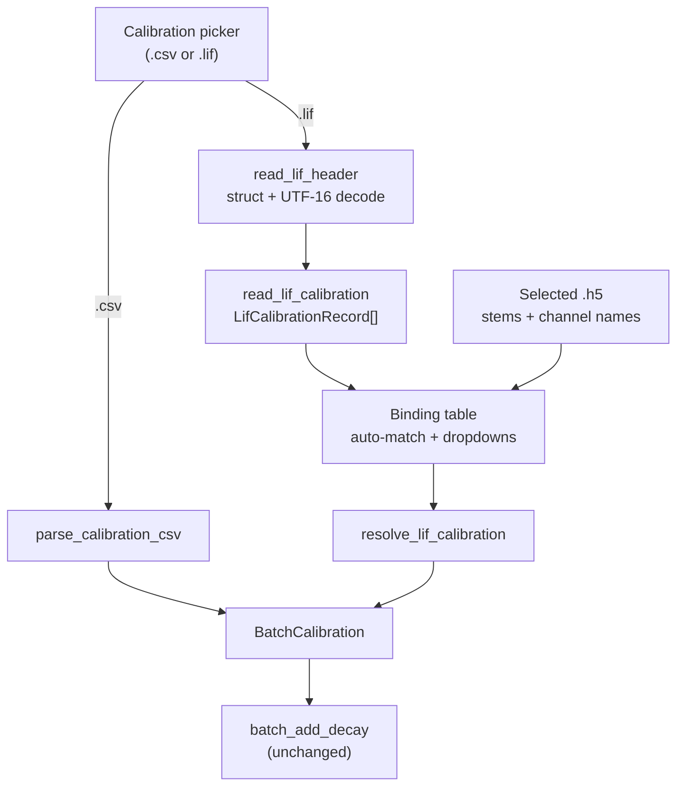

# Calibration From .lif Files - Plan

## Goal Capsule

**Objective.** Let the Batch TCSPC append flow take FLIM phasor calibration from a Leica `.lif` file wherever it takes a calibration CSV today, at the full precision LAS X stored rather than the four decimal places its UI displays.

**Authority.** The Requirements below govern behavior. Key Technical Decisions govern mechanism within those requirements. `docs/reference/lif-xml-header.md` is the authority on the `.lif` header layout and is cited rather than restated.

**Execution profile.** Domain-first. U1 through U3 are pure functions with no Qt and no `.h5`, testable in isolation; the dialog work in U4 through U6 consumes them. Build in that order.

**Stop conditions.** Stop and raise if a `.lif` in hand has a phasor calibration shape this plan does not cover — more than one calibrated channel per region, or a harmonic other than 1. Both are unverified against real files and are recorded as open questions, not assumptions.

**Tail ownership.** Standalone run: this plan owns through local verification. Commit, push, and PR are the user's call.

---

## Product Contract

### Summary

Add a second source for the calibration the Batch TCSPC dialog already consumes. A new pure-domain reader pulls the phasor calibration record out of a `.lif` file's XML header and converts it into the same `BatchCalibration` the CSV parser produces, so `batch_add_decay` and everything downstream of it is untouched. The dialog's calibration section accepts either file type through one picker, and a binding table with an auto-match button and per-row dropdowns maps each `.lif` record onto the selected `.h5` datasets and channels. The CSV path stays fully supported.

### Problem Frame

Calibrating a TCSPC batch means hand-transcribing numbers out of the LAS X *Phasor Calibration* dialog into a CSV. That is slow, it is per-dataset, and it silently loses precision: LAS X displays `25.45°` and `0.9994` for values it stored as `25.45322087` and `1.000587231`. The transcribed `batch_tcspc_calibration.csv` for the reference dataset is off by 5.6e-05 rad in phase and 1.3e-05 in modulation purely from reading the screen.

The numbers are already in the `.lif` at full precision. Nothing reads them.

The format has one trap. The header carries two phasor calibration records under the same element, and the wrong one is easier to find. `PhasorPhase` / `PhasorAmplitude` sit under the acquisition-time detector block and appear *earlier* in the document; `AutomaticReferencePhase` / `AutomaticReferenceAmplitude` sit under the phasor-analysis block and are what the LAS X Images table displays and applies. For the reference file they differ by 5.459° — a time-origin shift of 2.0044 decay bins, not a different calibration.

### Requirements

**Reading the .lif**

- R1. A reader returns the phasor calibration records from a `.lif` file without decoding pixel data.
- R2. Extraction reads the per-image record (`AutomaticReferencePhase`, `AutomaticReferenceAmplitude`, `Period`) and never the acquisition-side record (`PhasorPhase`, `PhasorAmplitude`).
- R3. Values convert to the units `domain/io/calibration_csv.py` already defines: `frequency_mhz` from `1 / Period / 1e6`, `phase` in radians from `-radians(AutomaticReferencePhase)`, `modulation` from `1 / AutomaticReferenceAmplitude`.
- R4. A `.lif` carrying no per-image phasor calibration fails with a message naming the file, rather than yielding identity calibration.
- R5. A malformed or non-`.lif` file fails with a message distinguishing a bad container header from a well-formed header with no calibration in it.

**Binding records to datasets and channels**

- R6. Each record carries the identity needed to bind it: region element name, derived dataset stem, channel index, and detector name where resolvable.
- R7. Auto-match binds a record to a selected `.h5` by dataset stem, and to a channel when that binding is unambiguous.
- R8. An ambiguous binding is left unbound rather than guessed.
- R9. Every binding is visible before the run and overridable by hand.
- R10. A channel left unbound when the run is validated is a pre-flight error naming the dataset and the channel.

**Dialog integration**

- R11. The calibration section accepts a `.csv` or a `.lif` through one picker, dispatching on file suffix.
- R12. The CSV path behaves exactly as it does today — same parser, same errors, same status text.
- R13. Loading a `.lif` reports what was loaded in the same place and role as the CSV status line.

### Scope Boundaries

- Pixel, decay, and phasor image data in the `.lif` stay unread. Only the header is parsed. The existing `.tif` plus `.bin` import path is untouched.
- Recomputing calibration from the reference decay is out. Both stored records are values LAS X already solved, and neither is reproducible from the stored `RawDataFrequency` decay by a single-lifetime reference fit. This plan transcribes.
- The acquisition-side record is not exposed anywhere in the UI, not even as an alternative. It is a decoy (KTD1).
- No CLI. The `.lif` becomes a source for the existing dialog, not a new batch command.

**Deferred to follow-up work**

- Harmonics 2 and 3. `domain/flim/phasor.py` supports per-harmonic calibration through `MAX_CAL_HARMONIC`, but the reference `.lif` persists only harmonic 1, and the multi-harmonic storage shape is unverified.
- Writing extracted calibration directly into `.h5` metadata without going through the dialog.

### Acceptance Examples

- AE1. Covers R2, R3. **Given** the reference `.lif`, **when** its calibration is read, **then** the single record carries `frequency_mhz` 78.020000, `phase` -0.444242509, and `modulation` 0.999413114 — and specifically not the -0.348959893 that the acquisition record's 19.99392909° would yield.
- AE2. Covers R7. **Given** a `.lif` with one calibrated region and a selected `.h5` whose stem matches that region and which has exactly one channel, **when** auto-match runs, **then** the channel binds to that record.
- AE3. Covers R8, R10. **Given** a `.lif` with one record and a selected `.h5` with two channels, **when** auto-match runs, **then** both channels stay unbound, and validating the run fails naming both.
- AE4. Covers R12. **Given** a calibration CSV, **when** it is chosen in the reworked picker, **then** parsing, error reporting, and status text are unchanged from today.

### Sources

- `docs/reference/lif-xml-header.md` — container layout, element tree, both calibration records verbatim, tag index. Authority for the format; do not re-derive it.
- `docs/reference/lif-xml-header.xml` — the full pretty-printed header of the reference file.
- `src/percell4/domain/io/calibration_csv.py` — `BatchCalibration` and `ChannelCalibration`, the types this work must produce, and `validate_frequency_consistency`, which it reuses.
- `src/percell4/gui/batch_tcspc_dialog.py` — the `csv_parser` injection seam (constructor), the auto-match-plus-combo pattern in `_build_section_pairing` and `_on_auto_pair`, and the preserve-manual-picks-across-refresh rule in `_refresh_channel_tokens_table`.
- `src/percell4/application/use_cases/batch_add_decay.py` — consumes `BatchCalibration` keyed by `.h5` stem then `.h5` channel name; explains why binding is required rather than optional.

---

## Planning Contract

### Key Technical Decisions

- KTD1. **Read the per-image record; treat the acquisition record as a decoy.** (session-settled: user-directed — chosen over the acquisition `PhasorPhase` / `PhasorAmplitude` record: the per-image values are what LAS X displays and applies, and the two are a 2-bin time-origin shift apart rather than alternative calibrations.) Governs R2. Extraction anchors on `AutomaticReferencePhase` and must never fall back to `PhasorPhase`, including when the per-image block is absent — that case is R4's error.
- KTD2. **`phase = -radians(deg)`, `modulation = 1 / amplitude`.** (session-settled: user-directed — confirmed numerically against the hand-typed `batch_tcspc_calibration.csv`, whose three residuals are exactly the LAS X display rounding.) Governs R3.
- KTD3. **Parse the header in-house; add no dependency.** Everything needed is the XML header, which is a struct-unpack and a UTF-16 decode away. `readlif` would add a runtime dependency to pin and bundle through `percell4.spec`, and it does not expose the phasor-analysis block, so the block-walking code would still be ours. Governs R1.
- KTD4. **Produce `BatchCalibration`; change nothing downstream.** The `.lif` becomes a second producer of a type that already exists, so `batch_add_decay`, the `/metadata` attr keys, and `resolve_calibration` are untouched. Governs R3, R12.
- KTD5. **Two-stage parse: records, then resolution.** `.lif` parsing yields `LifCalibrationRecord` values that know only what the `.lif` says. A separate resolver combines those with the selected datasets' channel names to produce `BatchCalibration`. Splitting here keeps the parser testable with no `.h5` fixture, and keeps the dialog's `csv_parser: Callable[[Path], BatchCalibration]` seam honest — a `.lif` reader cannot satisfy that signature, because it cannot know channel names. Governs R6, R7.
- KTD6. **Binding UI mirrors the pairing section.** (session-settled: user-directed — chosen over hand-mapping every row, and over strict-match-or-refuse, which would reject the reference dataset since detector `HyD X 3` does not equal channel `G3BP1`.) A table with a per-row `QComboBox` and an auto-match button, following `_build_section_pairing` and `_on_auto_pair`. Governs R9.

### High-Level Technical Design

The `.lif` enters at the same point as the CSV and converges on `BatchCalibration` before anything downstream sees it.

The two branches differ in one way that matters: the CSV arrives already keyed by `.h5` stem and channel name, because a human typed those names in. The `.lif` branch has to acquire that keying, which is what the binding table exists for.

### Assumptions

- A1. A dataset stem is the root element `Name` joined to the region element `Name` with `_` — `FLIM_calibratoin_test` plus `Region_1` gives `FLIM_calibratoin_test_Region_1`, matching both the `.h5` stem and the exported `.tif` prefix. Verified against one file.
- A2. One calibrated channel per region is the common case. The reference file has exactly one, and auto-match's unambiguous path (R7) assumes it is typical.
- A3. Reading a whole `.lif` into memory to reach its header is acceptable at the sizes in use (the reference file is 78 MB). U1 reads only the header bytes rather than the whole file, so this assumption is about the ceiling, not the mechanism.

### Open Questions

Both are deferred, not blocking. Neither prevents implementation; both bound what the plan may claim.

- Q1. How does a `.lif` with multiple regions or multiple calibrated detectors lay out its records? Only a single-region, single-detector file was available. The parser is written to return a collection and the resolver to handle many-to-many, but the multi-record shape is inferred from the tree structure rather than observed.
- Q2. Where does a harmonic-2 calibration live — a second `Channels` block, or additional fields in the existing one? Deferred with harmonics generally.

### Sequencing

U1 to U3 are pure domain and land in order. U4 depends on U2 and U3. U5 depends on U4. U6 depends on U5. U7 is documentation and can land any time after U5.

---

## Implementation Units

### U1. LIF container header reader

**Goal.** Decode a `.lif` file's XML header into an element tree, reading only the header bytes.

**Requirements.** R1, R5.

**Dependencies.** None.

**Files.**
- `src/percell4/domain/io/lif_header.py` (new)
- `src/percell4/domain/errors.py` — add `LifHeaderError(PercellError)`, following the `CalibrationCSVError` shape
- `tests/conftest.py` — add a `lif_header_bytes` factory fixture
- `tests/test_io/test_lif_header.py` (new)

**Approach.**

1. `read_lif_header(path) -> Element` opens the file, reads the first 13 bytes, validates the `0x70` block marker and the `0x2A` separator, then reads exactly `nchars * 2` further bytes and decodes them as UTF-16LE.
2. Size the payload read from `nchars * 2`, never from the `int32` at offset 4. That field counts the whole remainder of the block — separator plus char count plus XML — and overshoots the XML by five bytes. See the container layout table in `docs/reference/lif-xml-header.md`.
3. Raise `LifHeaderError` with a message naming the file and the specific check that failed.
4. Add a `lif_header_bytes` factory fixture to `tests/conftest.py` that wraps arbitrary header XML in a valid container. The reference `.lif` is 78 MB and cannot be checked in; every test below synthesizes the header it needs, and U2's tests reuse the same fixture. Put it in `conftest.py` rather than a helper module: no test in this repo imports a shared helper from `tests/`, and `tests/fixtures/` holds on-disk data directories with their own generator scripts, which is a different mechanism.

**Patterns to follow.** `CalibrationCSVError` in `src/percell4/domain/errors.py` for the error class. `tmp_h5` in `tests/conftest.py` for a path-producing fixture. Module-level docstring stating the format contract, matching `domain/io/calibration_csv.py`.

**Test scenarios.**
- A header built by the fixture builder round-trips: the returned root is `LMSDataContainerHeader` and a nested element's text survives.
- Non-ASCII element text round-trips through the UTF-16 decode.
- A file whose first `int32` is not `0x70` raises `LifHeaderError` naming the marker.
- A file whose byte at offset 8 is not `0x2A` raises `LifHeaderError` naming the separator.
- A file truncated inside the XML payload raises `LifHeaderError` rather than yielding a partial tree.
- A header whose offset-4 field is exactly five greater than `nchars * 2` decodes to the exact XML, with no trailing bytes — the sizing rule in step 2.
- Empty file and a file shorter than 13 bytes both raise `LifHeaderError`.

**Verification.** `pytest tests/test_io/test_lif_header.py` passes, and `lint-imports` still passes — the module is stdlib-only and must not pull anything the `domain/` contract forbids.

---

### U2. Calibration record extraction

**Goal.** Turn a `.lif` header tree into calibration records in PerCell4 units.

**Requirements.** R2, R3, R4, R6.

**Dependencies.** U1.

**Files.**
- `src/percell4/domain/io/lif_calibration.py` (new)
- `src/percell4/domain/errors.py` — add `LifCalibrationError(PercellError)` carrying a message list, mirroring `CalibrationCSVError`
- `tests/test_io/test_lif_calibration.py` (new)

**Approach.**

1. Define a frozen `LifCalibrationRecord`: `dataset_stem`, `region_name`, `channel_index`, `detector_name`, `frequency_mhz`, `phase`, `modulation`, `harmonic`.
2. `read_lif_calibration(path) -> tuple[LifCalibrationRecord, ...]` walks the tree for `Channels` blocks containing an `AutomaticReferencePhase` child. That child's presence is the selector — it is what distinguishes the per-image block from every other `Channels` element in the tree, of which the reference file has 26.
3. Convert per KTD2 and R3. Keep full float precision; do no rounding.
4. Derive `dataset_stem` per A1 from the root element `Name` and the nearest ancestor region element `Name`.
5. Resolve `detector_name` best-effort from the acquisition `Detectors` block whose `Detector` index matches, falling back to `ch{index}`. This is a display label for the dropdown only — nothing binds on it, so a miss is cosmetic.
6. Raise `LifCalibrationError` when no per-image block exists, with a message that says the header parsed but carried no phasor calibration, distinguishing R4 from R5.

**Patterns to follow.** `parse_calibration_csv` in `src/percell4/domain/io/calibration_csv.py` — accumulate per-record errors and raise once at the end rather than bailing on the first.

**Test scenarios.**
- Covers AE1. A header containing both records yields `phase` -0.444242509, `modulation` 0.999413114, `frequency_mhz` 78.020000, each to nine significant figures.
- Covers AE1. That same header does not yield -0.348959893 — the value the acquisition record's 19.99392909° would produce. Assert the wrong value is absent, not merely that the right one is present.
- A header carrying only the acquisition record and no `AutomaticReferencePhase` raises `LifCalibrationError`, not a silently identity calibration.
- Sign and inversion are exercised independently: a record with phase 0° yields phase 0.0, and one with amplitude 1.0 yields modulation 1.0.
- Two regions each with a calibration block yield two records with distinct `dataset_stem` values.
- `dataset_stem` joins root and region names with `_`.
- `detector_name` falls back to `ch0` when no matching acquisition `Detectors` block exists.
- A header with 26 `Channels` blocks of which one has `AutomaticReferencePhase` yields exactly one record — the selector in step 2 does not over-match.

**Verification.** `pytest tests/test_io/test_lif_calibration.py` passes. Add one test guarded by `pathlib.Path(...).exists()` on the reference `.lif` under `/Volumes/NX-74205/`, skipped when the volume is absent, asserting the same three values against the real file. It must not be the only coverage of those values.

---

### U3. Resolve records against a dataset selection

**Goal.** Combine records with the selected datasets' channel names to produce `BatchCalibration`, reporting what could not be bound.

**Requirements.** R7, R8.

**Dependencies.** U2.

**Files.**
- `src/percell4/domain/io/lif_calibration.py`
- `tests/test_io/test_lif_calibration.py`

**Approach.**

1. `auto_match(records, selection) -> dict[tuple[str, str], int]` maps `(dataset_stem, channel_name)` to a record index. `selection` is `dict[str, list[str]]` — stem to channel names, which the dialog already computes.
2. Bind a dataset by exact stem match. Within a matched dataset, bind the channel only when exactly one record and exactly one channel are in play. Anything else is left out of the mapping rather than guessed (R8).
3. `resolve_lif_calibration(records, selection, bindings) -> tuple[BatchCalibration, tuple[str, ...]]` applies an explicit binding map — auto-match output with the user's overrides layered on — and returns the `BatchCalibration` plus one message per unbound `(dataset, channel)`.
4. Run `validate_frequency_consistency` on the result and fold its messages into the same list. Reuse it; do not reimplement the check.

**Patterns to follow.** `validate_calibration_csv_against_selection` in `src/percell4/application/use_cases/batch_add_decay.py` — return accumulated messages rather than raising, so the dialog can render them all at once.

**Test scenarios.**
- Covers AE2. One record, one dataset with a matching stem and one channel: auto-match binds it.
- Covers AE3. One record, one dataset with two channels: auto-match binds neither, and resolution reports both as unbound.
- Two records and two channels in one dataset: auto-match binds neither, since step 2 only auto-binds the one-to-one case.
- An explicit binding overrides auto-match for that cell and leaves other cells alone.
- An explicit binding for a channel auto-match left unbound resolves cleanly.
- A record whose stem matches no selected dataset does not appear in the result and is not reported as an error — a `.lif` may legitimately carry regions the user did not select.
- A dataset with no matching record reports every one of its channels as unbound.
- Two datasets whose records disagree on `frequency_mhz` pass, since frequency may vary across datasets; two channels within one dataset that disagree produce a consistency message.
- The returned `BatchCalibration` is keyed so `get(stem, channel)` returns the expected `ChannelCalibration`.

**Verification.** `pytest tests/test_io/test_lif_calibration.py` passes, and no test in it constructs a `DatasetStore` or touches an `.h5` — the resolver takes plain names.

---

### U4. Accept a .lif in the calibration section

**Goal.** One picker takes either file type and routes to the right parser.

**Requirements.** R11, R12, R13.

**Dependencies.** U2, U3.

**Files.**
- `src/percell4/gui/batch_tcspc_dialog.py`
- `tests/test_gui/test_batch_tcspc_dialog.py`

**Approach.**

1. Add a `lif_reader: Callable[[Path], tuple[LifCalibrationRecord, ...]] = read_lif_calibration` constructor parameter beside the existing `csv_parser`, so tests inject a fake the same way.
2. Widen the file dialog filter to `Calibration files (*.csv *.lif)` with `.csv` and `.lif` entries after it, and dispatch on suffix, case-insensitively.
3. On the `.lif` branch, store the records and trigger the binding table refresh. Catch `LifHeaderError` and `LifCalibrationError` and surface them through the same `QMessageBox.critical` path the CSV branch uses, clearing loaded state on failure exactly as `_on_load_csv` does today.
4. Status text reports records and datasets for a `.lif`, mirroring the CSV line's `Loaded: N rows / M datasets`.
5. Fix the duplicate section numbering while in here: `_build_section_channel_tokens` and `_build_section_csv` are both labeled `4.`. Renumber the calibration section and retitle it to name both formats.

**Patterns to follow.** `_on_load_csv` — the load, catch, clear, refresh, invalidate sequence. Keep `_invalidate_run` on every path, including failures.

**Test scenarios.**
- Covers AE4. Choosing a `.csv` calls `csv_parser`, not `lif_reader`, and status text is byte-identical to today's.
- Choosing a `.lif` calls `lif_reader`, not `csv_parser`.
- Suffix dispatch is case-insensitive: a `.LIF` path routes to the reader.
- A `LifCalibrationError` shows a message box, leaves no calibration loaded, and resets the status label.
- A `LifHeaderError` is caught by the same path and its message reaches the box.
- Loading a `.lif` after a `.csv` replaces the loaded state rather than merging.
- Every load path, success or failure, leaves the run button disabled.

**Verification.** `pytest tests/test_gui/test_batch_tcspc_dialog.py` passes headless, with no test needing the real `.lif`.

---

### U5. Binding table with auto-match and dropdowns

**Goal.** Show every dataset-channel-to-record binding, fill the unambiguous ones on demand, and let the rest be set by hand.

**Requirements.** R9.

**Dependencies.** U4.

**Files.**
- `src/percell4/gui/batch_tcspc_dialog.py`
- `tests/test_gui/test_batch_tcspc_dialog.py`

**Approach.**

1. Add a section holding a three-column table — Dataset, Channel, `.lif` record — with a `QComboBox` in the third column of every row, plus an `Auto-match` button below it. Follow `_build_section_pairing` for the table-plus-button layout.
2. Rows are the union of `(dataset stem, channel name)` across checked datasets, the same source `_refresh_channel_tokens_table` uses.
3. Combo entries are the loaded records, labeled `{region} · {detector_name}`, with a leading `(unmapped)` entry as the default.
4. `Auto-match` calls U3's `auto_match` and sets the combos it returns. It does not clear combos it has no opinion about.
5. Preserve explicit user picks across table refreshes, matching the rule already documented in `_refresh_channel_tokens_table`. A refresh caused by checking another dataset must not silently discard a mapping the user set.
6. Show the section only when a `.lif` is loaded. The CSV path arrives pre-keyed and has nothing to bind.

**Patterns to follow.** `_build_section_pairing` plus `_on_auto_pair` for the shape; `_refresh_channel_tokens_table` for rebuild-preserving-picks and for the status-label-explains-why-empty habit.

**Test scenarios.**
- The table is hidden with a CSV loaded and shown with a `.lif` loaded.
- Row set equals the union of dataset-channel pairs across checked datasets, and changing the checked set rebuilds it.
- Covers AE2. `Auto-match` fills the one-record-one-channel case.
- Covers AE3. `Auto-match` leaves an ambiguous row at `(unmapped)`.
- A manual pick survives a refresh triggered by checking an additional dataset.
- A manual pick survives `Auto-match` when auto-match has no binding for that row.
- Changing any combo calls `_invalidate_run`, forcing re-validation.
- Combo labels distinguish two records from different regions.

**Verification.** `pytest tests/test_gui/test_batch_tcspc_dialog.py` passes. Drive the combos through their Qt API rather than asserting on internal dicts, so the test proves the wiring.

---

### U6. Validation and run wiring

**Goal.** An unbound channel stops the run with a message that says which one.

**Requirements.** R10.

**Dependencies.** U5.

**Files.**
- `src/percell4/gui/batch_tcspc_dialog.py`
- `tests/test_gui/test_batch_tcspc_dialog.py`

**Approach.**

1. In `_build_items_and_metadata`, when a `.lif` is the source, call `resolve_lif_calibration` with the current bindings and fold its unbound messages into the returned error list.
2. Populate each `BatchAppendItem.calibration` from the resolved `BatchCalibration`, so the item shape reaching `batch_add_decay` is identical whichever source produced it.
3. Leave the CSV path's construction untouched.

**Patterns to follow.** The existing pre-flight error accumulation in `_on_validate`, which renders `Pre-flight failed:` followed by one bullet per message.

**Test scenarios.**
- Covers AE3. Validating with an unbound channel fails, and the log names both the dataset and the channel.
- Validating with every row bound passes and enables the run button.
- Items built from a `.lif` carry the same `calibration` mapping shape as items built from an equivalent CSV — assert equality between the two, which pins R12 and KTD4 together.
- A frequency-consistency violation across channels in one dataset surfaces in the same pre-flight log.
- Changing a binding after a successful validation disables the run button again.

**Verification.** `pytest tests/test_gui/test_batch_tcspc_dialog.py` passes, and `pytest tests/test_application/test_batch_add_decay.py` still passes untouched — the point of KTD4 is that this file needs no changes.

---

### U7. Documentation

**Goal.** The feature is discoverable and the format reference is linked from where someone will look.

**Requirements.** None directly; supports R11.

**Dependencies.** U5.

**Files.**
- `README.md` — the Batch TCSPC section
- `CHANGELOG.md`
- `docs/reference/README.md` — list the two `lif-xml-header` files

**Approach.** Document that the calibration step takes a `.lif` as well as a CSV, that the `.lif` gives full precision where the LAS X display rounds, and that binding is auto-matched then confirmable. Link `docs/reference/lif-xml-header.md` for the format. Keep it to the surface a user touches — the two-record trap is a maintainer concern and already lives in the reference doc and KTD1.

**Test expectation: none** — documentation only, no behavior.

**Verification.** The README's Batch TCSPC section names both accepted file types, and `docs/reference/README.md` lists the new files, satisfying its own no-stale-references rule.

---

## Verification Contract

| Gate | Command | Applies to |
|---|---|---|
| Domain unit tests | `pytest tests/test_io/test_lif_header.py tests/test_io/test_lif_calibration.py` | U1, U2, U3 |
| Dialog tests | `pytest tests/test_gui/test_batch_tcspc_dialog.py` | U4, U5, U6 |
| Downstream untouched | `pytest tests/test_application/test_batch_add_decay.py` | U6 |
| Full suite | `pytest` | all |
| Lint | `ruff check src tests` | all |
| Architecture contracts | `lint-imports` | U1, U2, U3 |

Run `pytest` bare. Selection lives entirely in `pyproject.toml`'s `addopts`, and passing `-m` on the command line overrides it, which is what made CI untrustworthy before.

`lint-imports` is the gate that matters most for U1 through U3: the `domain/` contract forbids `qtpy`, `PyQt5`, `napari`, and `h5py`, and the new modules must stay stdlib-only.

---

## Definition of Done

**Global**

- Every requirement R1 through R13 is either implemented or explicitly deferred in Scope Boundaries.
- Every gate in the Verification Contract passes.
- The reference `.lif` yields the three values in AE1 at full precision, proven by both a synthetic-fixture test and the volume-guarded test against the real file.
- No new runtime dependency appears in `pyproject.toml` (KTD3), and `percell4.spec` needs no change.
- `batch_add_decay.py` and the `/metadata` calibration attr keys are unmodified (KTD4).
- No code path reads `PhasorPhase` or `PhasorAmplitude` (KTD1) — verify by grep across `src/`.
- Exploratory and dead-end code from the build is removed. Parser experiments in particular tend to leave behind superseded tree-walking helpers.

**Per unit**

- U1 — `read_lif_header` decodes the reference file's header, and every malformed-input scenario raises `LifHeaderError` rather than a stdlib exception leaking out.
- U2 — extraction returns exactly one record for the reference file, with the AE1 values.
- U3 — resolution binds the one-to-one case, leaves ambiguity unbound, and reports it.
- U4 — both file types load through one picker, and the CSV path's behavior is unchanged.
- U5 — the binding table shows every row, auto-match fills the unambiguous ones, and manual picks survive refresh.
- U6 — an unbound channel blocks the run with a message naming it.
- U7 — README and both reference READMEs are current.
