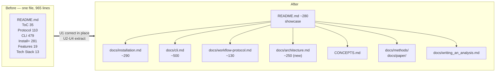
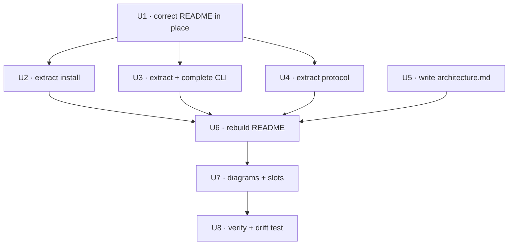

# README Showcase Overhaul - Plan

## Goal Capsule

**Objective.** Turn `README.md` from a 965-line operating manual into a ~280-line project showcase that survives a 30-second skim by someone deciding whether the author can build software — while moving the reference material it displaces into `docs/` intact and correcting every factual defect the audit found.

**Authority.** The Requirements below govern what the finished documentation must say and do. Key Technical Decisions govern structure and mechanism. `docs/audits/readme-documentation-audit-2026-08-13.md` is the authority on what is currently wrong and is cited rather than restated — do not re-derive its findings, and do not "fix" anything it lists under *Verified accurate*.

**Execution profile.** Correctness first, then structure. U1 corrects the README in place so the document is never wrong at any commit boundary; U2–U4 move the corrected reference material out; U5–U7 build the new material; U8 verifies. Build in that order — moving before correcting means auditing the same text twice in two files.

**Stop conditions.** Stop and raise if a correction in U1 contradicts the audit's evidence rather than confirming it — that means the code changed under the audit and the finding needs re-verification, not a guess. Stop and raise before deleting or relocating any `[project.scripts]` entry point (see OQ1): that is a packaging change, not a documentation change.

**Tail ownership.** Standalone run: this plan owns through local verification. Commit, push, and PR are the user's call.

---

## Product Contract

### Summary

`README.md` is misproportioned rather than neglected: 79% of it is CLI reference and per-OS install instructions, while the value proposition gets 32 lines below 600 lines of man pages, and the project's strongest credentials — a *Journal of Cell Biology* Tools paper with the author as co-first author, a quantified detector benchmark, and a deliberate ports-and-adapters architecture with machine-declared boundary contracts — appear nowhere.

This plan splits the document. The reference material moves to three new `docs/` pages, already corrected by U1. A new `docs/architecture.md` captures the engineering story that has never been written down outside `docs/solutions/`. `README.md` is then rebuilt as a showcase: what the software is, the scientific problem it solves, what it can do, how it is built, and evidence that it is built well — with diagrams that render on GitHub and defined slots for screenshots the author captures separately.

Every factual defect the audit found is corrected. Nothing is invented: claims that the code does not support are removed rather than softened.

### Problem Frame

The README is going on a CV. That changes its job.

A README serving lab users answers "how do I run this." A README serving a CV also has to answer, in the first screen, "what is this and is the person who built it good at this." The current document cannot do the second job — not because it is badly written, but because its shape is wrong for that reader. The Features section is 19 lines. The Tech Stack is 13. Both sit below line 638, after 479 lines of CLI documentation. A reader who opens the file sees a table of contents, a step-by-step protocol about clicking buttons, and then man pages.

Meanwhile the material that would do the second job exists in the repository and is unreachable from the README:

- `docs/reference/JCB_202311105.pdf` — the lab's JCB **Tools** article, author as co-first author (doi:10.1083/jcb.202311105).
- `docs/paper/adaptive-local-clipping-section.md` — a publication-grade problem statement and a quantified result: the adaptive detector recovered ~19% more true foci than a hand-drawn mask on a field with ~4,664 hand-labeled foci, with zero dilute-phase pickup.
- `docs/solutions/` — 65 institutional learnings, 22 of them architecture documents.
- `pyproject.toml:153-207` — four `[tool.importlinter]` contracts declaring the architecture's boundaries.

The README links four files out of ~271. `CONCEPTS.md` is not even mentioned.

There is a second, independent problem: the README is wrong in places. It documents a **Resume run...** button that does not exist, a `run_state.json` file that was never introduced, XLSX export that is not implemented, a Cellpose version floor that contradicts its own Updating section, and click/rich as the CLI stack when all 14 entry points use `argparse`. A reader who tests one claim and finds it false discounts the rest — which is the specific failure mode a CV-facing README cannot afford.

### Requirements

**R1.** `README.md` presents, above the fold, what PerCell4 is and what scientific problem it solves, in language a cell biologist and a software engineer can both follow.

**R2.** `README.md` states the project's scientific pedigree: the JCB Tools paper with correct author attribution, and the Wang et al. 2021 wavelet method the code implements.

**R3.** `README.md` carries a capabilities section that reflects what actually shipped — including the eleven subsystems the audit found absent (Batch Tools Console, registered-analysis framework, advanced device configuration, Segment-by-Metric, multi-timepoint FLIM, per-harmonic calibration, and the rest).

**R4.** `README.md` carries an architecture and engineering-practice section: the ports-and-adapters layering, the storage model, the test strategy, and CI — enough for a reader to judge engineering quality without opening a source file.

**R5.** Every factual defect in the audit's BROKEN, STALE, and OVERSTATED classes, plus the MISSING-class corrections M5, M6, and M6b, is corrected or removed. No claim survives that the code does not support.

**R6.** The reference material displaced from `README.md` — installation, CLI, workflow protocol — remains complete and reachable in `docs/`, and carries U1's corrections.

**R7.** The two undocumented CLI flags (`--device`, `--cnr-forced`) are documented, and the two undocumented console scripts are either documented as development harnesses or removed from `[project.scripts]` (see OQ1).

**R8.** `README.md` links the documentation that exists: `CONCEPTS.md`, `docs/methods/`, `docs/paper/`, `docs/writing_an_analysis.md`, `docs/solutions/`, `docs/plans/`, `tests_gui/README.md`, and the three new reference pages.

**R9.** The rebuilt `README.md` renders correctly on GitHub: every anchor resolves, every relative link resolves, and every diagram renders natively without external tooling.

**R10.** Diagrams that can be generated without running the application are produced now; visuals that require running the application are represented by defined slots plus a capture list the author can work from.

**R11.** No claim of enforcement, coverage, or measurement is made that the repository does not currently deliver — specifically: no coverage badge, no claim that the import-linter contracts are enforced in CI, and no unattributed performance numbers.

### Scope Boundaries

**In scope.** `README.md`; three new reference pages under `docs/`; one new architecture page; diagrams; screenshot slots and capture list; `CITATION.cff` placeholder resolution; a documentation-drift regression test.

**Deferred to follow-up work.**
- Deleting the five empty vestigial packages (`src/percell4/{flim,measure,segment,plugins,cli}/`). Real cleanup, but a source change, not a documentation change.
- Removing `click` and `rich` from `pyproject.toml` as dead runtime dependencies. U1 stops documenting them; unshipping them is a packaging change.
- Wiring `lint-imports` into CI and resolving the 9 `application/` h5py imports that appear to violate the declared contract.
- Configuring and reporting test coverage.
- Reconciling the `gui-tests` merge-blocking contradiction between `tests_gui/README.md` and `.github/workflows/ci.yml`.
- Correcting the false `dev-features` branch claim at `CHANGELOG.md:74`.
- A documentation site (mkdocs / Read the Docs). The `docs/` tree is large enough to justify one; out of scope here.
- `CONTRIBUTING.md`, `SECURITY.md`, issue and PR templates.

**Outside this work's identity.** Any change to application behavior. Any change to the CLI surface itself beyond documenting it. Rewriting `CHANGELOG.md`.

---

## High-Level Technical Design

### Document topology: before and after



### Target README section skeleton

Directional — the implementer may adjust proportions, but the ordering constraint is load-bearing: identity and evidence precede instructions.

```
1   Logo + title
2   Badges                          CI · Python · platform · license · DOI
3   One-sentence positioning
4   HERO IMAGE SLOT                 app in use — see U7 shot list
5   Why this exists                 ~12 lines · the two-phase measurement
                                    problem, from docs/paper/
6   Result                          ~15 lines · the ALC benchmark, with the
                                    before/after comparison figure
7   What it does                    ~35 lines · 8-10 capability bullets,
                                    one line each, covering the audit's
                                    missing-capability list
8   FIGURE: pipeline diagram        mermaid · acquisition → HDF5 → segment →
                                    threshold → measure → export
9   Quickstart                      ~20 lines · install, launch, first run
                                    → then link to docs/installation.md
10  How it's built                  ~45 lines · ports-and-adapters, the
                                    HDF5 model, headless testability
    FIGURE: architecture diagram    mermaid · layer dependency direction
11  Engineering practice            ~20 lines · honest numbers table,
                                    test strategy, CI
12  Documentation map               ~20 lines · every doc worth reading
13  Scientific background           ~15 lines · JCB paper, Wang et al.
14  Citing · License                ~10 lines
```

**The ordering constraint.** Sections 5–8 answer "what is this and does it work" before section 9 says "here is how to install it." The current README inverts this. A reader evaluating the author never reaches an install section; a reader who wants to install it will scroll.

### Correction-before-extraction sequencing



U5 has no dependency on U1–U4: it is new prose about the codebase, not moved text, so it can run in parallel with the extractions.

---

## Planning Contract

### Key Technical Decisions

**KTD1. Split the document; do not compress it.**
The reference material is accurate and useful — the audit found the CLI documentation essentially complete, with only two missing flags across 14 commands. The problem is that it occupies the README, not that it exists. Moving it to `docs/` preserves its value while freeing the README to do a different job. Rejected: deleting the reference material (destroys real work), and a `<details>`-collapsed two-tier README (a 66 KB file still loads as 66 KB, still reads as a manual in raw view, and GitHub's rendered view is not where a technical reader always lands).

**KTD2. Correct in place before moving.**
U1 fixes the defects in `README.md` where the text currently lives, before U2–U4 relocate it. The alternative — move first, correct in the new home — means every correction is applied to text that just changed location, so a reviewer diffing the move cannot tell a relocation from an edit. Correcting first makes U2–U4 pure moves, reviewable as such.

**KTD3. Remove unsupported claims rather than softening them.**
XLSX export, in-`.h5` measurement staging, `run_state.json`, and pause/resume are deleted, not hedged. A README that says "supports CSV, XLSX (planned)" on a CV-facing project is worse than one that says "CSV" — it invites the reader to check, and the check fails. R11 extends the same rule to enforcement and coverage claims.

**KTD4. Mermaid for diagrams; no image pipeline.**
GitHub renders mermaid natively in markdown. Every diagram this plan calls for — pipeline, architecture layering, HDF5 layout — is a relationship diagram that mermaid handles. This means the diagrams are implementable now, diffable in review, and cannot go stale as binary artifacts. Screenshots, which mermaid cannot produce, are handled by KTD5.

**KTD5. Screenshot slots are committed empty, with a capture list.**
The implementer cannot run the GUI and capture the application in use. Rather than ship without visuals or block on the author, U7 commits `docs/screenshots/` with a `README.md` capture list naming each shot, its purpose, and the dataset state to show — and the README references the slots with a visible placeholder. The author fills them in one sitting. Rejected: blocking the whole rewrite on screenshots (the text improvements are independently valuable), and shipping with no visual (a desktop imaging application with no image of itself is a real weakness).

**KTD6. Numbers in the README are honest and sourced.**
The engineering-practice section uses figures the audit verified: 254 modules / ~80.5k LOC in `src/`, 296 test files / 4,077 test functions in `tests/` plus 16 / 98 in `tests_gui/`, 14 console entry points, three CI jobs. It does **not** claim a coverage percentage (none is measured), does not claim the import-linter contracts are enforced (they are not run), and attributes the performance figures (~5.3× parallel decode, ~3× Blosc decode) as measured during development, since no benchmark script exists in the repository.

**KTD7. The audit ships as a durable artifact.**
`docs/audits/readme-documentation-audit-2026-08-13.md` already exists and is the single source of truth for what was wrong. Implementation units cite it rather than restating findings. It outlives this rewrite: the next drift check starts from it.

### Assumptions

- The author's name and the JCB paper's exact title are needed to resolve `CITATION.cff` (U1). The plan assumes the citation in the audit document (Fahim, Marcus, et al., *J. Cell Biol.* 224(1): e202311105, 2025) is the **prior** paper to cite as background, and that the `preferred-citation` TODO refers to a **future** tools paper that does not yet exist. If that future paper is still unwritten, the correct action is to remove `preferred-citation` and let `CITATION.cff` cite the software itself.
- The repository stays public and GitHub-hosted, so mermaid rendering and relative links behave as planned.
- `docs/` page names (`installation.md`, `cli.md`, `workflow-protocol.md`, `architecture.md`) do not collide with a future docs-site generator's conventions. No generator is configured today.

### Open Questions

**OQ1 (blocking for U3 only, deferred for the rest).** `percell4-batch-validate-puncta` and `percell4-window-bakeoff` are development harnesses that install on every user's `PATH`. Document them under a "Development harnesses" heading in `docs/cli.md`, or remove them from `[project.scripts]`? **Recommended: document them.** They are real tools, the validation harness is how the ALC benchmark was produced, and describing them is itself a credibility signal. Removing entry points is a packaging change with its own risk. U3 proceeds on the recommendation unless the author says otherwise.

**OQ2 (deferred).** Should `README.md` state that the project is solo-authored? It is (1,077 commits, one author, 138 days). Stating it makes the scale legible; not stating it avoids reading as a boast. No implementation unit depends on the answer — U6 can add or omit one clause.

**OQ3 (deferred).** The five empty packages include `plugins/`, which actively misleads: a reader who opens it expecting the extension mechanism finds a 0-byte file, while the real framework lives in `application/analysis/`. Deleting them is deferred, but U5 must not describe `plugins/` as anything.

---

## Implementation Units

### U1. Correct every factual defect in README.md, in place

**Goal.** After this unit, no statement in `README.md` is false — before a single line moves.

**Requirements.** R5, and the correctness half of R7.

**Dependencies.** None.

**Files.**
- `README.md` (modify)
- `CITATION.cff` (modify)
- `docs/audits/readme-documentation-audit-2026-08-13.md` (read — the finding list)

**Approach.**
1. Apply every BROKEN finding: B1 (`run_state.json` → `run_config.json`, drop crash/pause framing), B2 (delete the "Pausing and resuming" paragraph at L153), B3 (Cellpose pin → `>=4.2,<5.0`), B4 (real dilute-phase button labels), B5 (state the two Cellpose default exceptions).
2. Apply every STALE finding: S1 (remove the click/rich CLI line from Tech Stack), S2 (`--cnr-threshold` required *unless* `--cnr-forced`), S3 (add `ocr` to the extras pointer), S4–S6 (three GUI label corrections), S7 (the OCR tool emits `.xlsx`, not `.csv`).
3. Apply every OVERSTATED finding: O1 (drop "and measurement staging"), O2 (drop XLSX from the export list), O3 (rewrite the Sigma explanation — kernel standard deviation, in pixels).
4. Add the two missing flags to their existing option tables: `--device` on `percell4-batch-cellpose-laptrack`, `--cnr-forced` on `percell4-batch-threshold` (M1, M2).
5. Correct M5 (Tech Stack omits `hdf5plugin`, `matplotlib`, `diptest`, `laptrack`, and the PyQt5/qtpy pins), M6 (the Discovery combo's third mode, *Subdirectory*, is the default), and M6b (narrow the over-broad `--quiet` / `--verbose` conventions claim).
6. Resolve `CITATION.cff`: fill the author list with the real names, and either fill the `preferred-citation` title or remove the block per the Assumptions note. Do not leave a `TODO:` string in a file intended for sharing.
7. Delete or gitignore the untracked root `install.sh` — it is the Claude Code installer, not a PerCell4 installer. Do not document it.

**Patterns to follow.** The audit's per-finding "Fix" lines carry the corrected wording; use them rather than re-deriving. Where a fix requires naming a real UI label, the audit cites the exact source line — quote the label verbatim, including `&&` rendering as `&`.

**Execution note.** Verify each correction against the cited source before applying it. If a citation no longer matches the code, that is a stop condition, not a judgment call.

**Test scenarios.** Test expectation: none — content-only corrections to a markdown file. Automated protection against re-drift is U8's job.

**Verification.** Every audit finding in BROKEN / STALE / OVERSTATED / M1 / M2 / M5 / M6 / M6b is either applied or has a written reason it was not. `grep -ri 'run_state\|Resume run' README.md` returns nothing. The only surviving `xlsx` mention is the `tools/png_to_csv/` calibration-sheet description that S7 requires — never an export-format claim (O2). `grep -n 'TODO' CITATION.cff` returns nothing.

---

### U2. Extract installation and troubleshooting to `docs/installation.md`

**Goal.** The per-OS install material leaves the README intact and complete.

**Requirements.** R6.

**Dependencies.** U1.

**Files.**
- `docs/installation.md` (create)
- `README.md` (modify — remove the extracted sections)

**Approach.**
1. Move, verbatim from the U1-corrected text: *Installation* (macOS / Linux / Windows), *Updating*, *Install from a wheel*, *Optional extras*, *Standalone bundle (PyInstaller)*, *Troubleshooting*.
2. Give the new page its own title, intro sentence, and table of contents. Rewrite the internal anchors that pointed at README headings so they resolve within the new page.
3. Keep the two duplicate-heading anchors (`#windows`, `#linux` appear under both Installation and Troubleshooting) unambiguous in the new page — GitHub disambiguates with a `-1` suffix; verify rather than assume.
4. Leave a short Quickstart behind in the README (U6 finalizes its wording) that links here.

**Patterns to follow.** `tools/png_to_csv/README.md` for the shape of a focused single-topic page in this repo.

**Test scenarios.** Test expectation: none — a content move. Link and anchor resolution is verified in U8.

**Verification.** Every install instruction that was in `README.md` is in `docs/installation.md`; the diff shows removal from one file and addition to the other with no wording change beyond the anchor rewrites.

---

### U3. Extract and complete the CLI reference in `docs/cli.md`

**Goal.** A single, complete command reference — the largest block of existing work in the README, preserved and finished.

**Requirements.** R6, R7.

**Dependencies.** U1.

**Files.**
- `docs/cli.md` (create)
- `README.md` (modify — remove the extracted section)
- `pyproject.toml` (read — the entry point list)

**Approach.**
1. Move the whole *Command-line Tools* section, with U1's corrections already applied.
2. Add the shared-conventions block back at the top, narrowed per M6b — state per-command which of `--quiet` / `--verbose` / `-v` actually exist rather than claiming a universal convention.
3. Add a **Development harnesses** section documenting `percell4-batch-validate-puncta` and `percell4-window-bakeoff` (OQ1 recommendation): what each does, that they are development tools rather than analysis commands, and why they exist. The validation harness produced the detector benchmark the README cites — say so.
4. Add a command index table at the top: command, one-line purpose, link. Fourteen commands need a map.
5. Note the two non-entry-point CLI modules that a reader browsing `interfaces/cli/` will find: `run_pipeline.py` (importable headless pipeline, deliberately not wired to a script) and `catalog.py` (entry-point enumeration for the Batch Tools Console).

**Patterns to follow.** The existing per-command shape — heading, one-line summary, option table, worked examples — is good and should be preserved exactly. The two new command sections match it.

**Test scenarios.** Test expectation: none for the move. The flag-accuracy invariant this page depends on is tested in U8.

**Verification.** All 14 entry points in `pyproject.toml` have a section in `docs/cli.md`. Every option table matches its module's `argparse` definitions.

---

### U4. Extract the workflow protocol to `docs/workflow-protocol.md`

**Goal.** The step-by-step user protocol keeps a home, with the UI labels it names actually matching the UI.

**Requirements.** R6.

**Dependencies.** U1.

**Files.**
- `docs/workflow-protocol.md` (create)
- `README.md` (modify — remove the extracted section)

**Approach.**
1. Move the *Workflow Protocol* section with U1's label corrections (S4–S6, B4, M6) applied.
2. This page is the natural home for the workflow screenshots. Add the slots U7 defines — a protocol document is far more useful with pictures of the dialogs it describes than the README is.
3. Add a short orientation paragraph naming the five workflows available from the Workflows tab, since the reader no longer arrives here via the README's surrounding context.

**Patterns to follow.** `docs/methods/how-puncta-detection-processes-the-image.md` — it is explicitly written for a non-technical audience and is the right register for a user protocol.

**Test scenarios.** Test expectation: none — a content move with the corrections from U1 already applied.

**Verification.** Every UI label named in the page matches a real widget label in `src/percell4/gui/` or `src/percell4/interfaces/gui/`.

---

### U5. Write `docs/architecture.md`

**Goal.** Write down, for the first time outside `docs/solutions/`, how this system is built and why — the material R4 summarizes in the README and this page carries in full.

**Requirements.** R4, R8, R11.

**Dependencies.** None (new prose, parallel with U2–U4).

**Files.**
- `docs/architecture.md` (create)
- `docs/audits/readme-documentation-audit-2026-08-13.md` (read — the capability inventory section)

**Approach.**
1. **Layering.** `ports/` (Protocol definitions only), `domain/` (66 modules, zero Qt/napari/h5py imports — empirically verified), `application/` (use cases + the `Session` state hub), `adapters/` (concrete implementations), `interfaces/` (CLI and GUI delivery). Include the mermaid dependency-direction diagram from U7. State the four `[tool.importlinter]` contracts as **declared** — per R11, do not claim they are enforced, and note the gap honestly.
2. **State.** `Session` as the Qt-free hub with a 12-event observer protocol; `CellDataModel` as the Qt signal bridge above it, documented as transitional. Explain the global-by-label selection invariant and why a `(label, timepoint)` key was rejected.
3. **Storage.** The one-HDF5-per-dataset model with the group layout, the T-vs-C disambiguation rule (metadata, never shape), the per-path view-bin rules, the compression choice and its measured rationale, and the consistency-guard exception hierarchy.
4. **Extension.** The registered-analysis framework: the decorator, the declarative schema, import-time validation, generic loading, auto-generated GUI. Be explicit about its boundary — discovery is by in-package import, not entry points, so a third party cannot add an analysis without editing `application/analysis/modules/`. Call it an internal extension framework, which is what it is. Per OQ3, do not mention `plugins/`.
5. **Testability.** The `ViewerPort` / `NullViewerAdapter` seam; the `tests/` vs `tests_gui/` split by directory rather than marker and the CI-drift incident that motivated it; the monkeypatched `napari.Viewer.__init__` guard that enforces the boundary dynamically because grep cannot.
6. **Engineering decisions.** A short annotated list drawn from the audit's inventory — atomic writes, parallel decode into shared memory, measurement-driven compression, metadata-only inspection, the generator-driven workflow state machine, fail-at-import schema validation, sidecar defence, schema unification across parquet fragments. Cite the source file for each. Attribute the performance figures per KTD6.
7. Link `CONCEPTS.md` as the vocabulary authority and `docs/solutions/` as the decision record.

**Technical design (directional).** Order the page by what a reader evaluating the codebase asks: shape first (layering), then the data model, then how it stays correct (testability), then the individual decisions. Do not order it by package.

**Test scenarios.** Test expectation: none — new documentation. Its factual claims derive from the audit's verified inventory.

**Verification.** Every structural claim cites a repo-relative path. No claim of enforcement or coverage that R11 forbids. A reader who has never opened the repository can describe the layering after one read.

---

### U6. Rebuild README.md as the showcase

**Goal.** The document a recruiter, collaborator, or hiring manager opens — and the payload of this whole plan.

**Requirements.** R1, R2, R3, R4, R8, R11.

**Dependencies.** U1, U2, U3, U4, U5.

**Files.**
- `README.md` (rewrite)

**Approach.**
1. Build to the section skeleton in the High-Level Technical Design. Hold the total near 280 lines; if a section wants to grow past its budget, that content belongs in the `docs/` page it summarizes.
2. **Why this exists** — draw from `docs/paper/adaptive-local-clipping-section.md`: condensate segmentation as a two-phase measurement problem disguised as a thresholding problem, and why a single intensity cutoff fails when expression varies ~3× within a field and up to ~40× across datasets. Compress to about twelve lines; keep the specificity, drop the apparatus.
3. **Result** — the benchmark from `docs/methods/`: 3,570 granules with a manual QC step versus 4,247 with none, same typical size, no dilute-phase pickup; and the whole-frame bake-off recovering ~19% more true foci than a manual mask. Attribute both to the method documents.
4. **What it does** — 8–10 bullets, one line each, covering the eleven capabilities the audit found missing. This is where the Batch Tools Console, the registered-analysis framework, multi-timepoint FLIM, and device configuration finally appear.
5. **Quickstart** — install, launch, one real command. Then link to `docs/installation.md`. Resist re-explaining per-OS setup.
6. **How it's built** — condense `docs/architecture.md` to about 45 lines plus the architecture diagram, and link through.
7. **Engineering practice** — the honest numbers table per KTD6, the test strategy in three sentences, the three CI jobs (Ruff lint, tests on Python 3.12, and the real-OpenGL GUI suite).
8. **Documentation map** — a table linking every doc worth reading, satisfying R8. This single table converts ~271 orphaned documents into a visible asset.
9. **Scientific background and citing** — the JCB Tools paper with full author list, the Wang et al. 2021 method the wavelet filter implements, and the `CITATION.cff` pointer as corrected in U1.
10. Keep the badge row; add a DOI badge for the JCB paper. Do not add a coverage badge (R11).

**Execution note.** Write the *Why this exists* and *Result* sections first and read them cold. If they do not survive a 30-second skim by someone who has never heard of a biomolecular condensate, the rest of the rewrite does not matter.

**Test scenarios.** Test expectation: none — content. Structural correctness is verified in U8.

**Verification.** The rendered README's first screen conveys what the software is and that it works. Total length within ~15% of 280 lines. Every capability bullet traces to the audit's inventory. Every `docs/` page created in U2–U5 is linked.

---

### U7. Add diagrams, screenshot slots, and the capture list

**Goal.** The visual layer — everything renderable produced now, everything requiring the running application specified for the author.

**Requirements.** R9, R10.

**Dependencies.** U6 (slots land in their final positions).

**Files.**
- `README.md` (modify — embed diagrams, add slots)
- `docs/architecture.md` (modify — embed the layering diagram)
- `docs/workflow-protocol.md` (modify — add dialog screenshot slots)
- `docs/screenshots/README.md` (create — the capture list)
- `docs/screenshots/.gitkeep` (create)

**Approach.**
1. **Pipeline diagram** (README §8): acquisition (`.tiff` / `.sdt` / `.lif`) → compress to HDF5 → Cellpose segmentation → grouped thresholding / puncta detection → per-cell measurement → parquet + CSV. Mermaid flowchart.
2. **Architecture diagram** (README §10 and `docs/architecture.md`): the layer boxes with dependency arrows pointing inward, and `ports/` shown as the boundary the arrows cross. Mermaid.
3. **HDF5 layout diagram** (`docs/architecture.md`): the group tree. A fenced tree block is clearer than mermaid here — use whichever reads better at width.
4. **Screenshot slots.** Place image references at: README hero (§4), README result (§6, the before/after mask comparison), and one per major protocol step in `docs/workflow-protocol.md`. Each slot renders a visible placeholder until filled, so an unfilled slot is obvious rather than a broken image.
5. **Capture list** — `docs/screenshots/README.md`, one entry per slot: target filename, which window, what dataset state to load, what must be visible, and the framing. The hero shot is the one that matters most: the napari viewer with a segmentation overlay plus a peer window, showing the multi-window design in a single frame.
6. Consider sourcing the result comparison from the existing `docs/archive/puncta_mask_gallery/` images (35 PNGs with a 207-line method-comparison README) rather than re-capturing — the manual-vs-adaptive comparison already exists there.

**Technical design (directional).** Keep every mermaid diagram under about a dozen nodes. A diagram that needs more nodes is documenting the wrong altitude for a README.

**Test scenarios.** Test expectation: none — presentational. Diagram rendering and image-path resolution are verified in U8.

**Verification.** Every mermaid block renders on GitHub. Every image reference resolves to a real path or a committed placeholder. The capture list is specific enough to shoot from without asking a follow-up question.

---

### U8. Verify links and add a documentation-drift regression test

**Goal.** Prove the rewrite is structurally correct, and stop the CLI reference from silently drifting again — the failure mode that produced most of the audit.

**Requirements.** R9, and durable protection for R5 and R7.

**Dependencies.** U1–U7.

**Files.**
- `tests/test_docs/__init__.py` (create)
- `tests/test_docs/test_cli_docs_match_argparse.py` (create)
- `tests/test_docs/test_doc_links_resolve.py` (create)
- `README.md`, `docs/*.md` (modify — fix whatever the checks surface)

**Approach.**
1. **Link and anchor check.** Walk `README.md` and the four new `docs/` pages; for every relative link assert the target path exists, and for every in-document anchor assert a heading slugifies to it. Report all failures at once rather than failing on the first.
2. **CLI flag drift check.** For each `[project.scripts]` entry point, import its module, build its `ArgumentParser`, and assert that every flag the parser defines appears in that command's `docs/cli.md` section, and that every flag documented in that section exists in the parser. This is the test that would have caught M1 and M2, and prevents the audit's largest finding class from recurring.
3. Keep both tests in `tests/`, not `tests_gui/` — they import CLI modules and read markdown, with no Qt or GL dependency.
4. Fix everything the checks surface, then re-run.

**Patterns to follow.** `tests/test_cli_*.py` for CLI-module import patterns. `tests/test_config/test_advanced_settings_isolation_compliance.py` is the precedent for a test that enforces a repository invariant rather than a behavior — the same shape applies here.

**Execution note.** Write the flag-drift test first and watch it fail against the pre-U1 README if any of that text is still reachable; a test that has never failed has not been shown to work.

**Test scenarios.**
- Every relative link in `README.md` resolves to an existing file — a link to a deleted path fails with that path named.
- Every in-document anchor in `README.md` and each new `docs/` page resolves to a heading in the same document; a stale anchor fails with the anchor and file named.
- For each of the 14 entry points, every `argparse` flag appears in that command's `docs/cli.md` section; adding a flag to a CLI module without documenting it fails, naming the command and flag.
- For each of the 14 entry points, every flag documented in `docs/cli.md` exists in the parser; documenting a flag that does not exist fails, naming the command and flag.
- The `--device` and `--cnr-forced` flags specifically pass — the two the audit found missing.
- Development harnesses (`percell4-batch-validate-puncta`, `percell4-window-bakeoff`) are covered by the same checks, not special-cased, so their documentation cannot rot.
- A command with no `docs/cli.md` section fails with a message naming the command, rather than silently passing.
- The link checker reports every failure in one run rather than aborting on the first.

**Verification.** `pytest tests/test_docs` passes. `ruff check` passes over the new test files. A deliberate temporary edit — adding a fake flag to one CLI module — turns the drift test red.

---

## Verification Contract

**Test suite.** `pytest` — the bare invocation, per this repository's convention that `addopts` in `pyproject.toml` is the single source of test selection, so a local green and a CI green mean the same thing. New tests live under `tests/test_docs/` and run in the default suite.

**Targeted run.** `pytest tests/test_docs -v` for the documentation checks alone.

**Lint.** `ruff check src tests tests_gui` — matches the CI lint job exactly.

**Rendering check.** Push to a branch and view `README.md` and each new `docs/` page on GitHub. Mermaid rendering, image slots, and anchor navigation cannot be verified locally with confidence.

**Manual review gate.** Read the rebuilt `README.md` top to bottom, cold. It passes when the first screen answers what the software is and whether it works, without scrolling.

**No regression.** No source file under `src/` changes in this plan. `git diff --stat src/` is empty at completion.

---

## Definition of Done

- [ ] Every audit finding in BROKEN, STALE, OVERSTATED, M1, M2, M5, M6, M6b is applied, or has a written reason it was not (R5, R7).
- [ ] `CITATION.cff` contains no `TODO:` placeholder and names the real author list.
- [ ] The stray root `install.sh` is deleted or gitignored, and is not documented anywhere.
- [ ] `docs/installation.md`, `docs/cli.md`, `docs/workflow-protocol.md`, and `docs/architecture.md` exist, are complete, and are linked from `README.md` (R6, R8).
- [ ] All 14 `[project.scripts]` entry points are documented in `docs/cli.md` (R7).
- [ ] `README.md` is within ~15% of 280 lines and follows the section skeleton, identity before instructions (R1).
- [ ] `README.md` states the scientific problem, the benchmark result, and the JCB Tools paper with correct attribution (R1, R2).
- [ ] The capabilities section covers the eleven subsystems the audit found absent (R3).
- [ ] `README.md` carries an architecture summary and an engineering-practice section with honest, sourced numbers (R4, R11).
- [ ] No coverage badge, no claim that import-linter contracts are enforced, no unattributed performance figure (R11).
- [ ] Pipeline and architecture diagrams render on GitHub; the HDF5 layout is shown in `docs/architecture.md` (R9, R10).
- [ ] `docs/screenshots/README.md` gives a capture list specific enough to shoot from; every slot renders a visible placeholder until filled (R10).
- [ ] `pytest tests/test_docs` passes; the drift test demonstrably fails when a flag is added without documentation.
- [ ] `pytest` passes. `ruff check src tests tests_gui` passes.
- [ ] `git diff --stat src/` is empty.

---

## Sources & Research

- `docs/audits/readme-documentation-audit-2026-08-13.md` — the accuracy audit and capability inventory this plan acts on. Authority for every finding cited by U-ID above.
- `docs/paper/adaptive-local-clipping-section.md` — publication-grade problem statement and the whole-frame bake-off result. Source for README §5 and §6.
- `docs/methods/how-puncta-detection-processes-the-image.md` — the same result tabulated for a non-technical reader (3,570 → 4,247 granules). Source for README §6 and the register of `docs/workflow-protocol.md`.
- `docs/methods/headless-puncta-thresholding.md` — why per-group Otsu is the wrong detector for small puncta, and the labor cost the automation removed.
- `docs/reference/JCB_202311105.pdf` — Fahim, Marcus, et al., *J. Cell Biol.* 224(1): e202311105 (2025). The project's scientific pedigree.
- `docs/reference/boe-12-6-3463.pdf` — Wang et al., *Biomed. Opt. Express* 12(6): 3463 (2021). The wavelet method implemented in `src/percell4/domain/flim/wavelet_filter.py`.
- `docs/writing_an_analysis.md` — the registered-analysis author guide; evidence for U5's extension section and a link target for R8.
- `pyproject.toml:153-207` — the four declared import-linter contracts. Cited as declared, not enforced (R11).
- `tests/conftest.py`, `tests_gui/README.md` — the headless Qt strategy and the tests/tests_gui split; source for U5's testability section.
- `CONCEPTS.md` — canonical domain vocabulary. Use its terms (Dataset, Channel, Label Set, Segmentation, Mask, Phasor ROI, Layer) throughout the rewrite rather than synonyms.
