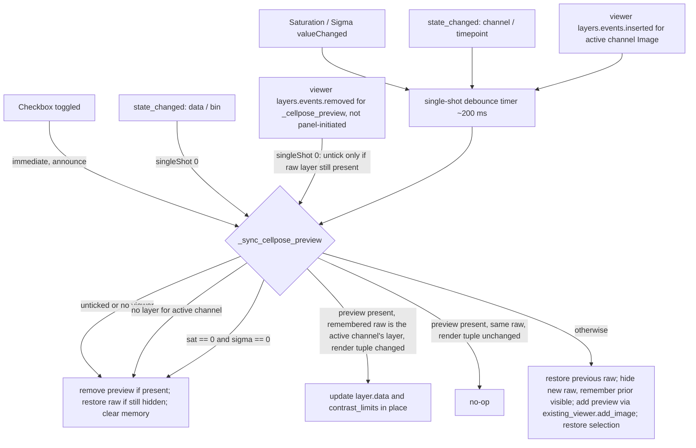

# Cellpose Preprocessing Preview - Plan

## Goal Capsule

**Objective.** Let a user of the Segment tab see the active channel exactly as Run Cellpose will see it — after the Saturation LUT and the Gaussian blur — as a live, display-only napari layer, before committing to a segmentation run.

**Authority.** The Requirements below govern behavior. Key Technical Decisions govern mechanism within those requirements. `src/percell4/domain/segmentation/preprocess.py` is the authority on what the two preprocessing steps compute; this plan reuses it and never re-implements it.

**Execution profile.** Pattern extension. The feature is a sibling of the existing diameter reference circle in `src/percell4/gui/segmentation_panel.py` and follows that code and its tests closely. Build U1 → U2 → U3, with U4 independent of U3; U5 depends on U3.

**Stop conditions.** Stop and raise if implementing the preview requires touching `phases.segment_one`, the batch CLI, or the workflow config dialog — those are out of scope. Stop if a real `napari.Viewer` turns out to be needed to test a required behavior under `tests/` (the conftest guard forbids it); that behavior moves to `tests_gui/` only with the user's agreement.

**Tail ownership.** Standalone run: this plan owns through local verification on the `development` branch. Commit, push, and PR are the user's call.

---

## Product Contract

### Summary

Add a **Preview saturation + blur** checkbox to the Cellpose group of the Segment tab. While ticked, a temporary `_cellpose_preview` Image layer shows the active channel after the saturation LUT and Gaussian blur that Run Cellpose applies, and the raw channel layer is hidden so the canvas reads as "what Cellpose gets". The preview re-renders, debounced, as the Saturation and Blur (sigma) spinboxes change, follows the active channel and the time slider, survives dataset and view-bin rebuilds, and is removed with the raw layer's visibility restored on untick. Nothing is saved; segmentation output and the on-disk `/intensity` are unaffected.

### Problem Frame

The Segment tab exposes Saturation and Blur (sigma) as numbers with tooltips, but the user has no way to see their effect. Choosing a sigma today means running Cellpose (minutes on a time-lapse), inspecting the result, and guessing whether under-segmentation came from the blur or from the flow threshold. The preprocessing functions are cheap and pure; only the viewer feedback is missing.

### Requirements

**Control and layer**

- R1. The Cellpose group has a **Preview saturation + blur** checkbox, off by default, placed with the other display-only control (the diameter reference circle).
- R2. While ticked and a viewer with the active channel's Image layer exists, a single Image layer named `_cellpose_preview` shows the active channel after the same saturation LUT and Gaussian blur, in the same order and with the same zero-skip rules, that `_on_run_cellpose` applies.
- R3. The preview layer copies the raw layer's colormap, blending, opacity, and gamma; its contrast limits come from the preview data, never from the raw layer.
- R4. The preview layer is display-only: it is never persisted, never appears in any channel, segmentation, or mask list, and never becomes the viewer's selected layer as a side effect of being added or updated.

**Raw layer visibility**

- R5. While the preview is shown, the active channel's raw Image layer is hidden; the layer's prior visibility is remembered.
- R6. On untick, on channel switch, and whenever the preview is removed, the raw layer's remembered visibility is restored only if the layer is still hidden; a layer the user re-showed by hand is left as the user set it.
- R7. Remembered visibility is bound to the raw layer object, never to its name, so a same-named layer in a later dataset is never hidden or shown by stale memory.

**Live behavior**

- R8. Editing Saturation or Blur (sigma) while ticked re-renders the preview after a short debounce; edits while unticked do nothing.
- R9. Re-render updates the existing preview layer's data and contrast limits in place; the layer is not removed and re-added.
- R10. The preview follows the session's active channel: on a channel switch the previous raw layer is restored and the new channel is previewed.
- R11. For a time-lapse (T, H, W) channel the preview processes only the displayed timepoint and re-renders when the active timepoint changes; the processed frame is the frame Run Cellpose would process at that index.
- R12. When Saturation and Blur (sigma) are both 0 the preview is identity: no preview layer is added and the raw layer is not hidden, with a status message saying why; the checkbox stays ticked and engages as soon as a value becomes non-zero.

**Lifecycle**

- R13. On dataset load, dataset clear, or view-bin change the panel re-syncs: a preview from the previous viewer contents is never carried over, and if the box is still ticked and a channel layer exists the preview is rebuilt for the new contents.
- R14. A `data` state change that left the viewer's layers intact (a measurements update) does not trigger a recompute.
- R15. If the user removes `_cellpose_preview` from the layer list by hand, the panel unticks the checkbox and restores the raw layer.
- R16. With no viewer open or no layer for the active channel, ticking shows a status message and leaves the box ticked; no error is raised.
- R17. Run Cellpose behaves exactly as before with the preview on or off: it reads the raw layer's data, applies its own preprocessing, and the preview is left in place.

**Cross-panel hygiene**

- R18. The Data panel's channel-management combos skip underscore-prefixed Image layers, so `_cellpose_preview` can never be renamed or deleted as a channel.

### Acceptance Examples

- AE1. **Covers R2, R5, R8, R9.**
  - **Given** a 2D dataset open in the viewer with active channel `DAPI`, Saturation 1.0 %, Blur 0.0,
  - **When** the user ticks Preview saturation + blur and then sets Blur to 2.0,
  - **Then** a `_cellpose_preview` layer exists whose data equals `apply_saturation_lut(DAPI, 1.0)` at tick time and, after the debounce, equals `apply_gaussian_blur(apply_saturation_lut(DAPI, 1.0), 2.0)`; the same layer object was updated; `DAPI.visible` is False.
- AE2. **Covers R6, R10.**
  - **Given** the preview is on for `DAPI` with `DAPI` hidden and `GFP` visible,
  - **When** the session's active channel becomes `GFP`,
  - **Then** `DAPI.visible` is True again, `GFP.visible` is False, and the preview data is computed from `GFP`.
- AE3. **Covers R11.**
  - **Given** a (T, H, W) channel and the preview on at timepoint 0,
  - **When** the active timepoint becomes 3,
  - **Then** the preview data equals the preprocessed frame 3 and has shape (H, W).
- AE4. **Covers R7, R13.**
  - **Given** the preview is on for `DAPI` in dataset A,
  - **When** dataset B, which also has a channel `DAPI` whose layer is visible, is loaded and the viewer repopulated,
  - **Then** the panel hides B's `DAPI` only by engaging the preview afresh; no restore from A's memory is applied to B's layer.
- AE5. **Covers R12.**
  - **Given** Saturation 0 and Blur 0,
  - **When** the user ticks the box,
  - **Then** no `_cellpose_preview` layer exists, the raw layer stays visible, a status message explains the settings are identity, and setting Blur to 1.0 then adds the preview.
- AE6. **Covers R15.**
  - **Given** the preview is on,
  - **When** the user deletes `_cellpose_preview` from napari's layer list,
  - **Then** the checkbox is unticked and the raw layer is visible.
- AE7. **Covers R18.**
  - **Given** the preview is on,
  - **When** the Data panel's rename/delete channel combos refresh,
  - **Then** `_cellpose_preview` is not listed.

### Scope Boundaries

- The workflow config dialog (`src/percell4/gui/workflows/single_cell/config_dialog.py`) gets no preview; it has no viewer open.
- The batch CLI and `phases.segment_one` are untouched.
- No new Cellpose setting is introduced and nothing about the preview is persisted to the session, the store, or the config.
- Preprocessing runs on the UI thread, bounded by the single-frame rule (R11).

**Deferred to Follow-Up Work**

- Sharing the extracted preprocessing helper (KTD2) with `phases.segment_one` so the GUI and batch paths call one function.
- Appearing immediately when the viewer is opened *after* the box was ticked with no dataset change in between. Today the preview appears at the next trigger (spinbox edit, channel, timepoint, dataset, or bin change), matching the diameter circle's behavior.
- Moving the blur onto a worker thread if very large frames make the debounce feel sluggish.

### Sources

- `src/percell4/gui/segmentation_panel.py` — `_on_diameter_circle_toggled`, `_on_diameter_value_changed`, `_sync_diameter_circle`, `_remove_diameter_circle`, `_active_layer`, `_restore_active_layer`, `_get_image_shape`, `_current_timepoint`, `_on_state_changed`, `_autosave_timer`, `_on_run_cellpose`.
- `src/percell4/gui/_cellpose_settings_form.py` — `diameter_changed` wiring.
- `src/percell4/domain/segmentation/preprocess.py` — `apply_saturation_lut`, `apply_gaussian_blur` (both preserve dtype; both return the input unchanged at 0).
- `src/percell4/model.py` — `StateChange` fields `data`, `channel`, `bin`, `timepoint`; `data=True` also fires on measurements updates.
- `src/percell4/gui/viewer.py` — `ViewerWindow.existing_viewer` vs `viewer`; `add_image` bumps `_color_index`; `_on_dims_current_step` forwards the slider to `session.set_active_timepoint`; `_hide_mask_layers` / `_restore_mask_layers` visibility memory.
- `src/percell4/interfaces/gui/main_window.py` — `_rebuild_viewer_for_bin_change` clears and re-adds layers with no `data` change.
- `src/percell4/interfaces/gui/task_panels/data_panel.py` — `refresh_management_combos` lists every Image layer not in metadata.
- `src/percell4/config/viewer_presets.py` — `DIAMETER_CIRCLE_*` constants block.
- `src/percell4/gui/threshold_qc.py` — `{name: visible}` record-before-hide precedent.
- `tests/test_gui/test_segmentation_panel_diameter_circle.py`, `tests/test_gui/test_cellpose_settings_form.py`, `tests/test_gui/test_segmentation_panel_cellpose_settings.py` — test templates (fake viewer with a real `layers` list, `_build_panel`, fake `Worker`).
- `docs/solutions/architecture-patterns/napari-modal-tool-overlay-pattern-2026-04-29.md`, `docs/solutions/ui-bugs/phasor-roi-preview-layer-ownership-2026-05-03.md`, `docs/solutions/ui-bugs/napari-mask-layer-misclassified-as-segmentation.md`, `docs/solutions/conventions/qt-wire-user-edit-signals-2026-05-12.md`, `docs/solutions/conventions/headless-test-suite-tiers.md`, `docs/solutions/architecture-patterns/session-to-napari-one-way-push.md`, `docs/solutions/logic-errors/gmm-roi-spinbox-anchor-feedback-loop-2026-05-03.md`.
- `docs/audits/gui-element-classification.yaml` — Action entry format (2026-07-23 diameter-circle entry is the template).
- `docs/plans/2026-07-23-001-feat-cellpose-diameter-reference-circle-plan.md` — prior plan for the sibling feature.

---

## Planning Contract

### Key Technical Decisions

- KTD1. **Surface: Segment tab only.** (session-settled: user-directed — chosen over also adding a preview to the workflow config dialog: that dialog has no viewer, so it would need its own image picker and render widget.) Governs R1.
- KTD2. **One pure preprocessing helper shared by the run path and the preview.** Extract the inner `_preprocess(plane)` closure in `_on_run_cellpose` into a module-level function in `src/percell4/domain/segmentation/preprocess.py` (working name `preprocess_cellpose_input(plane, saturation_pct, blur_sigma)`) that applies the LUT then the blur with the zero-skip rules, and call it from both places. Rationale: R2 demands byte-equality between what the user sees and what Cellpose gets; one function makes that structural rather than a test-enforced coincidence. Governs R2, R11, R17.
- KTD3. **Live toggle with a debounced, idempotent convergence function.** (session-settled: user-directed — chosen over an on-demand "Preview" button and over a separate side-by-side dialog: the diameter circle already establishes the live-checkbox pattern in this group.) A single `_sync_cellpose_preview(*, announce=False)` is the only code that adds, updates, or removes the layer and touches raw visibility. Every trigger — checkbox toggle, spinbox edit, `state_changed` (`channel`, `timepoint`, `data`, `bin`), and the layer-removed event — routes through one single-shot `QTimer(self)` (≈200 ms, mirroring `_PAINT_AUTOSAVE_DEBOUNCE_MS`) into that function, except the explicit toggle, which syncs immediately. The timeout slot reads settings and timepoint fresh and early-returns if the box is unticked or the viewer is gone; untick stops the timer before removing the layer. The sync keeps the (channel, timepoint, saturation_pct, blur_sigma) tuple of its last render and recomputes in place only when the current tuple differs; a `data` change that leaves layers and tuple intact is a no-op (R14). Governs R8, R9, R11, R13, R14, R16.
- KTD4. **Hide the raw layer, remember by object.** (session-settled: user-directed — chosen over stacking the preview above a still-visible raw layer: hiding gives a faithful "what Cellpose sees" read.) Memory is a `weakref` to the raw layer plus its prior `visible` value. Restore happens only when the referenced layer is still in `viewer.layers` and still hidden. Dataset and bin rebuilds replace the layer objects, so the identity check in KTD8 fails and memory is discarded on the next sync; the weakref only guards against holding a dead layer (napari layers stay alive under a weakref after removal, so liveness alone is not a signal). Governs R5, R6, R7.
- KTD5. **Add the layer through `existing_viewer.add_image`, not `ViewerWindow.add_image`.** `ViewerWindow.add_image` advances the shared channel `_color_index` and the `viewer` property constructs a napari window on access. Copy `colormap`, `blending`, `opacity`, `gamma` from the raw layer; compute contrast limits from the preview data, guarding equal min/max as `ViewerWindow.add_image` does. Capture and restore `layers.selection.active` around the add, as `_sync_diameter_circle` does. Governs R3, R4.
- KTD6. **Follow the time slider through `state_changed.timepoint`, not `dims.events`.** `ViewerWindow` already forwards `dims.events.current_step` to `session.set_active_timepoint`; subscribing there covers programmatic timepoint changes too and keeps the panel off napari's event bus. The sync reads the frame index from `session.active_timepoint`, clamped to `raw.shape[0] - 1`, never from `viewer.dims`. Governs R11.
- KTD7. **Frame-only preview layer for time-lapse.** (session-settled: user-directed — chosen over preprocessing the whole stack up front: keeps live edits snappy.) The preview is a 2D (H, W) layer; napari aligns it on trailing axes under the (T, H, W) raw layer. Governs R11.
- KTD8. **Re-validate rather than trust panel state.** Because bin rebuilds, viewer reopen, and workflow cleanup clear layers without a `data` change, every sync first checks whether `_cellpose_preview` is present **and** the remembered raw layer is the same object as the active channel's current Image layer in `viewer.layers`. Only that case takes the in-place update path (subject to the KTD3 signature check); any other combination — first engage, channel switch, replaced layer — takes the restore/hide/rebuild path (R10, R13).
  - **Layer events are per viewer instance**, tracked the way `_wired_viewer_id` tracks the autosave subscription, and cover both `layers.events.removed` and `layers.events.inserted`.
  - **Removed:** napari fires this for the panel's own removals and for `layers.clear()` during rebuilds, not only for a user delete. Panel-initiated removals set a `_removing_preview` flag the handler ignores. An external removal of `_cellpose_preview` defers one tick (`QTimer.singleShot(0, ...)`) and unticks the box (signals blocked) only if the remembered raw layer is still in `viewer.layers` — a user deleted just the preview (R15). If the raw layer is gone too, it is a rebuild: the box stays ticked and the normal sync rebuilds (R13).
  - **Inserted:** the native-bin load path drains the event loop before its first `add_image`, so the `singleShot(0)` sync on `data` can run against an empty viewer. When the box is ticked and an Image layer named for `session.active_channel` is inserted, restart the debounce so the preview engages once the layer exists (R13, AE4).
- KTD9. **Filter underscore-prefixed Image layers in the Data panel combos.** The Labels paths already skip `_` names; the Image path in `refresh_management_combos` does not. One-line fix with its own test rather than renaming the preview to dodge the combo. Governs R18.

### High-Level Technical Design

Trigger and state flow for the convergence function. Prose above is authoritative where they disagree.

### Assumptions

- Preprocessing a single frame on the UI thread is fast enough at the image sizes this project handles; the debounce absorbs spinbox repeat clicks.
- `apply_gaussian_blur` and `apply_saturation_lut` continue to preserve dtype, so the preview layer's dtype equals the raw layer's.
- Contrast limits are recomputed on every in-place update, including timepoint changes. If per-frame recompute visibly flickers on a time-lapse, the implementer may recompute only when saturation or sigma changed; record the choice in a code comment.

---

## Implementation Units

### U1. Emit change signals for Saturation and Blur on the shared form

- **Goal:** Give the panel a live hook for the two preprocessing controls without changing pull-style `settings()`.
- **Requirements:** R8.
- **Dependencies:** none.
- **Files:** `src/percell4/gui/_cellpose_settings_form.py`, `tests/test_gui/test_cellpose_settings_form.py`.
- **Approach:** Add `saturation_changed = Signal(float)` and `blur_sigma_changed = Signal(float)` and connect each spinbox's `valueChanged` at construction, next to the widget, exactly as `diameter_changed` is wired. Update the class docstring, which currently says the other seven fields have no signal.
- **Patterns to follow:** `diameter_changed` in the same file; `docs/solutions/conventions/qt-wire-user-edit-signals-2026-05-12.md`.
- **Test scenarios:**
  - `setValue` on `_saturation` emits `saturation_changed` with the new value; same for `_blur_sigma`.
  - Setting the same value again does not emit (Qt no-op suppression), mirroring the existing diameter test.
  - Setting a control to 0.0 emits 0.0.
  - `settings()` still returns the edited values (signals are additive to pull-style reads).
- **Verification:** Form tests pass; no consumer change required for existing callers.

### U2. Extract the shared preprocessing helper

- **Goal:** One pure function defines "what Cellpose sees" for both the run path and the preview (KTD2).
- **Requirements:** R2, R17.
- **Dependencies:** none.
- **Files:** `src/percell4/domain/segmentation/preprocess.py`, `src/percell4/gui/segmentation_panel.py`, `tests/test_domain/` (new or existing preprocess test module), `tests/test_gui/test_segmentation_panel_cellpose_settings.py`.
- **Approach:**
  1. Add a module-level function in `preprocess.py` taking a 2D plane plus `saturation_pct` and `blur_sigma`, applying the LUT then the blur, skipping each step at 0.0.
  2. Replace the inner `_preprocess` closure in `_on_run_cellpose` with a call to it; keep the per-frame loop for 3D input where it is.
- **Patterns to follow:** Existing lazy scipy import and dtype-preservation contract in `preprocess.py`.
- **Test scenarios:**
  - Both parameters 0 returns data equal to the input.
  - Saturation only, blur only, and both: output equals composing the two existing functions in LUT-then-blur order.
  - Output dtype equals input dtype for uint16 and float32 input.
  - Existing run-path test that monkeypatches `apply_saturation_lut` / `apply_gaussian_blur` on the module still passes (the helper must call the module-level names, not captured references).
- **Verification:** Domain and panel cellpose-settings tests pass; `_on_run_cellpose` diff is a pure substitution.

### U3. Preview checkbox, debounce, and convergence function in the Segment tab

- **Goal:** Deliver the live preview with the full lifecycle in `SegmentationPanel`.
- **Requirements:** R1–R17.
- **Dependencies:** U1, U2.
- **Files:** `src/percell4/gui/segmentation_panel.py`, `src/percell4/config/viewer_presets.py`, `tests/test_gui/test_segmentation_panel_preprocess_preview.py` (new).
- **Approach:**
  1. Add a `CELLPOSE_PREVIEW_LAYER_NAME = "_cellpose_preview"` block beside `DIAMETER_CIRCLE_*` in `viewer_presets.py`, with a short rationale comment.
  2. Build the checkbox in `_build_ui` directly after the diameter-circle checkbox, same stylesheet, tooltip ending with the display-only sentence; connect `toggled` at construction; connect `_cp_form.saturation_changed` / `blur_sigma_changed` to a handler that restarts the debounce timer only when ticked.
  3. Create `self._preview_timer = QTimer(self)` single-shot with a module-level `_PREVIEW_DEBOUNCE_MS` constant and a justifying comment.
  4. Implement `_sync_cellpose_preview(*, announce=False)` per KTD3–KTD6 and KTD8, plus `_remove_cellpose_preview(viewer)` and a `_restore_preview_raw_layer()` helper that honors R6/R7. Keep the last-render tuple and the `_removing_preview` flag as panel attributes; read the timepoint from `session.active_timepoint`.
  5. Extend `_on_state_changed`: `channel` and `timepoint` restart the timer when ticked; `data` and `bin` schedule `QTimer.singleShot(0, self._sync_cellpose_preview)` unconditionally, as the circle does.
  6. Subscribe once per viewer instance to `layers.events.removed` and `layers.events.inserted` per KTD8: ignore removals made under the `_removing_preview` flag; on an external preview removal defer one tick and untick (signals blocked) only if the remembered raw layer is still present; on insertion of the active channel's Image layer while ticked, restart the debounce.
  7. Status messages through the existing `_show_status` only when `announce=True`, plus the identity-settings message (R12) and the no-viewer / no-channel messages (R16).
- **Execution note:** Write the tests from the diameter-circle test module first and drive every behavior through the signal path (`setChecked`, `setValue`, `_on_state_changed`), asserting on the fake viewer's `layers` list and on `layer.visible`, never on panel attributes.
- **Patterns to follow:** `_sync_diameter_circle` and its helpers; `_autosave_timer` / `_wired_viewer_id`; `threshold_qc.py` visibility memory; `_FakeViewer` / `_build_panel` in `tests/test_gui/test_segmentation_panel_diameter_circle.py` (extend the fake with `add_image` recording kwargs, `visible`/`colormap`/`blending`/`opacity`/`gamma` attributes on image layers, and a `layers.events.removed` stub).
- **Test scenarios:**
  - Default: box unticked, no `_cellpose_preview` layer, raw layer visible.
  - Tick with 2D channel: exactly one preview layer whose data equals the U2 helper output; raw `visible` is False; `add_image` kwargs carry the raw layer's colormap/blending/opacity/gamma and contrast limits derived from the preview data, not the raw layer's. Covers AE1.
  - Untick: preview removed, raw `visible` restored to its prior value (test both prior True and prior False).
  - Raw layer re-shown by hand while on, then untick: raw stays visible, no error.
  - Spinbox edit while on: after `qtbot.wait` past the debounce, the same layer object has new data equal to the helper output; `add_image` was called once in total. Covers AE1.
  - Two rapid edits: one recompute (count helper calls or `data` assignments).
  - Build fake raw layers as `MagicMock` (not `SimpleNamespace`, which is not weak-referenceable); note `session.set_active_channel` already emits `channel=True` through the model, so do not also call `_on_state_changed` for it when counting recomputes.
  - Spinbox edit while unticked: no layer added, no compute.
  - Identity (0, 0) tick: no layer, raw visible, status message; raising sigma adds the layer; lowering both back to 0 while on removes it, restores raw, and the box stays ticked (the panel's own removal must not trip the removed handler). Covers AE5.
  - Channel switch via `session.set_active_channel` then `_on_state_changed(StateChange(channel=True))`: old raw restored, new raw hidden, preview data from new channel. Covers AE2.
  - Active channel switched to a name with no layer: preview removed, box stays ticked, status message.
  - Time-lapse (T, H, W): the test first installs a dataset handle with `metadata={'n_timepoints': T, 'channel_names': [channel]}` via `model.session.set_dataset(...)` and re-applies `set_active_channel`, so `set_active_timepoint(3)` is legal; preview shape is (H, W) and equals the processed frame at `active_timepoint`; after `session.set_active_timepoint(3)` (which emits `timepoint=True` itself) the data equals frame 3. Covers AE3.
  - Dataset switch: replace `viewer.layers[:]` with new layer objects of the same names, fire `StateChange(data=True)`, `qtbot.wait(10)`: old memory not applied to the new object; if ticked, a fresh preview engages on the new layer. Covers AE4.
  - Bin change: same as dataset switch but with `StateChange(bin=True)`.
  - Clear then late populate: with the box ticked, empty `viewer.layers`, fire `StateChange(data=True)`, `qtbot.wait(10)` (no preview, box still ticked); then append a new raw layer for the active channel and fire the fake `inserted` event; after the debounce the preview exists on the new layer. Covers AE4 on the native-bin load path.
  - `StateChange(data=True)` with layers intact: no recompute and no re-add.
  - Manual removal of the preview (remove only the preview from `viewer.layers`, fire the fake `removed` event, `qtbot.wait(10)`): checkbox unticked, raw visible. Covers AE6.
  - Rebuild removal (empty `viewer.layers` entirely, fire `removed` for the preview, `qtbot.wait(10)`): checkbox stays ticked.
  - No viewer (`existing_viewer=None`) and no Image layer: status message, no raise, box stays ticked.
  - Active-layer preservation: with a real `napari.components.ViewerModel` (no Qt/GL), adding and updating the preview leaves a Labels layer selected, as the existing circle test does.
  - Preview does not perturb Run Cellpose: with preview on, the fake `Worker` receives data computed from the raw layer, and the preview layer is still present afterwards.
- **Verification:** New test module passes under `pytest tests/test_gui/test_segmentation_panel_preprocess_preview.py`; the conftest guard never records a `napari.Viewer` construction; existing diameter-circle and cellpose-settings tests still pass.

### U4. Skip underscore-prefixed Image layers in the Data panel combos

- **Goal:** Keep the preview out of the rename/delete channel pickers (KTD9).
- **Requirements:** R18.
- **Dependencies:** none (can land before U3).
- **Files:** `src/percell4/interfaces/gui/task_panels/data_panel.py`, the existing Data panel test module under `tests/test_gui/` or `tests/test_gui_workflows/` (add a case; create a small module if none covers `refresh_management_combos`).
- **Approach:** In `refresh_management_combos`, skip Image layers whose `name.startswith("_")` before the metadata check, mirroring the Labels filters in `viewer.py` and `main_window.py`.
- **Patterns to follow:** `docs/solutions/ui-bugs/napari-mask-layer-misclassified-as-segmentation.md` §5.
- **Test scenarios:**
  - Viewer with channels `DAPI`, `GFP` and an Image layer `_cellpose_preview`: combos list `DAPI` and `GFP` only. Covers AE7.
  - Viewer with only real channels: combo contents unchanged from today.
- **Verification:** Data panel tests pass.

### U5. Register the control and describe the feature

- **Goal:** Keep the GUI element audit exhaustive and tell users the feature exists.
- **Requirements:** R1, R4.
- **Dependencies:** U3.
- **Files:** `docs/audits/gui-element-classification.yaml`, `docs/CHANGELOG.md`.
- **Approach:**
  1. Add an Action entry for `segmentation_panel.cellpose_preprocess_preview_checkbox` (reads `active_channel`, `active_timepoint`; writes nothing), bump the header counts, and add a dated update comment; the notes must name the raw-layer visibility side effect and its restoration.
  2. Add a `### Added` entry under `## Unreleased` in the style of the diameter-circle entry: bold UI label, what you see, why it matters, and that it is display-only and never saved.
- **Patterns to follow:** The 2026-07-23 diameter-circle audit entry; `docs/solutions/conventions/user-facing-docs-authoring-conventions-2026-05-21.md`.
- **Test expectation:** none -- documentation and audit registry only.
- **Verification:** YAML still parses; changelog entry reads without Qt or storage-path jargon.

---

## Verification Contract

| Gate | Command | Applies to | Pass signal |
|---|---|---|---|
| Form signals | `pytest tests/test_gui/test_cellpose_settings_form.py` | U1 | All pass, including new signal cases |
| Preprocess helper | `pytest tests/test_domain -k preprocess` and `pytest tests/test_gui/test_segmentation_panel_cellpose_settings.py` | U2 | All pass; run-path ordering test still green |
| Preview behavior | `pytest tests/test_gui/test_segmentation_panel_preprocess_preview.py tests/test_gui/test_segmentation_panel_diameter_circle.py` | U3 | All pass; no `napari.Viewer` constructed under `tests/` |
| Data panel filter | `pytest tests/test_gui -k data_panel` (or the module created in U4) | U4 | All pass |
| Whole suite | `pytest` (bare; selection lives in `pyproject.toml`) | all | Green on `development` |
| Smoke | Launch the GUI, open a dataset, tick the box, scrub sigma and the time slider, switch channel, toggle bin, load a second dataset at native bin, run Cellpose | U3 | Behaviors match AE1–AE6 by eye; the preview appears after the native-bin load without a further spinbox edit; no tracebacks in the console |

---

## Definition of Done

- All five units landed on `development`; R1–R18 each traceable to a passing test or the smoke check (U5 excepted).
- `pytest` is green with no new skips.
- `_on_run_cellpose` output is unchanged for the same inputs (U2 is a pure substitution).
- Audit YAML and changelog updated.
- No experimental or abandoned code remains (for example, a `dims.events` subscription tried and replaced by KTD6).
